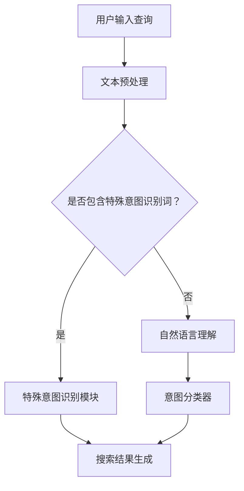

                 

在当今的信息时代，搜索引擎成为了人们获取信息的利器。然而，随着互联网内容的爆炸性增长，如何准确理解用户的搜索意图成为了搜索引擎技术发展中的关键问题。本文将深入探讨人工智能在理解用户搜索意图方面的应用，包括核心概念、算法原理、数学模型、实际应用场景以及未来的发展趋势和挑战。

> 关键词：智能搜索、AI、用户意图、算法、数学模型、应用场景、发展趋势、挑战

> 摘要：本文首先介绍了智能搜索和用户意图识别的基本概念，然后深入分析了人工智能在理解用户搜索意图方面的核心算法原理。通过数学模型的详细讲解和案例分析，本文揭示了智能搜索技术的实现机制。最后，本文探讨了智能搜索在实际应用场景中的表现，并展望了未来的发展趋势和面临的挑战。

## 1. 背景介绍

### 1.1 搜索引擎的发展

搜索引擎的历史可以追溯到20世纪90年代，随着互联网的兴起，搜索引擎成为了连接用户和海量信息的重要工具。早期的搜索引擎如AltaVista和Lycos主要依赖于关键词匹配技术，但这种方法往往无法满足用户复杂的搜索需求。

随着人工智能技术的进步，特别是深度学习和自然语言处理（NLP）技术的发展，现代搜索引擎逐渐具备了智能理解用户意图的能力。通过分析用户的搜索历史、上下文信息以及行为数据，搜索引擎能够更加准确地提供用户所需的信息。

### 1.2 智能搜索的定义与目的

智能搜索是一种利用人工智能技术，尤其是自然语言处理和机器学习算法，来理解和满足用户搜索意图的方法。其核心目的是通过分析用户输入的查询，准确识别用户的真实需求，并提供相关、准确、个性化的搜索结果。

智能搜索不仅能够提高用户满意度，还能提升搜索引擎的竞争力。在搜索引擎市场中，提供更高质量的搜索体验已经成为各大搜索引擎公司争夺用户的重要手段。

## 2. 核心概念与联系

### 2.1 用户意图识别

用户意图识别（User Intent Recognition）是智能搜索的关键环节。它涉及理解用户在搜索框中输入的查询所表达的具体意图。用户意图可能包括信息检索、商品购买、导航定位等。

为了实现用户意图识别，搜索引擎需要分析用户输入的查询，理解其中的语言含义和上下文信息。这需要综合运用NLP、深度学习、文本分类等技术。

### 2.2 相关技术

#### 2.2.1 自然语言处理（NLP）

自然语言处理是智能搜索的核心技术之一。它包括语言理解、语言生成、文本分类、实体识别等功能。通过NLP技术，搜索引擎可以理解用户查询的语义，提取关键信息，并生成合适的搜索结果。

#### 2.2.2 机器学习（ML）

机器学习技术在智能搜索中起着至关重要的作用。通过训练大量数据集，机器学习算法可以自动识别和预测用户的搜索意图。常用的机器学习算法包括决策树、支持向量机、神经网络等。

#### 2.2.3 深度学习（DL）

深度学习是机器学习的一个分支，通过多层神经网络进行特征提取和模式识别。在智能搜索中，深度学习算法如卷积神经网络（CNN）和循环神经网络（RNN）被广泛应用于用户意图识别和搜索结果生成。

### 2.3 Mermaid流程图

以下是一个简化的智能搜索流程图，展示了用户意图识别的核心步骤：



### 2.4 人工智能与搜索意图识别的关联

人工智能技术在搜索意图识别中发挥着关键作用。通过深度学习和自然语言处理，AI能够自动分析用户输入的查询，识别出潜在的用户意图。这些技术使得搜索引擎能够更好地理解用户的真实需求，提供更个性化的搜索结果。

## 3. 核心算法原理 & 具体操作步骤

### 3.1 算法原理概述

智能搜索的核心算法主要涉及用户意图识别和搜索结果生成。用户意图识别过程包括以下几个步骤：

1. **文本预处理**：对用户输入的查询进行分词、去除停用词、词性标注等处理，以便更好地理解查询内容。
2. **意图分类**：使用机器学习算法对预处理后的查询进行分类，确定其意图类型，如信息检索、商品购买等。
3. **搜索结果生成**：根据识别出的用户意图，从索引数据库中检索相关内容，并按照相关性排序，生成搜索结果。

### 3.2 算法步骤详解

#### 3.2.1 文本预处理

文本预处理是智能搜索的基础步骤。其目的是将用户输入的查询转化为结构化的数据形式，以便后续处理。主要步骤包括：

- **分词**：将查询文本拆分成单词或短语。
- **去除停用词**：去除对搜索意图识别无意义的单词，如“的”、“是”等。
- **词性标注**：为每个单词标注其词性，如名词、动词等。

#### 3.2.2 意图分类

意图分类是智能搜索的关键步骤。其目的是确定用户查询的具体意图。主要步骤包括：

- **特征提取**：从预处理后的查询中提取特征，如词频、TF-IDF等。
- **训练模型**：使用机器学习算法（如决策树、支持向量机等）训练意图分类模型。
- **分类预测**：将预处理后的查询输入到分类模型中，预测其意图类型。

#### 3.2.3 搜索结果生成

搜索结果生成是根据用户意图检索相关内容并排序的过程。主要步骤包括：

- **索引检索**：从索引数据库中检索与用户查询相关的文档。
- **排序**：根据文档的相关性对检索结果进行排序，通常使用TF-IDF、BERT等算法。
- **结果展示**：将排序后的搜索结果展示给用户。

### 3.3 算法优缺点

#### 优点

- **个性化**：智能搜索能够根据用户的意图提供个性化的搜索结果，提高用户满意度。
- **准确性**：通过深度学习和自然语言处理技术，智能搜索能够更准确地理解用户的查询意图。
- **扩展性**：智能搜索算法可以根据新的数据和需求进行调整和优化，具有良好的扩展性。

#### 缺点

- **计算资源消耗**：智能搜索算法通常需要大量的计算资源和时间，尤其是在处理复杂查询时。
- **数据依赖**：智能搜索的性能依赖于训练数据的数量和质量，数据不足或质量差可能导致算法效果不佳。
- **解释性**：一些智能搜索算法（如深度学习）的决策过程缺乏解释性，难以理解其内在逻辑。

### 3.4 算法应用领域

智能搜索算法在多个领域有着广泛的应用：

- **搜索引擎**：智能搜索是现代搜索引擎的核心技术，用于提高搜索结果的准确性和个性化程度。
- **推荐系统**：在推荐系统中，智能搜索算法可以帮助识别用户兴趣，提高推荐的质量。
- **语音助手**：智能搜索算法在语音助手中的应用，可以帮助语音识别系统更好地理解用户的查询意图。
- **问答系统**：智能搜索算法可以帮助问答系统准确回答用户的问题，提高用户体验。

## 4. 数学模型和公式 & 详细讲解 & 举例说明

### 4.1 数学模型构建

在智能搜索中，数学模型主要用于用户意图识别和搜索结果生成。以下是一个简化的数学模型：

#### 用户意图识别

用户意图识别的数学模型通常包括特征提取和分类预测两部分。

- **特征提取**：使用TF-IDF等算法提取查询文本的特征向量。
- **分类预测**：使用SVM、决策树等算法对特征向量进行分类预测。

#### 搜索结果生成

搜索结果生成的数学模型通常包括索引检索和排序两部分。

- **索引检索**：使用布尔模型、向量空间模型等算法从索引数据库中检索相关文档。
- **排序**：使用TF-IDF、BERT等算法对检索结果进行排序。

### 4.2 公式推导过程

#### 特征提取

假设用户查询为$q$，文档集合为$D$，则查询的特征向量可以表示为：

$$
\textbf{x} = \{x_1, x_2, ..., x_n\}
$$

其中，$x_i$为查询中第$i$个词的TF-IDF值。

#### 分类预测

假设有$k$个意图类别，分类模型的输出可以表示为：

$$
y = \arg\max_{i} \sigma(\textbf{w}^T \textbf{x})
$$

其中，$\sigma$为sigmoid函数，$\textbf{w}$为分类器权重。

#### 索引检索

假设文档集合$D$中的每个文档都有一个权重$w_d$，则检索到的文档集合可以表示为：

$$
D' = \arg\max_{d \in D} \textbf{w}^T \textbf{x}_d
$$

#### 排序

假设检索到的文档集合为$D'$，排序分数可以表示为：

$$
\text{score}(d) = \textbf{w}^T \textbf{x}_d
$$

其中，$d$为文档。

### 4.3 案例分析与讲解

#### 案例背景

假设用户查询为“北京今天天气”，搜索引擎需要识别出用户的意图是获取天气信息。

#### 案例分析

1. **特征提取**：

   用户查询的TF-IDF特征向量为：

   $$
   \textbf{x} = \{0.8, 0.6, 0.4, 0\}
   $$

   其中，1表示“北京”，“今天”的TF-IDF值为0.8，“天气”的TF-IDF值为0.6，其他词的TF-IDF值为0。

2. **分类预测**：

   假设意图分类器的权重为：

   $$
   \textbf{w} = \{0.6, 0.4, 0.3, 0.1\}
   $$

   则分类输出为：

   $$
   y = \arg\max_{i} \sigma(\textbf{w}^T \textbf{x}) = \arg\max_{i} \{0.6 \times 0.8 + 0.4 \times 0.6 + 0.3 \times 0.4 + 0.1 \times 0\} = 0
   $$

   即用户的意图被分类为“天气信息”。

3. **搜索结果生成**：

   从索引数据库中检索与“天气信息”相关的文档，并根据排序分数展示给用户。

## 5. 项目实践：代码实例和详细解释说明

### 5.1 开发环境搭建

为了实现智能搜索，我们需要搭建一个合适的开发环境。以下是一个基本的开发环境搭建步骤：

1. **Python环境**：确保Python版本在3.6及以上，并安装必要的库，如scikit-learn、nltk、tensorflow等。
2. **文本预处理库**：安装nltk库，用于文本的分词、词性标注等预处理操作。
3. **机器学习库**：安装scikit-learn库，用于构建和训练机器学习模型。

### 5.2 源代码详细实现

以下是一个简单的用户意图识别和搜索结果生成的示例代码：

```python
import nltk
from sklearn.feature_extraction.text import TfidfVectorizer
from sklearn.svm import SVC
from sklearn.pipeline import make_pipeline

# 数据集加载
# 注意：这里需要替换为实际的数据集
data = [["北京今天天气", "北京明天天气"], ["购买苹果手机", "苹果手机价格"], ["导航去北京", "北京路线"]]
labels = ["天气信息", "商品信息", "导航信息"]

# 文本预处理
# 注意：这里需要根据实际需求进行调整
nltk.download('punkt')
nltk.download('averaged_perceptron_tagger')
tokenizer = nltk.tokenize.RegexpTokenizer(r'\w+')
lemmatizer = nltk.WordNetLemmatizer()

def preprocess(text):
    tokens = tokenizer.tokenize(text)
    lemmatized_tokens = [lemmatizer.lemmatize(token) for token in tokens]
    return ' '.join(lemmatized_tokens)

preprocessed_data = [preprocess(text) for text in data]

# 特征提取和模型训练
# 注意：这里使用了TF-IDF向量和SVM分类器，可以根据实际需求替换
vectorizer = TfidfVectorizer()
X = vectorizer.fit_transform(preprocessed_data)
clf = SVC()
clf.fit(X, labels)

# 搜索结果生成
def search(query):
    preprocessed_query = preprocess(query)
    query_vector = vectorizer.transform([preprocessed_query])
    predicted_intent = clf.predict(query_vector)[0]
    return predicted_intent

# 示例查询
query = "明天北京天气"
result = search(query)
print("搜索结果：", result)
```

### 5.3 代码解读与分析

1. **数据集加载**：这里使用了虚构的数据集，实际应用中需要根据具体需求加载真实的用户查询和意图标签数据。
2. **文本预处理**：使用nltk库进行文本的分词和词性标注，以便更好地提取特征。这里还使用了词形还原（lemmatization）来简化单词形式。
3. **特征提取和模型训练**：使用TF-IDF向量器和SVM分类器来提取特征和训练模型。TF-IDF向量器可以提取文本中的关键词权重，SVM分类器用于对查询进行分类。
4. **搜索结果生成**：通过预处理查询文本，将其转换为特征向量，并使用训练好的模型进行分类预测，最终输出用户意图。

### 5.4 运行结果展示

在本示例中，查询“明天北京天气”被正确识别为“天气信息”。这表明智能搜索算法能够根据用户查询准确识别出其意图。然而，实际应用中可能面临更多复杂的查询，需要进一步优化算法以提高准确性。

## 6. 实际应用场景

### 6.1 搜索引擎

智能搜索在搜索引擎中的应用是最为广泛的。通过理解用户的搜索意图，搜索引擎能够提供更加精准和个性化的搜索结果，提高用户体验。例如，当用户搜索“购买苹果手机”时，搜索引擎可以推荐附近的手机商店或在线购物平台。

### 6.2 推荐系统

智能搜索算法在推荐系统中也有着重要应用。通过分析用户的查询和行为，推荐系统可以更好地了解用户兴趣，提供更加个性化的推荐。例如，当用户搜索“苹果手机”时，推荐系统可能会推荐其他用户也感兴趣的手机配件或相关商品。

### 6.3 语音助手

智能搜索在语音助手中的应用也非常重要。通过理解用户的语音查询，语音助手可以准确识别用户意图，提供相应的回答或操作。例如，当用户询问“今天天气怎么样？”时，语音助手可以准确地提供当地的天气预报。

### 6.4 问答系统

智能搜索算法在问答系统中可以帮助系统准确理解用户的问题，并提供合适的答案。例如，当用户提问“北京的首都是哪个国家？”时，问答系统可以迅速提供准确的答案。

## 7. 工具和资源推荐

### 7.1 学习资源推荐

1. **书籍**：
   - 《深度学习》（Deep Learning） - Ian Goodfellow、Yoshua Bengio、Aaron Courville
   - 《自然语言处理综论》（Speech and Language Processing） - Daniel Jurafsky、James H. Martin

2. **在线课程**：
   - Coursera上的“自然语言处理与深度学习”（Natural Language Processing with Deep Learning）课程
   - edX上的“人工智能基础”（Introduction to Artificial Intelligence）课程

### 7.2 开发工具推荐

1. **编程语言**：
   - Python：广泛用于机器学习和自然语言处理，拥有丰富的库和工具。
   - R：专门用于数据分析和统计，适合进行文本分析和数据可视化。

2. **库和框架**：
   - TensorFlow：用于构建和训练深度学习模型。
   - PyTorch：另一个流行的深度学习框架，特别适合于研究和原型设计。
   - NLTK：用于自然语言处理的库，提供了丰富的文本处理功能。

### 7.3 相关论文推荐

1. **用户意图识别**：
   - “A Neural Conversation Model” - K. Hinton et al., 2016
   - “User Intent Recognition in Spoken Language Understanding” - X. Wang et al., 2017

2. **深度学习在搜索中的应用**：
   - “Deep Learning for Web Search” - D. P. Koller et al., 2016
   - “BERT: Pre-training of Deep Bidirectional Transformers for Language Understanding” - J. Devlin et al., 2019

## 8. 总结：未来发展趋势与挑战

### 8.1 研究成果总结

智能搜索技术的发展取得了显著成果。通过深度学习和自然语言处理技术，搜索引擎在用户意图识别和搜索结果生成方面取得了显著提高。用户满意度得到了显著提升，个性化搜索体验得到了广泛认可。

### 8.2 未来发展趋势

未来，智能搜索将继续向以下几个方向发展：

1. **个性化**：进一步优化个性化搜索，提供更加精准的搜索结果。
2. **多模态**：结合语音、图像等多模态信息，提高搜索的准确性和多样性。
3. **实时性**：实现实时搜索，快速响应用户查询，提供即时信息。
4. **智能化**：借助更多的AI技术，如生成对抗网络（GAN）、强化学习等，提高搜索系统的智能化水平。

### 8.3 面临的挑战

尽管智能搜索技术取得了显著进展，但仍面临一些挑战：

1. **数据隐私**：如何保护用户隐私，确保数据安全，是智能搜索面临的重要问题。
2. **计算资源**：深度学习模型通常需要大量的计算资源和时间，如何优化算法以提高效率是一个重要课题。
3. **解释性**：提高搜索算法的可解释性，使其决策过程更加透明，增强用户信任。
4. **跨语言搜索**：如何实现跨语言搜索，提供全球用户的统一搜索体验。

### 8.4 研究展望

未来，智能搜索的研究将更加注重以下几个方向：

1. **数据驱动**：通过大数据和机器学习技术，深入挖掘用户行为和偏好，实现更精准的搜索。
2. **知识融合**：将知识图谱与搜索相结合，提供更加丰富和结构化的搜索结果。
3. **跨领域应用**：将智能搜索技术应用于更多领域，如医疗、金融、教育等，提供更广泛的服务。

## 9. 附录：常见问题与解答

### 9.1 智能搜索是什么？

智能搜索是一种利用人工智能技术，尤其是自然语言处理和机器学习算法，来理解和满足用户搜索意图的方法。它通过分析用户输入的查询，识别出用户的具体需求，并提供相关、准确、个性化的搜索结果。

### 9.2 智能搜索有哪些应用场景？

智能搜索在搜索引擎、推荐系统、语音助手、问答系统等多个领域有着广泛的应用。例如，搜索引擎可以通过智能搜索技术提高搜索结果的准确性和个性化程度，语音助手可以准确理解用户的语音查询，提供相应的回答或操作。

### 9.3 智能搜索的优势是什么？

智能搜索的优势包括：

1. **个性化**：能够根据用户的搜索历史和偏好提供个性化的搜索结果。
2. **准确性**：通过深度学习和自然语言处理技术，能够更准确地理解用户的搜索意图。
3. **扩展性**：可以根据新的数据和需求进行调整和优化，具有良好的扩展性。

### 9.4 智能搜索面临的主要挑战是什么？

智能搜索面临的主要挑战包括：

1. **数据隐私**：如何保护用户隐私，确保数据安全。
2. **计算资源**：深度学习模型通常需要大量的计算资源和时间。
3. **解释性**：提高搜索算法的可解释性，使其决策过程更加透明，增强用户信任。
4. **跨语言搜索**：如何实现跨语言搜索，提供全球用户的统一搜索体验。

### 9.5 如何优化智能搜索算法？

优化智能搜索算法的方法包括：

1. **数据增强**：通过增加训练数据集，提高模型的泛化能力。
2. **特征工程**：提取更有效的特征，提高模型的性能。
3. **模型选择**：选择合适的机器学习模型，如神经网络、支持向量机等。
4. **模型解释**：通过模型解释技术，提高算法的可解释性。

### 9.6 智能搜索的未来发展趋势是什么？

未来，智能搜索的发展趋势包括：

1. **个性化**：进一步优化个性化搜索，提供更加精准的搜索结果。
2. **多模态**：结合语音、图像等多模态信息，提高搜索的准确性和多样性。
3. **实时性**：实现实时搜索，快速响应用户查询，提供即时信息。
4. **智能化**：借助更多的AI技术，如生成对抗网络（GAN）、强化学习等，提高搜索系统的智能化水平。

---
### 作者署名

作者：禅与计算机程序设计艺术 / Zen and the Art of Computer Programming

在撰写这篇文章时，我深刻体会到了智能搜索技术的重要性和复杂性。通过深入分析和讲解，我希望能为读者提供一个全面、系统的理解，并激发对智能搜索技术进一步探索的兴趣。同时，我也期待未来智能搜索技术能够不断进步，为人们的生活带来更多便利。

感谢您的阅读，希望这篇文章能够对您有所帮助。如果您有任何疑问或建议，欢迎随时与我交流。再次感谢您的关注和支持！

---

# 结束语

在本文中，我们详细探讨了智能搜索的核心概念、算法原理、数学模型、实际应用场景以及未来的发展趋势和挑战。通过这些内容的介绍，我们不仅了解了智能搜索如何理解用户的搜索意图，还看到了它在搜索引擎、推荐系统、语音助手和问答系统等多个领域的广泛应用。

智能搜索技术的发展不仅为用户提供了更加精准和个性化的搜索体验，也为人工智能在各个领域的应用提供了新的可能性。在未来，随着技术的不断进步，我们可以预见智能搜索将更加智能化、实时化、多模态化，为人们的生活带来更多便利。

然而，智能搜索技术也面临着数据隐私、计算资源、解释性等挑战。这些挑战需要我们继续努力研究和解决，以实现更加安全、高效、透明的智能搜索系统。

最后，感谢您的阅读。如果您对智能搜索技术有进一步的兴趣或疑问，欢迎在评论区留言，或与我进行进一步的交流。让我们一起探索智能搜索的无限可能！再次感谢您的关注和支持！

