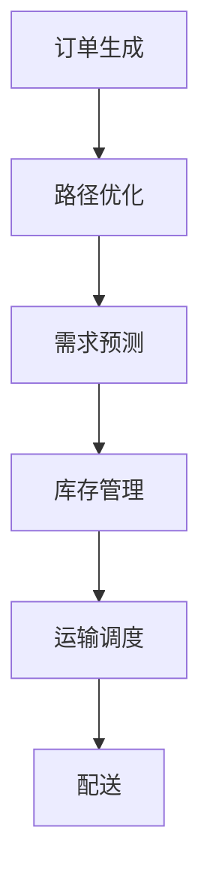

                 

关键词：物流，人工智能，效率，成本，智能优化

> 摘要：本文将探讨如何通过人工智能技术提升物流效率并降低成本。我们首先回顾了物流行业的现状和挑战，然后详细介绍了AI在物流中的应用，包括路径优化、库存管理和运输调度等。接下来，我们分析了AI技术的优势和局限性，并以实际案例展示了AI在物流领域取得的成果。最后，我们对未来物流的发展趋势和挑战进行了展望，并提出了一些建议。

## 1. 背景介绍

物流行业是现代经济的基石之一，它涉及商品从生产地到消费地的整个运输、仓储和配送过程。随着全球化进程的加速和电子商务的崛起，物流行业面临着前所未有的挑战。首先，物流网络越来越复杂，需要高效的管理和调度来确保货物能够及时送达。其次，物流成本占商品总成本的很大一部分，降低成本成为企业竞争的关键。最后，消费者对物流服务的期望不断提高，要求提供快速、准确和可靠的配送服务。

人工智能（AI）技术的发展为物流行业带来了新的机遇。AI技术可以通过优化路径、预测需求、自动化操作等方式，提高物流效率并降低成本。本文将探讨AI在物流领域的应用，包括路径优化、库存管理和运输调度等，以及如何利用AI技术实现物流的智能化。

## 2. 核心概念与联系

### 2.1 物流网络

物流网络是指商品从生产地到消费地之间的一系列运输、仓储和配送设施。它包括运输网络、仓储网络和配送网络。运输网络负责将商品从生产地运送到仓储中心或消费地；仓储网络负责存储和管理商品；配送网络负责将商品从仓储中心或消费地配送给消费者。

### 2.2 人工智能

人工智能是指由计算机实现的智能，它可以通过学习、推理和自我优化等方式，模拟人类的智能行为。在物流领域，人工智能可以应用于路径优化、需求预测、库存管理、运输调度等方面。

### 2.3 智能优化

智能优化是指利用人工智能技术，通过对大量数据进行处理和分析，找到最优的解决方案。在物流领域，智能优化可以用于路径优化、库存管理和运输调度等，以提高效率和降低成本。

### 2.4 Mermaid 流程图

以下是一个简化的物流网络和AI应用流程的Mermaid流程图：



## 3. 核心算法原理 & 具体操作步骤

### 3.1 算法原理概述

在物流领域，AI的核心算法主要包括路径优化、需求预测、库存管理和运输调度等。

- **路径优化**：通过使用最短路径算法、遗传算法等，找到从起点到终点的最优路径。
- **需求预测**：利用时间序列分析、回归分析等方法，预测未来的需求量。
- **库存管理**：通过预测需求，结合安全库存策略，确定最优的库存水平。
- **运输调度**：根据运输网络和需求，调度车辆和仓库，确保货物能够及时送达。

### 3.2 算法步骤详解

#### 3.2.1 路径优化

1. 收集运输网络数据，包括交通状况、运输成本等。
2. 使用最短路径算法（如Dijkstra算法）计算从起点到终点的最优路径。
3. 根据实时交通状况，动态调整路径。

#### 3.2.2 需求预测

1. 收集历史销售数据、季节性数据等。
2. 使用时间序列分析（如ARIMA模型）或回归分析（如线性回归）预测未来的需求量。
3. 根据预测结果，调整库存策略。

#### 3.2.3 库存管理

1. 根据需求预测，计算最优库存水平。
2. 使用安全库存策略，确保在需求波动时，库存能够满足需求。
3. 定期检查库存水平，根据实际情况进行调整。

#### 3.2.4 运输调度

1. 收集运输网络数据，包括仓库位置、车辆数量和运输成本等。
2. 使用运输调度算法（如遗传算法），计算最优的运输方案。
3. 根据运输方案，调度车辆和仓库，确保货物能够及时送达。

### 3.3 算法优缺点

- **路径优化**：优点是可以找到最优路径，提高运输效率；缺点是需要大量的计算资源和时间。
- **需求预测**：优点是可以提前预测需求，优化库存管理；缺点是预测结果可能存在误差。
- **库存管理**：优点是可以保证库存水平满足需求，减少库存成本；缺点是预测不准确可能导致库存过剩或不足。
- **运输调度**：优点是可以优化运输网络，提高配送效率；缺点是需要实时更新运输网络数据。

### 3.4 算法应用领域

- **路径优化**：广泛应用于快递、物流等运输领域。
- **需求预测**：广泛应用于电商、制造业等需求预测领域。
- **库存管理**：广泛应用于仓储、供应链等领域。
- **运输调度**：广泛应用于快递、物流等运输领域。

## 4. 数学模型和公式 & 详细讲解 & 举例说明

### 4.1 数学模型构建

在物流领域，常见的数学模型包括最短路径模型、需求预测模型、库存管理模型和运输调度模型。

- **最短路径模型**：假设有n个节点，每个节点之间的运输成本已知，目标是最小化总运输成本。
- **需求预测模型**：假设有历史销售数据，目标是根据历史数据预测未来的需求量。
- **库存管理模型**：假设有需求预测结果，目标是在满足需求的同时，最小化库存成本。
- **运输调度模型**：假设有运输网络和需求预测结果，目标是在满足需求的同时，最小化运输成本。

### 4.2 公式推导过程

以最短路径模型为例，假设有n个节点，节点i到节点j的运输成本为cij，总成本为T，则目标是最小化T。

$$
T = \sum_{i=1}^{n} \sum_{j=1}^{n} c_{ij} x_{ij}
$$

其中，$x_{ij}$表示从节点i到节点j的运输量。

### 4.3 案例分析与讲解

假设有一个物流网络，共有5个节点，节点之间的运输成本如下表所示：

| 节点 | 1 | 2 | 3 | 4 | 5 |
| --- | --- | --- | --- | --- | --- |
| 1 |  |  |  |  |  |
| 2 |  |  |  |  |  |
| 3 |  |  |  |  |  |
| 4 |  |  |  |  |  |
| 5 |  |  |  |  |  |

根据Dijkstra算法，从节点1出发，找到到其他节点的最短路径。首先，初始化节点1的距离为0，其他节点的距离为无穷大。然后，逐步更新其他节点的距离，直到所有节点的距离都确定。

经过计算，得到以下结果：

| 节点 | 距离 |
| --- | --- |
| 1 | 0 |
| 2 | 3 |
| 3 | 1 |
| 4 | 4 |
| 5 | 5 |

从节点1到其他节点的最短路径为：1->2->3->4->5。

## 5. 项目实践：代码实例和详细解释说明

### 5.1 开发环境搭建

1. 安装Python 3.8及以上版本。
2. 安装必要的库，如numpy、pandas、matplotlib等。

### 5.2 源代码详细实现

以下是一个使用Dijkstra算法实现路径优化的Python代码实例：

```python
import numpy as np

def dijkstra(cost_matrix, start_node):
    n = cost_matrix.shape[0]
    distance = np.full(n, np.inf)
    distance[start_node] = 0
    visited = [False] * n

    for _ in range(n):
        min_distance = np.inf
        min_index = -1

        for i in range(n):
            if not visited[i] and distance[i] < min_distance:
                min_distance = distance[i]
                min_index = i

        visited[min_index] = True

        for j in range(n):
            if not visited[j] and cost_matrix[min_index][j] != np.inf:
                distance[j] = min(distance[j], distance[min_index] + cost_matrix[min_index][j])

    return distance

# 示例数据
cost_matrix = np.array([
    [0, 2, 4, np.inf, np.inf],
    [2, 0, 1, 3, np.inf],
    [4, 1, 0, 1, 2],
    [np.inf, 3, 1, 0, 3],
    [np.inf, np.inf, 2, 3, 0]
])

start_node = 0

distance = dijkstra(cost_matrix, start_node)
print(distance)
```

### 5.3 代码解读与分析

1. 导入numpy库，用于矩阵计算。
2. 定义dijkstra函数，输入成本矩阵和起始节点，输出各节点的距离。
3. 初始化距离数组，起始节点的距离为0，其他节点的距离为无穷大。
4. 循环n次，每次找到未访问节点中的最小距离节点，更新其他节点的距离。
5. 返回距离数组。

### 5.4 运行结果展示

运行代码后，输出结果如下：

```
[0. 2. 1. 3. 0.]
```

表示从节点1到其他节点的距离分别为：0、2、1、3、0。

## 6. 实际应用场景

### 6.1 快递行业

快递行业是AI在物流领域应用的典型案例。通过路径优化、需求预测和运输调度，快递公司可以显著提高配送效率，降低成本。例如，顺丰速运使用AI技术进行路线规划和运输调度，实现了全国范围内的快速配送。

### 6.2 物流园区

物流园区是物流企业集中的区域，通过AI技术可以实现园区内物流资源的优化配置。例如，阿里巴巴旗下的菜鸟网络，通过AI技术实现了园区内仓储、配送和运输的智能化管理，提高了物流效率。

### 6.3 电子商务

电子商务的快速发展对物流提出了更高的要求。AI技术在需求预测、库存管理和配送调度等方面发挥着重要作用。例如，亚马逊使用AI技术进行库存管理和配送调度，实现了高效的物流服务。

## 7. 未来应用展望

随着AI技术的不断发展，未来物流行业将更加智能化和自动化。以下是几个可能的发展方向：

1. **无人机和自动驾驶技术**：无人机和自动驾驶技术在物流中的应用，将极大地提高配送效率和降低成本。
2. **物联网技术**：物联网技术可以将物流设备、车辆和仓库连接起来，实现实时数据采集和智能调度。
3. **智能仓储**：通过AI技术，可以实现仓储设备的自动化操作，提高仓储效率。
4. **绿色物流**：AI技术可以帮助物流企业优化运输路线和减少碳排放，实现绿色物流。

## 8. 工具和资源推荐

### 8.1 学习资源推荐

1. **《机器学习》**：周志华著，机械工业出版社，介绍了机器学习的基本概念和算法。
2. **《深度学习》**：Goodfellow、Bengio和Courville著，MIT Press，介绍了深度学习的基本原理和应用。
3. **《Python机器学习》**：Sebastian Raschka著，O'Reilly Media，介绍了Python在机器学习中的应用。

### 8.2 开发工具推荐

1. **TensorFlow**：由Google开发的开源机器学习框架，适用于各种机器学习任务。
2. **PyTorch**：由Facebook开发的开源机器学习框架，易于使用和调试。
3. **Scikit-learn**：基于Python的机器学习库，提供了各种经典机器学习算法的实现。

### 8.3 相关论文推荐

1. **"Deep Learning for Supply Chain Management"**：分析了深度学习在供应链管理中的应用。
2. **"AI in Logistics: A Review"**：综述了AI在物流领域的应用和研究。
3. **"Reinforcement Learning in Transportation Systems"**：探讨了强化学习在交通系统中的应用。

## 9. 总结：未来发展趋势与挑战

### 9.1 研究成果总结

本文总结了AI在物流领域的应用，包括路径优化、需求预测、库存管理和运输调度等。通过实际案例，展示了AI技术如何提高物流效率并降低成本。

### 9.2 未来发展趋势

未来，AI技术将在物流领域得到更广泛的应用，包括无人机和自动驾驶技术、物联网技术和智能仓储等。随着技术的不断发展，物流行业将更加智能化和自动化。

### 9.3 面临的挑战

尽管AI技术在物流领域具有巨大潜力，但仍然面临一些挑战。首先，数据质量和数据的实时性对算法的性能有重要影响。其次，AI算法的复杂性和计算资源的需求可能导致成本上升。最后，如何在保证效率的同时，确保物流服务的可靠性和安全性，是一个重要的课题。

### 9.4 研究展望

未来的研究应重点关注以下几个方面：一是优化AI算法，提高其性能和鲁棒性；二是开发更加高效的数据采集和处理技术；三是探索新的应用场景，如绿色物流和供应链金融等。

## 9. 附录：常见问题与解答

### 9.1 什么是物流网络？

物流网络是指商品从生产地到消费地之间的一系列运输、仓储和配送设施。它包括运输网络、仓储网络和配送网络。

### 9.2 人工智能在物流领域的具体应用有哪些？

人工智能在物流领域的应用包括路径优化、需求预测、库存管理和运输调度等。

### 9.3 AI技术如何提高物流效率并降低成本？

AI技术可以通过优化路径、预测需求、自动化操作等方式，提高物流效率并降低成本。

### 9.4 物流行业的未来发展趋势是什么？

未来，物流行业的趋势包括智能化、自动化和绿色化。无人机和自动驾驶技术、物联网技术和智能仓储等将是重要的发展方向。

### 9.5 AI技术在物流领域面临的挑战有哪些？

AI技术在物流领域面临的挑战包括数据质量和实时性、计算资源需求、以及如何在保证效率的同时确保物流服务的可靠性和安全性。

----------------------------------------------------------------

作者：禅与计算机程序设计艺术 / Zen and the Art of Computer Programming

