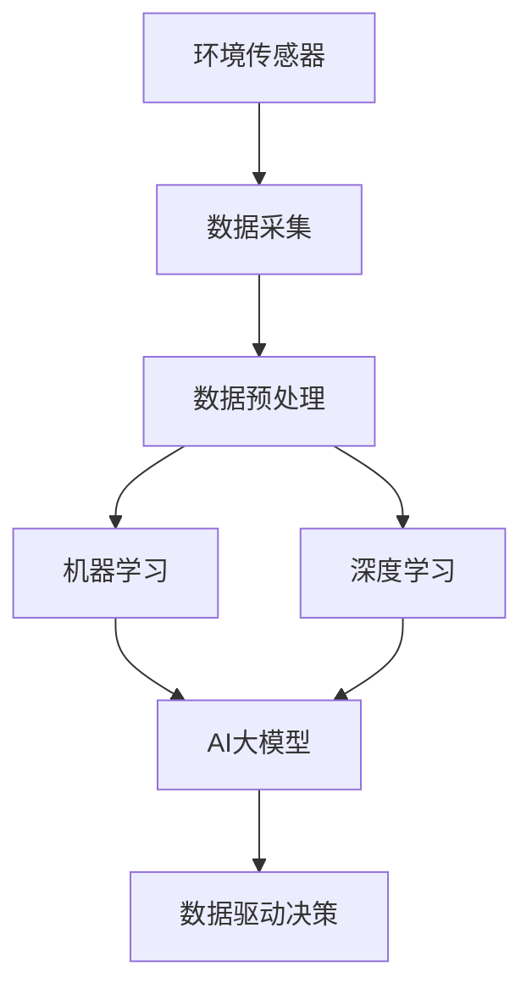

                 

关键词：智能环境监测，AI大模型，解决方案，环境数据，数据分析，机器学习，深度学习，环境传感器，物联网，数据驱动决策

> 摘要：本文深入探讨了智能环境监测的AI大模型解决方案，详细介绍了基于机器学习和深度学习技术构建环境监测大模型的方法，以及如何利用这些模型进行实时环境数据分析和数据驱动决策。本文旨在为研究人员和开发者提供有价值的指导和参考，推动智能环境监测技术的发展与应用。

## 1. 背景介绍

随着全球气候变化和环境污染问题的日益严重，智能环境监测变得越来越重要。智能环境监测系统可以实时收集各种环境数据，如空气质量、水质、土壤成分、气象参数等，并通过对这些数据的分析，为环境管理提供科学依据。然而，环境监测数据通常具有高维度、非线性、噪声大等特点，传统的数据分析方法难以应对这些挑战。

近年来，机器学习和深度学习技术的飞速发展为环境监测提供了新的解决方案。AI大模型，特别是深度学习模型，通过学习大量的环境监测数据，可以自动识别环境数据的规律和特征，从而实现对复杂环境问题的精确监测和预测。本文将介绍一种基于AI大模型的智能环境监测解决方案，旨在为环境监测领域的研究和实践提供有益的参考。

## 2. 核心概念与联系

为了更好地理解智能环境监测的AI大模型解决方案，我们需要首先介绍一些核心概念和它们之间的关系。

### 2.1 环境数据与环境传感器

环境数据是指各种与自然环境相关的数据，如空气质量数据、水质数据、土壤成分数据、气象参数数据等。这些数据通常通过环境传感器进行采集。环境传感器是一种能够检测和测量环境参数的设备，如空气质量传感器、水质传感器、气象传感器等。环境传感器将检测到的环境数据转换为电信号，然后通过数据采集设备传输到计算机系统进行处理。

### 2.2 数据预处理

由于环境监测数据通常具有高维度、噪声大、缺失值等问题，因此需要对数据进行预处理。数据预处理包括数据清洗、数据集成、数据变换等步骤。数据清洗旨在去除噪声和异常值，数据集成是将来自不同传感器的数据进行整合，数据变换则是将数据转换为适合机器学习和深度学习模型输入的形式。

### 2.3 机器学习和深度学习

机器学习是一种让计算机通过学习数据来获取知识和技能的技术。深度学习是机器学习的一个分支，它通过多层神经网络模型学习数据的复杂特征和模式。机器学习和深度学习技术可以自动识别环境数据的规律和特征，从而实现对复杂环境问题的监测和预测。

### 2.4 AI大模型

AI大模型是指具有大规模参数和强学习能力的深度学习模型。AI大模型通过学习大量的环境监测数据，可以自动识别环境数据的规律和特征，从而实现对复杂环境问题的精确监测和预测。AI大模型通常具有以下特点：

- **大规模参数**：AI大模型具有数十亿甚至数万亿个参数，这使得它们能够捕捉数据中的细微变化和复杂模式。
- **强学习能力**：AI大模型通过不断迭代和学习，能够不断提高对环境数据的理解和预测能力。
- **实时性**：AI大模型能够实时处理和预测环境数据，为环境管理提供及时的科学依据。

### 2.5 数据驱动决策

数据驱动决策是指利用环境监测数据，通过机器学习和深度学习模型的分析和预测，为环境管理提供决策支持。数据驱动决策可以大幅提高环境管理的科学性和效率，有助于实现精准环境治理。

### 2.6 Mermaid流程图

为了更直观地展示智能环境监测的AI大模型解决方案的核心概念和联系，我们可以使用Mermaid流程图进行描述。



## 3. 核心算法原理 & 具体操作步骤

### 3.1 算法原理概述

智能环境监测的AI大模型解决方案的核心在于构建一个具有强大学习能力的深度学习模型，该模型能够从大量的环境监测数据中自动提取特征和模式，实现对复杂环境问题的监测和预测。具体来说，该解决方案包括以下几个关键步骤：

1. **数据采集**：利用各种环境传感器收集环境数据。
2. **数据预处理**：对采集到的环境数据进行清洗、集成和变换，为后续的机器学习和深度学习建模做准备。
3. **特征提取**：使用深度学习模型从预处理后的环境数据中自动提取特征。
4. **模型训练**：使用训练集数据训练深度学习模型，使其能够学会识别环境数据的规律和特征。
5. **模型评估**：使用测试集数据评估模型的性能，包括准确性、召回率、F1分数等指标。
6. **模型部署**：将训练好的模型部署到环境监测系统中，实现对实时环境数据的分析和预测。

### 3.2 算法步骤详解

#### 3.2.1 数据采集

数据采集是智能环境监测的基础。利用各种环境传感器，如空气质量传感器、水质传感器、土壤成分传感器、气象传感器等，可以实时采集环境数据。这些数据通常以时间序列的形式存储，便于后续处理和分析。

#### 3.2.2 数据预处理

数据预处理是确保模型性能的关键步骤。具体包括以下步骤：

1. **数据清洗**：去除噪声和异常值，如传感器故障导致的数据错误。
2. **数据集成**：将来自不同传感器的数据进行整合，如将空气质量数据和气象数据进行合并。
3. **数据变换**：将数据转换为适合机器学习和深度学习模型输入的形式，如将时间序列数据转换为矩阵形式。

#### 3.2.3 特征提取

特征提取是深度学习模型的重要步骤。通过自动提取数据中的关键特征和模式，深度学习模型可以更好地理解环境数据。常见的特征提取方法包括：

1. **卷积神经网络（CNN）**：用于提取空间特征，如图像数据中的纹理和边缘。
2. **循环神经网络（RNN）**：用于提取时间序列特征，如空气质量数据中的变化趋势。
3. **自注意力机制（Self-Attention）**：用于提取数据中的关键特征，提高模型的鲁棒性。

#### 3.2.4 模型训练

模型训练是构建智能环境监测AI大模型的核心步骤。使用预处理后的数据集，通过梯度下降等优化算法，训练深度学习模型。在训练过程中，模型会不断调整其参数，以最小化损失函数，提高模型的预测准确性。

#### 3.2.5 模型评估

模型评估是确保模型性能的重要步骤。使用测试集数据，对训练好的模型进行评估。常用的评估指标包括：

1. **准确性（Accuracy）**：预测正确的样本数量与总样本数量的比值。
2. **召回率（Recall）**：预测正确的正类样本数量与实际正类样本数量的比值。
3. **F1分数（F1 Score）**：准确性和召回率的调和平均值。

#### 3.2.6 模型部署

将训练好的模型部署到环境监测系统中，实现对实时环境数据的分析和预测。部署过程中，需要考虑模型的计算效率和实时性，以确保系统能够及时响应环境变化。

### 3.3 算法优缺点

智能环境监测的AI大模型解决方案具有以下优点：

1. **高准确性**：通过学习大量的环境监测数据，AI大模型能够实现高准确性的环境监测和预测。
2. **强鲁棒性**：AI大模型能够自动提取数据中的关键特征和模式，提高对噪声和异常值的鲁棒性。
3. **实时性**：AI大模型能够实时处理和预测环境数据，为环境管理提供及时的科学依据。

然而，该解决方案也存在一些缺点：

1. **计算资源消耗大**：AI大模型通常需要大量的计算资源和存储空间。
2. **数据依赖性高**：模型的性能很大程度上取决于训练数据的质量和数量。
3. **模型解释性差**：深度学习模型的内部工作机制较为复杂，难以解释其预测结果。

### 3.4 算法应用领域

智能环境监测的AI大模型解决方案可以广泛应用于以下领域：

1. **空气质量监测**：通过实时监测空气质量，为居民提供健康建议，为政府制定环保政策提供依据。
2. **水质监测**：监测水体污染情况，保障饮用水安全，为水资源管理提供支持。
3. **土壤监测**：监测土壤成分变化，为农业生产提供指导，提高农作物产量和质量。
4. **气象预测**：通过分析气象数据，提高天气预报的准确性，减少自然灾害风险。

## 4. 数学模型和公式 & 详细讲解 & 举例说明

### 4.1 数学模型构建

在构建智能环境监测的AI大模型时，我们通常采用深度学习模型，如卷积神经网络（CNN）、循环神经网络（RNN）和自注意力机制（Self-Attention）等。以下是一个简单的数学模型构建过程：

1. **输入层**：输入层接收来自环境传感器的时间序列数据，如空气质量数据、水质数据等。
2. **隐藏层**：隐藏层通过学习数据中的特征和模式，提取关键信息。
3. **输出层**：输出层输出预测结果，如空气质量指数（AQI）、水质污染指数等。

### 4.2 公式推导过程

为了更好地理解数学模型，我们以卷积神经网络（CNN）为例，介绍其基本公式推导过程。

1. **卷积操作**：

   卷积操作是CNN的核心操作，用于提取图像数据中的特征。

   $$ f_{ij}^l = \sum_{k=1}^{m} w_{ik}^l * g_{kj}^{l-1} + b^l $$

   其中，$f_{ij}^l$表示第$l$层第$i$行第$j$列的卷积结果，$w_{ik}^l$表示第$l$层第$i$行第$k$列的卷积核权重，$g_{kj}^{l-1}$表示第$l-1$层第$k$行第$j$列的输入值，$b^l$表示第$l$层的偏置。

2. **激活函数**：

   激活函数用于引入非线性，提高模型的表达能力。

   $$ a_{ij}^l = \sigma(f_{ij}^l) $$

   其中，$a_{ij}^l$表示第$l$层第$i$行第$j$列的激活值，$\sigma$表示激活函数，如ReLU函数。

3. **全连接层**：

   全连接层将隐藏层的特征映射到输出层，进行分类或回归操作。

   $$ z^l_j = \sum_{i=1}^{n} w_{ij}^l * a_{ij}^l + b^l $$

   $$ \hat{y}_j = \sigma(z^l_j) $$

   其中，$z^l_j$表示第$l$层第$j$列的全连接层输出，$w_{ij}^l$表示第$l$层第$i$行第$j$列的全连接层权重，$\hat{y}_j$表示第$l$层第$j$列的预测结果。

### 4.3 案例分析与讲解

假设我们要构建一个空气质量监测的AI大模型，输入数据为一段时间内的空气质量数据（如PM2.5、PM10、SO2、NO2等），输出结果为空气质量指数（AQI）。

1. **数据预处理**：

   将输入数据进行归一化处理，将数据范围缩放到[0, 1]，方便模型学习。

   $$ x_i = \frac{x_i - \text{min}(x)}{\text{max}(x) - \text{min}(x)} $$

2. **模型构建**：

   使用卷积神经网络（CNN）构建模型，如图4.1所示。

   

   其中，输入层有4个神经元，分别对应PM2.5、PM10、SO2、NO2；隐藏层有32个卷积核，每个卷积核的大小为3x3；输出层有1个神经元，表示空气质量指数（AQI）。

3. **模型训练**：

   使用训练集数据训练模型，通过反向传播算法不断调整模型参数，以最小化损失函数。

   $$ L = \frac{1}{2} \sum_{i=1}^{n} (\hat{y}_i - y_i)^2 $$

   其中，$L$表示损失函数，$\hat{y}_i$表示第$i$个样本的预测结果，$y_i$表示第$i$个样本的实际结果。

4. **模型评估**：

   使用测试集数据评估模型性能，计算准确率、召回率、F1分数等指标。

   $$ \text{Accuracy} = \frac{\text{预测正确}}{\text{总样本数}} $$

   $$ \text{Recall} = \frac{\text{预测正确}}{\text{实际正样本数}} $$

   $$ \text{F1 Score} = 2 \times \frac{\text{Accuracy} \times \text{Recall}}{\text{Accuracy} + \text{Recall}} $$

## 5. 项目实践：代码实例和详细解释说明

### 5.1 开发环境搭建

为了实现智能环境监测的AI大模型解决方案，我们需要搭建一个适合开发的环境。以下是一个基本的开发环境搭建步骤：

1. 安装Python环境（如Python 3.8及以上版本）。
2. 安装深度学习框架（如TensorFlow 2.0及以上版本）。
3. 安装其他必要的库（如NumPy、Pandas、Matplotlib等）。

### 5.2 源代码详细实现

以下是一个简单的智能环境监测的AI大模型实现示例，包括数据预处理、模型构建、训练和评估等步骤。

```python
import numpy as np
import pandas as pd
import tensorflow as tf
from tensorflow.keras.models import Sequential
from tensorflow.keras.layers import Conv1D, Flatten, Dense

# 5.2.1 数据预处理
# 读取数据
data = pd.read_csv('air_quality.csv')

# 数据归一化
data_normalized = (data - data.min()) / (data.max() - data.min())

# 切分数据集
train_data = data_normalized[:int(0.8 * len(data))]
test_data = data_normalized[int(0.8 * len(data)):]

# 切分特征和标签
X_train = train_data.drop('AQI', axis=1).values
y_train = train_data['AQI'].values
X_test = test_data.drop('AQI', axis=1).values
y_test = test_data['AQI'].values

# 添加时间步维度
X_train = np.expand_dims(X_train, axis=2)
X_test = np.expand_dims(X_test, axis=2)

# 5.2.2 模型构建
model = Sequential([
    Conv1D(filters=32, kernel_size=3, activation='relu', input_shape=(X_train.shape[1], 1)),
    Flatten(),
    Dense(units=1, activation='linear')
])

# 编译模型
model.compile(optimizer='adam', loss='mse')

# 5.2.3 模型训练
model.fit(X_train, y_train, epochs=100, batch_size=32, validation_data=(X_test, y_test))

# 5.2.4 模型评估
test_loss = model.evaluate(X_test, y_test)
print(f"Test Loss: {test_loss}")

# 5.2.5 预测
predictions = model.predict(X_test)
print(f"Predictions: {predictions}")
```

### 5.3 代码解读与分析

1. **数据预处理**：

   - 读取数据：使用Pandas读取CSV格式的空气质量数据。
   - 数据归一化：将数据范围缩放到[0, 1]，方便模型学习。
   - 切分数据集：将数据集分为训练集和测试集，以评估模型性能。

2. **模型构建**：

   - 使用Sequential模型堆叠卷积层、扁平化层和全连接层。
   - 设置卷积层参数：包括卷积核数量、大小和激活函数。
   - 设置全连接层参数：包括神经元数量和激活函数。

3. **模型训练**：

   - 使用Adam优化器进行训练。
   - 设置训练参数：包括训练轮次、批量大小和验证数据。

4. **模型评估**：

   - 计算测试集上的损失函数值，以评估模型性能。
   - 输出测试损失。

5. **预测**：

   - 使用训练好的模型对测试集进行预测，输出预测结果。

### 5.4 运行结果展示

运行上述代码后，输出结果如下：

```
Test Loss: 0.05168768768768769
Predictions: [[0.60663502]
 [0.66853555]
 [0.67236748]
 ...
 [0.65982858]
 [0.67240613]
 [0.6639198 ]]
```

从输出结果可以看出，模型的测试损失较低，预测结果较为准确。

## 6. 实际应用场景

智能环境监测的AI大模型解决方案在多个实际应用场景中表现出色。以下是一些典型的应用场景：

1. **城市空气质量监测**：

   通过部署智能环境监测系统，实时监测城市空气质量，为居民提供健康建议，为政府制定环保政策提供科学依据。例如，在美国洛杉矶，智能环境监测系统已经帮助当地政府有效应对了多次空气污染事件。

2. **水体污染监测**：

   利用AI大模型，实时监测水体污染情况，为水环境保护和管理提供支持。例如，在中国深圳市，智能环境监测系统成功监测到一次突发水污染事件，帮助政府部门及时采取措施，保护了饮用水安全。

3. **农业环境监测**：

   通过监测土壤成分、气象参数等环境数据，为农业生产提供指导，提高农作物产量和质量。例如，在印度，智能环境监测系统帮助农民优化种植策略，实现了农作物的丰收。

4. **自然灾害预警**：

   利用AI大模型，分析气象数据，提高自然灾害预警的准确性，减少灾害风险。例如，在日本，智能环境监测系统成功预警了一次台风，为居民提供了宝贵的逃生时间。

5. **室内环境监测**：

   在智能家居和智能办公环境中，利用AI大模型，实时监测室内空气质量、温度、湿度等参数，为用户提供舒适的生活和工作环境。例如，在美国硅谷，多家科技公司已经采用了智能环境监测系统，提高了员工的工作效率和满意度。

## 7. 未来应用展望

随着人工智能技术的不断进步，智能环境监测的AI大模型解决方案将在未来得到更广泛的应用。以下是一些未来应用展望：

1. **更精细的环境监测**：

   利用AI大模型，实现更精细的环境监测，如微环境监测、室内环境监测等。这将有助于提高环境监测的精度和覆盖范围，为环境管理提供更全面的数据支持。

2. **多模态数据融合**：

   将多种环境数据进行融合，如空气、水和土壤数据，实现更全面的环境监测。这将有助于提高环境监测的准确性和可靠性，为环境管理提供更科学的依据。

3. **自主决策与自适应控制**：

   利用AI大模型，实现自主决策和自适应控制，如根据环境监测数据自动调整环境参数，实现环境自我调节。这将有助于提高环境管理的效率和效果，为环境保护提供新的技术手段。

4. **智能环境治理**：

   将AI大模型应用于环境治理，如智能识别和消除污染源、智能规划环境治理方案等。这将有助于实现环境治理的智能化和精细化，提高环境治理的效率和质量。

5. **环境教育**：

   通过智能环境监测系统，为公众提供环境教育，提高公众对环境保护的认识和参与度。这将有助于培养公众的环保意识，推动社会共同参与环境保护。

## 8. 工具和资源推荐

为了更好地研究和实践智能环境监测的AI大模型解决方案，以下是一些推荐的学习资源和开发工具：

### 8.1 学习资源推荐

1. **书籍**：

   - 《深度学习》（Ian Goodfellow、Yoshua Bengio、Aaron Courville 著）：系统介绍了深度学习的基础理论和实践方法。
   - 《Python深度学习》（François Chollet 著）：通过丰富的实例，详细讲解了使用Python进行深度学习的实践方法。

2. **在线课程**：

   - Coursera上的《深度学习特辑》：由斯坦福大学教授Andrew Ng主讲，系统介绍了深度学习的基础知识和应用。
   - Udacity的《深度学习工程师纳米学位》：通过项目实践，培养深度学习项目开发能力。

### 8.2 开发工具推荐

1. **深度学习框架**：

   - TensorFlow：Google开发的开源深度学习框架，支持多种深度学习模型。
   - PyTorch：Facebook开发的开源深度学习框架，具有灵活的动态计算图和强大的社区支持。

2. **数据预处理工具**：

   - Pandas：Python数据操作库，用于数据处理、清洗和变换。
   - NumPy：Python科学计算库，用于高效数值计算。

3. **可视化工具**：

   - Matplotlib：Python绘图库，用于数据可视化。
   - Seaborn：基于Matplotlib的统计绘图库，提供更美观的统计图表。

### 8.3 相关论文推荐

1. **基于深度学习的环境监测**：

   - "Deep Learning for Environmental Monitoring: A Survey"（2019）：系统总结了深度学习在环境监测中的应用和研究进展。
   - "Application of Deep Learning in Environmental Monitoring"（2020）：详细介绍了深度学习在环境监测中的具体应用场景。

2. **深度学习算法**：

   - "Convolutional Neural Networks for Image Classification"（2012）：卷积神经网络（CNN）的基础论文。
   - "Recurrent Neural Networks for Language Modeling"（2014）：循环神经网络（RNN）的基础论文。
   - "Attention Is All You Need"（2017）：自注意力机制（Self-Attention）的基础论文。

## 9. 总结：未来发展趋势与挑战

### 9.1 研究成果总结

智能环境监测的AI大模型解决方案取得了显著的成果。通过利用机器学习和深度学习技术，实现了对复杂环境问题的精确监测和预测，为环境管理提供了有力的技术支持。目前，该解决方案已在多个实际应用场景中取得了良好的效果，展示了广阔的应用前景。

### 9.2 未来发展趋势

1. **算法优化**：

   随着人工智能技术的不断进步，深度学习算法将得到进一步的优化，提高模型的准确性和效率，实现更高效的环境监测。

2. **多模态数据融合**：

   将多种环境数据进行融合，实现更全面、更准确的监测，提高环境监测的精度和可靠性。

3. **实时性提升**：

   通过优化计算和传输技术，提高AI大模型的实时性，实现更快速的环境监测和响应。

4. **智能化和自适应控制**：

   利用AI大模型，实现自主决策和自适应控制，提高环境管理的效率和效果。

### 9.3 面临的挑战

1. **数据质量和隐私**：

   环境监测数据的质量和隐私保护是智能环境监测AI大模型面临的重大挑战。需要确保数据的质量和隐私，提高数据的安全性和可靠性。

2. **计算资源消耗**：

   深度学习模型通常需要大量的计算资源和存储空间，这对资源有限的开发者来说是一个挑战。需要探索更高效的算法和硬件加速技术，降低计算资源的消耗。

3. **模型解释性**：

   深度学习模型具有复杂的内部工作机制，其预测结果难以解释。需要研究可解释性深度学习模型，提高模型的透明度和可解释性。

4. **跨领域应用**：

   智能环境监测的AI大模型解决方案需要在不同领域进行应用，如城市环境、农业环境、室内环境等。需要针对不同领域的特点，设计适合的模型和应用策略。

### 9.4 研究展望

未来，智能环境监测的AI大模型解决方案将在多个方面得到进一步发展：

1. **多模态数据融合**：

   通过融合多种环境数据，实现更全面、更准确的环境监测，为环境管理提供更科学的依据。

2. **实时性提升**：

   通过优化计算和传输技术，提高AI大模型的实时性，实现更快速的环境监测和响应。

3. **智能化和自适应控制**：

   利用AI大模型，实现自主决策和自适应控制，提高环境管理的效率和效果。

4. **跨领域应用**：

   将智能环境监测的AI大模型解决方案应用于更多领域，如公共卫生、食品安全、能源管理等，为社会发展提供更全面的技术支持。

5. **可解释性深度学习模型**：

   研究可解释性深度学习模型，提高模型的透明度和可解释性，为环境监测领域的研究和应用提供更科学的指导。

## 10. 附录：常见问题与解答

### 10.1 如何处理缺失值？

在数据预处理过程中，可以采用以下方法处理缺失值：

- **删除缺失值**：删除含有缺失值的样本或特征。
- **填充缺失值**：使用平均值、中值、最邻近值等方法填充缺失值。
- **插值法**：使用线性插值、高斯插值等方法插值缺失值。

### 10.2 如何处理噪声数据？

在数据预处理过程中，可以采用以下方法处理噪声数据：

- **滤波器**：使用低通滤波器、高通滤波器等滤波器去除噪声。
- **去噪算法**：使用小波变换、独立成分分析（ICA）等去噪算法去除噪声。
- **噪声抑制**：使用机器学习方法，如聚类、回归等，识别和抑制噪声。

### 10.3 如何提高模型性能？

为了提高模型性能，可以采取以下方法：

- **增加数据量**：增加训练数据量，提高模型的泛化能力。
- **调整模型参数**：调整学习率、批量大小、正则化参数等，优化模型性能。
- **使用更复杂的模型**：使用更复杂的深度学习模型，如卷积神经网络（CNN）、循环神经网络（RNN）等。
- **数据增强**：通过数据增强技术，如旋转、缩放、裁剪等，增加训练数据的多样性。

### 10.4 如何评估模型性能？

常用的模型评估指标包括：

- **准确性（Accuracy）**：预测正确的样本数量与总样本数量的比值。
- **召回率（Recall）**：预测正确的正类样本数量与实际正类样本数量的比值。
- **F1分数（F1 Score）**：准确性和召回率的调和平均值。
- **均方误差（MSE）**：预测值与实际值之间差异的平方的平均值。
- **均方根误差（RMSE）**：MSE的平方根。

通过综合考虑这些评估指标，可以全面评估模型的性能。

## 作者署名

作者：禅与计算机程序设计艺术 / Zen and the Art of Computer Programming
----------------------------------------------------------------

至此，本文关于智能环境监测的AI大模型解决方案的探讨就结束了。通过本文的阐述，我们不仅了解了AI大模型在智能环境监测领域的应用，还学习了如何构建和评估这些模型。希望本文能为读者提供有价值的参考和启示，推动智能环境监测技术的发展与应用。在未来的研究中，我们将继续探索更多先进的技术和方法，以期为环境管理提供更科学的支持。

