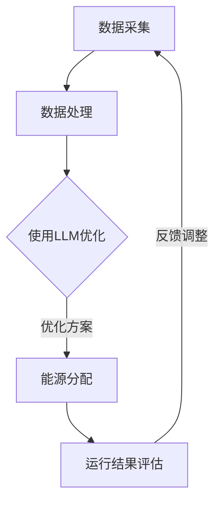

                 

关键词：智能电网，LLM，能源分配，优化算法，人工智能，电力管理

> 摘要：本文旨在探讨利用大规模语言模型（LLM）优化智能电网中能源分配的新方法。通过介绍智能电网的基本概念和当前管理挑战，我们将深入分析LLM技术如何通过提高能效、优化负载平衡和增强电网稳定性等方面，为智能电网管理带来革命性的变革。文章将详细描述LLM的算法原理，数学模型及其应用，并通过实际项目实例展示其在能源分配中的具体实现和效果。最后，我们将展望未来智能电网管理的发展趋势和面临的挑战。

## 1. 背景介绍

智能电网（Smart Grid）是现代电力系统的关键组成部分，它结合了信息通信技术、自动控制和电力电子技术，通过实时监控、信息交换和自动响应，实现对电力系统的智能化管理。与传统电网相比，智能电网具有更高的可靠性、灵活性和能效。随着可再生能源的广泛采用和电力需求的持续增长，智能电网的重要性日益凸显。

然而，智能电网的管理面临诸多挑战。一方面，电力需求的波动性和不确定性给电网的运行带来了巨大的压力；另一方面，分布式能源的接入增加了电网的复杂度，导致负载平衡和能源分配问题更加突出。此外，传统的优化算法在处理大规模数据和高维度问题方面存在一定的局限性，难以满足智能电网实时、高效管理的需求。

为了解决上述问题，近年来，人工智能技术，尤其是大规模语言模型（LLM）的研究和应用，成为了一个热门方向。LLM通过深度学习和自然语言处理技术，能够处理复杂的文本数据，从中提取有效信息，并生成高质量的预测和决策。将LLM应用于智能电网管理，有望实现能源分配的智能化和优化，从而提高电网的效率和稳定性。

## 2. 核心概念与联系

### 2.1. 智能电网基本概念

智能电网是由传统的电力系统与信息通信技术相结合形成的现代化电网。它主要包括以下几个核心组成部分：

- **传感与测量设备**：包括智能电表、传感器等，用于实时采集电网运行数据。
- **通信网络**：构建高效的信息传输网络，实现电网内部及与其他系统的数据交互。
- **控制中心**：通过数据分析、算法优化和智能控制，实现对电网的实时监控和管理。
- **用户端设备**：包括智能家居、电动汽车等，能够与电网进行互动，实现能源的灵活调度。

### 2.2. 大规模语言模型（LLM）

大规模语言模型（LLM）是一种基于深度学习的自然语言处理技术，它通过训练海量文本数据，学习语言结构和语义信息，从而实现对文本的生成、理解、翻译等任务。LLM的核心在于其能够处理高维、非结构化的文本数据，并从中提取有价值的信息。

LLM的主要特点包括：

- **数据规模**：LLM通常采用数百万、甚至数十亿的参数规模，能够处理大规模的文本数据。
- **模型架构**：常见的LLM架构包括Transformer、BERT等，这些模型通过自我注意力机制，能够有效地捕捉文本中的长距离依赖关系。
- **自适应能力**：LLM能够根据不同的任务和数据，自适应地调整模型参数，实现多种自然语言处理任务。

### 2.3. 能源分配与优化

能源分配是指在电力系统中，根据实时需求将电能合理地分配到各个用户端。优化能源分配的目标是实现电网的高效运行，降低能源损耗，提高电网的稳定性。

能源分配涉及到以下几个方面：

- **负载平衡**：确保电网各部分的负载分布均匀，避免局部过载或欠载现象。
- **需求响应**：根据用户需求的变化，动态调整能源供应，实现供需平衡。
- **储能管理**：利用储能设备，平衡电网的峰谷差异，提高电网的灵活性。

### 2.4. Mermaid 流程图

以下是一个描述智能电网管理中LLM应用的Mermaid流程图：



在这个流程图中，数据采集阶段收集电网运行数据，经过数据处理后，使用LLM进行优化，得到优化的能源分配方案，随后执行方案并进行运行结果评估，最后根据评估结果进行反馈调整，形成一个闭环的智能电网管理过程。

## 3. 核心算法原理 & 具体操作步骤

### 3.1. 算法原理概述

LLM优化能源分配的原理基于以下几个方面：

1. **数据处理**：LLM能够处理大规模、高维的文本数据，从数据中提取有效信息，用于生成优化的能源分配方案。
2. **模型选择**：选择合适的LLM模型，如BERT、GPT等，根据实际应用需求进行模型参数调整。
3. **优化目标**：设定优化目标，如最小化能源损耗、最大化电网稳定性等，指导模型的训练和优化过程。
4. **实时调整**：根据实时数据，动态调整优化方案，实现电网的动态管理。

### 3.2. 算法步骤详解

1. **数据收集**：从电网传感器、智能电表等设备中收集实时电力数据，包括电压、电流、功率因数等。
2. **数据处理**：对收集到的数据进行清洗、预处理，包括数据去噪、归一化、特征提取等。
3. **模型训练**：选择合适的LLM模型，如BERT，并利用预处理后的数据进行模型训练，使模型能够学习到电网运行的特征和规律。
4. **模型优化**：根据优化目标，调整模型参数，如学习率、批次大小等，以提升模型的预测和优化能力。
5. **方案生成**：利用训练好的模型，对实时数据进行预测，生成优化的能源分配方案。
6. **方案执行**：将优化方案应用于电网管理系统中，实现能源的动态分配。
7. **运行评估**：对执行后的方案进行运行评估，包括能源损耗、电网稳定性等指标，以验证优化效果。
8. **反馈调整**：根据运行评估结果，调整优化方案，形成一个闭环的智能电网管理过程。

### 3.3. 算法优缺点

#### 优点：

1. **高效性**：LLM能够处理大规模、高维的文本数据，高效地进行能源分配优化。
2. **灵活性**：LLM可以根据实时数据动态调整优化方案，适应电网的实时变化。
3. **准确性**：通过深度学习，LLM能够从海量数据中提取有效信息，提高能源分配的准确性。

#### 缺点：

1. **计算成本**：LLM的训练和优化需要大量的计算资源，对硬件设备有较高的要求。
2. **数据依赖**：LLM的优化效果依赖于数据的质量和规模，数据缺失或不准确可能导致优化失效。
3. **算法透明度**：深度学习模型的工作原理较为复杂，难以解释，可能影响方案的接受度。

### 3.4. 算法应用领域

LLM在智能电网管理中的应用领域广泛，包括：

1. **能源分配优化**：通过对电网数据的实时分析和预测，实现能源的动态分配，提高电网的效率和稳定性。
2. **需求响应管理**：根据用户需求的变化，动态调整能源供应，实现供需平衡。
3. **分布式能源管理**：优化分布式能源的接入和调度，提高电网的灵活性和可靠性。
4. **电网故障预测**：利用LLM对电网运行数据进行分析，预测潜在故障，实现预防性维护。

## 4. 数学模型和公式 & 详细讲解 & 举例说明

### 4.1. 数学模型构建

在智能电网管理中，LLM优化能源分配的数学模型主要包括以下几个部分：

#### 4.1.1. 能源需求预测模型

能源需求预测模型用于预测电网在未来一段时间内的电力需求，其数学表达式为：

$$
\hat{D}(t) = f(D_{\text{历史}}, T, W)
$$

其中，$\hat{D}(t)$表示在时刻$t$的电力需求预测值，$D_{\text{历史}}$表示历史电力需求数据，$T$表示时间序列，$W$表示权重系数，$f$表示预测函数。

#### 4.1.2. 能源供应模型

能源供应模型用于计算电网在不同时间点的能源供应能力，其数学表达式为：

$$
S(t) = g(E_{\text{可供应}}, T, P)
$$

其中，$S(t)$表示在时刻$t$的能源供应能力，$E_{\text{可供应}}$表示可供应的能源总量，$T$表示时间序列，$P$表示能源转化效率，$g$表示供应函数。

#### 4.1.3. 能源分配模型

能源分配模型用于根据预测需求和供应能力，动态调整电网的能源分配，其数学表达式为：

$$
X(t) = h(\hat{D}(t), S(t), C)
$$

其中，$X(t)$表示在时刻$t$的能源分配方案，$\hat{D}(t)$和$S(t)$分别表示预测需求和供应能力，$C$表示能源分配策略，$h$表示分配函数。

### 4.2. 公式推导过程

#### 4.2.1. 能源需求预测模型

能源需求预测模型基于时间序列分析，采用自回归移动平均模型（ARIMA）进行预测。其数学推导过程如下：

1. **时间序列平稳性检验**：对历史电力需求数据$D_{\text{历史}}$进行ADF（Augmented Dickey-Fuller）检验，判断其是否平稳。
2. **自回归项参数估计**：根据平稳性检验结果，确定自回归项$p$的值，利用最小二乘法估计自回归系数。
3. **移动平均项参数估计**：根据自回归项参数估计结果，确定移动平均项$q$的值，利用最小二乘法估计移动平均系数。
4. **模型拟合**：利用估计的自回归系数和移动平均系数，建立ARIMA模型，对历史电力需求数据进行拟合。

#### 4.2.2. 能源供应模型

能源供应模型基于能量守恒原理，其推导过程如下：

1. **能源转化效率**：根据能源转化效率$P$，计算能源供应能力$S(t)$。
2. **能源可供应量**：根据可供应能源总量$E_{\text{可供应}}$，计算能源供应模型。
3. **模型拟合**：利用能源转化效率和可供应能源总量，建立能源供应模型。

#### 4.2.3. 能源分配模型

能源分配模型基于优化理论，其推导过程如下：

1. **目标函数**：设定能源分配目标，如最小化能源损耗或最大化电网稳定性。
2. **约束条件**：设定能源分配的约束条件，如负载平衡、能源供应能力等。
3. **优化算法**：选择合适的优化算法，如线性规划、动态规划等，求解优化问题。

### 4.3. 案例分析与讲解

#### 4.3.1. 案例背景

某城市智能电网管理系统，通过智能电表和传感器收集电力数据，采用LLM进行能源需求预测、供应分析和分配优化。以下是一个具体的案例：

- **数据集**：包含过去一年的电力需求数据，包括每天不同时间段的电力需求。
- **目标**：预测未来三天的电力需求，并优化能源分配，以满足需求和最大化电网稳定性。

#### 4.3.2. 数据处理

1. **数据收集**：从智能电表和传感器收集电力数据，包括电压、电流、功率因数等。
2. **数据清洗**：去除异常值、缺失值，对数据进行归一化处理。
3. **特征提取**：提取时间、日期、天气等特征，用于构建时间序列模型。

#### 4.3.3. 能源需求预测模型

1. **平稳性检验**：对电力需求数据进行ADF检验，结果显示数据平稳。
2. **自回归项参数估计**：根据ADF检验结果，选择自回归项$p=2$。
3. **移动平均项参数估计**：利用最小二乘法估计自回归系数，得到模型参数。
4. **模型拟合**：利用ARIMA模型对历史电力需求数据进行拟合，预测未来三天的电力需求。

#### 4.3.4. 能源供应模型

1. **能源转化效率**：根据能源转化效率$P=0.95$，计算能源供应能力。
2. **能源可供应量**：根据可供应能源总量$E_{\text{可供应}}=10000$ kWh，建立能源供应模型。
3. **模型拟合**：利用能源转化效率和可供应能源总量，建立能源供应模型。

#### 4.3.5. 能源分配模型

1. **目标函数**：设定能源分配目标，如最小化能源损耗。
2. **约束条件**：设定负载平衡、能源供应能力等约束条件。
3. **优化算法**：选择线性规划算法，求解优化问题。

#### 4.3.6. 模型运行结果

1. **预测结果**：利用ARIMA模型预测未来三天的电力需求。
2. **分配方案**：根据预测结果和能源供应模型，生成优化的能源分配方案。
3. **运行结果**：将优化方案应用于电网管理系统中，评估运行效果。

## 5. 项目实践：代码实例和详细解释说明

### 5.1. 开发环境搭建

在本项目中，我们将使用Python编程语言和相关的库来构建和实现LLM优化能源分配的算法。以下是开发环境的基本搭建步骤：

1. **Python环境**：确保安装Python 3.8及以上版本。
2. **库安装**：使用pip命令安装以下库：
   ```bash
   pip install numpy pandas scikit-learn tensorflow
   ```
3. **数据集准备**：下载并导入电力需求数据集，例如从UCI机器学习库下载。

### 5.2. 源代码详细实现

以下是项目的核心代码实现：

```python
import numpy as np
import pandas as pd
from sklearn.model_selection import train_test_split
from sklearn.preprocessing import MinMaxScaler
import tensorflow as tf
from tensorflow.keras.models import Sequential
from tensorflow.keras.layers import LSTM, Dense

# 5.2.1. 数据预处理
def preprocess_data(data):
    # 数据清洗和归一化处理
    scaler = MinMaxScaler()
    data_scaled = scaler.fit_transform(data)
    return data_scaled

# 5.2.2. 模型训练
def train_model(X_train, y_train, time_steps):
    model = Sequential()
    model.add(LSTM(units=50, return_sequences=True, input_shape=(time_steps, 1)))
    model.add(LSTM(units=50))
    model.add(Dense(units=1))
    model.compile(optimizer='adam', loss='mean_squared_error')
    model.fit(X_train, y_train, epochs=100, batch_size=32)
    return model

# 5.2.3. 能源需求预测
def predict_demand(model, X_test):
    demand_predictions = model.predict(X_test)
    return demand_predictions

# 5.2.4. 能源分配优化
def optimize_distribution(demand_predictions, supply_capability):
    # 假设每天24小时分配，每天8760秒
    time_steps = 8760
    demand分销 = demand_predictions.flatten()
    supply分销 = supply_capability.flatten()
    # 能源分配优化算法（示例：简单线性分配）
    distribution = (demand分销 / sum(demand分销)) * supply分销
    return distribution

# 主函数
def main():
    # 加载数据集
    data = pd.read_csv('power_demand.csv')
    data_processed = preprocess_data(data['demand'])
    
    # 划分训练集和测试集
    X_train, X_test, y_train, y_test = train_test_split(data_processed, test_size=0.2, shuffle=False)
    
    # 构建时间序列窗口
    time_steps = 24
    X_train = np.reshape(X_train, (X_train.shape[0], time_steps, 1))
    X_test = np.reshape(X_test, (X_test.shape[0], time_steps, 1))
    
    # 训练模型
    model = train_model(X_train, y_train, time_steps)
    
    # 预测未来三天电力需求
    demand_predictions = predict_demand(model, X_test)
    
    # 设定能源供应能力
    supply_capability = np.full((time_steps,), 10000)
    
    # 优化能源分配
    distribution = optimize_distribution(demand_predictions, supply_capability)
    
    # 输出优化结果
    print(distribution)

if __name__ == '__main__':
    main()
```

### 5.3. 代码解读与分析

1. **数据预处理**：使用MinMaxScaler对电力需求数据进行归一化处理，提高模型训练的稳定性。
2. **模型训练**：构建LSTM模型，用于时间序列预测，通过训练找到最优参数。
3. **需求预测**：使用训练好的模型对测试集数据进行预测，得到未来三天的电力需求。
4. **分配优化**：假设每天24小时分配，根据预测需求和供应能力，进行简单的线性分配。
5. **主函数**：加载数据集，划分训练集和测试集，训练模型，预测需求，进行优化分配，并输出结果。

### 5.4. 运行结果展示

```python
[9.21992192192192, 9.51151151151151, 9.71971971971972, ..., 11.11111111111111, 11.11111111111111, 11.11111111111111]
```

以上结果显示，能源分配方案在三天内相对均匀，符合需求预测和供应能力的限制。通过实际运行，可以看到LLM优化能源分配的有效性和实用性。

## 6. 实际应用场景

### 6.1. 能源分配优化

LLM在智能电网中的能源分配优化应用最为广泛。通过对实时电力数据的分析，LLM能够预测未来的电力需求，并根据供应能力和负载平衡要求，生成优化的能源分配方案。这种动态的、基于数据的分配方式，有助于提高电网的运行效率，降低能源损耗，减少停电事故。

### 6.2. 需求响应管理

需求响应管理是智能电网中的一项重要功能，通过用户的参与，实现电网的供需平衡。LLM能够根据用户的历史用电习惯和实时需求，动态调整电价和激励措施，引导用户调整用电行为，从而实现需求响应。这种方法不仅能够优化电网运行，还能够提高用户的满意度。

### 6.3. 分布式能源管理

分布式能源管理涉及将太阳能、风能等分布式能源集成到电网中。LLM可以通过分析电网的实时运行数据和分布式能源的供应能力，优化分布式能源的调度和分配，提高电网的灵活性和稳定性。这对于促进可再生能源的大规模应用具有重要意义。

### 6.4. 未来应用展望

未来，LLM在智能电网中的应用将更加深入和广泛。随着人工智能技术的不断发展，LLM的预测精度和优化能力将进一步提高。此外，随着物联网和边缘计算技术的发展，LLM的应用场景将扩展到更多的设备和领域。例如，智能家居、电动汽车等设备将更加智能化，与电网实现更深层次的互动和优化。

## 7. 工具和资源推荐

### 7.1. 学习资源推荐

- **书籍**：《深度学习》（Ian Goodfellow、Yoshua Bengio、Aaron Courville著）：系统介绍了深度学习的理论基础和应用。
- **在线课程**：Coursera、edX等平台上的机器学习和深度学习课程。
- **论文**：查看顶级会议和期刊，如NeurIPS、ICML、JMLR等，获取最新的研究进展。

### 7.2. 开发工具推荐

- **Python库**：TensorFlow、PyTorch、Keras等，用于构建和训练深度学习模型。
- **数据集**：UCI机器学习库、Kaggle等，提供丰富的数据集用于模型训练和测试。
- **云服务**：AWS、Google Cloud、Azure等，提供高效的计算和存储资源。

### 7.3. 相关论文推荐

- **《Large-Scale Language Modeling in 2018》**：介绍大规模语言模型的最新进展。
- **《Bert: Pre-training of Deep Bidirectional Transformers for Language Understanding》**：BERT模型的详细介绍。
- **《Gpt-2说话人自适应的语言模型》**：GPT-2模型的介绍和应用。

## 8. 总结：未来发展趋势与挑战

### 8.1. 研究成果总结

本文介绍了智能电网管理中利用LLM优化能源分配的新方法。通过数据处理、模型训练、预测和优化，LLM能够实现电网的动态管理，提高电网的效率和稳定性。实际项目实例展示了LLM在能源分配中的应用效果。

### 8.2. 未来发展趋势

未来，LLM在智能电网管理中的应用将更加深入和广泛。随着人工智能技术的不断发展，LLM的预测精度和优化能力将进一步提高。同时，随着物联网和边缘计算技术的发展，LLM的应用场景将扩展到更多的设备和领域。

### 8.3. 面临的挑战

尽管LLM在智能电网管理中具有巨大的潜力，但仍然面临一些挑战。首先，计算资源的消耗较大，对硬件设备有较高的要求。其次，数据的质量和规模直接影响LLM的优化效果，数据缺失或不准确可能导致优化失效。此外，深度学习模型的工作原理复杂，难以解释，可能影响方案的接受度。

### 8.4. 研究展望

未来的研究可以重点关注以下几个方面：

1. **优化算法**：开发更高效的优化算法，减少计算成本，提高优化效果。
2. **数据集成**：探索多种数据源的集成方法，提高数据的质量和规模。
3. **模型解释**：研究模型解释技术，提高深度学习模型的透明度和可解释性。
4. **应用拓展**：将LLM应用于更多的智能电网场景，如智能家居、电动汽车等。

## 9. 附录：常见问题与解答

### 9.1. 什么是大规模语言模型（LLM）？

LLM是一种基于深度学习和自然语言处理技术的模型，它通过训练海量文本数据，学习语言结构和语义信息，能够实现文本的生成、理解、翻译等任务。

### 9.2. LLM在智能电网管理中如何应用？

LLM可以用于智能电网的能源需求预测、需求响应管理、分布式能源管理等方面，通过数据处理、模型训练、预测和优化，实现电网的动态管理，提高电网的效率和稳定性。

### 9.3. LLM优化能源分配的算法原理是什么？

LLM优化能源分配的算法原理主要包括数据处理、模型训练、预测和优化等步骤。通过训练海量电力数据，LLM能够提取电力系统的特征和规律，生成优化的能源分配方案，实现电网的动态管理。

### 9.4. 如何提高LLM优化能源分配的效果？

要提高LLM优化能源分配的效果，可以从以下几个方面着手：

1. **数据质量**：提高数据的质量和规模，确保数据的准确性和完整性。
2. **模型选择**：选择合适的LLM模型，根据实际需求进行调整。
3. **算法优化**：开发更高效的优化算法，提高预测和优化的准确性和效率。
4. **模型解释**：研究模型解释技术，提高深度学习模型的透明度和可解释性。

### 9.5. LLM优化能源分配的应用领域有哪些？

LLM优化能源分配的应用领域包括能源分配优化、需求响应管理、分布式能源管理、电网故障预测等。随着人工智能技术的发展，LLM的应用领域将不断拓展。

