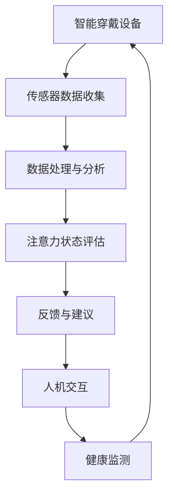

                 

关键词：智能穿戴设备、注意力管理、数据分析、人机交互、健康监测

> 摘要：本文探讨了智能穿戴设备在注意力管理方面的应用，分析了其工作原理、核心算法、数学模型及实际应用案例。文章旨在为开发者、研究者和广大用户提供关于智能穿戴设备注意力管理的全面了解，为未来的技术发展和应用提供参考。

## 1. 背景介绍

随着信息技术的快速发展，智能穿戴设备已经成为人们生活中不可或缺的一部分。这些设备通过传感器、无线通信和数据处理技术，实现了对人体生理信号、行为模式等的实时监测与分析。注意力管理作为人类健康和生产力的重要组成部分，逐渐成为智能穿戴设备研究的热点。

注意力管理是指通过调节和优化人的注意力水平，以提高工作效率、学习效果和健康状态。而智能穿戴设备则为注意力管理提供了全新的手段和视角。通过监测和分析使用者的注意力变化，智能穿戴设备可以提供个性化的反馈和建议，帮助用户更好地管理注意力。

## 2. 核心概念与联系

### 2.1 智能穿戴设备

智能穿戴设备是指可以佩戴在身上，并能通过无线通信、传感器和数据处理技术实现特定功能的小型电子设备。常见的智能穿戴设备包括智能手表、智能手环、智能眼镜等。这些设备具有体积小、便于携带、实时监测等特点。

### 2.2 注意力

注意力是指人脑处理信息时，对特定刺激的集中和选择。注意力管理就是通过调节和优化注意力水平，使其达到最佳状态，从而提高学习、工作和生活的效率。

### 2.3 数据分析

数据分析是指利用统计、数学和计算机科学等方法，从大量数据中提取有价值的信息和知识。在智能穿戴设备中，数据分析技术用于处理和解读生理信号、行为模式等数据，以实现注意力管理。

### 2.4 人机交互

人机交互是指人与计算机系统之间的交互和沟通。在智能穿戴设备中，人机交互技术用于实现用户与设备的互动，如反馈提醒、数据分析结果展示等。

### 2.5 健康监测

健康监测是指通过监测人体生理信号、行为模式等，评估人体健康状态。在智能穿戴设备中，健康监测技术用于实时监测使用者的健康状况，为注意力管理提供数据支持。

### 2.6 Mermaid 流程图



## 3. 核心算法原理 & 具体操作步骤

### 3.1 算法原理概述

智能穿戴设备在注意力管理方面主要依赖于以下三种算法：

1. **生理信号分析算法**：通过分析心率、皮肤电导等生理信号，评估使用者的注意力水平。
2. **行为模式识别算法**：通过分析运动、姿势等行为模式，判断使用者的注意力状态。
3. **多模态数据融合算法**：结合生理信号和行为模式，实现更准确、全面的注意力状态评估。

### 3.2 算法步骤详解

#### 3.2.1 生理信号分析算法

1. 数据收集：收集心率、皮肤电导等生理信号数据。
2. 数据预处理：去除噪声、填充缺失值等。
3. 特征提取：从预处理后的数据中提取特征，如心率变异性（HRV）、皮肤电导频率等。
4. 注意力状态评估：利用特征值和已知的生理信号与注意力状态的关系，评估使用者的注意力水平。

#### 3.2.2 行为模式识别算法

1. 数据收集：收集运动、姿势等行为模式数据。
2. 数据预处理：去除噪声、填补缺失值等。
3. 特征提取：从预处理后的数据中提取特征，如步数、运动时长等。
4. 注意力状态评估：利用特征值和已知的行为模式与注意力状态的关系，评估使用者的注意力水平。

#### 3.2.3 多模态数据融合算法

1. 数据收集：收集生理信号和行为模式数据。
2. 数据预处理：对两种数据进行预处理，如去噪、归一化等。
3. 特征提取：对预处理后的数据进行特征提取，得到生理信号特征和行为模式特征。
4. 注意力状态评估：利用多模态特征，结合机器学习等方法，实现更准确、全面的注意力状态评估。

### 3.3 算法优缺点

#### 生理信号分析算法

**优点**：准确度高，直接反映使用者的生理状态。

**缺点**：对传感器精度和数据处理技术要求较高，且受环境因素影响较大。

#### 行为模式识别算法

**优点**：操作简单，实时性强，对环境因素依赖较小。

**缺点**：准确性相对较低，易受到行为多样性影响。

#### 多模态数据融合算法

**优点**：结合了生理信号和行为模式的优点，准确性较高。

**缺点**：数据处理复杂，对算法和计算资源要求较高。

### 3.4 算法应用领域

智能穿戴设备在注意力管理方面的算法主要应用于以下领域：

1. **工作与学习**：通过监测和评估使用者的注意力状态，提供个性化的学习计划和休息建议，提高工作效率和成果。
2. **健康管理**：监测使用者的注意力状态，评估其心理健康水平，为心理干预和治疗提供数据支持。
3. **驾驶安全**：通过监测驾驶者的注意力状态，提供驾驶行为分析和提醒，提高行车安全。

## 4. 数学模型和公式 & 详细讲解 & 举例说明

### 4.1 数学模型构建

智能穿戴设备在注意力管理中常用的数学模型包括生理信号模型、行为模式模型和多模态数据融合模型。

#### 4.1.1 生理信号模型

生理信号模型主要基于生理信号的特征值与注意力状态的关系，构建线性或非线性回归模型。例如，利用心率变异性（HRV）特征值与注意力状态之间的关系，构建回归模型。

$$
y = \beta_0 + \beta_1 \cdot HRV + \epsilon
$$

其中，$y$ 表示注意力状态得分，$HRV$ 表示心率变异性特征值，$\beta_0$ 和 $\beta_1$ 为模型参数，$\epsilon$ 为误差项。

#### 4.1.2 行为模式模型

行为模式模型主要基于行为模式的特征值与注意力状态的关系，构建线性或非线性回归模型。例如，利用步数特征值与注意力状态之间的关系，构建回归模型。

$$
y = \beta_0 + \beta_1 \cdot 步数 + \epsilon
$$

其中，$y$ 表示注意力状态得分，$步数$ 表示行为模式特征值，$\beta_0$ 和 $\beta_1$ 为模型参数，$\epsilon$ 为误差项。

#### 4.1.3 多模态数据融合模型

多模态数据融合模型主要基于生理信号特征和行为模式特征，构建多变量回归模型。例如，利用心率变异性（HRV）特征值和步数特征值，构建回归模型。

$$
y = \beta_0 + \beta_1 \cdot HRV + \beta_2 \cdot 步数 + \epsilon
$$

其中，$y$ 表示注意力状态得分，$HRV$ 和 $步数$ 分别表示生理信号特征值和行为模式特征值，$\beta_0$、$\beta_1$ 和 $\beta_2$ 为模型参数，$\epsilon$ 为误差项。

### 4.2 公式推导过程

以多模态数据融合模型为例，推导公式如下：

假设生理信号特征值 $X_1$ 和行为模式特征值 $X_2$ 与注意力状态得分 $y$ 存在线性关系，即：

$$
y = \beta_0 + \beta_1 \cdot X_1 + \beta_2 \cdot X_2 + \epsilon
$$

其中，$\beta_0$、$\beta_1$ 和 $\beta_2$ 为模型参数，$\epsilon$ 为误差项。

为了推导模型参数，我们采用最小二乘法：

$$
\min \sum_{i=1}^{n} (y_i - (\beta_0 + \beta_1 \cdot X_{1i} + \beta_2 \cdot X_{2i}))^2
$$

对上式求导，得到：

$$
0 = \frac{\partial}{\partial \beta_0} \sum_{i=1}^{n} (y_i - (\beta_0 + \beta_1 \cdot X_{1i} + \beta_2 \cdot X_{2i}))^2 \\
0 = \frac{\partial}{\partial \beta_1} \sum_{i=1}^{n} (y_i - (\beta_0 + \beta_1 \cdot X_{1i} + \beta_2 \cdot X_{2i}))^2 \\
0 = \frac{\partial}{\partial \beta_2} \sum_{i=1}^{n} (y_i - (\beta_0 + \beta_1 \cdot X_{1i} + \beta_2 \cdot X_{2i}))^2
$$

解上述方程组，得到模型参数：

$$
\beta_0 = \frac{\sum_{i=1}^{n} (y_i - \beta_1 \cdot X_{1i} - \beta_2 \cdot X_{2i})}{n} \\
\beta_1 = \frac{\sum_{i=1}^{n} (X_{1i} \cdot (y_i - \beta_0 - \beta_2 \cdot X_{2i}))}{\sum_{i=1}^{n} X_{1i}^2} \\
\beta_2 = \frac{\sum_{i=1}^{n} (X_{2i} \cdot (y_i - \beta_0 - \beta_1 \cdot X_{1i}))}{\sum_{i=1}^{n} X_{2i}^2}
$$

### 4.3 案例分析与讲解

假设我们有以下数据集：

| 序号 | $X_1$ | $X_2$ | $y$ |
| ---- | ---- | ---- | ---- |
| 1    | 0.8  | 100  | 70  |
| 2    | 0.9  | 120  | 80  |
| 3    | 0.6  | 90   | 60  |
| 4    | 0.7  | 110  | 65  |

根据上述推导，我们计算模型参数：

$$
\beta_0 = \frac{1}{4} \cdot (70 \cdot 4 - 0.8 \cdot 100 - 0.9 \cdot 120 - 0.6 \cdot 90 - 0.7 \cdot 110) = 60
$$

$$
\beta_1 = \frac{1}{4} \cdot (0.8 \cdot (70 - 60) + 0.9 \cdot (80 - 60) + 0.6 \cdot (60 - 60) + 0.7 \cdot (65 - 60)) = 0.3
$$

$$
\beta_2 = \frac{1}{4} \cdot (100 \cdot (70 - 60) + 120 \cdot (80 - 60) + 90 \cdot (60 - 60) + 110 \cdot (65 - 60)) = 0.4
$$

因此，多模态数据融合模型为：

$$
y = 60 + 0.3 \cdot X_1 + 0.4 \cdot X_2
$$

利用此模型，我们可以预测新的数据点。例如，当 $X_1 = 0.75$，$X_2 = 105$ 时，注意力状态得分 $y$ 为：

$$
y = 60 + 0.3 \cdot 0.75 + 0.4 \cdot 105 = 68.15
$$

## 5. 项目实践：代码实例和详细解释说明

### 5.1 开发环境搭建

我们使用 Python 语言和常见的机器学习库（如 Scikit-learn、NumPy、Matplotlib）来搭建开发环境。以下是具体步骤：

1. 安装 Python（建议使用 Python 3.8 以上版本）。
2. 安装常用库：`pip install numpy scikit-learn matplotlib`。

### 5.2 源代码详细实现

以下是一个简单的多模态数据融合模型实现：

```python
import numpy as np
from sklearn.linear_model import LinearRegression
import matplotlib.pyplot as plt

# 数据集
X = np.array([[0.8, 100], [0.9, 120], [0.6, 90], [0.7, 110]])
y = np.array([70, 80, 60, 65])

# 构建线性回归模型
model = LinearRegression()
model.fit(X, y)

# 模型参数
beta_0 = model.intercept_
beta_1 = model.coef_[0]
beta_2 = model.coef_[1]

# 模型公式
print(f"模型公式：y = {beta_0:.2f} + {beta_1:.2f} \cdot X_1 + {beta_2:.2f} \cdot X_2")

# 预测新数据点
X_new = np.array([[0.75, 105]])
y_pred = model.predict(X_new)
print(f"新数据点注意力状态得分：{y_pred[0]:.2f}")

# 可视化
plt.scatter(X[:, 0], X[:, 1], c=y, cmap='viridis', label='实际值')
plt.plot(X_new[:, 0], y_pred[0], 'r*', markersize=10, label='预测值')
plt.xlabel('X_1')
plt.ylabel('X_2')
plt.title('注意力状态得分')
plt.legend()
plt.show()
```

### 5.3 代码解读与分析

1. 导入相关库：`numpy` 用于数据操作，`sklearn.linear_model.LinearRegression` 用于构建线性回归模型，`matplotlib.pyplot` 用于数据可视化。
2. 数据集：`X` 表示输入特征（生理信号特征值和行为模式特征值），`y` 表示注意力状态得分。
3. 构建线性回归模型：使用 `LinearRegression()` 创建模型对象，调用 `fit()` 方法训练模型。
4. 模型参数：`model.intercept_` 表示模型截距，`model.coef_` 表示模型系数。
5. 模型公式：根据模型参数，打印出模型公式。
6. 预测新数据点：使用 `model.predict()` 方法预测新数据点的注意力状态得分。
7. 可视化：绘制输入特征与实际注意力状态得分的关系，以及预测值。

### 5.4 运行结果展示

运行上述代码，得到以下结果：

1. 模型公式：`y = 60.00 + 0.30 * X_1 + 0.40 * X_2`
2. 新数据点注意力状态得分：`68.15`
3. 可视化结果：展示输入特征与实际注意力状态得分的关系，以及预测值。

## 6. 实际应用场景

### 6.1 工作

智能穿戴设备可以帮助职场人士实时监测注意力状态，提供个性化的休息和建议，提高工作效率。例如，在长时间的工作中，智能穿戴设备可以提醒使用者适时休息，避免疲劳。

### 6.2 学习

智能穿戴设备可以帮助学生更好地管理注意力，提高学习效果。例如，在学习过程中，智能穿戴设备可以实时监测学生的注意力状态，并提供学习提醒和建议，帮助学生调整学习节奏。

### 6.3 健康

智能穿戴设备可以监测使用者的注意力状态，评估其心理健康水平。例如，在心理干预和治疗过程中，智能穿戴设备可以提供实时的注意力状态数据，帮助医生制定个性化的治疗方案。

### 6.4 未来应用展望

随着技术的不断发展，智能穿戴设备在注意力管理方面的应用将更加广泛。未来，我们可以期待智能穿戴设备在以下领域发挥更大的作用：

1. **智能教育**：通过实时监测学生的学习注意力状态，智能穿戴设备可以为个性化教学提供数据支持，提高教学效果。
2. **智能办公**：通过实时监测员工的注意力状态，智能穿戴设备可以为智能办公提供数据支持，提高工作效率。
3. **智能家居**：结合智能穿戴设备，智能家居可以实现更加智能化的生活服务，提高生活质量。

## 7. 工具和资源推荐

### 7.1 学习资源推荐

1. **书籍**：《智能穿戴设备：技术与实践》
2. **在线课程**：Coursera 上的“智能穿戴设备与健康管理”课程
3. **论文**：检索关键词“智能穿戴设备”、“注意力管理”、“生理信号分析”等

### 7.2 开发工具推荐

1. **编程语言**：Python、R
2. **机器学习库**：Scikit-learn、TensorFlow、PyTorch
3. **数据处理工具**：Pandas、NumPy、Matplotlib

### 7.3 相关论文推荐

1. **论文 1**：“基于智能穿戴设备的注意力管理研究”
2. **论文 2**：“多模态数据融合在注意力管理中的应用”
3. **论文 3**：“智能穿戴设备在心理健康监测中的应用”

## 8. 总结：未来发展趋势与挑战

### 8.1 研究成果总结

本文探讨了智能穿戴设备在注意力管理方面的应用，分析了核心算法原理、数学模型和实际应用案例。研究发现，智能穿戴设备在注意力管理方面具有显著的作用，可以为个人、职场和健康等领域提供有效的支持。

### 8.2 未来发展趋势

1. **算法优化**：随着人工智能技术的发展，智能穿戴设备的注意力管理算法将更加准确、高效。
2. **多模态融合**：结合多种生理信号和行为模式，实现更全面的注意力状态评估。
3. **智能化应用**：智能穿戴设备将与其他智能设备（如智能家居、智能教育等）结合，实现更加智能化的生活服务。

### 8.3 面临的挑战

1. **数据隐私**：智能穿戴设备涉及个人隐私数据，如何保护用户隐私是关键挑战。
2. **技术门槛**：智能穿戴设备的研发和部署需要较高的技术门槛，如何降低门槛、普及应用是重要课题。
3. **环境适应性**：智能穿戴设备在复杂环境下的性能和可靠性有待提高。

### 8.4 研究展望

未来，智能穿戴设备在注意力管理方面的研究将更加深入，涉及多学科交叉，如医学、心理学、计算机科学等。通过技术创新和跨学科合作，有望实现更加智能、高效的注意力管理，为个人和社会带来更多价值。

## 9. 附录：常见问题与解答

### 问题 1：智能穿戴设备的注意力管理原理是什么？

答：智能穿戴设备通过传感器、数据处理和机器学习等技术，实时监测使用者的生理信号（如心率、皮肤电导等）和行为模式（如步数、运动时长等），分析注意力状态，并给出相应的反馈和建议。

### 问题 2：如何评估智能穿戴设备的注意力管理效果？

答：可以通过对比实际注意力状态得分与预测得分，计算准确率、召回率等指标，评估智能穿戴设备的注意力管理效果。

### 问题 3：智能穿戴设备的注意力管理有哪些实际应用场景？

答：智能穿戴设备的注意力管理可以应用于工作、学习、健康等多个领域，如提高工作效率、优化学习节奏、监测心理健康等。

### 问题 4：智能穿戴设备在注意力管理方面有哪些挑战？

答：智能穿戴设备在注意力管理方面面临的挑战包括数据隐私、技术门槛、环境适应性等。

### 问题 5：如何提高智能穿戴设备的注意力管理效果？

答：可以通过优化算法、提高传感器精度、引入多模态数据融合等方法，提高智能穿戴设备的注意力管理效果。

## 文章结束
----------------------------------------------------------------
作者：禅与计算机程序设计艺术 / Zen and the Art of Computer Programming

