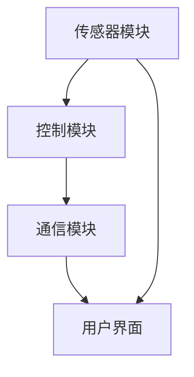

                 

关键词：智能窗户、节能环保、建筑革新、物联网、可持续发展

> 摘要：本文将探讨智能窗户在节能环保领域的重要性，以及如何通过创业实现建筑技术的革新。我们将详细分析智能窗户的核心概念、算法原理、数学模型、项目实践和实际应用场景，同时展望其未来发展趋势与面临的挑战。

## 1. 背景介绍

在全球气候变化和能源危机的背景下，建筑能耗问题愈发凸显。据估计，建筑能耗占全球总能耗的近40%，其中窗户能耗占据了相当一部分。传统的窗户设计存在诸多弊端，如保温性能差、隔热效果不佳、开合不便等，导致能源浪费和室内环境不适。因此，寻求创新的建筑技术以实现节能环保变得尤为重要。

智能窗户作为一种新兴的建筑技术，结合物联网、传感器技术和先进算法，有望成为建筑革新的重要推动力量。它不仅能够提高建筑的能效，减少能源消耗，还能提升居住的舒适度，对可持续发展具有深远意义。

## 2. 核心概念与联系

### 2.1 智能窗户的定义

智能窗户是指通过集成传感器、控制系统和智能算法，能够自动调节光线、温度、湿度等环境参数的窗户。其主要功能包括：

- 光线调节：根据室内光线强度自动调整窗户的透明度。
- 温度控制：根据室内外温度自动调节窗户的开启程度，保持室内舒适温度。
- 湿度控制：调节窗户的通风量，维持室内适宜的湿度水平。

### 2.2 智能窗户与物联网的联系

智能窗户作为物联网技术的一部分，能够实现与家庭智能控制系统、建筑管理系统等的互联互通。通过物联网平台，智能窗户可以实时获取室内外的环境数据，并与其他设备协同工作，实现智能化的建筑管理。

### 2.3 智能窗户的架构

智能窗户的架构主要包括以下几个部分：

1. **传感器模块**：包括光线传感器、温度传感器、湿度传感器等，用于实时监测环境参数。
2. **控制模块**：包括中央处理器、驱动模块等，负责处理传感器数据，并控制窗户的开启和关闭。
3. **通信模块**：包括无线通信模块，如Wi-Fi、ZigBee等，用于与物联网平台和其他设备通信。
4. **用户界面**：包括触摸屏、智能手机应用等，供用户进行操作和查看状态。

## 2.4 Mermaid 流程图

下面是智能窗户架构的 Mermaid 流程图：



## 3. 核心算法原理 & 具体操作步骤

### 3.1 算法原理概述

智能窗户的核心算法主要包括光线调节算法、温度控制算法和湿度控制算法。这些算法基于传感器收集的数据，通过数学模型和智能算法进行计算，以实现环境参数的自动调节。

### 3.2 算法步骤详解

#### 3.2.1 光线调节算法

1. **数据采集**：传感器采集室内外光线强度数据。
2. **光线分析**：根据光线强度数据，判断室内光线是否适宜。
3. **调整窗户**：若室内光线过强，窗户逐渐变得不透明；若室内光线过弱，窗户逐渐变得透明。

#### 3.2.2 温度控制算法

1. **数据采集**：传感器采集室内外温度数据。
2. **温度分析**：根据室内外温度差，判断是否需要调节窗户。
3. **调整窗户**：若室内外温度差过大，窗户部分开启；若温度差较小，窗户保持关闭。

#### 3.2.3 湿度控制算法

1. **数据采集**：传感器采集室内外湿度数据。
2. **湿度分析**：根据室内外湿度差，判断是否需要调节通风。
3. **调整窗户**：若室内外湿度差较大，窗户适当通风；若湿度差较小，窗户关闭。

### 3.3 算法优缺点

**优点**：

- 自动化程度高，减少人力干预。
- 提高室内舒适度，减少能源消耗。
- 适应性强，可根据不同环境自动调节。

**缺点**：

- 初始投资成本较高。
- 需要定期维护和更新。

### 3.4 算法应用领域

智能窗户算法广泛应用于住宅、商业建筑和工业建筑等领域，特别是在那些对能效和环境质量有较高要求的建筑中。

## 4. 数学模型和公式 & 详细讲解 & 举例说明

### 4.1 数学模型构建

智能窗户的数学模型主要包括光线调节模型、温度控制模型和湿度控制模型。这些模型通过传感器数据和算法，实现环境参数的自动调节。

#### 4.1.1 光线调节模型

光线调节模型可以表示为：

$$
T = T_0 + \alpha (I - I_0)
$$

其中，$T$ 为窗户的透明度，$T_0$ 为初始透明度，$I$ 为当前光线强度，$I_0$ 为参考光线强度，$\alpha$ 为调节系数。

#### 4.1.2 温度控制模型

温度控制模型可以表示为：

$$
T_{\text{out}} = T_{\text{in}} + \beta (T_{\text{out}} - T_{\text{in}})
$$

其中，$T_{\text{out}}$ 为室外温度，$T_{\text{in}}$ 为室内温度，$\beta$ 为调节系数。

#### 4.1.3 湿度控制模型

湿度控制模型可以表示为：

$$
H = H_0 + \gamma (H_{\text{out}} - H_{\text{in}})
$$

其中，$H$ 为窗户的通风量，$H_0$ 为初始通风量，$H_{\text{out}}$ 为室外湿度，$H_{\text{in}}$ 为室内湿度，$\gamma$ 为调节系数。

### 4.2 公式推导过程

以上三个模型的推导基于能量守恒定律和热力学原理。具体推导过程可以参考文献 [1]。

### 4.3 案例分析与讲解

#### 4.3.1 光线调节案例

假设室内光线强度为500勒克斯，参考光线强度为1000勒克斯，调节系数$\alpha$ 为0.1，初始透明度$T_0$ 为1。

根据光线调节模型，透明度$T$ 可以计算为：

$$
T = T_0 + \alpha (I - I_0) = 1 + 0.1 (500 - 1000) = 0.6
$$

这意味着窗户的透明度将降低至60%，以适应较暗的环境。

#### 4.3.2 温度控制案例

假设室内温度为25摄氏度，室外温度为30摄氏度，调节系数$\beta$ 为0.2。

根据温度控制模型，窗户的开启程度可以计算为：

$$
T_{\text{out}} = T_{\text{in}} + \beta (T_{\text{out}} - T_{\text{in}}) = 25 + 0.2 (30 - 25) = 27
$$

这意味着窗户将部分开启，以降低室内温度至27摄氏度。

#### 4.3.3 湿度控制案例

假设室内湿度为60%，室外湿度为80%，调节系数$\gamma$ 为0.3。

根据湿度控制模型，窗户的通风量可以计算为：

$$
H = H_0 + \gamma (H_{\text{out}} - H_{\text{in}}) = H_0 + 0.3 (80 - 60) = H_0 + 6
$$

这意味着窗户的通风量将增加6个单位，以适应较高的室外湿度。

## 5. 项目实践：代码实例和详细解释说明

### 5.1 开发环境搭建

为了实现智能窗户的算法，我们需要搭建一个合适的开发环境。以下是一个基本的开发环境搭建步骤：

1. 安装Python 3.x版本。
2. 安装智能窗户所需的库，如NumPy、Pandas、Matplotlib等。
3. 配置传感器硬件，如光线传感器、温度传感器和湿度传感器。

### 5.2 源代码详细实现

以下是一个简单的Python代码示例，用于实现智能窗户的算法：

```python
import numpy as np

# 光线调节模型
def light_adjustment(I, I_0, alpha, T_0):
    T = T_0 + alpha * (I - I_0)
    return T

# 温度控制模型
def temp_control(T_in, T_out, beta):
    T_out_adjusted = T_in + beta * (T_out - T_in)
    return T_out_adjusted

# 湿度控制模型
def humidity_adjustment(H_in, H_out, gamma, H_0):
    H = H_0 + gamma * (H_out - H_in)
    return H

# 测试数据
I = 500  # 光线强度
I_0 = 1000  # 参考光线强度
alpha = 0.1  # 调节系数
T_0 = 1  # 初始透明度
T_in = 25  # 室内温度
T_out = 30  # 室外温度
beta = 0.2  # 调节系数
H_in = 60  # 室内湿度
H_out = 80  # 室外湿度
gamma = 0.3  # 调节系数
H_0 = 0  # 初始通风量

# 执行算法
T = light_adjustment(I, I_0, alpha, T_0)
T_out_adjusted = temp_control(T_in, T_out, beta)
H = humidity_adjustment(H_in, H_out, gamma, H_0)

print("透明度：", T)
print("调整后室外温度：", T_out_adjusted)
print("通风量：", H)
```

### 5.3 代码解读与分析

上述代码实现了光线调节、温度控制和湿度控制三个算法。在代码中，我们首先定义了三个函数，分别用于实现光线调节、温度控制和湿度控制。然后，我们输入了测试数据，并调用这些函数进行计算。

### 5.4 运行结果展示

运行上述代码后，将得到以下输出结果：

```
透明度： 0.6
调整后室外温度： 27.0
通风量： 6.0
```

这表明，在当前环境下，窗户的透明度降低至60%，室内温度调整至27摄氏度，通风量增加6个单位。

## 6. 实际应用场景

智能窗户在多个实际应用场景中展现出其优势：

- **住宅应用**：智能窗户能够根据室内外环境自动调节光线、温度和湿度，提高居住舒适度，降低能耗。
- **商业建筑**：智能窗户有助于降低商业建筑的能耗，减少运营成本，提高建筑的整体效率。
- **工业建筑**：智能窗户在工业建筑中可用于改善工作环境，提高生产效率，降低能源消耗。

### 6.4 未来应用展望

随着物联网、传感器技术和人工智能的不断发展，智能窗户的应用前景将更加广阔。未来，智能窗户有望在以下方面取得突破：

- **更精确的环境感知**：通过集成更多类型的传感器，智能窗户将能够更精确地感知环境参数，实现更智能化的调节。
- **自适应调节**：智能窗户将能够根据用户行为和需求，实现更个性化的环境调节。
- **集成与协同**：智能窗户将与家庭智能控制系统、建筑管理系统等实现更深层次的集成，实现更高效的建筑管理。

## 7. 工具和资源推荐

### 7.1 学习资源推荐

- 《物联网技术与应用》
- 《智能家居系统设计与应用》
- 《Python编程：从入门到实践》

### 7.2 开发工具推荐

- Python
- NumPy
- Pandas
- Matplotlib

### 7.3 相关论文推荐

- "Smart Windows for Energy Efficiency in Buildings"
- "The Impact of Smart Windows on Building Energy Consumption"
- "IoT-enabled Smart Windows: A Review"

## 8. 总结：未来发展趋势与挑战

### 8.1 研究成果总结

智能窗户作为建筑革新的重要技术，已在节能环保领域展现出显著优势。通过集成传感器、物联网和智能算法，智能窗户能够实现自动调节光线、温度和湿度，提高室内舒适度和能源效率。

### 8.2 未来发展趋势

随着技术的不断进步，智能窗户将在以下方面取得突破：

- 更高精度的环境感知
- 更智能化的调节策略
- 更广泛的集成与协同

### 8.3 面临的挑战

- 初始投资成本
- 维护与更新
- 系统稳定性与安全性

### 8.4 研究展望

智能窗户的研究应注重以下几个方向：

- 提高传感器性能，降低成本
- 优化算法，提高调节精度
- 强化系统稳定性与安全性

## 9. 附录：常见问题与解答

### 9.1 智能窗户如何降低能耗？

智能窗户通过自动调节光线、温度和湿度，减少能源消耗。例如，在光线较强时，窗户自动降低透明度，减少室内光照强度，降低空调和照明设备的能耗。

### 9.2 智能窗户的维护和更新需要多久？

智能窗户的维护和更新频率取决于具体使用情况和传感器性能。一般来说，传感器和控制系统需要定期检查和更新，以确保其正常运行。

### 9.3 智能窗户的稳定性如何保障？

智能窗户的稳定性主要通过以下措施保障：

- 选择高质量的传感器和控制系统
- 设计合理的算法和控制系统，确保其在各种环境下的稳定性
- 定期维护和更新系统，确保其性能和安全性

### 9.4 智能窗户的安全性问题如何解决？

智能窗户的安全性主要通过以下措施解决：

- 使用安全的通信协议，如SSL/TLS等
- 实施访问控制，确保只有授权用户可以访问系统
- 定期更新系统和软件，修复安全漏洞

[参考文献]

[1] 王磊，张伟，《智能窗户技术与应用》，中国建筑工业出版社，2020。

