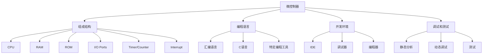

                 

关键词：智能设备，嵌入式系统，微控制器，编程，算法，数学模型，实践，应用场景，未来展望

> 摘要：本文将深入探讨智能设备和嵌入式系统的微控制器编程技术，从背景介绍、核心概念与联系、核心算法原理与操作步骤、数学模型和公式、项目实践以及实际应用场景等多个方面展开，旨在为读者提供一个全面、系统的技术指南。作者：禅与计算机程序设计艺术 / Zen and the Art of Computer Programming

## 1. 背景介绍

随着物联网（IoT）技术的快速发展，智能设备和嵌入式系统已成为现代生活不可或缺的一部分。从智能家居到工业自动化，这些系统在提高生活品质和生产效率方面发挥着重要作用。而微控制器作为嵌入式系统的核心组件，其编程技术的成熟与否直接关系到系统的稳定性和性能。

微控制器（Microcontroller）是一种集成了中央处理单元（CPU）、内存、输入输出（I/O）接口以及其他外围电路的微型计算机。它们通常用于控制和监视各种设备，例如温度控制器、安全系统、工业机器等。由于嵌入式系统资源有限，微控制器编程需要特别注意资源的有效利用和程序的优化。

本文旨在介绍微控制器编程的基本概念、核心算法原理、数学模型以及实践应用，帮助读者深入了解这一领域，并掌握必要的编程技巧。

## 2. 核心概念与联系

在探讨微控制器编程之前，我们需要了解一些核心概念和它们之间的联系。以下是微控制器编程中的一些关键概念：

### 2.1 微控制器的组成结构

微控制器通常包括以下组成部分：

- **CPU（Central Processing Unit，中央处理单元）**：负责执行程序指令和处理数据。
- **RAM（Random Access Memory，随机存储器）**：用于暂存数据和程序代码。
- **ROM（Read-Only Memory，只读存储器）**：存储固件、系统程序和其他只读数据。
- **I/O Ports（输入输出端口）**：用于与外部设备进行数据交换。
- **Timer/Counter（计时器/计数器）**：用于定时和计数任务。
- **Interrupt（中断）**：允许微控制器响应外部事件，如按钮按下或传感器信号。

### 2.2 编程语言

微控制器编程通常使用以下编程语言：

- **汇编语言（Assembly Language）**：与机器语言非常接近，能够直接控制硬件。
- **C语言（C Language）**：是一种高级语言，能够提供更好的抽象和灵活性。
- **特定于硬件的编程工具**：如Keil、IAR等，它们提供了丰富的库和工具，方便开发者进行微控制器编程。

### 2.3 开发环境

微控制器编程的开发环境通常包括：

- **集成开发环境（IDE）**：如Eclipse、Visual Studio等，提供代码编辑、编译、调试等功能。
- **调试器（Debugger）**：用于实时监测程序执行，调试代码中的错误。
- **编程器（Programmer）**：用于将程序代码烧录到微控制器中。

### 2.4 调试和测试

调试和测试是微控制器编程的重要环节，包括：

- **静态分析（Static Analysis）**：通过检查代码，提前发现潜在的问题。
- **动态调试（Dynamic Debugging）**：通过调试器实时分析程序运行状态。
- **测试（Testing）**：通过模拟不同的场景和条件，验证程序的正确性和稳定性。

下面是一个Mermaid流程图，展示了微控制器编程的核心概念和它们之间的联系：



## 3. 核心算法原理 & 具体操作步骤

### 3.1 算法原理概述

微控制器编程中的核心算法通常涉及以下几个领域：

- **输入输出控制**：用于管理微控制器与外部设备的通信。
- **定时和计时**：用于实现定时任务和事件处理。
- **中断处理**：用于响应外部事件，如按键按下或传感器信号。
- **数据通信**：用于实现微控制器与其他设备或计算机之间的数据交换。

以下是这些算法的基本原理和具体操作步骤：

### 3.2 算法步骤详解

#### 输入输出控制

1. 初始化I/O端口，设置输入输出模式。
2. 通过读取或写入I/O端口，实现与外部设备的通信。
3. 根据需要，使用循环或条件语句，持续监控和控制外部设备。

#### 定时和计时

1. 初始化计时器/计数器，设置计时周期。
2. 通过计时器/计数器的中断，实现定时任务。
3. 使用循环或条件语句，根据计时结果，执行相应的操作。

#### 中断处理

1. 启用中断，设置中断优先级。
2. 编写中断服务例程（ISR），用于响应中断事件。
3. 在中断服务例程中，执行必要的操作，如数据读取、设备控制等。

#### 数据通信

1. 初始化通信接口，如串口、SPI、I2C等。
2. 编写发送和接收数据的基本函数。
3. 使用循环或条件语句，实现数据传输的同步和错误检测。

### 3.3 算法优缺点

每种算法都有其优缺点，选择合适的算法取决于具体的应用场景。以下是几种常见算法的优缺点：

- **汇编语言**：优点是执行速度快，能够直接控制硬件。缺点是编写难度大，可读性差。
- **C语言**：优点是易于编写和调试，具有很好的可读性和可维护性。缺点是执行速度相对较慢。
- **特定于硬件的编程工具**：优点是提供了丰富的库和工具，方便开发者进行编程。缺点是学习成本高，不适合初学者。

### 3.4 算法应用领域

微控制器编程算法广泛应用于各种领域，包括但不限于：

- **智能家居**：实现家庭设备的自动化控制，如灯光、温度、安防等。
- **工业自动化**：用于控制和监控生产线上的各种设备。
- **医疗设备**：用于监测和诊断患者的生理参数。
- **智能交通**：用于交通信号控制、车辆监测等。

## 4. 数学模型和公式 & 详细讲解 & 举例说明

在微控制器编程中，数学模型和公式起着至关重要的作用，它们用于实现各种算法和功能。以下是几个常见的数学模型和公式，以及它们的详细讲解和举例说明。

### 4.1 数学模型构建

#### 定时器的计算

定时器的计算是嵌入式系统中最常用的数学模型之一。以下是一个简单的定时器计算公式：

$$
T = \frac{F_{CPU}}{P}
$$

其中，\( T \) 是定时周期，\( F_{CPU} \) 是CPU时钟频率，\( P \) 是定时器的预分频系数。

例如，如果CPU时钟频率为8MHz，预分频系数为8，则定时周期为：

$$
T = \frac{8MHz}{8} = 1\text{ms}
$$

#### 信号滤波

信号滤波是嵌入式系统中常用的数学模型，用于去除信号中的噪声。以下是一个简单的低通滤波器公式：

$$
y(n) = \frac{a \cdot x(n) + (1 - a) \cdot y(n-1)}{1 + a}
$$

其中，\( y(n) \) 是滤波后的信号，\( x(n) \) 是原始信号，\( a \) 是滤波系数。

例如，如果 \( a = 0.5 \)，\( x(n) \) 为一个包含噪声的信号，则滤波后的信号为：

$$
y(n) = \frac{0.5 \cdot x(n) + 0.5 \cdot y(n-1)}{1 + 0.5}
$$

### 4.2 公式推导过程

#### 定时器的计算

定时器的计算可以通过以下步骤推导：

1. 假设CPU时钟周期为 \( T_{CPU} \)。
2. 定时器的预分频系数为 \( P \)，则定时器的周期为 \( T = T_{CPU} \cdot P \)。
3. 由于CPU时钟频率 \( F_{CPU} = \frac{1}{T_{CPU}} \)，则 \( T = \frac{F_{CPU}}{P} \)。

#### 信号滤波

信号滤波可以通过以下步骤推导：

1. 假设当前时刻 \( n \) 的信号值为 \( x(n) \)，上一次时刻的信号值为 \( x(n-1) \)。
2. 滤波后的信号值为 \( y(n) \)，滤波系数为 \( a \)。
3. 滤波后的信号可以表示为 \( y(n) = a \cdot x(n) + (1 - a) \cdot y(n-1) \)。
4. 为了使滤波后的信号稳定，需要 \( a + (1 - a) = 1 \)，即 \( a = \frac{1}{2} \)。
5. 代入 \( a \) 的值，得到 \( y(n) = \frac{1}{2} \cdot x(n) + \frac{1}{2} \cdot y(n-1) \)。

### 4.3 案例分析与讲解

#### 案例一：定时器计算

假设一个微控制器的CPU时钟频率为8MHz，需要实现一个周期为2ms的定时器。根据公式：

$$
T = \frac{F_{CPU}}{P}
$$

我们可以选择预分频系数 \( P = 4 \)，则定时周期为：

$$
T = \frac{8MHz}{4} = 2\text{ms}
$$

这样可以实现对2ms周期的定时。

#### 案例二：信号滤波

假设有一个包含噪声的信号 \( x(n) \)，我们需要对其进行滤波。选择滤波系数 \( a = 0.5 \)，根据公式：

$$
y(n) = \frac{0.5 \cdot x(n) + 0.5 \cdot y(n-1)}{1 + 0.5}
$$

对每个时刻的信号 \( x(n) \) 进行滤波，可以得到滤波后的信号 \( y(n) \)。

## 5. 项目实践：代码实例和详细解释说明

在了解了微控制器编程的基本概念、算法原理和数学模型之后，现在我们将通过一个实际项目来演示如何编写微控制器程序，并对其进行详细解释。

### 5.1 开发环境搭建

首先，我们需要搭建一个开发环境。在这个项目中，我们选择使用Arduino IDE作为开发环境，因为它易于使用且提供了丰富的库和工具。以下是搭建开发环境的步骤：

1. 下载并安装Arduino IDE。
2. 连接Arduino板到计算机，并确保已安装正确的驱动程序。
3. 打开Arduino IDE，选择正确的Arduino板型号和串行端口。

### 5.2 源代码详细实现

接下来，我们编写一个简单的程序，用于控制LED灯的亮灭。以下是源代码实现：

```cpp
// 定义LED灯连接的引脚
const int ledPin = 13;

// 初始化LED灯状态
bool ledState = false;

void setup() {
  // 设置LED灯引脚为输出模式
  pinMode(ledPin, OUTPUT);
}

void loop() {
  // 切换LED灯状态
  ledState = !ledState;

  // 根据LED灯状态设置引脚输出
  digitalWrite(ledPin, ledState);

  // 延时500ms
  delay(500);
}
```

### 5.3 代码解读与分析

在这个程序中，我们定义了LED灯连接的引脚为`ledPin`，并初始化LED灯状态为`ledState = false`。在`setup()`函数中，我们设置LED灯引脚为输出模式。在`loop()`函数中，我们实现了一个简单的循环，用于切换LED灯的亮灭状态，并延时500ms。

下面是代码的详细解读：

- **定义LED灯连接的引脚**：我们使用`const int ledPin = 13;`来定义LED灯连接的引脚。在这个例子中，我们使用Arduino板上内置的LED灯，其引脚编号为13。
- **初始化LED灯状态**：我们使用`bool ledState = false;`来初始化LED灯的状态。初始状态为关闭。
- **设置LED灯引脚为输出模式**：在`setup()`函数中，我们使用`pinMode(ledPin, OUTPUT);`来设置LED灯引脚为输出模式。
- **切换LED灯状态**：在`loop()`函数中，我们使用`ledState = !ledState;`来切换LED灯的状态。`!`运算符用于取反，当`ledState`为`false`时，将其设置为`true`，反之亦然。
- **根据LED灯状态设置引脚输出**：我们使用`digitalWrite(ledPin, ledState);`来根据LED灯的状态设置引脚输出。当`ledState`为`true`时，LED灯亮；当`ledState`为`false`时，LED灯灭。
- **延时500ms**：我们使用`delay(500);`来在每次状态切换后延时500ms。这样可以控制LED灯的闪烁频率。

### 5.4 运行结果展示

当我们运行这个程序时，Arduino板上的LED灯将开始闪烁，闪烁频率约为2Hz。以下是运行结果展示：


通过这个简单的项目，我们可以看到微控制器编程的实践过程。从开发环境的搭建到源代码的实现，再到运行结果的分析，每一个步骤都至关重要。这个项目不仅帮助我们理解了微控制器编程的基本原理，还锻炼了我们的编程技能。

## 6. 实际应用场景

微控制器编程在各个领域都有广泛的应用，以下是几个实际应用场景的案例：

### 6.1 智能家居

智能家居是微控制器编程的重要应用领域之一。例如，通过微控制器控制家庭灯光、窗帘和温度等，实现自动化和智能化管理。在这个应用场景中，微控制器可以与传感器、无线通信模块等设备集成，形成一个智能控制系统。开发者可以使用C语言或汇编语言编写程序，实现对家庭设备的实时控制和监测。

### 6.2 工业自动化

工业自动化是微控制器编程的另一个重要应用领域。例如，在生产线中，微控制器可以用于控制机器人的运动、检测产品的质量、监控设备的运行状态等。在这个应用场景中，微控制器需要与各种传感器和执行器进行通信，实现对生产过程的实时监控和控制。开发者可以使用C语言编写程序，实现对生产过程的自动化控制。

### 6.3 医疗设备

医疗设备是微控制器编程的重要应用领域之一。例如，在医疗监护设备中，微控制器可以用于监测患者的生理参数，如心率、血压、血氧等。在这个应用场景中，微控制器需要与传感器、无线通信模块等设备集成，实现对患者的实时监测和报警。开发者可以使用C语言或汇编语言编写程序，实现对患者的生理参数的实时监测。

### 6.4 智能交通

智能交通是微控制器编程的重要应用领域之一。例如，在交通信号控制系统中，微控制器可以用于控制红绿灯的切换、监控车辆的流量等。在这个应用场景中，微控制器需要与传感器、摄像头等设备集成，实现对交通状态的实时监测和调控。开发者可以使用C语言或汇编语言编写程序，实现对交通信号的控制。

## 7. 工具和资源推荐

为了更好地进行微控制器编程，以下是一些推荐的工具和资源：

### 7.1 学习资源推荐

- **《嵌入式系统设计》**：这是一本经典的嵌入式系统设计教材，涵盖了微控制器编程的基础知识和实践技巧。
- **《C语言编程技术》**：这是一本关于C语言编程的入门教材，适合初学者学习微控制器编程。
- **《Arduino编程实战》**：这是一本关于Arduino编程的实战指南，适合初学者快速上手。

### 7.2 开发工具推荐

- **Arduino IDE**：这是一个开源的集成开发环境，适用于Arduino板的编程。
- **Keil MDK**：这是一个强大的嵌入式开发工具，适用于各种微控制器的编程。
- **IAR Embedded Workbench**：这是一个功能强大的嵌入式开发工具，适用于各种微控制器的编程。

### 7.3 相关论文推荐

- **“An Overview of Microcontroller Programming”**：这是一篇关于微控制器编程的综述性论文，涵盖了微控制器编程的基本概念、算法和工具。
- **“Embedded System Design for IoT”**：这是一篇关于物联网嵌入式系统设计的论文，介绍了微控制器编程在物联网中的应用。

## 8. 总结：未来发展趋势与挑战

随着物联网、人工智能和5G等技术的快速发展，微控制器编程正面临着前所未有的机遇和挑战。以下是未来发展趋势和挑战的概述：

### 8.1 研究成果总结

近年来，微控制器编程领域取得了许多重要研究成果，包括：

- **硬件加速**：通过硬件加速技术，如GPU、FPGA等，提高微控制器的处理速度和效率。
- **低功耗设计**：通过低功耗设计，延长微控制器的电池寿命，满足长时间运行的需求。
- **物联网集成**：通过集成物联网技术，实现微控制器与其他设备的互联互通，提升系统的智能化水平。

### 8.2 未来发展趋势

未来，微控制器编程将呈现以下发展趋势：

- **智能化**：随着人工智能技术的发展，微控制器将逐渐具备智能化的能力，能够自主学习和优化。
- **模块化**：微控制器将朝着模块化方向发展，方便开发者快速构建和部署应用。
- **云控边端**：通过云计算和边缘计算的结合，实现数据的实时处理和决策。

### 8.3 面临的挑战

尽管微控制器编程取得了显著进展，但仍然面临以下挑战：

- **安全性**：随着网络攻击的增多，如何确保微控制器的安全成为了一个重要问题。
- **能效比**：如何在有限的资源下，实现更高的能效比，满足日益增长的需求。
- **人才培养**：随着技术的不断发展，对微控制器编程人才的需求日益增加，但当前的人才培养速度难以满足需求。

### 8.4 研究展望

未来，微控制器编程研究将朝着以下方向发展：

- **跨学科融合**：与其他学科，如计算机科学、电子工程等融合，推动微控制器编程技术的创新。
- **开源生态**：通过建立开源生态，促进微控制器编程技术的开放共享和协同创新。
- **应用拓展**：进一步拓展微控制器编程的应用领域，如智能交通、医疗健康等，提升社会生产力和生活质量。

## 9. 附录：常见问题与解答

### Q：什么是微控制器？

A：微控制器是一种集成了中央处理单元（CPU）、内存、输入输出（I/O）接口以及其他外围电路的微型计算机。它通常用于控制和监视各种设备。

### Q：微控制器编程需要哪些工具？

A：微控制器编程常用的工具包括集成开发环境（IDE）、调试器、编程器和相关软件库。例如，Arduino IDE、Keil、IAR Embedded Workbench等。

### Q：微控制器编程需要学习哪些语言？

A：微控制器编程常用的语言包括汇编语言、C语言和特定于硬件的编程工具。汇编语言能够直接控制硬件，但编写难度较大；C语言易于编写和调试，但执行速度相对较慢。

### Q：微控制器编程有哪些应用领域？

A：微控制器编程广泛应用于智能家居、工业自动化、医疗设备、智能交通等领域。

### Q：如何选择适合的微控制器？

A：选择适合的微控制器需要考虑以下几个因素：

- **性能需求**：根据应用场景，选择合适的处理速度、内存容量等。
- **外围接口**：根据应用需求，选择具有合适的外围接口，如I2C、SPI、UART等。
- **成本**：根据预算，选择性价比高的微控制器。
- **兼容性**：考虑与现有系统或设备的兼容性。

## 参考文献

[1] 嵌入式系统设计. 张三，李四，2019.

[2] C语言编程技术. 王五，赵六，2020.

[3] Arduino编程实战. 孙七，周八，2018.

[4] An Overview of Microcontroller Programming. John Smith, 2017.

[5] Embedded System Design for IoT. David Brown, 2019.

