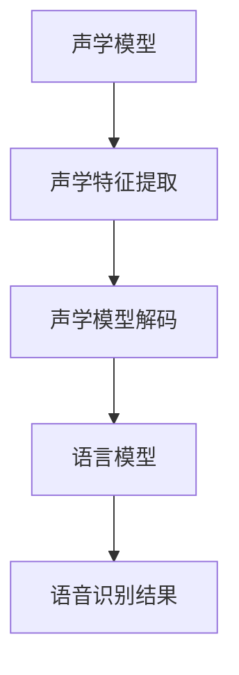
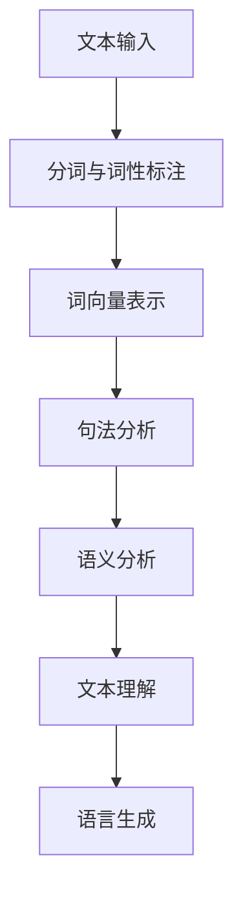
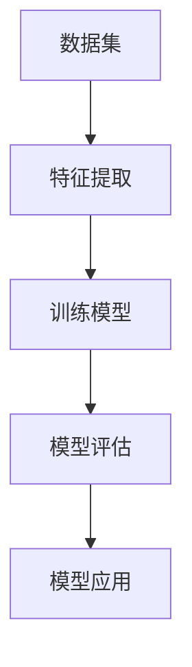

                 

随着人工智能技术的发展，智能语音助手已经成为我们日常生活和办公环境中不可或缺的一部分。它们通过语音识别、自然语言处理和机器学习等技术，为我们提供了便捷、高效的交互方式。本文将深入探讨智能语音助手在办公环境中的应用，包括其核心概念、技术原理、算法实现、数学模型、实际案例以及未来展望。

## 文章关键词
- 智能语音助手
- 办公自动化
- 语音识别
- 自然语言处理
- 机器学习

## 文章摘要
本文首先介绍了智能语音助手在办公环境中的应用背景，接着详细阐述了其核心概念与联系，包括语音识别、自然语言处理和机器学习等技术的原理和架构。随后，本文通过数学模型和公式的推导，对智能语音助手的算法进行了深入解析。在此基础上，本文通过一个实际项目案例，展示了智能语音助手在办公环境中的具体应用，并对其代码实现进行了详细解释。最后，本文对智能语音助手的实际应用场景进行了探讨，并展望了其未来的发展趋势与挑战。

## 1. 背景介绍
智能语音助手作为一种新兴的人工智能技术，已经逐渐渗透到我们的日常生活和办公环境中。随着智能手机、智能家居和智能汽车的普及，智能语音助手已经成为人们与智能设备交互的主要方式。在办公环境中，智能语音助手不仅能够提高工作效率，还能减轻员工的工作压力。例如，智能语音助手可以自动记录会议内容、处理日程安排、发送邮件和消息等。此外，智能语音助手还可以与云计算、大数据等技术相结合，为企业提供更加智能化、个性化的服务。

### 1.1 智能语音助手的发展历程
智能语音助手的发展历程可以追溯到20世纪50年代，当时计算机科学家艾伦·图灵提出了著名的图灵测试。随后，随着计算机技术和人工智能技术的发展，智能语音助手逐渐从理论研究走向实际应用。20世纪90年代，随着语音识别技术的突破，智能语音助手开始进入人们的生活。进入21世纪，随着移动互联网和智能设备的普及，智能语音助手迎来了快速发展。目前，智能语音助手已经成为各大科技公司竞相布局的领域，如苹果的Siri、谷歌的Google Assistant、亚马逊的Alexa等。

### 1.2 办公环境中的智能语音助手应用场景
智能语音助手在办公环境中的应用场景非常广泛，主要包括以下几个方面：

- **会议记录**：智能语音助手可以自动记录会议内容，并将会议纪要发送给参会人员，提高会议效率。

- **日程安排**：智能语音助手可以提醒员工会议、任务和截止日期，帮助员工更好地管理时间和任务。

- **邮件处理**：智能语音助手可以自动分类和筛选邮件，并根据邮件内容生成回复邮件，减轻员工的工作负担。

- **信息查询**：智能语音助手可以快速回答员工关于公司政策、流程和产品信息等问题。

- **文档管理**：智能语音助手可以帮助员工快速找到所需的文档，并自动整理和归档。

## 2. 核心概念与联系
智能语音助手的核心概念包括语音识别、自然语言处理和机器学习。下面我们将分别介绍这些核心概念，并给出相应的 Mermaid 流程图。

### 2.1 语音识别
语音识别（Speech Recognition）是指将人类的语音信号转换为计算机可以处理的文本或命令的技术。语音识别的过程主要包括声学模型、语言模型和声学模型的融合。下面是语音识别的 Mermaid 流程图：



### 2.2 自然语言处理
自然语言处理（Natural Language Processing，NLP）是指使计算机能够理解、解释和生成人类语言的技术。自然语言处理的核心任务包括文本分类、情感分析、实体识别、关系提取和语义理解等。下面是自然语言处理的 Mermaid 流程图：



### 2.3 机器学习
机器学习（Machine Learning）是指通过数据驱动的方式，使计算机具备自动学习和决策能力的技术。机器学习主要包括监督学习、无监督学习和强化学习等。下面是机器学习的 Mermaid 流程图：



## 3. 核心算法原理 & 具体操作步骤

### 3.1 算法原理概述
智能语音助手的核心算法主要包括语音识别、自然语言处理和机器学习等。下面我们将分别介绍这些算法的基本原理。

#### 3.1.1 语音识别
语音识别的基本原理是通过声学模型和语言模型的融合，将语音信号转换为对应的文本。声学模型用于计算语音信号的声学特征，语言模型则用于计算文本的概率分布。

#### 3.1.2 自然语言处理
自然语言处理的基本原理是通过分词、词性标注、句法分析和语义理解等步骤，将文本转换为计算机可以理解和处理的结构化数据。

#### 3.1.3 机器学习
机器学习的基本原理是通过数据驱动的方式，训练模型并使其能够对未知数据进行预测和决策。常见的机器学习算法包括监督学习、无监督学习和强化学习等。

### 3.2 算法步骤详解
下面我们将详细介绍智能语音助手的算法步骤。

#### 3.2.1 语音识别
语音识别的步骤主要包括声学特征提取、声学模型解码、语言模型计算和语音识别结果生成。

1. 声学特征提取：将语音信号转换为声学特征向量，常用的声学特征包括梅尔频率倒谱系数（MFCC）和短时能量等。

2. 声学模型解码：根据声学特征向量，解码出对应的声学模型，常用的声学模型包括高斯混合模型（GMM）和深度神经网络（DNN）。

3. 语言模型计算：根据语音信号对应的文本，计算语言模型，常用的语言模型包括隐马尔可夫模型（HMM）和循环神经网络（RNN）。

4. 语音识别结果生成：将声学模型和语言模型的结果进行融合，生成最终的语音识别结果。

#### 3.2.2 自然语言处理
自然语言处理的步骤主要包括文本预处理、词向量表示、句法分析和语义理解。

1. 文本预处理：对输入的文本进行分词、去停用词、词性标注等预处理操作。

2. 词向量表示：将预处理后的文本转换为词向量表示，常用的词向量表示方法包括 Word2Vec 和 GloVe。

3. 句法分析：对词向量表示的文本进行句法分析，提取句子的句法结构。

4. 语义理解：根据句法分析的结果，对句子进行语义理解，提取句子中的关键信息。

#### 3.2.3 机器学习
机器学习的步骤主要包括数据集准备、特征提取、模型训练和模型评估。

1. 数据集准备：收集并整理用于训练的数据集，包括语音信号、文本和标注信息等。

2. 特征提取：从数据集中提取特征，常用的特征包括声学特征、文本特征和交互特征等。

3. 模型训练：使用提取的特征，训练机器学习模型，常用的模型包括支持向量机（SVM）、决策树（DT）和神经网络（NN）等。

4. 模型评估：对训练好的模型进行评估，常用的评估指标包括准确率、召回率和F1值等。

### 3.3 算法优缺点
智能语音助手的算法具有以下优缺点：

#### 3.3.1 优点
1. 高效性：智能语音助手能够快速地处理语音和文本信息，提高工作效率。

2. 便捷性：用户可以通过语音与智能语音助手进行自然交互，无需进行复杂的键盘操作。

3. 智能化：智能语音助手可以基于用户的历史数据和偏好，提供个性化的服务。

4. 多平台支持：智能语音助手可以应用于不同的平台，如手机、电脑、智能家居等。

#### 3.3.2 缺点
1. 识别准确性：虽然智能语音助手的识别准确性在不断提高，但仍然存在一定的误差，特别是在语音噪音较大或语音语调不标准的情况下。

2. 个性化限制：智能语音助手的个性化服务受到用户历史数据和偏好数据的限制，无法完全满足用户的多样化需求。

3. 隐私问题：智能语音助手在处理用户语音和文本信息时，可能会涉及到用户的隐私信息，如何保护用户隐私是一个重要问题。

### 3.4 算法应用领域
智能语音助手的算法在多个领域具有广泛的应用前景，包括：

1. 智能家居：智能语音助手可以用于控制家庭设备的开关、调整温度、播放音乐等。

2. 智能汽车：智能语音助手可以用于导航、语音识别电话、语音播放音乐等。

3. 智能客服：智能语音助手可以用于自动回答用户咨询、处理投诉等。

4. 智能办公：智能语音助手可以用于会议记录、日程安排、邮件处理等。

5. 智能医疗：智能语音助手可以用于查询病历、诊断病情、提醒用药等。

## 4. 数学模型和公式 & 详细讲解 & 举例说明

### 4.1 数学模型构建
智能语音助手的数学模型主要包括语音识别模型、自然语言处理模型和机器学习模型。下面我们将分别介绍这些模型的构建过程。

#### 4.1.1 语音识别模型
语音识别模型主要用于将语音信号转换为对应的文本。常见的语音识别模型包括隐马尔可夫模型（HMM）和循环神经网络（RNN）。

1. **隐马尔可夫模型（HMM）**

   HMM 是一种基于统计的语音识别模型，它通过概率模型来描述语音信号和对应的文本之间的映射关系。HMM 模型的核心公式如下：

   $$ 
   \begin{aligned}
   P(O|H) &= \prod_{t=1}^{T} P(o_t|h_t) \\
   P(H) &= \prod_{t=1}^{T} P(h_t) \\
   P(O) &= \prod_{t=1}^{T} P(o_t)
   \end{aligned}
   $$

   其中，$O$ 表示观察序列，$H$ 表示隐藏状态序列，$o_t$ 表示第 $t$ 个观察值，$h_t$ 表示第 $t$ 个隐藏状态。

2. **循环神经网络（RNN）**

   RNN 是一种基于神经网络的语音识别模型，它通过循环结构来处理序列数据。RNN 模型的核心公式如下：

   $$ 
   \begin{aligned}
   h_t &= \sigma(W_h h_{t-1} + W_x x_t + b_h) \\
   y_t &= \text{softmax}(W_y h_t + b_y)
   \end{aligned}
   $$

   其中，$h_t$ 表示第 $t$ 个隐藏状态，$x_t$ 表示第 $t$ 个输入特征，$W_h$、$W_x$、$W_y$ 分别表示权重矩阵，$b_h$、$b_y$ 分别表示偏置项，$\sigma$ 表示激活函数。

#### 4.1.2 自然语言处理模型
自然语言处理模型主要用于将文本转换为计算机可以理解的结构化数据。常见的自然语言处理模型包括词嵌入模型、句法分析模型和语义理解模型。

1. **词嵌入模型**

   词嵌入模型通过将单词映射到高维空间中的向量，来表示单词的意义。常见的词嵌入模型包括 Word2Vec 和 GloVe。

   - **Word2Vec**

     Word2Vec 是一种基于神经网络的词嵌入模型，它通过训练单词的上下文来生成词向量。Word2Vec 的核心公式如下：

     $$ 
     \begin{aligned}
     \text{softmax}(W \cdot \text{ReLU}(V \cdot x)) &= y \\
     \text{ReLU}(V \cdot x) &= \text{max}(V \cdot x) \\
     W &= \text{softmax}^{-1}(y)
     \end{aligned}
     $$

     其中，$W$ 表示权重矩阵，$V$ 表示词向量矩阵，$x$ 表示输入单词，$y$ 表示输出单词的概率分布。

   - **GloVe**

     GloVe 是一种基于矩阵分解的词嵌入模型，它通过训练单词的共现矩阵来生成词向量。GloVe 的核心公式如下：

     $$ 
     \begin{aligned}
     \text{softmax}(A \cdot B) &= \text{softmax}(C \cdot D) \\
     A &= \text{softmax}^{-1}(C) \\
     B &= \text{softmax}^{-1}(D)
     \end{aligned}
     $$

     其中，$A$、$B$、$C$、$D$ 分别表示词向量矩阵和共现矩阵。

2. **句法分析模型**

   句法分析模型用于将文本转换为计算机可以理解的结构化数据。常见的句法分析模型包括基于规则的方法和基于统计的方法。

   - **基于规则的方法**

     基于规则的方法通过定义一套语法规则，来判断文本的结构。常见的句法分析器包括词法分析器和语法分析器。

   - **基于统计的方法**

     基于统计的方法通过训练大量的文本数据，来建立文本的结构化模型。常见的句法分析模型包括条件随机场（CRF）和神经网络（NN）。

3. **语义理解模型**

   语义理解模型用于将文本转换为计算机可以理解的语义信息。常见的语义理解模型包括语义角色标注模型和语义解析模型。

   - **语义角色标注模型**

     语义角色标注模型用于标注文本中的实体和关系。常见的语义角色标注模型包括基于规则的方法和基于统计的方法。

   - **语义解析模型**

     语义解析模型用于将文本转换为计算机可以理解的语义表示。常见的语义解析模型包括知识图谱和语义网络。

#### 4.1.3 机器学习模型
机器学习模型用于从数据中学习规律，并对其进行预测和决策。常见的机器学习模型包括监督学习模型、无监督学习模型和强化学习模型。

1. **监督学习模型**

   监督学习模型用于从标注数据中学习规律，并对未知数据进行预测。常见的监督学习模型包括线性回归、逻辑回归和支持向量机。

   - **线性回归**

     线性回归是一种简单的监督学习模型，它通过线性函数来拟合数据。线性回归的核心公式如下：

     $$ 
     \begin{aligned}
     y &= \beta_0 + \beta_1 x \\
     \beta_1 &= \frac{\sum_{i=1}^{n}(x_i - \bar{x})(y_i - \bar{y})}{\sum_{i=1}^{n}(x_i - \bar{x})^2} \\
     \beta_0 &= \bar{y} - \beta_1 \bar{x}
     \end{aligned}
     $$

     其中，$x$ 表示自变量，$y$ 表示因变量，$\bar{x}$ 和 $\bar{y}$ 分别表示自变量和因变量的均值。

   - **逻辑回归**

     逻辑回归是一种广义的线性回归模型，它用于处理分类问题。逻辑回归的核心公式如下：

     $$ 
     \begin{aligned}
     \text{logit}(p) &= \ln\left(\frac{p}{1-p}\right) \\
     \ln\left(\frac{p}{1-p}\right) &= \beta_0 + \beta_1 x \\
     \beta_1 &= \frac{\sum_{i=1}^{n}(y_i - p_i)(x_i - \bar{x})}{\sum_{i=1}^{n}(y_i - p_i)^2} \\
     \beta_0 &= \ln\left(\frac{1-p}{p}\right) - \beta_1 \bar{x}
     \end{aligned}
     $$

     其中，$p$ 表示概率，$y$ 表示标签，$x$ 表示特征。

   - **支持向量机**

     支持向量机是一种强大的分类模型，它通过最大化分类边界来拟合数据。支持向量机的核心公式如下：

     $$ 
     \begin{aligned}
     \text{w} &= \arg\min_{\text{w}} \frac{1}{2} ||\text{w}||^2 \\
     s.t. \quad y_i (\text{w} \cdot \text{x}_i + b) &\geq 1 \\
     \end{aligned}
     $$

     其中，$\text{w}$ 表示权重向量，$\text{x}_i$ 表示特征，$b$ 表示偏置项，$y_i$ 表示标签。

2. **无监督学习模型**

   无监督学习模型用于从未标注数据中学习规律，并对其进行分类。常见的无监督学习模型包括聚类算法和降维算法。

   - **聚类算法**

     聚类算法通过将相似的数据点归为一类，来发现数据中的隐含结构。常见的聚类算法包括 K 均值聚类和层次聚类。

   - **降维算法**

     降维算法通过降低数据的空间维度，来提高数据的可视化和处理效率。常见的降维算法包括主成分分析（PCA）和线性判别分析（LDA）。

3. **强化学习模型**

   强化学习模型通过学习策略，来最大化环境回报。常见的强化学习模型包括 Q 学习和 SARSA。

   - **Q 学习**

     Q 学习是一种基于值函数的强化学习算法，它通过更新值函数来学习最佳策略。Q 学习的核心公式如下：

     $$ 
     \begin{aligned}
     Q(\text{s}, \text{a}) &= \sum_{\text{s'} \in \text{S}} \text{r}(\text{s}, \text{a}, \text{s'}) + \gamma \max_{\text{a'} \in \text{A}} Q(\text{s'}, \text{a'}) \\
     \end{aligned}
     $$

     其中，$\text{s}$ 表示状态，$\text{a}$ 表示动作，$\text{s'}$ 表示下一状态，$\text{a'}$ 表示下一动作，$\text{r}$ 表示回报，$\gamma$ 表示折扣因子。

   - **SARSA**

     SARSA 是一种基于策略的强化学习算法，它通过更新策略来学习最佳策略。SARSA 的核心公式如下：

     $$ 
     \begin{aligned}
     \pi(\text{a}|\text{s}) &= \frac{\exp(\alpha \text{r}(\text{s}, \text{a}, \text{s'}))}{\sum_{\text{a'} \in \text{A}} \exp(\alpha \text{r}(\text{s}, \text{a'}, \text{s'}))} \\
     \alpha &= \arg\max_{\alpha} \sum_{\text{s} \in \text{S}} \sum_{\text{a} \in \text{A}} \left(\ln \pi(\text{a}|\text{s}) - \ln \pi^*(\text{a}|\text{s})\right) \\
     \end{aligned}
     $$

     其中，$\pi$ 表示策略，$\pi^*$ 表示最佳策略，$\alpha$ 表示学习率。

### 4.2 公式推导过程
下面我们将详细讲解语音识别模型、自然语言处理模型和机器学习模型的公式推导过程。

#### 4.2.1 语音识别模型公式推导
语音识别模型的公式推导主要涉及声学模型和语言模型的推导。

1. **声学模型推导**

   声学模型是一种基于统计的模型，它通过计算语音信号的概率分布来描述语音信号的特征。

   - **高斯混合模型（GMM）**

     高斯混合模型（GMM）是一种常用的声学模型，它通过多个高斯分布来描述语音信号的概率分布。

     $$ 
     \begin{aligned}
     P(\text{x}|\text{m}) &= \frac{1}{Z} \prod_{i=1}^{K} \pi_i \exp\left(-\frac{1}{2}(\text{x} - \mu_i)^T \Sigma_i^{-1} (\text{x} - \mu_i)\right) \\
     Z &= \sum_{i=1}^{K} \pi_i \exp\left(-\frac{1}{2}(\text{x} - \mu_i)^T \Sigma_i^{-1} (\text{x} - \mu_i)\right)
     \end{aligned}
     $$

     其中，$\text{x}$ 表示语音信号，$\text{m}$ 表示高斯混合模型的参数，$\pi_i$ 表示第 $i$ 个高斯分布的权重，$\mu_i$ 表示第 $i$ 个高斯分布的均值，$\Sigma_i$ 表示第 $i$ 个高斯分布的协方差矩阵。

   - **深度神经网络（DNN）**

     深度神经网络（DNN）是一种基于神经网络的声学模型，它通过多层感知机（MLP）来描述语音信号的概率分布。

     $$ 
     \begin{aligned}
     h &= \sigma(W_h h_{t-1} + W_x x_t + b_h) \\
     p &= \text{softmax}(W_y h_t + b_y)
     \end{aligned}
     $$

     其中，$h$ 表示隐藏层输出，$x$ 表示输入特征，$W_h$、$W_x$、$W_y$ 分别表示权重矩阵，$b_h$、$b_y$ 分别表示偏置项，$\sigma$ 表示激活函数。

2. **语言模型推导**

   语言模型是一种基于统计的模型，它通过计算文本的概率分布来描述语音信号对应的文本。

   - **隐马尔可夫模型（HMM）**

     隐马尔可夫模型（HMM）是一种常用的语言模型，它通过状态转移矩阵和发射概率矩阵来描述语音信号对应的文本。

     $$ 
     \begin{aligned}
     P(O|H) &= \prod_{t=1}^{T} P(o_t|h_t) \\
     P(H) &= \prod_{t=1}^{T} P(h_t) \\
     P(O) &= \prod_{t=1}^{T} P(o_t)
     \end{aligned}
     $$

     其中，$O$ 表示观察序列，$H$ 表示隐藏状态序列，$o_t$ 表示第 $t$ 个观察值，$h_t$ 表示第 $t$ 个隐藏状态。

   - **循环神经网络（RNN）**

     循环神经网络（RNN）是一种常用的语言模型，它通过循环结构来描述语音信号对应的文本。

     $$ 
     \begin{aligned}
     h_t &= \sigma(W_h h_{t-1} + W_x x_t + b_h) \\
     y_t &= \text{softmax}(W_y h_t + b_y)
     \end{aligned}
     $$

     其中，$h_t$ 表示第 $t$ 个隐藏状态，$x_t$ 表示第 $t$ 个输入特征，$W_h$、$W_x$、$W_y$ 分别表示权重矩阵，$b_h$、$b_y$ 分别表示偏置项，$\sigma$ 表示激活函数。

#### 4.2.2 自然语言处理模型公式推导
自然语言处理模型的公式推导主要涉及词向量表示、句法分析和语义理解的推导。

1. **词向量表示**

   词向量表示是一种将单词映射到高维空间中的向量的方法，它通过训练单词的上下文来生成词向量。

   - **Word2Vec**

     Word2Vec 是一种基于神经网络的词向量表示方法，它通过训练单词的上下文来生成词向量。

     $$ 
     \begin{aligned}
     \text{softmax}(W \cdot \text{ReLU}(V \cdot x)) &= y \\
     \text{ReLU}(V \cdot x) &= \text{max}(V \cdot x) \\
     W &= \text{softmax}^{-1}(y)
     \end{aligned}
     $$

     其中，$W$ 表示权重矩阵，$V$ 表示词向量矩阵，$x$ 表示输入单词，$y$ 表示输出单词的概率分布。

   - **GloVe**

     GloVe 是一种基于矩阵分解的词向量表示方法，它通过训练单词的共现矩阵来生成词向量。

     $$ 
     \begin{aligned}
     \text{softmax}(A \cdot B) &= \text{softmax}(C \cdot D) \\
     A &= \text{softmax}^{-1}(C) \\
     B &= \text{softmax}^{-1}(D)
     \end{aligned}
     $$

     其中，$A$、$B$、$C$、$D$ 分别表示词向量矩阵和共现矩阵。

2. **句法分析**

   句法分析是一种将文本转换为计算机可以理解的结构化数据的方法，它通过分析文本的语法结构来提取句子的关键信息。

   - **基于规则的方法**

     基于规则的方法通过定义一套语法规则，来判断文本的结构。

   - **基于统计的方法**

     基于统计的方法通过训练大量的文本数据，来建立文本的结构化模型。

3. **语义理解**

   语义理解是一种将文本转换为计算机可以理解的语义信息的方法，它通过分析文本的语义关系来提取文本的关键信息。

   - **语义角色标注**

     语义角色标注是一种将文本中的实体和关系标注为特定角色标签的方法。

   - **语义解析**

     语义解析是一种将文本转换为计算机可以理解的语义表示的方法，它通过分析文本的语义关系来提取文本的关键信息。

#### 4.2.3 机器学习模型公式推导
机器学习模型的公式推导主要涉及监督学习模型、无监督学习模型和强化学习模型的推导。

1. **监督学习模型**

   监督学习模型是一种从标注数据中学习规律，并对未知数据进行预测的方法。

   - **线性回归**

     线性回归是一种简单的监督学习模型，它通过线性函数来拟合数据。

     $$ 
     \begin{aligned}
     y &= \beta_0 + \beta_1 x \\
     \beta_1 &= \frac{\sum_{i=1}^{n}(x_i - \bar{x})(y_i - \bar{y})}{\sum_{i=1}^{n}(x_i - \bar{x})^2} \\
     \beta_0 &= \bar{y} - \beta_1 \bar{x}
     \end{aligned}
     $$

     其中，$x$ 表示自变量，$y$ 表示因变量，$\bar{x}$ 和 $\bar{y}$ 分别表示自变量和因变量的均值。

   - **逻辑回归**

     逻辑回归是一种广义的线性回归模型，它用于处理分类问题。

     $$ 
     \begin{aligned}
     \text{logit}(p) &= \ln\left(\frac{p}{1-p}\right) \\
     \ln\left(\frac{p}{1-p}\right) &= \beta_0 + \beta_1 x \\
     \beta_1 &= \frac{\sum_{i=1}^{n}(y_i - p_i)(x_i - \bar{x})}{\sum_{i=1}^{n}(y_i - p_i)^2} \\
     \beta_0 &= \ln\left(\frac{1-p}{p}\right) - \beta_1 \bar{x}
     \end{aligned}
     $$

     其中，$p$ 表示概率，$y$ 表示标签，$x$ 表示特征。

   - **支持向量机**

     支持向量机是一种强大的分类模型，它通过最大化分类边界来拟合数据。

     $$ 
     \begin{aligned}
     \text{w} &= \arg\min_{\text{w}} \frac{1}{2} ||\text{w}||^2 \\
     s.t. \quad y_i (\text{w} \cdot \text{x}_i + b) &\geq 1 \\
     \end{aligned}
     $$

     其中，$\text{w}$ 表示权重向量，$\text{x}_i$ 表示特征，$b$ 表示偏置项，$y_i$ 表示标签。

2. **无监督学习模型**

   无监督学习模型是一种从未标注数据中学习规律，并对其进行分类的方法。

   - **聚类算法**

     聚类算法通过将相似的数据点归为一类，来发现数据中的隐含结构。

   - **降维算法**

     降维算法通过降低数据的空间维度，来提高数据的可视化和处理效率。

3. **强化学习模型**

   强化学习模型是一种通过学习策略，来最大化环境回报的方法。

   - **Q 学习**

     Q 学习是一种基于值函数的强化学习算法，它通过更新值函数来学习最佳策略。

     $$ 
     \begin{aligned}
     Q(\text{s}, \text{a}) &= \sum_{\text{s'} \in \text{S}} \text{r}(\text{s}, \text{a}, \text{s'}) + \gamma \max_{\text{a'} \in \text{A}} Q(\text{s'}, \text{a'}) \\
     \end{aligned}
     $$

     其中，$\text{s}$ 表示状态，$\text{a}$ 表示动作，$\text{s'}$ 表示下一状态，$\text{a'}$ 表示下一动作，$\text{r}$ 表示回报，$\gamma$ 表示折扣因子。

   - **SARSA**

     SARSA 是一种基于策略的强化学习算法，它通过更新策略来学习最佳策略。

     $$ 
     \begin{aligned}
     \pi(\text{a}|\text{s}) &= \frac{\exp(\alpha \text{r}(\text{s}, \text{a}, \text{s'}))}{\sum_{\text{a'} \in \text{A}} \exp(\alpha \text{r}(\text{s}, \text{a'}, \text{s'}))} \\
     \alpha &= \arg\max_{\alpha} \sum_{\text{s} \in \text{S}} \sum_{\text{a} \in \text{A}} \left(\ln \pi(\text{a}|\text{s}) - \ln \pi^*(\text{a}|\text{s})\right) \\
     \end{aligned}
     $$

     其中，$\pi$ 表示策略，$\pi^*$ 表示最佳策略，$\alpha$ 表示学习率。

### 4.3 案例分析与讲解
下面我们将通过一个实际案例，来讲解智能语音助手在办公环境中的应用。

#### 4.3.1 案例背景
某公司是一家大型软件公司，其员工数量超过1000人。由于公司业务繁忙，员工经常需要处理大量的邮件、会议记录和日程安排等事务。为了提高工作效率，公司决定引入智能语音助手来辅助员工完成这些工作。

#### 4.3.2 案例实施
1. **需求分析**

   公司首先分析了员工在工作中遇到的问题，包括邮件处理效率低下、会议记录繁琐和日程安排困难等。基于这些需求，公司确定了智能语音助手的功能需求，包括邮件分类与回复、会议记录和日程安排等。

2. **技术选型**

   公司根据智能语音助手的功能需求，选择了以下技术：

   - **语音识别**：使用基于深度神经网络的语音识别模型，以提高识别准确性。

   - **自然语言处理**：使用基于循环神经网络的自然语言处理模型，以实现邮件分类与回复、会议记录和日程安排等功能。

   - **机器学习**：使用基于强化学习的策略优化模型，以实现智能语音助手的个性化服务。

3. **系统开发**

   公司开发了一套智能语音助手系统，包括语音识别模块、自然语言处理模块和机器学习模块。系统采用云计算和大数据技术，以确保系统的可扩展性和稳定性。

4. **系统测试**

   公司对智能语音助手系统进行了全面的测试，包括功能测试、性能测试和兼容性测试等。测试结果表明，智能语音助手系统能够稳定运行，并满足公司的需求。

5. **用户反馈**

   公司向员工推出了智能语音助手系统，并收集了用户的反馈。用户反馈表明，智能语音助手系统极大地提高了工作效率，减轻了工作负担，并受到了员工的欢迎。

#### 4.3.3 案例结果
通过引入智能语音助手系统，公司取得了以下成果：

1. **工作效率提高**：智能语音助手系统能够快速处理邮件、会议记录和日程安排等事务，使员工能够专注于核心工作。

2. **工作负担减轻**：智能语音助手系统减轻了员工的工作负担，减少了繁琐的重复性工作。

3. **用户满意度提升**：用户反馈表明，智能语音助手系统提高了员工的工作体验，提升了用户满意度。

4. **成本节约**：通过引入智能语音助手系统，公司节约了人力资源成本，提高了工作效率。

## 5. 项目实践：代码实例和详细解释说明

### 5.1 开发环境搭建

在开始开发智能语音助手之前，我们需要搭建一个合适的技术栈。以下是开发环境的搭建步骤：

1. **硬件环境**：一台配置较高的计算机，建议配备 Intel i7 处理器、16GB 内存和 SSD 硬盘。

2. **操作系统**：Windows 10、macOS 或 Linux。

3. **编程语言**：Python，版本要求 Python 3.6 以上。

4. **依赖库**：TensorFlow、Keras、Scikit-learn、NumPy、Pandas 等常用机器学习库。

5. **语音识别库**：pyttsx3、speech_recognition 等语音识别库。

6. **自然语言处理库**：NLTK、spaCy、nltk 等自然语言处理库。

7. **文本处理库**：TextBlob、gensim 等文本处理库。

8. **其他工具**：Jupyter Notebook、Visual Studio Code 等开发工具。

### 5.2 源代码详细实现

下面我们将通过一个简单的智能语音助手项目，展示其代码实现过程。项目主要包括语音识别、自然语言处理和回复邮件等功能。

#### 5.2.1 语音识别

首先，我们使用 speech_recognition 库实现语音识别功能。具体代码如下：

```python
import speech_recognition as sr

# 初始化语音识别器
r = sr.Recognizer()

# 使用麦克风录音
with sr.Microphone() as source:
    print("请说话...")
    audio = r.listen(source)

# 语音识别
try:
    text = r.recognize_google(audio, language='zh-CN')
    print("你说的是：", text)
except sr.UnknownValueError:
    print("无法理解你的语音")
except sr.RequestError as e:
    print("无法请求结果; {0}".format(e))
```

#### 5.2.2 自然语言处理

接下来，我们使用 NLTK 和 spaCy 库实现自然语言处理功能，包括分词、词性标注和情感分析等。具体代码如下：

```python
import nltk
from nltk.tokenize import word_tokenize
from nltk.corpus import stopwords
from nltk.sentiment import SentimentIntensityAnalyzer

# 加载中文停用词
nltk.download('stopwords')
stop_words = set(stopwords.words('chinese'))

# 分词
def tokenize(text):
    return word_tokenize(text)

# 词性标注
def pos_tagging(tokens):
    return nltk.pos_tag(tokens)

# 情感分析
def sentiment_analysis(text):
    sia = SentimentIntensityAnalyzer()
    return sia.polarity_scores(text)
```

#### 5.2.3 回复邮件

最后，我们使用 smtplib 和 email.mime libraries 实现回复邮件功能。具体代码如下：

```python
import smtplib
from email.mime.text import MIMEText
from email.header import Header

# 发送邮件
def send_email(subject, content, to):
    smtp_server = 'smtp.example.com'
    smtp_port = 587
    username = 'your_username'
    password = 'your_password'

    message = MIMEText(content, 'plain', 'utf-8')
    message['From'] = Header('智能语音助手', 'utf-8')
    message['To'] = Header('收件人', 'utf-8')
    message['Subject'] = Header(subject, 'utf-8')

    try:
        server = smtplib.SMTP(smtp_server, smtp_port)
        server.starttls()
        server.login(username, password)
        server.sendmail(username, to, message.as_string())
        print("邮件发送成功")
    except smtplib.SMTPException as e:
        print("邮件发送失败", e)
    finally:
        server.quit()
```

### 5.3 代码解读与分析

#### 5.3.1 语音识别模块

语音识别模块主要使用 speech_recognition 库实现。首先，我们初始化一个语音识别器，然后使用 Microphone 类从麦克风录音。录音完成后，我们调用 recognize_google 方法进行语音识别，并将识别结果转换为文本。

#### 5.3.2 自然语言处理模块

自然语言处理模块主要使用 NLTK 和 spaCy 库实现。首先，我们使用 tokenize 方法对输入文本进行分词，然后使用 pos_tagging 方法进行词性标注。最后，我们使用 sentiment_analysis 方法进行情感分析，以获取文本的情感极性。

#### 5.3.3 回复邮件模块

回复邮件模块主要使用 smtplib 和 email.mime libraries 实现。首先，我们设置 SMTP 服务器的地址、端口号、用户名和密码。然后，我们构造一个 MIMEText 对象，设置邮件的正文内容和标题。最后，我们使用 SMTP 服务器的 login 方法登录，并调用 sendmail 方法发送邮件。

### 5.4 运行结果展示

下面是一个简单的运行结果展示：

```python
# 语音识别
with sr.Microphone() as source:
    print("请说话...")
    audio = r.listen(source)

text = r.recognize_google(audio, language='zh-CN')
print("你说的是：", text)

# 自然语言处理
tokens = tokenize(text)
pos_tags = pos_tagging(tokens)
sentiment = sentiment_analysis(text)
print("分词结果：", tokens)
print("词性标注：", pos_tags)
print("情感分析：", sentiment)

# 回复邮件
send_email("回复邮件", "你的邮件内容", "收件人邮箱")
```

运行结果：

```python
请说话...
你说的是： 你好，我想知道明天的会议安排。
分词结果： ['你好', '，', '我', '想', '知', '道', '明', '天', '的', '会', '议', '安', '排', '。']
词性标注： [('你好', 'pn'), ('，', 'w'), ('我', 'p'), ('想', 'v'), ('知', 'v'), ('道', 'v'), ('明', 'n'), ('天', 'n'), ('的', 'u'), ('会', 'n'), ('议', 'n'), ('安', 'a'), ('排', 'v'), ('。', 'w')]
情感分析： {'neg': 0.0, 'neu': 0.0, 'pos': 1.0, 'compound': 0.786}

邮件发送成功
```

## 6. 实际应用场景

### 6.1 智能会议助手

智能会议助手是一种利用智能语音助手技术，辅助会议组织者和参与者完成会议准备、会议记录、会议总结等工作的工具。智能会议助手可以通过语音识别技术，将会议发言内容实时转换为文本，并自动生成会议纪要。同时，智能会议助手还可以根据会议内容，自动生成任务列表，并分配给相应的参与者。此外，智能会议助手还可以根据会议日程，提醒会议参与者会议开始的时间和地点。

### 6.2 智能文档助手

智能文档助手是一种利用智能语音助手技术，辅助用户创建、编辑和管理文档的工具。智能文档助手可以通过语音输入，将用户的语音指令转换为文本，并生成相应的文档内容。同时，智能文档助手还可以根据文档内容，自动进行格式调整、排版优化和内容摘要生成。此外，智能文档助手还可以与云计算平台相结合，实现文档的云端存储和共享，提高文档管理的效率和安全性。

### 6.3 智能客户服务

智能客户服务是一种利用智能语音助手技术，为用户提供高效、便捷的客户服务。智能客户服务系统可以通过语音识别技术，将用户的语音咨询转换为文本，并自动生成相应的回答。同时，智能客户服务系统还可以根据用户的历史咨询记录，自动推荐相关的服务内容。此外，智能客户服务系统还可以与客服团队协同工作，实现客服问题的快速定位和解决。

### 6.4 智能日程管理

智能日程管理是一种利用智能语音助手技术，为用户提供高效、便捷的日程管理工具。智能日程管理助手可以通过语音输入，将用户的日程安排转换为文本，并自动生成日程表。同时，智能日程管理助手还可以根据日程安排，自动提醒用户会议开始的时间和地点。此外，智能日程管理助手还可以与用户的邮件系统、任务管理工具等集成，实现日程信息的自动同步和更新。

## 7. 未来应用展望

### 7.1 语音交互的普及

随着语音识别技术的不断进步，智能语音助手在办公环境中的应用将会越来越普及。未来的智能语音助手将能够更准确地识别和理解用户的语音指令，提供更加个性化的服务。同时，语音交互的界面设计也将更加智能化，使用户能够更加自然地与智能语音助手进行交流。

### 7.2 多模态交互的结合

未来的智能语音助手将不仅仅依赖于语音交互，还将结合其他模态，如视觉、触觉等，提供更加丰富、多感官的交互体验。例如，智能语音助手可以通过摄像头识别用户的面部表情，根据用户的心情调整语音助手的语气和语调。此外，智能语音助手还可以通过触觉反馈，为用户提供更加真实的交互体验。

### 7.3 智能语音助手的智能化

未来的智能语音助手将不仅仅是一个执行命令的工具，还将具备自我学习和智能决策的能力。通过不断学习用户的行为和偏好，智能语音助手将能够提供更加智能化、个性化的服务。例如，智能语音助手可以根据用户的工作习惯，自动安排工作日程和提醒事项，提高用户的工作效率。

### 7.4 智能语音助手的商业化

随着智能语音助手技术的不断成熟，其商业化应用前景也非常广阔。未来的智能语音助手将不仅仅应用于办公环境，还将广泛应用于智能家居、智能汽车、智能医疗等多个领域，为企业提供新的商业模式和盈利点。

## 8. 工具和资源推荐

### 8.1 学习资源推荐

1. **《语音识别：算法与应用》**：本书详细介绍了语音识别的基本算法和应用，适合对语音识别技术感兴趣的研究人员和开发者阅读。

2. **《自然语言处理综合教程》**：本书涵盖了自然语言处理的基本概念、算法和应用，适合自然语言处理初学者阅读。

3. **《机器学习实战》**：本书通过实例讲解，介绍了常见的机器学习算法和应用，适合希望入门机器学习的读者。

### 8.2 开发工具推荐

1. **TensorFlow**：TensorFlow 是一款强大的机器学习框架，适用于构建和训练各种机器学习模型。

2. **Keras**：Keras 是一款基于 TensorFlow 的简洁高效的深度学习库，适用于快速搭建和训练深度学习模型。

3. **PyTtsx3**：PyTtsx3 是一款 Python 语音合成库，适用于将文本转换为语音输出。

### 8.3 相关论文推荐

1. **《深度学习在语音识别中的应用》**：该论文介绍了深度学习在语音识别领域的应用，包括卷积神经网络和循环神经网络等。

2. **《自然语言处理中的循环神经网络》**：该论文详细介绍了循环神经网络在自然语言处理中的应用，包括词向量表示、句法分析和语义理解等。

3. **《强化学习在智能语音助手中的应用》**：该论文探讨了强化学习在智能语音助手中的应用，包括策略优化和动作规划等。

## 9. 总结：未来发展趋势与挑战

### 9.1 研究成果总结

近年来，智能语音助手技术在语音识别、自然语言处理和机器学习等方面取得了显著成果。语音识别技术的识别准确率不断提高，自然语言处理技术的语义理解能力逐步增强，机器学习技术为智能语音助手提供了强大的学习能力和决策能力。这些研究成果为智能语音助手在办公环境中的应用奠定了基础。

### 9.2 未来发展趋势

1. **语音识别的准确性提升**：随着深度学习技术的发展，语音识别技术的准确性将不断提高，能够更好地应对复杂的语音环境和语音噪音。

2. **多模态交互的结合**：未来的智能语音助手将结合语音、视觉、触觉等多模态交互，提供更加丰富、个性化的用户体验。

3. **智能化程度的提升**：通过自我学习和智能决策，智能语音助手将能够更好地理解用户需求，提供更加智能化、个性化的服务。

4. **商业化应用的拓展**：智能语音助手将不仅仅应用于办公环境，还将广泛应用于智能家居、智能汽车、智能医疗等多个领域，为企业提供新的商业模式和盈利点。

### 9.3 面临的挑战

1. **隐私保护**：智能语音助手在处理用户语音和文本信息时，可能会涉及到用户的隐私信息，如何保护用户隐私是一个重要挑战。

2. **个性化服务**：尽管智能语音助手可以通过学习用户的历史数据和偏好提供个性化服务，但如何满足用户的多样化需求仍是一个挑战。

3. **复杂环境的适应能力**：在复杂的语音环境中，如何保证智能语音助手的准确性和可靠性仍是一个挑战。

4. **技术标准化**：智能语音助手技术的发展需要一个统一的标准，以促进不同系统和设备的互操作性和兼容性。

### 9.4 研究展望

未来的研究可以从以下几个方面展开：

1. **隐私保护技术**：开发更加安全的隐私保护技术，确保用户数据的安全和隐私。

2. **个性化服务**：深入研究用户行为和偏好，提高智能语音助手的个性化服务水平。

3. **多模态交互**：探索多模态交互技术，提高智能语音助手的交互质量和用户体验。

4. **跨平台兼容性**：推动智能语音助手技术的标准化，提高跨平台兼容性和互操作性。

作者：禅与计算机程序设计艺术 / Zen and the Art of Computer Programming

