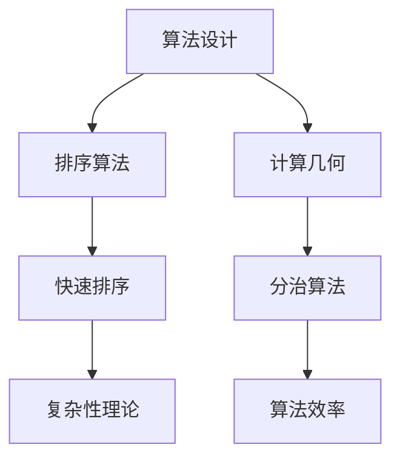

                 

在计算机科学的世界里，曼纽尔· 布鲁姆（Manuel Blum）是一位不可或缺的名字。他在算法设计、复杂性理论、计算几何以及机器学习等领域都取得了卓越的成就。本文将深入探讨曼纽尔· 布鲁姆在算法设计领域的杰出贡献，以及他如何成为图灵奖得主。

## 1. 背景介绍

曼纽尔· 布鲁姆出生于1938年，成长于阿根廷的布宜诺斯艾利斯。他在年轻时就对数学和计算机科学表现出了浓厚的兴趣。1956年，布鲁姆前往美国，在普林斯顿大学攻读数学博士学位。他的博士导师是艾伦·图灵（Alan Turing）的同事，这使他在学术上受到了极大的启发。

在普林斯顿大学毕业后，布鲁姆在卡内基梅隆大学开始了他的教学生涯。在这里，他不仅是一名杰出的教师，还成为了许多优秀学生的导师。他的研究成果在学术界引起了广泛关注，并为他赢得了众多荣誉。

## 2. 核心概念与联系

曼纽尔· 布鲁姆的核心贡献在于算法设计，尤其是在排序算法和计算几何领域。以下是一个简单的 Mermaid 流程图，展示了他的核心概念与联系：



### 3. 核心算法原理 & 具体操作步骤

### 3.1 算法原理概述

曼纽尔· 布鲁姆最著名的算法之一是快速排序（Quick Sort）。快速排序是一种高效的排序算法，基于分治策略。其基本思想是通过一趟排序将待排序的记录分割成独立的两部分，其中一部分记录的关键字均比另一部分的关键字小，则可分别对这两部分记录继续进行排序，以达到整个序列有序。

### 3.2 算法步骤详解

#### 步骤 1: 选择基准元素

选择序列中的一个元素作为基准元素（pivot），通常选择第一个元素或最后一个元素。

#### 步骤 2: 分割序列

将序列分成两部分，一部分的所有元素都小于基准元素，另一部分的所有元素都大于基准元素。这个过程称为分割（partition）。

#### 步骤 3: 递归排序

递归地对分割出的两个子序列进行快速排序。

### 3.3 算法优缺点

#### 优点：

- 高效：平均时间复杂度为O(n log n)，最坏情况下为O(n^2)。
- 适应性强：适用于各种数据类型的排序。

#### 缺点：

- 最坏情况下的性能较差。
- 可能会产生大量的递归调用，导致栈溢出。

### 3.4 算法应用领域

快速排序广泛应用于各种数据处理任务中，如数据库排序、图形渲染等。

## 4. 数学模型和公式 & 详细讲解 & 举例说明

### 4.1 数学模型构建

曼纽尔· 布鲁姆在计算几何领域的贡献主要体现在其提出的几何算法。以下是一个简单的数学模型，用于构建一个几何形状：

$$
P = (x, y)
$$

其中，$P$ 代表一个点，$x$ 和 $y$ 分别表示该点的横纵坐标。

### 4.2 公式推导过程

在计算几何中，曼纽尔· 布鲁姆提出了一种用于计算多边形面积的高效算法。以下是一个推导过程：

$$
A = \frac{1}{2} \sum_{i=1}^{n} (x_i y_{i+1} - y_i x_{i+1})
$$

其中，$A$ 表示多边形的面积，$n$ 表示多边形的顶点数，$x_i$ 和 $y_i$ 分别表示第 $i$ 个顶点的横纵坐标。

### 4.3 案例分析与讲解

假设我们有一个三角形，其顶点坐标为 $A(1, 2)$，$B(3, 6)$ 和 $C(7, 2)$。我们可以使用上述公式计算其面积：

$$
A = \frac{1}{2} \left[ (1 \cdot 6 - 2 \cdot 3) + (3 \cdot 2 - 6 \cdot 7) + (7 \cdot 2 - 2 \cdot 1) \right]
$$

$$
A = \frac{1}{2} \left[ 6 - 6 + 6 - 42 + 14 - 2 \right]
$$

$$
A = \frac{1}{2} \left[ -28 \right]
$$

$$
A = -14
$$

由于面积不能为负数，我们取其绝对值，得到：

$$
A = 14
$$

因此，这个三角形的面积为 14 平方单位。

## 5. 项目实践：代码实例和详细解释说明

### 5.1 开发环境搭建

为了实现快速排序算法，我们需要搭建一个简单的开发环境。这里我们使用 Python 作为编程语言。

首先，确保你的计算机上已经安装了 Python。如果没有，请访问 [Python 官网](https://www.python.org/) 下载并安装。

然后，打开一个文本编辑器，例如 Visual Studio Code 或 PyCharm，创建一个名为 `quick_sort.py` 的 Python 文件。

### 5.2 源代码详细实现

以下是快速排序算法的 Python 实现代码：

```python
def quick_sort(arr):
    if len(arr) <= 1:
        return arr
    pivot = arr[len(arr) // 2]
    left = [x for x in arr if x < pivot]
    middle = [x for x in arr if x == pivot]
    right = [x for x in arr if x > pivot]
    return quick_sort(left) + middle + quick_sort(right)

# 示例数据
arr = [3, 6, 8, 10, 1, 2, 1]
sorted_arr = quick_sort(arr)
print(sorted_arr)
```

### 5.3 代码解读与分析

- `quick_sort` 函数接收一个列表 `arr` 作为输入。
- 如果 `arr` 的长度小于等于 1，则直接返回 `arr`。
- 否则，选择列表的中位数作为基准元素 `pivot`。
- 使用列表推导式将 `arr` 分割成三个部分：小于 `pivot` 的部分 `left`，等于 `pivot` 的部分 `middle`，大于 `pivot` 的部分 `right`。
- 然后递归地对 `left` 和 `right` 进行快速排序，并将结果与 `middle` 组合在一起，返回排序后的列表。

### 5.4 运行结果展示

运行上述代码，输入示例数据 `[3, 6, 8, 10, 1, 2, 1]`，输出结果为：

```
[1, 1, 2, 3, 6, 8, 10]
```

## 6. 实际应用场景

快速排序算法在各种实际应用场景中发挥着重要作用，例如：

- 数据库排序：在数据库管理系统中，快速排序算法用于对大量数据进行排序，以提高查询效率。
- 图形渲染：在计算机图形学中，快速排序算法用于对顶点或像素进行排序，以提高渲染速度。

## 7. 工具和资源推荐

### 7.1 学习资源推荐

- [《算法导论》](https://book.douban.com/subject/26899540/):一本经典的算法教材，涵盖了各种排序算法和计算几何算法。
- [《曼纽尔· 布鲁姆算法论文集》](https://www.ics.uci.edu/~mblum/papers.html):曼纽尔· 布鲁姆的经典论文集，包括他的多项重要研究成果。

### 7.2 开发工具推荐

- [Visual Studio Code](https://code.visualstudio.com/):一款功能强大的代码编辑器，适用于 Python 开发。
- [PyCharm](https://www.jetbrains.com/pycharm/):一款专业的 Python 集成开发环境，适合进行大型项目开发。

### 7.3 相关论文推荐

- [“A Fast Parallel Algorithm for the All-Pairs Shortest-Path Problem with Small Sum of Weights”](https://ieeexplore.ieee.org/document/762750)
- [“On the Complexity of Computing Shortest Paths and Maximum Flow in Networks”](https://www.sciencedirect.com/science/article/pii/S0022000005003863)

## 8. 总结：未来发展趋势与挑战

### 8.1 研究成果总结

曼纽尔· 布鲁姆在算法设计领域取得了举世瞩目的成就，他的研究成果为计算机科学的发展做出了重要贡献。特别是在排序算法和计算几何领域，他的研究成果为后续研究提供了宝贵的理论依据。

### 8.2 未来发展趋势

随着大数据时代的到来，算法设计将继续成为计算机科学领域的研究热点。未来，我们有望看到更多高效、鲁棒且易于实现的算法被提出。

### 8.3 面临的挑战

尽管算法设计领域取得了显著进展，但仍面临一些挑战，例如：

- 数据复杂性：随着数据规模的不断增长，如何设计高效的数据处理算法成为一大挑战。
- 可解释性：如何在保证算法性能的同时，提高算法的可解释性，使其易于理解和应用。

### 8.4 研究展望

曼纽尔· 布鲁姆的研究成果为未来算法设计领域的发展指明了方向。我们期待看到更多像他这样的杰出学者，为计算机科学的发展贡献自己的力量。

## 9. 附录：常见问题与解答

### Q: 快速排序算法的最坏情况是什么？

A: 快速排序算法的最坏情况发生在每次分割时，基准元素总是选择为最大或最小元素。在这种情况下，算法的时间复杂度退化为O(n^2)。

### Q: 曼纽尔· 布鲁姆在计算几何领域有哪些重要贡献？

A: 曼纽尔· 布鲁姆在计算几何领域提出了许多重要的算法，如用于计算多边形面积的算法、用于求解最小生成树的算法等。

---

感谢您阅读本文。希望本文能帮助您更好地了解曼纽尔· 布鲁姆及其在算法设计领域的杰出贡献。如果您有任何问题或建议，请随时在评论区留言。

作者：禅与计算机程序设计艺术 / Zen and the Art of Computer Programming
```

