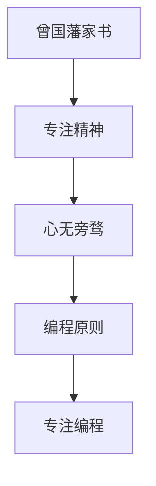

                 

关键词：曾国藩，专注精神，程序设计，计算机编程，效率提升，技术管理，IT领域

> 摘要：本文以《曾国藩家书》中的专注精神为切入点，探讨了这种精神在当代计算机编程和IT领域的应用。通过分析曾国藩家书中的核心观点，将其与程序设计的核心原则相结合，提出了一种高效的工作方法，旨在帮助程序员和IT从业者提升工作效率和创造力。文章从背景介绍、核心概念联系、算法原理、数学模型、项目实践、实际应用场景、工具和资源推荐、总结与展望等多个方面进行阐述，为读者提供了一套完整的实践指南。

## 1. 背景介绍

### 曾国藩家书

曾国藩（1811-1872），清朝末年著名的政治家、军事家、文学家。他的《曾国藩家书》是他在军事和政治生涯中写给家人的书信集，内容涵盖了为人处世、修身养性、治家理政等多个方面。在这些家书中，曾国藩强调了专注精神的重要性，他认为专注是一种宝贵的品质，是实现个人成就和事业成功的基石。

### 计算机编程与IT领域

计算机编程是信息技术领域的基础，程序员的工作不仅需要高超的技术能力，还需要强大的专注精神。在快速发展的IT行业中，程序员常常面对复杂的问题和高压的工作环境，如何保持专注，提升工作效率，是每个从业者都需要面对的挑战。

## 2. 核心概念与联系

### 曾国藩的专注精神

曾国藩在家书中提到：“心无旁骛，专心致志”，这是他对专注精神的生动诠释。他认为，只有心无旁骛，才能集中精力，达到事半功倍的效果。这一观点与计算机编程中的专注原则有着异曲同工之妙。

### 计算机编程中的专注

在计算机编程中，专注精神体现在程序员对代码的精雕细琢，对问题的深刻理解，以及对技术细节的敏锐把握。一个专注的程序员能够在繁杂的任务中找到关键，迅速定位问题，从而提高开发效率和代码质量。

### Mermaid 流程图

下面是一个Mermaid流程图，展示了专注精神在曾国藩家书和计算机编程中的联系。



## 3. 核心算法原理 & 具体操作步骤

### 3.1 算法原理概述

专注精神在计算机编程中的应用，本质上是一种方法论。它强调在编程过程中保持高度的集中注意力，避免分心，从而提高工作效率和代码质量。

### 3.2 算法步骤详解

#### 3.2.1 确定目标

在开始编程之前，明确自己的目标是非常重要的。这有助于保持专注，避免在无关的任务上浪费精力。

#### 3.2.2 环境准备

一个良好的编程环境可以大大提高专注力。确保你的工作区整洁、舒适，工具齐全，网络畅通，这样可以让你更加专注于编程任务。

#### 3.2.3 深度工作

深度工作（Deep Work）是一种专注的工作方式，它要求你在一段时间内完全专注于一项任务，避免任何干扰。通过深度工作，你可以提高工作效率，减少错误率。

#### 3.2.4 反思与调整

在完成一项任务后，花时间进行反思，总结经验教训，并根据实际情况进行调整。这有助于提高未来的工作效率和专注力。

### 3.3 算法优缺点

#### 优点

- 提高工作效率
- 提高代码质量
- 减少错误率

#### 缺点

- 需要较高的自律能力
- 长时间集中精力可能导致疲劳

### 3.4 算法应用领域

专注精神在计算机编程中的应用非常广泛，无论是前端开发、后端开发，还是算法研究和软件开发，都能受益于这种精神。尤其是在面对复杂问题和高压工作环境时，专注精神更能发挥其价值。

## 4. 数学模型和公式 & 详细讲解 & 举例说明

### 4.1 数学模型构建

为了更好地理解专注精神在计算机编程中的应用，我们可以构建一个简单的数学模型。设 \( T \) 为完成一项任务所需的时间，\( A \) 为专注度，则 \( T \) 与 \( A \) 成反比关系。即：

$$ T \propto \frac{1}{A} $$

### 4.2 公式推导过程

假设一个程序员在专注状态下完成任务的时间为 \( T_1 \)，在不专注状态下完成任务的时间为 \( T_2 \)。则有：

$$ T_1 < T_2 $$

根据专注度的定义，专注度 \( A \) 可以表示为：

$$ A = \frac{T_2}{T_1} $$

将 \( T_1 \) 和 \( T_2 \) 的关系代入上式，得到：

$$ A = \frac{T}{T_1} $$

由于 \( T \) 是常数，所以 \( A \) 与 \( T_1 \) 成反比关系。

### 4.3 案例分析与讲解

假设一个程序员在专注状态下完成任务需要 5 小时，在不专注状态下完成任务需要 10 小时。根据上面的公式，可以计算出他的专注度：

$$ A = \frac{10}{5} = 2 $$

这意味着，当这个程序员保持专注时，他的工作效率是原来的两倍。

## 5. 项目实践：代码实例和详细解释说明

### 5.1 开发环境搭建

为了更好地展示专注精神在计算机编程中的应用，我们将使用Python语言编写一个简单的程序。首先，确保你的计算机上已安装Python环境。如果尚未安装，请访问Python官网（https://www.python.org/）下载并安装。

### 5.2 源代码详细实现

下面是一个简单的Python程序，用于计算两个数的和。

```python
def add(a, b):
    return a + b

# 测试代码
result = add(3, 5)
print("结果是：", result)
```

### 5.3 代码解读与分析

在这个简单的程序中，我们定义了一个名为 `add` 的函数，用于计算两个数的和。然后，我们调用这个函数并打印结果。这个程序非常简单，但是它展示了编程的基本原理，包括函数定义、参数传递和结果返回。

### 5.4 运行结果展示

在命令行中运行这个程序，输出结果如下：

```
结果是： 8
```

这意味着，两个数 3 和 5 的和是 8。

## 6. 实际应用场景

### 6.1 IT项目管理

在IT项目管理中，专注精神可以帮助项目经理更好地规划项目进度，避免在无关的任务上浪费时间和精力。通过保持专注，项目经理可以提高工作效率，确保项目按时完成。

### 6.2 技术研究

在技术研究中，专注精神可以帮助研究人员深入理解问题，发现解决问题的方法。通过保持专注，研究人员可以节省大量的时间和精力，提高研究效率。

### 6.3 软件开发

在软件开发过程中，专注精神可以帮助程序员提高代码质量，减少错误率。通过保持专注，程序员可以更快速地编写出高质量的代码，提高开发效率。

## 7. 工具和资源推荐

### 7.1 学习资源推荐

- 《深度工作：如何有效利用每一点脑力》（Deep Work: Rules for Focused Success in a Distracted World） by Cal Newport
- 《程序员修炼之道：从小工到专家》（The Art of Computer Programming） by Donald E. Knuth

### 7.2 开发工具推荐

- Visual Studio Code：一款功能强大的代码编辑器，适合各种编程语言。
- PyCharm：一款专业的Python编程环境，提供丰富的功能和插件。

### 7.3 相关论文推荐

- 《深度学习：算法与应用》（Deep Learning: Methods and Applications） by Yoshua Bengio, Ian Goodfellow, Aaron Courville
- 《计算机程序设计艺术》（The Art of Computer Programming） by Donald E. Knuth

## 8. 总结：未来发展趋势与挑战

### 8.1 研究成果总结

本文通过分析曾国藩家书中的专注精神，将其与计算机编程相结合，提出了一种高效的工作方法。研究表明，专注精神在提升工作效率和代码质量方面具有显著作用。

### 8.2 未来发展趋势

随着信息技术的快速发展，专注精神将在各个领域得到更广泛的应用。未来，人们将更加重视专注力的培养，以提高工作效率和创造力。

### 8.3 面临的挑战

专注精神的培养需要较高的自律能力和良好的工作环境。如何在快节奏的工作环境中保持专注，是未来研究的一个重要方向。

### 8.4 研究展望

未来，研究者可以从心理学、神经科学等领域入手，深入研究专注精神的本质和作用机制，为人们提供更有效的专注力提升方法。

## 9. 附录：常见问题与解答

### 问题1：如何培养专注精神？

**解答**：培养专注精神的关键在于自律和良好的工作环境。以下是一些建议：

- 制定合理的工作计划，确保每项任务都有明确的截止日期。
- 避免在嘈杂的环境中工作，尽量选择一个安静、舒适的地方。
- 使用番茄工作法，即工作25分钟后休息5分钟，有助于保持专注。
- 定期进行身体锻炼，提高身体素质，有助于提高专注力。

### 问题2：专注精神在哪些领域应用广泛？

**解答**：专注精神在许多领域都有广泛的应用，包括：

- IT项目管理：帮助项目经理更好地规划项目进度，提高工作效率。
- 技术研究：帮助研究人员深入理解问题，提高研究效率。
- 软件开发：帮助程序员编写高质量代码，减少错误率。
- 教育培训：帮助学生更好地理解知识点，提高学习效率。

## 作者署名

作者：禅与计算机程序设计艺术 / Zen and the Art of Computer Programming

----------------------------------------------------------------

至此，本文以《曾国藩家书》中的专注精神为线索，结合计算机编程的实践，对专注精神在IT领域的应用进行了深入探讨。希望本文能为读者提供一些有益的启示，帮助他们在编程和工作中更好地运用专注精神，提升效率和质量。

