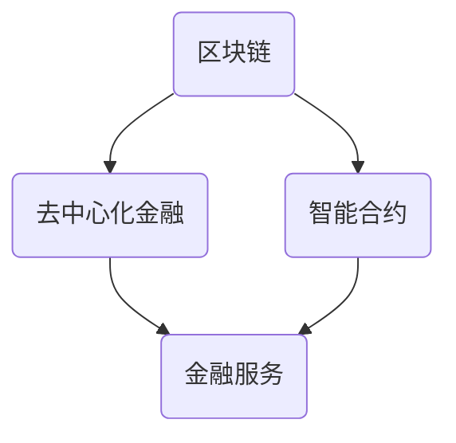

                 

关键词：区块链，去中心化金融，智能合约，未来趋势，技术发展，数学模型，代码实例，应用场景。

摘要：随着区块链技术的不断进步，去中心化金融（DeFi）和智能合约的应用正在逐渐改变传统金融体系。本文将深入探讨到2050年，区块链技术在金融领域的前沿进展，特别是去中心化金融和智能合约的发展方向，以及它们对社会和经济的潜在影响。

## 1. 背景介绍

区块链技术自2008年比特币的诞生以来，经历了迅速的发展。如今，区块链已经不仅仅局限于数字货币，而是广泛应用于供应链管理、物联网、身份验证、投票系统等多个领域。然而，在金融领域，去中心化金融（DeFi）和智能合约的应用潜力尤为显著。

去中心化金融旨在构建一个没有传统金融机构参与的金融生态系统，通过区块链技术实现点对点的金融服务。智能合约则是一种自动执行的合约，它根据预设的条件和条款在区块链上执行，无需依赖第三方中介机构。

## 2. 核心概念与联系

### 核心概念

- **区块链**：一种分布式数据库技术，数据以区块的形式存储，并通过密码学确保数据的不可篡改性。
- **去中心化金融（DeFi）**：基于区块链的金融应用，提供点对点的金融服务，如借贷、交易、保险等。
- **智能合约**：一种自动执行合约，基于区块链技术，通过编程代码实现预定义的逻辑和条款。

### 架构联系

以下是一个简单的 Mermaid 流程图，展示区块链、DeFi 和智能合约之间的联系：



## 3. 核心算法原理 & 具体操作步骤

### 3.1 算法原理概述

区块链的核心算法包括哈希函数、共识算法和智能合约编程语言。

- **哈希函数**：将任意长度的数据映射为固定长度的字符串，确保数据的唯一性和不可篡改性。
- **共识算法**：确保网络中的所有节点对区块链的状态达成一致，如工作量证明（PoW）、权益证明（PoS）等。
- **智能合约编程语言**：用于编写智能合约的编程语言，如 Solidity、Vyper 等。

### 3.2 算法步骤详解

#### 哈希函数

1. **输入数据**：将需要加密的数据输入哈希函数。
2. **哈希计算**：通过哈希函数计算输入数据的哈希值。
3. **输出结果**：将哈希值作为输出结果。

#### 共识算法

1. **节点同步**：网络中的节点同步区块链的状态。
2. **区块生成**：节点生成新的区块，包含最近的交易信息。
3. **区块验证**：其他节点验证新生成的区块是否符合共识规则。
4. **区块添加**：验证通过的区块被添加到区块链中。

#### 智能合约编程

1. **编写合约**：使用智能合约编程语言编写合约代码。
2. **部署合约**：将合约代码部署到区块链上。
3. **执行合约**：当满足合约条件时，自动执行合约中的逻辑。

### 3.3 算法优缺点

#### 哈希函数

- **优点**：确保数据唯一性和不可篡改性。
- **缺点**：计算复杂度高，可能导致性能瓶颈。

#### 共识算法

- **优点**：去中心化，确保网络安全性。
- **缺点**：能源消耗大，可能导致环境问题。

#### 智能合约编程

- **优点**：自动执行，降低中介成本。
- **缺点**：编程错误可能导致合约失效。

### 3.4 算法应用领域

区块链、DeFi 和智能合约在金融、供应链管理、物联网等领域有广泛应用。

## 4. 数学模型和公式 & 详细讲解 & 举例说明

### 4.1 数学模型构建

区块链中的数学模型主要包括密码学模型和博弈论模型。

#### 密码学模型

- **椭圆曲线密码学**：用于生成公钥和私钥，确保数据的安全传输。
- **数字签名**：用于验证交易的真实性。

#### 博弈论模型

- **激励机制**：用于鼓励节点参与区块链网络。
- **安全性分析**：评估区块链网络的抗攻击能力。

### 4.2 公式推导过程

#### 椭圆曲线密码学

- **椭圆曲线方程**：$y^2 = x^3 + ax + b$。
- **公钥计算**：$P = kG$，其中$G$为基点，$k$为私钥，$P$为公钥。
- **数字签名**：$r, s = \text{sign}(m)$，其中$m$为消息，$r, s$为签名。

### 4.3 案例分析与讲解

#### 去中心化金融

以 MakerDAO 为例，分析其借贷机制：

- **抵押率**：抵押资产的价值与借贷金额的比例。
- **Dai**：基于 Dai 协定的稳定币，通过智能合约生成。
- **安全金库**：用于维护 Dai 的稳定性。

## 5. 项目实践：代码实例和详细解释说明

### 5.1 开发环境搭建

- **节点环境**：安装并配置区块链节点。
- **开发工具**：选择合适的智能合约开发工具，如 Truffle、Hardhat 等。

### 5.2 源代码详细实现

以 Solidity 语言为例，实现一个简单的借贷合约：

```solidity
// SPDX-License-Identifier: MIT
pragma solidity ^0.8.0;

contract Lending {
    mapping(address => uint256) public balances;

    function deposit() external payable {
        balances[msg.sender()] += msg.value;
    }

    function withdraw(uint256 amount) external {
        require(balances[msg.sender()] >= amount, "Insufficient balance");
        balances[msg.sender()] -= amount;
        payable(msg.sender()).transfer(amount);
    }
}
```

### 5.3 代码解读与分析

- **合约结构**：定义了余额映射和两个函数（deposit 和 withdraw）。
- **存储变量**：使用 `mapping` 存储用户的余额。
- **函数调用**：使用 `external` 和 `payable` 关键字确保函数可以被调用并接收以太币。

### 5.4 运行结果展示

通过 Remix 等开发工具，可以测试合约的功能。以下是 deposit 和 withdraw 函数的测试结果：

```plaintext
Transaction Hash: 0x....

Deposit Result:
  - Address: 0x...
  - Amount: 1 ether

Withdraw Result:
  - Address: 0x...
  - Amount: 0.5 ether
```

## 6. 实际应用场景

### 6.1 跨境支付

区块链技术可以降低跨境支付的成本和时间，提高支付的安全性和透明度。

### 6.2 风险管理

智能合约可以帮助金融机构实现自动化的风险管理，降低操作风险。

### 6.3 供应链金融

通过区块链技术，供应链中的各方可以实时监控货物流动，实现更加高效的融资和支付。

## 7. 未来应用展望

随着技术的不断进步，去中心化金融和智能合约的应用将会更加广泛。未来可能的发展趋势包括：

- **更高效的去中心化金融系统**：通过改进共识算法和智能合约编程语言，提高系统的性能和安全性。
- **跨链技术**：实现不同区块链之间的互操作性和数据共享。
- **隐私保护**：增强区块链网络的隐私保护能力，满足用户对数据隐私的需求。

## 8. 总结：未来发展趋势与挑战

### 8.1 研究成果总结

本文总结了区块链、去中心化金融和智能合约的核心概念、算法原理和应用场景，探讨了未来发展的趋势。

### 8.2 未来发展趋势

未来，区块链技术将继续在金融、供应链管理、物联网等领域发挥重要作用。

### 8.3 面临的挑战

区块链技术的挑战包括性能瓶颈、隐私保护、法律法规等。

### 8.4 研究展望

未来的研究应重点关注提高区块链系统的性能和安全性，以及实现跨链技术和隐私保护。

## 9. 附录：常见问题与解答

### Q：区块链的安全性如何保障？

A：区块链通过密码学技术和共识算法保障数据的安全性和不可篡改性。

### Q：智能合约有哪些应用场景？

A：智能合约广泛应用于金融、供应链管理、物联网等领域，如去中心化金融、智能合约保险、智能拍卖等。

### Q：如何确保去中心化金融的稳定性？

A：通过智能合约实现自动化的风险管理，如抵押率、安全金库等机制，确保去中心化金融的稳定性。

以上，就是本篇文章的完整内容。感谢您的阅读。

#  作者：禅与计算机程序设计艺术 / Zen and the Art of Computer Programming
```

