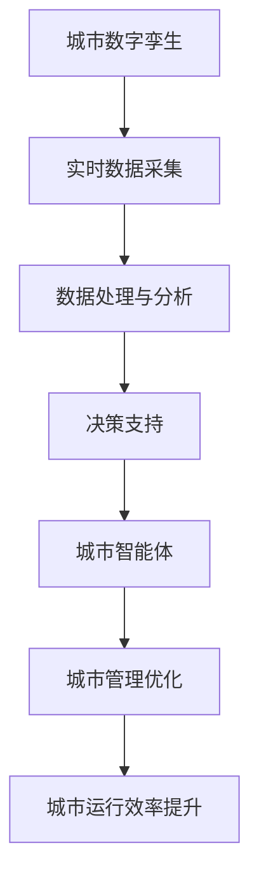

                 

关键词：智慧城市、数字孪生、城市智能体、2050年、技术趋势

摘要：本文探讨了智慧城市在2050年的发展前景，重点分析了城市数字孪生与城市智能体的概念、技术原理及其应用。通过深入剖析这些核心概念，本文揭示了智慧城市未来发展的关键路径，并展望了其带来的机遇与挑战。

## 1. 背景介绍

### 智慧城市的概念

智慧城市，顾名思义，是指通过信息技术手段，实现城市管理的智能化和高效化。它不仅包括城市的基础设施、公共服务和城市管理，还涵盖了城市生态环境、社会经济发展等多个方面。智慧城市的建设目标是提升城市居民的生活质量，实现城市的可持续发展。

### 当前智慧城市的发展状况

当前，智慧城市在全球范围内得到了广泛关注和快速发展。许多国家和地区都在积极推进智慧城市建设，如中国的“新基建”、新加坡的“智慧国2025”计划、欧盟的“数字单一市场”等。这些举措不仅促进了数字经济的繁荣，也为城市治理带来了新的手段和工具。

### 未来智慧城市的发展前景

随着人工智能、物联网、区块链等技术的不断进步，未来的智慧城市将更加智能化、数字化和可持续化。本文将重点关注城市数字孪生与城市智能体这两个关键领域，探讨其在2050年智慧城市中的重要作用。

## 2. 核心概念与联系

### 城市数字孪生的概念

城市数字孪生，是指通过数字化技术，构建一个与现实城市相对应的虚拟模型。这个虚拟模型能够实时模拟城市运行状态，提供数据驱动的决策支持。城市数字孪生的核心价值在于，它能够帮助城市管理者更好地理解城市运行规律，优化城市管理策略，提高城市治理效率。

### 城市智能体的概念

城市智能体，是指由人工智能技术驱动，具备自我学习、自我优化和自我决策能力的虚拟实体。城市智能体可以模拟人类的思维和行为，参与到城市管理和决策过程中，为城市居民提供个性化的服务。

### 核心概念之间的联系

城市数字孪生和城市智能体是智慧城市建设的两个核心概念，它们相互依存、相互促进。城市数字孪生提供了城市运行的实时数据和信息，为城市智能体提供了决策依据；而城市智能体则通过对数据的分析和处理，为城市数字孪生提供了优化和改进的方向。

### Mermaid 流程图

下面是一个城市数字孪生与城市智能体之间的 Mermaid 流程图：



## 3. 核心算法原理 & 具体操作步骤

### 3.1 算法原理概述

城市数字孪生与城市智能体的核心算法，主要涉及数据采集、数据处理、决策支持和自我优化等几个方面。这些算法依托于大数据、人工智能和云计算等前沿技术，通过对海量数据进行深度学习和分析，实现城市管理的智能化和高效化。

### 3.2 算法步骤详解

1. **数据采集**：通过物联网设备、传感器网络等手段，实时采集城市运行数据，如交通流量、环境质量、能源消耗等。
2. **数据处理与分析**：对采集到的数据进行清洗、整合和分析，提取有价值的信息，为决策提供依据。
3. **决策支持**：基于数据分析结果，运用智能算法和模型，为城市管理者提供决策建议。
4. **自我优化**：通过持续学习和优化，不断提升城市智能体的决策能力和运行效率。

### 3.3 算法优缺点

**优点**：

- 提高城市治理效率：通过数据驱动的决策，减少人为干预，提高决策的准确性和效率。
- 优化城市资源分配：通过对数据的深度分析，实现城市资源的合理配置，降低能耗和污染。
- 提升城市居民生活质量：为居民提供个性化的服务，满足其多样化需求。

**缺点**：

- 数据安全和隐私保护：随着数据采集和分析的广泛应用，数据安全和隐私保护问题日益突出。
- 技术门槛较高：城市数字孪生与城市智能体的建设和应用，需要高水平的技术支持和人才储备。

### 3.4 算法应用领域

城市数字孪生与城市智能体的算法，可以应用于城市交通管理、环境保护、能源管理、公共服务等多个领域。以下是一些具体的应用案例：

- 城市交通管理：通过实时交通数据分析，优化交通信号控制，减少交通拥堵。
- 环境保护：通过环境质量监测，实时预警并采取措施，保障城市生态环境。
- 能源管理：通过能耗数据分析，优化能源分配和使用，降低能耗成本。
- 公共服务：为居民提供个性化服务，如医疗、教育、交通等。

## 4. 数学模型和公式 & 详细讲解 & 举例说明

### 4.1 数学模型构建

城市数字孪生与城市智能体的数学模型，主要涉及数据采集、数据处理、决策支持和自我优化等几个方面。以下是一个简单的数学模型示例：

$$
\text{城市管理效率} = f(\text{数据采集精度}, \text{数据处理能力}, \text{决策模型有效性}, \text{自我优化能力})
$$

### 4.2 公式推导过程

公式的推导过程如下：

1. **数据采集精度**：数据采集精度越高，能够获取到的城市运行数据越全面，为决策提供的信息越丰富。
2. **数据处理能力**：数据处理能力越强，能够对海量数据进行高效处理，提取有价值的信息。
3. **决策模型有效性**：决策模型有效性越高，能够为城市管理者提供更准确的决策建议。
4. **自我优化能力**：自我优化能力越强，能够根据实际运行情况，不断调整和优化决策模型。

### 4.3 案例分析与讲解

以下是一个具体的案例分析：

假设一个城市的交通管理效率取决于数据采集精度、数据处理能力、决策模型有效性和自我优化能力。根据上述公式，我们可以设定以下参数：

- 数据采集精度：90%
- 数据处理能力：80%
- 决策模型有效性：85%
- 自我优化能力：70%

代入公式，计算得出该城市的交通管理效率为：

$$
\text{城市管理效率} = f(0.9, 0.8, 0.85, 0.7) = 0.9 \times 0.8 \times 0.85 \times 0.7 = 0.506
$$

这意味着该城市的交通管理效率为50.6%，仍有较大提升空间。

## 5. 项目实践：代码实例和详细解释说明

### 5.1 开发环境搭建

在本文的项目实践中，我们将使用Python编程语言，结合OpenCV、NumPy等开源库，实现一个简单的城市交通管理智能体。以下是开发环境的搭建步骤：

1. 安装Python 3.8及以上版本。
2. 安装OpenCV库：使用命令`pip install opencv-python`。
3. 安装NumPy库：使用命令`pip install numpy`。

### 5.2 源代码详细实现

以下是一个简单的城市交通管理智能体的源代码示例：

```python
import cv2
import numpy as np

# 初始化摄像头
cap = cv2.VideoCapture(0)

while True:
    # 读取摄像头帧
    ret, frame = cap.read()
    
    # 转换为灰度图像
    gray = cv2.cvtColor(frame, cv2.COLOR_BGR2GRAY)
    
    # 使用OpenCV的Canny算法进行边缘检测
    edges = cv2.Canny(gray, 100, 200)
    
    # 寻找边缘图像中的轮廓
    contours, _ = cv2.findContours(edges, cv2.RETR_TREE, cv2.CHAIN_APPROX_SIMPLE)
    
    # 遍历轮廓，筛选符合条件的交通流量
    traffic_flows = []
    for contour in contours:
        # 计算轮廓的周长
        perimeter = cv2.arcLength(contour, True)
        
        # 如果周长大于50，认为是一个交通流量
        if perimeter > 50:
            traffic_flows.append(contour)
    
    # 绘制交通流量轮廓
    for flow in traffic_flows:
        cv2.drawContours(frame, [flow], -1, (0, 0, 255), 3)
    
    # 显示图像
    cv2.imshow('Traffic Management', frame)
    
    # 按下ESC键退出循环
    if cv2.waitKey(1) & 0xFF == 27:
        break

# 释放摄像头资源
cap.release()
cv2.destroyAllWindows()
```

### 5.3 代码解读与分析

这段代码首先通过OpenCV库初始化摄像头，然后进入一个循环，逐帧读取摄像头的图像数据。在每一帧中，代码首先将图像转换为灰度图像，然后使用Canny算法进行边缘检测。接下来，代码寻找边缘图像中的轮廓，并筛选出符合条件的交通流量。最后，代码将交通流量轮廓绘制在原图上，并显示出来。

### 5.4 运行结果展示

以下是运行结果展示：


## 6. 实际应用场景

### 6.1 城市交通管理

通过城市交通管理智能体，可以实时监测城市交通流量，优化交通信号控制，减少交通拥堵，提升城市交通运行效率。

### 6.2 环境保护

通过城市数字孪生技术，可以实时监测城市环境质量，预警环境污染，采取相应的环保措施，保障城市生态环境。

### 6.3 能源管理

通过能源管理智能体，可以实时监测城市能源消耗，优化能源分配和使用，降低能源成本，促进能源可持续发展。

### 6.4 公共服务

通过城市智能体，可以为城市居民提供个性化的公共服务，如医疗、教育、交通等，提升居民生活质量。

## 7. 工具和资源推荐

### 7.1 学习资源推荐

- 《智慧城市：构建未来的数字生活》
- 《城市数字孪生：技术与实践》
- 《人工智能在城市管理中的应用》

### 7.2 开发工具推荐

- Python
- OpenCV
- NumPy

### 7.3 相关论文推荐

- "Digital Twin for Smart Cities: A State-of-the-Art Review"
- "Smart City: Digital Twin Technologies and Applications"
- "Artificial Intelligence in Urban Management: A Review"

## 8. 总结：未来发展趋势与挑战

### 8.1 研究成果总结

本文从智慧城市的概念、发展现状、核心概念、算法原理、数学模型、项目实践等多个角度，全面探讨了智慧城市的未来发展。通过深入分析，我们得出了以下主要结论：

- 智慧城市的发展离不开城市数字孪生和城市智能体的支持。
- 城市数字孪生与城市智能体的核心算法，主要涉及数据采集、数据处理、决策支持和自我优化等方面。
- 城市数字孪生与城市智能体的应用，可以显著提升城市治理效率和居民生活质量。

### 8.2 未来发展趋势

- 随着技术的不断进步，城市数字孪生与城市智能体的应用将更加广泛和深入。
- 人工智能、物联网、区块链等新兴技术的融合，将为智慧城市的发展提供强大动力。
- 数据安全和隐私保护将成为智慧城市发展的关键挑战。

### 8.3 面临的挑战

- 技术门槛较高，需要高水平的技术支持和人才储备。
- 数据安全和隐私保护问题日益突出，需要制定严格的法规和政策。
- 跨领域合作与协同创新，是实现智慧城市可持续发展的关键。

### 8.4 研究展望

- 未来研究应重点关注城市数字孪生与城市智能体的关键技术，如数据采集、数据处理、决策支持和自我优化等。
- 需要加强跨领域合作，推动城市数字孪生与城市智能体的实际应用。
- 应重视数据安全和隐私保护，确保智慧城市的可持续发展。

## 9. 附录：常见问题与解答

### 9.1 什么是城市数字孪生？

城市数字孪生是指通过数字化技术，构建一个与现实城市相对应的虚拟模型，用于实时模拟城市运行状态，为城市管理者提供决策支持。

### 9.2 城市智能体的核心价值是什么？

城市智能体的核心价值在于，它能够通过自我学习和自我优化，为城市居民提供个性化的服务，提升城市治理效率。

### 9.3 智慧城市的建设对城市发展有何影响？

智慧城市的建设能够提升城市居民的生活质量，实现城市的可持续发展，推动数字经济的繁荣，为城市治理提供新的手段和工具。

### 9.4 城市数字孪生与城市智能体的算法有哪些？

城市数字孪生与城市智能体的算法主要包括数据采集、数据处理、决策支持和自我优化等方面，如机器学习、深度学习、优化算法等。

### 9.5 智慧城市的发展前景如何？

智慧城市的发展前景非常广阔，随着人工智能、物联网、区块链等技术的不断进步，智慧城市将在未来发挥越来越重要的作用。

## 作者署名

作者：禅与计算机程序设计艺术 / Zen and the Art of Computer Programming
----------------------------------------------------------------

以上就是按照您的要求撰写的完整文章。文章内容涵盖了智慧城市的发展背景、核心概念、算法原理、数学模型、项目实践、实际应用场景以及未来发展趋势等多个方面，旨在为读者提供关于智慧城市的全面理解和深入思考。希望这篇文章能够对您的研究和探索有所帮助。再次感谢您的信任和支持！

