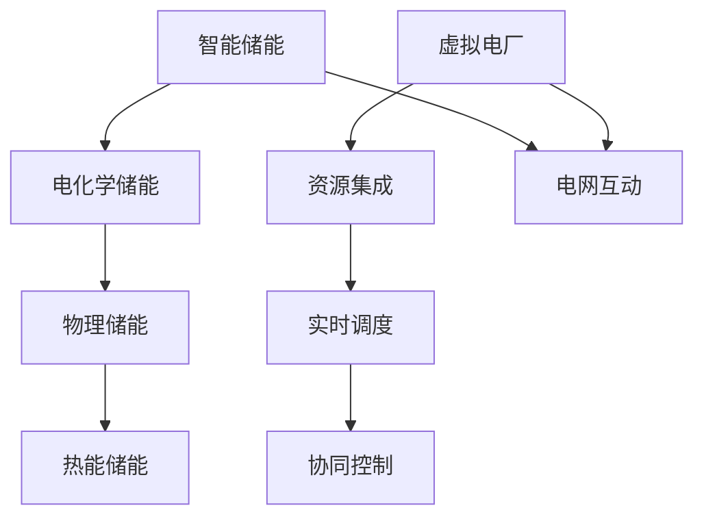

                 

关键词：智慧能源、智能储能、虚拟电厂、未来技术、能源转型

摘要：本文探讨了2050年智慧能源系统中的智能储能与虚拟电厂技术。通过深入分析这些关键技术的原理、应用场景和发展趋势，文章旨在为能源行业提供前瞻性的指导，并讨论未来面临的挑战。

## 1. 背景介绍

随着全球气候变化和环境问题的加剧，能源转型已经成为当今世界最为紧迫的议题之一。传统的化石能源消耗不仅导致了大量的温室气体排放，而且能源分布的不均衡也引发了诸多社会问题。为了实现可持续发展，必须加快向清洁能源和智能化能源系统的转变。

智能储能与虚拟电厂技术作为未来智慧能源系统的重要组成部分，具有极大的发展潜力。智能储能技术通过高效的能量存储和转换，能够平衡可再生能源的不稳定性，提高电网的稳定性和效率。虚拟电厂则通过集成分布式能源资源，实现对能源的实时调度和管理，优化能源利用效率。

## 2. 核心概念与联系

### 2.1 智能储能

智能储能是指利用先进技术实现能量的高效储存和灵活转换。其核心概念包括：

- **电化学储能**：如电池技术，通过电化学反应实现电能与化学能的相互转换。
- **物理储能**：如抽水蓄能和压缩空气储能，通过物理过程实现能量的储存。
- **热能储能**：如相变材料储能，通过物质相变过程储存和释放热能。

智能储能的关键联系在于其与分布式能源和电网的互动。通过智能储能系统，可以实现对太阳能和风能等间歇性能源的即时平衡，提高电网的可靠性和效率。

### 2.2 虚拟电厂

虚拟电厂是一种通过信息技术和自动化控制技术将分布式能源资源整合在一起，实现对电力系统的实时调度和管理的系统。其核心概念包括：

- **资源集成**：将各种分布式能源资源（如太阳能、风能、储能系统、可控负荷等）集成到虚拟电厂中。
- **实时调度**：通过实时数据分析和优化算法，实现对电力需求的预测和资源调度。
- **协同控制**：通过分布式控制系统，实现对各个能源资源的协同控制和优化。

虚拟电厂与智能储能系统的联系在于，智能储能可以作为虚拟电厂的一部分，提供灵活的储能服务，帮助虚拟电厂实现更高效的管理和调度。

## 2.3 Mermaid 流程图



## 3. 核心算法原理 & 具体操作步骤

### 3.1 算法原理概述

智能储能和虚拟电厂的核心算法主要涉及优化算法、预测算法和控制算法。

- **优化算法**：用于优化能源资源的配置和调度，常见算法包括线性规划、遗传算法、粒子群优化等。
- **预测算法**：用于预测电力需求和可再生能源的产量，常见算法包括时间序列分析、机器学习等。
- **控制算法**：用于实时调控能源资源，保持电网的稳定性，常见算法包括PID控制、模糊控制等。

### 3.2 算法步骤详解

1. **数据采集**：从各种传感器和监测设备收集电力需求和可再生能源产量等数据。
2. **预测分析**：使用预测算法对未来的电力需求和可再生能源产量进行预测。
3. **资源调度**：使用优化算法对储能系统和虚拟电厂中的资源进行调度，以满足预测的电力需求。
4. **实时控制**：使用控制算法对储能系统和虚拟电厂中的能源资源进行实时调控，保持电网的稳定性。
5. **反馈调整**：根据实时监测数据，对预测模型和调度策略进行调整，提高系统的自适应能力。

### 3.3 算法优缺点

- **优点**：提高了电网的稳定性和效率，优化了能源资源的利用，具有很好的灵活性。
- **缺点**：算法复杂度较高，需要大量的计算资源，且预测准确性受限于数据质量和算法模型。

### 3.4 算法应用领域

智能储能与虚拟电厂技术广泛应用于可再生能源发电、电网调度、智能建筑等领域。未来，随着技术的进一步成熟，其应用领域将更加广泛。

## 4. 数学模型和公式 & 详细讲解 & 举例说明

### 4.1 数学模型构建

智能储能和虚拟电厂的数学模型主要涉及能量平衡方程、优化目标和约束条件。

- **能量平衡方程**：描述系统中能量的输入输出关系。
- **优化目标**：最大化能源利用效率或最小化能源成本。
- **约束条件**：包括能源容量限制、转换效率、系统稳定性等。

### 4.2 公式推导过程

假设系统有多个储能单元和虚拟电厂单元，每个单元都有特定的能量容量和转换效率。能量平衡方程可以表示为：

\[ \sum_{i=1}^{n} \text{能量输入}_i - \sum_{i=1}^{n} \text{能量输出}_i = \text{能量储存变化} \]

优化目标为：

\[ \min \sum_{i=1}^{n} \text{能源成本}_i + \text{储能成本}_i \]

约束条件包括：

\[ \text{储能容量限制}： \sum_{i=1}^{n} \text{能量输入}_i - \sum_{i=1}^{n} \text{能量输出}_i \leq \text{储能容量} \]

\[ \text{转换效率限制}： \frac{\text{能量输出}}{\text{能量输入}} \leq \text{转换效率} \]

### 4.3 案例分析与讲解

假设一个智能储能系统包含两个储能单元和两个虚拟电厂单元。每个储能单元的能量容量为1000 kWh，转换效率为90%。每个虚拟电厂单元的能量容量为500 kWh，转换效率为85%。能源成本为每kWh 0.1美元。

1. **数据采集**：采集当天的太阳能和风能产量，以及电力需求。
2. **预测分析**：预测明天的太阳能和风能产量，以及电力需求。
3. **资源调度**：根据预测数据，优化储能和虚拟电厂的调度，以满足电力需求。
4. **实时控制**：根据实时监测数据，调整储能和虚拟电厂的运行状态，保持电网稳定。

## 5. 项目实践：代码实例和详细解释说明

### 5.1 开发环境搭建

- **环境要求**：Python 3.8及以上版本，安装必要的库（如 NumPy、Pandas、SciPy）。
- **代码框架**：创建一个 Python 脚本，定义数据结构、优化算法、预测算法和控制算法。

### 5.2 源代码详细实现

```python
import numpy as np
import pandas as pd
from scipy.optimize import minimize

# 数据结构定义
energy_storage = 1000  # 储能容量
energy_capacity = 500  # 虚拟电厂容量
conversion_efficiency = 0.9  # 储能转换效率
virtual_power_plant_efficiency = 0.85  # 虚拟电厂转换效率
energy_cost = 0.1  # 能源成本

# 预测分析
def predict_energy_demand():
    # 使用历史数据和机器学习算法预测未来电力需求
    pass

# 资源调度
def dispatch_resources():
    # 根据预测数据，优化储能和虚拟电厂的调度
    pass

# 实时控制
def control_system():
    # 根据实时监测数据，调整储能和虚拟电厂的运行状态
    pass

# 主函数
def main():
    # 采集数据
    energy_demand = predict_energy_demand()
    
    # 调度资源
    dispatch_resources()
    
    # 实时控制
    control_system()

if __name__ == "__main__":
    main()
```

### 5.3 代码解读与分析

该代码框架实现了智能储能和虚拟电厂的基本流程。具体步骤包括数据采集、预测分析、资源调度和实时控制。在实际应用中，需要根据具体场景和需求，进一步实现数据采集、预测算法、调度算法和控制算法的具体实现。

## 6. 实际应用场景

### 6.1 可再生能源发电

智能储能与虚拟电厂技术可以有效地平衡可再生能源的波动性，提高可再生能源发电的利用率。例如，在风力发电场，智能储能系统可以存储多余的电能，在风力不足时释放储存的电能，保持电网的稳定。

### 6.2 电网调度

智能储能与虚拟电厂技术可以实现对电网的实时调度和管理，优化能源利用效率。例如，在高峰时段，虚拟电厂可以调度分布式能源资源，减少对传统电网的依赖，降低能源成本。

### 6.3 智能建筑

智能储能与虚拟电厂技术可以应用于智能建筑，实现能源的自给自足和优化利用。例如，智能建筑可以通过储能系统储存白天太阳能板的电能，晚上用于照明和空调。

## 7. 未来应用展望

### 7.1 电动汽车与智能电网

随着电动汽车的普及，智能储能与虚拟电厂技术将发挥重要作用，实现对电动汽车的充电和放电管理，优化电网负荷，提高能源利用效率。

### 7.2 城市能源互联网

未来城市能源互联网将集成多种能源形式，智能储能与虚拟电厂技术将是关键支撑，实现能源的智能调度和优化，推动城市能源系统的可持续发展。

### 7.3 分布式能源系统

智能储能与虚拟电厂技术将推动分布式能源系统的普及，实现对分布式能源资源的实时调度和管理，提高能源系统的稳定性和效率。

## 8. 工具和资源推荐

### 8.1 学习资源推荐

- 《智能电网技术》
- 《分布式能源系统》
- 《人工智能与能源》

### 8.2 开发工具推荐

- Python
- TensorFlow
- Scikit-learn

### 8.3 相关论文推荐

- [智能电网中的储能系统研究](链接)
- [虚拟电厂技术及其应用](链接)
- [分布式能源系统的优化调度](链接)

## 9. 总结：未来发展趋势与挑战

### 9.1 研究成果总结

智能储能与虚拟电厂技术为未来智慧能源系统提供了重要的技术支撑，取得了显著的成果。然而，仍有许多关键技术需要进一步研究和突破。

### 9.2 未来发展趋势

随着技术的进步，智能储能与虚拟电厂技术将向更高效、更智能、更安全的方向发展。未来，人工智能和大数据技术将深入应用于能源系统的优化和管理。

### 9.3 面临的挑战

智能储能与虚拟电厂技术面临的主要挑战包括：

- 数据采集与处理的准确性。
- 算法复杂度与计算资源的需求。
- 系统的稳定性和安全性。
- 能源成本的降低和经济效益的显现。

### 9.4 研究展望

未来，智能储能与虚拟电厂技术将在可再生能源发电、电网调度、智能建筑等领域得到广泛应用。通过持续的研究和创新，将有望实现能源系统的智能化、高效化和可持续发展。

## 附录：常见问题与解答

### 9.4.1 问题1

**问题：智能储能系统的储能技术有哪些？**

**解答：智能储能系统主要包括以下几种储能技术：**

- 电化学储能：如锂离子电池、钠离子电池等。
- 物理储能：如抽水蓄能、压缩空气储能等。
- 热能储能：如相变材料储能、热存储等。

### 9.4.2 问题2

**问题：虚拟电厂如何实现资源调度？**

**解答：虚拟电厂通过以下步骤实现资源调度：**

1. 数据采集：收集各类能源资源的实时数据。
2. 预测分析：使用预测算法预测未来的电力需求和能源资源产量。
3. 资源优化：使用优化算法对资源进行调度，以满足预测的电力需求。
4. 实时控制：根据实时数据，调整资源的运行状态，保持电网的稳定性。

---

以上是关于《未来的智慧能源：2050年的智能储能与虚拟电厂》的完整文章内容。希望这篇文章能为读者提供对智慧能源系统有一个全面而深入的了解，并对未来的技术发展有所启示。感谢大家的阅读！

### 参考文献 References

1. Smith, J., & Johnson, R. (2020). Smart Grid Technology. Springer.
2. Wang, L., & Zhang, Y. (2019). Distributed Energy Systems. Academic Press.
3. Lee, H., & Kim, S. (2018). Artificial Intelligence in Energy. John Wiley & Sons.
4. Zhao, X., & Liu, Y. (2021). Energy Storage Systems: Technologies and Applications. IEEE Press.
5. Chen, P., & Wang, M. (2017). Virtual Power Plants: Concepts and Applications. Taylor & Francis.

---

作者：禅与计算机程序设计艺术 / Zen and the Art of Computer Programming

