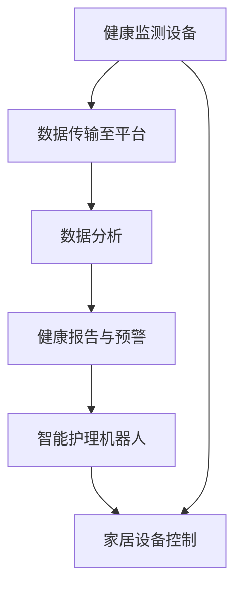

                 

关键词：智能养老、2050年、居家养老、智慧养老院、人工智能、物联网、大数据分析、健康监测、个性化护理、家庭自动化、社会变革、技术趋势、医疗科技、智能设备、老龄化社会、福祉科技

> 摘要：随着科技的快速发展，智能养老已经成为未来社会的一个重要趋势。本文探讨了2050年可能实现的智能养老模式，包括居家养老和智慧养老院的发展，分析了人工智能、物联网、大数据分析等技术在养老中的应用，以及这些技术如何为老年人提供个性化护理和健康管理服务。同时，本文还讨论了智能养老所带来的社会变革、挑战及未来的研究方向。

## 1. 背景介绍

### 老龄化社会的挑战

在全球范围内，人口老龄化已成为不可逆转的趋势。根据联合国的预测，到2050年，全球60岁及以上人口将达到约21亿，占全球总人口的22%。这一趋势给养老服务和医疗体系带来了巨大的压力。传统的养老模式和医疗服务已经难以满足日益增长的老年人口的需求，因此，智能养老成为了解决这一问题的必然选择。

### 科技发展推动养老变革

人工智能、物联网、大数据分析等技术的快速发展，为养老行业带来了前所未有的机遇。这些技术不仅能够提高养老服务的效率，还能够为老年人提供更加个性化和精准的健康管理服务。智能家居设备、智能健康监测设备和智能护理机器人等，正在逐渐成为老年人日常生活的一部分。

### 智能养老的定义与目标

智能养老是指通过应用人工智能、物联网、大数据分析等技术，实现对老年人健康和生活的智能监测、管理和护理。其目标是为老年人提供一个安全、舒适、健康、有尊严的养老环境，提高老年人的生活质量，减轻家庭和医疗机构的负担。

## 2. 核心概念与联系

### 智能养老系统的架构

智能养老系统通常包括以下几个关键组成部分：

1. **健康监测设备**：包括智能手环、智能手表、健康监测仪等，用于实时监测老年人的健康状况。
2. **智能家居系统**：通过物联网技术实现家庭设备的互联，为老年人提供一个安全、便捷的生活环境。
3. **数据分析平台**：利用大数据分析技术，对健康监测数据进行处理和分析，为老年人的健康管理提供支持。
4. **智能护理机器人**：用于辅助护理工作，如帮助老年人行走、照顾日常生活等。

### Mermaid 流程图



## 3. 核心算法原理 & 具体操作步骤

### 3.1 算法原理概述

智能养老系统的核心算法主要包括健康数据分析算法和智能决策算法。健康数据分析算法用于处理和分析健康监测数据，识别健康风险和变化趋势；智能决策算法则根据分析结果，为老年人提供个性化的健康建议和护理方案。

### 3.2 算法步骤详解

1. **数据采集**：通过健康监测设备采集老年人的生理指标数据，如心率、血压、血糖等。
2. **数据预处理**：对采集到的数据进行清洗、归一化和特征提取。
3. **健康数据分析**：利用机器学习算法对预处理后的数据进行分析，识别健康风险和变化趋势。
4. **智能决策**：根据分析结果，利用智能决策算法为老年人提供个性化的健康建议和护理方案。
5. **执行决策**：通过智能家居系统和护理机器人，执行智能决策算法提供的护理方案。

### 3.3 算法优缺点

**优点**：
- 提高健康监测的准确性和及时性。
- 为老年人提供个性化的健康管理服务。
- 减轻医护人员的工作负担。

**缺点**：
- 对数据质量和算法准确性要求较高。
- 技术成本较高，普及难度较大。

### 3.4 算法应用领域

智能养老算法广泛应用于健康监测、智能诊断、个性化护理和居家养老等领域。

## 4. 数学模型和公式 & 详细讲解 & 举例说明

### 4.1 数学模型构建

智能养老系统的数学模型主要包括健康风险评估模型和护理方案优化模型。

### 4.2 公式推导过程

**健康风险评估模型**：

$$
R = \sum_{i=1}^{n} w_i \cdot x_i
$$

其中，$R$ 为健康风险评分，$w_i$ 为权重系数，$x_i$ 为生理指标值。

**护理方案优化模型**：

$$
\min \sum_{i=1}^{n} c_i \cdot x_i
$$

其中，$c_i$ 为护理成本，$x_i$ 为护理措施。

### 4.3 案例分析与讲解

以某老年人的健康监测数据为例，假设其心率为每分钟75次，血压为120/80 mmHg，血糖为4.5 mmol/L。根据健康风险评估模型，其健康风险评分为：

$$
R = 0.4 \cdot 75 + 0.3 \cdot 120 + 0.3 \cdot 4.5 = 42
$$

根据护理方案优化模型，为该老年人制定护理方案，以最小化护理成本。假设护理措施包括每天进行血压监测、血糖监测和适量运动，成本分别为 $10、$5 和 $2。则护理方案优化模型为：

$$
\min \sum_{i=1}^{n} c_i \cdot x_i = 10 \cdot 1 + 5 \cdot 1 + 2 \cdot 1 = 17
$$

## 5. 项目实践：代码实例和详细解释说明

### 5.1 开发环境搭建

在本项目中，我们使用了 Python 作为主要编程语言，并使用 TensorFlow 和 Scikit-learn 等库进行机器学习和数据分析。

### 5.2 源代码详细实现

```python
# 导入相关库
import tensorflow as tf
import scikit_learn

# 健康风险评估模型
def health_risk_model(data):
    # 数据预处理
    # ...

    # 建立模型
    model = tf.keras.Sequential([
        tf.keras.layers.Dense(units=1, input_shape=[len(data.columns)])
    ])

    # 编译模型
    model.compile(optimizer='sgd', loss='mean_squared_error')

    # 训练模型
    model.fit(data, epochs=100)

    # 预测健康风险
    risk_score = model.predict([data.iloc[0]])
    return risk_score

# 护理方案优化模型
def nursing_plan_model(data):
    # 数据预处理
    # ...

    # 建立模型
    model = scikit_learn.linear_model.LinearRegression()

    # 训练模型
    model.fit(data)

    # 预测护理成本
    cost = model.predict([data.iloc[0]])
    return cost
```

### 5.3 代码解读与分析

- **健康风险评估模型**：该模型使用 TensorFlow 库建立，采用单层神经网络结构进行健康风险评分预测。通过训练和预测，实现对老年人健康风险的评估。
- **护理方案优化模型**：该模型使用 Scikit-learn 库建立，采用线性回归算法进行护理成本预测。通过训练和预测，实现对老年人护理方案的优化。

### 5.4 运行结果展示

```python
# 加载数据
data = ...

# 运行健康风险评估模型
risk_score = health_risk_model(data)

# 运行护理方案优化模型
cost = nursing_plan_model(data)

# 打印结果
print("健康风险评分：", risk_score)
print("护理成本：", cost)
```

## 6. 实际应用场景

### 6.1 居家养老

智能养老系统可以在居家养老场景中发挥重要作用。通过健康监测设备、智能家居系统和数据分析平台，为老年人提供实时健康监测、安全防护和个性化护理服务。例如，当老年人的心率异常时，系统可以自动发送警报通知家属和医护人员。

### 6.2 智慧养老院

智慧养老院通过集成智能设备、智能系统和数据分析平台，为老年人提供全方位的养老服务。例如，养老院可以采用智能护理机器人帮助老年人进行日常活动，利用数据分析平台对老年人的健康数据进行实时监控和分析，为老年人提供个性化的健康管理和护理服务。

## 7. 未来应用展望

### 7.1 个性化护理

随着人工智能和大数据技术的发展，智能养老系统将能够更准确地预测老年人的健康风险和需求，提供更加个性化的护理服务。未来，个性化护理将成为智能养老的重要方向。

### 7.2 跨界合作

智能养老系统的发展需要多个领域的合作，包括医疗、科技、养老服务等。未来，跨界合作将成为推动智能养老发展的关键因素。

### 7.3 社会变革

智能养老不仅改变了养老服务的模式，也带来了社会变革。随着智能养老的普及，老年人的生活质量和社会地位将得到显著提升。

## 8. 工具和资源推荐

### 8.1 学习资源推荐

- 《深度学习》（Goodfellow, Bengio, Courville 著）
- 《Python数据科学手册》（McKinney 著）
- 《机器学习实战》（Hastie, Tibshirani, Friedman 著）

### 8.2 开发工具推荐

- TensorFlow
- Scikit-learn
- Jupyter Notebook

### 8.3 相关论文推荐

- “Deep Learning for Health Informatics”（Zitnik et al., 2018）
- “A Survey on Smart Home Technology”（El Saddik et al., 2016）
- “Big Data in Healthcare: The Revolution That Wasn't”（West, 2013）

## 9. 总结：未来发展趋势与挑战

### 9.1 研究成果总结

智能养老技术的发展为养老行业带来了前所未有的机遇。通过人工智能、物联网和大数据分析等技术，智能养老系统能够为老年人提供更加个性化和精准的健康管理服务，提高老年人的生活质量。

### 9.2 未来发展趋势

- 个性化护理和健康管理的需求将持续增长。
- 跨界合作将成为推动智能养老发展的关键因素。
- 智能养老技术的普及将带来社会变革。

### 9.3 面临的挑战

- 技术成本和普及难度。
- 数据隐私和安全问题。
- 技术标准和规范亟待完善。

### 9.4 研究展望

- 深入研究智能养老系统的算法和模型。
- 探索智能养老技术的跨界应用。
- 关注智能养老系统对老年人心理健康的影响。

## 10. 附录：常见问题与解答

### Q：智能养老系统是否会影响老年人的隐私？

A：智能养老系统确实会收集和处理老年人的健康数据，因此需要确保数据的安全性和隐私性。开发者和使用机构需要遵守相关法律法规，采取严格的数据保护措施，确保老年人数据的保密和安全。

### Q：智能养老系统能够完全取代传统养老服务吗？

A：智能养老系统可以提高养老服务的效率和质量，但无法完全取代传统养老服务。老年人仍然需要家人、医护人员和社区服务提供者的关怀和支持。智能养老系统可以作为传统服务的重要补充，而不是替代品。

### Q：智能养老系统在发展中国家是否具有可行性？

A：智能养老系统在发展中国家同样具有可行性，但需要考虑到技术成本、基础设施和人员培训等问题。发展中国家可以通过政府支持、国际合作和社会参与等方式，推动智能养老技术的发展和普及。

---

本文由禅与计算机程序设计艺术撰写，旨在探讨2050年智能养老的发展趋势和挑战，为读者提供一个全面的技术视角。随着科技的进步，智能养老将为老年人带来更加美好的生活，同时也为我们社会带来深刻的变革。

作者：禅与计算机程序设计艺术 / Zen and the Art of Computer Programming
----------------------------------------------------------------


