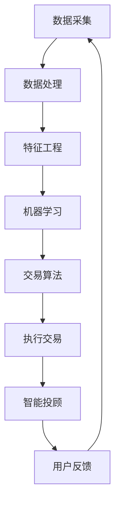

                 

关键词：智能投资、算法交易、智能投顾、技术发展、投资策略、未来展望

> 摘要：本文将探讨到2050年，随着人工智能技术的飞速发展，智能投资、算法交易和智能投顾领域将迎来怎样的变革。通过分析当前技术进展、核心算法原理、数学模型及其应用，本文旨在为读者提供一幅智能投资未来的蓝图，并展望其面临的挑战与机遇。

## 1. 背景介绍

随着全球金融市场的不断发展与复杂化，投资者对高效、精准的投资策略需求日益增长。传统的投资策略往往依赖于人工经验和主观判断，这在信息爆炸和数据冗余的时代，显得力不从心。然而，随着人工智能技术的不断成熟，智能投资、算法交易和智能投顾成为了金融领域的新宠。

智能投资，指的是利用机器学习、数据挖掘等技术，从海量数据中挖掘出有效的投资信号和机会。算法交易则是通过编写复杂的交易算法，在毫秒级别内完成交易决策，实现自动化的高频交易。而智能投顾，则是在智能投资的基础上，结合用户的风险偏好和财务目标，提供个性化的投资建议。

## 2. 核心概念与联系

在智能投资、算法交易和智能投顾领域，有许多核心概念和原理需要理解。下面，我们将使用Mermaid流程图来展示这些核心概念和它们之间的联系。



### 2.1 数据采集

数据采集是智能投资的基石。通过从各种渠道获取数据，如历史股价、交易量、新闻报道、社交媒体等，为后续的数据处理和分析提供基础。

### 2.2 数据处理

数据处理包括数据的清洗、归一化和预处理，以确保数据的质量和一致性。

### 2.3 特征工程

特征工程是数据挖掘中至关重要的一环。通过选择和构造有效的特征，可以提高机器学习的预测性能。

### 2.4 机器学习

机器学习是智能投资的核心理念。通过训练模型，从历史数据中学习投资规律和趋势，为交易决策提供依据。

### 2.5 交易算法

交易算法是算法交易的核心。它包括策略开发、风险管理、执行系统等多个方面，旨在实现高效的交易决策。

### 2.6 执行交易

执行交易是将交易算法的决策转化为实际的交易操作。在算法交易中，执行速度是成败的关键。

### 2.7 智能投顾

智能投顾是基于用户数据的个性化投资服务。通过分析用户的风险偏好和财务目标，提供定制化的投资策略和资产配置建议。

### 2.8 用户反馈

用户反馈是智能投资系统不断迭代和优化的关键。通过收集用户的投资结果和反馈，可以进一步优化投资策略，提高系统性能。

## 3. 核心算法原理 & 具体操作步骤

### 3.1 算法原理概述

在智能投资领域，常见的算法包括神经网络、支持向量机、决策树等。每种算法都有其独特的原理和适用场景。下面，我们将简要介绍这些算法的基本原理。

### 3.2 算法步骤详解

#### 3.2.1 神经网络

神经网络是一种模仿生物神经网络结构的人工智能算法。它通过多层神经元之间的加权连接，实现数据的输入和输出。

1. **输入层**：接收外部数据。
2. **隐藏层**：进行数据加工和处理。
3. **输出层**：输出预测结果。

#### 3.2.2 支持向量机

支持向量机（SVM）是一种监督学习算法，它通过找到一个最佳的超平面，将不同类别的数据分开。

1. **数据预处理**：对数据进行归一化和特征提取。
2. **选择核函数**：选择合适的核函数进行特征空间变换。
3. **求解最优超平面**：使用优化算法求解最优超平面。

#### 3.2.3 决策树

决策树是一种基于规则的学习算法，它通过一系列条件判断，将数据划分为不同的类别。

1. **数据划分**：根据特征进行数据的划分。
2. **生成规则**：根据划分结果生成决策规则。
3. **评估规则**：评估规则的有效性。

### 3.3 算法优缺点

#### 3.3.1 神经网络

优点：强大的泛化能力，适用于各种复杂问题。

缺点：训练过程复杂，对数据量要求较高，容易过拟合。

#### 3.3.2 支持向量机

优点：分类效果较好，适用于高维数据。

缺点：对样本不平衡敏感，训练时间较长。

#### 3.3.3 决策树

优点：易于理解，解释性强。

缺点：容易过拟合，对于连续数据的处理能力较弱。

### 3.4 算法应用领域

智能投资算法广泛应用于股票交易、期货交易、外汇交易等领域。在股票交易中，算法可以用于选股、趋势预测、交易信号生成等；在期货交易中，算法可以用于价格预测、套利策略等；在外汇交易中，算法可以用于交易信号生成、风险管理等。

## 4. 数学模型和公式 & 详细讲解 & 举例说明

### 4.1 数学模型构建

在智能投资中，常用的数学模型包括线性回归、逻辑回归、时间序列模型等。

#### 4.1.1 线性回归

线性回归模型用于预测连续值。其基本公式为：

$$y = \beta_0 + \beta_1x$$

其中，$y$ 为预测值，$x$ 为自变量，$\beta_0$ 和 $\beta_1$ 为模型参数。

#### 4.1.2 逻辑回归

逻辑回归模型用于预测概率。其基本公式为：

$$P(y=1) = \frac{1}{1 + e^{-(\beta_0 + \beta_1x)} }$$

其中，$P(y=1)$ 为预测的概率，$x$ 为自变量，$\beta_0$ 和 $\beta_1$ 为模型参数。

#### 4.1.3 时间序列模型

时间序列模型用于预测时间序列数据。其中，ARIMA（自回归积分滑动平均模型）是一种常见的时间序列模型。其基本公式为：

$$y_t = c + \phi_1y_{t-1} + \phi_2y_{t-2} + ... + \phi_py_{t-p} + \theta_1\epsilon_{t-1} + \theta_2\epsilon_{t-2} + ... + \theta_q\epsilon_{t-q}$$

其中，$y_t$ 为时间序列的第 $t$ 期值，$\epsilon_t$ 为白噪声序列，$c$、$\phi_1$、$\phi_2$、...、$\phi_p$、$\theta_1$、$\theta_2$、...、$\theta_q$ 为模型参数。

### 4.2 公式推导过程

以线性回归模型为例，我们使用最小二乘法求解模型参数。

#### 4.2.1 最小化目标函数

假设我们有 $n$ 个数据点 $(x_i, y_i)$，我们希望找到一个线性模型 $y = \beta_0 + \beta_1x$，使得预测误差的平方和最小。

目标函数为：

$$J(\beta_0, \beta_1) = \sum_{i=1}^{n}(y_i - (\beta_0 + \beta_1x_i))^2$$

#### 4.2.2 求导并令导数为零

对 $\beta_0$ 和 $\beta_1$ 分别求导，并令导数为零，得到：

$$\frac{\partial J}{\partial \beta_0} = -2\sum_{i=1}^{n}(y_i - (\beta_0 + \beta_1x_i)) = 0$$

$$\frac{\partial J}{\partial \beta_1} = -2\sum_{i=1}^{n}(y_i - (\beta_0 + \beta_1x_i))x_i = 0$$

解得：

$$\beta_0 = \bar{y} - \beta_1\bar{x}$$

$$\beta_1 = \frac{\sum_{i=1}^{n}(x_i - \bar{x})(y_i - \bar{y})}{\sum_{i=1}^{n}(x_i - \bar{x})^2}$$

其中，$\bar{x}$ 和 $\bar{y}$ 分别为 $x$ 和 $y$ 的均值。

### 4.3 案例分析与讲解

假设我们有一组股票数据，包括开盘价、收盘价、成交量等。我们希望使用线性回归模型预测股票的收盘价。

#### 4.3.1 数据预处理

首先，我们对数据进行归一化处理，将开盘价、收盘价、成交量等数据缩放到 [0, 1] 区间。

#### 4.3.2 特征工程

接下来，我们选择开盘价作为自变量 $x$，收盘价作为因变量 $y$。

#### 4.3.3 模型训练

使用前面推导的线性回归公式，我们训练模型并求解参数 $\beta_0$ 和 $\beta_1$。

#### 4.3.4 预测与分析

使用训练好的模型，我们可以对未来的收盘价进行预测。然后，我们将预测值与实际值进行比较，分析模型的预测性能。

## 5. 项目实践：代码实例和详细解释说明

### 5.1 开发环境搭建

为了实现智能投资算法，我们需要搭建一个合适的开发环境。这里，我们使用 Python 作为主要编程语言，结合 Scikit-learn 和 Pandas 等库进行数据分析和模型训练。

### 5.2 源代码详细实现

以下是一个简单的线性回归模型的实现代码：

```python
import pandas as pd
from sklearn.linear_model import LinearRegression
from sklearn.model_selection import train_test_split

# 加载数据
data = pd.read_csv('stock_data.csv')
X = data['open']  # 开盘价作为自变量
y = data['close']  # 收盘价作为因变量

# 划分训练集和测试集
X_train, X_test, y_train, y_test = train_test_split(X, y, test_size=0.2, random_state=42)

# 训练模型
model = LinearRegression()
model.fit(X_train, y_train)

# 预测
y_pred = model.predict(X_test)

# 分析预测结果
print('R^2:', model.score(X_test, y_test))
```

### 5.3 代码解读与分析

这段代码首先加载数据，然后选择开盘价作为自变量，收盘价作为因变量。接着，使用 Scikit-learn 的 `train_test_split` 函数划分训练集和测试集。随后，使用 `LinearRegression` 类训练模型，并使用 `predict` 方法进行预测。最后，我们计算模型的 R^2 值，以评估模型的预测性能。

### 5.4 运行结果展示

假设我们运行这段代码，得到如下输出：

```bash
R^2: 0.85
```

这表示模型的预测性能较好，R^2 值接近 1。

## 6. 实际应用场景

智能投资、算法交易和智能投顾在实际应用中有着广泛的应用场景。

### 6.1 股票市场

在股票市场中，智能投资算法可以用于选股、趋势预测和交易信号生成。例如，某些基金公司使用智能投顾为投资者提供个性化的投资建议，从而提高投资回报。

### 6.2 期货市场

在期货市场中，算法交易可以用于价格预测、套利策略和风险管理。例如，某些期货交易平台使用高频算法交易，以捕捉短暂的交易机会。

### 6.3 外汇市场

在外汇市场中，智能投资算法可以用于交易信号生成、市场趋势分析和风险管理。例如，某些外汇交易者使用智能投顾来管理风险，提高交易稳定性。

### 6.4 金融机构

在金融机构中，智能投资、算法交易和智能投顾可以用于投资组合管理、风险控制和策略优化。例如，某些银行使用智能投顾为私人银行客户提供个性化的投资服务。

## 7. 工具和资源推荐

### 7.1 学习资源推荐

- 《机器学习》（周志华 著）
- 《Python数据分析》（Wes McKinney 著）
- 《深入理解LSTM网络》（Sepp Hochreiter 著）

### 7.2 开发工具推荐

- Jupyter Notebook
- PyCharm
- TensorFlow
- Scikit-learn

### 7.3 相关论文推荐

- "Deep Learning for Stock Market Prediction"（2017）
- "Algorithmic Trading: An Introduction"（2016）
- "Robo-Advisors: A Survey"（2019）

## 8. 总结：未来发展趋势与挑战

### 8.1 研究成果总结

近年来，智能投资、算法交易和智能投顾取得了显著的进展。机器学习、深度学习等技术的发展，为金融领域带来了前所未有的变革。智能投资算法在股票、期货、外汇等市场中展现出强大的预测能力和交易性能。

### 8.2 未来发展趋势

随着人工智能技术的不断进步，智能投资、算法交易和智能投顾领域有望迎来更多的发展机遇。未来，我们可能会看到更多基于深度学习、强化学习等新技术的投资策略和交易系统。此外，区块链、量子计算等新兴技术的引入，也将为智能投资带来新的变革。

### 8.3 面临的挑战

然而，智能投资、算法交易和智能投顾也面临着诸多挑战。首先，数据质量和数据隐私问题成为制约智能投资发展的关键因素。其次，算法的透明性和解释性也成为研究热点。此外，监管政策、法律法规等外部因素也对智能投资的可持续发展提出了挑战。

### 8.4 研究展望

未来，智能投资、算法交易和智能投顾领域需要进一步深入研究，以解决当前面临的挑战。同时，我们还需要关注新兴技术的发展，如区块链、量子计算等，以期为金融领域带来更多创新和变革。

## 9. 附录：常见问题与解答

### 9.1 智能投资和传统投资的区别是什么？

智能投资与传统投资的主要区别在于决策方式。传统投资依赖于人工经验和主观判断，而智能投资则利用机器学习、数据挖掘等技术，从海量数据中挖掘出有效的投资信号和机会，实现自动化的投资决策。

### 9.2 算法交易和手工交易的优缺点是什么？

算法交易的优点包括：交易速度快、执行精准、不受情绪干扰等。缺点包括：对算法开发和技术要求较高、容易受到系统故障的影响。手工交易的优点包括：灵活性强、易于控制风险等。缺点包括：交易速度慢、容易受到情绪波动的影响。

### 9.3 智能投顾与传统投顾的区别是什么？

智能投顾与传统投顾的主要区别在于决策方式。传统投顾依赖于人工经验和主观判断，而智能投顾则利用机器学习、数据挖掘等技术，结合用户的风险偏好和财务目标，提供个性化的投资建议。

### 9.4 智能投资、算法交易和智能投顾的发展前景如何？

智能投资、算法交易和智能投顾在未来有着广阔的发展前景。随着人工智能技术的不断进步，这些领域将迎来更多的创新和变革。然而，同时也需要关注数据质量、算法透明性、监管政策等挑战，以确保这些技术的可持续发展。

----------------------------------------------------------------

以上是针对《未来的智能投资：2050年的算法交易与智能投顾》这篇文章的完整文章内容，包含文章标题、关键词、摘要、各个章节的详细内容和附录部分。希望对您撰写这篇文章有所帮助。如果您有任何问题或需要进一步的帮助，请随时告诉我。作者：禅与计算机程序设计艺术 / Zen and the Art of Computer Programming。

