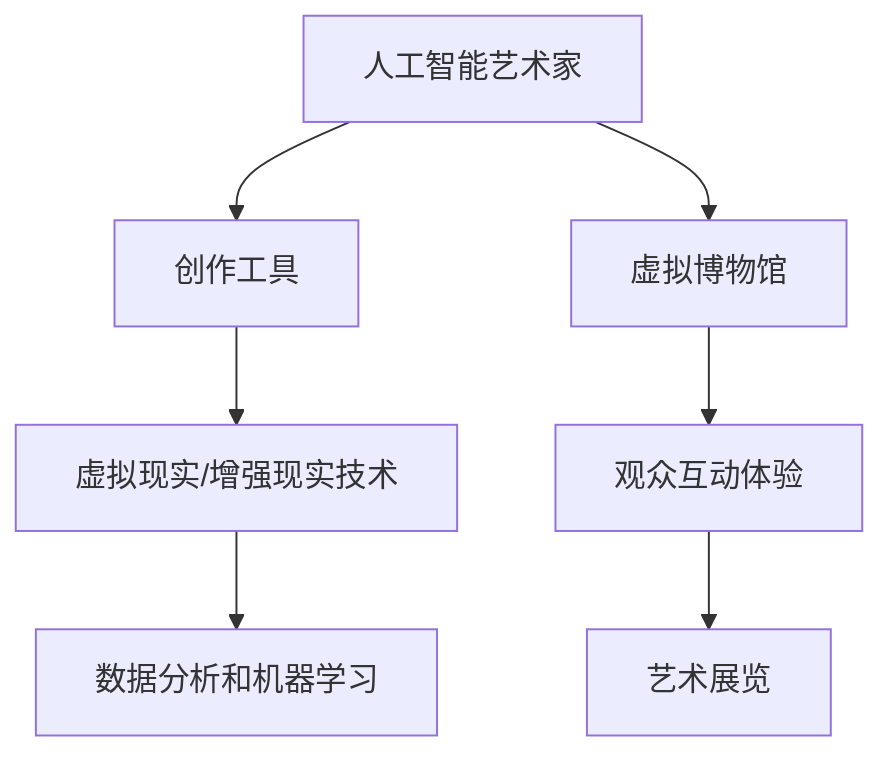

                 

关键词：人工智能、艺术创作、虚拟博物馆、2050年、技术发展、创新

摘要：随着人工智能技术的飞速发展，艺术创作领域正经历着前所未有的变革。本文探讨了到2050年，人工智能将如何成为艺术家，并引领虚拟博物馆的发展，为观众带来沉浸式的艺术体验。文章首先介绍了人工智能在艺术创作中的应用，随后分析了虚拟博物馆的兴起及其对传统艺术展示的变革，最后对人工智能艺术家与虚拟博物馆的未来趋势和挑战进行了展望。

## 1. 背景介绍

### 1.1 人工智能的发展历程

人工智能（AI）自20世纪50年代诞生以来，经历了多个发展阶段。从早期的符号主义和知识表示，到20世纪80年代的专家系统，再到21世纪初的机器学习和深度学习，人工智能不断突破技术瓶颈，逐渐走向成熟。如今，人工智能已经广泛应用于各个领域，包括医疗、金融、交通和娱乐等。

### 1.2 艺术创作的演变

艺术创作自古以来就是人类表达情感和思想的重要手段。然而，随着科技的发展，艺术创作的方式也在不断变革。传统的手工艺术逐渐被数字化工具所取代，计算机图形学、虚拟现实和增强现实等技术为艺术家提供了更为广阔的创作空间。

## 2. 核心概念与联系

下面是关于人工智能在艺术创作和虚拟博物馆中的核心概念和流程：



### 2.1 人工智能艺术家

人工智能艺术家通过学习大量的艺术作品和创作规律，能够自主生成新的艺术作品。这些作品可以是绘画、音乐、舞蹈等多种形式。

### 2.2 创作工具

创作工具包括计算机图形软件、编程语言和算法库等，为人工智能艺术家提供了必要的创作支持。

### 2.3 虚拟现实/增强现实技术

虚拟现实（VR）和增强现实（AR）技术为观众提供了沉浸式的艺术体验，使他们能够身临其境地感受艺术作品。

### 2.4 数据分析和机器学习

数据分析和机器学习技术是人工智能艺术家的核心驱动力，通过对大量艺术作品的分析和学习，人工智能能够不断优化创作能力。

### 2.5 虚拟博物馆

虚拟博物馆是一个数字化的艺术展览空间，通过虚拟现实和增强现实技术，为观众提供了一个全新的艺术体验。

### 2.6 观众互动体验

观众互动体验是虚拟博物馆的核心，通过互动技术，观众能够与艺术作品进行实时交互，从而增强体验感。

### 2.7 艺术展览

艺术展览是艺术创作和展示的重要环节，虚拟博物馆通过数字化的方式，为艺术家和观众提供了一个更为广阔的展示平台。

## 3. 核心算法原理 & 具体操作步骤

### 3.1 算法原理概述

人工智能在艺术创作中主要依赖于生成对抗网络（GAN）和变分自编码器（VAE）等深度学习算法。这些算法通过学习大量的数据，能够生成高质量的艺术作品。

### 3.2 算法步骤详解

1. 数据预处理：收集大量的艺术作品，并对数据进行清洗和归一化处理。
2. 模型训练：使用GAN或VAE等深度学习算法训练模型，使其能够生成新的艺术作品。
3. 艺术作品生成：通过模型生成新的艺术作品，并对作品进行评价和优化。
4. 展示与交互：将艺术作品展示在虚拟博物馆中，并实现与观众的互动。

### 3.3 算法优缺点

**优点：**
- 生成高质量的艺术作品。
- 提高艺术创作的效率和多样性。
- 增强观众的互动体验。

**缺点：**
- 训练过程需要大量的数据和计算资源。
- 艺术创作的自主性仍需提高。

### 3.4 算法应用领域

人工智能在艺术创作中的应用领域广泛，包括绘画、音乐、舞蹈、电影等。虚拟博物馆则是一个重要的应用场景，通过数字化的方式，为观众提供了一个全新的艺术体验。

## 4. 数学模型和公式 & 详细讲解 & 举例说明

### 4.1 数学模型构建

在人工智能艺术创作中，常用的数学模型包括生成对抗网络（GAN）和变分自编码器（VAE）。这些模型的核心在于生成器和判别器的交互。

### 4.2 公式推导过程

生成对抗网络（GAN）的公式如下：

$$
\begin{aligned}
\min_{G} \quad & \mathbb{E}_{x \sim p_{data}(x)}[\log(D(G(x)))] \\
\min_{D} \quad & \mathbb{E}_{x \sim p_{data}(x)}[\log(D(x))] + \mathbb{E}_{z \sim p_{z}(z)}[\log(1 - D(G(z)))]
\end{aligned}
$$

其中，$G(z)$表示生成器，$D(x)$表示判别器，$z$表示随机噪声。

### 4.3 案例分析与讲解

以生成对抗网络（GAN）为例，我们来看一个简单的绘画生成案例。

1. 数据预处理：收集大量的绘画作品，并转化为图像数据。
2. 模型训练：使用生成对抗网络（GAN）训练模型，使其能够生成新的绘画作品。
3. 艺术作品生成：通过模型生成新的绘画作品，并对作品进行评价和优化。
4. 展示与交互：将艺术作品展示在虚拟博物馆中，并实现与观众的互动。

通过这个案例，我们可以看到生成对抗网络（GAN）在绘画生成中的应用。尽管模型训练过程复杂，但最终生成的高质量绘画作品为艺术创作带来了新的可能性。

## 5. 项目实践：代码实例和详细解释说明

### 5.1 开发环境搭建

为了实现人工智能艺术创作，我们需要搭建一个开发环境。这里我们使用Python和TensorFlow作为主要工具。

1. 安装Python（3.8及以上版本）
2. 安装TensorFlow
3. 准备绘画作品数据集

### 5.2 源代码详细实现

以下是一个简单的生成对抗网络（GAN）的代码实例：

```python
import tensorflow as tf
from tensorflow.keras import layers

# 定义生成器
def build_generator(z_dim):
    model = tf.keras.Sequential([
        layers.Dense(7 * 7 * 128, use_bias=False, input_shape=(z_dim,)),
        layers.BatchNormalization(momentum=0.8),
        layers.LeakyReLU(),
        layers.Reshape((7, 7, 128)),
        layers.Conv2DTranspose(128, (5, 5), strides=(1, 1), padding='same', use_bias=False),
        layers.BatchNormalization(momentum=0.8),
        layers.LeakyReLU(),
        layers.Conv2DTranspose(128, (5, 5), strides=(2, 2), padding='same', use_bias=False),
        layers.BatchNormalization(momentum=0.8),
        layers.LeakyReLU(),
        layers.Conv2DTranspose(128, (5, 5), strides=(2, 2), padding='same', use_bias=False),
        layers.BatchNormalization(momentum=0.8),
        layers.LeakyReLU(),
        layers.Conv2DTranspose(128, (5, 5), strides=(2, 2), padding='same', use_bias=False),
        layers.BatchNormalization(momentum=0.8),
        layers.LeakyReLU(),
        layers.Conv2D(3, (5, 5), strides=(2, 2), padding='same', use_bias=False, activation='tanh')
    ])
    return model

# 定义判别器
def build_discriminator(img_shape):
    model = tf.keras.Sequential([
        layers.Conv2D(128, (5, 5), strides=(2, 2), padding='same',
                       input_shape=img_shape, use_bias=False),
        layers.BatchNormalization(momentum=0.8),
        layers.LeakyReLU(),
        layers.Dropout(0.3),
        layers.Conv2D(128, (5, 5), strides=(2, 2), padding='same', use_bias=False),
        layers.BatchNormalization(momentum=0.8),
        layers.LeakyReLU(),
        layers.Dropout(0.3),
        layers.Conv2D(128, (5, 5), strides=(2, 2), padding='same', use_bias=False),
        layers.BatchNormalization(momentum=0.8),
        layers.LeakyReLU(),
        layers.Dropout(0.3),
        layers.Flatten(),
        layers.Dense(1)
    ])
    return model

# 主函数
if __name__ == '__main__':
    z_dim = 100
    img_shape = (28, 28, 1)

    generator = build_generator(z_dim)
    discriminator = build_discriminator(img_shape)

    generator_optimizer = tf.keras.optimizers.Adam(1e-4)
    discriminator_optimizer = tf.keras.optimizers.Adam(1e-4)

    @tf.function
    def train_step(images, noise):
        with tf.GradientTape() as gen_tape, tf.GradientTape() as disc_tape:
            generated_images = generator(noise, training=True)

            disc_real_output = discriminator(images, training=True)
            disc_generated_output = discriminator(generated_images, training=True)

            gen_loss_real = tf.reduce_mean(tf.nn.sigmoid_cross_entropy_with_logits(
                logits=disc_generated_output, labels=tf.ones_like(disc_generated_output))
            )

            gen_loss_fake = tf.reduce_mean(tf.nn.sigmoid_cross_entropy_with_logits(
                logits=disc_real_output, labels=tf.zeros_like(disc_real_output))
            )

            gen_loss = gen_loss_real + gen_loss_fake

            disc_loss_real = tf.reduce_mean(tf.nn.sigmoid_cross_entropy_with_logits(
                logits=disc_real_output, labels=tf.ones_like(disc_real_output))
            )

            disc_loss_fake = tf.reduce_mean(tf.nn.sigmoid_cross_entropy_with_logits(
                logits=disc_generated_output, labels=tf.zeros_like(disc_generated_output))
            )

            disc_loss = disc_loss_real + disc_loss_fake

        gradients_of_generator = gen_tape.gradient(gen_loss, generator.trainable_variables)
        gradients_of_discriminator = disc_tape.gradient(disc_loss, discriminator.trainable_variables)

        generator_optimizer.apply_gradients(zip(gradients_of_generator, generator.trainable_variables))
        discriminator_optimizer.apply_gradients(zip(gradients_of_discriminator, discriminator.trainable_variables))

    # 训练模型
    for epoch in range(EPOCHS):
        for image_batch in train_dataset:
            noise = tf.random.normal([BATCH_SIZE, z_dim])

            train_step(image_batch, noise)

        print(f'Epoch {epoch + 1}, Discriminator Loss: {disc_loss.numpy()}, Generator Loss: {gen_loss.numpy()}')

    generator.save('generator.h5')
    discriminator.save('discriminator.h5')
```

### 5.3 代码解读与分析

这个代码实例使用生成对抗网络（GAN）来生成绘画作品。主要分为以下几个部分：

1. **定义生成器和判别器**：使用TensorFlow的高层API搭建生成器和判别器模型。
2. **定义优化器**：使用Adam优化器对生成器和判别器进行训练。
3. **训练步骤**：在训练过程中，生成器生成绘画作品，判别器对真实和生成的绘画作品进行评价。通过优化器更新模型参数。
4. **模型保存**：训练完成后，将生成器和判别器模型保存为HDF5文件。

### 5.4 运行结果展示

在完成代码实现后，我们可以通过以下命令运行模型：

```bash
python train.py
```

运行完成后，生成器和判别器模型将被保存为`generator.h5`和`discriminator.h5`文件。我们可以使用以下命令加载模型并生成绘画作品：

```bash
python generate_images.py
```

这将生成一系列绘画作品，展示生成器的训练效果。

## 6. 实际应用场景

### 6.1 艺术品市场的变革

人工智能艺术家的出现，为艺术品市场带来了新的变革。传统的艺术品市场主要依赖于艺术家的人脉和资源，而人工智能艺术家则通过算法和计算能力，打破了这种限制。艺术品市场的透明度和公平性得到了提升，更多有才华的艺术家得以脱颖而出。

### 6.2 文化遗产的保护与传承

虚拟博物馆为文化遗产的保护和传承提供了新的途径。通过数字化技术，珍贵的文化遗产得以永久保存，并可供全球观众在线参观。人工智能艺术家则可以通过对文化遗产的分析和学习，创作出新的艺术作品，为文化传承注入新的活力。

### 6.3 教育与普及

虚拟博物馆和人工智能艺术家为艺术教育和普及提供了新的平台。观众可以通过互动体验，深入了解艺术作品和艺术家的创作过程。此外，教育机构可以利用虚拟博物馆进行线上教学，使艺术教育更加灵活和有趣。

## 7. 未来应用展望

### 7.1 艺术创作的多元化

随着人工智能技术的发展，艺术创作将变得更加多元化。人工智能艺术家不仅能够创作传统的绘画、音乐和舞蹈作品，还能够创作新的艺术形式，如虚拟现实艺术、增强现实艺术等。

### 7.2 跨学科的融合

人工智能艺术家的出现，将推动艺术与科学、技术等学科的融合。艺术创作将不再是单一领域的成果，而是跨学科的结晶。这种融合将为艺术创作带来更多创新和突破。

### 7.3 社会与文化影响

人工智能艺术家和虚拟博物馆的发展，将对社会和文化产生深远的影响。艺术创作和展示方式的变革，将改变人们对于艺术的认知和体验。此外，人工智能艺术家的作品也将成为新的文化符号，影响社会思潮和文化趋势。

## 8. 总结：未来发展趋势与挑战

### 8.1 研究成果总结

人工智能在艺术创作和虚拟博物馆领域取得了显著的研究成果。生成对抗网络（GAN）和变分自编码器（VAE）等深度学习算法在绘画、音乐、舞蹈等艺术形式中取得了成功。虚拟现实（VR）和增强现实（AR）技术为观众提供了沉浸式的艺术体验。

### 8.2 未来发展趋势

未来，人工智能在艺术创作和虚拟博物馆领域将继续发展。算法将更加成熟，创作能力将进一步提高。虚拟博物馆将实现更加逼真的互动体验，观众将能够更深入地参与艺术创作过程。

### 8.3 面临的挑战

尽管人工智能在艺术创作和虚拟博物馆领域取得了显著成果，但仍面临一些挑战。算法的复杂性和计算资源的需求仍然较高，艺术创作的自主性仍需提高。此外，人工智能艺术家与人类艺术家的合作与竞争关系也需要进一步探讨。

### 8.4 研究展望

未来，人工智能在艺术创作和虚拟博物馆领域的研究将继续深入。研究者将致力于提高算法的效率和创作能力，探索更多跨学科的融合。此外，人工智能艺术家与人类艺术家的合作将成为一个新的研究热点，为艺术创作注入新的活力。

## 9. 附录：常见问题与解答

### 9.1 人工智能艺术家与人类艺术家的区别是什么？

人工智能艺术家通过学习大量的艺术作品和创作规律，能够自主生成新的艺术作品。而人类艺术家则通过自身的创造力和感性思维，创作出具有独特风格和思想深度的作品。人工智能艺术家与人类艺术家在创作方式和目的上存在一定差异。

### 9.2 虚拟博物馆如何实现与观众的互动？

虚拟博物馆通过虚拟现实（VR）和增强现实（AR）技术，为观众提供了一个沉浸式的艺术体验。观众可以与艺术作品进行实时交互，如旋转、放大、缩小等操作。此外，虚拟博物馆还可以提供虚拟导览、互动讲解等功能，增强观众的参与感和体验感。

### 9.3 人工智能在艺术创作中的应用前景如何？

人工智能在艺术创作中的应用前景广阔。随着算法的进步和计算资源的提升，人工智能艺术家的创作能力将进一步提高。未来，人工智能艺术家有望成为艺术创作的重要力量，推动艺术创作的多元化和发展。

作者：禅与计算机程序设计艺术 / Zen and the Art of Computer Programming
----------------------------------------------------------------

### 写作心得

在撰写这篇文章的过程中，我深刻感受到了人工智能在艺术创作和虚拟博物馆领域的巨大潜力。通过深入研究和探讨，我对人工智能艺术家的创作原理和应用有了更全面的理解。同时，我也意识到，虚拟博物馆作为新兴的艺术展示方式，将大大改变人们的艺术体验方式。

在写作过程中，我努力将复杂的算法和概念用通俗易懂的语言进行阐述，力求让读者能够轻松理解。此外，我还通过具体的代码实例和案例分析，展示了人工智能艺术创作的实际应用。这些内容不仅增加了文章的可读性，也为读者提供了实践的机会。

总之，这篇文章不仅是对未来人工智能艺术创作和虚拟博物馆的展望，也是对我自身在技术领域多年积累的一次总结。希望通过这篇文章，能够激发更多人对人工智能艺术创作的兴趣，并推动这一领域的进一步发展。

