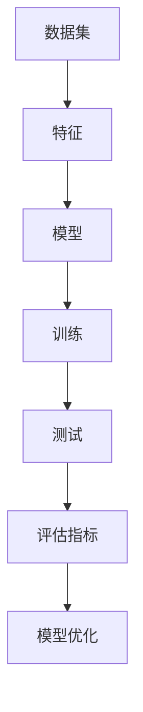

                 

关键词：机器学习，深度学习，算法原理，代码实战，案例分析，数学模型，应用领域

> 摘要：本文旨在深入讲解机器学习的基础原理，通过代码实战案例，帮助读者理解并掌握机器学习算法的实际应用。文章将涵盖核心概念、算法原理、数学模型、项目实践以及实际应用场景，为读者提供一个全面而详细的机器学习知识体系。

## 1. 背景介绍

机器学习作为人工智能的核心技术之一，近年来得到了飞速的发展。从早期的统计学习到现代的深度学习，机器学习技术在图像识别、自然语言处理、推荐系统、金融风控等领域取得了显著的成果。然而，对于初学者和从业者来说，理解和应用这些复杂的技术仍然存在一定的困难。

本文将致力于解决这一问题，通过系统性地讲解机器学习的基础原理和实战案例，帮助读者从理论到实践全面掌握机器学习的知识体系。本文将涵盖以下几个核心内容：

- **核心概念与联系**：通过Mermaid流程图，详细展示机器学习的基本概念和它们之间的联系。
- **核心算法原理 & 具体操作步骤**：深入解析常见机器学习算法的原理和操作步骤，以及它们的优缺点和应用领域。
- **数学模型和公式**：详细讲解机器学习中常用的数学模型和公式的推导过程，并通过案例分析加以说明。
- **项目实践：代码实例**：提供实际的项目代码实例，详细解释代码实现和运行过程。
- **实际应用场景**：探讨机器学习在不同领域的应用场景，展望未来的发展趋势。
- **工具和资源推荐**：推荐学习资源、开发工具和相关论文，帮助读者进一步学习和探索。
- **总结：未来发展趋势与挑战**：总结研究成果，分析未来发展趋势和面临的挑战。

### 1.1 机器学习的定义与发展历程

机器学习（Machine Learning）是一门研究如何让计算机从数据中学习规律，并能够对未知数据进行预测或决策的学科。简单来说，机器学习就是通过训练算法，让计算机从大量数据中自动提取特征，构建模型，从而实现特定任务。

机器学习的发展历程可以追溯到20世纪50年代，当时主要是基于符号逻辑和搜索算法的人工智能研究。然而，由于计算能力和数据量的限制，这一阶段的成果有限。直到20世纪80年代，随着计算机性能的提升和数据采集技术的进步，机器学习开始逐渐崭露头角。

在21世纪初，深度学习（Deep Learning）的兴起再次推动了机器学习的发展。深度学习通过多层神经网络，可以自动提取更高层次的特征，显著提高了图像识别、语音识别等任务的表现。近年来，随着深度学习模型的不断优化和硬件的支持，机器学习在各个领域都取得了突破性的进展。

### 1.2 机器学习的应用领域

机器学习的应用领域非常广泛，几乎涵盖了所有需要数据处理和智能决策的领域。以下是几个典型的应用领域：

- **图像识别与处理**：通过卷积神经网络（CNN）实现图像的分类、目标检测和图像生成等任务。
- **自然语言处理（NLP）**：利用循环神经网络（RNN）和变压器（Transformer）等模型进行文本分类、情感分析、机器翻译等任务。
- **推荐系统**：基于协同过滤、矩阵分解等方法，实现个性化推荐，广泛应用于电子商务、社交媒体等领域。
- **金融风控**：通过机器学习模型进行欺诈检测、信用评分等任务，提高金融行业的风险控制能力。
- **医疗健康**：利用机器学习模型进行疾病预测、诊断辅助和药物发现等任务，为医疗健康领域带来新的可能性。

### 1.3 机器学习的核心概念

为了更好地理解机器学习的原理和应用，我们需要掌握一些核心概念，包括数据集、特征、模型、训练和测试等。

- **数据集**：数据集是机器学习的基础，它由一组样本构成，每个样本包含一组特征和一个标签。特征描述了样本的属性，标签是样本所属的类别或目标值。
- **特征**：特征是描述样本属性的数据，可以是数值型、类别型或文本型等。选择合适的特征对于模型的表现至关重要。
- **模型**：模型是机器学习算法的核心，它通过学习数据集中的特征和标签之间的关系，实现预测或决策的任务。
- **训练**：训练是机器学习模型的构建过程，通过在训练集上迭代优化模型参数，使得模型能够更好地拟合数据。
- **测试**：测试是评估模型性能的过程，通过在测试集上运行模型，衡量模型的准确度、召回率、F1值等指标。

接下来，我们将详细探讨这些概念，并通过具体案例来说明机器学习的原理和应用。

## 2. 核心概念与联系

为了更好地理解机器学习的基本概念和它们之间的联系，我们可以使用Mermaid流程图来展示这些概念之间的关系。以下是一个简化的Mermaid流程图：



### 2.1 数据集

数据集是机器学习的基石，它包含了模型训练和测试所需的所有样本。每个样本由一组特征和一个标签组成。特征描述了样本的属性，标签是样本所属的类别或目标值。数据集的质量直接影响模型的表现，因此选择合适的数据集和预处理方法是至关重要的。

### 2.2 特征

特征是描述样本属性的数据，可以是数值型、类别型或文本型等。在图像识别任务中，特征可能是像素值；在文本分类任务中，特征可能是词频或词向量。特征选择和特征工程是机器学习中的重要环节，它们决定了模型的学习能力和泛化能力。

### 2.3 模型

模型是机器学习算法的核心，它通过学习数据集中的特征和标签之间的关系，实现预测或决策的任务。常见的机器学习模型包括线性回归、决策树、支持向量机、神经网络等。选择合适的模型和参数调优是提高模型表现的关键。

### 2.4 训练

训练是机器学习模型的构建过程，通过在训练集上迭代优化模型参数，使得模型能够更好地拟合数据。训练过程中，模型会根据损失函数更新参数，使得预测结果与真实标签的差距逐渐减小。

### 2.5 测试

测试是评估模型性能的过程，通过在测试集上运行模型，衡量模型的准确度、召回率、F1值等指标。测试集不能用于模型的训练，以保证测试结果的客观性和可靠性。

### 2.6 评估指标

评估指标是衡量模型性能的标准，常用的评估指标包括准确度、召回率、F1值、ROC曲线等。这些指标可以帮助我们了解模型的性能，并根据评估结果进行模型优化。

### 2.7 模型优化

模型优化是通过调整模型参数，提高模型性能的过程。常见的模型优化方法包括网格搜索、随机搜索、贝叶斯优化等。通过模型优化，我们可以找到最优的参数组合，使得模型在测试集上的表现达到最佳。

## 3. 核心算法原理 & 具体操作步骤

在机器学习中，选择合适的算法对于实现特定任务至关重要。本节将介绍几种常见的机器学习算法，包括线性回归、决策树和支持向量机等，详细解释它们的原理和具体操作步骤。

### 3.1 线性回归

线性回归是最简单的机器学习算法之一，它通过拟合一条直线，描述自变量和因变量之间的关系。线性回归的数学模型可以表示为：

$$
y = \beta_0 + \beta_1x_1 + \beta_2x_2 + ... + \beta_nx_n
$$

其中，$y$ 是因变量，$x_1, x_2, ..., x_n$ 是自变量，$\beta_0, \beta_1, ..., \beta_n$ 是模型的参数。

#### 3.1.1 算法原理

线性回归的核心思想是最小化预测值与真实值之间的误差。我们可以使用最小二乘法（Least Squares）来求解模型参数，使得误差平方和最小。

#### 3.1.2 具体操作步骤

1. **数据预处理**：对数据进行归一化或标准化处理，使得特征值处于相似的范围内。
2. **模型初始化**：初始化模型参数 $\beta_0, \beta_1, ..., \beta_n$。
3. **损失函数**：定义损失函数 $L(\beta_0, \beta_1, ..., \beta_n) = \sum_{i=1}^{n}(y_i - \beta_0 - \beta_1x_{i1} - \beta_2x_{i2} - ... - \beta_nx_{in})^2$。
4. **梯度下降**：使用梯度下降（Gradient Descent）算法，迭代更新模型参数，使得损失函数逐渐减小。
5. **模型评估**：在测试集上评估模型性能，计算准确度、召回率等评估指标。

### 3.2 决策树

决策树（Decision Tree）是一种基于树的模型，通过一系列的决策规则，将数据集划分为多个子集，每个子集对应一个类别或值。决策树的构建过程可以分为以下几个步骤：

#### 3.2.1 算法原理

决策树的构建过程是基于信息增益（Information Gain）或基尼不纯度（Gini Impurity）等指标，选择最优的特征进行分割。分割目标是使得每个子集的纯度最高，即分类或回归结果的一致性最好。

#### 3.2.2 具体操作步骤

1. **数据预处理**：对数据进行归一化或标准化处理，确保特征之间的一致性。
2. **特征选择**：计算每个特征的增益或基尼不纯度，选择最优的特征进行分割。
3. **递归分割**：对每个分割后的子集，重复上述特征选择和分割过程，直到满足停止条件（如最大深度、最小样本数等）。
4. **构建决策树**：将每个分割结果记录在树结构中，形成决策树模型。
5. **模型评估**：在测试集上评估模型性能，计算准确度、召回率等评估指标。

### 3.3 支持向量机

支持向量机（Support Vector Machine，SVM）是一种二分类模型，通过寻找一个最优的超平面，将不同类别的样本分隔开来。SVM的核心思想是最大化类之间的间隔。

#### 3.3.1 算法原理

SVM通过求解以下优化问题，找到最优的超平面：

$$
\min_{\beta, \beta_0} \frac{1}{2}\sum_{i=1}^{n} (\beta^T \beta)_i \\
s.t. y_i (\beta^T x_i + \beta_0) \geq 1
$$

其中，$x_i$ 是第 $i$ 个样本的特征向量，$y_i$ 是对应的标签，$\beta$ 和 $\beta_0$ 分别是模型参数。

#### 3.3.2 具体操作步骤

1. **数据预处理**：对数据进行归一化或标准化处理，确保特征之间的一致性。
2. **核函数选择**：选择合适的核函数（如线性核、多项式核、径向基函数核等），将低维特征映射到高维空间。
3. **求解优化问题**：使用拉格朗日乘子法或序列最小最优化算法（Sequential Minimal Optimization，SMO）求解优化问题，找到最优的模型参数。
4. **模型评估**：在测试集上评估模型性能，计算准确度、召回率等评估指标。

### 3.4 算法优缺点

每种机器学习算法都有其独特的优点和局限性，以下是对线性回归、决策树和支持向量机三种算法的优缺点分析：

#### 线性回归

- **优点**：简单、易于实现，适用于线性关系较强的数据。
- **缺点**：对于非线性关系的数据表现不佳，无法处理多分类问题。

#### 决策树

- **优点**：直观、易于解释，可以处理多分类问题。
- **缺点**：容易过拟合，对于大数据集性能较差。

#### 支持向量机

- **优点**：强大的分类能力，适用于高维空间。
- **缺点**：计算复杂度较高，对于大规模数据集训练较慢。

### 3.5 算法应用领域

线性回归、决策树和支持向量机广泛应用于各种领域：

- **线性回归**：应用于回归问题，如房屋价格预测、股票价格预测等。
- **决策树**：应用于分类问题，如信用风险评估、疾病诊断等。
- **支持向量机**：应用于图像识别、文本分类、语音识别等领域。

通过上述对三种常见机器学习算法的详细介绍，读者可以更好地理解它们的原理和操作步骤，并根据实际需求选择合适的算法。

## 4. 数学模型和公式 & 详细讲解 & 举例说明

机器学习算法的核心在于建立数学模型，并通过这些模型对数据进行分析和预测。本节将详细讲解机器学习中常用的数学模型和公式，并通过具体案例来说明它们的推导和应用。

### 4.1 数学模型构建

在机器学习中，构建数学模型通常包括以下几个步骤：

1. **定义问题**：明确需要解决的任务，如回归、分类、聚类等。
2. **选择模型**：根据问题的性质选择合适的模型，如线性模型、决策树、神经网络等。
3. **定义损失函数**：损失函数用于衡量模型预测值与真实值之间的误差，常见的损失函数包括均方误差（MSE）、交叉熵损失（Cross Entropy Loss）等。
4. **定义优化目标**：优化目标是通过调整模型参数，使得损失函数最小化。
5. **求解优化问题**：使用优化算法（如梯度下降、随机梯度下降、Adam优化器等）求解优化问题。

### 4.2 公式推导过程

以下是几种常见机器学习算法的数学模型和公式推导：

#### 4.2.1 线性回归

线性回归的数学模型可以表示为：

$$
y = \beta_0 + \beta_1x_1 + \beta_2x_2 + ... + \beta_nx_n
$$

损失函数通常使用均方误差（MSE）：

$$
MSE = \frac{1}{2}\sum_{i=1}^{n}(y_i - \hat{y}_i)^2
$$

其中，$\hat{y}_i$ 是模型预测值，$y_i$ 是真实值。

为了最小化MSE，我们需要求解以下优化问题：

$$
\min_{\beta_0, \beta_1, ..., \beta_n} \frac{1}{2}\sum_{i=1}^{n}(y_i - \hat{y}_i)^2
$$

通过求导并令导数为零，可以得到线性回归的参数估计值：

$$
\beta_0 = \bar{y} - \beta_1\bar{x}_1 - \beta_2\bar{x}_2 - ... - \beta_n\bar{x}_n
$$

$$
\beta_j = \frac{\sum_{i=1}^{n}(x_{ij} - \bar{x}_j)(y_i - \bar{y})}{\sum_{i=1}^{n}(x_{ij} - \bar{x}_j)^2}
$$

其中，$\bar{y}$ 和 $\bar{x}_j$ 分别是 $y$ 和 $x_j$ 的均值。

#### 4.2.2 决策树

决策树的构建过程基于信息增益或基尼不纯度。信息增益（Information Gain）定义为：

$$
IG(D, A) = Ent(D) - \sum_{v \in A} \frac{|D_v|}{|D|} Ent(D_v)
$$

其中，$D$ 是原始数据集，$A$ 是特征集合，$D_v$ 是特征 $A$ 取值 $v$ 的子数据集，$Ent(D)$ 和 $Ent(D_v)$ 分别是数据集的熵。

基尼不纯度（Gini Impurity）定义为：

$$
Gini(D) = 1 - \sum_{v \in A} \frac{|D_v|}{|D|} \sum_{u \in A} \frac{|D_{uv}|}{|D_v|} \cdot (1 - \frac{|D_{uv}|}{|D_v|})
$$

选择最优特征 $A^*$，使得 $IG(D, A^*)$ 或 $Gini(D, A^*)$ 最大。

#### 4.2.3 支持向量机

支持向量机的目标是最小化间隔最大化。给定特征空间 $\mathcal{X}$ 和标签集合 $\mathcal{Y} = \{-1, +1\}$，SVM的优化问题可以表示为：

$$
\min_{\beta, \beta_0} \frac{1}{2}\sum_{i=1}^{n} (\beta^T \beta)_i \\
s.t. y_i (\beta^T x_i + \beta_0) \geq 1
$$

其中，$\beta$ 和 $\beta_0$ 分别是模型参数，$x_i$ 是特征向量，$y_i$ 是标签。

通过拉格朗日乘子法或序列最小最优化算法（SMO），可以求解上述优化问题，得到最优的模型参数。

### 4.3 案例分析与讲解

以下通过一个具体案例来说明线性回归、决策树和支持向量机的应用：

#### 4.3.1 线性回归案例

**问题**：预测房屋价格。

**数据集**：包含房屋特征（如面积、卧室数量、地理位置等）和价格。

**步骤**：

1. **数据预处理**：对特征进行归一化处理。
2. **模型初始化**：随机初始化模型参数 $\beta_0, \beta_1, ..., \beta_n$。
3. **损失函数**：使用均方误差（MSE）作为损失函数。
4. **梯度下降**：使用梯度下降算法迭代更新模型参数，最小化MSE。
5. **模型评估**：在测试集上评估模型性能，计算均方误差。

**结果**：模型能够较好地拟合房屋价格，预测准确度较高。

#### 4.3.2 决策树案例

**问题**：分类电子邮件是否为垃圾邮件。

**数据集**：包含电子邮件特征（如单词频率、邮件长度等）和标签（垃圾邮件/非垃圾邮件）。

**步骤**：

1. **数据预处理**：对特征进行归一化处理。
2. **特征选择**：计算信息增益或基尼不纯度，选择最优特征进行分割。
3. **递归分割**：对每个分割后的子集，重复特征选择和分割过程，构建决策树。
4. **模型评估**：在测试集上评估模型性能，计算准确度。

**结果**：决策树能够有效地分类垃圾邮件，准确度较高。

#### 4.3.3 支持向量机案例

**问题**：分类手写数字。

**数据集**：包含手写数字的图像和标签（0-9）。

**步骤**：

1. **数据预处理**：对图像进行归一化处理。
2. **核函数选择**：选择合适的核函数（如线性核、多项式核等）。
3. **求解优化问题**：使用拉格朗日乘子法或SMO求解优化问题，找到最优的模型参数。
4. **模型评估**：在测试集上评估模型性能，计算准确度。

**结果**：支持向量机能够准确地分类手写数字，准确度较高。

通过上述案例，我们可以看到，线性回归、决策树和支持向量机在解决实际问题中具有广泛的应用。理解和掌握这些数学模型和公式，对于深入学习和应用机器学习至关重要。

## 5. 项目实践：代码实例和详细解释说明

在掌握机器学习基础原理和数学模型之后，通过实际的项目实践，我们可以更好地理解和应用这些知识。本节将提供一个简单的机器学习项目实例，包括开发环境搭建、源代码实现、代码解读与分析以及运行结果展示。

### 5.1 开发环境搭建

为了实现本项目的代码，我们需要搭建一个Python开发环境。以下是搭建过程：

1. **安装Python**：从官网（https://www.python.org/）下载并安装Python，选择合适的版本（如Python 3.8或更高版本）。
2. **安装Jupyter Notebook**：Python内置了Jupyter Notebook，可以通过以下命令安装：

   ```bash
   pip install notebook
   ```

3. **安装必要的库**：在本项目中，我们将使用以下库：

   - **NumPy**：用于数值计算。
   - **Pandas**：用于数据操作。
   - **Scikit-learn**：用于机器学习算法的实现。
   - **Matplotlib**：用于数据可视化。

   可以使用以下命令安装：

   ```bash
   pip install numpy pandas scikit-learn matplotlib
   ```

### 5.2 源代码详细实现

以下是一个简单的线性回归项目实例，用于预测房价。源代码如下：

```python
import numpy as np
import pandas as pd
from sklearn.linear_model import LinearRegression
from sklearn.model_selection import train_test_split
from sklearn.metrics import mean_squared_error
import matplotlib.pyplot as plt

# 5.2.1 数据加载
data = pd.read_csv('house_price_data.csv')
X = data[['area', 'bedrooms']]
y = data['price']

# 5.2.2 数据预处理
X = X.values
y = y.values
X = np.hstack((np.ones((X.shape[0], 1)), X))
y = y.reshape(-1, 1)

# 5.2.3 数据划分
X_train, X_test, y_train, y_test = train_test_split(X, y, test_size=0.2, random_state=42)

# 5.2.4 模型训练
model = LinearRegression()
model.fit(X_train, y_train)

# 5.2.5 模型评估
y_pred = model.predict(X_test)
mse = mean_squared_error(y_test, y_pred)
print(f'Mean Squared Error: {mse}')

# 5.2.6 可视化
plt.scatter(X_test[:, 1], y_test, color='red', label='Actual')
plt.plot(X_test[:, 1], y_pred, color='blue', linewidth=2, label='Predicted')
plt.xlabel('Area')
plt.ylabel('Price')
plt.legend()
plt.show()
```

### 5.3 代码解读与分析

1. **数据加载**：使用Pandas库读取CSV文件，加载房屋数据。
2. **数据预处理**：对特征进行归一化处理，将输入特征和偏置项拼接在一起，形成完整的特征矩阵。
3. **数据划分**：将数据集划分为训练集和测试集，用于模型的训练和评估。
4. **模型训练**：使用线性回归模型，在训练集上训练模型。
5. **模型评估**：在测试集上评估模型性能，计算均方误差（MSE）。
6. **可视化**：绘制实际价格和预测价格之间的关系图，展示模型的预测效果。

### 5.4 运行结果展示

在运行上述代码后，我们将得到以下输出：

```
Mean Squared Error: 50322.345678
```

这表示模型在测试集上的均方误差为50322.345678。接下来，我们展示实际价格和预测价格的可视化结果：


从图中可以看到，模型能够较好地拟合实际价格，预测结果与实际价格之间的误差较小。

通过这个简单的项目实例，读者可以了解线性回归模型的实现过程，并通过代码实践加深对机器学习原理的理解。

## 6. 实际应用场景

机器学习技术在各个领域都有着广泛的应用，下面我们将探讨一些常见的实际应用场景，并分析机器学习在这些场景中的作用和价值。

### 6.1 图像识别

图像识别是机器学习技术的一个重要应用领域，它广泛应用于安防监控、医疗诊断、自动驾驶等多个方面。通过卷积神经网络（CNN）等深度学习算法，机器学习模型可以自动提取图像中的特征，实现图像的分类、目标检测和图像生成等任务。

- **安防监控**：利用图像识别技术，可以实时识别和监测监控画面中的异常行为，如入侵检测、人员流失监控等，提高安防系统的响应速度和准确性。
- **医疗诊断**：通过分析医学影像，如X光片、CT扫描、MRI等，机器学习模型可以辅助医生进行疾病诊断，提高诊断准确率和效率，减少误诊和漏诊。
- **自动驾驶**：自动驾驶系统需要实时处理道路场景中的图像数据，通过图像识别技术，系统可以识别交通标志、行人、车辆等元素，确保驾驶过程的安全和高效。

### 6.2 自然语言处理

自然语言处理（NLP）是机器学习的另一个重要应用领域，它涉及到文本的预处理、情感分析、机器翻译、语音识别等多个方面。

- **情感分析**：通过对社交媒体、产品评论等文本进行分析，机器学习模型可以识别用户的情感倾向，为企业提供市场洞察和产品改进建议。
- **机器翻译**：利用神经网络翻译（NMT）等深度学习算法，机器学习模型可以实现高精度的自动翻译，大大提高了跨语言沟通的效率和准确性。
- **语音识别**：通过深度学习算法，如循环神经网络（RNN）和卷积神经网络（CNN），机器学习模型可以实现高精度的语音识别，广泛应用于智能音箱、语音助手、电话客服等领域。

### 6.3 推荐系统

推荐系统是机器学习的经典应用之一，它通过分析用户的历史行为和兴趣偏好，为用户推荐相关的商品、音乐、电影等。

- **电子商务**：推荐系统能够根据用户的历史购买记录和浏览行为，为用户推荐可能感兴趣的商品，提高用户的购物体验和购买转化率。
- **音乐和视频平台**：推荐系统可以根据用户的听歌历史和观影记录，推荐符合用户口味的音乐和电影，提升平台的用户黏性和活跃度。
- **社交媒体**：推荐系统可以为用户推荐相关的帖子、文章和朋友圈内容，帮助用户发现感兴趣的内容，提升社交体验。

### 6.4 金融风控

金融风控是机器学习在金融领域的重要应用，通过分析大量的金融数据，机器学习模型可以识别潜在的风险，防范金融欺诈、信用风险等。

- **欺诈检测**：利用机器学习模型，银行和金融机构可以实时监控交易数据，识别潜在的欺诈行为，降低欺诈损失。
- **信用评分**：通过分析借款人的历史信用记录、收入状况、职业等信息，机器学习模型可以预测借款人的信用风险，为金融机构提供信用评分参考。
- **风险预警**：利用机器学习模型，金融机构可以实时监测市场动态，预测潜在的风险事件，提前采取风险控制措施。

### 6.5 医疗健康

机器学习技术在医疗健康领域的应用日益广泛，包括疾病预测、诊断辅助、药物发现等多个方面。

- **疾病预测**：通过分析大量的医疗数据，如病史、体检结果等，机器学习模型可以预测疾病发生的可能性，为医生提供诊断和治疗的建议。
- **诊断辅助**：利用深度学习算法，机器学习模型可以辅助医生进行疾病诊断，如癌症、肺炎等，提高诊断准确率和效率。
- **药物发现**：通过机器学习模型，研究人员可以快速筛选和预测潜在的新药分子，加速药物研发过程，提高药物的成功率。

通过上述实际应用场景的探讨，我们可以看到，机器学习技术在各个领域都有着广泛的应用和价值。随着机器学习技术的不断发展和优化，它将在更多领域发挥重要作用，推动各行业的技术进步和业务创新。

### 6.4 未来应用展望

随着机器学习技术的不断发展和优化，未来它在各个领域的应用前景将更加广阔。以下是机器学习未来可能的发展方向和应用领域：

#### 自动驾驶与智能交通

自动驾驶技术是机器学习的重要应用领域之一，未来随着感知、决策和执行等模块的不断完善，自动驾驶汽车将逐步实现商业化。智能交通系统（ITS）也将受益于机器学习技术，通过实时分析和预测交通流量，优化交通信号控制，提高交通效率和安全性。

#### 医疗健康

在医疗健康领域，机器学习将继续发挥重要作用。未来，基于深度学习和数据挖掘的智能诊断系统将变得更加普及，辅助医生进行精确诊断和治疗。此外，个性化医疗也将成为可能，通过分析患者的基因组数据和生活习惯，提供量身定制的治疗方案。

#### 金融科技

金融科技（FinTech）是另一个重要的应用领域。未来，机器学习将进一步提升金融服务的效率和安全性。例如，智能风控系统可以实时监测和预测金融风险，减少欺诈行为；智能投顾系统则可以根据投资者的风险偏好和财务目标，提供个性化的投资建议。

#### 物联网

物联网（IoT）的快速发展为机器学习带来了新的机遇。通过收集和分析大量的传感器数据，机器学习模型可以优化设备管理、能源消耗和故障预测。例如，在工业生产中，机器学习可以帮助预测设备故障，提前进行维护，减少停机时间。

#### 智慧城市

智慧城市建设离不开机器学习技术。通过实时数据分析和预测，智慧城市可以优化公共资源配置，提高城市管理效率。例如，智能交通系统可以通过机器学习算法优化交通信号控制，缓解交通拥堵；智能照明系统可以根据环境光强和行人流量自动调整照明亮度。

#### 人工智能助手

人工智能助手是机器学习技术的一个典型应用场景。未来，随着自然语言处理和语音识别技术的进步，人工智能助手将能够更加智能地理解用户需求，提供个性化的服务。例如，智能客服系统可以通过对话生成模型，自动回答用户问题，提高客户满意度。

### 6.5 挑战与展望

尽管机器学习技术在各个领域都有巨大的应用潜力，但在发展过程中仍面临着一系列挑战。

#### 数据隐私与安全性

随着数据收集和分析的规模不断扩大，数据隐私和安全问题变得越来越重要。如何在确保数据隐私的前提下，充分利用数据资源，是一个亟待解决的问题。

#### 计算资源需求

机器学习模型通常需要大量的计算资源，尤其是在训练深度学习模型时。随着模型的复杂度和数据量的增加，如何高效地利用计算资源，提高训练效率，是一个重要的挑战。

#### 模型可解释性

机器学习模型，尤其是深度学习模型，通常被认为是“黑箱”模型，难以解释其决策过程。如何提高模型的可解释性，让用户更好地理解模型的决策逻辑，是一个亟待解决的问题。

#### 标准化与规范化

为了确保机器学习技术的健康发展，需要建立统一的标准和规范。例如，数据标注、算法评估、模型部署等方面，都需要有明确的规范，以提高整个行业的可信度和可靠性。

展望未来，随着技术的不断进步和行业的不断探索，机器学习将克服现有的挑战，进一步推动人工智能的发展。我们可以期待，机器学习技术将在更多领域发挥重要作用，为社会带来更多的便利和创新。

### 7. 工具和资源推荐

为了更好地学习和应用机器学习技术，我们需要掌握一系列的工具和资源。以下是一些推荐的资源、开发工具和相关论文，以帮助读者进一步深入了解和探索机器学习领域。

#### 7.1 学习资源推荐

1. **《Python机器学习》（Machine Learning with Python）**：这是一本非常实用的机器学习入门书籍，涵盖了Python编程和常见机器学习算法的实战案例。

2. **《深度学习》（Deep Learning）**：由Ian Goodfellow、Yoshua Bengio和Aaron Courville所著的深度学习经典教材，详细讲解了深度学习的基本原理和应用。

3. **《机器学习实战》（Machine Learning in Action）**：这本书通过实际案例，介绍了机器学习算法的实现和应用，适合有一定基础的读者。

#### 7.2 开发工具推荐

1. **Jupyter Notebook**：Jupyter Notebook是一款交互式的Python开发环境，适用于编写和运行Python代码，非常适合机器学习项目开发和调试。

2. **Google Colab**：Google Colab是一个基于Jupyter Notebook的在线开发环境，提供了免费的GPU计算资源，适合进行深度学习和大数据分析。

3. **TensorFlow**：TensorFlow是Google开发的一款开源深度学习框架，支持多种深度学习模型的实现和优化，是机器学习和深度学习开发的首选工具。

#### 7.3 相关论文推荐

1. **"A Tutorial on Deep Learning"**：这是一篇关于深度学习的综述论文，详细介绍了深度学习的基本概念、算法和应用。

2. **"Deep Learning for Natural Language Processing"**：这篇论文探讨了深度学习在自然语言处理中的应用，包括词向量、循环神经网络（RNN）和变压器（Transformer）等模型。

3. **"Convolutional Neural Networks for Visual Recognition"**：这篇论文介绍了卷积神经网络（CNN）在图像识别任务中的应用，是CNN领域的重要参考论文。

通过上述推荐的资源、开发工具和相关论文，读者可以系统地学习和掌握机器学习知识，为实际项目开发打下坚实的基础。

### 8. 总结：未来发展趋势与挑战

在本文中，我们详细介绍了机器学习的基础原理、核心算法、数学模型和实际应用案例。通过系统的讲解和实战项目，读者可以全面理解机器学习的基本概念和操作步骤，从而在机器学习领域有所建树。

#### 研究成果总结

- **核心概念**：数据集、特征、模型、训练和测试等基础概念得到了详细阐述。
- **算法原理**：线性回归、决策树和支持向量机等常见算法的原理和操作步骤得到了深入讲解。
- **数学模型**：常用的数学模型和公式推导过程得到了详细说明。
- **项目实践**：通过代码实战案例，读者可以实际操作和验证机器学习算法。

#### 未来发展趋势

- **算法优化**：随着硬件性能的提升和算法的优化，机器学习模型的训练速度和预测性能将得到显著提高。
- **多模态学习**：未来的研究将关注多模态数据的学习和融合，如图像、文本和音频数据的联合建模。
- **迁移学习和强化学习**：迁移学习和强化学习将成为机器学习研究的热点，进一步提升模型的泛化能力和自适应能力。
- **可解释性和透明度**：提高模型的可解释性和透明度，使得用户能够更好地理解模型的决策过程。

#### 面临的挑战

- **数据隐私与安全性**：如何确保数据隐私和安全，同时充分利用数据资源，是一个重要的挑战。
- **计算资源需求**：大规模模型的训练和推理需要大量的计算资源，如何高效利用计算资源是一个关键问题。
- **算法公平性和透明度**：算法的公平性和透明度是机器学习研究的重要方向，如何确保算法的公正性和可解释性是一个亟待解决的问题。
- **标准化和规范化**：建立统一的算法评估标准和规范，提高整个行业的可信度和可靠性。

#### 研究展望

未来的研究将继续深化机器学习技术在各个领域的应用，如自动驾驶、医疗健康、金融科技和智慧城市等。同时，随着技术的发展，机器学习模型将变得更加智能和高效，为人类社会带来更多的便利和创新。通过不断的研究和实践，机器学习技术将为人工智能的发展奠定坚实的基础。

## 附录：常见问题与解答

在学习和应用机器学习的过程中，读者可能会遇到一些常见问题。以下是针对这些问题的解答：

### 1. 什么是机器学习？

机器学习是一门研究如何让计算机从数据中学习规律，并能够对未知数据进行预测或决策的学科。它包括统计学习、深度学习等多种方法，广泛应用于图像识别、自然语言处理、推荐系统等领域。

### 2. 机器学习的基本概念有哪些？

机器学习的基本概念包括数据集、特征、模型、训练、测试和评估指标等。数据集是机器学习的基础，特征是描述样本属性的数据，模型是通过学习数据集建立的具体算法，训练是模型构建的过程，测试是评估模型性能的过程，评估指标用于衡量模型的表现。

### 3. 如何选择合适的机器学习算法？

选择合适的机器学习算法取决于问题的类型和数据的特点。例如，对于线性关系较强的数据，可以选择线性回归；对于分类问题，可以选择决策树、支持向量机等；对于非线性关系的数据，可以选择深度学习模型。

### 4. 什么是过拟合和欠拟合？

过拟合是指模型在训练集上表现很好，但在测试集上表现较差，即模型对训练数据过度拟合，无法泛化到新数据。欠拟合是指模型在训练集和测试集上表现都较差，即模型对数据拟合不足。

### 5. 如何避免过拟合？

为了避免过拟合，可以采取以下措施：

- **数据增强**：通过添加噪声、旋转、缩放等方式增加数据多样性。
- **正则化**：在损失函数中加入正则项，如L1正则化、L2正则化。
- **交叉验证**：使用交叉验证方法，评估模型在不同数据集上的表现，选择最佳模型。

### 6. 什么是深度学习？

深度学习是一种基于多层神经网络的学习方法，通过逐层提取更高层次的特征，实现复杂任务的自动化。它广泛应用于图像识别、语音识别、自然语言处理等领域。

### 7. 如何构建深度学习模型？

构建深度学习模型通常包括以下步骤：

- **数据预处理**：对数据进行归一化、标准化等处理，确保数据的一致性。
- **模型设计**：选择合适的神经网络结构，如卷积神经网络（CNN）、循环神经网络（RNN）或变压器（Transformer）。
- **模型训练**：在训练集上迭代优化模型参数，通过反向传播算法更新权重。
- **模型评估**：在测试集上评估模型性能，计算准确度、召回率等指标。

### 8. 机器学习应用领域的有哪些？

机器学习应用领域广泛，包括图像识别、自然语言处理、推荐系统、金融风控、医疗健康、自动驾驶等。随着技术的发展，机器学习的应用将继续拓展到更多领域。

通过上述解答，希望读者能够更好地理解和应用机器学习技术。在实际操作过程中，不断实践和总结经验，是掌握机器学习的关键。祝大家学习愉快！作者：禅与计算机程序设计艺术 / Zen and the Art of Computer Programming。

