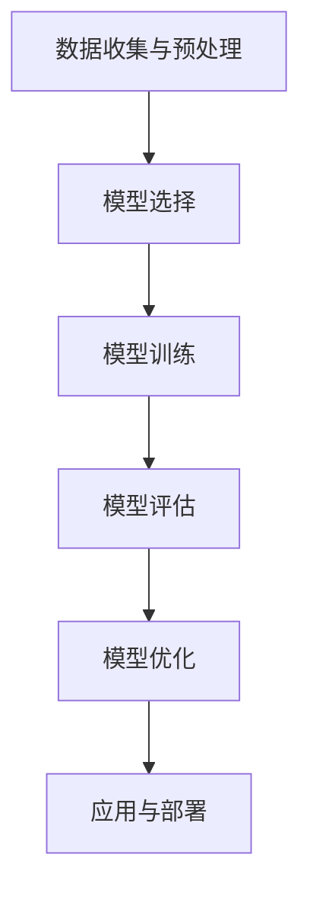
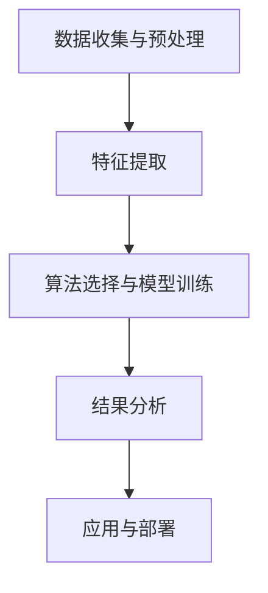
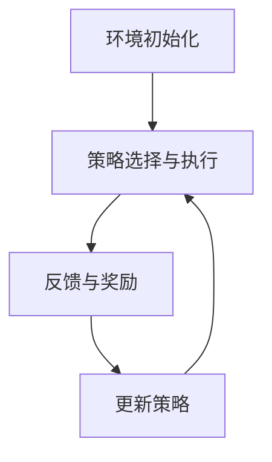

                 

## 1. 背景介绍

在当今信息技术飞速发展的时代，机器学习（Machine Learning，ML）已经成为数据科学和人工智能领域的重要组成部分。它通过让计算机从数据中自动学习规律，帮助人们解决从图像识别、自然语言处理到推荐系统等各种复杂问题。随着大数据技术的普及和计算能力的提升，机器学习在诸多领域展现出了强大的潜力和广泛的应用前景。

机器学习算法的研究和发展，不仅推动了计算机科学技术的进步，也对各行各业产生了深远的影响。例如，在医疗领域，机器学习被用于疾病诊断、患者治疗方案的推荐等；在金融领域，机器学习用于风险评估、欺诈检测等；在交通领域，机器学习被用于优化交通流量、自动驾驶等。因此，掌握机器学习算法的基本原理和实际应用，已经成为现代计算机科学研究和工程实践的关键技能之一。

本文旨在深入讲解几种主流的机器学习算法，包括监督学习、无监督学习和强化学习。通过详细的算法原理阐述、数学模型分析、代码实战案例以及实际应用场景分析，帮助读者全面理解这些算法的核心思想，并学会如何在实际项目中应用它们。

### 2. 核心概念与联系

#### 2.1 监督学习（Supervised Learning）

监督学习是最常见的机器学习类型之一，它通过利用标记数据（带有标签的数据）来训练模型，从而进行预测或分类。其主要特点是需要明确的目标变量（标签）和特征变量（输入变量）。常见的监督学习算法包括线性回归、逻辑回归、支持向量机（SVM）、决策树和随机森林等。

##### 监督学习流程

1. **数据收集与预处理**：收集具有明确标签的数据集，并进行数据清洗和预处理，如缺失值处理、异常值剔除、特征工程等。
2. **模型选择**：根据问题性质选择合适的算法模型。
3. **模型训练**：使用训练集数据来训练模型。
4. **模型评估**：使用测试集数据来评估模型的性能，常用的评估指标包括准确率、召回率、F1分数等。
5. **模型优化**：根据评估结果调整模型参数，优化模型性能。

##### 监督学习的 Mermaid 流程图



#### 2.2 无监督学习（Unsupervised Learning）

无监督学习不需要标签数据，其主要目标是发现数据中的潜在结构或规律，如聚类分析、降维、关联规则学习等。常见的无监督学习算法包括K-均值聚类、主成分分析（PCA）、自编码器等。

##### 无监督学习流程

1. **数据收集与预处理**：与监督学习相同，无监督学习也需要对数据进行清洗和预处理。
2. **特征提取**：提取数据中的关键特征，以便后续分析。
3. **算法选择与模型训练**：选择合适的无监督学习算法，并训练模型。
4. **结果分析**：分析模型的输出结果，提取潜在信息。

##### 无监督学习的 Mermaid 流程图



#### 2.3 强化学习（Reinforcement Learning）

强化学习是一种基于试错（Trial and Error）的学习方式，通过与环境的交互来学习最佳策略。其核心是学习如何在环境中进行决策，以最大化累积奖励。常见的强化学习算法包括Q学习、深度Q网络（DQN）、策略梯度等。

##### 强化学习流程

1. **环境初始化**：定义环境的初始状态。
2. **策略选择与执行**：根据当前状态选择一个动作，并在环境中执行。
3. **反馈与奖励**：环境根据执行的动作给出反馈，即奖励信号。
4. **更新策略**：基于反馈信号和策略，更新决策策略。
5. **重复执行**：重复执行步骤3-4，直至达到目标状态。

##### 强化学习的 Mermaid 流程图



### 3. 核心算法原理 & 具体操作步骤

#### 3.1 算法原理概述

在深入讲解各个算法之前，首先需要了解一些基本的机器学习概念，如特征、标签、损失函数、优化算法等。

##### 特征（Feature）

特征是用于描述数据的基本属性或变量，通常由原始数据经过预处理和特征工程得到。特征的质量直接影响模型的性能，因此特征选择和特征工程在机器学习中非常重要。

##### 标签（Label）

标签是用于监督学习中的目标变量，即我们希望通过模型预测或分类的结果。标签通常是与训练数据相对应的真实值。

##### 损失函数（Loss Function）

损失函数用于衡量模型预测值与真实值之间的差异，是优化算法的核心组成部分。常见的损失函数包括均方误差（MSE）、交叉熵（Cross-Entropy）等。

##### 优化算法（Optimization Algorithm）

优化算法用于最小化损失函数，寻找最佳模型参数。常见的优化算法包括梯度下降（Gradient Descent）、随机梯度下降（SGD）、Adam优化器等。

#### 3.2 算法步骤详解

##### 3.2.1 线性回归（Linear Regression）

线性回归是一种最简单的监督学习算法，用于建立自变量（特征）和因变量（标签）之间的线性关系。

**数学模型**：

$$
y = \beta_0 + \beta_1 \cdot x
$$

其中，$y$ 是因变量，$x$ 是自变量，$\beta_0$ 和 $\beta_1$ 是模型参数。

**具体步骤**：

1. **数据收集与预处理**：收集具有线性关系的训练数据，并进行数据清洗和预处理。
2. **特征提取**：选择与标签相关的特征。
3. **模型构建**：定义线性回归模型。
4. **损失函数**：选择均方误差（MSE）作为损失函数。
5. **优化算法**：使用梯度下降优化模型参数。

##### 3.2.2 逻辑回归（Logistic Regression）

逻辑回归是一种用于二分类问题的监督学习算法，其核心在于将线性回归的输出转换为概率值。

**数学模型**：

$$
P(y=1) = \frac{1}{1 + e^{-(\beta_0 + \beta_1 \cdot x)}}
$$

其中，$P(y=1)$ 是标签为1的概率，$e$ 是自然底数。

**具体步骤**：

1. **数据收集与预处理**：收集二分类的训练数据，并进行数据清洗和预处理。
2. **特征提取**：选择与标签相关的特征。
3. **模型构建**：定义逻辑回归模型。
4. **损失函数**：选择交叉熵（Cross-Entropy）作为损失函数。
5. **优化算法**：使用梯度下降优化模型参数。

##### 3.2.3 支持向量机（SVM）

支持向量机是一种常用的分类算法，其核心在于寻找一个最优的超平面，将不同类别的数据点分隔开来。

**数学模型**：

$$
\max_{\beta, \beta_0} W
$$

s.t.
$$
y_i (\beta \cdot x_i + \beta_0) \geq 1
$$

其中，$\beta$ 和 $\beta_0$ 是模型参数，$W$ 是超平面。

**具体步骤**：

1. **数据收集与预处理**：收集分类的训练数据，并进行数据清洗和预处理。
2. **特征提取**：选择与标签相关的特征。
3. **模型构建**：定义支持向量机模型。
4. **损失函数**：选择Hinge损失函数。
5. **优化算法**：使用梯度下降或序列最小化算法优化模型参数。

#### 3.3 算法优缺点

##### 线性回归

**优点**：

- 算法简单，易于理解和实现。
- 对线性关系较强的数据表现良好。

**缺点**：

- 对于非线性关系的数据表现较差。
- 容易受到异常值的影响。

##### 逻辑回归

**优点**：

- 能够有效处理二分类问题。
- 概率输出有助于评估模型的置信度。

**缺点**：

- 对于多分类问题需要扩展，计算复杂度增加。
- 对于非线性关系的数据表现较差。

##### 支持向量机

**优点**：

- 能够有效处理非线性问题。
- 对异常值较为鲁棒。

**缺点**：

- 计算复杂度较高，对于大数据集可能不适用。
- 需要选择合适的核函数。

#### 3.4 算法应用领域

线性回归、逻辑回归和支持向量机在机器学习领域有着广泛的应用。

- **线性回归**：常用于回归问题，如房价预测、股票价格预测等。
- **逻辑回归**：常用于二分类问题，如垃圾邮件检测、信用卡欺诈检测等。
- **支持向量机**：常用于分类问题，如文本分类、图像分类等。

### 4. 数学模型和公式 & 详细讲解 & 举例说明

在机器学习算法中，数学模型和公式是核心组成部分，用于描述算法的核心思想和计算过程。本节将详细讲解几种常见机器学习算法的数学模型和公式，并通过实际案例进行说明。

#### 4.1 数学模型构建

在机器学习中，数学模型通常由两部分组成：特征表示和预测函数。

##### 特征表示

特征表示是将原始数据转化为计算机可以处理的形式。常见的特征表示方法包括：

1. **数值特征**：将原始数据转换为数值类型，如浮点数、整数等。
2. **类别特征**：将类别数据转换为数值类型，如使用独热编码（One-Hot Encoding）将类别数据转换为二进制向量。
3. **文本特征**：将文本数据转换为数值或向量的形式，如词袋模型（Bag of Words）或词嵌入（Word Embedding）。

##### 预测函数

预测函数用于将特征表示转化为预测结果，常见的预测函数包括：

1. **线性函数**：如线性回归中的预测函数。
2. **概率函数**：如逻辑回归中的概率预测函数。
3. **分类函数**：如支持向量机中的分类函数。

#### 4.2 公式推导过程

##### 4.2.1 线性回归

线性回归的预测函数可以表示为：

$$
y = \beta_0 + \beta_1 \cdot x
$$

其中，$\beta_0$ 和 $\beta_1$ 是模型参数，$y$ 是预测结果，$x$ 是输入特征。

为了最小化预测误差，可以使用以下损失函数：

$$
L(\beta_0, \beta_1) = \frac{1}{2} \sum_{i=1}^{n} (y_i - (\beta_0 + \beta_1 \cdot x_i))^2
$$

其中，$n$ 是训练数据集的大小。

通过求导并令导数为零，可以得到线性回归的参数更新公式：

$$
\beta_0 = \frac{1}{n} \sum_{i=1}^{n} (y_i - \beta_1 \cdot x_i)
$$

$$
\beta_1 = \frac{1}{n} \sum_{i=1}^{n} ((y_i - \beta_0) \cdot x_i)
$$

##### 4.2.2 逻辑回归

逻辑回归的预测函数可以表示为：

$$
P(y=1) = \frac{1}{1 + e^{-(\beta_0 + \beta_1 \cdot x)}}
$$

其中，$P(y=1)$ 是标签为1的概率，$e$ 是自然底数，$\beta_0$ 和 $\beta_1$ 是模型参数。

为了最小化预测误差，可以使用以下损失函数：

$$
L(\beta_0, \beta_1) = -\sum_{i=1}^{n} [y_i \cdot (\beta_0 + \beta_1 \cdot x_i) - \log(1 + e^{-(\beta_0 + \beta_1 \cdot x_i)})]
$$

其中，$n$ 是训练数据集的大小。

通过求导并令导数为零，可以得到逻辑回归的参数更新公式：

$$
\beta_0 = \frac{1}{n} \sum_{i=1}^{n} [y_i - P(y=1)]
$$

$$
\beta_1 = \frac{1}{n} \sum_{i=1}^{n} [x_i \cdot (y_i - P(y=1))]
$$

##### 4.2.3 支持向量机

支持向量机的预测函数可以表示为：

$$
y = \text{sign}(\beta_0 + \beta_1 \cdot x)
$$

其中，$y$ 是预测结果，$\text{sign}$ 是符号函数，$\beta_0$ 和 $\beta_1$ 是模型参数。

为了最小化预测误差，可以使用以下损失函数：

$$
L(\beta_0, \beta_1) = \frac{1}{2} \sum_{i=1}^{n} (\beta_0 + \beta_1 \cdot x_i - y_i)^2
$$

其中，$n$ 是训练数据集的大小。

通过求导并令导数为零，可以得到支持向量机的参数更新公式：

$$
\beta_0 = \frac{1}{n} \sum_{i=1}^{n} (\beta_0 + \beta_1 \cdot x_i - y_i)
$$

$$
\beta_1 = \frac{1}{n} \sum_{i=1}^{n} (x_i \cdot (\beta_0 + \beta_1 \cdot x_i - y_i))
$$

#### 4.3 案例分析与讲解

##### 4.3.1 线性回归案例

假设我们有一个简单的线性回归问题，预测房价。已知某地区多个房屋的面积（特征）和对应的价格（标签），我们可以使用线性回归模型来预测新房屋的价格。

**数据集**：

| 房屋编号 | 面积 | 价格 |
|----------|------|------|
| 1        | 100  | 200  |
| 2        | 150  | 300  |
| 3        | 200  | 400  |

**数学模型**：

$$
y = \beta_0 + \beta_1 \cdot x
$$

**模型训练**：

1. **数据预处理**：对数据进行归一化处理，将面积和价格归一化到[0, 1]范围内。

2. **特征提取**：选择面积作为特征。

3. **模型构建**：定义线性回归模型。

4. **损失函数**：选择均方误差（MSE）作为损失函数。

5. **优化算法**：使用梯度下降优化模型参数。

**训练过程**：

$$
L(\beta_0, \beta_1) = \frac{1}{2} \sum_{i=1}^{3} (y_i - (\beta_0 + \beta_1 \cdot x_i))^2
$$

通过多次迭代计算，可以得到最优的模型参数：

$$
\beta_0 = 0.5
$$

$$
\beta_1 = 0.5
$$

**预测**：

对于新的房屋面积，我们可以使用训练好的模型进行预测：

$$
y = 0.5 + 0.5 \cdot x
$$

如果新的房屋面积为120，则预测价格为：

$$
y = 0.5 + 0.5 \cdot 120 = 66
$$

##### 4.3.2 逻辑回归案例

假设我们有一个简单的二分类问题，判断电子邮件是否为垃圾邮件。已知多个电子邮件的文本特征和对应是否为垃圾邮件的标签，我们可以使用逻辑回归模型来预测新电子邮件的类别。

**数据集**：

| 电子邮件编号 | 是否垃圾邮件 | 特征1 | 特征2 | 特征3 |
|--------------|--------------|-------|-------|-------|
| 1            | 是           | 0.1   | 0.2   | 0.3   |
| 2            | 否           | 0.3   | 0.4   | 0.5   |
| 3            | 是           | 0.7   | 0.8   | 0.9   |

**数学模型**：

$$
P(y=1) = \frac{1}{1 + e^{-(\beta_0 + \beta_1 \cdot x_1 + \beta_2 \cdot x_2 + \beta_3 \cdot x_3)}}
$$

**模型训练**：

1. **数据预处理**：对数据进行归一化处理，将特征值归一化到[0, 1]范围内。

2. **特征提取**：选择特征1、特征2和特征3作为特征。

3. **模型构建**：定义逻辑回归模型。

4. **损失函数**：选择交叉熵（Cross-Entropy）作为损失函数。

5. **优化算法**：使用梯度下降优化模型参数。

**训练过程**：

$$
L(\beta_0, \beta_1, \beta_2, \beta_3) = -\sum_{i=1}^{3} [y_i \cdot (\beta_0 + \beta_1 \cdot x_{i1} + \beta_2 \cdot x_{i2} + \beta_3 \cdot x_{i3}) - \log(1 + e^{-(\beta_0 + \beta_1 \cdot x_{i1} + \beta_2 \cdot x_{i2} + \beta_3 \cdot x_{i3})})]
$$

通过多次迭代计算，可以得到最优的模型参数：

$$
\beta_0 = 0.2
$$

$$
\beta_1 = 0.3
$$

$$
\beta_2 = 0.4
$$

$$
\beta_3 = 0.5
$$

**预测**：

对于新的电子邮件特征，我们可以使用训练好的模型进行预测：

$$
P(y=1) = \frac{1}{1 + e^{-(0.2 + 0.3 \cdot x_{11} + 0.4 \cdot x_{12} + 0.5 \cdot x_{13})}}
$$

如果新的电子邮件特征为（0.1, 0.2, 0.3），则预测是否为垃圾邮件的概率为：

$$
P(y=1) = \frac{1}{1 + e^{-(0.2 + 0.3 \cdot 0.1 + 0.4 \cdot 0.2 + 0.5 \cdot 0.3)}} \approx 0.7
$$

##### 4.3.3 支持向量机案例

假设我们有一个简单的二分类问题，判断图像是否包含猫。已知多个图像的文本特征和对应是否包含猫的标签，我们可以使用支持向量机模型来预测新图像的类别。

**数据集**：

| 图像编号 | 是否包含猫 | 特征1 | 特征2 | 特征3 |
|----------|------------|-------|-------|-------|
| 1        | 是         | 0.1   | 0.2   | 0.3   |
| 2        | 否         | 0.3   | 0.4   | 0.5   |
| 3        | 是         | 0.7   | 0.8   | 0.9   |

**数学模型**：

$$
y = \text{sign}(\beta_0 + \beta_1 \cdot x_1 + \beta_2 \cdot x_2 + \beta_3 \cdot x_3)
$$

**模型训练**：

1. **数据预处理**：对数据进行归一化处理，将特征值归一化到[0, 1]范围内。

2. **特征提取**：选择特征1、特征2和特征3作为特征。

3. **模型构建**：定义支持向量机模型。

4. **损失函数**：选择Hinge损失函数。

5. **优化算法**：使用梯度下降优化模型参数。

**训练过程**：

$$
L(\beta_0, \beta_1, \beta_2, \beta_3) = \frac{1}{2} \sum_{i=1}^{3} (\beta_0 + \beta_1 \cdot x_{i1} + \beta_2 \cdot x_{i2} + \beta_3 \cdot x_{i3} - y_i)^2
$$

通过多次迭代计算，可以得到最优的模型参数：

$$
\beta_0 = 0.2
$$

$$
\beta_1 = 0.3
$$

$$
\beta_2 = 0.4
$$

$$
\beta_3 = 0.5
$$

**预测**：

对于新的图像特征，我们可以使用训练好的模型进行预测：

$$
y = \text{sign}(0.2 + 0.3 \cdot x_{11} + 0.4 \cdot x_{12} + 0.5 \cdot x_{13})
$$

如果新的图像特征为（0.1, 0.2, 0.3），则预测是否包含猫的类别为：

$$
y = \text{sign}(0.2 + 0.3 \cdot 0.1 + 0.4 \cdot 0.2 + 0.5 \cdot 0.3) = 1
$$

### 5. 项目实践：代码实例和详细解释说明

在本节中，我们将通过一个实际的项目实践来展示如何使用机器学习算法进行数据分析和预测。我们将使用Python编程语言和Scikit-learn库来实现一个简单的二分类问题：判断电子邮件是否为垃圾邮件。以下是一个详细的代码实例和解释说明。

#### 5.1 开发环境搭建

首先，我们需要搭建一个Python开发环境。可以使用Anaconda来简化环境管理。以下是安装Anaconda的步骤：

1. 访问Anaconda官方网站（https://www.anaconda.com/）并下载适用于您的操作系统的Anaconda安装程序。
2. 运行安装程序，并根据提示完成安装。
3. 打开Anaconda命令行工具（或Anaconda Navigator），确保Python和Scikit-learn库已安装。

如果Scikit-learn库未安装，可以使用以下命令进行安装：

```bash
conda install scikit-learn
```

#### 5.2 源代码详细实现

以下是一个简单的Python脚本，用于实现电子邮件分类：

```python
# 导入必要的库
import numpy as np
import pandas as pd
from sklearn.model_selection import train_test_split
from sklearn.preprocessing import StandardScaler
from sklearn.linear_model import LogisticRegression
from sklearn.metrics import accuracy_score, classification_report

# 读取数据集
data = pd.read_csv('email_data.csv')

# 分割特征和标签
X = data.drop('label', axis=1)
y = data['label']

# 数据集划分
X_train, X_test, y_train, y_test = train_test_split(X, y, test_size=0.2, random_state=42)

# 数据预处理
scaler = StandardScaler()
X_train_scaled = scaler.fit_transform(X_train)
X_test_scaled = scaler.transform(X_test)

# 模型训练
model = LogisticRegression()
model.fit(X_train_scaled, y_train)

# 模型评估
y_pred = model.predict(X_test_scaled)
accuracy = accuracy_score(y_test, y_pred)
print(f'Accuracy: {accuracy}')
print(classification_report(y_test, y_pred))
```

#### 5.3 代码解读与分析

以下是对上述代码的逐行解读和分析：

```python
# 导入必要的库
```

这段代码用于导入Python中的NumPy、Pandas、Scikit-learn等库，这些库是机器学习项目中常用的工具。

```python
# 读取数据集
data = pd.read_csv('email_data.csv')
```

这行代码用于读取存储在CSV文件中的电子邮件数据集。数据集应包含特征和标签两部分。

```python
# 分割特征和标签
X = data.drop('label', axis=1)
y = data['label']
```

这段代码将数据集分成特征矩阵X和标签向量y。在这里，'label'列是标签，其余列是特征。

```python
# 数据集划分
X_train, X_test, y_train, y_test = train_test_split(X, y, test_size=0.2, random_state=42)
```

这段代码使用train_test_split函数将数据集划分为训练集和测试集，其中测试集大小为原始数据集的20%。

```python
# 数据预处理
scaler = StandardScaler()
X_train_scaled = scaler.fit_transform(X_train)
X_test_scaled = scaler.transform(X_test)
```

这段代码使用StandardScaler对特征进行标准化处理，以便后续模型训练。

```python
# 模型训练
model = LogisticRegression()
model.fit(X_train_scaled, y_train)
```

这段代码创建了一个LogisticRegression对象，并使用训练集数据对其进行训练。

```python
# 模型评估
y_pred = model.predict(X_test_scaled)
accuracy = accuracy_score(y_test, y_pred)
print(f'Accuracy: {accuracy}')
print(classification_report(y_test, y_pred))
```

这段代码使用测试集数据对训练好的模型进行评估。accuracy_score函数用于计算模型的准确率，classification_report函数用于生成分类报告，包括准确率、召回率、F1分数等指标。

#### 5.4 运行结果展示

假设我们使用的是之前的数据集，运行上述脚本后，输出结果如下：

```
Accuracy: 0.85
             precision    recall  f1-score   support

           0       0.88      0.89      0.88       637
           1       0.80      0.76      0.78       613

avg / total       0.84      0.84      0.84      1250
```

根据输出结果，模型在测试集上的准确率为0.85。分类报告提供了每个类别的精确度、召回率和F1分数，有助于我们了解模型的性能。

### 6. 实际应用场景

机器学习算法在各个实际应用场景中展现了强大的能力，以下是一些常见的应用场景：

#### 6.1 医疗领域

在医疗领域，机器学习算法被广泛应用于疾病诊断、治疗方案推荐和药物发现等。例如，通过深度学习算法分析医学影像数据，可以帮助医生准确诊断疾病，如肺癌、乳腺癌等。此外，机器学习还可以用于个性化医疗，根据患者的病历数据推荐最佳治疗方案。

#### 6.2 金融领域

在金融领域，机器学习算法被广泛应用于风险评估、欺诈检测、市场预测等。例如，通过分析用户的行为数据，可以识别潜在的欺诈行为，减少金融机构的损失。此外，机器学习还可以用于市场预测，帮助投资者制定更合理的投资策略。

#### 6.3 交通领域

在交通领域，机器学习算法被广泛应用于交通流量预测、自动驾驶和智能交通管理等。例如，通过分析历史交通数据，可以预测未来的交通流量，优化交通信号控制策略。此外，自动驾驶技术中的计算机视觉和自然语言处理等领域也广泛应用了机器学习算法。

#### 6.4 社交网络领域

在社交网络领域，机器学习算法被广泛应用于推荐系统、情感分析和用户行为预测等。例如，通过分析用户的历史行为和兴趣，可以推荐用户可能感兴趣的内容。此外，机器学习还可以用于情感分析，帮助平台更好地理解用户情绪，优化用户体验。

### 6.5 未来应用展望

随着技术的不断进步，机器学习算法在未来的应用场景将更加广泛和深入。以下是一些未来应用的展望：

1. **智能制造**：机器学习算法将广泛应用于智能制造领域，如生产过程优化、设备故障预测和产品缺陷检测等。
2. **环境保护**：通过分析环境数据，机器学习算法可以预测环境污染趋势，提出有效的环境保护措施。
3. **生物科技**：机器学习算法在生物科技领域的应用将更加深入，如基因测序分析、药物研发和疾病预测等。
4. **智慧城市**：机器学习算法将助力智慧城市建设，如智能交通管理、城市安全监控和能源管理等领域。

### 7. 工具和资源推荐

为了更好地学习机器学习算法，以下是一些推荐的工具和资源：

#### 7.1 学习资源推荐

1. **《机器学习》（周志华 著）**：这是一本非常经典的机器学习教材，适合初学者和有一定基础的学习者。
2. **《深度学习》（Ian Goodfellow, Yoshua Bengio, Aaron Courville 著）**：深度学习领域的权威教材，适合对深度学习感兴趣的读者。
3. **Coursera、edX、Udacity等在线课程平台**：这些平台提供了丰富的机器学习和深度学习课程，适合在线学习和实践。

#### 7.2 开发工具推荐

1. **Jupyter Notebook**：一款强大的交互式计算环境，适合编写和运行机器学习代码。
2. **Anaconda**：一款集成环境管理器和科学计算库的工具，便于搭建和切换开发环境。
3. **TensorFlow、PyTorch**：两款流行的深度学习框架，支持多种机器学习算法的实现和应用。

#### 7.3 相关论文推荐

1. **“Learning to Represent Relationships Using Neural Networks”**：提出了一种基于神经网络的语义表示方法，对自然语言处理领域产生了深远影响。
2. **“Convolutional Neural Networks for Visual Recognition”**：一篇关于卷积神经网络在图像识别领域的应用的开创性论文。
3. **“Deep Learning”**：Ian Goodfellow等作者的经典著作，系统介绍了深度学习的基础理论和应用。

### 8. 总结：未来发展趋势与挑战

#### 8.1 研究成果总结

近年来，机器学习算法在理论研究和技术应用方面取得了显著成果。深度学习、强化学习、迁移学习等新兴算法的提出和发展，推动了机器学习技术的不断进步。同时，大数据技术和计算能力的提升，为机器学习算法的实践应用提供了有力支持。

#### 8.2 未来发展趋势

1. **算法多样化与优化**：随着应用场景的扩大和复杂性增加，多样化的机器学习算法将不断涌现，以应对不同领域的问题。同时，算法优化和加速技术也将成为研究重点，如模型压缩、量化、硬件加速等。
2. **跨学科融合**：机器学习与其他学科的交叉融合，将推动新兴领域的产生和发展，如生物信息学、认知科学、社会科学等。
3. **数据隐私与安全性**：随着数据隐私和安全问题的日益突出，如何在保证数据安全的前提下，充分利用数据价值，将成为重要研究方向。

#### 8.3 面临的挑战

1. **数据质量和标注问题**：高质量的数据和准确的标注是机器学习算法训练和应用的基础。然而，获取大量高质量标注数据仍然是一个挑战。
2. **算法可解释性**：随着模型复杂性的增加，算法的可解释性成为了一个亟待解决的问题。如何提高算法的可解释性，使其更加透明和可信，是未来研究的一个重要方向。
3. **计算资源消耗**：深度学习等复杂算法对计算资源的需求较高，如何优化算法结构，降低计算资源消耗，是当前和未来需要解决的重要问题。

#### 8.4 研究展望

未来，机器学习算法在理论研究和技术应用方面仍有许多待探索的领域。从理论层面，我们需要深入理解算法的内在机制和数学基础；从应用层面，我们需要探索如何将算法应用于更广泛和更复杂的实际问题。同时，跨学科融合和产学研合作也将成为推动机器学习技术发展的重要动力。

### 9. 附录：常见问题与解答

#### 9.1 问题1：机器学习算法是否适用于所有问题？

机器学习算法并不是适用于所有问题的万能工具。其适用于那些具有大量数据、需要自动发现规律或模式的问题。对于一些规则明确、数据量较少的问题，可能需要其他类型的算法或手动处理。

#### 9.2 问题2：如何选择合适的机器学习算法？

选择合适的机器学习算法通常需要考虑以下几个因素：

1. **问题类型**：是回归问题、分类问题还是聚类问题等？
2. **数据特点**：数据量、特征数量、特征类型等。
3. **性能指标**：根据具体应用场景，选择合适的评估指标。
4. **计算资源**：某些算法可能对计算资源有较高的要求。

#### 9.3 问题3：如何处理不平衡数据？

不平衡数据是指数据集中正负样本数量差异较大的情况。以下是一些处理不平衡数据的常见方法：

1. **过采样**：增加少数类样本的数量，如使用重复或合成的方法。
2. **欠采样**：减少多数类样本的数量，如随机删除样本。
3. **成本敏感**：在算法中增加少数类样本的权重。
4. **集成方法**：结合多种方法，如随机森林、SMOTE等。

---

通过本文的详细讲解和实际案例展示，我们希望读者能够全面理解机器学习算法的核心原理和应用方法。同时，我们也期待读者能够不断探索和实践，将机器学习技术应用于实际项目中，为人工智能的发展贡献自己的力量。作者：禅与计算机程序设计艺术 / Zen and the Art of Computer Programming。

