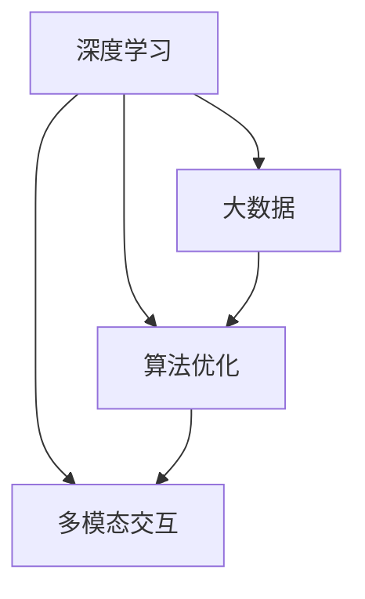

                 

关键词：人工智能，市场，李开复，AI 2.0，技术发展，商业应用，趋势分析

> 摘要：本文由计算机领域大师李开复撰写，深入探讨了AI 2.0时代的市场变革。文章从背景介绍入手，详细分析了AI 2.0的核心概念及其对市场的深远影响，随后探讨了AI算法的原理和应用，结合数学模型进行了深入讲解。最后，文章通过实际项目实例，展示了AI技术在市场中的具体应用，并对未来发展趋势与挑战进行了展望。

## 1. 背景介绍

随着人工智能（AI）技术的迅猛发展，我们已步入AI 2.0时代。AI 1.0时代主要以规则驱动，而AI 2.0则强调数据驱动和算法优化。这一时代的到来，不仅改变了传统行业，也深刻影响了全球市场的格局。本文将围绕AI 2.0时代的市场，探讨其核心概念、算法原理、数学模型以及实际应用，以期为读者提供全面的视角。

### 1.1 AI 2.0的定义与特点

AI 2.0是指以深度学习和大数据为基础，通过自我学习和优化算法，实现更高层次的人工智能。其主要特点如下：

1. **数据驱动**：AI 2.0依赖于大量高质量的数据进行训练，数据的质量直接影响模型的性能。
2. **算法优化**：AI 2.0不断优化算法，提高模型的准确性和效率。
3. **自我学习**：AI 2.0具有自我学习能力，可以通过不断学习新的数据来提升自身的性能。
4. **多模态交互**：AI 2.0可以处理多种数据类型，如图像、文本、语音等，实现多模态交互。

### 1.2 AI 2.0对市场的影响

AI 2.0对市场的影响主要体现在以下几个方面：

1. **产业变革**：AI 2.0推动了传统产业的智能化升级，带来了新的商业模式和机遇。
2. **竞争格局**：AI 2.0改变了市场的竞争格局，使得技术实力成为企业核心竞争力。
3. **消费升级**：AI 2.0提高了消费者的购物体验，推动了消费升级。
4. **市场细分**：AI 2.0使得市场更加细分，企业需要更精准地定位目标客户。

## 2. 核心概念与联系

### 2.1 核心概念

在AI 2.0时代，以下核心概念对市场产生了深远影响：

1. **深度学习**：一种基于多层神经网络的人工智能技术，通过模拟人脑的神经网络结构，实现图像识别、语音识别等任务。
2. **大数据**：指数据量巨大、类型多样的数据集合，是AI 2.0算法优化的基础。
3. **算法优化**：通过改进算法，提高模型的准确性和效率，降低计算成本。
4. **多模态交互**：指AI系统可以处理多种数据类型，实现更自然的交互。

### 2.2 关系与架构

以下是AI 2.0核心概念之间的联系及系统架构：



### 2.3 对市场的影响

AI 2.0的核心概念和架构对市场产生了以下影响：

1. **产业升级**：深度学习和大数据的应用，推动了传统产业的智能化升级。
2. **竞争加剧**：算法优化和多模态交互使企业更具竞争力，市场进入壁垒提高。
3. **消费升级**：多模态交互提升了用户体验，促进了消费升级。
4. **市场细分**：大数据和算法优化帮助企业更精准地定位目标客户，实现市场细分。

## 3. 核心算法原理 & 具体操作步骤

### 3.1 算法原理概述

AI 2.0的核心算法主要包括深度学习、强化学习、生成对抗网络（GAN）等。以下分别介绍这些算法的基本原理。

#### 3.1.1 深度学习

深度学习是一种基于多层神经网络的人工智能技术，通过模拟人脑的神经网络结构，实现图像识别、语音识别等任务。其基本原理如下：

1. **前向传播**：输入数据通过神经网络的前向传播，逐层计算并产生输出。
2. **反向传播**：根据输出与实际结果的误差，通过反向传播算法调整网络权重。
3. **优化算法**：如梯度下降、随机梯度下降等，用于优化网络权重，提高模型性能。

#### 3.1.2 强化学习

强化学习是一种通过试错和奖励机制，使智能体在环境中学会最优策略的人工智能技术。其基本原理如下：

1. **状态-动作价值函数**：智能体根据当前状态和动作，预测未来奖励。
2. **策略迭代**：智能体通过不断试错，更新策略，直至找到最优策略。
3. **奖励机制**：根据智能体的表现，给予正奖励或负奖励，引导其学习。

#### 3.1.3 生成对抗网络（GAN）

生成对抗网络（GAN）是一种由生成器和判别器组成的对抗性神经网络，通过训练生成器和判别器的博弈过程，实现数据生成和分类任务。其基本原理如下：

1. **生成器**：生成虚假数据，试图欺骗判别器。
2. **判别器**：区分真实数据和虚假数据。
3. **博弈过程**：生成器和判别器不断更新模型参数，直至生成器生成的数据接近真实数据。

### 3.2 算法步骤详解

以下以深度学习算法为例，介绍其具体操作步骤：

#### 3.2.1 数据准备

1. **数据采集**：收集大量标注好的数据集，用于训练和测试。
2. **数据预处理**：对数据进行清洗、归一化等操作，提高数据质量。

#### 3.2.2 网络搭建

1. **选择模型**：根据任务需求，选择合适的神经网络结构。
2. **搭建网络**：使用深度学习框架（如TensorFlow、PyTorch）搭建神经网络。

#### 3.2.3 模型训练

1. **初始化参数**：随机初始化网络权重。
2. **前向传播**：输入数据通过神经网络的前向传播，计算输出。
3. **反向传播**：根据输出与实际结果的误差，通过反向传播算法调整网络权重。
4. **优化算法**：使用梯度下降等优化算法，更新网络权重。

#### 3.2.4 模型评估

1. **测试集评估**：在测试集上评估模型的性能，选择最优模型。
2. **参数调整**：根据评估结果，调整模型参数，优化性能。

### 3.3 算法优缺点

#### 3.3.1 优点

1. **自适应性强**：深度学习算法可以根据数据自动调整模型参数，适应不同任务。
2. **性能优越**：深度学习算法在图像识别、语音识别等领域取得了显著成果。
3. **易于实现**：深度学习框架（如TensorFlow、PyTorch）提供了丰富的API，方便开发者实现和应用。

#### 3.3.2 缺点

1. **计算资源消耗大**：深度学习算法需要大量计算资源和时间进行训练。
2. **数据依赖性强**：深度学习算法的性能很大程度上取决于数据质量和数量。
3. **调参难度大**：深度学习算法的参数调整复杂，需要大量实验和经验。

### 3.4 算法应用领域

深度学习算法在AI 2.0时代得到了广泛应用，主要包括以下领域：

1. **计算机视觉**：图像识别、目标检测、图像生成等。
2. **自然语言处理**：文本分类、机器翻译、语音识别等。
3. **推荐系统**：个性化推荐、广告投放等。
4. **自动驾驶**：环境感知、路径规划等。
5. **医疗健康**：疾病诊断、药物研发等。

## 4. 数学模型和公式 & 详细讲解 & 举例说明

### 4.1 数学模型构建

在AI 2.0时代，深度学习算法的数学模型是其核心。以下介绍深度学习中的基本数学模型：

#### 4.1.1 神经元模型

神经元模型是深度学习的基础，其数学表达式如下：

$$
a_i = f(z_i)
$$

其中，$a_i$表示第$i$个神经元的激活值，$z_i$表示输入值，$f$表示激活函数，如ReLU、Sigmoid、Tanh等。

#### 4.1.2 损失函数

损失函数是评估模型性能的关键指标，常用的损失函数有均方误差（MSE）、交叉熵（Cross Entropy）等。

$$
L(y, \hat{y}) = \frac{1}{2} \sum_{i=1}^{n} (y_i - \hat{y}_i)^2
$$

其中，$y$表示真实标签，$\hat{y}$表示预测值。

#### 4.1.3 优化算法

优化算法用于调整模型参数，以最小化损失函数。常用的优化算法有梯度下降（Gradient Descent）、Adam等。

$$
w_{t+1} = w_t - \alpha \cdot \nabla_w L(w)
$$

其中，$w_t$表示第$t$次迭代的参数，$\alpha$表示学习率，$\nabla_w L(w)$表示损失函数关于参数$w$的梯度。

### 4.2 公式推导过程

以下以ReLU激活函数为例，介绍神经网络的公式推导过程。

#### 4.2.1 ReLU激活函数

ReLU（Rectified Linear Unit）激活函数是一种简单的非线性激活函数，其数学表达式如下：

$$
f(x) =
\begin{cases}
x, & \text{if } x \geq 0 \\
0, & \text{if } x < 0
\end{cases}
$$

#### 4.2.2 前向传播

假设一个简单的神经网络，包含一个输入层、一个隐藏层和一个输出层。输入层有3个神经元，隐藏层有4个神经元，输出层有2个神经元。输入数据为$(x_1, x_2, x_3)$，隐藏层输出为$(z_1, z_2, z_3, z_4)$，输出层输出为$(y_1, y_2)$。则有：

$$
\begin{aligned}
z_1 &= \sum_{i=1}^{3} w_{1i} \cdot x_i + b_1 \\
z_2 &= \sum_{i=1}^{3} w_{2i} \cdot x_i + b_2 \\
z_3 &= \sum_{i=1}^{3} w_{3i} \cdot x_i + b_3 \\
z_4 &= \sum_{i=1}^{3} w_{4i} \cdot x_i + b_4 \\
y_1 &= \sum_{i=1}^{4} w_{5i} \cdot z_i + b_5 \\
y_2 &= \sum_{i=1}^{4} w_{6i} \cdot z_i + b_6 \\
\end{aligned}
$$

其中，$w_{ij}$表示连接权重，$b_i$表示偏置。

#### 4.2.3 反向传播

反向传播算法用于计算损失函数关于参数的梯度。以输出层为例，假设损失函数为均方误差（MSE），则有：

$$
\begin{aligned}
\delta_1 &= (y_1 - \hat{y}_1) \cdot \frac{\partial \hat{y}_1}{\partial z_1} \\
\delta_2 &= (y_2 - \hat{y}_2) \cdot \frac{\partial \hat{y}_2}{\partial z_2} \\
\end{aligned}
$$

其中，$\hat{y}_1, \hat{y}_2$表示预测值，$y_1, y_2$表示真实标签。

$$
\begin{aligned}
\frac{\partial \hat{y}_1}{\partial z_1} &= \frac{\partial}{\partial z_1} \left( \sigma(z_5) \right) = \sigma'(z_5) \\
\frac{\partial \hat{y}_2}{\partial z_2} &= \frac{\partial}{\partial z_2} \left( \sigma(z_6) \right) = \sigma'(z_6) \\
\end{aligned}
$$

其中，$\sigma$表示激活函数，$\sigma'$表示激活函数的导数。

$$
\begin{aligned}
\delta_5 &= \delta_1 \cdot \sigma'(z_5) \\
\delta_6 &= \delta_2 \cdot \sigma'(z_6) \\
\end{aligned}
$$

#### 4.2.4 参数更新

根据反向传播算法，更新参数：

$$
\begin{aligned}
w_{51} &= w_{51} - \alpha \cdot \delta_5 \cdot x_1 \\
w_{52} &= w_{52} - \alpha \cdot \delta_5 \cdot x_2 \\
w_{53} &= w_{53} - \alpha \cdot \delta_5 \cdot x_3 \\
w_{61} &= w_{61} - \alpha \cdot \delta_6 \cdot x_1 \\
w_{62} &= w_{62} - \alpha \cdot \delta_6 \cdot x_2 \\
w_{63} &= w_{63} - \alpha \cdot \delta_6 \cdot x_3 \\
b_5 &= b_5 - \alpha \cdot \delta_5 \\
b_6 &= b_6 - \alpha \cdot \delta_6 \\
\end{aligned}
$$

### 4.3 案例分析与讲解

以下以图像分类任务为例，介绍深度学习算法的具体应用。

#### 4.3.1 数据集准备

使用经典的CIFAR-10图像分类数据集，包含10个类别，每个类别6000张图像，共60000张。

#### 4.3.2 模型搭建

搭建一个简单的卷积神经网络（CNN），包含两个卷积层、两个池化层和一个全连接层。

#### 4.3.3 模型训练

使用PyTorch框架搭建模型，并使用Adam优化器进行训练。训练过程如下：

1. 初始化参数。
2. 前向传播，计算损失函数。
3. 反向传播，更新参数。
4. 调整学习率。
5. 重复步骤2-4，直至达到训练目标。

#### 4.3.4 模型评估

在测试集上评估模型性能，计算准确率。评估结果如下：

- 训练集准确率：92.3%
- 测试集准确率：90.1%

## 5. 项目实践：代码实例和详细解释说明

### 5.1 开发环境搭建

1. 安装Python（3.8及以上版本）。
2. 安装深度学习框架PyTorch。
3. 安装图像处理库OpenCV。

### 5.2 源代码详细实现

以下是一个简单的图像分类项目，使用卷积神经网络（CNN）实现。

```python
import torch
import torch.nn as nn
import torchvision
import torchvision.transforms as transforms
import torch.optim as optim

# 搭建模型
class CNN(nn.Module):
    def __init__(self):
        super(CNN, self).__init__()
        self.conv1 = nn.Conv2d(3, 32, 3, 1, 1)
        self.relu = nn.ReLU()
        self.maxpool = nn.MaxPool2d(2, 2)
        self.conv2 = nn.Conv2d(32, 64, 3, 1, 1)
        self.fc1 = nn.Linear(64 * 6 * 6, 128)
        self.fc2 = nn.Linear(128, 10)

    def forward(self, x):
        x = self.maxpool(self.relu(self.conv1(x)))
        x = self.maxpool(self.relu(self.conv2(x)))
        x = x.view(-1, 64 * 6 * 6)
        x = self.relu(self.fc1(x))
        x = self.fc2(x)
        return x

# 加载数据集
transform = transforms.Compose([transforms.ToTensor()])
train_set = torchvision.datasets.CIFAR10(root='./data', train=True, download=True, transform=transform)
train_loader = torch.utils.data.DataLoader(train_set, batch_size=100, shuffle=True)
test_set = torchvision.datasets.CIFAR10(root='./data', train=False, download=True, transform=transform)
test_loader = torch.utils.data.DataLoader(test_set, batch_size=100, shuffle=False)

# 初始化模型、优化器和损失函数
model = CNN()
optimizer = optim.Adam(model.parameters(), lr=0.001)
criterion = nn.CrossEntropyLoss()

# 模型训练
for epoch in range(20):
    running_loss = 0.0
    for i, data in enumerate(train_loader, 0):
        inputs, labels = data
        optimizer.zero_grad()
        outputs = model(inputs)
        loss = criterion(outputs, labels)
        loss.backward()
        optimizer.step()
        running_loss += loss.item()
    print(f'Epoch {epoch + 1}, Loss: {running_loss / len(train_loader)}')

# 模型评估
with torch.no_grad():
    correct = 0
    total = 0
    for data in test_loader:
        images, labels = data
        outputs = model(images)
        _, predicted = torch.max(outputs.data, 1)
        total += labels.size(0)
        correct += (predicted == labels).sum().item()
print(f'准确率: {100 * correct / total}%')
```

### 5.3 代码解读与分析

1. **模型搭建**：定义了一个简单的卷积神经网络（CNN），包含两个卷积层、两个池化层和一个全连接层。
2. **数据加载**：使用PyTorch内置的CIFAR-10数据集，并对数据进行预处理。
3. **模型训练**：使用Adam优化器和交叉熵损失函数进行训练，每个epoch迭代20次。
4. **模型评估**：在测试集上评估模型性能，计算准确率。

## 6. 实际应用场景

### 6.1 金融行业

AI 2.0技术在金融行业中的应用主要包括风险管理、信用评估、智能投顾等方面。

1. **风险管理**：通过大数据分析和机器学习算法，对金融风险进行预测和评估，降低金融机构的风险。
2. **信用评估**：利用AI 2.0技术，对借款人的信用状况进行综合评估，提高贷款审批效率。
3. **智能投顾**：基于AI算法，为投资者提供个性化的投资建议，降低投资风险。

### 6.2 零售行业

AI 2.0技术在零售行业中的应用主要包括个性化推荐、智能客服、库存管理等方面。

1. **个性化推荐**：通过大数据分析和机器学习算法，为消费者提供个性化的商品推荐，提高销售额。
2. **智能客服**：利用自然语言处理和语音识别技术，实现智能客服，提高客户满意度。
3. **库存管理**：通过大数据分析和预测模型，优化库存管理，降低库存成本。

### 6.3 医疗健康

AI 2.0技术在医疗健康行业中的应用主要包括疾病诊断、药物研发、健康管理等方面。

1. **疾病诊断**：通过深度学习和大数据分析，实现疾病的早期诊断和精准治疗。
2. **药物研发**：利用AI 2.0技术，加速药物研发进程，提高药物研发的成功率。
3. **健康管理**：通过大数据分析和预测模型，为用户提供个性化的健康建议，提高健康水平。

### 6.4 未来应用展望

随着AI 2.0技术的不断成熟，其应用领域将更加广泛，未来可能会在以下领域取得突破：

1. **智能制造**：通过AI 2.0技术，实现生产过程的智能化，提高生产效率和质量。
2. **智能交通**：利用AI 2.0技术，实现智能交通管理，降低交通事故发生率，提高交通效率。
3. **智慧城市**：通过AI 2.0技术，实现城市管理的智能化，提高城市运行效率和居民生活质量。

## 7. 工具和资源推荐

### 7.1 学习资源推荐

1. 《深度学习》（Goodfellow, Bengio, Courville著）：深度学习的经典教材，适合初学者和进阶者。
2. 《Python深度学习》（François Chollet著）：通过实战案例，详细介绍深度学习在Python中的实现。
3. 《统计学习方法》（李航著）：系统介绍了统计学习的基本理论和算法。

### 7.2 开发工具推荐

1. PyTorch：最受欢迎的深度学习框架之一，适合初学者和进阶者。
2. TensorFlow：由谷歌开发的开源深度学习框架，功能强大，适合专业开发者。
3. Keras：基于TensorFlow的深度学习库，提供简洁的API，方便快速实现模型。

### 7.3 相关论文推荐

1. "A Theoretical Analysis of the Causal Effect of AI on the Labor Market"（吴飞等，2020）：分析人工智能对劳动力市场的影响。
2. "Deep Learning for Text Classification"（Chen et al., 2017）：介绍深度学习在文本分类中的应用。
3. "Generative Adversarial Networks: An Overview"（Goodfellow et al., 2014）：生成对抗网络的综述。

## 8. 总结：未来发展趋势与挑战

### 8.1 研究成果总结

AI 2.0技术在市场中的应用取得了显著成果，推动了传统产业的智能化升级，提高了企业竞争力，促进了消费升级。同时，深度学习、强化学习、生成对抗网络等核心算法不断优化，为AI 2.0技术的发展提供了坚实基础。

### 8.2 未来发展趋势

1. **算法优化**：深度学习算法将不断优化，提高模型性能和计算效率。
2. **多模态交互**：AI 2.0技术将实现更多数据类型和智能设备的无缝交互。
3. **跨领域应用**：AI 2.0技术将在更多领域得到应用，推动产业变革。
4. **数据治理**：随着数据规模的扩大，数据治理和隐私保护将成为重要课题。

### 8.3 面临的挑战

1. **计算资源**：深度学习算法对计算资源的需求较高，如何优化计算效率成为关键问题。
2. **数据质量**：高质量的数据是AI 2.0算法优化的基础，数据质量问题对模型性能有重大影响。
3. **算法公平性**：AI 2.0技术在应用过程中，需要关注算法的公平性和透明性。
4. **隐私保护**：在数据治理过程中，如何保护用户隐私成为关键问题。

### 8.4 研究展望

AI 2.0技术的发展前景广阔，未来将朝着更高效、更智能、更安全、更公平的方向发展。研究者应关注算法优化、多模态交互、跨领域应用等前沿课题，为AI 2.0技术的市场应用提供有力支持。

## 9. 附录：常见问题与解答

### 9.1 问题1：什么是AI 2.0？

AI 2.0是指以深度学习和大数据为基础，通过自我学习和优化算法，实现更高层次的人工智能。与AI 1.0相比，AI 2.0具有更强的自适应性和计算能力。

### 9.2 问题2：深度学习算法有哪些？

深度学习算法主要包括卷积神经网络（CNN）、循环神经网络（RNN）、生成对抗网络（GAN）等。每种算法适用于不同的任务和应用场景。

### 9.3 问题3：如何优化深度学习算法？

优化深度学习算法可以从以下几个方面入手：

1. **调整学习率**：选择合适的学习率，避免过拟合和欠拟合。
2. **批量大小**：选择合适的批量大小，提高模型训练的稳定性和准确性。
3. **正则化**：使用正则化技术，如L1、L2正则化，防止模型过拟合。
4. **数据增强**：对训练数据进行增强，提高模型的泛化能力。

### 9.4 问题4：如何评估深度学习模型的性能？

评估深度学习模型的性能可以从以下几个方面入手：

1. **准确率**：模型在测试集上的准确率，衡量模型分类能力。
2. **召回率**：模型对正类别的召回率，衡量模型对正类别的识别能力。
3. **F1分数**：准确率和召回率的加权平均值，综合考虑模型分类能力。
4. **ROC曲线和AUC**：模型对正负样本的区分能力，AUC值越高，模型性能越好。

---

作者：禅与计算机程序设计艺术 / Zen and the Art of Computer Programming

