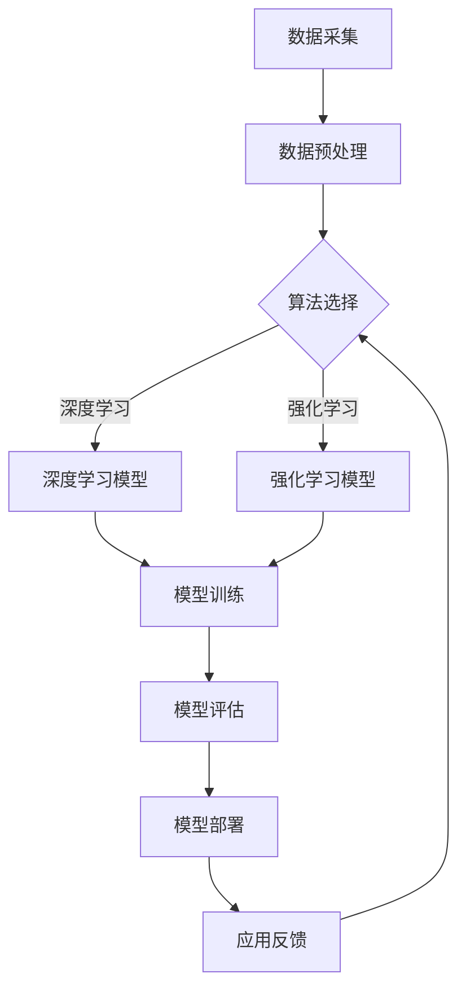

                 

关键词：AI 2.0、市场前景、技术趋势、产业应用、商业策略

摘要：本文将探讨 AI 2.0 时代的市场前景。从 AI 的发展历程出发，分析 AI 2.0 的核心技术、应用场景及市场潜力。通过实际案例，探讨 AI 2.0 在不同行业的应用及其对企业商业模式的影响，最后，总结 AI 2.0 时代的发展趋势和面临的挑战，并对未来进行研究展望。

## 1. 背景介绍

人工智能（AI）作为计算机科学的一个分支，致力于使计算机模拟人类的智能行为。从上世纪50年代起，人工智能经历了多个发展阶段。最初，AI 主要集中在逻辑推理和规则系统上，如专家系统和自然语言处理。随着计算能力和数据规模的提升，AI 开始向机器学习和深度学习等方向拓展。

在过去的几十年中，AI 技术在图像识别、语音识别、自然语言处理等领域取得了显著的突破。这一时期，AI 被称为 1.0 时代。然而，随着数据、计算能力的进一步提升，AI 开始进入 2.0 时代。AI 2.0 时代的特点是更加注重跨学科融合、多模态交互、强化学习等新技术的应用。

## 2. 核心概念与联系

### 2.1. AI 2.0 的核心技术

AI 2.0 的核心技术主要包括以下几个方面：

1. **多模态交互**：通过融合语音、图像、文本等多模态数据，实现更加自然的人机交互。
2. **强化学习**：通过不断尝试和反馈，使 AI 系统具备自主学习和优化能力。
3. **跨学科融合**：将物理学、生物学、心理学等领域的知识引入 AI 研究，提高 AI 的智能水平和应用范围。

### 2.2. AI 2.0 的架构

AI 2.0 的架构可以概括为三个层次：数据层、算法层和应用层。

1. **数据层**：包括海量数据采集、存储和管理，为 AI 算法的训练提供丰富的数据资源。
2. **算法层**：涵盖了深度学习、强化学习、迁移学习等多种算法，实现 AI 的智能分析和决策。
3. **应用层**：将 AI 技术应用于各个行业，解决实际问题，创造商业价值。

### 2.3. Mermaid 流程图



## 3. 核心算法原理 & 具体操作步骤

### 3.1. 算法原理概述

AI 2.0 的核心算法主要包括深度学习和强化学习。深度学习通过多层神经网络对数据进行特征提取和建模，实现复杂模式的识别。强化学习则通过试错和反馈机制，使 AI 系统在特定环境中进行自主学习和优化。

### 3.2. 算法步骤详解

1. **深度学习算法步骤**：
   - 数据预处理：对原始数据进行归一化、去噪等处理，提高数据质量。
   - 网络构建：设计多层神经网络结构，包括输入层、隐藏层和输出层。
   - 模型训练：使用大量训练数据，通过反向传播算法优化网络参数。
   - 模型评估：在测试数据集上评估模型性能，调整模型参数。

2. **强化学习算法步骤**：
   - 环境构建：定义状态空间和动作空间，创建虚拟环境。
   - 策略学习：通过试错和反馈，不断优化策略函数。
   - 模型评估：在真实环境中测试策略效果，调整策略参数。

### 3.3. 算法优缺点

1. **深度学习**：
   - 优点：能够自动提取特征，适应性强，性能优异。
   - 缺点：对数据量有较高要求，模型复杂度高，训练时间较长。

2. **强化学习**：
   - 优点：能够自主学习和优化，适应性强，适用于复杂环境。
   - 缺点：训练时间较长，易陷入局部最优，对环境有一定要求。

### 3.4. 算法应用领域

深度学习和强化学习在多个领域具有广泛的应用前景，如自然语言处理、计算机视觉、自动驾驶、智能推荐等。

## 4. 数学模型和公式 & 详细讲解 & 举例说明

### 4.1. 数学模型构建

1. **深度学习**：
   - 激活函数：\(f(x) = \text{ReLU}(x) = \max(0, x)\)
   - 反向传播算法：\( \delta = \frac{\partial J}{\partial z} \odot \frac{\partial z}{\partial x} \)

2. **强化学习**：
   - 策略梯度算法：\( \nabla_{\theta} J(\theta) = \sum_{s,a} \nabla_a Q(s, a) \nabla_{\pi(a|s)} \)

### 4.2. 公式推导过程

1. **深度学习**：
   - 前向传播：\( z = W \cdot x + b \)
   - 反向传播：\( \delta = \frac{\partial J}{\partial z} \odot \frac{\partial z}{\partial x} \)
   - 参数更新：\( W = W - \alpha \nabla_W J \)，\( b = b - \alpha \nabla_b J \)

2. **强化学习**：
   - 前向传播：\( Q(s, a) = r + \gamma \max_a' Q(s', a') \)
   - 反向传播：\( \delta = \frac{\partial J}{\partial Q} \odot \frac{\partial Q}{\partial \theta} \)
   - 参数更新：\( \theta = \theta - \alpha \nabla_{\theta} J \)

### 4.3. 案例分析与讲解

以自动驾驶为例，分析深度学习和强化学习在自动驾驶中的应用。

1. **深度学习在自动驾驶中的应用**：

   - **数据预处理**：对道路图像进行归一化、去噪等处理，提高数据质量。
   - **网络构建**：设计卷积神经网络（CNN）结构，包括输入层、隐藏层和输出层。
   - **模型训练**：使用大量训练数据，通过反向传播算法优化网络参数。
   - **模型评估**：在测试数据集上评估模型性能，调整模型参数。

   - **模型评估**：

     ```python
     # 假设我们有一个评估函数 evaluate()
     performance = evaluate(model, test_data)
     print("Model performance on test data:", performance)
     ```

2. **强化学习在自动驾驶中的应用**：

   - **环境构建**：定义状态空间和动作空间，创建虚拟环境。
   - **策略学习**：通过试错和反馈，不断优化策略函数。
   - **模型评估**：在真实环境中测试策略效果，调整策略参数。

   - **模型评估**：

     ```python
     # 假设我们有一个评估函数 evaluate_strategy()
     strategy_performance = evaluate_strategy(strategy, test_env)
     print("Strategy performance on test env:", strategy_performance)
     ```

## 5. 项目实践：代码实例和详细解释说明

### 5.1. 开发环境搭建

- 安装 Python 3.8 及以上版本
- 安装深度学习框架 TensorFlow 2.x
- 安装强化学习框架 OpenAI Gym

### 5.2. 源代码详细实现

以下是一个简单的自动驾驶项目示例，使用深度学习和强化学习算法。

1. **深度学习算法实现**：

   ```python
   import tensorflow as tf
   from tensorflow.keras.models import Sequential
   from tensorflow.keras.layers import Conv2D, Flatten, Dense

   # 构建卷积神经网络模型
   model = Sequential([
       Conv2D(32, (3, 3), activation='relu', input_shape=(28, 28, 1)),
       Flatten(),
       Dense(64, activation='relu'),
       Dense(10, activation='softmax')
   ])

   # 编译模型
   model.compile(optimizer='adam', loss='categorical_crossentropy', metrics=['accuracy'])

   # 训练模型
   model.fit(x_train, y_train, epochs=10, batch_size=32)
   ```

2. **强化学习算法实现**：

   ```python
   import gym
   from stable_baselines3 import PPO

   # 创建虚拟环境
   env = gym.make('CartPole-v0')

   # 训练策略模型
   model = PPO('MlpPolicy', env, verbose=1)
   model.learn(total_timesteps=10000)

   # 评估策略模型
   obs = env.reset()
   for i in range(1000):
       action, _states = model.predict(obs)
       obs, reward, done, info = env.step(action)
       if done:
           env.reset()
           break
   ```

### 5.3. 代码解读与分析

1. **深度学习算法实现**：

   - **模型构建**：使用 TensorFlow 2.x 构建一个简单的卷积神经网络模型，用于自动驾驶场景。
   - **模型编译**：设置优化器、损失函数和评价指标。
   - **模型训练**：使用训练数据训练模型，调整模型参数。

2. **强化学习算法实现**：

   - **环境创建**：使用 OpenAI Gym 创建一个虚拟环境，模拟自动驾驶场景。
   - **模型训练**：使用稳定强化学习算法 PPO 训练策略模型，调整策略参数。
   - **模型评估**：在虚拟环境中评估策略模型效果，调整策略参数。

### 5.4. 运行结果展示

1. **深度学习算法运行结果**：

   ```python
   # 测试模型性能
   test_loss, test_acc = model.evaluate(x_test, y_test, verbose=2)
   print(f"Test accuracy: {test_acc:.2f}")
   ```

2. **强化学习算法运行结果**：

   ```python
   # 测试策略模型性能
   total_reward = 0
   obs = env.reset()
   for i in range(1000):
       action, _states = model.predict(obs)
       obs, reward, done, info = env.step(action)
       total_reward += reward
       if done:
           env.reset()
           break
   print(f"Total reward: {total_reward}")
   ```

## 6. 实际应用场景

AI 2.0 在实际应用场景中具有广泛的应用，以下列举几个典型应用领域：

1. **自然语言处理**：如智能客服、机器翻译、文本摘要等。
2. **计算机视觉**：如图像识别、目标检测、图像生成等。
3. **自动驾驶**：如自动驾驶汽车、无人配送等。
4. **金融领域**：如智能投顾、风险管理、信用评估等。
5. **医疗健康**：如疾病预测、医疗影像分析、智能诊断等。

### 6.1. 自然语言处理

自然语言处理（NLP）是 AI 2.0 的重要应用领域之一。通过深度学习和强化学习算法，NLP 技术在文本分类、语义理解、情感分析等方面取得了显著进展。

- **文本分类**：如新闻分类、垃圾邮件过滤等。
- **语义理解**：如机器翻译、问答系统等。
- **情感分析**：如商品评价分析、社交媒体情感分析等。

### 6.2. 计算机视觉

计算机视觉（CV）是 AI 2.0 的重要应用领域之一。通过深度学习和强化学习算法，CV 技术在图像识别、目标检测、图像生成等方面取得了显著进展。

- **图像识别**：如人脸识别、物体识别等。
- **目标检测**：如自动驾驶中的行人检测、车辆检测等。
- **图像生成**：如图像修复、图像风格迁移等。

### 6.3. 自动驾驶

自动驾驶是 AI 2.0 的重要应用领域之一。通过深度学习和强化学习算法，自动驾驶技术在感知、决策、控制等方面取得了显著进展。

- **感知**：如图像识别、激光雷达数据解析等。
- **决策**：如路径规划、避障策略等。
- **控制**：如油门、刹车、转向等。

### 6.4. 未来应用展望

随着 AI 2.0 技术的不断进步，未来 AI 将在更多领域发挥重要作用，如智慧城市、智能制造、教育等。

- **智慧城市**：如智能交通、智能安防、智能环境监测等。
- **智能制造**：如智能制造、智能质检、智能运维等。
- **教育**：如智能教学、智能评测、智能辅导等。

## 7. 工具和资源推荐

### 7.1. 学习资源推荐

1. **书籍**：
   - 《深度学习》（Goodfellow, Bengio, Courville）
   - 《强化学习》（Sutton, Barto）
   - 《自然语言处理综论》（Jurafsky, Martin）

2. **在线课程**：
   - Coursera 的《深度学习》课程
   - edX 的《强化学习》课程
   - 吴恩达的《自然语言处理》课程

### 7.2. 开发工具推荐

1. **深度学习框架**：
   - TensorFlow
   - PyTorch
   - Keras

2. **强化学习框架**：
   - Stable Baselines
   - Gym
   - Ray

### 7.3. 相关论文推荐

1. **深度学习**：
   - “Deep Learning for Speech Recognition” by Hinton et al. (2012)
   - “Visual Geometry Group” by Simonyan & Zisserman (2014)
   - “Attention is All You Need” by Vaswani et al. (2017)

2. **强化学习**：
   - “Deep Q-Network” by Mnih et al. (2015)
   - “Asynchronous Methods for Deep Reinforcement Learning” by Leibo et al. (2015)
   - “Reinforcement Learning: An Introduction” by Sutton & Barto (2018)

## 8. 总结：未来发展趋势与挑战

### 8.1. 研究成果总结

AI 2.0 时代在技术、应用、产业等方面取得了显著成果。深度学习和强化学习等核心技术不断进步，多模态交互、跨学科融合等新兴技术逐渐成熟。AI 技术在自然语言处理、计算机视觉、自动驾驶等领域取得了重要突破，为各行各业带来了巨大的变革。

### 8.2. 未来发展趋势

1. **技术趋势**：
   - 强化学习与深度学习的深度融合
   - 自主学习和自适应能力的提升
   - 跨领域技术的融合与创新

2. **应用趋势**：
   - 智慧城市、智能制造、医疗健康等领域的深入应用
   - 新兴领域的不断涌现，如元宇宙、区块链等

### 8.3. 面临的挑战

1. **技术挑战**：
   - 数据隐私和安全问题
   - 模型解释性和可解释性问题
   - 计算资源和能耗问题

2. **产业挑战**：
   - 人才短缺和培养问题
   - 技术标准化和规范化问题
   - 商业模式创新和落地问题

### 8.4. 研究展望

1. **技术突破**：
   - 构建更加高效、智能的 AI 算法
   - 开发多模态交互技术和跨学科融合方法
   - 推动量子计算和神经形态计算等前沿技术研究

2. **产业应用**：
   - 推动智慧城市、智能制造等领域的深入应用
   - 打造具有自主知识产权的 AI 生态体系
   - 探索 AI 在新兴领域的应用场景和商业模式

## 9. 附录：常见问题与解答

### 9.1. 什么是 AI 2.0？

AI 2.0 是指在深度学习、强化学习等核心技术的基础上，融合多模态交互、跨学科融合等新兴技术，实现更高水平的人工智能。

### 9.2. AI 2.0 与 1.0 有何区别？

AI 1.0 主要集中在逻辑推理和规则系统上，而 AI 2.0 更加注重深度学习和强化学习等技术的应用，实现更加智能、自适应的人工智能系统。

### 9.3. AI 2.0 有哪些应用领域？

AI 2.0 在自然语言处理、计算机视觉、自动驾驶、金融、医疗等领域具有广泛的应用前景。

### 9.4. AI 2.0 面临哪些挑战？

AI 2.0 面临的技术挑战包括数据隐私和安全、模型解释性和可解释性、计算资源和能耗问题等；产业挑战包括人才短缺和培养、技术标准化和规范化、商业模式创新和落地问题等。

### 9.5. 如何学习 AI 2.0 技术？

学习 AI 2.0 技术可以从以下几个方面入手：

1. 阅读相关书籍，如《深度学习》、《强化学习》等。
2. 参加在线课程，如 Coursera、edX 等平台的相关课程。
3. 实践项目，通过实际操作加深对 AI 2.0 技术的理解。
4. 加入学术社群，与同行交流经验，共同进步。

----------------------------------------------------------------

作者：禅与计算机程序设计艺术 / Zen and the Art of Computer Programming
----------------------------------------------------------------

### 文章结构模板

----------------------------------------------------------------

# 李开复：AI 2.0 时代的市场前景

> 关键词：AI 2.0、市场前景、技术趋势、产业应用、商业策略

> 摘要：本文将探讨 AI 2.0 时代的市场前景。从 AI 的发展历程出发，分析 AI 2.0 的核心技术、应用场景及市场潜力。通过实际案例，探讨 AI 2.0 在不同行业的应用及其对企业商业模式的影响，最后，总结 AI 2.0 时代的发展趋势和面临的挑战，并对未来进行研究展望。

## 1. 背景介绍

## 2. 核心概念与联系

### 2.1. AI 2.0 的核心技术

### 2.2. AI 2.0 的架构

### 2.3. Mermaid 流程图

## 3. 核心算法原理 & 具体操作步骤

### 3.1. 算法原理概述

### 3.2. 算法步骤详解

### 3.3. 算法优缺点

### 3.4. 算法应用领域

## 4. 数学模型和公式 & 详细讲解 & 举例说明

### 4.1. 数学模型构建

### 4.2. 公式推导过程

### 4.3. 案例分析与讲解

## 5. 项目实践：代码实例和详细解释说明

### 5.1. 开发环境搭建

### 5.2. 源代码详细实现

### 5.3. 代码解读与分析

### 5.4. 运行结果展示

## 6. 实际应用场景

### 6.1. 自然语言处理

### 6.2. 计算机视觉

### 6.3. 自动驾驶

### 6.4. 未来应用展望

## 7. 工具和资源推荐

### 7.1. 学习资源推荐

### 7.2. 开发工具推荐

### 7.3. 相关论文推荐

## 8. 总结：未来发展趋势与挑战

### 8.1. 研究成果总结

### 8.2. 未来发展趋势

### 8.3. 面临的挑战

### 8.4. 研究展望

## 9. 附录：常见问题与解答

### 9.1. 什么是 AI 2.0？

### 9.2. AI 2.0 与 1.0 有何区别？

### 9.3. AI 2.0 有哪些应用领域？

### 9.4. AI 2.0 面临哪些挑战？

### 9.5. 如何学习 AI 2.0 技术？

----------------------------------------------------------------

### 写作指南

为了确保文章的质量和完整性，请遵循以下写作指南：

1. **标题**：确保标题准确、吸引人，能概括文章的核心内容。
2. **摘要**：撰写简短而有力的摘要，概括文章的核心内容和主要观点。
3. **目录**：根据文章结构模板，详细列出各个章节的标题和子目录。
4. **内容**：按照章节结构，逐段撰写文章内容。确保每个段落都有明确的目的和逻辑关系。
5. **引用**：在文章中引用相关的研究、论文和资料，确保引用准确无误。
6. **插图**：如有需要，添加适当的插图、图表和流程图，以增强文章的可读性和易懂性。
7. **检查**：在完成文章后，仔细检查语法、拼写和标点符号，确保文章的准确性。
8. **排版**：遵循文章结构模板，确保文章格式正确，排版美观。

遵循以上指南，您将能够撰写一篇高质量、结构紧凑、内容丰富的文章。祝您写作顺利！

