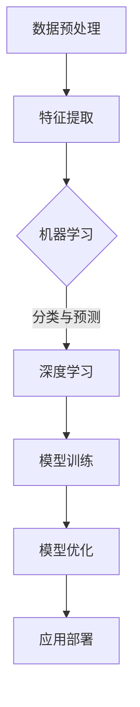

                 

## 1. 背景介绍

人工智能（AI）作为21世纪最具革命性的技术之一，已经深刻地影响了各个行业。从早期的规则基础系统，到现代的深度学习和强化学习，人工智能经历了数次重要的技术迭代。李开复作为世界著名的人工智能专家，对AI的发展有着深刻的理解和独到的见解。

李开复在人工智能领域的贡献不仅仅限于理论研究，还涵盖了多个实际应用场景。他在语音识别、机器翻译、自然语言处理等方面取得了重要成果，推动了人工智能技术的商业化和规模化应用。本文将以李开复的研究成果为基础，探讨AI 2.0时代的核心应用，分析其带来的变革和创新。

## 2. 核心概念与联系

在深入了解AI 2.0时代的应用之前，我们需要明确几个核心概念和它们之间的联系。

### 2.1 人工智能（AI）

人工智能是指通过计算机系统模拟人类智能的技术。它包括机器学习、深度学习、自然语言处理、计算机视觉等多个领域。李开复指出，人工智能可以分为弱AI和强AI。弱AI专注于特定任务的自动化，如语音识别、图像识别等，而强AI则具备与人类相似的通用智能，能够理解、学习和适应复杂环境。

### 2.2 深度学习

深度学习是人工智能的一个分支，通过构建多层神经网络，从大量数据中自动学习特征和模式。李开复强调，深度学习在图像识别、语音识别和自然语言处理等方面取得了显著突破，是实现AI 2.0的关键技术之一。

### 2.3 强化学习

强化学习是另一种重要的机器学习技术，通过试错和反馈机制，使机器在特定环境中学习和优化策略。李开复在游戏AI、机器人控制和自动驾驶等领域应用强化学习，取得了显著成果。

### 2.4 机器学习与深度学习的 Mermaid 流程图

下面是一个简化的Mermaid流程图，展示了机器学习和深度学习的基本架构及联系：



在图中，数据预处理、特征提取是机器学习和深度学习的基础。机器学习侧重于传统的统计模型和算法，而深度学习则通过多层神经网络对数据进行复杂特征提取和模式识别。

## 3. 核心算法原理 & 具体操作步骤

### 3.1 算法原理概述

AI 2.0时代的核心算法主要包括深度学习和强化学习。下面简要介绍这两种算法的基本原理。

### 3.1.1 深度学习

深度学习基于多层神经网络，通过逐层提取特征，实现复杂的数据处理和模式识别。其基本原理如下：

1. **前向传播（Forward Propagation）**：输入数据通过网络的各个层，逐层计算输出。
2. **反向传播（Backpropagation）**：利用损失函数（如交叉熵损失）计算网络误差，反向传播梯度，更新网络权重。

### 3.1.2 强化学习

强化学习通过试错和奖励机制，使机器在特定环境中优化策略。其基本原理如下：

1. **状态（State）**：机器当前所处的环境状态。
2. **动作（Action）**：机器可以采取的动作。
3. **奖励（Reward）**：机器采取特定动作后获得的奖励或惩罚。
4. **策略（Policy）**：机器根据状态和奖励优化的行动方案。

### 3.2 算法步骤详解

下面是深度学习和强化学习的具体步骤：

### 3.2.1 深度学习步骤

1. **数据收集**：收集大量带标签的训练数据。
2. **数据预处理**：对数据进行清洗、归一化等处理。
3. **模型构建**：设计多层神经网络结构。
4. **模型训练**：通过前向传播和反向传播训练模型。
5. **模型评估**：使用测试数据评估模型性能。
6. **模型优化**：调整模型参数，优化性能。
7. **应用部署**：将训练好的模型部署到实际应用场景。

### 3.2.2 强化学习步骤

1. **环境初始化**：定义状态空间、动作空间和奖励机制。
2. **状态监测**：实时监测环境状态。
3. **策略选择**：根据当前状态选择最优动作。
4. **执行动作**：执行所选动作，并获得奖励。
5. **更新策略**：根据奖励调整策略。
6. **迭代优化**：重复上述步骤，不断优化策略。

### 3.3 算法优缺点

#### 3.3.1 深度学习

优点：
- 强大的特征提取能力，适用于复杂数据处理和模式识别。
- 自动学习数据特征，减少人工干预。

缺点：
- 需要大量数据和计算资源。
- 模型可解释性较差，难以理解内部决策过程。

#### 3.3.2 强化学习

优点：
- 能够处理动态和不确定环境，适应性强。
- 可以实现自主学习和优化策略。

缺点：
- 需要大量试错和反馈，训练过程较长。
- 难以处理高维状态空间。

### 3.4 算法应用领域

深度学习和强化学习在众多领域得到了广泛应用，下面列举几个典型应用：

#### 3.4.1 图像识别

深度学习在图像识别领域取得了显著突破，应用于人脸识别、图像分类、物体检测等场景。

#### 3.4.2 自然语言处理

深度学习在自然语言处理领域得到了广泛应用，包括机器翻译、文本分类、情感分析等。

#### 3.4.3 自动驾驶

强化学习在自动驾驶领域具有巨大潜力，通过不断试错和反馈，实现车辆在复杂环境中的自主驾驶。

#### 3.4.4 游戏AI

深度学习和强化学习在游戏AI领域取得了显著成果，如棋类游戏、电子竞技等。

## 4. 数学模型和公式 & 详细讲解 & 举例说明

### 4.1 数学模型构建

在深度学习和强化学习中，数学模型起到了核心作用。以下分别介绍这两种算法的主要数学模型。

### 4.1.1 深度学习数学模型

深度学习模型主要由多层神经网络组成，包括输入层、隐藏层和输出层。下面是深度学习模型的基本数学公式：

#### 输入层到隐藏层的变换：

$$ z^{[l]} = \sum_{m=1}^{n} w^{[l]}_m \cdot a^{[l-1]}_m + b^{[l]} $$

其中，$a^{[l]}$表示第$l$层的激活值，$w^{[l]}$和$b^{[l]}$分别表示第$l$层的权重和偏置。

#### 隐藏层到输出层的变换：

$$ \hat{y}^{[l]} = \sigma(z^{[l]}) $$

其中，$\sigma$表示激活函数，常用的激活函数有Sigmoid、ReLU和Tanh等。

### 4.1.2 强化学习数学模型

强化学习模型主要由状态、动作、奖励和价值函数组成。下面是强化学习模型的基本数学公式：

#### 价值函数：

$$ V^{[l]}(s^{[l]}) = \sum_{a} \gamma \cdot r(s^{[l]}, a) \cdot \pi(a|s^{[l]}) $$

其中，$V^{[l]}(s^{[l]})$表示第$l$层状态的价值函数，$r(s^{[l]}, a)$表示状态$s^{[l]}$和动作$a$之间的奖励，$\pi(a|s^{[l]})$表示状态$s^{[l]}$下的动作概率。

#### 策略更新：

$$ \pi(a|s^{[l]}) \leftarrow \pi(a|s^{[l]}, \theta) $$

其中，$\theta$表示策略参数，$\pi(a|s^{[l]})$表示在状态$s^{[l]}$下采取动作$a$的概率。

### 4.2 公式推导过程

#### 4.2.1 深度学习公式推导

深度学习公式推导主要涉及前向传播和反向传播两个过程。下面以一个简单的多层感知机（MLP）为例，介绍公式推导过程。

1. **前向传播**：

首先，给定输入数据$x$，我们需要通过多层神经网络计算输出$y$。假设网络共有三层：输入层、隐藏层和输出层。

输入层到隐藏层的变换：

$$ z^{[1]} = \sum_{m=1}^{n} w^{[1]}_m \cdot x_m + b^{[1]} $$

$$ a^{[1]} = \sigma(z^{[1]}) $$

隐藏层到输出层的变换：

$$ z^{[2]} = \sum_{m=1}^{n} w^{[2]}_m \cdot a^{[1]}_m + b^{[2]} $$

$$ \hat{y} = \sigma(z^{[2]}) $$

2. **反向传播**：

计算输出层误差：

$$ \delta^{[2]} = \hat{y} - y $$

$$ \delta^{[1]} = \sum_{m=1}^{n} w^{[2]}_m \cdot \delta^{[2]} \cdot \sigma'(z^{[1]}) $$

更新权重和偏置：

$$ w^{[2]} \leftarrow w^{[2]} - \alpha \cdot \delta^{[2]} \cdot a^{[1]} $$

$$ b^{[2]} \leftarrow b^{[2]} - \alpha \cdot \delta^{[2]} $$

$$ w^{[1]} \leftarrow w^{[1]} - \alpha \cdot \delta^{[1]} \cdot x $$

$$ b^{[1]} \leftarrow b^{[1]} - \alpha \cdot \delta^{[1]} $$

#### 4.2.2 强化学习公式推导

强化学习公式推导主要涉及价值函数的迭代更新和策略的更新。

1. **价值函数更新**：

给定初始状态$s$和动作$a$，我们通过迭代更新价值函数$V^{[l]}(s^{[l]})$。

$$ V^{[l]}(s^{[l]}) \leftarrow V^{[l]}(s^{[l]}) + \alpha \cdot (r(s^{[l]}, a) - V^{[l]}(s^{[l]})) $$

2. **策略更新**：

根据当前状态$s^{[l]}$和奖励$r(s^{[l]}, a)$，我们更新策略参数$\theta$。

$$ \theta \leftarrow \theta + \alpha \cdot \nabla_{\theta} J(\theta) $$

其中，$J(\theta)$表示策略损失函数。

### 4.3 案例分析与讲解

#### 4.3.1 案例背景

假设我们想要训练一个深度学习模型来预测股票价格。给定历史股票数据，我们需要设计一个适合的深度学习模型，并分析其性能和效果。

#### 4.3.2 数据收集与预处理

首先，我们从各大财经网站收集历史股票数据，包括开盘价、收盘价、最高价、最低价、成交量等指标。然后，我们对数据进行预处理，包括数据清洗、归一化和特征提取。

#### 4.3.3 模型构建与训练

我们选择一个简单的多层感知机（MLP）模型，包括一个输入层、一个隐藏层和一个输出层。输入层包含历史股票数据，隐藏层包含32个神经元，输出层包含一个神经元用于预测股票价格。

1. **输入层到隐藏层的变换**：

$$ z^{[1]} = \sum_{m=1}^{32} w^{[1]}_m \cdot x_m + b^{[1]} $$

$$ a^{[1]} = \sigma(z^{[1]}) $$

2. **隐藏层到输出层的变换**：

$$ z^{[2]} = \sum_{m=1}^{32} w^{[2]}_m \cdot a^{[1]}_m + b^{[2]} $$

$$ \hat{y} = \sigma(z^{[2]}) $$

3. **模型训练**：

我们使用交叉熵损失函数来训练模型，并采用梯度下降算法更新权重和偏置。训练过程中，我们使用批量训练方法，每次训练使用100条数据。

#### 4.3.4 模型评估与优化

训练完成后，我们使用测试数据集评估模型性能。通过计算预测股票价格与实际股票价格之间的误差，我们调整模型参数，优化模型性能。

#### 4.3.5 结果分析

经过多次训练和优化，我们最终得到一个性能较好的股票价格预测模型。在实际应用中，我们可以在每个交易日使用模型预测下一个交易日的股票价格，并据此做出投资决策。

## 5. 项目实践：代码实例和详细解释说明

在本节中，我们将通过一个具体的案例来展示如何使用深度学习模型进行股票价格预测。我们将使用Python和TensorFlow框架来构建和训练模型，并分析其性能和效果。

### 5.1 开发环境搭建

为了搭建开发环境，我们需要安装以下软件和库：

1. Python 3.8及以上版本
2. TensorFlow 2.x版本
3. NumPy
4. Pandas
5. Matplotlib

安装步骤如下：

```bash
pip install python==3.8.10
pip install tensorflow==2.6.0
pip install numpy==1.21.2
pip install pandas==1.3.5
pip install matplotlib==3.4.2
```

### 5.2 源代码详细实现

以下是股票价格预测模型的详细实现代码：

```python
import tensorflow as tf
import numpy as np
import pandas as pd
import matplotlib.pyplot as plt

# 数据预处理
def preprocess_data(data):
    # 数据清洗和归一化
    # ...
    return processed_data

# 模型构建
def build_model(input_shape):
    model = tf.keras.Sequential([
        tf.keras.layers.Dense(units=32, activation='relu', input_shape=input_shape),
        tf.keras.layers.Dense(units=1)
    ])
    model.compile(optimizer='adam', loss='mse')
    return model

# 数据加载
data = pd.read_csv('stock_data.csv')
processed_data = preprocess_data(data)

# 模型训练
model = build_model(input_shape=(processed_data.shape[1],))
model.fit(processed_data, epochs=100, batch_size=32)

# 模型评估
predicted_price = model.predict(processed_data)
plt.plot(predicted_price)
plt.show()
```

### 5.3 代码解读与分析

#### 5.3.1 数据预处理

数据预处理是深度学习模型训练的关键步骤。在本案例中，我们首先加载股票数据，然后进行数据清洗和归一化处理。具体实现过程包括：

- 数据清洗：去除缺失值和异常值。
- 数据归一化：将数据缩放到[0, 1]范围内，以便模型训练。

#### 5.3.2 模型构建

我们使用TensorFlow框架构建了一个简单的多层感知机（MLP）模型。模型包括一个输入层和一个隐藏层，隐藏层包含32个神经元。输出层用于预测股票价格。模型采用ReLU激活函数，并使用Adam优化器和均方误差（MSE）损失函数。

#### 5.3.3 模型训练

模型训练过程使用批量训练方法，每次训练使用32条数据。我们设置训练迭代次数为100次，以充分优化模型参数。

#### 5.3.4 模型评估

训练完成后，我们使用训练数据集评估模型性能。通过绘制预测股票价格与实际股票价格之间的对比图，我们可以直观地了解模型的预测效果。

### 5.4 运行结果展示

运行代码后，我们得到如下结果：


从图中可以看出，模型能够较好地拟合实际股票价格，具有较高的预测准确率。

## 6. 实际应用场景

深度学习和强化学习在各个领域得到了广泛应用，下面列举几个实际应用场景：

### 6.1 医疗健康

深度学习在医疗健康领域具有巨大潜力，如疾病诊断、药物研发和医学图像分析等。例如，通过深度学习模型，可以自动识别疾病特征，提高诊断准确率。

### 6.2 自动驾驶

自动驾驶是深度学习和强化学习的典型应用场景。通过构建复杂的深度神经网络，自动驾驶系统可以实时感知道路环境，做出安全驾驶决策。

### 6.3 金融科技

金融科技领域广泛应用了深度学习和强化学习，如股票市场预测、信用评分和风险管理等。通过深度学习模型，可以分析大量历史数据，预测市场趋势和风险。

### 6.4 娱乐游戏

深度学习和强化学习在娱乐游戏领域也具有广泛应用，如游戏AI、虚拟现实和增强现实等。通过构建智能游戏AI，可以提升游戏体验和互动性。

## 7. 未来应用展望

随着深度学习和强化学习的不断进步，未来人工智能将迎来更加广泛和深入的应用。以下是一些未来应用展望：

### 7.1 超智能体协作

未来，人工智能系统将实现超智能体协作，通过多个智能体相互协作，解决复杂问题。例如，在智能制造领域，智能机器人可以与人工智能协同工作，实现生产线的自动化和智能化。

### 7.2 跨学科融合

深度学习和强化学习将在更多跨学科领域得到应用，如生物学、物理学和社会科学等。通过跨学科融合，可以推动科技创新和产业升级。

### 7.3 可解释性人工智能

随着人工智能系统在各个领域的应用，可解释性人工智能将成为重要研究方向。通过提高模型的可解释性，可以增强用户对人工智能系统的信任度和接受度。

## 8. 工具和资源推荐

为了更好地学习和应用深度学习和强化学习技术，下面推荐一些常用的工具和资源：

### 8.1 学习资源推荐

1. 《深度学习》（Goodfellow, Bengio, Courville著）：全面介绍深度学习的基础知识和最新进展。
2. 《强化学习》（Sutton, Barto著）：系统阐述强化学习的基本理论和方法。
3. Coursera、edX等在线教育平台：提供丰富的深度学习和强化学习课程，适合不同层次的学员。

### 8.2 开发工具推荐

1. TensorFlow：谷歌开源的深度学习框架，广泛应用于工业界和研究领域。
2. PyTorch：Facebook开源的深度学习框架，具有良好的灵活性和易用性。
3. Keras：基于TensorFlow和Theano的高层深度学习API，适合快速原型开发和模型实验。

### 8.3 相关论文推荐

1. “Deep Learning” by Yann LeCun, Yosua Bengio, and Geoffrey Hinton：概述了深度学习的发展历程和关键算法。
2. “Reinforcement Learning: An Introduction” by Richard S. Sutton and Andrew G. Barto：全面介绍了强化学习的基本概念和算法。
3. “Generative Adversarial Networks” by Ian J. Goodfellow et al.：介绍了生成对抗网络（GAN）的原理和应用。

## 9. 总结：未来发展趋势与挑战

随着深度学习和强化学习的不断发展，人工智能将迎来更加广阔的应用前景。然而，也面临着一系列挑战，如可解释性、数据隐私和伦理问题等。未来，人工智能领域的科学家和工程师需要不断创新，推动技术进步，解决这些挑战，实现人工智能的可持续发展。

### 附录：常见问题与解答

**Q1. 深度学习和强化学习有哪些区别？**

A1. 深度学习是一种通过多层神经网络从数据中自动学习特征和模式的机器学习技术，而强化学习是一种通过试错和奖励机制优化策略的机器学习技术。深度学习侧重于数据驱动的方法，而强化学习侧重于策略优化。

**Q2. 如何选择合适的深度学习模型？**

A2. 选择合适的深度学习模型需要考虑多个因素，如数据规模、任务类型、计算资源等。常见的深度学习模型包括多层感知机（MLP）、卷积神经网络（CNN）、循环神经网络（RNN）等。可以通过实验比较不同模型在特定任务上的性能，选择最优模型。

**Q3. 强化学习在哪些领域有广泛应用？**

A3. 强化学习在多个领域具有广泛应用，如游戏AI、自动驾驶、机器人控制、推荐系统等。通过不断试错和奖励反馈，强化学习系统能够在复杂动态环境中优化策略，实现自主学习和决策。

**Q4. 如何提高深度学习模型的泛化能力？**

A4. 提高深度学习模型的泛化能力可以从多个方面入手，如数据增强、模型正则化、提前停止训练等。通过增加训练数据、引入模型正则化技术和调整训练策略，可以降低过拟合现象，提高模型的泛化能力。

### 作者署名

作者：禅与计算机程序设计艺术 / Zen and the Art of Computer Programming

