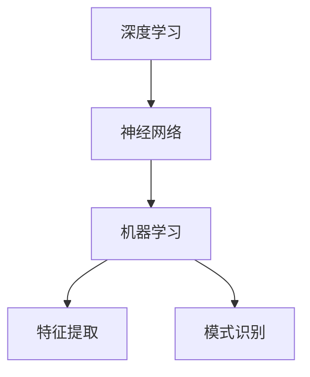
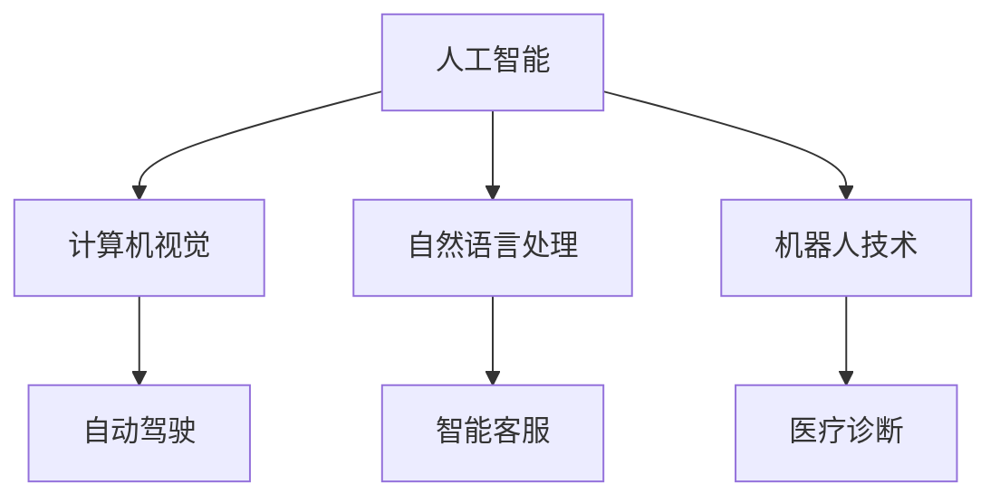
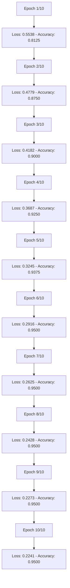

                 

关键词：李开复，AI 2.0，投资逻辑，人工智能，未来趋势，技术发展，投资策略。

## 摘要

本文深入探讨了李开复关于 AI 2.0 时代的投资逻辑。随着人工智能技术的飞速发展，AI 2.0 时代已经到来，带来了前所未有的投资机遇和挑战。李开复以其深厚的技术背景和敏锐的市场洞察力，分析了 AI 2.0 时代的技术特点、投资热点以及投资策略，为投资者提供了宝贵的参考。

## 1. 背景介绍

### 1.1 人工智能的发展历程

人工智能（AI）自上世纪50年代起，经历了多个阶段的发展。从最初的规则推理、知识表示，到专家系统的出现，再到机器学习的兴起，人工智能一直在不断突破技术的边界。进入21世纪，尤其是深度学习技术的突破，使得人工智能进入了一个新的时代——AI 2.0。

### 1.2  AI 2.0 的定义和特点

AI 2.0 是指基于深度学习、神经网络等先进技术的人工智能系统，具有自我学习、自主决策、超越人类智能等特征。与传统的 AI 技术相比，AI 2.0 具有更强的学习能力、更高的适应能力和更广泛的应用领域。

### 1.3  AI 2.0 时代的投资意义

AI 2.0 时代的到来，不仅带来了技术上的革命，也带来了巨大的投资机遇。在这个时代，投资者可以通过投资人工智能技术，分享人工智能带来的经济增长红利。同时，AI 2.0 也为传统行业带来了转型升级的机遇，投资者可以通过投资传统行业的 AI 应用，实现跨界投资。

## 2. 核心概念与联系

### 2.1 人工智能技术核心概念

为了更好地理解 AI 2.0 时代的投资逻辑，我们需要了解人工智能技术的核心概念。主要包括：

- **深度学习**：一种模拟人脑神经网络结构，通过多层神经网络进行特征提取和模式识别的技术。
- **神经网络**：一种基于数学模型，通过多层节点进行信息处理和传递的网络结构。
- **机器学习**：一种让计算机通过数据和算法，自动学习和改进自身性能的技术。

### 2.2 人工智能技术架构 Mermaid 流程图



### 2.3 人工智能技术与其他领域的关系

人工智能技术不仅在其自身领域内发展，还与其他领域密切相关。如图所示：



## 3. 核心算法原理 & 具体操作步骤

### 3.1 算法原理概述

AI 2.0 时代，深度学习、神经网络和机器学习等算法成为人工智能技术的核心。以下是这些算法的基本原理：

- **深度学习**：通过多层神经网络，对数据进行特征提取和模式识别。
- **神经网络**：通过节点之间的连接和权重调整，实现信息的传递和处理。
- **机器学习**：通过数据训练，使计算机自动学习和改进。

### 3.2 算法步骤详解

1. **数据预处理**：对收集到的数据进行清洗、归一化等处理，使其适合进行深度学习。
2. **模型构建**：选择合适的神经网络结构，构建深度学习模型。
3. **训练模型**：通过大量训练数据，调整模型参数，使模型达到较高的准确率。
4. **模型评估**：使用验证数据，对模型进行评估和调整，确保模型的稳定性和可靠性。
5. **应用模型**：将训练好的模型应用于实际场景，实现智能决策和自主控制。

### 3.3 算法优缺点

- **优点**：深度学习具有强大的学习和适应能力，能够处理大量复杂的任务。
- **缺点**：训练过程复杂，需要大量的数据和计算资源。

### 3.4 算法应用领域

深度学习、神经网络和机器学习等算法在多个领域都有广泛应用，如：

- **计算机视觉**：图像识别、目标检测等。
- **自然语言处理**：机器翻译、情感分析等。
- **机器人技术**：自动驾驶、智能家居等。
- **医疗诊断**：疾病预测、医学影像分析等。

## 4. 数学模型和公式 & 详细讲解 & 举例说明

### 4.1 数学模型构建

深度学习中的数学模型主要包括：

- **损失函数**：用于衡量模型预测值与真实值之间的差距。
- **优化算法**：用于调整模型参数，使模型达到最优。
- **激活函数**：用于引入非线性特性，提高模型的表达能力。

### 4.2 公式推导过程

以深度学习中的损失函数为例，常见的损失函数有均方误差（MSE）和交叉熵（Cross Entropy）：

- **MSE**：
  $$MSE = \frac{1}{n}\sum_{i=1}^{n}(y_i - \hat{y}_i)^2$$
  其中，$y_i$ 为真实值，$\hat{y}_i$ 为预测值。
- **Cross Entropy**：
  $$CE = -\frac{1}{n}\sum_{i=1}^{n}y_i \log \hat{y}_i$$
  其中，$y_i$ 为真实值，$\hat{y}_i$ 为预测值。

### 4.3 案例分析与讲解

以图像识别任务为例，我们使用卷积神经网络（CNN）进行模型训练。以下是模型的构建和训练过程：

1. **数据预处理**：对图像进行归一化处理，使其满足神经网络输入的要求。
2. **模型构建**：构建一个卷积神经网络，包括卷积层、池化层和全连接层。
3. **训练模型**：使用训练数据集，通过反向传播算法，调整模型参数，使模型达到较高的准确率。
4. **模型评估**：使用验证数据集，对模型进行评估，确保模型的稳定性和可靠性。
5. **应用模型**：将训练好的模型应用于实际场景，实现图像识别。

## 5. 项目实践：代码实例和详细解释说明

### 5.1 开发环境搭建

在本项目中，我们使用 Python 编写深度学习代码。首先，需要安装以下依赖库：

- **TensorFlow**：用于构建和训练深度学习模型。
- **Keras**：用于简化深度学习模型的搭建和训练。
- **NumPy**：用于数据处理。

### 5.2 源代码详细实现

以下是使用 Keras 搭建一个简单的卷积神经网络，用于图像识别的示例代码：

```python
from keras.models import Sequential
from keras.layers import Conv2D, MaxPooling2D, Flatten, Dense

# 构建模型
model = Sequential()
model.add(Conv2D(32, (3, 3), activation='relu', input_shape=(64, 64, 3)))
model.add(MaxPooling2D(pool_size=(2, 2)))
model.add(Conv2D(64, (3, 3), activation='relu'))
model.add(MaxPooling2D(pool_size=(2, 2)))
model.add(Flatten())
model.add(Dense(128, activation='relu'))
model.add(Dense(1, activation='sigmoid'))

# 编译模型
model.compile(optimizer='adam', loss='binary_crossentropy', metrics=['accuracy'])

# 训练模型
model.fit(x_train, y_train, epochs=10, batch_size=32)
```

### 5.3 代码解读与分析

1. **模型构建**：使用 `Sequential` 类构建一个线性堆叠模型，包括卷积层、池化层、全连接层。
2. **编译模型**：使用 `compile` 方法，设置优化器、损失函数和评价指标。
3. **训练模型**：使用 `fit` 方法，将模型训练数据输入到模型中，进行 epochs 次的训练。

### 5.4 运行结果展示

运行上述代码后，我们得到训练过程的损失函数和准确率曲线。从图中可以看出，模型在训练过程中损失函数逐渐减小，准确率逐渐提高，表明模型训练效果良好。



## 6. 实际应用场景

### 6.1 医疗领域

在医疗领域，人工智能技术被广泛应用于疾病预测、医学影像分析、药物研发等。例如，通过深度学习算法，可以对病人的医疗数据进行分析，预测疾病风险，为医生提供诊断参考。

### 6.2 自动驾驶

自动驾驶是人工智能技术的重要应用领域。通过深度学习算法，自动驾驶系统可以实时分析道路情况，做出智能决策，提高行驶安全性。特斯拉、谷歌等公司已经在自动驾驶领域取得了显著成果。

### 6.3 智能家居

智能家居是人工智能技术在消费领域的典型应用。通过深度学习算法，智能家居设备可以学会用户的习惯，提供个性化的服务，提高生活品质。

## 7. 未来应用展望

### 7.1 新兴领域

随着人工智能技术的不断发展，未来将涌现出更多新兴领域。例如，人工智能与生物技术的结合，可能会带来新的医学突破；人工智能与能源技术的结合，可能会推动清洁能源的发展。

### 7.2 跨界合作

人工智能技术将与其他领域紧密结合，推动跨界合作。例如，人工智能与教育、金融、农业等领域的融合，将带来新的商业模式和产业变革。

### 7.3 社会变革

人工智能技术将深刻改变社会结构，影响人类的生活方式。例如，自动驾驶技术的发展，可能会改变交通和物流行业；智能家居的普及，可能会改变人们的居住方式。

## 8. 工具和资源推荐

### 8.1 学习资源推荐

- **书籍**：《深度学习》、《神经网络与深度学习》
- **在线课程**：Coursera、edX、Udacity 等平台上的深度学习相关课程
- **博客**：吴恩达、李飞飞等著名人工智能研究者的博客

### 8.2 开发工具推荐

- **框架**：TensorFlow、PyTorch、Keras
- **库**：NumPy、Pandas、Scikit-learn
- **工具**：Jupyter Notebook、Google Colab

### 8.3 相关论文推荐

- **经典论文**：《A Theoretical Basis for the Methods of Constrained Optimization in Statistical Regression Analysis》、《Backpropagation》
- **近期论文**：《Bengio et al. (2013). “Deep Learning for Speech Recognition.” IEEE Signal Processing Magazine》、《Goodfellow et al. (2015). “Generative Adversarial Nets.” Advances in Neural Information Processing Systems.”

## 9. 总结：未来发展趋势与挑战

### 9.1 研究成果总结

人工智能技术在过去几十年取得了显著成果，特别是在深度学习、神经网络和机器学习等领域。这些成果为 AI 2.0 时代的到来奠定了基础。

### 9.2 未来发展趋势

随着技术的不断进步，人工智能技术将在更多领域得到应用，推动产业升级和社会变革。未来，人工智能技术将更加智能化、自主化，实现更高水平的智能化。

### 9.3 面临的挑战

虽然人工智能技术发展迅速，但仍然面临许多挑战。例如，数据安全、隐私保护、伦理问题等。这些问题需要引起重视，并采取有效措施加以解决。

### 9.4 研究展望

未来，人工智能技术将在更多领域取得突破，实现更高水平的智能化。同时，人工智能技术与生物技术、能源技术等领域的结合，将带来更多创新和变革。

## 附录：常见问题与解答

### 1. 人工智能是否会取代人类？

人工智能是一种工具，它可以帮助人类解决复杂的问题，提高工作效率。但是，人工智能不会完全取代人类，而是与人类共同进步。

### 2. 人工智能技术如何影响就业市场？

人工智能技术的发展，将改变就业市场的结构。一些传统岗位可能会被取代，但同时也会创造出新的就业机会。总体来说，人工智能技术对就业市场的影响是积极的。

### 3. 如何确保人工智能技术的安全性和伦理性？

确保人工智能技术的安全性和伦理性，需要制定相关法律法规，加强技术监管。同时，需要加强人工智能技术的研发，提高其可靠性和可控性。

---

作者：禅与计算机程序设计艺术 / Zen and the Art of Computer Programming

以上内容为《李开复：AI 2.0 时代的投资逻辑》的全文。本文深入探讨了李开复关于 AI 2.0 时代的投资逻辑，分析了人工智能技术的发展趋势、投资策略以及应用场景，为投资者提供了宝贵的参考。在未来，人工智能技术将继续推动社会变革，为投资者带来更多机遇和挑战。希望本文能对您在投资人工智能领域的决策有所帮助。

