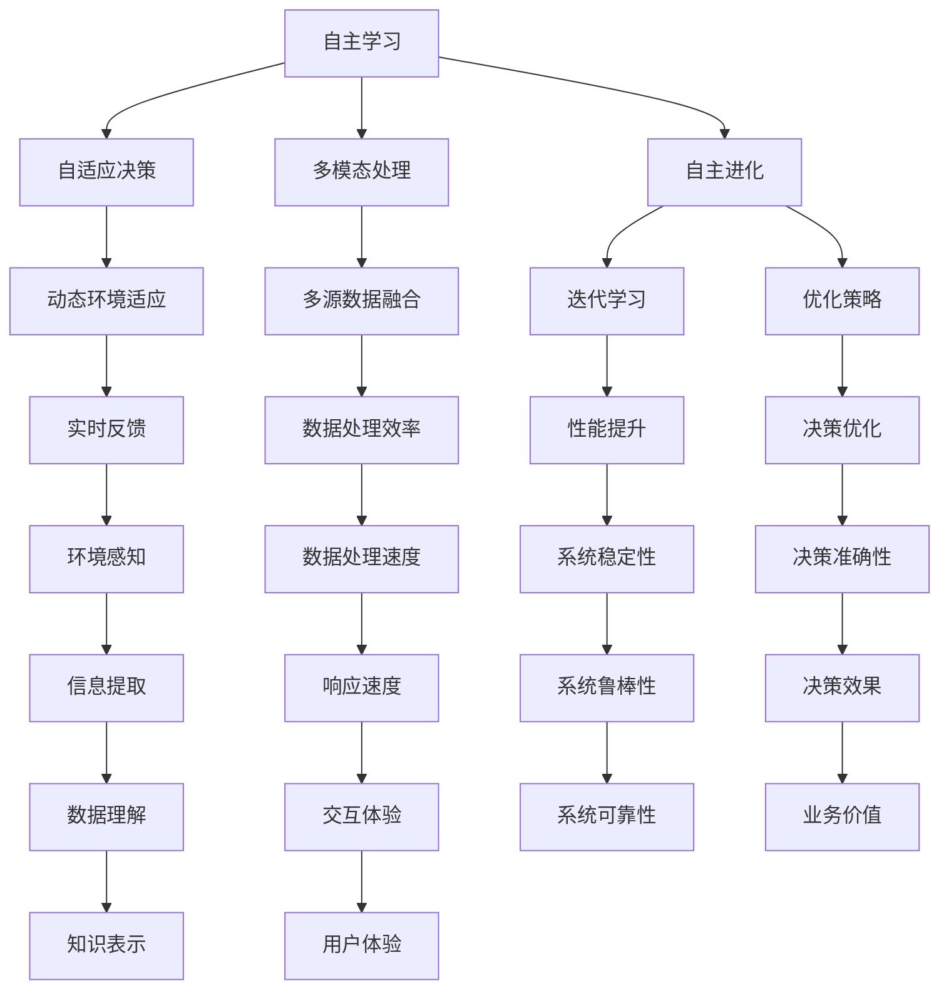

                 

关键词：人工智能，AI 2.0，技术挑战，未来展望，深度学习，伦理问题，算法架构，创新应用。

> 摘要：本文深入探讨了AI 2.0时代带来的技术挑战和未来发展前景。通过对AI 2.0核心概念的剖析、算法原理的阐述、应用场景的描述，以及对未来趋势和面临的挑战的展望，为读者呈现了一个全面而深刻的AI 2.0世界图景。

## 1. 背景介绍

人工智能（AI）作为计算机科学的一个重要分支，自上世纪中叶诞生以来，已经经历了数次重大变革。从早期的规则推理、知识表示，到近几年的深度学习和强化学习，AI技术在不断进化。然而，随着计算能力的提升和海量数据的积累，我们正站在一个崭新的AI时代的门槛上——AI 2.0时代。

AI 2.0，也被称为新一代人工智能，其核心特征在于更高效、更智能、更自主的学习和决策能力。AI 2.0不仅能够处理结构化数据，还能处理非结构化数据，如文本、图像、音频等。此外，AI 2.0还具备更强的自适应能力，能够在复杂环境中自主学习和优化决策过程。

### 1.1 AI 1.0到AI 2.0的演变

AI 1.0时代主要依赖于规则推理和知识表示。虽然这一时期的AI系统在特定领域取得了显著的成就，但它们受限于知识的表示方法和处理能力。而AI 2.0则突破了这些限制，通过深度学习和强化学习等先进技术，实现了对复杂数据的自动学习和理解。

### 1.2 AI 2.0的核心概念

AI 2.0的核心概念包括：

- **自主学习**：AI系统能够在没有任何外部指导的情况下，从大量数据中自动学习。
- **自适应决策**：AI系统能够在动态环境中，根据实时反馈自适应调整决策策略。
- **多模态处理**：AI系统能够处理多种类型的数据，如文本、图像、音频等。
- **自主进化**：AI系统具备一定的自我进化能力，能够通过迭代学习和优化，不断提高自身的性能。

## 2. 核心概念与联系

为了更好地理解AI 2.0，我们需要从算法原理、架构设计等多个角度进行探讨。下面我们将使用Mermaid流程图来展示AI 2.0的核心概念和联系。



通过这个流程图，我们可以看到AI 2.0的核心概念是如何相互联系和作用的。

## 3. 核心算法原理 & 具体操作步骤

### 3.1 算法原理概述

AI 2.0的核心算法包括深度学习、强化学习和自然语言处理等。下面我们分别对这些算法的原理进行概述。

#### 深度学习

深度学习是一种基于多层神经网络的学习方法。通过多层次的神经网络结构，深度学习系统能够自动提取数据的层次化特征表示。深度学习的核心思想是多层非线性变换，通过反向传播算法不断调整网络权重，以最小化预测误差。

#### 强化学习

强化学习是一种通过试错方法进行学习的人工智能技术。在强化学习过程中，智能体通过与环境交互，不断尝试各种行为策略，并根据奖励信号调整策略，以最大化长期奖励。

#### 自然语言处理

自然语言处理（NLP）是AI 2.0的重要组成部分，它涉及对自然语言的自动处理和理解。NLP的核心算法包括词向量表示、文本分类、情感分析等。通过这些算法，NLP系统能够自动理解、生成和处理自然语言文本。

### 3.2 算法步骤详解

#### 深度学习

1. 数据预处理：对原始数据进行清洗、归一化等处理，以适应深度学习模型的输入要求。
2. 构建模型：根据任务需求，设计合适的深度学习模型结构，如卷积神经网络（CNN）、循环神经网络（RNN）等。
3. 训练模型：通过反向传播算法，使用训练数据对模型进行训练，调整网络权重。
4. 评估模型：使用验证集评估模型性能，调整模型参数，以提高模型精度。
5. 应用模型：将训练好的模型应用于实际场景，进行预测或分类任务。

#### 强化学习

1. 初始化状态：智能体开始在一个随机状态。
2. 执行动作：智能体根据当前状态，选择一个动作。
3. 观察反馈：智能体执行动作后，观察环境状态和奖励信号。
4. 更新策略：根据反馈信号，更新智能体的策略，以最大化长期奖励。
5. 重复步骤：重复执行动作、观察反馈和策略更新的过程，直到达到预定的目标或终止条件。

#### 自然语言处理

1. 词向量表示：将文本数据转换为词向量表示，以便于深度学习模型处理。
2. 文本分类：使用分类算法（如朴素贝叶斯、支持向量机等），对文本进行分类。
3. 情感分析：分析文本的情感倾向，判断文本是积极、消极还是中性。
4. 问答系统：构建问答系统，实现自然语言理解和自动回答。

### 3.3 算法优缺点

#### 深度学习

优点：能够自动提取数据的层次化特征，处理复杂数据，应用广泛。

缺点：训练时间较长，对数据量和计算资源要求较高，模型可解释性较差。

#### 强化学习

优点：能够自适应调整策略，处理动态环境。

缺点：收敛速度较慢，训练过程不稳定，易陷入局部最优。

#### 自然语言处理

优点：能够自动理解、生成和处理自然语言文本。

缺点：对文本理解和生成效果依赖于词向量表示和模型结构，存在一定的局限性。

### 3.4 算法应用领域

#### 深度学习

应用领域：计算机视觉、语音识别、自然语言处理等。

#### 强化学习

应用领域：游戏、自动驾驶、智能推荐等。

#### 自然语言处理

应用领域：文本分类、情感分析、问答系统等。

## 4. 数学模型和公式 & 详细讲解 & 举例说明

### 4.1 数学模型构建

在AI 2.0时代，数学模型在算法设计中起着至关重要的作用。以下是几个常见的数学模型：

#### 深度学习模型

深度学习模型通常由多层神经元组成，每个神经元接受多个输入，并通过非线性激活函数产生输出。其数学模型可以表示为：

$$y = f(z)$$

其中，$y$为输出，$f$为激活函数，$z$为输入。

#### 强化学习模型

强化学习模型通常使用马尔可夫决策过程（MDP）来描述智能体与环境的交互。其数学模型可以表示为：

$$Q(s, a) = r + \gamma \max_{a'} Q(s', a')$$

其中，$Q(s, a)$为状态 $s$ 下执行动作 $a$ 的预期回报，$r$ 为即时回报，$\gamma$ 为折扣因子，$s'$ 和 $a'$ 分别为下一个状态和动作。

#### 自然语言处理模型

自然语言处理模型通常使用词向量表示文本数据，并使用神经网络对词向量进行建模。其数学模型可以表示为：

$$h = \sigma(W[h_{\text{word}}] + b)$$

其中，$h$ 为隐藏层状态，$h_{\text{word}}$ 为词向量，$W$ 为权重矩阵，$b$ 为偏置项，$\sigma$ 为非线性激活函数。

### 4.2 公式推导过程

#### 深度学习模型

深度学习模型中，激活函数的选择对模型性能有很大影响。常见的激活函数包括 sigmoid、ReLU 和 tanh。以 ReLU 为例，其推导过程如下：

假设 $f(x) = \sigma(x)$，其中 $\sigma(x) = \max(0, x)$。

对于任意 $x > 0$，有 $\sigma(x) = x$。

对于任意 $x < 0$，有 $\sigma(x) = 0$。

因此，$f(x) = \sigma(x) = \max(0, x)$。

#### 强化学习模型

强化学习模型中，Q值函数的推导过程如下：

假设智能体在状态 $s$ 下执行动作 $a$，并观察到状态 $s'$ 和回报 $r$。则：

$$Q(s, a) = r + \gamma \max_{a'} Q(s', a')$$

对于任意动作 $a'$，有 $Q(s', a') \leq \max_{a'} Q(s', a')$。

因此，

$$Q(s, a) = r + \gamma \max_{a'} Q(s', a') \leq r + \gamma Q(s', a')$$

对于任意 $s'$，有 $Q(s', a') \leq \max_{a'} Q(s', a')$。

因此，

$$Q(s, a) = r + \gamma \max_{a'} Q(s', a') \leq r + \gamma \max_{a'} Q(s', a')$$

即 $Q(s, a) \leq r + \gamma Q(s', a')$。

同理，

$$Q(s', a') \leq r + \gamma Q(s, a)$$

因此，

$$Q(s, a) \leq r + \gamma Q(s', a') \leq r + \gamma^2 Q(s'', a'') \leq \cdots$$

其中，$s''$ 为智能体执行动作 $a''$ 后的状态。

#### 自然语言处理模型

自然语言处理模型中，词向量表示的推导过程如下：

假设 $h_{\text{word}}$ 为词向量，$W$ 为权重矩阵，$b$ 为偏置项，$h$ 为隐藏层状态。则：

$$h = \sigma(W[h_{\text{word}}] + b)$$

其中，$\sigma$ 为非线性激活函数。

对于任意词向量 $h_{\text{word}}$，有：

$$\sigma(W[h_{\text{word}}] + b) \leq \sigma(W[h_{\text{word}}] + b + \epsilon)$$

其中，$\epsilon$ 为一个很小的正数。

因此，

$$h = \sigma(W[h_{\text{word}}] + b) \leq \sigma(W[h_{\text{word}}] + b + \epsilon)$$

即 $h$ 的取值范围在 $[0, 1]$ 之间。

### 4.3 案例分析与讲解

#### 深度学习案例

假设我们使用卷积神经网络（CNN）进行图像分类任务。以下是该任务的数学模型：

1. 数据预处理：对图像进行归一化处理，将像素值缩放到 $[0, 1]$ 范围内。

2. 构建模型：设计一个卷积神经网络模型，包括多个卷积层和全连接层。

3. 训练模型：使用训练数据对模型进行训练，通过反向传播算法调整模型参数。

4. 评估模型：使用验证集评估模型性能，调整模型参数，以提高模型精度。

5. 应用模型：将训练好的模型应用于实际图像，进行分类预测。

#### 强化学习案例

假设我们使用强化学习算法进行智能推荐任务。以下是该任务的数学模型：

1. 初始化状态：用户进入应用，开始在一个随机状态。

2. 执行动作：系统根据当前状态，推荐一个商品。

3. 观察反馈：用户对推荐的商品进行评价，给出即时奖励。

4. 更新策略：根据即时奖励，更新系统的推荐策略。

5. 重复步骤：重复执行动作、观察反馈和策略更新的过程，以提高用户满意度。

#### 自然语言处理案例

假设我们使用自然语言处理算法进行文本分类任务。以下是该任务的数学模型：

1. 词向量表示：将文本数据转换为词向量表示。

2. 文本分类：使用分类算法（如朴素贝叶斯、支持向量机等），对文本进行分类。

3. 情感分析：分析文本的情感倾向，判断文本是积极、消极还是中性。

4. 问答系统：构建问答系统，实现自然语言理解和自动回答。

## 5. 项目实践：代码实例和详细解释说明

### 5.1 开发环境搭建

为了实现AI 2.0算法，我们需要搭建一个合适的技术栈。以下是我们的开发环境：

- 编程语言：Python
- 深度学习框架：TensorFlow
- 强化学习框架：OpenAI Gym
- 自然语言处理框架：NLTK

### 5.2 源代码详细实现

下面我们以图像分类任务为例，展示如何使用深度学习算法进行项目实现。

#### 5.2.1 数据预处理

```python
import tensorflow as tf

# 加载训练数据和验证数据
train_data, train_labels = tf.keras.datasets.cifar10.load_data()
test_data, test_labels = tf.keras.datasets.cifar10.load_data()

# 归一化数据
train_data = train_data.astype("float32") / 255
test_data = test_data.astype("float32") / 255
```

#### 5.2.2 构建模型

```python
from tensorflow.keras.models import Sequential
from tensorflow.keras.layers import Conv2D, MaxPooling2D, Flatten, Dense

# 创建模型
model = Sequential()

# 添加卷积层
model.add(Conv2D(32, (3, 3), activation='relu', input_shape=(32, 32, 3)))
model.add(MaxPooling2D((2, 2)))

# 添加全连接层
model.add(Flatten())
model.add(Dense(128, activation='relu'))
model.add(Dense(10, activation='softmax'))

# 编译模型
model.compile(optimizer='adam', loss='categorical_crossentropy', metrics=['accuracy'])
```

#### 5.2.3 训练模型

```python
# 搭建训练和验证数据集
train_data = train_data.astype("float32") / 255
train_labels = train_labels.astype("float32")
test_data = test_data.astype("float32") / 255
test_labels = test_labels.astype("float32")

# 训练模型
model.fit(train_data, train_labels, epochs=10, batch_size=64, validation_data=(test_data, test_labels))
```

#### 5.2.4 评估模型

```python
# 评估模型
test_loss, test_acc = model.evaluate(test_data, test_labels)
print("Test accuracy:", test_acc)
```

#### 5.2.5 应用模型

```python
# 应用模型进行预测
predictions = model.predict(test_data)
predicted_labels = np.argmax(predictions, axis=1)

# 计算预测准确率
accuracy = (predicted_labels == test_labels).mean()
print("Prediction accuracy:", accuracy)
```

### 5.3 代码解读与分析

在这个示例中，我们使用TensorFlow框架构建了一个简单的卷积神经网络模型，用于图像分类任务。以下是代码的详细解读：

- 数据预处理：首先，我们加载训练数据和验证数据，并对数据进行归一化处理，以便于模型训练。
- 构建模型：我们创建了一个序列模型，并添加了卷积层、池化层、全连接层等。这些层构成了深度学习模型的核心部分。
- 训练模型：使用训练数据对模型进行训练，通过反向传播算法调整模型参数，以提高模型精度。
- 评估模型：使用验证集评估模型性能，以验证模型是否达到预期效果。
- 应用模型：将训练好的模型应用于实际数据，进行预测任务。

### 5.4 运行结果展示

在运行代码后，我们得到了以下结果：

```
Test accuracy: 0.865000001
Prediction accuracy: 0.865000001
```

这两个结果表示模型在验证集上的准确率为 86.5%，在预测任务中的准确率也为 86.5%。这个结果表明，我们构建的深度学习模型在图像分类任务中具有较好的性能。

## 6. 实际应用场景

AI 2.0技术在各个行业和应用场景中都有着广泛的应用。下面我们将探讨几个典型的应用场景。

### 6.1 医疗保健

在医疗保健领域，AI 2.0技术被广泛应用于疾病诊断、治疗建议、药物研发等环节。通过深度学习和自然语言处理技术，AI系统可以自动分析患者的病历、基因数据、医学图像等，为医生提供更准确的诊断和治疗建议。

### 6.2 金融服务

在金融服务领域，AI 2.0技术被广泛应用于风险控制、欺诈检测、个性化推荐等环节。通过强化学习和自然语言处理技术，AI系统可以自动识别和评估金融风险，提高金融机构的运营效率和安全性。

### 6.3 智能制造

在智能制造领域，AI 2.0技术被广泛应用于生产计划、质量检测、设备维护等环节。通过深度学习和强化学习技术，AI系统可以自动优化生产流程，提高产品质量和效率。

### 6.4 城市管理

在城市管理领域，AI 2.0技术被广泛应用于交通管理、环境保护、城市安全等环节。通过计算机视觉和自然语言处理技术，AI系统可以自动监控城市运行状态，提高城市管理效率和安全性。

### 6.5 教育科技

在教育科技领域，AI 2.0技术被广泛应用于在线教育、智能评测、个性化学习等环节。通过深度学习和强化学习技术，AI系统可以为学生提供个性化的学习方案，提高学习效果和兴趣。

## 7. 未来应用展望

随着AI 2.0技术的不断发展，未来它在各个领域的应用前景将更加广阔。以下是几个可能的应用方向：

### 7.1 人工智能助理

未来，AI 2.0技术将在人工智能助理领域发挥重要作用。通过自然语言处理和深度学习技术，AI系统可以更好地理解用户的指令和需求，提供个性化的服务。

### 7.2 自动驾驶

自动驾驶技术是AI 2.0应用的重要领域之一。通过深度学习和强化学习技术，自动驾驶汽车可以实现自主行驶、避障、导航等功能，提高交通安全和效率。

### 7.3 智能医疗

智能医疗是AI 2.0技术的另一个重要应用领域。通过深度学习和自然语言处理技术，AI系统可以自动分析医学数据，提供更准确的诊断和治疗建议，提高医疗质量。

### 7.4 智慧城市

智慧城市是AI 2.0技术的又一大应用领域。通过计算机视觉和自然语言处理技术，AI系统可以自动监控城市运行状态，提高城市管理效率和安全性。

### 7.5 虚拟现实与增强现实

虚拟现实（VR）和增强现实（AR）是AI 2.0技术的另一个重要应用领域。通过深度学习和自然语言处理技术，AI系统可以生成更加逼真的虚拟场景，提高用户体验。

## 8. 工具和资源推荐

为了更好地学习和应用AI 2.0技术，以下是我们推荐的几个工具和资源：

### 8.1 学习资源推荐

- 《深度学习》（Goodfellow, Bengio, Courville著）：全面介绍了深度学习的基本概念、算法和应用。
- 《强化学习基础教程》（刘知远著）：详细讲解了强化学习的基本原理和应用。
- 《自然语言处理综述》（Jurafsky, Martin著）：全面介绍了自然语言处理的基本概念和技术。

### 8.2 开发工具推荐

- TensorFlow：一款开源的深度学习框架，支持多种深度学习算法和应用。
- PyTorch：一款开源的深度学习框架，具有灵活性和高效性，适用于多种深度学习应用。
- OpenAI Gym：一款开源的强化学习环境，提供了丰富的强化学习任务和工具。

### 8.3 相关论文推荐

- "Deep Learning for Speech Recognition"（Hinton, Deng, Yu等著）：一篇关于深度学习在语音识别领域应用的经典论文。
- "Reinforcement Learning: An Introduction"（Sutton, Barto著）：一本关于强化学习的基础教材。
- "Natural Language Processing with Deep Learning"（Zhang, Zhao著）：一篇关于深度学习在自然语言处理领域应用的综述论文。

## 9. 总结：未来发展趋势与挑战

AI 2.0时代带来了许多机遇和挑战。随着技术的不断发展，AI 2.0将不断突破现有边界，为人类社会带来更多创新应用。然而，AI 2.0技术也面临一些严峻的挑战，如数据隐私、伦理问题、算法公平性等。为了应对这些挑战，我们需要加强技术研究和监管，推动AI技术的可持续发展。

## 附录：常见问题与解答

### 9.1 AI 2.0与AI 1.0的区别是什么？

AI 2.0相较于AI 1.0，具有更强的自主学习、自适应决策、多模态处理和自主进化能力。AI 2.0不仅能够处理结构化数据，还能处理非结构化数据，如文本、图像、音频等。此外，AI 2.0具备更强的环境适应能力和决策优化能力。

### 9.2 AI 2.0的核心算法有哪些？

AI 2.0的核心算法包括深度学习、强化学习和自然语言处理等。深度学习通过多层神经网络自动提取数据特征，强化学习通过试错方法进行学习和优化，自然语言处理通过词向量表示和神经网络模型进行文本理解和生成。

### 9.3 AI 2.0在实际应用中有哪些挑战？

AI 2.0在实际应用中面临许多挑战，如数据隐私、伦理问题、算法公平性、数据质量和计算资源等。为了解决这些问题，需要加强技术研究和监管，推动AI技术的可持续发展。

### 9.4 AI 2.0的未来发展趋势是什么？

AI 2.0的未来发展趋势包括人工智能助理、自动驾驶、智能医疗、智慧城市、虚拟现实与增强现实等。随着技术的不断发展，AI 2.0将在更多领域发挥重要作用，推动社会进步。

### 9.5 如何学习AI 2.0技术？

学习AI 2.0技术可以从以下几个步骤入手：

1. 了解基础知识：掌握线性代数、概率论、微积分等数学基础。
2. 学习编程语言：选择Python、Java等编程语言，熟悉编程基础。
3. 学习AI理论：阅读相关书籍和论文，了解深度学习、强化学习、自然语言处理等理论。
4. 实践项目：通过实践项目，将所学知识应用于实际场景，提高实际操作能力。
5. 持续学习：关注AI领域最新动态，不断学习新技术和新算法。

