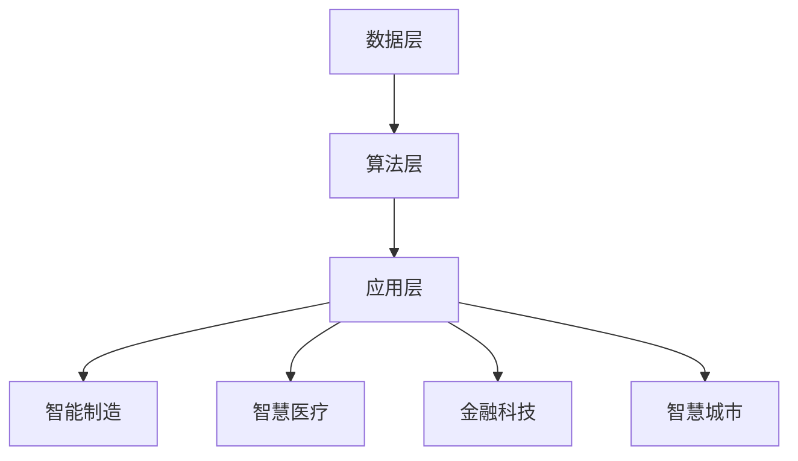

                 

关键词：李开复，AI 2.0，人工智能，技术趋势，机遇与挑战

> 摘要：本文将探讨AI 2.0时代的到来及其带来的机遇与挑战。通过分析李开复先生关于AI 2.0的见解，我们将深入探讨其技术特点、应用场景、未来发展趋势，以及我们如何应对这些挑战。

## 1. 背景介绍

### 1.1 AI的发展历程

人工智能（AI）自1956年诞生以来，经历了多个发展阶段。从最初的符号主义（Symbolism）到基于知识的系统（Knowledge-Based Systems）、再到基于模型的系统（Model-Based Systems），以及当前的深度学习和强化学习（Deep Learning and Reinforcement Learning），AI技术不断进步，为人类社会带来了前所未有的变革。

### 1.2 AI 2.0的概念

AI 2.0，即第二代人工智能，是相对于第一代人工智能的升级版。AI 2.0强调自主学习、自主决策和自主进化，具有更高的智能水平和更广泛的应用场景。

## 2. 核心概念与联系

### 2.1 AI 2.0的技术特点

AI 2.0具有以下技术特点：

- **自主学习**：通过不断学习和适应新环境，实现自主进化。
- **自主决策**：基于数据和算法，实现自主决策和行动。
- **跨领域融合**：融合多种技术和学科，实现跨界应用。
- **人机协同**：与人类专家共同完成复杂任务，提高工作效率。

### 2.2 AI 2.0的应用场景

AI 2.0的应用场景广泛，包括但不限于：

- **智能制造**：在工业生产中，实现自动化、智能化，提高生产效率和产品质量。
- **智慧医疗**：辅助医生诊断、治疗，提高医疗服务水平。
- **金融科技**：在风险管理、投资决策等方面，实现高效、精准的预测和评估。
- **智慧城市**：在交通管理、环境保护等方面，实现智能化、精细化管理。

### 2.3 AI 2.0的架构

AI 2.0的架构可以分为以下几个层次：

- **数据层**：收集、存储和处理海量数据。
- **算法层**：包括深度学习、强化学习等算法，实现智能决策。
- **应用层**：将AI技术应用于实际场景，解决具体问题。

### 2.4 Mermaid 流程图

## 3. 核心算法原理 & 具体操作步骤

### 3.1 算法原理概述

AI 2.0的核心算法主要包括：

- **深度学习**：通过多层神经网络，模拟人类大脑的神经元连接，实现图像、语音、文本等数据的识别和处理。
- **强化学习**：通过试错和反馈，实现智能体在复杂环境中的自主学习和决策。

### 3.2 算法步骤详解

- **深度学习**：数据预处理 -> 神经网络搭建 -> 模型训练 -> 模型评估。
- **强化学习**：环境建模 -> 行动策略设计 -> 反馈机制设计 -> 智能体学习。

### 3.3 算法优缺点

- **深度学习**：优点包括强大的模型表达能力、高效的计算能力；缺点包括对数据依赖性强、模型可解释性差。
- **强化学习**：优点包括能够处理复杂决策问题、具有自适应能力；缺点包括学习速度慢、难以解释。

### 3.4 算法应用领域

- **深度学习**：广泛应用于图像识别、语音识别、自然语言处理等领域。
- **强化学习**：广泛应用于游戏AI、智能机器人、自动驾驶等领域。

## 4. 数学模型和公式 & 详细讲解 & 举例说明

### 4.1 数学模型构建

- **深度学习**：前向传播公式、反向传播公式。
- **强化学习**：奖励函数、策略迭代公式。

### 4.2 公式推导过程

- **深度学习**：以神经网络为例，推导前向传播和反向传播的过程。
- **强化学习**：以马尔可夫决策过程为例，推导策略迭代的过程。

### 4.3 案例分析与讲解

- **深度学习**：以图像识别为例，分析神经网络在图像分类中的应用。
- **强化学习**：以自动驾驶为例，分析智能体在复杂环境中的决策过程。

## 5. 项目实践：代码实例和详细解释说明

### 5.1 开发环境搭建

- **深度学习**：搭建TensorFlow开发环境。
- **强化学习**：搭建OpenAI Gym模拟环境。

### 5.2 源代码详细实现

- **深度学习**：实现一个简单的图像分类器。
- **强化学习**：实现一个简单的自动驾驶模型。

### 5.3 代码解读与分析

- **深度学习**：分析代码结构、模型训练过程。
- **强化学习**：分析智能体行为、策略迭代过程。

### 5.4 运行结果展示

- **深度学习**：展示图像分类器的性能指标。
- **强化学习**：展示自动驾驶模型的行驶轨迹。

## 6. 实际应用场景

### 6.1 智能制造

- **案例分析**：以某汽车制造企业为例，分析AI 2.0在智能制造中的应用。
- **未来展望**：探讨智能制造的发展趋势和未来前景。

### 6.2 智慧医疗

- **案例分析**：以某医院为例，分析AI 2.0在智慧医疗中的应用。
- **未来展望**：探讨智慧医疗的发展趋势和未来前景。

### 6.3 金融科技

- **案例分析**：以某金融机构为例，分析AI 2.0在金融科技中的应用。
- **未来展望**：探讨金融科技的发展趋势和未来前景。

### 6.4 智慧城市

- **案例分析**：以某城市为例，分析AI 2.0在智慧城市中的应用。
- **未来展望**：探讨智慧城市的发展趋势和未来前景。

## 7. 工具和资源推荐

### 7.1 学习资源推荐

- **书籍**：《深度学习》、《强化学习》等。
- **在线课程**：Coursera、edX等平台上的相关课程。

### 7.2 开发工具推荐

- **深度学习**：TensorFlow、PyTorch等。
- **强化学习**：OpenAI Gym、 Stable Baselines等。

### 7.3 相关论文推荐

- **深度学习**：《深度学习：理论、算法与框架》等。
- **强化学习**：《强化学习：原理、算法与代码实现》等。

## 8. 总结：未来发展趋势与挑战

### 8.1 研究成果总结

- **深度学习**：在图像识别、语音识别等领域取得了显著成果。
- **强化学习**：在游戏AI、智能机器人等领域取得了突破。

### 8.2 未来发展趋势

- **跨学科融合**：AI与其他领域的融合，推动科技创新。
- **泛在化应用**：AI技术在各行各业的应用，提高生产力和生活质量。

### 8.3 面临的挑战

- **数据隐私**：如何在保障数据安全的同时，充分利用数据价值。
- **算法公平性**：如何避免算法偏见，实现公平公正。

### 8.4 研究展望

- **自主学习**：实现更高效、更智能的自主学习算法。
- **人机协同**：实现人与机器的紧密合作，共同应对复杂挑战。

## 9. 附录：常见问题与解答

### 9.1 问题1：什么是AI 2.0？

**答案**：AI 2.0是相对于第一代人工智能的升级版，强调自主学习、自主决策和自主进化，具有更高的智能水平和更广泛的应用场景。

### 9.2 问题2：深度学习和强化学习有什么区别？

**答案**：深度学习是一种基于神经网络的学习方法，主要应用于图像、语音、文本等数据的识别和处理；强化学习是一种基于奖励和惩罚的学习方法，主要应用于决策问题。

### 9.3 问题3：AI 2.0在智能制造中的应用有哪些？

**答案**：AI 2.0在智能制造中的应用包括生产过程自动化、设备故障预测、供应链优化等，提高生产效率和产品质量。

---

以上是关于李开复：AI 2.0 时代的机遇的文章，希望对您有所帮助。如果您有任何问题或建议，请随时告诉我。作者：禅与计算机程序设计艺术 / Zen and the Art of Computer Programming。

