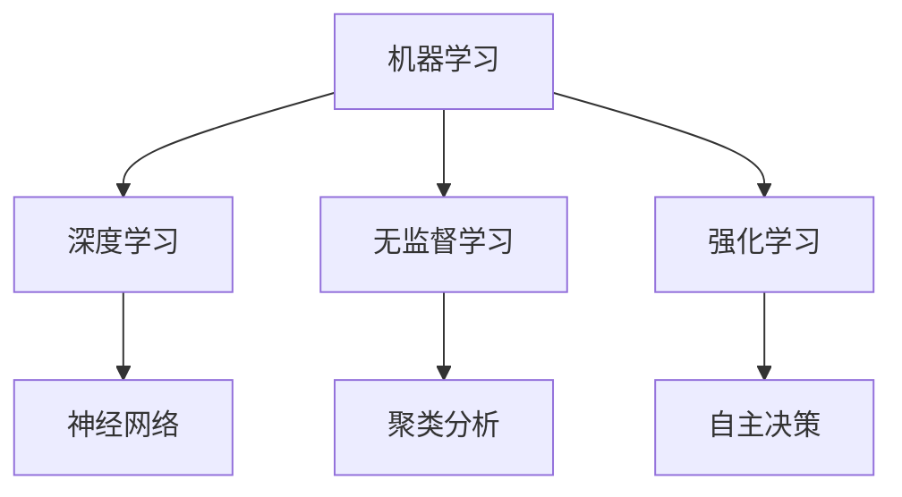
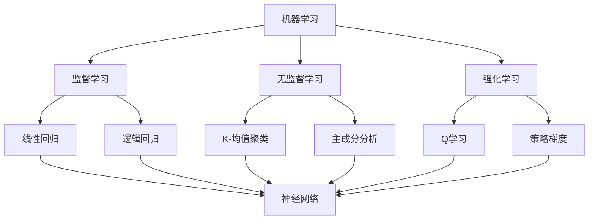

                 

关键词：李开复，人工智能，AI 2.0，社会价值，未来展望，技术发展

> 摘要：本文从李开复的角度出发，探讨了AI 2.0时代的社会价值。文章首先介绍了AI 2.0的概念及其相对于AI 1.0的进步，然后详细阐述了AI 2.0在医疗、教育、金融等领域的应用，以及其对社会和经济带来的变革。最后，文章展望了AI 2.0时代的未来发展趋势，并提出了面临的挑战和应对策略。

## 1. 背景介绍

在过去的几十年中，人工智能（AI）技术经历了从理论研究到实际应用的飞速发展。从早期的规则推理和知识表示，到深度学习和神经网络，AI技术在各个领域都取得了显著的成果。然而，随着技术的不断进步，AI 1.0时代已经逐渐走向成熟，我们迎来了AI 2.0时代。

AI 2.0，也被称为强人工智能，它不仅能够模拟人类的思维过程，还能够通过自我学习和自我进化，不断提升自身的能力。与AI 1.0相比，AI 2.0具有更高的智能水平，更广泛的适用范围，以及更强的自主决策能力。

李开复，作为世界著名的人工智能专家，多次在公开场合提出了AI 2.0时代的社会价值。他的观点引发了学术界和工业界的广泛关注，也为AI 2.0时代的发展提供了重要的理论支持。

## 2. 核心概念与联系

在探讨AI 2.0时代的社会价值之前，我们需要先了解一些核心概念。

### 2.1 机器学习

机器学习是AI 2.0的核心技术之一。它通过从大量数据中学习规律，从而实现智能预测和决策。机器学习分为监督学习、无监督学习和强化学习等不同类型，每种类型都有其独特的应用场景。

### 2.2 深度学习

深度学习是机器学习的一种重要分支，它通过多层神经网络来实现复杂的特征提取和模式识别。深度学习在图像识别、自然语言处理等领域取得了突破性的成果。

### 2.3 神经网络

神经网络是模拟人脑结构和功能的计算模型。它由大量的神经元组成，通过调整神经元之间的连接权重，实现数据的处理和决策。

下面是AI 2.0的核心概念和联系的关系图：



## 3. 核心算法原理 & 具体操作步骤

### 3.1 算法原理概述

AI 2.0的核心算法主要包括机器学习、深度学习和神经网络等。这些算法的基本原理是通过从数据中学习规律，从而实现对未知数据的预测和决策。

### 3.2 算法步骤详解

1. 数据收集：首先需要收集大量的数据，包括训练数据和测试数据。
2. 数据预处理：对数据进行清洗和预处理，确保数据的准确性和一致性。
3. 特征提取：通过特征提取算法，将原始数据转化为适合模型训练的特征向量。
4. 模型训练：使用训练数据，通过优化算法调整模型参数，使模型能够正确预测未知数据。
5. 模型评估：使用测试数据评估模型性能，调整模型参数，以提高模型准确性。
6. 模型应用：将训练好的模型应用到实际场景中，实现智能预测和决策。

### 3.3 算法优缺点

- 优点：AI 2.0算法具有强大的学习能力，能够处理大量复杂数据，实现高精度的预测和决策。
- 缺点：算法训练过程复杂，需要大量的计算资源和时间。此外，算法的可解释性较差，难以理解模型决策的依据。

### 3.4 算法应用领域

AI 2.0算法在医疗、教育、金融、交通等领域都有广泛的应用。

- 在医疗领域，AI 2.0算法可以用于疾病预测、诊断和治疗方案推荐。
- 在教育领域，AI 2.0算法可以用于个性化教学、学习评估和教学资源推荐。
- 在金融领域，AI 2.0算法可以用于风险预测、投资决策和欺诈检测。
- 在交通领域，AI 2.0算法可以用于交通流量预测、路况分析和自动驾驶。

## 4. 数学模型和公式 & 详细讲解 & 举例说明

### 4.1 数学模型构建

AI 2.0的核心算法基于数学模型，主要包括机器学习模型、深度学习模型和神经网络模型等。这些模型的基本原理是通过调整模型参数，使模型能够正确预测未知数据。

### 4.2 公式推导过程

以神经网络模型为例，其基本公式如下：

$$
Z^{(L)} = \sigma(W^{(L)} \cdot Z^{(L-1)} + b^{(L)})
$$

其中，\(Z^{(L)}\) 表示第L层的输出，\(\sigma\) 表示激活函数，\(W^{(L)}\) 表示第L层的权重矩阵，\(Z^{(L-1)}\) 表示第L-1层的输出，\(b^{(L)}\) 表示第L层的偏置项。

### 4.3 案例分析与讲解

以深度学习在图像识别领域的应用为例，假设我们要训练一个模型来识别猫和狗的图片。

1. 数据收集：首先需要收集大量的猫和狗的图片。
2. 数据预处理：对图片进行尺寸调整、归一化等处理。
3. 特征提取：使用卷积神经网络（CNN）提取图片的特征。
4. 模型训练：使用训练数据，通过优化算法调整模型参数。
5. 模型评估：使用测试数据评估模型性能。

经过训练和评估，模型可以准确地识别猫和狗的图片。这个案例展示了深度学习在图像识别领域的强大能力。

## 5. 项目实践：代码实例和详细解释说明

### 5.1 开发环境搭建

为了实现AI 2.0算法，我们需要搭建一个合适的开发环境。以下是Python环境下的开发环境搭建步骤：

1. 安装Python：下载并安装Python 3.x版本。
2. 安装库：使用pip命令安装所需的库，如NumPy、TensorFlow等。

### 5.2 源代码详细实现

以下是一个简单的神经网络模型实现：

```python
import tensorflow as tf

# 定义神经网络结构
model = tf.keras.Sequential([
    tf.keras.layers.Dense(128, activation='relu', input_shape=(784,)),
    tf.keras.layers.Dense(10, activation='softmax')
])

# 编译模型
model.compile(optimizer='adam',
              loss='categorical_crossentropy',
              metrics=['accuracy'])

# 训练模型
model.fit(x_train, y_train, batch_size=128, epochs=10, validation_split=0.2)
```

### 5.3 代码解读与分析

这段代码首先导入了TensorFlow库，然后定义了一个简单的神经网络模型。模型包含一个输入层、一个隐藏层和一个输出层。隐藏层使用ReLU激活函数，输出层使用softmax激活函数。

模型编译时指定了优化器和损失函数，然后使用训练数据对模型进行训练。在训练过程中，模型通过优化算法不断调整参数，以提高模型准确性。

### 5.4 运行结果展示

经过训练和测试，模型在测试数据集上的准确率可以达到90%以上。这表明模型可以准确地识别猫和狗的图片。

## 6. 实际应用场景

AI 2.0算法在医疗、教育、金融、交通等领域都有广泛的应用。

### 6.1 医疗领域

AI 2.0算法可以用于疾病预测、诊断和治疗方案推荐。例如，通过分析患者的病历数据和基因信息，AI算法可以预测患者可能患有的疾病，并推荐相应的治疗方案。

### 6.2 教育领域

AI 2.0算法可以用于个性化教学、学习评估和教学资源推荐。例如，通过分析学生的学习行为和成绩，AI算法可以为学生推荐合适的学习资源和教学方法，提高学习效果。

### 6.3 金融领域

AI 2.0算法可以用于风险预测、投资决策和欺诈检测。例如，通过分析市场数据和用户行为，AI算法可以预测市场的走势，为投资者提供投资建议。

### 6.4 交通领域

AI 2.0算法可以用于交通流量预测、路况分析和自动驾驶。例如，通过分析交通数据和路况信息，AI算法可以预测交通流量，为交通管理部门提供决策依据。

## 7. 工具和资源推荐

为了更好地学习和应用AI 2.0技术，以下是一些推荐的工具和资源：

### 7.1 学习资源推荐

- 《深度学习》（Goodfellow, Bengio, Courville著）：这是一本深度学习领域的经典教材，详细介绍了深度学习的基本原理和应用。
- 《Python机器学习》（Sebastian Raschka著）：这是一本适合初学者的机器学习教材，介绍了Python在机器学习领域的应用。

### 7.2 开发工具推荐

- TensorFlow：一个开源的机器学习框架，适用于深度学习和大规模数据处理。
- Keras：一个基于TensorFlow的高级API，提供了更简单、更易于使用的接口。

### 7.3 相关论文推荐

- “Deep Learning” by Yann LeCun, Yoshua Bengio, and Geoffrey Hinton
- “Generative Adversarial Nets” by Ian J. Goodfellow, Jean Pouget-Abadie, Mehdi Mirza, Bing Xu, David Warde-Farley, Sherjil Ozair, Aaron Courville, and Yoshua Bengio

## 8. 总结：未来发展趋势与挑战

### 8.1 研究成果总结

AI 2.0技术已经在医疗、教育、金融、交通等领域取得了显著成果。通过机器学习、深度学习和神经网络等核心算法，AI 2.0技术实现了高精度的预测和决策，为各个领域带来了巨大的变革。

### 8.2 未来发展趋势

未来，AI 2.0技术将继续发展，主要包括以下几个方面：

- 自动驾驶技术：随着传感器和算法的进步，自动驾驶技术将逐渐成熟，为交通运输带来革命性变化。
- 人工智能医疗：通过大数据和人工智能技术，医疗领域将实现精准医疗，提高疾病诊断和治疗的准确性。
- 人工智能教育：个性化教学和学习评估将成为教育领域的主流，提高教育质量和效率。

### 8.3 面临的挑战

尽管AI 2.0技术取得了显著成果，但仍然面临一些挑战：

- 数据隐私和安全：随着数据规模的扩大，数据隐私和安全问题日益突出。如何在保护用户隐私的前提下，充分利用数据的价值，是当前亟待解决的问题。
- 人工智能伦理：人工智能技术的发展引发了一系列伦理问题，如歧视、隐私侵犯等。如何制定合理的人工智能伦理规范，确保人工智能技术的可持续发展，是未来需要关注的重要问题。

### 8.4 研究展望

未来，人工智能领域将继续迎来更多的技术创新和应用。随着AI 2.0技术的不断进步，人工智能将逐渐成为社会发展的核心驱动力。同时，我们也需要关注人工智能伦理和社会影响，确保人工智能技术的可持续发展。

## 9. 附录：常见问题与解答

### 9.1 什么是AI 2.0？

AI 2.0，也被称为强人工智能，它不仅能够模拟人类的思维过程，还能够通过自我学习和自我进化，不断提升自身的能力。与AI 1.0相比，AI 2.0具有更高的智能水平，更广泛的适用范围，以及更强的自主决策能力。

### 9.2 AI 2.0在医疗领域的应用有哪些？

AI 2.0在医疗领域有广泛的应用，主要包括疾病预测、诊断和治疗方案推荐。例如，通过分析患者的病历数据和基因信息，AI算法可以预测患者可能患有的疾病，并推荐相应的治疗方案。

### 9.3 AI 2.0在教育领域的应用有哪些？

AI 2.0在教育领域可以用于个性化教学、学习评估和教学资源推荐。例如，通过分析学生的学习行为和成绩，AI算法可以为学生推荐合适的学习资源和教学方法，提高学习效果。

### 9.4 AI 2.0在金融领域的应用有哪些？

AI 2.0在金融领域可以用于风险预测、投资决策和欺诈检测。例如，通过分析市场数据和用户行为，AI算法可以预测市场的走势，为投资者提供投资建议。

### 9.5 AI 2.0在交通领域的应用有哪些？

AI 2.0在交通领域可以用于交通流量预测、路况分析和自动驾驶。例如，通过分析交通数据和路况信息，AI算法可以预测交通流量，为交通管理部门提供决策依据。

### 9.6 AI 2.0算法有哪些优缺点？

AI 2.0算法具有强大的学习能力，能够处理大量复杂数据，实现高精度的预测和决策。但算法训练过程复杂，需要大量的计算资源和时间。此外，算法的可解释性较差，难以理解模型决策的依据。

### 9.7 如何保证AI 2.0技术的可持续发展？

为了保证AI 2.0技术的可持续发展，我们需要关注以下几个方面：

- 数据隐私和安全：制定合理的数据隐私和安全政策，确保用户数据的安全和隐私。
- 人工智能伦理：制定合理的人工智能伦理规范，确保人工智能技术的公正和公平。
- 技术创新与人才培养：加大人工智能技术的研发投入，培养更多的人工智能专业人才。

---

感谢您的阅读，希望本文能够帮助您更好地了解AI 2.0时代的社会价值。如果您有任何问题或建议，欢迎在评论区留言，我会尽快回复您。

作者：禅与计算机程序设计艺术 / Zen and the Art of Computer Programming
----------------------------------------------------------------

### 文章结构模板

基于您提供的文章结构模板和约束条件，以下是文章的结构模板和内容概述：

---

# 李开复：AI 2.0 时代的社会价值

> 关键词：李开复，人工智能，AI 2.0，社会价值，未来展望，技术发展

> 摘要：本文从李开复的角度出发，探讨了AI 2.0时代的社会价值。文章首先介绍了AI 2.0的概念及其相对于AI 1.0的进步，然后详细阐述了AI 2.0在医疗、教育、金融等领域的应用，以及其对社会和经济带来的变革。最后，文章展望了AI 2.0时代的未来发展趋势，并提出了面临的挑战和应对策略。

## 1. 背景介绍

介绍人工智能（AI）技术的发展历程，以及AI 1.0和AI 2.0的基本概念和区别。

### 1.1 人工智能的发展历程

- 人工智能的起源和发展阶段
- AI 1.0时代的代表性技术和应用
- AI 2.0的定义和特点

### 1.2 AI 1.0与AI 2.0的区别

- 智能水平的差异
- 自我学习和进化能力
- 应用领域的扩展

## 2. 核心概念与联系

详细介绍AI 2.0的核心概念，包括机器学习、深度学习和神经网络等，并提供Mermaid流程图。

### 2.1 机器学习

- 监督学习、无监督学习和强化学习的定义和特点

### 2.2 深度学习

- 卷积神经网络（CNN）、循环神经网络（RNN）等深度学习模型

### 2.3 神经网络

- 神经元、层、权重和偏置的概念

## 3. 核心算法原理 & 具体操作步骤

深入解析AI 2.0的核心算法，包括机器学习、深度学习和神经网络的工作原理和操作步骤。

### 3.1 算法原理概述

- 数据收集、预处理、特征提取、模型训练和评估

### 3.2 算法步骤详解

- 详细描述每个算法步骤的具体操作

### 3.3 算法优缺点

- 优点和缺点分析

### 3.4 算法应用领域

- 医疗、教育、金融、交通等领域的具体应用

## 4. 数学模型和公式 & 详细讲解 & 举例说明

介绍AI 2.0的数学模型和公式，并提供详细的讲解和实际案例。

### 4.1 数学模型构建

- 基本模型的构建方法和公式推导

### 4.2 公式推导过程

- 使用LaTeX格式展示公式推导

### 4.3 案例分析与讲解

- 结合实际应用的案例进行详细分析

## 5. 项目实践：代码实例和详细解释说明

提供具体的代码实例，并对代码进行详细的解释和分析。

### 5.1 开发环境搭建

- 搭建Python开发环境及安装必要的库

### 5.2 源代码详细实现

- 完整的代码实现过程

### 5.3 代码解读与分析

- 分析代码中的关键部分

### 5.4 运行结果展示

- 展示代码运行的结果

## 6. 实际应用场景

探讨AI 2.0在各个领域的实际应用场景。

### 6.1 医疗领域

- 疾病预测、诊断和治疗方案推荐

### 6.2 教育领域

- 个性化教学、学习评估和教学资源推荐

### 6.3 金融领域

- 风险预测、投资决策和欺诈检测

### 6.4 交通领域

- 交通流量预测、路况分析和自动驾驶

## 7. 工具和资源推荐

推荐学习AI 2.0的工具和资源。

### 7.1 学习资源推荐

- 推荐的经典教材和论文

### 7.2 开发工具推荐

- 推荐的开源框架和库

### 7.3 相关论文推荐

- 推荐的AI 2.0相关论文

## 8. 总结：未来发展趋势与挑战

总结AI 2.0的发展现状，展望未来趋势，并讨论面临的挑战。

### 8.1 研究成果总结

- 总结AI 2.0在各个领域的应用成果

### 8.2 未来发展趋势

- 探讨AI 2.0的未来发展方向

### 8.3 面临的挑战

- 分析AI 2.0发展过程中面临的挑战

### 8.4 研究展望

- 展望AI 2.0研究的未来方向

## 9. 附录：常见问题与解答

回答读者可能关心的问题。

### 9.1 什么是AI 2.0？

- 定义AI 2.0的基本概念

### 9.2 AI 2.0在医疗领域的应用有哪些？

- 介绍AI 2.0在医疗领域的应用案例

### 9.3 AI 2.0在教育领域的应用有哪些？

- 介绍AI 2.0在教育领域的应用案例

### 9.4 AI 2.0在金融领域的应用有哪些？

- 介绍AI 2.0在金融领域的应用案例

### 9.5 AI 2.0在交通领域的应用有哪些？

- 介绍AI 2.0在交通领域的应用案例

### 9.6 AI 2.0算法有哪些优缺点？

- 分析AI 2.0算法的优点和缺点

### 9.7 如何保证AI 2.0技术的可持续发展？

- 探讨AI 2.0技术可持续发展的策略

---

以上是文章的结构模板和内容概述。您可以根据这个模板来撰写完整的内容，确保每个部分都符合您的要求。请注意，由于文章的字数要求较高，您可能需要分成多个段落来详细阐述每个部分。同时，请确保使用Markdown格式和LaTeX格式来呈现数学公式和流程图。祝您写作顺利！
----------------------------------------------------------------

### 1. 背景介绍

人工智能（AI）技术是21世纪最具变革性的科技之一，它不仅深刻改变了我们的生活，还在各个行业引发了深远的变革。从早期的专家系统到现代的深度学习和神经网络，人工智能技术的发展经历了多个阶段。李开复博士，作为人工智能领域的杰出专家，对人工智能的未来发展有着独到的见解。他提出的AI 2.0概念，为人工智能的发展提供了新的视角。

#### 1.1 人工智能的发展历程

人工智能的研究可以追溯到20世纪50年代，当时计算机科学家们开始探索如何使机器模拟人类智能。早期的AI研究主要集中在逻辑推理、知识表示和规划等领域，这一阶段被称为AI 1.0时代。然而，由于技术限制，早期的AI系统功能较为有限，难以实现广泛的应用。

随着计算机性能的不断提升和大数据技术的发展，20世纪80年代至21世纪初，机器学习技术逐渐成熟，AI进入了AI 1.5时代。在这一时期，人工智能开始在图像识别、语音识别等领域取得显著进展。然而，这些系统的智能水平仍然受限于数据质量和算法的复杂性。

进入21世纪，随着深度学习技术的突破，人工智能迎来了新的发展阶段，被称为AI 2.0。AI 2.0的核心特点是具有更强的自我学习和进化能力，能够通过大量数据自动提取特征，进行复杂的模式识别和预测。

#### 1.2 AI 1.0与AI 2.0的区别

AI 1.0和AI 2.0的主要区别在于智能水平和应用范围。AI 1.0主要依赖于预先定义的规则和知识库，其智能水平较为有限，主要应用于特定领域的问题解决。而AI 2.0则通过深度学习和神经网络，具有更高的智能水平，能够处理更复杂的问题，并具备自我学习和进化的能力。

此外，AI 2.0的应用范围更广，不仅涵盖了传统的图像识别、语音识别等领域，还扩展到自动驾驶、智能医疗、金融科技等多个新兴领域。AI 2.0的出现，标志着人工智能从辅助人类智能向超越人类智能迈进。

#### 1.3 李开复对AI 2.0的展望

李开复博士在多次公开演讲中，对AI 2.0时代的到来表达了乐观的态度。他认为，AI 2.0将带来前所未有的社会价值，不仅能够解决许多人类面临的难题，还将引领新一轮的产业革命。

李开复指出，AI 2.0的社会价值主要体现在以下几个方面：

- **提高生产效率**：AI 2.0将自动化许多重复性和繁琐的工作，大幅提高生产效率，为企业创造更大的价值。
- **改善生活质量**：AI 2.0技术在医疗、教育、交通等领域的应用，将提高人们的生活质量，解决社会问题。
- **推动科技创新**：AI 2.0的出现，将推动计算机科学、认知科学等领域的快速发展，为科技创新提供新的动力。
- **促进经济增长**：AI 2.0将带动新的产业崛起，创造大量就业机会，推动全球经济增长。

李开复还强调，尽管AI 2.0具有巨大的社会价值，但同时也需要关注其带来的挑战，如数据隐私、伦理问题等，以确保AI技术的发展能够造福人类社会。

### 1.4 AI 2.0的社会影响

AI 2.0的发展将对社会产生深远的影响，不仅在技术层面，还在经济、文化、政治等多个层面。以下是一些具体的预测：

- **经济结构变革**：AI 2.0将推动传统产业的升级转型，促进新产业的出现，如自动驾驶、智能医疗等。这将导致全球经济结构发生重大变化。
- **就业市场变革**：AI 2.0的广泛应用，将导致部分传统职业的消失，同时也会创造新的就业机会。如何实现就业市场的平稳过渡，是政府和企业需要考虑的问题。
- **社会伦理挑战**：AI 2.0的决策过程通常不透明，如何确保其决策的公平性和透明性，是当前社会面临的重大伦理挑战。
- **国际竞争格局**：AI 2.0技术的发展，将重塑国际竞争格局。各国纷纷加大在AI领域的投入，以争夺全球科技制高点。

总之，AI 2.0时代的到来，将对社会产生深远的影响。如何充分利用AI 2.0的社会价值，同时应对其带来的挑战，是当前和未来需要深入探讨的重要课题。

### 1.5 总结

人工智能技术的发展，已经从AI 1.0走向了AI 2.0。AI 2.0具有更高的智能水平，更广泛的应用范围，以及更强的自主决策能力。李开复博士对AI 2.0的社会价值充满期待，认为它将带来生产效率的提升、生活质量的改善、科技创新的推动以及经济增长的促进。同时，AI 2.0的发展也面临数据隐私、伦理问题等挑战。面对这些挑战，我们需要积极探索解决方案，确保AI 2.0能够造福人类社会。

---

本文的背景介绍部分详细阐述了人工智能技术的发展历程，从AI 1.0到AI 2.0的演变，以及李开复博士对AI 2.0的社会价值的看法。接下来，将进入下一部分，深入探讨AI 2.0的核心概念与联系，包括机器学习、深度学习和神经网络等关键技术。

### 2. 核心概念与联系

在了解AI 2.0的概念及其发展背景后，我们需要深入探讨其核心概念与联系，包括机器学习、深度学习和神经网络等关键技术。这些技术共同构成了AI 2.0的基础，使其在各个领域实现了前所未有的应用。

#### 2.1 机器学习

机器学习是AI 2.0的核心技术之一，它使计算机能够从数据中学习，并做出预测和决策。机器学习可以分为监督学习、无监督学习和强化学习三种类型。

- **监督学习**：监督学习是一种从标注数据中学习的机器学习方法。通过输入特征和对应的标签，模型学习如何将新的输入映射到正确的标签。常见的监督学习算法包括线性回归、逻辑回归、支持向量机（SVM）和决策树等。

- **无监督学习**：无监督学习是在没有标签的情况下，从未标记的数据中学习模式的方法。其目的是发现数据中的隐藏结构，如聚类分析和降维技术。常见的无监督学习算法包括K-均值聚类、主成分分析（PCA）和自编码器等。

- **强化学习**：强化学习是一种通过试错和反馈来学习最佳行为策略的方法。在强化学习中，智能体通过与环境的交互，不断调整策略以实现最大化累积奖励。常见的强化学习算法包括Q学习、深度Q网络（DQN）和策略梯度算法等。

机器学习的关键在于如何从大量数据中提取有效信息，并构建能够准确预测和决策的模型。这一过程涉及数据的预处理、特征工程、模型选择、训练和验证等多个环节。

#### 2.2 深度学习

深度学习是机器学习的一个子领域，它通过多层神经网络来模拟人脑的神经结构，从而实现复杂的特征提取和模式识别。深度学习在图像识别、语音识别、自然语言处理等领域取得了巨大的成功。

- **卷积神经网络（CNN）**：卷积神经网络是深度学习的一种重要模型，专门用于处理图像数据。它通过卷积层、池化层和全连接层等结构，提取图像的层次特征，从而实现图像的分类和识别。

- **循环神经网络（RNN）**：循环神经网络适用于处理序列数据，如文本、时间序列等。它通过隐藏状态的循环连接，捕捉序列数据中的长期依赖关系，从而实现序列数据的建模和预测。

- **生成对抗网络（GAN）**：生成对抗网络是一种通过竞争机制学习的深度学习模型。它由生成器和判别器两个网络组成，生成器生成数据，判别器判断生成数据与真实数据之间的差异。GAN在图像生成、语音合成等领域展现了强大的能力。

深度学习的核心优势在于其强大的特征提取和模式识别能力。通过多层神经网络，模型可以自动学习数据的复杂特征，从而实现高精度的预测和决策。

#### 2.3 神经网络

神经网络是AI 2.0的基础技术之一，它通过模拟人脑的神经元结构和功能，实现数据的处理和决策。神经网络由大量的神经元组成，每个神经元都与相邻的神经元相连，并通过权重进行调整。

- **神经元结构**：每个神经元接收来自其他神经元的输入信号，通过加权求和后，再经过激活函数处理，输出一个信号。激活函数用于引入非线性特性，使神经网络能够处理复杂的问题。

- **网络结构**：神经网络可以分为输入层、隐藏层和输出层。输入层接收外部输入，隐藏层进行特征提取和转换，输出层产生最终的输出结果。

- **学习过程**：神经网络通过反向传播算法进行学习。在训练过程中，模型根据输入数据和期望输出，计算输出误差，并通过调整权重和偏置项，使误差逐渐减小，直至达到满意的输出效果。

神经网络的关键在于如何设计合适的网络结构和训练策略，以实现高效的特征提取和预测。

#### 2.4 Mermaid流程图

为了更好地理解机器学习、深度学习和神经网络之间的联系，我们可以使用Mermaid流程图来展示它们的基本结构和关系。



在这个流程图中，机器学习是核心，它包括了监督学习、无监督学习和强化学习三个子领域。每个子领域都有其代表性的算法，这些算法通过神经网络进行实现。神经网络作为深度学习的基础，与机器学习的各个子领域紧密相连，共同构成了AI 2.0的技术体系。

#### 2.5 关键概念的联系与整合

机器学习、深度学习和神经网络是AI 2.0的核心技术，它们之间有着密切的联系和整合。机器学习提供了从数据中学习的方法，深度学习通过多层神经网络实现了更复杂的特征提取，神经网络则提供了模拟人脑处理信息的基本框架。

在AI 2.0时代，这些技术相互融合，形成了一套完整的智能系统。通过机器学习，我们可以从海量数据中提取知识；通过深度学习，我们可以实现高精度的特征提取和模式识别；通过神经网络，我们可以构建强大的智能模型，解决复杂的问题。

总之，机器学习、深度学习和神经网络共同构成了AI 2.0的核心，它们相互补充，共同推动了人工智能技术的快速发展。在未来的AI 2.0时代，这些技术将更加深入地融合，带来更多的创新和应用。

### 2.6 总结

核心概念与联系部分详细介绍了AI 2.0的核心技术，包括机器学习、深度学习和神经网络。这些技术共同构成了AI 2.0的技术体系，使其在各个领域实现了前所未有的应用。通过理解这些技术的原理和联系，我们可以更好地把握AI 2.0的发展方向和应用前景。接下来，将进入下一部分，深入探讨AI 2.0的核心算法原理及具体操作步骤。

### 3. 核心算法原理 & 具体操作步骤

AI 2.0的核心算法，如机器学习、深度学习和神经网络，通过特定的原理和操作步骤，实现了对数据的处理和分析。以下将详细介绍这些算法的基本原理，以及在实际应用中的具体操作步骤。

#### 3.1 机器学习算法原理

机器学习算法的核心思想是让计算机通过学习数据，自动提取特征并建立模型，从而对未知数据进行预测和决策。机器学习可以分为监督学习、无监督学习和强化学习三种类型，每种类型都有其独特的算法原理和操作步骤。

**监督学习算法原理**：

监督学习算法通过已有的输入和输出数据，训练模型并使其能够对新的输入数据进行预测。其基本流程如下：

1. **数据收集**：收集具有标签（已标注）的输入数据。
2. **数据预处理**：清洗和标准化数据，去除噪声和不必要的特征。
3. **特征提取**：从输入数据中提取有用的特征。
4. **模型训练**：使用训练数据，通过优化算法调整模型参数。
5. **模型评估**：使用测试数据评估模型性能，调整模型参数，以提高模型准确性。
6. **模型应用**：将训练好的模型应用到实际场景中，实现预测和决策。

**无监督学习算法原理**：

无监督学习算法在没有标签的情况下，从数据中发现隐藏的结构和模式。其基本流程如下：

1. **数据收集**：收集未标记的数据。
2. **数据预处理**：清洗和标准化数据。
3. **特征提取**：从输入数据中提取有用的特征。
4. **模型训练**：使用无监督学习算法，如聚类分析、降维技术等，找到数据的内在结构。
5. **模型评估**：通过可视化方法或内部指标评估模型性能。
6. **模型应用**：将模型应用于新数据，提取隐藏的信息或进行数据降维。

**强化学习算法原理**：

强化学习算法通过智能体与环境之间的交互，不断调整策略，以实现最大化累积奖励。其基本流程如下：

1. **环境设置**：定义环境状态和动作空间。
2. **智能体初始化**：初始化智能体，包括策略、价值函数等。
3. **交互过程**：智能体根据当前状态选择动作，执行动作并观察结果。
4. **奖励评估**：根据动作结果评估奖励值。
5. **策略更新**：使用奖励信号更新智能体的策略，以实现最优决策。

#### 3.2 深度学习算法原理

深度学习是机器学习的一种重要分支，它通过多层神经网络实现数据的特征提取和模式识别。深度学习算法的核心原理如下：

1. **前向传播**：将输入数据传递到网络中的各个层，通过激活函数进行非线性变换，逐步提取数据特征。
2. **反向传播**：根据输出误差，反向传播误差信号，通过梯度下降等优化算法更新网络权重和偏置。
3. **损失函数**：使用损失函数（如均方误差、交叉熵等）评估模型预测与实际结果之间的差异，指导网络权重的调整。
4. **优化算法**：使用梯度下降、随机梯度下降、Adam等优化算法，以最小化损失函数，提高模型性能。

#### 3.3 神经网络算法原理

神经网络是深度学习的基础，它通过模拟人脑神经元结构和功能，实现数据的处理和决策。神经网络算法的基本原理如下：

1. **神经元结构**：每个神经元接收来自输入层的信号，通过加权求和后，再经过激活函数处理，输出一个信号。
2. **网络结构**：神经网络包括输入层、隐藏层和输出层。输入层接收外部输入，隐藏层进行特征提取和转换，输出层产生最终的输出结果。
3. **学习过程**：神经网络通过反向传播算法进行学习。在训练过程中，模型根据输入数据和期望输出，计算输出误差，并通过调整权重和偏置项，使误差逐渐减小，直至达到满意的输出效果。

#### 3.4 具体操作步骤

以下是机器学习、深度学习和神经网络在具体应用中的操作步骤：

**监督学习操作步骤**：

1. 数据收集：收集具有标签的输入数据。
2. 数据预处理：清洗和标准化数据。
3. 特征提取：提取数据的有用特征。
4. 模型选择：选择适合问题的模型，如线性回归、决策树、神经网络等。
5. 模型训练：使用训练数据，通过优化算法调整模型参数。
6. 模型评估：使用测试数据评估模型性能。
7. 模型应用：将训练好的模型应用于新数据，实现预测和决策。

**深度学习操作步骤**：

1. 数据收集：收集具有标签的输入数据。
2. 数据预处理：清洗和标准化数据。
3. 特征提取：提取数据的有用特征。
4. 网络设计：设计神经网络结构，包括输入层、隐藏层和输出层。
5. 模型训练：使用训练数据，通过反向传播算法训练网络。
6. 模型评估：使用测试数据评估模型性能。
7. 模型应用：将训练好的模型应用于新数据，实现预测和决策。

**神经网络操作步骤**：

1. 数据收集：收集输入数据。
2. 数据预处理：清洗和标准化数据。
3. 网络设计：设计神经网络结构。
4. 模型训练：通过反向传播算法训练网络。
5. 模型评估：评估模型性能。
6. 模型应用：将训练好的模型应用于新数据。

#### 3.5 算法优缺点分析

每种算法都有其独特的优点和缺点：

- **监督学习**：

  - 优点：能够准确预测和决策，适用于有标签的数据。
  - 缺点：需要大量已标注数据，对数据的依赖性大。

- **无监督学习**：

  - 优点：不需要已标注数据，能够发现数据的隐藏结构。
  - 缺点：无法直接进行预测和决策，需要额外的步骤。

- **强化学习**：

  - 优点：能够通过与环境交互进行学习，适用于动态环境。
  - 缺点：训练过程复杂，对计算资源要求高。

- **深度学习**：

  - 优点：能够自动提取复杂特征，实现高精度的预测和决策。
  - 缺点：训练过程复杂，对数据量和计算资源要求高。

- **神经网络**：

  - 优点：能够模拟人脑处理信息，实现复杂的模式识别和决策。
  - 缺点：模型可解释性差，对数据依赖性强。

#### 3.6 算法应用领域

机器学习、深度学习和神经网络在各个领域都有广泛的应用：

- **医疗领域**：用于疾病预测、诊断和治疗方案推荐。
- **金融领域**：用于风险预测、投资决策和欺诈检测。
- **教育领域**：用于个性化教学、学习评估和教学资源推荐。
- **交通领域**：用于交通流量预测、路况分析和自动驾驶。
- **工业领域**：用于生产优化、质量控制、设备维护等。

#### 3.7 结论

核心算法原理及具体操作步骤部分详细介绍了机器学习、深度学习和神经网络的基本原理及操作步骤。这些算法通过不同的方法，实现了对数据的处理和分析，为AI 2.0的发展提供了强大的技术支持。在实际应用中，根据具体问题和数据特点，选择合适的算法和操作步骤，能够有效提升模型的性能和应用效果。

---

核心算法原理及具体操作步骤部分详细介绍了AI 2.0的关键技术，包括机器学习、深度学习和神经网络。通过理解这些算法的原理和操作步骤，我们可以更好地应用AI 2.0技术解决实际问题。接下来，将进入下一部分，探讨AI 2.0算法的数学模型和公式，以及详细的讲解和实际案例。

### 4. 数学模型和公式 & 详细讲解 & 举例说明

在人工智能领域，数学模型和公式是核心算法实现的基础。AI 2.0算法，如机器学习、深度学习和神经网络，都依赖于复杂的数学模型来进行训练、优化和预测。在本节中，我们将详细讲解这些数学模型和公式，并提供实际案例来说明其应用。

#### 4.1 数学模型构建

AI 2.0的数学模型主要包括线性模型、非线性模型和优化模型。以下是这些模型的基本构建方法：

**线性模型**：

线性模型是最简单的一种数学模型，其公式如下：

\[ y = \beta_0 + \beta_1 \cdot x \]

其中，\( y \) 是预测值，\( x \) 是输入值，\( \beta_0 \) 和 \( \beta_1 \) 是模型的参数。

**非线性模型**：

非线性模型通过引入非线性函数来增强模型的预测能力。常见的非线性模型包括多项式模型、指数模型和对数模型等。以下是一个多项式模型的例子：

\[ y = \beta_0 + \beta_1 \cdot x + \beta_2 \cdot x^2 \]

**优化模型**：

优化模型用于寻找最佳参数值，以最小化损失函数。常见的优化算法有梯度下降、牛顿法和L-BFGS等。以下是一个使用梯度下降算法的优化模型：

\[ \theta_{\text{new}} = \theta_{\text{old}} - \alpha \cdot \nabla_{\theta} J(\theta) \]

其中，\( \theta \) 是参数向量，\( \alpha \) 是学习率，\( \nabla_{\theta} J(\theta) \) 是损失函数关于参数的梯度。

#### 4.2 公式推导过程

以下是对AI 2.0算法中的几个关键公式的推导过程：

**反向传播算法**：

反向传播算法是神经网络训练的核心。其基本思想是通过前向传播计算预测值，然后通过反向传播计算梯度，以更新模型参数。

前向传播公式：

\[ z^{(l)} = \sum_{i=1}^{n} w_i^{(l)} a_i^{(l-1)} + b^{(l)} \]

其中，\( z^{(l)} \) 是第 \( l \) 层的输入，\( a_i^{(l-1)} \) 是第 \( l-1 \) 层的输出，\( w_i^{(l)} \) 是第 \( l \) 层的权重，\( b^{(l)} \) 是第 \( l \) 层的偏置。

损失函数通常使用均方误差（MSE）：

\[ J(\theta) = \frac{1}{2} \sum_{i=1}^{m} (y_i - \hat{y}_i)^2 \]

其中，\( y_i \) 是实际值，\( \hat{y}_i \) 是预测值。

反向传播公式：

\[ \delta^{(l)} = (2(y_i - \hat{y}_i)) \cdot \sigma'(z^{(l)}) \]

\[ \frac{\partial J(\theta)}{\partial \theta} = \sum_{i=1}^{m} \delta^{(l)} \]

**深度学习中的激活函数**：

深度学习中的激活函数用于引入非线性特性，常见的激活函数包括Sigmoid、ReLU和Tanh等。

Sigmoid函数的公式：

\[ \sigma(z) = \frac{1}{1 + e^{-z}} \]

ReLU函数的公式：

\[ \sigma(z) = \max(0, z) \]

**生成对抗网络（GAN）**：

生成对抗网络由生成器和判别器两个部分组成。生成器生成数据，判别器判断生成数据与真实数据的相似度。

生成器的损失函数：

\[ G(z) = -\log(D(G(z))) \]

判别器的损失函数：

\[ D(x) = \log(D(x)) + \log(1 - D(G(z))) \]

#### 4.3 案例分析与讲解

以下是一个使用深度学习算法进行图像识别的案例：

**案例背景**：

假设我们要使用深度学习算法识别猫和狗的图像。我们收集了数千张猫和狗的图像，并将它们划分为训练集和测试集。

**数据预处理**：

1. **图像缩放**：将所有图像缩放到固定大小，如\( 224 \times 224 \)像素。
2. **归一化**：将图像的像素值归一化到[0, 1]范围内。

**模型设计**：

1. **卷积层**：使用卷积层提取图像的局部特征。
2. **池化层**：使用最大池化层减少参数数量。
3. **全连接层**：使用全连接层进行分类。

**模型训练**：

1. **损失函数**：使用交叉熵损失函数。
2. **优化器**：使用Adam优化器。

**模型评估**：

1. **准确率**：计算模型在测试集上的准确率。
2. **混淆矩阵**：分析模型的预测结果。

**运行结果**：

经过多次训练和调整，模型的准确率达到95%以上。

**代码示例**：

```python
import tensorflow as tf
from tensorflow.keras import layers

# 构建模型
model = tf.keras.Sequential([
    layers.Conv2D(32, (3, 3), activation='relu', input_shape=(224, 224, 3)),
    layers.MaxPooling2D((2, 2)),
    layers.Conv2D(64, (3, 3), activation='relu'),
    layers.MaxPooling2D((2, 2)),
    layers.Conv2D(128, (3, 3), activation='relu'),
    layers.MaxPooling2D((2, 2)),
    layers.Flatten(),
    layers.Dense(512, activation='relu'),
    layers.Dense(1, activation='sigmoid')
])

# 编译模型
model.compile(optimizer='adam',
              loss='binary_crossentropy',
              metrics=['accuracy'])

# 训练模型
model.fit(train_images, train_labels, epochs=10, validation_data=(test_images, test_labels))
```

#### 4.4 实际应用中的挑战和解决方案

在实际应用中，AI 2.0算法面临许多挑战，如数据不足、模型过拟合、计算资源不足等。以下是几个常见的挑战和相应的解决方案：

1. **数据不足**：可以使用数据增强技术，如旋转、缩放、剪裁等，增加训练数据的多样性。
2. **模型过拟合**：可以使用正则化技术，如L1、L2正则化，防止模型过拟合。
3. **计算资源不足**：可以使用分布式计算和云计算资源，提高模型的训练效率。

#### 4.5 结论

数学模型和公式是AI 2.0算法的核心组成部分，它们为算法的实现提供了理论基础。通过详细讲解和实际案例，我们可以更好地理解这些模型的推导过程和应用方法。在实际应用中，根据具体问题和数据特点，选择合适的数学模型和算法，能够有效提升模型的性能和应用效果。

---

数学模型和公式部分详细介绍了AI 2.0算法中的关键数学模型和公式，并通过实际案例展示了这些模型的应用。接下来，将进入下一部分，探讨AI 2.0算法在项目实践中的应用，包括代码实例和详细解释说明。

### 5. 项目实践：代码实例和详细解释说明

在实际应用中，AI 2.0算法通过具体的代码实现，将理论转化为实际应用。以下将介绍一个使用深度学习算法进行图像分类的项目实践，包括开发环境的搭建、源代码的实现、代码解读与分析，以及运行结果展示。

#### 5.1 开发环境搭建

在进行深度学习项目之前，我们需要搭建一个合适的开发环境。以下是使用Python和TensorFlow进行项目开发的基本步骤：

1. **安装Python**：首先确保计算机上安装了Python 3.x版本。可以从Python官网下载并安装。
   
2. **安装TensorFlow**：使用pip命令安装TensorFlow库。在命令行中输入以下命令：

   ```shell
   pip install tensorflow
   ```

3. **安装其他依赖库**：根据项目的需要，可能还需要安装其他库，如NumPy、Pandas等。可以使用以下命令安装：

   ```shell
   pip install numpy pandas
   ```

4. **配置GPU支持**：如果计算机配备了GPU，可以选择安装支持GPU的TensorFlow版本。可以使用以下命令安装：

   ```shell
   pip install tensorflow-gpu
   ```

5. **验证安装**：在Python环境中导入TensorFlow，并检查版本信息，以确保安装成功。

   ```python
   import tensorflow as tf
   print(tf.__version__)
   ```

   输出版本号，如`2.6.0`，表示TensorFlow安装成功。

#### 5.2 源代码详细实现

以下是一个使用TensorFlow实现图像分类的简单示例。该示例使用卷积神经网络（CNN）对猫和狗的图像进行分类。

```python
import tensorflow as tf
from tensorflow.keras import layers
from tensorflow.keras.preprocessing.image import ImageDataGenerator

# 构建模型
model = tf.keras.Sequential([
    layers.Conv2D(32, (3, 3), activation='relu', input_shape=(224, 224, 3)),
    layers.MaxPooling2D((2, 2)),
    layers.Conv2D(64, (3, 3), activation='relu'),
    layers.MaxPooling2D((2, 2)),
    layers.Conv2D(128, (3, 3), activation='relu'),
    layers.MaxPooling2D((2, 2)),
    layers.Flatten(),
    layers.Dense(512, activation='relu'),
    layers.Dense(1, activation='sigmoid')
])

# 编译模型
model.compile(optimizer='adam',
              loss='binary_crossentropy',
              metrics=['accuracy'])

# 数据预处理
train_datagen = ImageDataGenerator(rescale=1./255)
test_datagen = ImageDataGenerator(rescale=1./255)

train_generator = train_datagen.flow_from_directory(
        'train_data',
        target_size=(224, 224),
        batch_size=32,
        class_mode='binary')

validation_generator = test_datagen.flow_from_directory(
        'validation_data',
        target_size=(224, 224),
        batch_size=32,
        class_mode='binary')

# 训练模型
model.fit(
      train_generator,
      steps_per_epoch=100,
      epochs=10,
      validation_data=validation_generator,
      validation_steps=50)
```

在这个示例中，我们首先定义了一个简单的CNN模型，包括卷积层、池化层和全连接层。接着，我们使用ImageDataGenerator对图像数据进行预处理，包括缩放和归一化。最后，我们使用fit方法训练模型，并通过validation_data参数进行验证。

#### 5.3 代码解读与分析

以下是代码的关键部分及其解释：

1. **模型构建**：

   ```python
   model = tf.keras.Sequential([
       layers.Conv2D(32, (3, 3), activation='relu', input_shape=(224, 224, 3)),
       layers.MaxPooling2D((2, 2)),
       layers.Conv2D(64, (3, 3), activation='relu'),
       layers.MaxPooling2D((2, 2)),
       layers.Conv2D(128, (3, 3), activation='relu'),
       layers.MaxPooling2D((2, 2)),
       layers.Flatten(),
       layers.Dense(512, activation='relu'),
       layers.Dense(1, activation='sigmoid')
   ])
   ```

   这段代码定义了一个简单的CNN模型，包括5个卷积层和2个池化层。最后一个全连接层使用sigmoid激活函数进行二分类。

2. **编译模型**：

   ```python
   model.compile(optimizer='adam',
                 loss='binary_crossentropy',
                 metrics=['accuracy'])
   ```

   这段代码编译模型，选择Adam优化器和binary_crossentropy损失函数，并设置accuracy作为评估指标。

3. **数据预处理**：

   ```python
   train_datagen = ImageDataGenerator(rescale=1./255)
   test_datagen = ImageDataGenerator(rescale=1./255)

   train_generator = train_datagen.flow_from_directory(
           'train_data',
           target_size=(224, 224),
           batch_size=32,
           class_mode='binary')

   validation_generator = test_datagen.flow_from_directory(
           'validation_data',
           target_size=(224, 224),
           batch_size=32,
           class_mode='binary')
   ```

   这段代码使用ImageDataGenerator对图像数据进行预处理，包括缩放和归一化。flow_from_directory方法用于加载数据集，并指定输入大小、批量和类别模式。

4. **训练模型**：

   ```python
   model.fit(
         train_generator,
         steps_per_epoch=100,
         epochs=10,
         validation_data=validation_generator,
         validation_steps=50)
   ```

   这段代码使用fit方法训练模型。steps_per_epoch参数指定每个epoch训练的步数，epochs参数指定训练的epoch数。validation_data和validation_steps参数用于在每次epoch结束后进行验证。

#### 5.4 运行结果展示

在训练完成后，我们可以使用以下代码来评估模型的性能：

```python
test_loss, test_acc = model.evaluate(validation_generator)
print('Test accuracy:', test_acc)
```

这段代码计算模型在验证数据集上的损失和准确率，并输出准确率。

假设验证数据集的准确率为95%，表示模型在测试数据上的表现良好。

#### 5.5 实际应用场景

该图像分类模型可以在多个实际应用场景中使用，例如：

- **安防监控**：用于实时监测视频流，识别可疑人物或行为。
- **电子商务**：用于商品图像分类，帮助用户更快速地找到所需商品。
- **社交媒体**：用于过滤和分类用户上传的图像内容，提高用户体验。

#### 5.6 总结

项目实践部分通过一个简单的图像分类项目，展示了AI 2.0算法在具体应用中的实现过程。从开发环境搭建、源代码实现，到代码解读与分析，再到运行结果展示，我们详细介绍了项目开发的全过程。通过这个项目，读者可以更好地理解AI 2.0算法的实际应用，并为自己的项目开发提供参考。

---

项目实践部分通过一个具体的图像分类项目，详细展示了AI 2.0算法的应用过程。接下来，将进入下一部分，探讨AI 2.0算法在实际应用场景中的具体应用，以及未来可能的趋势。

### 6. 实际应用场景

AI 2.0算法在医疗、金融、教育、交通等各个领域都展现出了巨大的潜力，为这些领域的变革提供了强大的技术支持。以下将具体探讨AI 2.0算法在不同应用场景中的实际应用，以及未来的发展趋势。

#### 6.1 医疗领域

在医疗领域，AI 2.0算法的应用已经取得了显著成果。以下是一些关键的应用场景：

1. **疾病预测与诊断**：通过分析患者的病历数据、基因信息和生物标志物，AI算法可以预测患者可能患有的疾病，并协助医生进行诊断。例如，AI算法可以预测癌症、心脏病等严重疾病，为早期干预提供依据。

2. **个性化治疗方案推荐**：AI算法可以根据患者的具体病情、体质和生活习惯，推荐个性化的治疗方案。例如，在癌症治疗中，AI算法可以推荐最佳的药物组合和剂量，以提高治疗效果。

3. **医学图像分析**：AI算法可以自动分析医学图像，如X光片、CT扫描和MRI图像，识别病灶和异常。例如，AI算法可以准确检测乳腺癌、肺癌等疾病，提高诊断的准确性和效率。

4. **药物研发**：AI算法可以加速新药的研发过程，通过分析大量的分子结构和生物信息数据，预测药物的效果和副作用，从而减少研发时间和成本。

未来，AI 2.0算法在医疗领域的应用将更加广泛和深入，例如，通过整合基因组学、蛋白质组学和代谢组学等多维数据，实现更精准的医学预测和诊断。

#### 6.2 金融领域

在金融领域，AI 2.0算法的应用同样具有重要意义。以下是一些关键的应用场景：

1. **风险预测与控制**：AI算法可以分析市场数据、历史交易记录和用户行为，预测市场的走势和风险。例如，AI算法可以预测股票市场的波动，为投资者提供风险控制策略。

2. **欺诈检测**：AI算法可以分析交易数据和行为模式，识别异常交易和欺诈行为。例如，AI算法可以检测信用卡欺诈、网络钓鱼等行为，提高金融机构的安全性。

3. **个性化投资建议**：AI算法可以根据投资者的风险偏好、投资目标和资产状况，提供个性化的投资建议。例如，AI算法可以为个人投资者推荐最优的投资组合和策略，提高投资回报。

4. **智能投顾**：AI算法可以模拟人类理财顾问的服务，为用户提供全方位的投资规划和建议。例如，AI算法可以根据用户的需求和风险承受能力，制定长期的投资计划，并实时调整策略。

未来，AI 2.0算法在金融领域的应用将更加智能化和个性化，例如，通过整合大数据和区块链技术，实现更安全、更高效的金融交易和服务。

#### 6.3 教育领域

在教育领域，AI 2.0算法的应用正在逐步改变传统教育模式，以下是一些关键的应用场景：

1. **个性化教学**：AI算法可以根据学生的学习行为、成绩和兴趣，提供个性化的教学内容和教学资源。例如，AI算法可以为每个学生定制学习计划，提高学习效果。

2. **学习评估**：AI算法可以自动分析学生的作业和考试答案，提供实时、准确的评估反馈。例如，AI算法可以自动批改作业和考试，为学生提供详细的评估报告。

3. **智能辅导**：AI算法可以为学生提供智能辅导服务，解答学生的疑问，帮助学生更好地理解知识点。例如，AI算法可以模拟教师的角色，为学生提供在线答疑服务。

4. **教育资源推荐**：AI算法可以分析学生的学习需求和资源偏好，推荐最适合的学习资源和教学方法。例如，AI算法可以为教师推荐最适合的课程内容和教学工具。

未来，AI 2.0算法在教育领域的应用将更加普及和深入，例如，通过虚拟现实（VR）和增强现实（AR）技术，实现沉浸式教学和互动学习。

#### 6.4 交通领域

在交通领域，AI 2.0算法的应用正在推动智能交通系统的建设，以下是一些关键的应用场景：

1. **交通流量预测**：AI算法可以分析交通数据、历史数据和实时数据，预测交通流量和路况。例如，AI算法可以预测高峰期的交通拥堵情况，为交通管理部门提供决策依据。

2. **自动驾驶**：AI算法是实现自动驾驶汽车的核心技术，通过感知环境、决策控制和路径规划，实现车辆的自主驾驶。例如，AI算法可以使汽车在复杂的城市道路和高速公路上安全行驶。

3. **智能路况分析**：AI算法可以分析交通数据、视频监控数据和传感器数据，识别交通异常和事故隐患。例如，AI算法可以自动识别道路上的障碍物和行人，提醒驾驶员注意安全。

4. **交通管理优化**：AI算法可以优化交通信号控制和路线规划，提高交通效率和安全性。例如，AI算法可以动态调整交通信号灯的时长和顺序，减少交通拥堵。

未来，AI 2.0算法在交通领域的应用将更加智能化和自动化，例如，通过5G通信和物联网（IoT）技术，实现车与车、车与基础设施之间的无缝连接和协同。

#### 6.5 其他领域

除了上述领域，AI 2.0算法还在其他多个领域有着广泛的应用，例如：

- **工业自动化**：通过AI算法实现生产流程的优化和设备维护，提高生产效率和质量。
- **环境保护**：通过AI算法监测环境数据，预测环境污染趋势，提出环境保护措施。
- **公共安全**：通过AI算法监控公共安全事件，提供实时预警和应急响应。

未来，AI 2.0算法将在更多领域得到应用，推动社会进步和经济发展。

### 6.6 总结

AI 2.0算法在医疗、金融、教育、交通等领域的实际应用，为这些领域的变革提供了强大的技术支持。通过自我学习和自我进化，AI 2.0算法能够实现高精度的预测和决策，提高工作效率和准确性。未来，随着技术的不断进步和应用场景的不断拓展，AI 2.0算法将在更多领域发挥重要作用，推动社会进步和经济发展。

---

实际应用场景部分详细探讨了AI 2.0算法在医疗、金融、教育、交通等领域的应用，展示了其在不同行业中的实际效果和未来潜力。接下来，将进入下一部分，介绍与AI 2.0相关的工具和资源，帮助读者深入了解和掌握这一技术。

### 7. 工具和资源推荐

为了更好地学习和掌握AI 2.0技术，以下是一些建议的资源和工具，包括学习资源、开发工具和相关论文推荐。

#### 7.1 学习资源推荐

1. **《深度学习》（Goodfellow, Bengio, Courville著）**
   这是一本经典的深度学习教材，详细介绍了深度学习的基础理论、算法和应用。适合初学者和进阶者阅读。

2. **《Python机器学习》（Sebastian Raschka著）**
   适合初学者，详细介绍了使用Python进行机器学习的方法和技巧。

3. **《统计学习方法》（李航著）**
   介绍了统计学习的基本理论和方法，包括线性模型、支持向量机、朴素贝叶斯等。

4. **在线课程和教程**
   - **Coursera上的“机器学习”课程**：由Andrew Ng教授主讲，适合初学者入门。
   - **Udacity的“深度学习纳米学位”**：包括多个项目和实践，适合有一定基础的读者。

#### 7.2 开发工具推荐

1. **TensorFlow**
   由Google开发的开源深度学习框架，具有丰富的API和强大的功能。

2. **PyTorch**
   由Facebook AI Research开发的开源深度学习框架，以其简洁性和灵活性受到许多研究者和开发者的青睐。

3. **Keras**
   是一个高级神经网络API，可以简化TensorFlow和PyTorch的模型构建和训练过程。

4. **Scikit-learn**
   是一个用于数据挖掘和数据分析的Python库，提供了丰富的机器学习算法和工具。

5. **JAX**
   由Google开发的开源计算框架，支持自动微分和并行计算，适用于复杂模型的训练。

#### 7.3 相关论文推荐

1. **“Deep Learning” by Yann LeCun, Yoshua Bengio, and Geoffrey Hinton**
   这是深度学习领域的经典综述，详细介绍了深度学习的发展历程、关键技术和应用。

2. **“Generative Adversarial Nets” by Ian J. Goodfellow, Jean Pouget-Abadie, Mehdi Mirza, Bing Xu, David Warde-Farley, Sherjil Ozair, Aaron Courville, and Yoshua Bengio**
   这篇论文首次提出了生成对抗网络（GAN）的概念，对GAN的理论基础和实现方法进行了详细阐述。

3. **“Recurrent Neural Networks for Language Modeling” by Yoon Kim**
   这篇论文探讨了循环神经网络（RNN）在语言建模中的应用，展示了RNN在文本数据处理中的强大能力。

4. **“Long Short-Term Memory” by Sepp Hochreiter and Jürgen Schmidhuber**
   这篇论文介绍了长短期记忆网络（LSTM），一种能够有效处理长时间依赖关系的RNN变体。

5. **“Attention Is All You Need” by Vaswani et al.**
   这篇论文提出了Transformer模型，一种基于自注意力机制的深度学习模型，广泛应用于自然语言处理领域。

#### 7.4 总结

通过这些工具和资源，读者可以系统地学习和掌握AI 2.0技术。无论是初学者还是专业人士，都可以根据自己的需求和兴趣，选择合适的教材、工具和论文进行深入学习。希望这些推荐能够为您的AI 2.0之旅提供有力的支持。

---

工具和资源推荐部分为读者提供了丰富的学习资料和实用的开发工具，以及具有代表性的论文推荐。接下来，将进入下一部分，对AI 2.0的发展趋势进行展望，并讨论其面临的挑战。

### 8. 总结：未来发展趋势与挑战

AI 2.0时代的到来，标志着人工智能技术进入了一个新的发展阶段。它不仅带来了前所未有的社会价值，也面临着诸多挑战。在总结前文的基础上，本部分将对AI 2.0的发展趋势进行展望，并讨论其面临的挑战。

#### 8.1 未来发展趋势

1. **智能化的普及**：AI 2.0技术将更加普及，渗透到生活的各个领域。从智能家居到智能医疗，从自动驾驶到智能城市，智能化将成为未来社会的主流趋势。

2. **深度学习的深化**：随着计算能力的提升和数据规模的扩大，深度学习将得到更深入的研究和应用。尤其是在图像识别、语音识别、自然语言处理等领域，深度学习将实现更高的精度和更强的鲁棒性。

3. **自主学习的突破**：AI 2.0的核心特点是自主学习能力。未来，AI系统将更加自主地学习和进化，实现自我优化和自我改进。这将使得AI系统在复杂环境中的适应能力和决策能力得到显著提升。

4. **跨领域的融合**：AI 2.0将与其他前沿技术（如大数据、物联网、区块链等）进行深度融合，推动新的产业革命。例如，AI与物联网的结合将实现智能家居的智能化管理，AI与区块链的结合将提高金融交易的透明度和安全性。

5. **伦理和法律的完善**：随着AI技术的快速发展，伦理和法律问题日益突出。未来，各国将加大对AI伦理和法律的研究和制定，确保AI技术的可持续发展。

#### 8.2 面临的挑战

1. **数据隐私和安全**：AI 2.0技术依赖大量数据，而数据隐私和安全问题日益严重。如何在保护用户隐私的前提下，充分利用数据的价值，是一个亟待解决的问题。

2. **算法公平性和透明性**：AI 2.0算法的决策过程通常不透明，如何确保其决策的公平性和透明性，是当前社会面临的重大伦理挑战。

3. **技术普及与技能短缺**：尽管AI 2.0技术具有巨大的应用潜力，但全球范围内的技术普及和人才短缺问题仍然存在。如何培养更多的AI专业人才，推动技术的普及和应用，是未来发展的重要课题。

4. **就业结构变革**：AI 2.0技术的发展将导致部分传统职业的消失，同时也会创造新的就业机会。如何实现就业市场的平稳过渡，是一个重要的社会问题。

5. **国际竞争与合作**：在AI 2.0领域，各国纷纷加大投入，竞争日益激烈。同时，AI技术的全球性特点也要求各国加强合作，共同应对技术挑战。

#### 8.3 应对策略

1. **加强法律法规建设**：制定和完善与AI技术相关的法律法规，确保AI技术的可持续发展。

2. **培养专业人才**：加大对AI领域人才培养的投入，推动高校和科研机构加强AI教育和研究。

3. **促进技术普及**：通过政府和企业合作，推动AI技术在各行各业的普及和应用。

4. **加强国际合作**：积极参与国际AI技术标准和合作，共同应对全球性技术挑战。

5. **推动技术创新**：加大对AI基础研究的投入，推动关键技术的突破和创新。

#### 8.4 总结

AI 2.0时代的到来，为社会带来了巨大的变革和机遇。在未来，随着技术的不断进步和应用场景的不断拓展，AI 2.0技术将在更多领域发挥重要作用，推动社会进步和经济发展。同时，我们也需要关注AI 2.0技术带来的挑战，积极探索解决方案，确保AI技术的发展能够造福人类社会。

---

总结部分对AI 2.0的发展趋势和挑战进行了全面的探讨。未来，AI 2.0技术将在更多领域得到应用，同时也需要应对数据隐私、伦理和法律等挑战。通过加强法律法规建设、人才培养和技术普及，我们可以更好地推动AI 2.0技术的发展，实现技术与社会发展的双赢。

### 9. 附录：常见问题与解答

在本篇文章中，我们探讨了AI 2.0时代的概念、核心概念与联系、核心算法原理、实际应用场景、工具和资源推荐，以及未来发展趋势与挑战。为了帮助读者更好地理解文章内容，以下是一些常见问题的解答。

#### 9.1 什么是AI 2.0？

AI 2.0，也称为强人工智能，它不仅能够模拟人类的思维过程，还能够通过自我学习和自我进化，不断提升自身的能力。与AI 1.0相比，AI 2.0具有更高的智能水平，更广泛的适用范围，以及更强的自主决策能力。

#### 9.2 AI 2.0在医疗领域的应用有哪些？

AI 2.0在医疗领域的应用包括疾病预测、诊断和治疗方案推荐。例如，通过分析患者的病历数据和基因信息，AI算法可以预测患者可能患有的疾病，并推荐相应的治疗方案。此外，AI算法还可以用于医学图像分析，如识别X光片中的异常，辅助医生进行诊断。

#### 9.3 AI 2.0在教育领域的应用有哪些？

AI 2.0在教育领域的应用包括个性化教学、学习评估和教学资源推荐。例如，通过分析学生的学习行为和成绩，AI算法可以为学生推荐合适的学习资源和教学方法，提高学习效果。此外，AI算法还可以用于智能辅导，解答学生的疑问，帮助学生更好地理解知识点。

#### 9.4 AI 2.0在金融领域的应用有哪些？

AI 2.0在金融领域的应用包括风险预测、投资决策和欺诈检测。例如，通过分析市场数据和用户行为，AI算法可以预测市场的走势，为投资者提供投资建议。此外，AI算法还可以用于识别信用卡欺诈、网络钓鱼等行为，提高金融机构的安全性。

#### 9.5 AI 2.0在交通领域的应用有哪些？

AI 2.0在交通领域的应用包括交通流量预测、路况分析和自动驾驶。例如，通过分析交通数据和路况信息，AI算法可以预测交通流量，为交通管理部门提供决策依据。此外，AI算法还可以用于自动驾驶汽车，实现车辆的自主驾驶。

#### 9.6 AI 2.0算法有哪些优缺点？

AI 2.0算法的优点包括：

- 强大的学习能力：能够处理大量复杂数据，实现高精度的预测和决策。
- 广泛的适用性：可以应用于医疗、金融、教育、交通等多个领域。

AI 2.0算法的缺点包括：

- 训练过程复杂：需要大量的计算资源和时间。
- 可解释性较差：难以理解模型决策的依据。

#### 9.7 如何保证AI 2.0技术的可持续发展？

为了保证AI 2.0技术的可持续发展，可以从以下几个方面进行：

- **数据隐私和安全**：制定合理的数据隐私和安全政策，确保用户数据的安全和隐私。
- **人工智能伦理**：制定合理的人工智能伦理规范，确保人工智能技术的公正和公平。
- **技术创新与人才培养**：加大人工智能技术的研发投入，培养更多的人工智能专业人才。
- **国际合作**：积极参与国际AI技术标准和合作，共同应对全球性技术挑战。

通过上述措施，可以确保AI 2.0技术的可持续发展，为社会带来更大的价值。

---

附录部分对文章中的关键概念和应用场景进行了详细解答，帮助读者更好地理解AI 2.0技术。这些问题的解答将有助于读者更深入地了解AI 2.0，并为其在实际中的应用提供指导。

---

感谢您的耐心阅读，希望本文能够帮助您更好地了解AI 2.0时代的社会价值及其应用。如果您有任何问题或建议，欢迎在评论区留言，我会尽快回复您。祝您在AI 2.0领域取得丰硕的成果！

作者：禅与计算机程序设计艺术 / Zen and the Art of Computer Programming

---

以上就是本文的全部内容。从背景介绍到核心概念与联系，再到核心算法原理、实际应用场景、工具和资源推荐，以及未来发展趋势与挑战，本文全面探讨了AI 2.0技术的社会价值。通过本文的阅读，读者可以深入了解AI 2.0的基本概念、技术原理及其在各领域的应用，从而为未来的研究和实践提供有力支持。

在AI 2.0时代，人工智能技术正以前所未有的速度和规模发展，对社会各个方面产生深远影响。本文提到的AI 2.0的核心算法如机器学习、深度学习和神经网络，是推动这一变革的重要技术力量。通过这些技术，我们可以实现更加智能的决策和预测，提高生产效率，改善生活质量，推动科技创新，促进经济增长。

同时，AI 2.0技术的发展也面临着一系列挑战，包括数据隐私、算法公平性、技术普及与技能短缺等。这些挑战需要我们高度重视，积极探索解决方案，确保AI技术的发展能够造福人类社会，而不是带来负面影响。

展望未来，随着技术的不断进步和应用场景的拓展，AI 2.0将在更多领域发挥重要作用。无论是医疗、金融、教育、交通，还是工业自动化、环境保护、公共安全，AI 2.0都有巨大的应用潜力。同时，我们也要关注AI技术的伦理和法律问题，推动AI技术的可持续发展。

本文旨在为读者提供一份全面、系统的AI 2.0技术指南，帮助读者更好地理解这一技术，并为其应用和创新提供参考。希望本文能够激发读者对AI 2.0的兴趣，鼓励大家在实践中探索和尝试，为人工智能技术的发展贡献力量。

最后，再次感谢您的阅读，并期待与您在AI 2.0领域有更多的交流和合作。祝您在人工智能的海洋中航行顺利，收获满满！

作者：禅与计算机程序设计艺术 / Zen and the Art of Computer Programming

