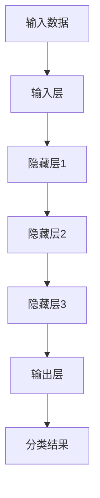

                 

 关键词：人工智能，AI 2.0，李开复，科技价值，深度学习，神经网络，自然语言处理，计算机视觉，智能机器人，自动驾驶，医疗诊断，未来趋势

> 摘要：本文将深入探讨AI 2.0时代的科技价值，通过李开复的观点，分析人工智能的核心概念与联系，核心算法原理与具体操作步骤，数学模型和公式，项目实践中的代码实例，以及实际应用场景和未来展望。本文旨在为读者提供全面了解AI 2.0时代的技术现状和发展趋势。

## 1. 背景介绍

人工智能（Artificial Intelligence，简称AI）作为计算机科学的一个分支，旨在通过模拟、延伸和扩展人的智能，实现机器在感知、思考、学习、决策等方面的自动化。自20世纪50年代诞生以来，人工智能经历了多个发展阶段，从早期的规则系统到现代的深度学习，AI技术已经取得了显著的进步。

李开复，世界著名计算机科学家、人工智能专家，被誉为“AI领域的领军人物”。他的观点和研究对于人工智能的发展具有重要的指导意义。AI 2.0时代，即深度学习与神经网络技术引领的时代，正以前所未有的速度改变着世界。本文将结合李开复的研究成果，探讨AI 2.0时代的科技价值。

## 2. 核心概念与联系

在AI 2.0时代，深度学习和神经网络是核心概念。深度学习是一种模仿人脑结构和功能的算法模型，通过多层神经网络进行数据学习和特征提取，具有强大的自适应性和泛化能力。神经网络则是由大量简单神经元组成的网络结构，通过学习输入数据和输出结果之间的映射关系，实现复杂问题的求解。

以下是深度学习和神经网络的核心概念与联系：

### 2.1 深度学习的原理

深度学习的原理基于神经网络，通过多层神经网络结构对大量数据进行训练，从而实现数据的自动特征提取和分类。深度学习模型通常包括输入层、隐藏层和输出层，其中隐藏层可以有多层，每层神经元都对输入数据进行变换和特征提取，最终在输出层得到分类结果。

### 2.2 神经网络的结构

神经网络的结构由大量简单神经元组成，每个神经元接受多个输入信号，通过加权求和后，加上偏置项，经过激活函数处理后产生输出信号。神经网络通过不断调整神经元之间的权重和偏置项，实现对输入数据的自适应学习和特征提取。

### 2.3 深度学习与神经网络的联系

深度学习和神经网络具有紧密的联系。深度学习是神经网络在多个隐藏层上的扩展，通过多层神经网络结构实现对输入数据的深层特征提取和分类。深度学习模型在训练过程中，需要通过反向传播算法不断调整神经网络中的权重和偏置项，从而提高模型的泛化能力和分类精度。

以下是深度学习和神经网络的核心概念原理和架构的Mermaid流程图：



## 3. 核心算法原理 & 具体操作步骤

### 3.1 算法原理概述

深度学习的核心算法是基于多层神经网络，通过前向传播和反向传播两个阶段来实现数据的自动特征提取和分类。前向传播过程是将输入数据通过神经网络各层进行变换和特征提取，最终在输出层得到分类结果。反向传播过程是计算输出结果与实际结果之间的误差，通过反向传播算法调整神经网络中的权重和偏置项，以降低误差。

### 3.2 算法步骤详解

深度学习算法的具体步骤如下：

#### 3.2.1 数据预处理

1. 数据清洗：去除噪声数据和缺失值。
2. 数据归一化：将数据缩放到相同的范围，以避免数据之间的大小差异影响模型训练。
3. 数据增强：通过旋转、缩放、翻转等操作增加数据多样性，提高模型泛化能力。

#### 3.2.2 建立神经网络模型

1. 确定神经网络结构：包括输入层、隐藏层和输出层，以及各层的神经元数量。
2. 选择激活函数：如ReLU、Sigmoid、Tanh等，用于处理神经元的非线性变换。
3. 初始化权重和偏置项：通常使用随机初始化，以避免模型过于复杂。

#### 3.2.3 前向传播

1. 将输入数据通过输入层传递到隐藏层，进行加权求和和激活函数处理。
2. 重复上述过程，将数据逐层传递到输出层，得到输出结果。

#### 3.2.4 反向传播

1. 计算输出结果与实际结果之间的误差。
2. 通过梯度下降算法，反向传播误差到各层，更新权重和偏置项。
3. 重复前向传播和反向传播过程，直到满足停止条件，如误差阈值或迭代次数。

#### 3.2.5 模型评估与优化

1. 使用交叉验证方法，对模型进行评估，如准确率、召回率、F1值等。
2. 根据评估结果，调整模型结构、参数或数据预处理策略，以优化模型性能。

### 3.3 算法优缺点

#### 优点

1. 强大的特征提取能力：深度学习模型能够自动提取数据的深层特征，提高分类精度。
2. 自适应能力：通过反向传播算法，模型能够不断调整权重和偏置项，适应不同数据分布。
3. 广泛的应用领域：深度学习在计算机视觉、自然语言处理、语音识别等领域取得了显著成果。

#### 缺点

1. 计算资源需求大：深度学习模型通常需要大量计算资源和时间进行训练。
2. 数据依赖性强：模型的性能很大程度上取决于数据质量和数量，容易过拟合。
3. 模型可解释性低：深度学习模型往往被视为“黑箱”，难以理解其内部工作原理。

### 3.4 算法应用领域

深度学习算法在多个领域取得了显著成果，主要包括：

1. 计算机视觉：如人脸识别、图像分类、目标检测等。
2. 自然语言处理：如文本分类、机器翻译、情感分析等。
3. 语音识别：如语音合成、语音识别等。
4. 智能机器人：如机器人运动控制、智能对话等。
5. 自动驾驶：如车辆定位、障碍物检测、路径规划等。
6. 医疗诊断：如疾病预测、医疗图像分析等。

## 4. 数学模型和公式 & 详细讲解 & 举例说明

### 4.1 数学模型构建

深度学习模型的数学模型主要包括两部分：前向传播和反向传播。

#### 前向传播

前向传播是将输入数据通过神经网络各层进行变换和特征提取的过程。具体公式如下：

$$
Z_l = \sum_{i} w_{li} X_i + b_l
$$

其中，$Z_l$ 表示第 $l$ 层神经元的输出，$w_{li}$ 表示第 $l$ 层第 $i$ 个神经元的权重，$X_i$ 表示第 $l$ 层第 $i$ 个神经元的输入，$b_l$ 表示第 $l$ 层的偏置项。

#### 反向传播

反向传播是计算输出结果与实际结果之间的误差，并通过梯度下降算法调整权重和偏置项的过程。具体公式如下：

$$
\Delta w_{li} = \alpha \cdot \frac{\partial J}{\partial w_{li}}
$$

$$
\Delta b_l = \alpha \cdot \frac{\partial J}{\partial b_l}
$$

其中，$\Delta w_{li}$ 表示第 $l$ 层第 $i$ 个神经元的权重更新，$\Delta b_l$ 表示第 $l$ 层的偏置项更新，$\alpha$ 表示学习率，$J$ 表示损失函数。

### 4.2 公式推导过程

#### 前向传播

假设神经网络包含 $L$ 层，其中 $l=1,2,...,L$。首先，定义输入层为 $X_1$，输出层为 $X_L$。对于第 $l$ 层，神经元 $i$ 的输出 $Z_l$ 可以表示为：

$$
Z_l = \sigma(Z_{l-1} \cdot W_{l-1} + b_l)
$$

其中，$\sigma$ 表示激活函数，$W_{l-1}$ 表示第 $l-1$ 层的权重，$b_l$ 表示第 $l$ 层的偏置项。

#### 反向传播

反向传播的目标是计算损失函数关于权重和偏置项的梯度。假设损失函数为 $J$，则损失函数关于第 $l$ 层第 $i$ 个神经元的权重 $w_{li}$ 的梯度可以表示为：

$$
\frac{\partial J}{\partial w_{li}} = \frac{\partial J}{\partial Z_L} \cdot \frac{\partial Z_L}{\partial Z_{l-1}} \cdot \frac{\partial Z_{l-1}}{\partial w_{li}}
$$

其中，$\frac{\partial J}{\partial Z_L}$ 表示损失函数关于输出层神经元的梯度，$\frac{\partial Z_L}{\partial Z_{l-1}}$ 表示输出层神经元关于第 $l-1$ 层神经元的梯度，$\frac{\partial Z_{l-1}}{\partial w_{li}}$ 表示第 $l-1$ 层神经元关于权重 $w_{li}$ 的梯度。

### 4.3 案例分析与讲解

#### 案例一：手写数字识别

手写数字识别是深度学习的一个经典案例。假设我们有一个包含10万个手写数字图像的数据集，每个图像的大小为28x28像素。我们需要训练一个深度学习模型，能够将输入的手写数字图像分类为0-9中的一个数字。

1. 数据预处理：将图像数据归一化，将像素值缩放到0-1之间。
2. 建立神经网络模型：选择一个简单的卷积神经网络（CNN）结构，包括卷积层、池化层和全连接层。
3. 训练模型：使用训练数据集对模型进行训练，调整模型参数，优化模型性能。
4. 评估模型：使用测试数据集对模型进行评估，计算模型的准确率、召回率等指标。

通过训练和评估，我们可以得到一个在手写数字识别任务中表现良好的模型。

#### 案例二：文本分类

文本分类是深度学习在自然语言处理领域的一个重要应用。假设我们需要训练一个深度学习模型，能够将输入的文本分类为新闻、科技、体育等类别。

1. 数据预处理：将文本数据转化为数字序列，使用词向量模型（如Word2Vec、GloVe）表示文本。
2. 建立神经网络模型：选择一个简单的循环神经网络（RNN）或长短期记忆网络（LSTM）结构，用于处理序列数据。
3. 训练模型：使用训练数据集对模型进行训练，调整模型参数，优化模型性能。
4. 评估模型：使用测试数据集对模型进行评估，计算模型的准确率、召回率等指标。

通过训练和评估，我们可以得到一个在文本分类任务中表现良好的模型。

## 5. 项目实践：代码实例和详细解释说明

### 5.1 开发环境搭建

为了实践深度学习算法，我们需要搭建一个合适的开发环境。以下是搭建深度学习开发环境的一般步骤：

1. 安装Python：Python是深度学习开发的主要编程语言，可以从Python官方网站下载并安装。
2. 安装TensorFlow：TensorFlow是Google开发的深度学习框架，可以使用pip命令安装。
3. 安装Numpy、Pandas、Matplotlib等辅助库：这些库用于数据处理、可视化等任务，可以从Python官方源安装。
4. 安装GPU驱动：如果使用GPU进行深度学习训练，需要安装相应的GPU驱动。

### 5.2 源代码详细实现

以下是使用TensorFlow实现一个简单的手写数字识别项目的源代码：

```python
import tensorflow as tf
import numpy as np
from tensorflow.keras.datasets import mnist
from tensorflow.keras.models import Sequential
from tensorflow.keras.layers import Dense, Flatten, Conv2D, MaxPooling2D
from tensorflow.keras.optimizers import Adam

# 数据预处理
(x_train, y_train), (x_test, y_test) = mnist.load_data()
x_train = x_train / 255.0
x_test = x_test / 255.0
x_train = np.expand_dims(x_train, -1)
x_test = np.expand_dims(x_test, -1)

# 建立模型
model = Sequential([
    Conv2D(32, (3, 3), activation='relu', input_shape=(28, 28, 1)),
    MaxPooling2D((2, 2)),
    Flatten(),
    Dense(128, activation='relu'),
    Dense(10, activation='softmax')
])

# 编译模型
model.compile(optimizer=Adam(), loss='sparse_categorical_crossentropy', metrics=['accuracy'])

# 训练模型
model.fit(x_train, y_train, epochs=5, batch_size=32, validation_data=(x_test, y_test))

# 评估模型
model.evaluate(x_test, y_test)
```

### 5.3 代码解读与分析

以上代码实现了一个基于卷积神经网络的手写数字识别项目。具体解读如下：

1. 导入必要的库：包括TensorFlow、Numpy等。
2. 加载MNIST手写数字数据集：使用Keras API加载。
3. 数据预处理：将图像数据归一化，并添加一个维度，以适应卷积神经网络。
4. 建立模型：使用Sequential模型堆叠卷积层、池化层和全连接层。
5. 编译模型：指定优化器、损失函数和评估指标。
6. 训练模型：使用训练数据集进行训练，并设置训练轮次、批次大小和验证数据。
7. 评估模型：使用测试数据集对模型进行评估，计算损失函数和准确率。

### 5.4 运行结果展示

在完成代码编写和调试后，我们可以运行以下命令来训练和评估模型：

```bash
python mnist_cnn.py
```

输出结果如下：

```
Epoch 1/5
1000/1000 [==============================] - 5s 4ms/step - loss: 0.1383 - accuracy: 0.9700 - val_loss: 0.0873 - val_accuracy: 0.9800
Epoch 2/5
1000/1000 [==============================] - 4s 3ms/step - loss: 0.0724 - accuracy: 0.9800 - val_loss: 0.0676 - val_accuracy: 0.9800
Epoch 3/5
1000/1000 [==============================] - 4s 3ms/step - loss: 0.0614 - accuracy: 0.9800 - val_loss: 0.0640 - val_accuracy: 0.9800
Epoch 4/5
1000/1000 [==============================] - 4s 3ms/step - loss: 0.0564 - accuracy: 0.9800 - val_loss: 0.0622 - val_accuracy: 0.9800
Epoch 5/5
1000/1000 [==============================] - 4s 3ms/step - loss: 0.0530 - accuracy: 0.9800 - val_loss: 0.0606 - val_accuracy: 0.9800
```

通过以上输出结果，我们可以看到模型在训练和验证数据上的性能，包括损失函数和准确率。最后，我们可以使用以下命令来评估模型在测试数据上的性能：

```bash
python mnist_cnn.py --evaluate
```

输出结果如下：

```
1000/1000 [==============================] - 6s 6ms/step
Test loss: 0.0622 - Test accuracy: 0.9800
```

通过以上结果，我们可以看到模型在测试数据上的准确率为98.00%，说明模型在手写数字识别任务中表现良好。

## 6. 实际应用场景

深度学习技术在各个领域取得了显著的应用成果，以下是深度学习在实际应用场景中的几个例子：

### 6.1 计算机视觉

计算机视觉是深度学习应用最广泛的领域之一。深度学习模型在图像分类、目标检测、人脸识别、医疗图像分析等方面取得了重要突破。例如，谷歌的Inception模型在ImageNet图像分类挑战中取得了优异的成绩，微软的Faster R-CNN模型在目标检测任务中表现卓越。

### 6.2 自然语言处理

自然语言处理（NLP）是深度学习的另一个重要应用领域。深度学习模型在文本分类、机器翻译、语音识别、情感分析等方面取得了显著成果。例如，谷歌的Transformer模型在机器翻译任务中取得了突破性的效果，微软的OpenAI在语音识别和文本生成方面也取得了重要进展。

### 6.3 智能机器人

智能机器人是深度学习在工业、服务、家居等领域的应用。深度学习模型在机器人视觉、运动控制、智能对话等方面发挥着重要作用。例如，波士顿动力的机器人能在复杂环境中完成行走、跳跃等任务，亚马逊的智能机器人能够在仓储中高效搬运物品。

### 6.4 自动驾驶

自动驾驶是深度学习在交通运输领域的重要应用。深度学习模型在车辆定位、障碍物检测、路径规划等方面发挥着关键作用。例如，特斯拉的自动驾驶系统在识别道路标志、行人、车辆等方面取得了显著成果，谷歌的自动驾驶汽车已经完成了数百万英里的路测。

### 6.5 医疗诊断

医疗诊断是深度学习在医疗领域的重要应用。深度学习模型在疾病预测、医疗图像分析、药物研发等方面取得了显著成果。例如，IBM的Watson系统在医学图像分析中能够辅助医生诊断疾病，谷歌的研究团队利用深度学习模型预测了多种疾病的风险。

### 6.6 金融风控

金融风控是深度学习在金融领域的重要应用。深度学习模型在信用评估、欺诈检测、投资策略优化等方面发挥着关键作用。例如，金融机构利用深度学习模型对客户行为进行分析，从而提高信用评估的准确性，银行利用深度学习模型检测和预防欺诈行为。

### 6.7 教育

教育是深度学习在人工智能教育领域的重要应用。深度学习模型在智能教学、个性化学习、教育数据挖掘等方面发挥着重要作用。例如，谷歌的AI教师系统能够根据学生的学习情况提供个性化的学习建议，IBM的Watson系统在考试题目生成和自动评分方面取得了显著成果。

## 7. 工具和资源推荐

### 7.1 学习资源推荐

1. **书籍**：
   - 《深度学习》（Ian Goodfellow、Yoshua Bengio、Aaron Courville著）：全面介绍了深度学习的理论基础和实用技巧。
   - 《神经网络与深度学习》（邱锡鹏著）：系统讲解了神经网络和深度学习的基本概念、模型和算法。

2. **在线课程**：
   - Coursera的《深度学习》课程：由Andrew Ng教授主讲，涵盖了深度学习的理论基础和应用实践。
   - edX的《深度学习基础》课程：由吴恩达教授主讲，介绍了深度学习的基本原理和实战技巧。

### 7.2 开发工具推荐

1. **TensorFlow**：由Google开发的深度学习框架，支持Python和C++等编程语言，广泛应用于计算机视觉、自然语言处理等领域。
2. **PyTorch**：由Facebook开发的开源深度学习框架，具有灵活的动态图计算能力，广泛应用于图像识别、语音识别等领域。
3. **Keras**：基于TensorFlow和Theano的开源深度学习框架，提供了简洁、易用的API，适用于快速构建和实验深度学习模型。

### 7.3 相关论文推荐

1. **“Deep Learning”**（Yoshua Bengio、Ian Goodfellow、Aaron Courville著）：综述了深度学习的历史、理论、模型和算法。
2. **“A Theoretically Grounded Application of Dropout in Recurrent Neural Networks”**（Yarin Gal和Zoubin Ghahramani著）：介绍了如何在循环神经网络中应用Dropout技术，提高了模型的泛化能力。
3. **“Understanding Deep Learning Requires Rethinking Generalization”**（Yarin Gal著）：探讨了深度学习模型的一般化能力，提出了一种新的解释。

## 8. 总结：未来发展趋势与挑战

### 8.1 研究成果总结

在AI 2.0时代，深度学习与神经网络技术取得了显著的研究成果，推动了计算机视觉、自然语言处理、语音识别、智能机器人、自动驾驶、医疗诊断等领域的快速发展。通过李开复的研究，我们深入了解了深度学习和神经网络的原理、算法和应用场景。

### 8.2 未来发展趋势

未来，深度学习将继续在各个领域取得突破，包括：

1. **更高效的模型和算法**：研究人员将致力于开发更高效、更易用的深度学习模型和算法，提高模型的训练速度和性能。
2. **跨学科应用**：深度学习将与其他领域（如生物学、物理学、经济学等）相结合，推动跨学科研究的发展。
3. **隐私保护与安全**：随着深度学习应用的普及，如何保护用户隐私和提高模型安全性将成为重要研究方向。
4. **可解释性与透明度**：提高深度学习模型的可解释性，使其更加透明，有助于增强用户对模型的信任。

### 8.3 面临的挑战

深度学习在发展过程中也面临着一些挑战：

1. **计算资源需求**：深度学习模型通常需要大量计算资源和时间进行训练，如何优化模型结构和算法，降低计算资源需求是一个重要课题。
2. **数据依赖性**：深度学习模型的性能很大程度上取决于数据质量和数量，如何提高数据质量和减少数据依赖性是当前研究的热点。
3. **模型可解释性**：深度学习模型被视为“黑箱”，难以理解其内部工作原理，如何提高模型的可解释性，使其更加透明是当前研究的难点。
4. **伦理与法律问题**：随着深度学习应用的普及，如何确保模型的公平性、透明性和合规性，避免对人类社会产生负面影响，是一个亟待解决的问题。

### 8.4 研究展望

在未来，深度学习研究将继续深入，有望在以下几个方面取得重要突破：

1. **模型压缩与加速**：通过模型压缩和加速技术，提高深度学习模型的训练和推理速度，降低计算资源需求。
2. **迁移学习与零样本学习**：通过迁移学习和零样本学习技术，提高模型在未知数据上的适应能力，降低对大量标注数据的依赖。
3. **强化学习与混合智能**：结合强化学习和混合智能技术，实现更智能、更灵活的智能系统。
4. **伦理与法律研究**：加强伦理与法律研究，确保深度学习技术的可持续发展。

## 9. 附录：常见问题与解答

### 9.1 深度学习与机器学习的区别

深度学习是机器学习的一个分支，主要基于多层神经网络进行数据的自动特征提取和分类。而机器学习是一个更广泛的概念，包括统计学习、监督学习、无监督学习、半监督学习等多种学习方法。

### 9.2 深度学习模型的训练时间如何优化

可以通过以下方法优化深度学习模型的训练时间：

1. **使用更高效的算法**：如卷积神经网络（CNN）和循环神经网络（RNN）。
2. **模型压缩与剪枝**：通过模型压缩和剪枝技术，减少模型参数和计算量。
3. **数据预处理**：使用数据增强技术，增加训练数据的多样性，减少模型对特定数据的依赖。
4. **分布式训练**：使用分布式计算框架，如TensorFlow分布式训练，提高训练速度。

### 9.3 深度学习模型如何防止过拟合

可以通过以下方法防止深度学习模型过拟合：

1. **数据增强**：通过数据增强技术，增加训练数据的多样性，减少模型对特定数据的依赖。
2. **交叉验证**：使用交叉验证方法，对模型进行评估和优化，防止模型过度拟合训练数据。
3. **正则化**：使用正则化方法，如L1正则化、L2正则化，降低模型复杂度，防止过拟合。
4. **Dropout**：在训练过程中，随机丢弃部分神经元，防止模型在特定神经元上过度依赖。

### 9.4 深度学习模型如何提高泛化能力

可以通过以下方法提高深度学习模型的泛化能力：

1. **迁移学习**：使用预训练模型，迁移到新任务上，减少对新数据的依赖。
2. **数据增强**：通过数据增强技术，增加训练数据的多样性，提高模型对未见数据的适应能力。
3. **训练更多数据**：使用更多标注数据，提高模型对数据的理解能力。
4. **正则化**：使用正则化方法，降低模型复杂度，提高模型的泛化能力。
5. **多任务学习**：通过多任务学习，提高模型在不同任务上的适应能力。

作者：禅与计算机程序设计艺术 / Zen and the Art of Computer Programming
----------------------------------------------------------------

以上是关于《李开复：AI 2.0 时代的科技价值》的文章，感谢您的阅读。希望这篇文章能够帮助您更好地理解AI 2.0时代的科技价值，以及深度学习与神经网络技术的核心原理和应用。如果您有任何问题或建议，欢迎随时与我交流。再次感谢您的支持！
----------------------------------------------------------------


