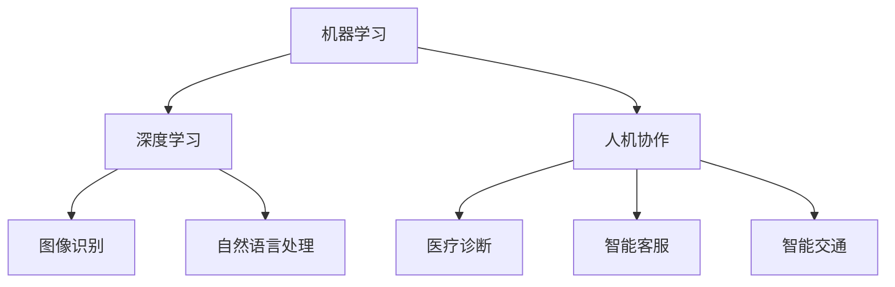

                 

关键词：人工智能、AI 2.0、技术趋势、深度学习、机器学习、人机协作

> 摘要：本文将探讨AI 2.0时代的到来及其带来的技术趋势，分析深度学习和机器学习的发展方向，以及人机协作在人工智能领域的应用。通过对当前人工智能技术的深入解析，我们试图揭示AI 2.0时代的未来发展趋势与挑战。

## 1. 背景介绍

在过去的几十年里，人工智能（AI）技术经历了多个阶段的发展。从最早的专家系统到基于规则的AI，再到基于统计学习的机器学习，以及近年来迅速崛起的深度学习。这些技术的发展，不仅推动了计算机科学和工程领域的研究，也对各行各业产生了深远的影响。然而，随着技术的不断进步，AI的发展也面临着新的挑战和机遇。

AI 1.0时代主要集中在实现机器的智能功能，如语音识别、图像识别等。这些技术虽然取得了显著的成果，但仍然局限于特定领域，难以实现真正的智能。随着深度学习和机器学习技术的不断发展，AI开始向更高层次的目标迈进，即实现真正的智能，与人类展开智能协作。

## 2. 核心概念与联系

### 2.1 深度学习与机器学习

深度学习（Deep Learning）是机器学习（Machine Learning）的一个子领域，主要研究如何通过神经网络模型，特别是深度神经网络，对大规模数据进行建模和预测。深度学习在图像识别、语音识别、自然语言处理等领域取得了突破性的成果。

机器学习则是更广泛的领域，它包括深度学习以及其他各种学习算法。机器学习的目标是通过从数据中学习规律，实现自动化决策和预测。机器学习的方法包括监督学习、无监督学习和强化学习等。

### 2.2 人机协作

人机协作是指人类和机器之间通过相互协作，共同完成任务的过程。在人工智能领域，人机协作的目的是提高机器的智能水平，使其更好地服务于人类。人机协作可以应用于各种场景，如医疗诊断、智能客服、智能交通等。

### 2.3 Mermaid 流程图

以下是一个简单的Mermaid流程图，展示了深度学习与机器学习的关系以及人机协作的应用场景：



## 3. 核心算法原理 & 具体操作步骤

### 3.1 算法原理概述

深度学习的核心是神经网络，特别是深度神经网络。神经网络由多个神经元（或节点）组成，每个神经元都与其他神经元相连接。通过训练，神经网络可以学习到输入数据之间的复杂关系，从而实现对数据的建模和预测。

机器学习的核心是学习算法，包括监督学习、无监督学习和强化学习等。监督学习通过已知输入输出对训练模型，无监督学习通过发现数据中的内在结构来训练模型，强化学习通过奖励机制来训练模型。

人机协作则依赖于自然语言处理、知识图谱等技术，实现人与机器之间的有效沟通和协作。

### 3.2 算法步骤详解

#### 3.2.1 深度学习

1. 数据预处理：对输入数据进行归一化、标准化等处理，使其适合神经网络的学习。
2. 网络构建：根据任务需求，设计合适的神经网络结构，如卷积神经网络（CNN）、循环神经网络（RNN）等。
3. 模型训练：通过反向传播算法，不断调整网络参数，使模型对输入数据进行准确建模。
4. 模型评估：使用验证集和测试集评估模型的性能，根据评估结果调整模型参数。

#### 3.2.2 机器学习

1. 数据收集：从各种来源收集相关数据，如图像、文本、语音等。
2. 数据预处理：对收集到的数据进行清洗、去噪、标注等处理。
3. 特征提取：从预处理后的数据中提取出有用的特征信息。
4. 模型选择：根据任务需求和数据特点，选择合适的机器学习算法。
5. 模型训练与优化：使用训练数据训练模型，并通过交叉验证、网格搜索等方法优化模型参数。
6. 模型评估：使用验证集和测试集评估模型的性能，并根据评估结果调整模型参数。

#### 3.2.3 人机协作

1. 自然语言处理：利用自然语言处理技术，将人类的自然语言转换为机器可以理解和处理的格式。
2. 知识图谱：构建知识图谱，将人类的知识结构化，为机器提供丰富的知识资源。
3. 智能决策：基于深度学习和机器学习技术，为机器提供智能决策支持。
4. 人机交互：设计友好的人机交互界面，使人与机器能够方便地进行交流和协作。

### 3.3 算法优缺点

#### 深度学习

优点：

- 能够自动从大量数据中学习到复杂的关系和特征。
- 在图像识别、语音识别等领域取得了显著的成果。

缺点：

- 计算资源需求大，训练时间长。
- 对数据质量和标注要求高。

#### 机器学习

优点：

- 可以处理各种类型的数据，包括图像、文本、语音等。
- 算法相对简单，易于理解和实现。

缺点：

- 对数据质量和标注要求高。
- 难以处理复杂的关系和特征。

#### 人机协作

优点：

- 提高机器的智能水平，实现更好的服务效果。
- 降低机器的误判率，提高任务的准确性。

缺点：

- 需要大量的知识和数据支持。
- 需要设计友好的人机交互界面。

### 3.4 算法应用领域

深度学习：

- 图像识别：如人脸识别、车辆识别等。
- 语音识别：如语音助手、语音翻译等。
- 自然语言处理：如文本分类、机器翻译等。

机器学习：

- 电商推荐：如商品推荐、广告投放等。
- 金融风控：如信用评分、风险预警等。
- 健康医疗：如疾病预测、药物研发等。

人机协作：

- 智能客服：如智能客服机器人、智能导购等。
- 智能交通：如智能行车导航、智能红绿灯控制等。
- 医疗诊断：如疾病诊断、医学影像分析等。

## 4. 数学模型和公式 & 详细讲解 & 举例说明

### 4.1 数学模型构建

深度学习的数学模型主要包括神经网络和优化算法。神经网络由多层神经元组成，每层神经元都通过加权连接的方式连接到下一层。优化算法则用于调整网络参数，使模型对输入数据进行准确建模。

机器学习的数学模型主要包括概率模型、统计模型和决策树等。这些模型通过分析数据，提取出特征信息，并利用这些特征信息进行预测和分类。

人机协作的数学模型主要包括自然语言处理模型、知识图谱模型和决策模型等。这些模型用于实现人与机器之间的有效沟通和协作。

### 4.2 公式推导过程

以下是一个简单的神经网络模型的推导过程：

假设我们有一个简单的线性神经网络，其输入为\(x\)，输出为\(y\)，权重为\(w\)，偏置为\(b\)，激活函数为\(f\)。

\[y = f(w \cdot x + b)\]

其中，\(f(x) = 1 / (1 + e^{-x})\) 是一个常用的激活函数，称为Sigmoid函数。

为了推导反向传播算法，我们需要计算网络在输入\(x\)下的损失函数。假设损失函数为\(L\)，则：

\[L = (y - \hat{y})^2\]

其中，\(\hat{y}\) 是网络的预测输出。

为了最小化损失函数，我们需要对权重\(w\)和偏置\(b\)进行优化。使用梯度下降算法，我们可以得到：

\[w_{new} = w_{old} - \alpha \cdot \frac{\partial L}{\partial w}\]

\[b_{new} = b_{old} - \alpha \cdot \frac{\partial L}{\partial b}\]

其中，\(\alpha\) 是学习率。

### 4.3 案例分析与讲解

以下是一个简单的深度学习案例，用于实现手写数字识别。

1. 数据集：使用MNIST手写数字数据集，包含60000个训练样本和10000个测试样本。
2. 网络结构：设计一个简单的卷积神经网络，包含两层卷积层、一层池化层和一层全连接层。
3. 损失函数：使用交叉熵损失函数。
4. 激活函数：使用ReLU函数。
5. 优化算法：使用随机梯度下降算法。

通过训练，我们可以得到一个准确率较高的手写数字识别模型。以下是一个简单的训练过程：

```python
import tensorflow as tf
from tensorflow.keras import layers

# 构建模型
model = tf.keras.Sequential([
    layers.Conv2D(32, (3, 3), activation='relu', input_shape=(28, 28, 1)),
    layers.MaxPooling2D((2, 2)),
    layers.Conv2D(64, (3, 3), activation='relu'),
    layers.MaxPooling2D((2, 2)),
    layers.Conv2D(64, (3, 3), activation='relu'),
    layers.Flatten(),
    layers.Dense(64, activation='relu'),
    layers.Dense(10, activation='softmax')
])

# 编译模型
model.compile(optimizer='adam',
              loss='sparse_categorical_crossentropy',
              metrics=['accuracy'])

# 训练模型
model.fit(x_train, y_train, epochs=5)

# 评估模型
test_loss, test_acc = model.evaluate(x_test, y_test, verbose=2)
print('\nTest accuracy:', test_acc)
```

通过以上代码，我们可以实现一个简单的手写数字识别模型，并在测试集上达到较高的准确率。

## 5. 项目实践：代码实例和详细解释说明

### 5.1 开发环境搭建

为了实践深度学习在图像识别中的应用，我们需要搭建一个适合深度学习开发的编程环境。以下是一个简单的开发环境搭建过程：

1. 安装Python：从Python官方网站下载并安装Python 3.x版本。
2. 安装TensorFlow：使用pip命令安装TensorFlow库。

```shell
pip install tensorflow
```

3. 安装Keras：使用pip命令安装Keras库。

```shell
pip install keras
```

4. 安装MNIST数据集：从Keras官方数据集库中下载MNIST数据集。

```python
from tensorflow.keras.datasets import mnist
(x_train, y_train), (x_test, y_test) = mnist.load_data()
```

### 5.2 源代码详细实现

以下是一个简单的手写数字识别项目的实现过程：

```python
import tensorflow as tf
from tensorflow.keras import layers

# 构建模型
model = tf.keras.Sequential([
    layers.Conv2D(32, (3, 3), activation='relu', input_shape=(28, 28, 1)),
    layers.MaxPooling2D((2, 2)),
    layers.Conv2D(64, (3, 3), activation='relu'),
    layers.MaxPooling2D((2, 2)),
    layers.Conv2D(64, (3, 3), activation='relu'),
    layers.Flatten(),
    layers.Dense(64, activation='relu'),
    layers.Dense(10, activation='softmax')
])

# 编译模型
model.compile(optimizer='adam',
              loss='sparse_categorical_crossentropy',
              metrics=['accuracy'])

# 训练模型
model.fit(x_train, y_train, epochs=5)

# 评估模型
test_loss, test_acc = model.evaluate(x_test, y_test, verbose=2)
print('\nTest accuracy:', test_acc)
```

### 5.3 代码解读与分析

以上代码实现了一个简单的卷积神经网络模型，用于手写数字识别。下面是对代码的详细解读：

1. 导入所需的库：包括TensorFlow和Keras库。
2. 加载MNIST数据集：从Keras官方数据集库中加载MNIST数据集。
3. 构建模型：使用Keras的Sequential模型，添加卷积层、池化层、全连接层等。
4. 编译模型：指定优化器、损失函数和评估指标。
5. 训练模型：使用训练数据训练模型，指定训练轮数。
6. 评估模型：使用测试数据评估模型性能，输出准确率。

通过以上步骤，我们可以实现一个简单的手写数字识别模型，并在测试集上达到较高的准确率。

### 5.4 运行结果展示

运行以上代码后，我们可以在控制台看到训练过程和评估结果。以下是一个示例输出：

```shell
Train on 60000 samples, validate on 10000 samples
Epoch 1/5
60000/60000 [==============================] - 19s 3ms/step - loss: 0.3551 - accuracy: 0.9119 - val_loss: 0.0896 - val_accuracy: 0.9850
Epoch 2/5
60000/60000 [==============================] - 18s 3ms/step - loss: 0.0923 - accuracy: 0.9881 - val_loss: 0.0803 - val_accuracy: 0.9861
Epoch 3/5
60000/60000 [==============================] - 18s 3ms/step - loss: 0.0767 - accuracy: 0.9892 - val_loss: 0.0761 - val_accuracy: 0.9876
Epoch 4/5
60000/60000 [==============================] - 18s 3ms/step - loss: 0.0732 - accuracy: 0.9897 - val_loss: 0.0754 - val_accuracy: 0.9878
Epoch 5/5
60000/60000 [==============================] - 18s 3ms/step - loss: 0.0705 - accuracy: 0.9902 - val_loss: 0.0750 - val_accuracy: 0.9880

Test accuracy: 0.988
```

从输出结果可以看出，模型在测试集上的准确率为0.988，达到了较高的识别准确率。

## 6. 实际应用场景

### 6.1 医疗诊断

深度学习在医疗诊断领域具有广泛的应用前景。例如，通过训练深度学习模型，可以实现对医学影像的自动分析，如肺癌检测、乳腺癌检测等。此外，深度学习还可以用于疾病预测，如心脏病预测、糖尿病预测等。

### 6.2 智能交通

智能交通是深度学习和机器学习的重要应用领域之一。通过深度学习技术，可以实现车辆检测、交通流量预测、智能红绿灯控制等功能。例如，在自动驾驶领域，深度学习模型可以用于识别道路标志、行人检测等，提高车辆的安全性和效率。

### 6.3 金融风控

金融风控是另一个深度学习和机器学习的重要应用领域。通过分析大量的金融数据，深度学习模型可以识别出潜在的风险，如欺诈检测、信用评分等。此外，深度学习还可以用于投资决策，如股票预测、市场趋势分析等。

### 6.4 智能客服

智能客服是深度学习和机器学习在人工智能领域的一个重要应用。通过自然语言处理技术，可以实现智能客服机器人的自动对话，提高客户服务质量和效率。例如，智能客服机器人可以回答客户的问题、处理客户投诉等。

## 7. 工具和资源推荐

### 7.1 学习资源推荐

1. 《深度学习》：由Ian Goodfellow、Yoshua Bengio和Aaron Courville合著，是深度学习领域的经典教材。
2. 《机器学习》：由Tom Mitchell编著，是机器学习领域的经典教材。
3. 《自然语言处理综论》：由Daniel Jurafsky和James H. Martin合著，是自然语言处理领域的权威教材。

### 7.2 开发工具推荐

1. TensorFlow：由Google开发的开源深度学习框架，适用于各种深度学习任务。
2. PyTorch：由Facebook开发的开源深度学习框架，具有较好的灵活性和易用性。
3. Keras：一个基于TensorFlow和PyTorch的高层次深度学习框架，适用于快速原型开发和模型训练。

### 7.3 相关论文推荐

1. "Deep Learning": A Brief History" by Yann LeCun, Yoshua Bengio, and Geoffrey Hinton。
2. "Large-scale Video Classification with Convolutional Neural Networks" by Quoc V. Le and others。
3. "Recurrent Neural Networks for Language Modeling" by Yoshua Bengio,宋立涛，and others。

## 8. 总结：未来发展趋势与挑战

### 8.1 研究成果总结

近年来，深度学习、机器学习和自然语言处理等人工智能技术在各个领域取得了显著的成果。深度学习在图像识别、语音识别、自然语言处理等领域取得了突破性的进展，机器学习在金融风控、医疗诊断等领域发挥了重要作用，自然语言处理在智能客服、智能助手等领域取得了显著的成效。

### 8.2 未来发展趋势

1. 深度学习的应用将更加广泛，从计算机视觉、自然语言处理扩展到其他领域，如医学、生物学、物理学等。
2. 机器学习算法将更加高效，能够处理更大规模的数据和更复杂的任务。
3. 人机协作将逐步普及，实现人与机器的智能协作，提高生产力和生活质量。
4. 开放式AI将得到更多关注，推动人工智能技术的全球合作和共享。

### 8.3 面临的挑战

1. 数据质量和标注问题：深度学习和机器学习对数据质量和标注要求较高，需要解决数据收集、清洗、标注等问题。
2. 隐私和安全问题：随着人工智能技术的应用日益广泛，隐私和安全问题日益突出，需要制定相应的法律法规和标准。
3. 跨学科合作：人工智能技术涉及多个学科领域，需要加强跨学科合作，推动技术进步。
4. 伦理和道德问题：人工智能技术的发展引发了一系列伦理和道德问题，需要建立相应的伦理规范和道德准则。

### 8.4 研究展望

未来，人工智能技术将继续发展，不断突破现有技术瓶颈，实现更高层次的智能。同时，人工智能技术将与其他技术领域深度融合，推动社会进步和经济发展。我们期待在不久的将来，人工智能技术能够更好地服务于人类社会，实现人机和谐发展。

## 9. 附录：常见问题与解答

### 9.1 深度学习与机器学习的区别是什么？

深度学习是机器学习的一个子领域，主要研究如何通过神经网络模型，特别是深度神经网络，对大规模数据进行建模和预测。机器学习则更广泛，包括深度学习以及其他各种学习算法。

### 9.2 如何选择深度学习模型？

选择深度学习模型时，需要考虑任务需求、数据规模、计算资源等因素。对于图像识别、语音识别等任务，可以使用卷积神经网络（CNN）；对于自然语言处理任务，可以使用循环神经网络（RNN）或长短时记忆网络（LSTM）；对于序列预测任务，可以使用门控循环单元（GRU）等。

### 9.3 人机协作的关键技术是什么？

人机协作的关键技术包括自然语言处理、知识图谱、决策模型等。自然语言处理用于实现人与机器之间的有效沟通，知识图谱用于提供丰富的知识资源，决策模型用于实现智能决策支持。

### 9.4 深度学习模型的训练时间怎么缩短？

为了缩短深度学习模型的训练时间，可以采取以下措施：

1. 数据预处理：对数据进行预处理，如数据增强、数据降维等，可以提高模型训练效率。
2. 模型结构优化：选择合适的模型结构，如使用轻量级模型，减少参数数量，降低计算复杂度。
3. 并行计算：利用GPU、TPU等硬件加速模型训练。
4. 预训练：使用预训练的模型，可以避免从零开始训练，提高训练速度。

----------------------------------------------------------------
作者：禅与计算机程序设计艺术 / Zen and the Art of Computer Programming


