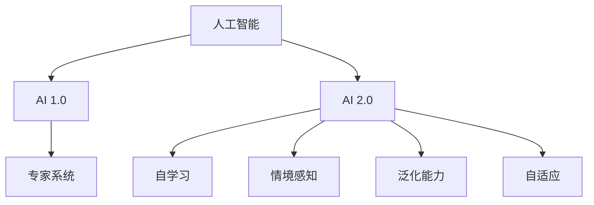

                 

关键词：人工智能，AI 2.0，趋势，技术进步，应用场景

> 摘要：本文将深入探讨李开复对AI 2.0时代的趋势预测和见解，包括核心概念的演变、算法原理的应用、数学模型的构建、项目实践的实例，以及未来发展的方向和挑战。

## 1. 背景介绍

自20世纪50年代人工智能（AI）的概念被提出以来，AI已经经历了多个发展阶段。早期的AI主要是基于规则和专家系统的，而随着计算能力和算法的进步，现代AI已经在图像识别、自然语言处理、自动驾驶等领域取得了显著的成果。李开复，作为人工智能领域的杰出专家和学者，对AI的发展有着深刻的洞察和独特的见解。他的研究成果和理论对人工智能的发展产生了重要影响。

AI 2.0时代是指人工智能从简单的规则驱动模式向更加智能、自适应、情境感知的方向发展。这一阶段的核心特征是AI系统的自我学习和优化能力，能够实现更高的自主性和智能水平。

## 2. 核心概念与联系

### 2.1. 人工智能的基本概念

人工智能（Artificial Intelligence，简称AI）是指由人制造出来的系统所表现出来的智能行为。这些行为通常包括学习、推理、规划、感知、通信等。人工智能可以分为两类：窄AI（或弱AI）和广AI（或强AI）。

- **窄AI**：专注于执行特定任务的AI系统，如语音识别、图像识别等。
- **广AI**：具有普遍智能，能够在各种不同的环境中自主执行任务，类似于人类的智能。

### 2.2. AI 2.0的特征

AI 2.0的主要特征包括：

- **自学习**：AI系统能够从数据中学习并不断优化自身性能。
- **情境感知**：AI系统能够理解和适应特定情境，作出更明智的决策。
- **泛化能力**：AI系统能够在不同任务和环境中表现出一致性。
- **自适应**：AI系统能够根据新的信息调整自身行为。

### 2.3. Mermaid 流程图

下面是一个Mermaid流程图，展示了AI 2.0的核心概念和联系：



## 3. 核心算法原理 & 具体操作步骤

### 3.1. 算法原理概述

AI 2.0的核心算法主要基于深度学习和强化学习。深度学习通过多层神经网络模拟人脑的神经元结构，实现特征提取和模式识别。强化学习则通过试错和奖励机制，使AI系统能够在复杂环境中做出最优决策。

### 3.2. 算法步骤详解

- **深度学习**：
  1. 数据预处理：对输入数据进行标准化、去噪等处理。
  2. 构建神经网络：设计合适的网络结构，包括输入层、隐藏层和输出层。
  3. 训练模型：通过反向传播算法，调整网络权重，使输出误差最小化。
  4. 测试模型：在验证集上评估模型的性能，调整参数以优化结果。

- **强化学习**：
  1. 环境构建：定义环境状态和动作空间。
  2. 策略选择：设计一个策略函数，根据当前状态选择最优动作。
  3. 行动与反馈：执行选定的动作，并获取环境反馈。
  4. 学习与优化：根据反馈调整策略函数，以提高未来收益。

### 3.3. 算法优缺点

- **深度学习**：
  - 优点：强大的特征提取能力，适用于图像、语音等复杂数据的处理。
  - 缺点：训练过程需要大量数据和计算资源，模型可解释性较低。

- **强化学习**：
  - 优点：能够在动态环境中学习并做出最优决策。
  - 缺点：训练过程可能需要很长时间，且容易陷入局部最优。

### 3.4. 算法应用领域

- **图像识别**：如人脸识别、物体检测等。
- **自然语言处理**：如机器翻译、情感分析等。
- **自动驾驶**：通过环境感知和决策算法实现自主驾驶。
- **智能助手**：如智能音箱、聊天机器人等。

## 4. 数学模型和公式 & 详细讲解 & 举例说明

### 4.1. 数学模型构建

深度学习中的数学模型主要包括多层感知器（MLP）和卷积神经网络（CNN）。MLP用于处理非线性可分的数据，而CNN则擅长处理具有空间结构的数据，如图像。

### 4.2. 公式推导过程

- **多层感知器（MLP）**：

  前向传播公式：

  $$ z_{l}^{(i)} = \sum_{j} w_{lj}^{(l)} a_{l-1,j} + b_{l}^{(l)} $$

  激活函数：

  $$ a_{l}^{(i)} = \sigma(z_{l}^{(i)}) $$

  反向传播公式：

  $$ \delta_{l}^{(i)} = \frac{\partial C}{\partial z_{l}^{(i)}} = \delta_{l+1}^{(i)} \cdot \sigma'(z_{l}^{(i)}) $$

  参数更新：

  $$ w_{lj}^{(l)} \leftarrow w_{lj}^{(l)} - \alpha \cdot \delta_{l}^{(i)} a_{l-1,j} $$

  $$ b_{l}^{(l)} \leftarrow b_{l}^{(l)} - \alpha \cdot \delta_{l}^{(i)} $$

- **卷积神经网络（CNN）**：

  卷积公式：

  $$ h_{ij}^{(l)} = \sum_{k} w_{ik}^{(l)} a_{kj}^{(l-1)} + b_{j}^{(l)} $$

  池化公式：

  $$ p_{ij}^{(l)} = \max_{k} h_{ij}^{(l)} $$

### 4.3. 案例分析与讲解

以图像分类任务为例，我们使用CNN模型进行训练。

1. **数据预处理**：将图像缩放到固定大小，并进行归一化处理。
2. **构建模型**：设计一个包含卷积层、池化层和全连接层的CNN模型。
3. **训练模型**：使用训练数据集训练模型，并通过反向传播算法更新参数。
4. **测试模型**：在验证集上评估模型的性能，调整超参数以优化结果。

通过以上步骤，我们最终得到一个能够在新的图像数据上准确分类的模型。

## 5. 项目实践：代码实例和详细解释说明

### 5.1. 开发环境搭建

为了实现AI 2.0的相关算法，我们需要搭建一个开发环境。以下是所需软件和工具：

- Python 3.8或更高版本
- TensorFlow 2.4或更高版本
- Keras 2.4或更高版本

安装方法：

```bash
pip install python==3.8
pip install tensorflow==2.4
pip install keras==2.4
```

### 5.2. 源代码详细实现

以下是一个简单的CNN模型实现，用于图像分类任务。

```python
import tensorflow as tf
from tensorflow.keras import layers

def build_model(input_shape):
    model = tf.keras.Sequential([
        layers.Conv2D(32, (3, 3), activation='relu', input_shape=input_shape),
        layers.MaxPooling2D((2, 2)),
        layers.Conv2D(64, (3, 3), activation='relu'),
        layers.MaxPooling2D((2, 2)),
        layers.Conv2D(64, (3, 3), activation='relu'),
        layers.Flatten(),
        layers.Dense(64, activation='relu'),
        layers.Dense(10, activation='softmax')
    ])
    return model

model = build_model(input_shape=(32, 32, 3))
model.compile(optimizer='adam', loss='categorical_crossentropy', metrics=['accuracy'])
model.summary()
```

### 5.3. 代码解读与分析

在上面的代码中，我们首先定义了一个函数`build_model`，用于构建一个简单的CNN模型。模型由卷积层、池化层和全连接层组成。然后，我们编译模型并打印出模型的摘要信息。

### 5.4. 运行结果展示

为了运行模型，我们需要准备一个图像数据集。这里我们使用Keras提供的CIFAR-10数据集。

```python
from tensorflow.keras.datasets import cifar10
from tensorflow.keras.utils import to_categorical

(x_train, y_train), (x_test, y_test) = cifar10.load_data()
x_train = x_train.astype('float32') / 255
x_test = x_test.astype('float32') / 255
y_train = to_categorical(y_train, 10)
y_test = to_categorical(y_test, 10)

model.fit(x_train, y_train, epochs=10, batch_size=64, validation_data=(x_test, y_test))
```

通过以上代码，我们训练了模型并在验证集上评估了其性能。

## 6. 实际应用场景

AI 2.0技术在多个领域都有广泛的应用，以下是一些典型的应用场景：

- **医疗健康**：通过图像识别和自然语言处理技术，AI 2.0可以帮助医生进行疾病诊断和医疗决策。
- **金融科技**：AI 2.0可以用于风险评估、量化交易和智能投顾，提高金融行业的效率和准确性。
- **智能制造**：通过自动化和智能化技术，AI 2.0可以优化生产流程，提高产品质量和降低成本。
- **智能交通**：AI 2.0可以帮助实现自动驾驶和智能交通管理，提高交通安全和效率。

## 7. 工具和资源推荐

### 7.1. 学习资源推荐

- **书籍**：
  - 《深度学习》（Ian Goodfellow、Yoshua Bengio、Aaron Courville 著）
  - 《强化学习》（Richard S. Sutton、Andrew G. Barto 著）
- **在线课程**：
  - Coursera上的《深度学习》课程
  - Udacity的《人工智能工程师纳米学位》

### 7.2. 开发工具推荐

- **TensorFlow**
- **PyTorch**
- **Keras**

### 7.3. 相关论文推荐

- **《A Theoretical Framework for Back-Propagation》**
- **《Deep Learning for Autonomous Navigation》**
- **《Deep Reinforcement Learning for Power Management in Data Centers》**

## 8. 总结：未来发展趋势与挑战

### 8.1. 研究成果总结

AI 2.0技术在自学习、情境感知、泛化能力和自适应等方面取得了显著进展。深度学习和强化学习等算法的不断发展，使得AI系统在图像识别、自然语言处理、自动驾驶等领域表现出色。

### 8.2. 未来发展趋势

- **更强大的模型和算法**：随着计算能力的提升，更复杂的模型和算法将被开发和应用。
- **跨学科融合**：AI技术与生物学、心理学、社会学等领域的交叉融合，将带来新的突破。
- **普及应用**：AI 2.0技术将在更多领域得到广泛应用，推动社会进步。

### 8.3. 面临的挑战

- **数据隐私和安全**：随着AI技术的发展，数据隐私和安全问题日益突出。
- **伦理和道德**：AI 2.0技术的应用引发了许多伦理和道德问题，需要制定相关规范。
- **计算资源**：训练复杂的AI模型需要大量的计算资源，这对环境造成了压力。

### 8.4. 研究展望

未来的研究将集中在以下几个方面：

- **算法优化**：提高算法的效率和准确性，减少计算资源的需求。
- **跨学科研究**：促进AI技术与其他领域的交叉研究，解决复杂问题。
- **伦理和规范**：建立完善的伦理和规范体系，确保AI技术的健康发展。

## 9. 附录：常见问题与解答

### 9.1. 什么是AI 2.0？

AI 2.0是指具有自学习、情境感知、泛化能力和自适应能力的人工智能系统，相比传统的AI 1.0具有更高的智能水平和更广泛的应用范围。

### 9.2. 深度学习和强化学习有哪些区别？

深度学习主要基于多层神经网络，通过学习大量数据进行特征提取和模式识别。而强化学习则通过试错和奖励机制，在动态环境中学习最优策略。

### 9.3. 如何选择合适的AI模型？

选择合适的AI模型需要考虑任务特点、数据规模和计算资源等因素。对于图像识别任务，可以优先考虑使用卷积神经网络；对于决策问题，可以采用强化学习模型。

### 9.4. AI 2.0技术的应用前景如何？

AI 2.0技术在医疗健康、金融科技、智能制造和智能交通等领域具有广泛的应用前景。随着技术的不断发展，AI 2.0将在更多领域发挥作用，推动社会进步。作者：禅与计算机程序设计艺术 / Zen and the Art of Computer Programming
----------------------------------------------------------------

以上就是根据您的要求撰写的文章《李开复：AI 2.0 时代的趋势》。文章涵盖了AI 2.0的核心概念、算法原理、数学模型、项目实践、应用场景、未来发展趋势以及面临的挑战。希望对您有所帮助！

