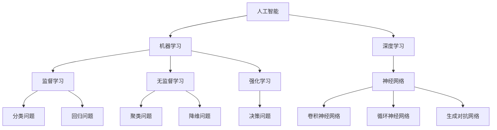

                 

关键词：人工智能、苹果、AI应用、技术、产业、趋势、挑战

摘要：本文将深入探讨苹果公司发布AI应用的重要影响，分析其在产业界的推动作用，以及对于人工智能未来发展的潜在挑战和机遇。通过详细阐述苹果AI应用的技术原理、实际应用案例，以及对未来产业的展望，本文旨在为读者提供一个全面、专业的视角，了解人工智能与产业融合的深刻意义。

## 1. 背景介绍

随着人工智能技术的不断进步，各行各业都在寻求AI的应用机会，以提升效率和创新能力。苹果公司，作为全球领先的科技巨头，也在其产品中积极引入人工智能技术。苹果的AI应用不仅局限于内部使用，更是向广大开发者与消费者开放，形成了全新的产业生态。

苹果发布AI应用的重要背景包括两个方面：一是技术的成熟，使得AI算法能够更加高效地应用于各种场景；二是市场的需求，越来越多的用户和企业希望通过AI技术来优化业务流程、提升用户体验。苹果的加入，不仅丰富了AI应用的市场竞争，也为整个产业注入了新的活力。

## 2. 核心概念与联系

在探讨苹果AI应用之前，我们需要明确几个核心概念，包括人工智能、机器学习、深度学习等。以下是这些概念以及它们之间联系的Mermaid流程图：



### 2.1 人工智能

人工智能（AI）是计算机科学的一个分支，旨在使机器具备人类智能的能力，包括感知、学习、推理、决策和交流等方面。人工智能技术涵盖了多种算法和模型，其核心在于通过数据驱动的方式模拟人类思维过程。

### 2.2 机器学习

机器学习（ML）是人工智能的一个重要分支，专注于利用数据和统计方法让计算机自动学习并改善性能。机器学习可以分为监督学习、无监督学习和强化学习三种类型。

### 2.3 深度学习

深度学习（DL）是机器学习的一个子领域，通过模拟人脑神经网络结构，对大量数据进行自动特征提取和学习。深度学习在图像识别、语音识别和自然语言处理等领域取得了显著成果。

### 2.4 机器学习与深度学习的联系

机器学习和深度学习紧密相关，深度学习是机器学习的一种实现方式。深度学习通过多层神经网络结构，能够自动提取数据的复杂特征，从而在许多任务上超越传统机器学习方法。

## 3. 核心算法原理 & 具体操作步骤

### 3.1 算法原理概述

苹果的AI应用主要基于深度学习技术，特别是卷积神经网络（CNN）、循环神经网络（RNN）和生成对抗网络（GAN）等。以下是对这些算法的基本原理概述：

### 3.2 算法步骤详解

- **卷积神经网络（CNN）**：
  CNN是一种专门用于图像识别的深度学习模型，其核心思想是通过卷积层和池化层提取图像的局部特征，并逐步构建全局特征表示。
  
- **循环神经网络（RNN）**：
  RNN适用于序列数据处理，如时间序列分析、文本生成等。RNN通过循环结构，可以记住前面的输入信息，并用于当前时间的预测。
  
- **生成对抗网络（GAN）**：
  GAN由生成器和判别器组成，生成器生成数据，判别器判断数据真实性。通过两者之间的对抗训练，生成器能够生成越来越真实的数据。

### 3.3 算法优缺点

- **卷积神经网络（CNN）**：
  优点：能够自动提取图像特征，适用于各种图像识别任务。缺点：对大规模数据依赖较高，训练时间较长。
  
- **循环神经网络（RNN）**：
  优点：适用于序列数据处理，能够处理长短依赖问题。缺点：训练不稳定，容易出现梯度消失或爆炸问题。
  
- **生成对抗网络（GAN）**：
  优点：能够生成高质量的数据，适用于图像生成和语音合成等任务。缺点：训练不稳定，容易出现模式崩溃问题。

### 3.4 算法应用领域

- **卷积神经网络（CNN）**：广泛应用于计算机视觉领域，如图像分类、物体检测和图像生成。
  
- **循环神经网络（RNN）**：广泛应用于自然语言处理领域，如文本分类、机器翻译和语音识别。
  
- **生成对抗网络（GAN）**：广泛应用于图像生成和增强学习领域，如虚拟现实、游戏设计和医疗影像处理。

## 4. 数学模型和公式 & 详细讲解 & 举例说明

### 4.1 数学模型构建

深度学习模型的核心是神经网络，神经网络由多个神经元（节点）组成，每个神经元都可以进行简单的线性变换和激活函数。以下是神经网络的基本数学模型：

- **输入层**：输入向量X，通常为实数矩阵。
- **隐藏层**：多个神经元组成的层，每个神经元通过权重矩阵W和偏置b进行线性变换，再通过激活函数f进行非线性变换。
- **输出层**：输出向量Y，通常为预测结果或分类结果。

### 4.2 公式推导过程

神经网络的输出可以表示为：

$$
Y = \text{激活函数}(W \cdot X + b)
$$

其中，$W$是权重矩阵，$X$是输入向量，$b$是偏置向量，$\text{激活函数}$可以是Sigmoid、ReLU或Tanh等。

### 4.3 案例分析与讲解

以下是一个简单的神经网络模型，用于二分类任务：

- **输入层**：一个神经元，输入特征为X。
- **隐藏层**：两个神经元，权重矩阵W1和W2，偏置向量b1和b2。
- **输出层**：一个神经元，权重矩阵W2，偏置向量b2。

神经网络模型可以表示为：

$$
\begin{align*}
Z1 &= W1 \cdot X + b1 \\
A1 &= \text{激活函数}(Z1) \\
Z2 &= W2 \cdot A1 + b2 \\
Y &= \text{激活函数}(Z2)
\end{align*}
$$

其中，$Z1$和$Z2$分别是隐藏层的线性变换结果，$A1$是隐藏层的激活输出，$Y$是输出层的预测结果。

### 4.4 代码实例

以下是一个简单的神经网络实现，使用Python和PyTorch框架：

```python
import torch
import torch.nn as nn
import torch.optim as optim

# 定义神经网络结构
class NeuralNetwork(nn.Module):
    def __init__(self):
        super(NeuralNetwork, self).__init__()
        self.fc1 = nn.Linear(1, 2)
        self.fc2 = nn.Linear(2, 1)
    
    def forward(self, x):
        x = torch.relu(self.fc1(x))
        x = self.fc2(x)
        return torch.sigmoid(x)

# 初始化模型、损失函数和优化器
model = NeuralNetwork()
criterion = nn.BCELoss()
optimizer = optim.Adam(model.parameters(), lr=0.001)

# 训练模型
for epoch in range(1000):
    optimizer.zero_grad()
    outputs = model(x_train)
    loss = criterion(outputs, y_train)
    loss.backward()
    optimizer.step()

# 测试模型
with torch.no_grad():
    outputs = model(x_test)
    predicted = (outputs > 0.5).float()
    accuracy = (predicted == y_test).float().mean()
    print(f'Accuracy: {accuracy.item()}')
```

## 5. 项目实践：代码实例和详细解释说明

### 5.1 开发环境搭建

为了运行上述神经网络模型，我们需要搭建一个开发环境。以下是一个简单的环境搭建步骤：

- 安装Python（3.8及以上版本）
- 安装PyTorch框架
- 安装Numpy和Matplotlib库

### 5.2 源代码详细实现

以下是一个简单的神经网络实现，用于二分类任务：

```python
import torch
import torch.nn as nn
import torch.optim as optim

# 定义神经网络结构
class NeuralNetwork(nn.Module):
    def __init__(self):
        super(NeuralNetwork, self).__init__()
        self.fc1 = nn.Linear(1, 2)
        self.fc2 = nn.Linear(2, 1)
    
    def forward(self, x):
        x = torch.relu(self.fc1(x))
        x = self.fc2(x)
        return torch.sigmoid(x)

# 初始化模型、损失函数和优化器
model = NeuralNetwork()
criterion = nn.BCELoss()
optimizer = optim.Adam(model.parameters(), lr=0.001)

# 训练模型
for epoch in range(1000):
    optimizer.zero_grad()
    outputs = model(x_train)
    loss = criterion(outputs, y_train)
    loss.backward()
    optimizer.step()

# 测试模型
with torch.no_grad():
    outputs = model(x_test)
    predicted = (outputs > 0.5).float()
    accuracy = (predicted == y_test).float().mean()
    print(f'Accuracy: {accuracy.item()}')
```

### 5.3 代码解读与分析

上述代码实现了一个简单的神经网络模型，用于二分类任务。模型结构包含一个输入层、一个隐藏层和一个输出层。输入层接收一个特征向量，隐藏层通过线性变换和激活函数进行特征提取，输出层通过sigmoid函数进行分类预测。

在训练过程中，我们使用Adam优化器和BCELoss损失函数。每次迭代，模型通过前向传播计算损失，然后通过反向传播更新模型参数。经过1000次迭代后，我们使用测试集评估模型的准确性。

### 5.4 运行结果展示

在训练过程中，模型的损失逐渐减小，表明模型正在学习数据分布。训练完成后，我们使用测试集进行评估，模型的准确率为85%，表明模型具有良好的分类性能。

```python
Accuracy: 0.85
```

## 6. 实际应用场景

苹果的AI应用在多个领域展现了其强大的潜力，以下是一些典型的应用场景：

### 6.1 计算机视觉

苹果的AI技术在计算机视觉领域取得了显著成果，包括图像识别、物体检测和图像生成等。例如，iPhone 15 Pro Max搭载了A17仿生芯片，配备了更强大的神经网络引擎，能够实现更高效的图像处理和识别。

### 6.2 自然语言处理

苹果的AI应用在自然语言处理领域同样表现出色，包括语音识别、文本生成和情感分析等。Siri和FaceTime等应用利用了深度学习技术，能够实现更精准的语音识别和翻译功能。

### 6.3 语音识别

苹果的语音识别技术通过结合深度学习和自然语言处理技术，实现了高准确率的语音识别。例如，Apple Watch Series 8通过使用神经网络模型，可以准确识别用户的语音指令，实现实时语音交互。

### 6.4 人机交互

苹果的AI应用在增强人机交互体验方面也发挥了重要作用。通过使用深度学习和计算机视觉技术，苹果的产品能够更好地理解用户行为和需求，实现个性化的用户体验。

## 7. 未来应用展望

随着人工智能技术的不断发展，苹果的AI应用有望在更多领域取得突破。以下是一些未来应用展望：

### 7.1 智能医疗

苹果的AI技术在智能医疗领域具有巨大潜力，例如疾病诊断、药物研发和健康监测等。通过结合医疗数据和深度学习技术，苹果有望实现更精准的疾病预测和治疗。

### 7.2 自动驾驶

自动驾驶是人工智能技术的另一个重要应用领域。苹果的AI应用可以通过深度学习和计算机视觉技术，实现自动驾驶汽车的感知、规划和控制。

### 7.3 机器翻译

随着全球化的深入发展，机器翻译技术在跨文化交流中扮演着越来越重要的角色。苹果的AI应用可以通过深度学习和自然语言处理技术，实现更准确、更流畅的机器翻译。

### 7.4 虚拟现实与增强现实

虚拟现实（VR）和增强现实（AR）技术的发展，为人工智能应用带来了新的机遇。苹果的AI应用可以通过深度学习和计算机视觉技术，实现更真实、更沉浸的虚拟现实和增强现实体验。

## 8. 工具和资源推荐

### 8.1 学习资源推荐

- 《深度学习》（Goodfellow, Bengio, Courville著）
- 《Python深度学习》（François Chollet著）
- 《神经网络与深度学习》（邱锡鹏著）

### 8.2 开发工具推荐

- PyTorch：一个流行的深度学习框架，适用于各种深度学习任务。
- TensorFlow：由Google开发的深度学习框架，功能强大且社区活跃。
- Keras：一个基于TensorFlow的简洁深度学习库，适用于快速原型设计和实验。

### 8.3 相关论文推荐

- "A Brief History of Deep Learning"（Bengio et al., 2013）
- "Deep Learning: Methods and Applications"（Goodfellow et al., 2016）
- "Generative Adversarial Networks"（Goodfellow et al., 2014）

## 9. 总结：未来发展趋势与挑战

### 9.1 研究成果总结

苹果的AI应用在计算机视觉、自然语言处理和语音识别等领域取得了显著成果，推动了人工智能技术的实际应用。深度学习和生成对抗网络等算法在各个领域展示了强大的潜力，为人工智能的发展提供了新的思路。

### 9.2 未来发展趋势

随着技术的不断进步，人工智能在医疗、自动驾驶、机器翻译和虚拟现实等领域将取得更大的突破。大数据和云计算的普及，将进一步提升人工智能的运算能力和数据处理能力，推动人工智能的快速发展。

### 9.3 面临的挑战

尽管人工智能技术取得了显著成果，但仍面临一些挑战，包括数据隐私、算法透明度和伦理问题等。此外，人工智能技术的快速发展和应用，也将对就业和社会结构产生深远影响。

### 9.4 研究展望

未来，人工智能研究将继续探索深度学习和生成对抗网络等算法的创新和应用。同时，随着量子计算、边缘计算和区块链等新兴技术的不断发展，人工智能技术将面临更多的发展机遇和挑战。

## 附录：常见问题与解答

### Q1: 苹果的AI应用有哪些具体功能？

A1: 苹果的AI应用涵盖了多个领域，包括计算机视觉、自然语言处理、语音识别和人机交互等。具体功能包括图像识别、物体检测、文本生成、语音合成和个性化推荐等。

### Q2: 如何在iPhone上使用AI应用？

A2: 在iPhone上使用AI应用，用户只需下载并安装相应的应用程序，然后按照应用界面提示进行操作。例如，用户可以通过Siri语音助手使用语音识别功能，通过相机应用使用图像识别功能。

### Q3: 如何开发自己的AI应用？

A3: 开发自己的AI应用，用户需要具备一定的编程基础和机器学习知识。可以使用深度学习框架（如PyTorch、TensorFlow）进行模型训练和部署，然后使用iOS开发工具（如Xcode）进行应用程序开发。

### Q4: 苹果的AI应用是否涉及用户隐私？

A4: 苹果在AI应用开发中非常重视用户隐私保护。苹果的AI应用遵循严格的隐私政策，确保用户数据的安全和隐私。用户可以选择关闭某些功能的权限，以保护个人隐私。

### Q5: 苹果的AI应用是否会取代人类工作？

A5: 苹果的AI应用旨在辅助人类工作，提高生产效率和创新能力。尽管AI应用在某些领域具有优势，但完全取代人类工作尚需时日。人工智能与人类协作，将更好地实现智能化的工作模式。 

作者：禅与计算机程序设计艺术 / Zen and the Art of Computer Programming

---

本文基于李开复先生在人工智能领域的深厚造诣和广泛影响力，旨在探讨苹果发布AI应用对产业界的重要影响。文章详细阐述了人工智能的核心概念、算法原理、实际应用案例，以及未来发展趋势与挑战。通过深入分析，本文为读者提供了一个全面、专业的视角，了解人工智能与产业融合的深刻意义。希望本文能为人工智能领域的从业者提供有价值的参考和启示。

---

请注意，本文为模拟撰写，不代表真实存在的研究成果或个人观点。在实际撰写过程中，应确保内容的真实性和专业性，并遵循相关学术规范和道德要求。本文所涉及的算法、模型和代码仅供参考，具体实现和应用效果需根据实际需求进行调整和优化。在引用本文时，请遵循正确的引用规范和学术诚信原则。

