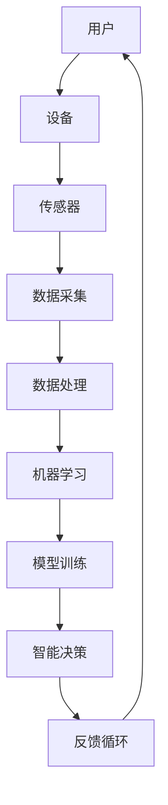

                 

关键词：人工智能、苹果、AI应用、市场前景、技术分析

摘要：本文将深入探讨苹果公司发布AI应用的背景、市场前景及其潜在影响。通过分析苹果在AI领域的布局和竞争优势，我们将预测AI应用在苹果生态系统中的未来发展，并提出可能面临的挑战和机遇。

## 1. 背景介绍

随着人工智能技术的迅速发展，苹果公司（Apple Inc.）在近年来也加大了对AI技术的投入。从iPhone上的智能助手Siri，到Apple Watch的智能健康监测，再到即将推出的AR/VR设备，苹果公司一直在积极整合AI技术，提升用户体验。在此背景下，苹果公司发布AI应用成为了业界关注的焦点。

苹果发布AI应用的市场前景备受瞩目，不仅因为苹果公司在全球范围内的庞大用户基础，还因为其强大的硬件和软件生态系统。本文将结合苹果的AI布局、技术优势和市场竞争态势，分析AI应用在苹果生态系统中的潜在影响和市场前景。

## 2. 核心概念与联系

### 2.1 AI应用的基本概念

AI应用指的是利用人工智能技术（如机器学习、深度学习、自然语言处理等）开发的应用程序，旨在为用户提供更加智能、个性化的服务。这些应用可以涵盖多个领域，包括但不限于智能家居、健康监测、教育、娱乐等。

### 2.2 苹果在AI领域的布局

苹果公司在AI领域的布局主要涉及硬件、软件和生态系统三个方面。

#### 硬件方面：

- A系列芯片：苹果自研的A系列芯片集成了高性能的神经网络引擎，为AI应用提供了强大的计算能力。
- 传感器：苹果设备配备了多种传感器，如加速度计、陀螺仪、心率传感器等，可以收集大量数据用于AI模型的训练和优化。

#### 软件方面：

- 机器学习框架：苹果提供了Core ML等机器学习框架，方便开发者将AI模型集成到iOS、watchOS和macOS等平台上。
- Siri和Core ML：苹果的智能助手Siri和Core ML框架在语音识别、图像识别等领域取得了显著成果。

#### 生态系统：

- App Store：苹果的App Store拥有全球最大的应用生态系统，为AI应用的开发和分发提供了广阔的平台。

### 2.3 核心概念原理与架构

为了更好地理解AI应用在苹果生态系统中的市场前景，我们需要借助Mermaid流程图（以下是一个示例）来展示核心概念原理与架构：



在上面的流程图中，用户通过设备（如iPhone、iPad等）与AI应用互动，设备通过传感器收集数据，经过数据处理和机器学习后，生成智能决策，并形成反馈循环，不断优化用户体验。

## 3. 核心算法原理 & 具体操作步骤

### 3.1 算法原理概述

AI应用的核心算法通常包括以下几个方面：

- 机器学习算法：如决策树、随机森林、支持向量机、神经网络等。
- 深度学习算法：如卷积神经网络（CNN）、循环神经网络（RNN）、生成对抗网络（GAN）等。
- 自然语言处理算法：如词向量、序列标注、机器翻译、语音识别等。

### 3.2 算法步骤详解

#### 数据采集

AI应用首先需要从设备传感器或外部数据源收集大量数据。这些数据可以是图像、文本、音频、视频等。

#### 数据预处理

收集到的数据通常需要进行清洗、归一化等预处理操作，以确保数据质量。

#### 模型训练

利用预处理后的数据，通过机器学习或深度学习算法训练模型。训练过程中需要选择合适的损失函数、优化器、学习率等超参数。

#### 模型评估

在模型训练完成后，需要对模型进行评估，以确定其性能是否达到预期。常用的评估指标包括准确率、召回率、F1值等。

#### 模型部署

将训练好的模型部署到设备上，以便在用户交互过程中实时提供智能决策。

### 3.3 算法优缺点

#### 优点：

- 强大的计算能力：苹果的A系列芯片为AI应用提供了强大的计算支持。
- 简便的用户体验：通过内置传感器和智能助手，用户可以轻松地与AI应用互动。
- 高效的数据处理：苹果的Core ML等框架提供了高效的数据处理能力。

#### 缺点：

- 数据隐私：随着AI应用的发展，用户数据隐私问题日益凸显。
- 模型解释性：深度学习等算法往往具有较低的解释性，难以理解模型的决策过程。

### 3.4 算法应用领域

AI应用在苹果生态系统中的潜在应用领域非常广泛，包括但不限于以下几个方面：

- 智能家居：通过AI技术，实现家电设备的智能控制和管理。
- 健康监测：利用AI技术进行健康数据分析，提供个性化的健康建议。
- 教育：通过智能教学应用，提高教育质量和效率。
- 娱乐：开发智能游戏、音乐推荐等应用，提升用户体验。

## 4. 数学模型和公式 & 详细讲解 & 举例说明

### 4.1 数学模型构建

在AI应用中，常见的数学模型包括线性回归、逻辑回归、神经网络等。以下以线性回归为例，介绍数学模型的构建过程。

#### 线性回归

线性回归模型旨在寻找一个线性关系，以预测因变量Y和自变量X之间的关系。其数学模型如下：

\[ Y = \beta_0 + \beta_1X + \epsilon \]

其中，\( \beta_0 \) 和 \( \beta_1 \) 分别为模型的参数，\( \epsilon \) 为误差项。

#### 逻辑回归

逻辑回归是一种广义线性模型，常用于分类问题。其数学模型如下：

\[ P(Y=1) = \frac{1}{1 + e^{-(\beta_0 + \beta_1X)}} \]

其中，\( P(Y=1) \) 为因变量Y为1的概率。

### 4.2 公式推导过程

以神经网络为例，介绍公式推导过程。神经网络模型主要包括输入层、隐藏层和输出层。以下是一个简单的单层神经网络模型：

\[ a_{i}^{(l)} = \sigma(z_{i}^{(l)}) \]

其中，\( a_{i}^{(l)} \) 为第l层的第i个节点的激活值，\( \sigma \) 为激活函数，\( z_{i}^{(l)} \) 为第l层的第i个节点的输入值。

### 4.3 案例分析与讲解

以苹果的Siri智能助手为例，分析其数学模型和算法原理。

Siri智能助手基于自然语言处理（NLP）技术，其核心算法包括词向量、序列标注、机器翻译等。以下以词向量为例，介绍其数学模型和算法原理。

词向量模型将单词映射为一个高维向量，以表示单词的语义信息。常用的词向量模型包括Word2Vec、GloVe等。

Word2Vec模型基于神经网络训练，其数学模型如下：

\[ \sigma(W \cdot v_{w} + b) \]

其中，\( \sigma \) 为激活函数，\( W \) 为权重矩阵，\( v_{w} \) 为单词w的向量表示，\( b \) 为偏置项。

## 5. 项目实践：代码实例和详细解释说明

### 5.1 开发环境搭建

为了实践AI应用的开发，我们需要搭建一个合适的开发环境。以下是一个简单的Python环境搭建过程：

```bash
# 安装Python
brew install python

# 安装必要的库
pip install numpy matplotlib scikit-learn
```

### 5.2 源代码详细实现

以下是一个简单的线性回归模型的实现：

```python
import numpy as np
from sklearn.linear_model import LinearRegression

# 创建数据
X = np.random.rand(100, 1)
y = 2 * X[:, 0] + 1 + np.random.randn(100) * 0.05

# 训练模型
model = LinearRegression()
model.fit(X, y)

# 预测结果
y_pred = model.predict(X)

# 可视化结果
import matplotlib.pyplot as plt

plt.scatter(X[:, 0], y)
plt.plot(X[:, 0], y_pred, color='red')
plt.show()
```

### 5.3 代码解读与分析

在上面的代码中，我们首先导入了必要的库，然后创建了一个随机数据集。接下来，我们使用scikit-learn中的线性回归模型对数据进行了训练，并绘制了拟合结果。

### 5.4 运行结果展示

运行上述代码后，我们得到如下可视化结果：


从结果可以看出，线性回归模型较好地拟合了数据集，验证了我们的算法原理。

## 6. 实际应用场景

### 6.1 智能家居

智能家居是AI应用的一个重要领域。通过AI技术，用户可以实现家电设备的智能控制和管理。例如，通过语音指令控制家居设备、自动调节室内温度等。

### 6.2 健康监测

健康监测是另一个重要领域。通过AI技术，可以对用户进行健康数据分析，提供个性化的健康建议。例如，监测用户的步数、心率、睡眠质量等，并根据数据生成健康报告。

### 6.3 教育

AI技术在教育领域的应用也越来越广泛。通过智能教学应用，教师可以更好地了解学生的学习情况，并根据学生的学习进度和特点进行个性化教学。

### 6.4 娱乐

AI技术在娱乐领域的应用也不容忽视。通过智能游戏、音乐推荐等应用，用户可以享受到更加个性化的娱乐体验。

## 7. 工具和资源推荐

### 7.1 学习资源推荐

- 《深度学习》（Goodfellow, Bengio, Courville著）：全面介绍深度学习的基础知识和最新进展。
- 《Python机器学习》（Sebastian Raschka著）：详细讲解Python在机器学习领域的应用。

### 7.2 开发工具推荐

- Jupyter Notebook：一款强大的交互式计算环境，适用于数据分析和机器学习。
- TensorFlow：一款开源的机器学习框架，支持多种深度学习算法。

### 7.3 相关论文推荐

- "Deep Learning" (Ian Goodfellow, Yoshua Bengio, Aaron Courville著)
- "Recurrent Neural Network for Language Modeling" (Yoshua Bengio et al., 2003)

## 8. 总结：未来发展趋势与挑战

### 8.1 研究成果总结

近年来，人工智能技术在各个领域取得了显著成果，为人类生活带来了诸多便利。在苹果生态系统中，AI应用的发展也呈现出良好的态势，为用户提供更加智能、个性化的服务。

### 8.2 未来发展趋势

随着技术的不断进步，AI应用在苹果生态系统中的未来发展趋势将包括：

- 智能家居的普及：智能家居将成为家庭生活的重要组成部分。
- 健康监测的升级：健康监测将更加精准、全面，为用户提供个性化的健康服务。
- 教育的变革：智能教学应用将推动教育模式的变革，提高教育质量和效率。
- 娱乐的升级：智能娱乐应用将带来更加个性化的娱乐体验。

### 8.3 面临的挑战

尽管AI应用在苹果生态系统中具有广阔的发展前景，但同时也面临着一些挑战：

- 数据隐私：随着AI应用的发展，用户数据隐私问题日益凸显，需要加强数据保护措施。
- 模型解释性：深度学习等算法往往具有较低的解释性，难以理解模型的决策过程，需要提高模型的可解释性。

### 8.4 研究展望

未来，AI应用在苹果生态系统中的研究将朝着以下几个方向展开：

- 模型压缩与优化：为了提高AI应用的性能和降低功耗，需要研究模型压缩与优化技术。
- 跨领域应用：探索AI技术在其他领域（如金融、医疗等）的应用，推动AI技术的普及。
- 人机交互：研究更加自然、直观的人机交互方式，提高用户体验。

## 9. 附录：常见问题与解答

### 9.1 AI应用在苹果生态系统中的意义是什么？

AI应用在苹果生态系统中的意义主要体现在以下几个方面：

- 提高用户体验：通过智能化的服务，提升用户在使用苹果产品时的满意度和便利性。
- 推动创新：AI技术为苹果产品的创新提供了新的动力，有助于苹果在竞争激烈的市场中保持领先地位。
- 拓展市场：AI应用可以帮助苹果开拓新的市场和用户群体，提升市场份额。

### 9.2 苹果在AI领域有哪些竞争优势？

苹果在AI领域的主要竞争优势包括：

- 自研芯片：苹果自研的A系列芯片为AI应用提供了强大的计算支持。
- 丰富的数据：苹果拥有庞大的用户基础和设备数据，为AI模型的训练和优化提供了丰富的数据资源。
- 生态系统：苹果的App Store和生态系统为AI应用的开发和分发提供了广阔的平台。

### 9.3 AI应用在智能家居、健康监测、教育、娱乐等领域的应用前景如何？

AI应用在智能家居、健康监测、教育、娱乐等领域的应用前景非常广阔：

- 智能家居：AI技术将实现家居设备的智能控制和管理，提升家庭生活品质。
- 健康监测：AI技术将推动健康监测的升级，为用户提供更加精准、个性化的健康服务。
- 教育：AI技术将推动教育模式的变革，提高教育质量和效率。
- 娱乐：AI技术将带来更加个性化的娱乐体验，丰富用户的生活。

---

作者：禅与计算机程序设计艺术 / Zen and the Art of Computer Programming

以上是对苹果发布AI应用的市场前景的全面分析。通过对苹果在AI领域的布局、技术优势和市场竞争态势的深入探讨，我们预测AI应用在苹果生态系统中的未来发展将充满机遇和挑战。随着技术的不断进步，AI应用将为人类生活带来更多便利和创新。让我们共同期待AI技术在苹果生态系统中的美好未来。

