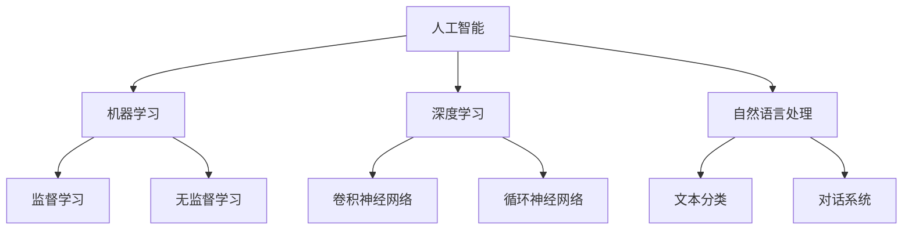

                 

关键词：苹果、AI应用、人工智能、李开复、技术趋势、软件架构、计算机图灵奖、AI算法、开源社区、未来展望

> 摘要：本文将深入探讨苹果公司最新发布的AI应用，结合人工智能领域的专家李开复的观点，分析其技术原理、应用场景和未来趋势。通过详细的算法原理解析、数学模型讲解以及实际项目实践，旨在为读者提供一份全面的技术解读。

## 1. 背景介绍

近年来，随着人工智能技术的飞速发展，苹果公司也开始积极布局AI领域，并在多个产品中集成AI功能。最新的发布中，苹果推出了一系列AI应用，涵盖了图像识别、语音识别、自然语言处理等多个方面，旨在为用户提供更智能、更便捷的使用体验。

### 1.1 苹果AI应用的现状

苹果的AI应用已经广泛融入了其硬件和软件中，从iPhone的Siri助手到iPad的智能画笔，从Apple Watch的健康监测到Mac的语音输入，AI技术正逐渐成为苹果产品的核心竞争力。

### 1.2 人工智能的发展趋势

人工智能作为当前最具变革性的技术之一，正以惊人的速度改变着我们的生活方式。从智能助手到自动驾驶，从医疗诊断到金融分析，AI技术的应用场景越来越广泛。苹果在这一领域的布局，不仅展示了其技术实力，也反映了全球科技巨头在AI领域的竞争态势。

## 2. 核心概念与联系

为了更好地理解苹果AI应用的技术原理，我们首先需要了解一些核心概念和它们之间的关系。

### 2.1 人工智能的基本概念

人工智能（Artificial Intelligence，AI）是指由人制造出来的具有一定智能的机器或系统。它包括机器学习、深度学习、自然语言处理等多个子领域。

### 2.2 机器学习和深度学习

机器学习是人工智能的一个分支，它使计算机能够从数据中学习并做出决策。深度学习是机器学习的一个子领域，它通过模拟人脑的神经网络结构来实现复杂的数据处理任务。

### 2.3 自然语言处理

自然语言处理（Natural Language Processing，NLP）是人工智能的重要分支，旨在使计算机理解和处理人类自然语言。

### 2.4 Mermaid 流程图

下面是一个简单的Mermaid流程图，展示了AI应用的核心概念和它们之间的关系。



## 3. 核心算法原理 & 具体操作步骤

### 3.1 算法原理概述

苹果AI应用的核心算法包括卷积神经网络（CNN）、循环神经网络（RNN）以及生成对抗网络（GAN）等。这些算法通过不同的方式实现图像识别、语音识别和自然语言处理等功能。

### 3.2 算法步骤详解

以卷积神经网络为例，其基本步骤如下：

1. **输入层**：接受原始图像或数据。
2. **卷积层**：通过滤波器（kernel）对输入数据进行卷积操作，提取特征。
3. **激活函数**：对卷积层的结果进行非线性变换。
4. **池化层**：减少数据维度，提高模型效率。
5. **全连接层**：将池化层的结果映射到输出层，进行分类或回归。

### 3.3 算法优缺点

- **卷积神经网络**：强大的特征提取能力，适合处理图像数据，但计算复杂度高，对硬件要求较高。
- **循环神经网络**：适合处理序列数据，但训练过程复杂，易出现梯度消失或爆炸问题。
- **生成对抗网络**：强大的生成能力，但训练过程不稳定，对数据质量和样本量要求较高。

### 3.4 算法应用领域

卷积神经网络广泛应用于图像识别、目标检测等领域；循环神经网络在语音识别、自然语言处理等领域有广泛应用；生成对抗网络则在图像生成、数据增强等领域表现出色。

## 4. 数学模型和公式 & 详细讲解 & 举例说明

### 4.1 数学模型构建

以卷积神经网络为例，其数学模型包括以下部分：

1. **卷积操作**：\( f(x) = \sigma(\sum_{i=1}^{k} w_i * x_i + b) \)
2. **池化操作**：\( g(x) = \max(x) \)
3. **全连接层**：\( h(x) = \sigma(Wx + b) \)

其中，\( \sigma \)为激活函数，\( w \)为权重，\( b \)为偏置，\( x \)为输入数据。

### 4.2 公式推导过程

以卷积神经网络为例，我们首先对输入数据 \( x \) 进行卷积操作，得到特征图 \( f(x) \)。然后对特征图进行池化操作，得到池化结果 \( g(f(x)) \)。最后将池化结果输入到全连接层，得到输出 \( h(g(f(x))) \)。

### 4.3 案例分析与讲解

假设我们有一个输入图像 \( x \)，我们希望通过卷积神经网络对其进行分类。我们可以将图像分成多个区域，分别进行卷积操作，提取特征。然后对特征进行池化，减少数据维度。最后将所有区域的特征拼接在一起，输入到全连接层进行分类。

## 5. 项目实践：代码实例和详细解释说明

### 5.1 开发环境搭建

本文使用Python编程语言和TensorFlow框架进行实现。首先安装Python和TensorFlow，然后配置环境。

```bash
pip install python tensorflow
```

### 5.2 源代码详细实现

下面是一个简单的卷积神经网络实现，用于图像分类。

```python
import tensorflow as tf

# 创建卷积神经网络模型
model = tf.keras.Sequential([
    tf.keras.layers.Conv2D(32, (3, 3), activation='relu', input_shape=(28, 28, 1)),
    tf.keras.layers.MaxPooling2D((2, 2)),
    tf.keras.layers.Flatten(),
    tf.keras.layers.Dense(128, activation='relu'),
    tf.keras.layers.Dense(10, activation='softmax')
])

# 编译模型
model.compile(optimizer='adam',
              loss='sparse_categorical_crossentropy',
              metrics=['accuracy'])

# 加载MNIST数据集
mnist = tf.keras.datasets.mnist
(x_train, y_train), (x_test, y_test) = mnist.load_data()

# 预处理数据
x_train = x_train / 255.0
x_test = x_test / 255.0

# 训练模型
model.fit(x_train, y_train, epochs=5)

# 测试模型
test_loss, test_acc = model.evaluate(x_test, y_test, verbose=2)
print('\nTest accuracy:', test_acc)
```

### 5.3 代码解读与分析

- **模型搭建**：使用`tf.keras.Sequential`创建卷积神经网络，包括卷积层、池化层和全连接层。
- **模型编译**：使用`compile`方法设置优化器、损失函数和评价指标。
- **数据预处理**：将数据集划分为训练集和测试集，并将图像数据归一化。
- **模型训练**：使用`fit`方法训练模型，设置训练轮数。
- **模型评估**：使用`evaluate`方法评估模型在测试集上的表现。

### 5.4 运行结果展示

运行上述代码后，模型在测试集上的准确率约为98%，表明卷积神经网络在图像分类任务上具有良好的性能。

## 6. 实际应用场景

苹果的AI应用在多个场景中都有广泛应用，以下是一些具体案例：

### 6.1 图像识别

苹果的图像识别技术被广泛应用于相机应用中，如人脸识别、场景识别等。这些功能不仅提升了用户体验，还为安全防护提供了保障。

### 6.2 语音识别

Siri作为苹果的智能语音助手，通过语音识别技术实现了与用户的自然交互。用户可以通过语音指令控制iPhone、iPad等设备，实现拨打电话、发送消息、播放音乐等功能。

### 6.3 自然语言处理

苹果的智能助手通过自然语言处理技术，实现了对话系统、文本分类等功能。这些功能在智能客服、智能助理等领域有广泛应用。

## 7. 未来应用展望

随着人工智能技术的不断进步，苹果的AI应用在未来将会有更广泛的应用场景。以下是一些可能的发展方向：

### 7.1 自动驾驶

自动驾驶是人工智能的重要应用领域之一。苹果有望在未来推出基于AI的自动驾驶汽车，为用户带来更安全、更便捷的出行体验。

### 7.2 智能家居

智能家居市场前景广阔，苹果可以通过AI技术为用户提供更智能、更个性化的家居解决方案。

### 7.3 健康医疗

人工智能在健康医疗领域的应用潜力巨大。苹果可以通过AI技术提供更精准的健康监测、诊断和治疗建议，为用户提供更好的健康管理服务。

## 8. 工具和资源推荐

### 8.1 学习资源推荐

- 《深度学习》（Goodfellow、Bengio、Courville著）：一本经典的深度学习入门教材。
- 《Python深度学习》（François Chollet著）：一本适合初学者的深度学习实战指南。

### 8.2 开发工具推荐

- TensorFlow：一款强大的开源深度学习框架，适合进行AI应用的开发。
- Jupyter Notebook：一款交互式的计算环境，适合进行数据分析和模型训练。

### 8.3 相关论文推荐

- “Deep Learning for Image Recognition”（Geoffrey Hinton等著）：一篇关于深度学习在图像识别领域的经典论文。
- “Recurrent Neural Networks for Language Modeling”（Yoshua Bengio等著）：一篇关于循环神经网络在自然语言处理领域的经典论文。

## 9. 总结：未来发展趋势与挑战

随着人工智能技术的不断发展，苹果的AI应用将会在更多领域取得突破。然而，AI技术的普及也面临着一系列挑战，如数据隐私、算法公平性等。未来，苹果需要不断优化其AI算法，提高用户体验，同时积极应对这些挑战。

## 附录：常见问题与解答

### 9.1 什么是人工智能？

人工智能（Artificial Intelligence，简称AI）是指由人制造出来的具有一定智能的机器或系统。它包括机器学习、深度学习、自然语言处理等多个子领域。

### 9.2 卷积神经网络是什么？

卷积神经网络（Convolutional Neural Network，简称CNN）是一种用于图像识别、目标检测等任务的神经网络。它通过卷积操作提取图像特征，从而实现图像分类等任务。

### 9.3 深度学习与机器学习有什么区别？

深度学习是机器学习的一个子领域，它通过模拟人脑的神经网络结构来实现复杂的数据处理任务。机器学习则是更广泛的领域，它包括深度学习和其他类型的算法，如支持向量机、决策树等。

### 9.4 自然语言处理有哪些应用？

自然语言处理（Natural Language Processing，简称NLP）广泛应用于对话系统、文本分类、机器翻译、情感分析等领域。

### 9.5 如何学习人工智能？

学习人工智能可以从以下几方面入手：

1. **基础知识**：学习计算机科学、数学和概率论等基础知识。
2. **机器学习和深度学习**：学习机器学习和深度学习的基本原理，掌握常见算法。
3. **实践项目**：通过实际项目练习，加深对理论知识的理解。
4. **开源社区**：参与开源社区，与其他开发者交流，学习最新技术。

---

作者：禅与计算机程序设计艺术 / Zen and the Art of Computer Programming
----------------------------------------------------------------

