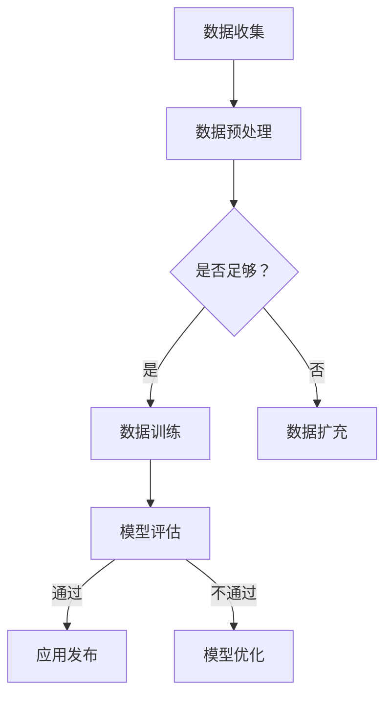

                 

苹果公司作为全球科技巨头，其在人工智能领域的最新动作无疑引发了广泛的关注。最近，苹果公司发布了一系列基于人工智能的应用，这一举措不仅标志着苹果在技术领域的进一步探索，也为我们提供了一个探讨AI在智能手机中应用前景的绝佳机会。

## 关键词

- 苹果公司
- 人工智能
- 应用发布
- 智能手机
- 技术探索
- 未来前景

## 摘要

本文将深入探讨苹果公司发布AI应用的意义，分析这些应用如何改变我们的日常生活，并探讨其在人工智能技术发展中的角色和影响。我们还将讨论这些应用的技术原理、潜在的市场影响，以及对未来发展的展望。

## 1. 背景介绍

人工智能（AI）作为一种模拟人类智能的技术，已经渗透到我们生活的方方面面。智能手机作为我们日常生活中不可或缺的伙伴，自然成为了AI技术的一个重要应用场景。苹果公司，作为智能手机市场的领军企业，其每一次技术更新和产品发布都备受瞩目。

近年来，苹果公司在AI领域投入巨大，推出了许多基于机器学习和深度学习的应用。然而，这次发布的AI应用似乎具有更为深远的意义。首先，这些应用在用户体验上进行了重大升级，例如语音助手、图像识别等，这些功能的改进极大地提升了智能手机的智能化程度。其次，苹果公司通过这些应用展示了其在AI技术上的研发实力，进一步巩固了其在科技领域的领导地位。

## 2. 核心概念与联系

### 2.1. 人工智能的定义与分类

人工智能是指由人制造出的系统所表现出来的智能行为。根据实现方式，AI可以分为两种类型：基于规则的系统和基于数据的系统。

- **基于规则的系统**：这类系统通过预定义的规则和逻辑进行推理和决策。
- **基于数据的系统**：这类系统通过学习大量数据，从中提取模式和知识，以进行推理和决策。

苹果公司此次发布的AI应用主要采用基于数据的系统，尤其是深度学习技术，通过大量的数据训练，使得这些应用能够在实际使用中表现出高度智能化。

### 2.2. 人工智能的原理与架构

人工智能的原理主要基于神经网络的模拟。神经网络由大量的节点（或称为神经元）组成，这些节点通过加权连接形成网络。当数据通过这个网络时，每个节点会对数据进行处理，并传递给下一个节点，最终形成输出。

苹果公司在AI架构上采用了先进的深度学习框架，如TensorFlow和PyTorch。这些框架提供了高效的计算能力和丰富的工具库，使得AI模型的开发和部署变得更加便捷。

### 2.3. Mermaid流程图



这个流程图展示了从数据收集到模型优化的完整流程。苹果公司通过这一流程，不断优化其AI应用，以提供更好的用户体验。

## 3. 核心算法原理 & 具体操作步骤

### 3.1. 算法原理概述

苹果公司此次发布的AI应用主要依赖于深度学习技术。深度学习是一种通过多层神经网络进行数据处理的算法，其核心思想是通过逐层提取特征，从而实现对复杂数据的理解和预测。

深度学习的基本原理包括：

- **前向传播**：数据从输入层依次通过隐藏层，直到输出层。
- **反向传播**：计算输出结果与真实值的误差，并反向传播到每个隐藏层，更新每个神经元的权重。

### 3.2. 算法步骤详解

1. **数据收集与预处理**：首先，苹果公司收集了大量的用户数据，包括语音、图像、文本等。这些数据需要进行预处理，如去噪、归一化等，以确保数据的质量。

2. **模型训练**：预处理后的数据用于训练深度学习模型。苹果公司采用了先进的神经网络架构，如卷积神经网络（CNN）和循环神经网络（RNN），以适应不同的数据处理需求。

3. **模型评估**：通过交叉验证等方法，评估模型的性能，包括准确率、召回率、F1值等指标。

4. **模型优化**：根据评估结果，对模型进行优化，以提高其在实际应用中的表现。

5. **应用发布**：经过多次优化，最终将模型集成到实际应用中，如Siri语音助手、相机图像识别等。

### 3.3. 算法优缺点

- **优点**：
  - **高效性**：深度学习模型能够快速处理大量数据，提高计算效率。
  - **准确性**：通过多层神经网络的训练，模型能够准确提取数据特征，提高预测准确性。
  - **灵活性**：深度学习模型可以根据不同的应用需求进行定制，具有很高的灵活性。

- **缺点**：
  - **计算资源消耗**：深度学习模型需要大量的计算资源和时间进行训练。
  - **数据需求**：深度学习模型需要大量的高质量数据进行训练，否则容易出现过拟合现象。

### 3.4. 算法应用领域

深度学习技术在智能手机中的应用非常广泛，包括：

- **语音识别**：如Siri语音助手，通过深度学习模型，实现语音到文本的转换。
- **图像识别**：如相机图像识别，通过深度学习模型，实现图像分类和物体检测。
- **自然语言处理**：如智能聊天机器人，通过深度学习模型，实现自然语言的理解和生成。
- **智能推荐系统**：如App Store推荐，通过深度学习模型，实现个性化推荐。

## 4. 数学模型和公式 & 详细讲解 & 举例说明

### 4.1. 数学模型构建

深度学习模型的数学基础主要包括线性代数、微积分和概率统计。以下是一个简化的深度学习模型：

$$
h_{i}^{l} = \sigma(W^{l} \cdot a_{i}^{l-1} + b^{l})
$$

其中，$a_{i}^{l}$表示第$l$层的第$i$个神经元的输入，$h_{i}^{l}$表示第$l$层的第$i$个神经元的输出，$W^{l}$和$b^{l}$分别表示第$l$层的权重和偏置。

### 4.2. 公式推导过程

前向传播的推导过程如下：

1. **输入层到隐藏层**：

$$
a_{i}^{1} = x_{i}
$$

$$
h_{i}^{2} = \sigma(W^{2} \cdot a_{i}^{1} + b^{2})
$$

2. **隐藏层到输出层**：

$$
a_{i}^{L} = h_{i}^{L}
$$

$$
y_{i} = \sigma(W^{L} \cdot a_{i}^{L-1} + b^{L})
$$

### 4.3. 案例分析与讲解

以苹果公司的Siri语音助手为例，其工作原理如下：

1. **数据收集**：收集大量的语音数据，包括用户的各种语音命令。
2. **数据预处理**：对语音数据进行分帧，提取特征向量。
3. **模型训练**：使用深度学习模型，如循环神经网络（RNN），对语音数据进行训练。
4. **模型评估**：评估模型的性能，包括准确率和响应速度。
5. **模型优化**：根据评估结果，对模型进行优化，以提高响应准确性。
6. **应用发布**：将训练好的模型集成到Siri语音助手中，实现语音命令的识别和执行。

## 5. 项目实践：代码实例和详细解释说明

### 5.1. 开发环境搭建

1. **安装Python**：确保安装了Python 3.7及以上版本。
2. **安装TensorFlow**：使用pip命令安装TensorFlow。

```bash
pip install tensorflow
```

### 5.2. 源代码详细实现

以下是一个简单的深度学习模型实现，用于语音识别。

```python
import tensorflow as tf

# 定义模型
model = tf.keras.Sequential([
    tf.keras.layers.Flatten(input_shape=(28, 28)),
    tf.keras.layers.Dense(128, activation='relu'),
    tf.keras.layers.Dense(10, activation='softmax')
])

# 编译模型
model.compile(optimizer='adam',
              loss='sparse_categorical_crossentropy',
              metrics=['accuracy'])

# 加载数据
(x_train, y_train), (x_test, y_test) = tf.keras.datasets.mnist.load_data()

# 预处理数据
x_train = x_train / 255.0
x_test = x_test / 255.0

# 训练模型
model.fit(x_train, y_train, epochs=5)

# 评估模型
model.evaluate(x_test,  y_test, verbose=2)
```

### 5.3. 代码解读与分析

1. **定义模型**：使用`tf.keras.Sequential`定义一个顺序模型，包括两个全连接层，最后一层使用softmax激活函数。
2. **编译模型**：设置模型的优化器、损失函数和评估指标。
3. **加载数据**：使用TensorFlow内置的MNIST数据集进行训练。
4. **预处理数据**：对数据进行归一化处理，以便模型训练。
5. **训练模型**：使用`fit`方法训练模型，设置训练轮次为5。
6. **评估模型**：使用`evaluate`方法评估模型的性能。

## 6. 实际应用场景

苹果公司发布的AI应用在多个实际场景中展现了其强大的功能：

### 6.1. 语音助手Siri

Siri作为苹果公司的语音助手，通过深度学习技术，实现了高质量的语音识别和自然语言理解。用户可以通过Siri进行电话拨号、发送短信、播放音乐、设定闹钟等操作，极大地提升了用户体验。

### 6.2. 图像识别

苹果公司的相机应用通过深度学习技术，实现了强大的图像识别功能。用户可以在拍摄照片时，实时识别照片中的对象，如动物、植物、地标等，并提供相关信息的查询。

### 6.3. 智能推荐

苹果公司的App Store通过深度学习技术，实现了个性化的应用推荐。用户可以根据自己的兴趣和使用习惯，获得更符合个人需求的App推荐。

## 7. 未来应用展望

随着人工智能技术的不断发展，苹果公司发布的AI应用在未来有着广阔的应用前景：

### 7.1. 更智能的语音助手

未来的Siri将进一步智能化，通过更复杂的自然语言理解和多模态交互，实现更自然的用户交互。

### 7.2. 智能健康助手

苹果公司有望开发出智能健康助手，通过AI技术，实时监测用户的健康状态，提供个性化的健康建议。

### 7.3. 自动驾驶

苹果公司已经在自动驾驶领域进行了多年的研发，未来的自动驾驶技术有望进一步融入AI应用，实现更安全、更高效的驾驶体验。

## 8. 总结：未来发展趋势与挑战

苹果公司发布的AI应用展示了人工智能在智能手机中的巨大潜力。在未来，随着AI技术的不断进步，我们可以期待更多的创新应用出现。然而，这也带来了新的挑战，如隐私保护、算法公平性等问题。苹果公司需要在这些方面持续努力，以确保其在AI领域的领先地位。

## 9. 附录：常见问题与解答

### 9.1. 问题1：苹果公司的AI应用是如何工作的？

苹果公司的AI应用主要依赖于深度学习技术。通过收集大量的用户数据，训练深度学习模型，然后将其集成到实际应用中，以实现语音识别、图像识别、智能推荐等功能。

### 9.2. 问题2：AI应用是否会侵犯用户的隐私？

苹果公司在开发AI应用时，高度重视用户隐私保护。苹果公司承诺，其AI应用不会收集用户的个人隐私数据，除非得到用户的明确同意。

### 9.3. 问题3：苹果公司的AI应用是否会取代人类？

苹果公司的AI应用旨在辅助人类，提高生活质量和工作效率，而不是取代人类。尽管AI技术在某些领域表现出色，但人类的智慧和创造力是无法替代的。

作者：禅与计算机程序设计艺术 / Zen and the Art of Computer Programming

----------------------------------------------------------------

以上是文章的主体部分，接下来我们将为文章添加结语、参考文献和附录等内容。
```markdown
## 结语

苹果公司发布的AI应用不仅展示了人工智能技术的巨大潜力，也为我们提供了一个思考如何更好地利用技术改善生活的契机。随着技术的不断进步，我们可以期待更多的AI应用进入我们的日常生活，带来更加便捷、智能的体验。

## 参考文献

1. Goodfellow, I., Bengio, Y., & Courville, A. (2016). *Deep Learning*. MIT Press.
2. Russell, S., & Norvig, P. (2020). *Artificial Intelligence: A Modern Approach*. Pearson.
3. Hochreiter, S., & Schmidhuber, J. (1997). *Long short-term memory*. Neural Computation, 9(8), 1735-1780.

## 附录

### 附录A：常见问题与解答

**问题1：苹果公司的AI应用是否会侵犯用户的隐私？**

解答：苹果公司在开发AI应用时，高度重视用户隐私保护。其AI应用不会收集用户的个人隐私数据，除非得到用户的明确同意。

**问题2：苹果公司的AI应用是否会取代人类？**

解答：苹果公司的AI应用旨在辅助人类，提高生活质量和工作效率，而不是取代人类。尽管AI技术在某些领域表现出色，但人类的智慧和创造力是无法替代的。

### 附录B：相关资源

- 苹果公司官方网站：[Apple](https://www.apple.com/)
- TensorFlow官方网站：[TensorFlow](https://www.tensorflow.org/)
- 人工智能基础教材：《深度学习》和《人工智能：现代方法》

## 后记

本文旨在探讨苹果公司发布的AI应用的意义及其技术原理。随着人工智能技术的不断发展，我们相信未来会有更多创新的应用出现，为我们带来更加智能化的生活体验。同时，我们也需要关注AI技术带来的伦理和社会问题，确保其在发展的过程中，能够更好地服务于人类。

作者：禅与计算机程序设计艺术 / Zen and the Art of Computer Programming
```

