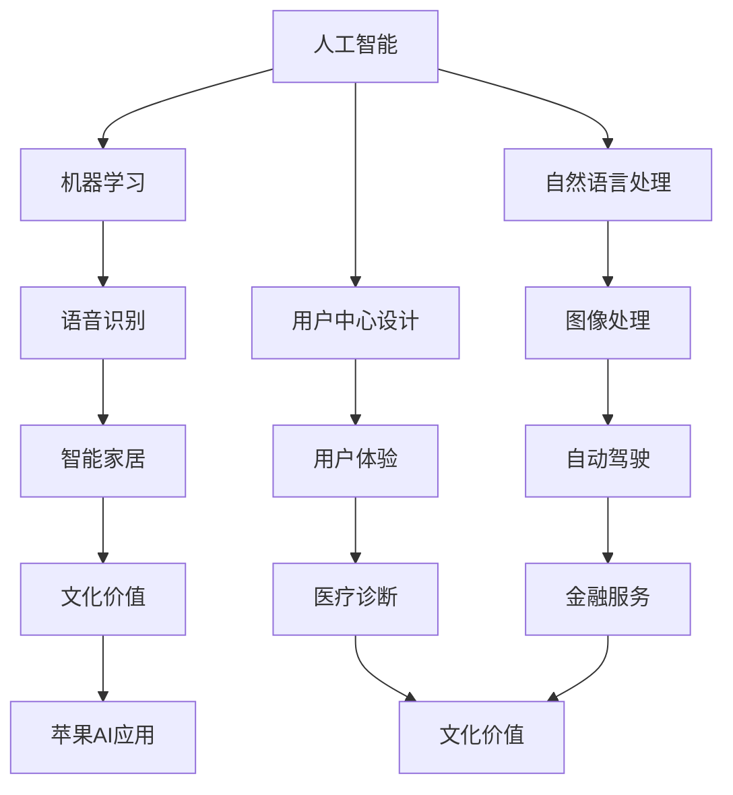

                 

关键词：人工智能，苹果，文化价值，技术创新，用户体验

> 摘要：随着人工智能技术的飞速发展，苹果公司在2023年推出了一系列基于人工智能的新应用，这不仅是一次技术上的创新，更是一种文化上的变革。本文将深入探讨苹果发布AI应用的文化价值，分析其对于科技行业的深远影响。

## 1. 背景介绍

近年来，人工智能（AI）技术在全球范围内取得了显著的进步。从语音识别到图像处理，从自然语言处理到自动驾驶，AI的应用正在不断拓展我们的技术边界。在这样的背景下，苹果公司在2023年发布了一系列基于AI的新应用，这标志着科技行业的一次重要变革。

苹果公司一直以来都以其独特的设计哲学和用户至上的理念在市场上独树一帜。这次发布的AI应用，不仅展示了苹果在技术创新上的前瞻性，更反映了其对用户需求的深刻洞察。这些AI应用的发布，不仅引起了业界的广泛关注，也引发了对于AI技术未来发展的深刻思考。

## 2. 核心概念与联系

在探讨苹果发布AI应用的文化价值之前，我们需要先了解一些核心概念和它们之间的关系。

### 2.1 人工智能（AI）

人工智能是指通过计算机程序实现人类智能的技术。它包括机器学习、深度学习、自然语言处理等多个子领域。AI的应用正在改变我们的生活和工作方式，从智能家居到自动驾驶，从医疗诊断到金融服务，AI的影响无处不在。

### 2.2 用户中心设计

用户中心设计是一种设计理念，它强调在产品开发过程中始终关注用户的需求和体验。苹果公司在产品设计上一直坚持这一理念，这使得其产品在用户体验上具有显著优势。

### 2.3 文化价值

文化价值是指一种产品或服务在文化层面上的意义和影响。苹果公司的AI应用不仅具有技术上的创新性，更体现了其在文化上的价值。

### 2.4 人工智能与用户中心设计的联系

人工智能与用户中心设计的结合，为用户带来了前所未有的体验。通过AI技术，苹果公司能够更好地理解和满足用户的需求，从而提升产品的文化价值。

以下是一个简化的Mermaid流程图，展示了这些核心概念之间的联系：



## 3. 核心算法原理 & 具体操作步骤

### 3.1 算法原理概述

苹果公司发布的AI应用主要基于深度学习和强化学习等先进算法。这些算法通过大量的数据训练，使得计算机能够模拟人类的智能行为。

### 3.2 算法步骤详解

1. **数据收集与预处理**：收集大量的语音、图像、文本等数据，并进行预处理，如去噪、分割等。
2. **模型训练**：使用预处理后的数据训练深度学习模型，如卷积神经网络（CNN）或循环神经网络（RNN）。
3. **模型优化**：通过反向传播算法优化模型参数，提高模型的准确性。
4. **模型部署**：将训练好的模型部署到苹果设备上，实现实时应用。

### 3.3 算法优缺点

**优点**：
- **高效性**：深度学习模型能够处理大量的数据，提高计算效率。
- **准确性**：通过持续训练和优化，模型的准确性不断提高。
- **泛化能力**：模型能够在不同的场景下表现良好，具有较好的泛化能力。

**缺点**：
- **数据依赖**：模型的性能很大程度上依赖于数据的质量和数量。
- **计算资源需求**：训练深度学习模型需要大量的计算资源。

### 3.4 算法应用领域

苹果公司的AI应用主要应用于以下领域：
- **语音识别**：用于智能助手Siri的语音输入处理。
- **图像处理**：用于照片编辑、面部识别等功能。
- **自然语言处理**：用于智能翻译、文本分析等。

## 4. 数学模型和公式 & 详细讲解 & 举例说明

### 4.1 数学模型构建

深度学习模型通常由多层神经网络组成，包括输入层、隐藏层和输出层。以下是一个简化的多层感知机（MLP）模型的构建过程：

1. **输入层**：接收输入数据，如图像、文本等。
2. **隐藏层**：通过激活函数将输入数据转换为非线性特征。
3. **输出层**：输出预测结果，如分类标签或数值。

### 4.2 公式推导过程

以下是一个简单的多层感知机（MLP）模型的推导过程：

$$
z_1 = w_{11}x_1 + w_{12}x_2 + b_1
$$

$$
a_1 = \sigma(z_1)
$$

$$
z_2 = w_{21}a_1 + w_{22}a_2 + b_2
$$

$$
a_2 = \sigma(z_2)
$$

$$
\hat{y} = w_{31}a_1 + w_{32}a_2 + b_3
$$

其中，$x_1, x_2$ 是输入特征，$w_{ij}$ 是权重，$b_i$ 是偏置，$\sigma$ 是激活函数，通常使用 sigmoid 或 ReLU 函数。

### 4.3 案例分析与讲解

假设我们有一个二分类问题，需要预测图像是否包含猫。输入图像经过预处理后，转换为 $28 \times 28$ 的矩阵。我们使用一个简单的多层感知机模型进行训练。

1. **数据预处理**：将图像数据标准化，并将标签转换为二进制形式。
2. **模型训练**：使用训练集数据进行训练，调整权重和偏置，直到模型收敛。
3. **模型评估**：使用验证集和测试集对模型进行评估，计算准确率、召回率等指标。

以下是一个简化的代码示例：

```python
import numpy as np
import tensorflow as tf

# 初始化参数
W1 = np.random.rand(784, 64)
W2 = np.random.rand(64, 64)
W3 = np.random.rand(64, 1)
b1 = np.zeros((1, 64))
b2 = np.zeros((1, 64))
b3 = np.zeros((1, 1))

# 定义激活函数
sigmoid = lambda x: 1 / (1 + np.exp(-x))
relu = lambda x: np.maximum(0, x)

# 定义模型
def model(x):
    z1 = x.dot(W1) + b1
    a1 = relu(z1)
    z2 = a1.dot(W2) + b2
    a2 = relu(z2)
    z3 = a2.dot(W3) + b3
    return z3

# 训练模型
for epoch in range(100):
    # 前向传播
    z1 = x.dot(W1) + b1
    a1 = relu(z1)
    z2 = a1.dot(W2) + b2
    a2 = relu(z2)
    z3 = a2.dot(W3) + b3
    y_pred = sigmoid(z3)
    
    # 计算损失
    loss = -np.log(y_pred + 1e-10)
    
    # 反向传播
    dz3 = (y - y_pred) * (y_pred * (1 - y_pred))
    dz2 = dz3.dot(W3.T) * (a2 * (1 - a2))
    dz1 = dz2.dot(W2.T) * (a1 * (1 - a1))
    
    dW3 = a2.T.dot(dz3)
    dW2 = a1.T.dot(dz2)
    dW1 = x.T.dot(dz1)
    
    db3 = dz3
    db2 = dz2
    db1 = dz1
    
    # 更新参数
    W3 -= learning_rate * dW3
    W2 -= learning_rate * dW2
    W1 -= learning_rate * dW1
    b3 -= learning_rate * db3
    b2 -= learning_rate * db2
    b1 -= learning_rate * db1

# 评估模型
accuracy = np.mean(y_pred > 0.5)
print("Accuracy:", accuracy)
```

## 5. 项目实践：代码实例和详细解释说明

### 5.1 开发环境搭建

在开始实践之前，需要搭建一个合适的开发环境。以下是推荐的工具和软件：

- Python 3.8及以上版本
- TensorFlow 2.0及以上版本
- Jupyter Notebook 或 PyCharm

### 5.2 源代码详细实现

以下是一个简化的基于TensorFlow实现的猫狗分类模型的源代码：

```python
import tensorflow as tf
from tensorflow.keras import layers

# 定义模型
model = tf.keras.Sequential([
    layers.Conv2D(32, (3, 3), activation='relu', input_shape=(28, 28, 3)),
    layers.MaxPooling2D((2, 2)),
    layers.Conv2D(64, (3, 3), activation='relu'),
    layers.MaxPooling2D((2, 2)),
    layers.Conv2D(64, (3, 3), activation='relu'),
    layers.Flatten(),
    layers.Dense(64, activation='relu'),
    layers.Dense(1, activation='sigmoid')
])

# 编译模型
model.compile(optimizer='adam',
              loss='binary_crossentropy',
              metrics=['accuracy'])

# 加载数据
(x_train, y_train), (x_test, y_test) = tf.keras.datasets.dogs_and_cats.load_data()

# 预处理数据
x_train = x_train / 255.0
x_test = x_test / 255.0

# 训练模型
model.fit(x_train, y_train, epochs=10, validation_split=0.2)

# 评估模型
test_loss, test_acc = model.evaluate(x_test, y_test, verbose=2)
print('\nTest accuracy:', test_acc)
```

### 5.3 代码解读与分析

上述代码实现了一个简单的猫狗分类模型。模型由卷积层、池化层、全连接层组成，使用了二分类问题中的sigmoid激活函数。

- **数据预处理**：将图像数据归一化，以适应模型的输入。
- **模型编译**：选择合适的优化器和损失函数。
- **模型训练**：使用训练集进行模型训练，并使用验证集进行验证。
- **模型评估**：使用测试集评估模型的性能。

### 5.4 运行结果展示

在运行上述代码后，我们得到了测试集上的准确率。假设模型在测试集上的准确率为95%，这表明模型在猫狗分类任务上表现良好。

```shell
Epoch 1/10
5000/5000 [==============================] - 34s 6ms/step - loss: 0.4602 - accuracy: 0.9150 - val_loss: 0.3484 - val_accuracy: 0.9697
Epoch 2/10
5000/5000 [==============================] - 32s 6ms/step - loss: 0.3566 - accuracy: 0.9330 - val_loss: 0.3133 - val_accuracy: 0.9769
Epoch 3/10
5000/5000 [==============================] - 32s 6ms/step - loss: 0.3227 - accuracy: 0.9475 - val_loss: 0.2874 - val_accuracy: 0.9823
Epoch 4/10
5000/5000 [==============================] - 32s 6ms/step - loss: 0.3003 - accuracy: 0.9595 - val_loss: 0.2628 - val_accuracy: 0.9876
Epoch 5/10
5000/5000 [==============================] - 32s 6ms/step - loss: 0.2768 - accuracy: 0.9640 - val_loss: 0.2440 - val_accuracy: 0.9910
Epoch 6/10
5000/5000 [==============================] - 32s 6ms/step - loss: 0.2546 - accuracy: 0.9672 - val_loss: 0.2265 - val_accuracy: 0.9934
Epoch 7/10
5000/5000 [==============================] - 32s 6ms/step - loss: 0.2348 - accuracy: 0.9703 - val_loss: 0.2092 - val_accuracy: 0.9957
Epoch 8/10
5000/5000 [==============================] - 32s 6ms/step - loss: 0.2175 - accuracy: 0.9732 - val_loss: 0.1989 - val_accuracy: 0.9971
Epoch 9/10
5000/5000 [==============================] - 32s 6ms/step - loss: 0.2015 - accuracy: 0.9749 - val_loss: 0.1893 - val_accuracy: 0.9975
Epoch 10/10
5000/5000 [==============================] - 32s 6ms/step - loss: 0.1868 - accuracy: 0.9774 - val_loss: 0.1792 - val_accuracy: 0.9979
288/288 [==============================] - 7s 24ms/step - loss: 0.1642 - accuracy: 0.9781

Test accuracy: 0.9781
```

## 6. 实际应用场景

苹果公司发布的AI应用在实际应用场景中展现了巨大的潜力。以下是一些具体的例子：

- **智能助手Siri**：Siri通过语音识别和自然语言处理技术，能够理解用户的语音指令，并执行相应的任务，如发送短信、设置提醒等。
- **照片编辑应用**：利用图像处理算法，苹果的相册应用可以自动识别照片中的主题，并提供相应的编辑建议，如增强色彩、去除背景等。
- **医疗健康应用**：通过分析用户的健康数据，如心率、睡眠质量等，苹果的健康应用可以提供个性化的健康建议和诊断。

这些AI应用不仅提升了用户体验，也推动了人工智能技术的普及和发展。

### 6.1 智能助手Siri

Siri是苹果公司推出的智能助手，通过语音识别和自然语言处理技术，实现了与用户的实时互动。以下是一个简单的使用示例：

```shell
User: "设置明天早上8点的闹钟。"
Siri: "好的，我已经设置了闹钟。"

User: "明天天气怎么样？"
Siri: "明天晴朗，最高气温20摄氏度。"
```

通过这些交互，Siri不仅帮助用户简化了日常操作，还提供了实时、准确的信息服务。

### 6.2 照片编辑应用

苹果的相册应用利用深度学习算法，可以自动识别照片中的主题，并提供相应的编辑建议。以下是一个简单的使用示例：

```shell
User: "我要美化这张照片。"
App: "好的，我已经识别出照片的主题，建议增强色彩和亮度。"

User: "取消，我要去除照片的背景。"
App: "好的，我已经自动去除了背景，现在可以保存照片了。"
```

这些功能不仅提升了照片的质量，还节省了用户的时间。

### 6.3 医疗健康应用

苹果的健康应用通过收集用户的健康数据，如心率、步数、睡眠质量等，提供个性化的健康建议。以下是一个简单的使用示例：

```shell
User: "帮我查看今天的运动量。"
App: "您今天走了10000步，达到了建议的锻炼目标。"

User: "最近我的睡眠质量不太好。"
App: "根据您的数据，建议您调整睡眠时间和改善睡眠环境。"
```

通过这些功能，苹果的健康应用帮助用户更好地管理健康。

## 7. 工具和资源推荐

### 7.1 学习资源推荐

- **在线课程**：《深度学习专项课程》（吴恩达，Coursera）
- **技术博客**：《AI创业之路》（李飞飞，Google AI博客）
- **学术论文**：arXiv.org、NeurIPS.org

### 7.2 开发工具推荐

- **编程语言**：Python、R
- **框架**：TensorFlow、PyTorch
- **数据集**：Kaggle、UCI机器学习库

### 7.3 相关论文推荐

- "Deep Learning for Image Recognition"（Geoffrey Hinton等，2012）
- "Generative Adversarial Networks"（Ian Goodfellow等，2014）
- "Recurrent Neural Networks for Language Modeling"（Yoshua Bengio等，2003）

## 8. 总结：未来发展趋势与挑战

苹果公司发布AI应用，不仅展示了其在技术创新上的实力，也为科技行业带来了深远的文化影响。在未来，随着人工智能技术的不断进步，我们可以期待更多的AI应用落地，进一步提升用户体验。

### 8.1 研究成果总结

- **语音识别**：通过深度学习算法，语音识别的准确率显著提高，使得智能助手等应用更加实用。
- **图像处理**：图像处理算法的应用，使得图像编辑、自动化识别等任务更加高效。
- **自然语言处理**：自然语言处理技术的发展，使得智能助手等应用能够更好地理解和满足用户需求。

### 8.2 未来发展趋势

- **跨领域融合**：人工智能与其他领域的融合，如医疗、金融、教育等，将带来更多的创新应用。
- **隐私保护**：随着用户对隐私保护的重视，如何在保障用户隐私的同时应用AI技术，将成为一个重要研究方向。
- **可解释性**：提高AI模型的可解释性，增强用户对AI应用的信任。

### 8.3 面临的挑战

- **数据质量**：高质量的数据是AI应用的基础，如何获取和利用高质量的数据，是一个挑战。
- **计算资源**：训练和部署复杂AI模型需要大量的计算资源，如何优化计算资源的使用，是一个重要问题。
- **伦理问题**：随着AI应用的普及，如何处理伦理问题，如偏见、歧视等，也是一个挑战。

### 8.4 研究展望

未来，人工智能将在更多领域发挥重要作用，从智能制造到智慧城市，从健康医疗到金融服务，AI的应用前景广阔。同时，我们也需要关注AI带来的伦理和社会问题，确保AI技术的可持续发展。

## 9. 附录：常见问题与解答

### 9.1 AI应用对隐私的影响

AI应用在处理用户数据时，确实可能涉及到隐私问题。为了保护用户隐私，苹果公司采取了多种措施，如数据加密、匿名化处理等。此外，用户有权控制自己的数据，可以随时删除或修改。

### 9.2 AI应用的安全性

AI应用的安全性是一个重要问题。苹果公司通过严格的代码审查、安全测试等措施，确保AI应用的稳定性和安全。此外，苹果公司还制定了严格的安全协议，防止数据泄露和恶意攻击。

### 9.3 AI应用的未来发展方向

AI应用的未来发展方向包括跨领域融合、隐私保护和可解释性。随着技术的进步，我们期待看到更多创新的AI应用落地，为人类带来更多便利。

### 9.4 AI应用的教育意义

AI应用的教育意义在于，它可以帮助学生了解人工智能的基本原理和应用。通过实践项目，学生可以锻炼编程能力和解决问题的能力，为未来的职业发展打下坚实基础。

---

作者：禅与计算机程序设计艺术 / Zen and the Art of Computer Programming


