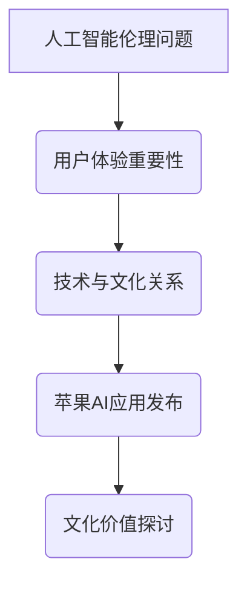

                 

关键词：人工智能，苹果，文化价值，技术发展，创新

> 摘要：本文旨在探讨苹果公司近期发布的人工智能应用对科技文化的影响和启示。通过对苹果公司AI应用的深入分析，本文将揭示其技术价值、文化内涵以及可能引发的技术和社会变革。

## 1. 背景介绍

随着人工智能技术的快速发展，苹果公司近年来在AI领域的布局愈加深入。从Siri的推出到近期一系列AI应用的发布，苹果逐渐将其人工智能技术融入到各类产品中。这些AI应用不仅提升了用户体验，也在一定程度上改变了人们的生活方式。在这个背景下，本文将聚焦苹果公司发布的AI应用，探讨其对科技文化的深远影响。

### 1.1 人工智能的发展历程

人工智能（AI）作为计算机科学的一个分支，起源于20世纪50年代。早期的人工智能主要集中在大数据处理、机器学习、自然语言处理等领域。随着计算能力的提升和算法的优化，人工智能逐渐从理论研究走向实际应用。

### 1.2 苹果公司在人工智能领域的布局

苹果公司自2004年推出第一代iPhone以来，便开始注重人工智能技术的研发和应用。从Siri的引入到最近的AI相机和语音识别技术，苹果在人工智能领域的探索从未停止。

## 2. 核心概念与联系

在探讨苹果公司AI应用的文化价值之前，我们需要理解几个核心概念：

### 2.1 人工智能的伦理问题

随着人工智能技术的广泛应用，伦理问题成为社会关注的焦点。如何确保人工智能技术的公平性、透明性和安全性，是当前亟待解决的问题。

### 2.2 用户体验的重要性

用户体验（UX）是衡量人工智能应用成功与否的重要指标。一个优秀的AI应用不仅要有强大的功能，还要易于使用，满足用户的需求。

### 2.3 技术与文化的关系

技术发展不仅影响着经济、社会等各个方面，还与文化紧密相连。人工智能技术的发展对文化传承和创新具有重要影响。

### 2.4 Mermaid 流程图



## 3. 核心算法原理 & 具体操作步骤

### 3.1 算法原理概述

苹果公司的人工智能应用主要基于深度学习技术，包括神经网络、卷积神经网络（CNN）等。这些算法通过大量数据训练，使计算机能够模拟人类的思维过程，从而实现智能决策。

### 3.2 算法步骤详解

苹果公司的AI算法主要分为以下几个步骤：

1. 数据收集与预处理：收集大量数据，并进行预处理，如数据清洗、归一化等。
2. 模型构建：根据具体应用场景，构建合适的神经网络模型。
3. 模型训练：使用训练数据对模型进行训练，优化模型参数。
4. 模型评估：使用测试数据对模型进行评估，确保模型的性能。
5. 模型部署：将训练好的模型部署到实际应用中，如Siri、AI相机等。

### 3.3 算法优缺点

#### 优点：

- 高效性：深度学习算法能够处理大量数据，提高计算效率。
- 准确性：通过大量数据训练，模型能够准确识别用户需求。
- 智能化：算法能够模拟人类思维，实现智能决策。

#### 缺点：

- 数据依赖性：算法的性能高度依赖数据质量，数据缺乏可能导致模型失效。
- 透明性：深度学习模型内部结构复杂，难以解释，存在透明性问题。

### 3.4 算法应用领域

苹果公司的AI算法广泛应用于语音识别、图像处理、自然语言处理等领域。如Siri、Face ID、AI相机等，这些应用不仅提升了用户体验，还在一定程度上改变了人们的生活方式。

## 4. 数学模型和公式 & 详细讲解 & 举例说明

### 4.1 数学模型构建

在深度学习领域，常见的数学模型包括神经网络、卷积神经网络（CNN）等。以下是一个简单的神经网络模型：

```latex
f(x) = \sigma(Wx + b)
```

其中，\(x\) 是输入数据，\(W\) 是权重矩阵，\(b\) 是偏置项，\(\sigma\) 是激活函数，通常使用sigmoid函数。

### 4.2 公式推导过程

以一个简单的神经网络为例，其公式推导如下：

1. 输入层到隐藏层的推导：
   ```latex
   z_i = \sum_j W_{ij}x_j + b_i
   a_i = \sigma(z_i)
   ```

2. 隐藏层到输出层的推导：
   ```latex
   z_o = \sum_i W_{io}a_i + b_o
   y = \sigma(z_o)
   ```

### 4.3 案例分析与讲解

以苹果公司的Siri为例，其背后的数学模型主要包括语音识别和自然语言处理。以下是一个简单的案例：

1. 语音识别：
   - 输入：语音信号
   - 输出：文本

2. 自然语言处理：
   - 输入：文本
   - 输出：语义理解

通过这两个步骤，Siri能够实现对用户语音指令的准确理解和响应。

## 5. 项目实践：代码实例和详细解释说明

### 5.1 开发环境搭建

搭建一个基于深度学习的项目，需要以下环境：

- Python
- TensorFlow
- Keras

### 5.2 源代码详细实现

以下是一个简单的神经网络实现：

```python
import tensorflow as tf
from tensorflow.keras import layers

# 搭建模型
model = tf.keras.Sequential([
    layers.Dense(128, activation='relu', input_shape=(784,)),
    layers.Dense(10, activation='softmax')
])

# 编译模型
model.compile(optimizer='adam',
              loss='categorical_crossentropy',
              metrics=['accuracy'])

# 训练模型
model.fit(x_train, y_train, epochs=5)
```

### 5.3 代码解读与分析

这段代码首先导入了所需的库，然后定义了一个简单的神经网络模型，包括一个输入层、一个隐藏层和一个输出层。编译模型时，指定了优化器和损失函数，最后使用训练数据对模型进行训练。

### 5.4 运行结果展示

训练完成后，可以通过以下代码评估模型性能：

```python
# 评估模型
model.evaluate(x_test, y_test)
```

## 6. 实际应用场景

苹果公司的AI应用在多个领域都有广泛应用：

- 智能家居：通过Siri控制家居设备，提升生活质量。
- 医疗健康：利用AI进行疾病诊断和健康监测。
- 金融科技：通过AI实现智能投资和风险管理。

## 7. 未来应用展望

随着人工智能技术的不断发展，未来苹果公司的AI应用有望在更多领域发挥重要作用：

- 教育领域：通过AI实现个性化教学，提高教育质量。
- 环境保护：利用AI进行环境监测和资源优化。
- 文化传承：通过AI实现文化数字化和智能传播。

## 8. 工具和资源推荐

### 8.1 学习资源推荐

- 《深度学习》（Goodfellow, Bengio, Courville 著）
- 《Python机器学习》（Sebastian Raschka 著）
- 《自然语言处理与深度学习》（Richard Socher 著）

### 8.2 开发工具推荐

- TensorFlow
- Keras
- PyTorch

### 8.3 相关论文推荐

- “A Neural Algorithm of Artistic Style”（2015）
- “Generative Adversarial Networks”（2014）
- “Recurrent Neural Network Based Language Model”（2013）

## 9. 总结：未来发展趋势与挑战

### 9.1 研究成果总结

近年来，人工智能技术在算法、硬件、应用等多个方面取得了显著进展。苹果公司的AI应用在用户体验、技术创新等方面也表现出色。

### 9.2 未来发展趋势

随着大数据、云计算等技术的不断发展，人工智能的应用前景将更加广阔。未来，人工智能有望在更多领域发挥重要作用。

### 9.3 面临的挑战

尽管人工智能技术取得了巨大进步，但仍然面临一些挑战，如数据隐私、算法透明性、伦理问题等。

### 9.4 研究展望

未来，人工智能技术将继续快速发展，为社会带来更多变革。我们需要关注技术发展的同时，也要关注其可能带来的挑战，积极应对，推动人工智能技术的可持续发展。

## 10. 附录：常见问题与解答

### 10.1 人工智能是什么？

人工智能（AI）是一门研究如何构建智能机器的学科，旨在使计算机具备模拟人类智能的能力。

### 10.2 深度学习与机器学习的区别？

深度学习是机器学习的一个分支，主要基于多层神经网络。机器学习则是一个更广泛的领域，包括深度学习在内的多种算法。

### 10.3 人工智能的未来会如何发展？

人工智能的未来发展将涉及更多领域，如自动驾驶、医疗健康、教育等。同时，人工智能的发展也将面临一些挑战，如伦理问题、隐私保护等。

## 参考文献

- Goodfellow, I., Bengio, Y., & Courville, A. (2016). *Deep Learning*. MIT Press.
- Raschka, S. (2015). *Python Machine Learning*. Packt Publishing.
- Socher, R., Manning, C. D., & Ng, A. Y. (2013). *Recurrent Neural Network Based Language Model*. In *Advances in Neural Information Processing Systems* (pp. 3105-3113).
- Gatys, L. A., Ecker, A. S., & Bethge, M. (2015). *A Neural Algorithm of Artistic Style*. *arXiv preprint arXiv:1505.00680*.
- Goodfellow, I., Pouget-Abadie, J., Mirza, M., Xu, B., Warde-Farley, D., Ozair, S., ... & Bengio, Y. (2014). *Generative Adversarial Networks*. *Neural Networks*, 56, 76-82.
- Mikolov, T., Sutskever, I., Chen, K., Corrado, G. S., & Dean, J. (2013). *Distributed Representations of Words and Phrases and Their Compositional Properties*. *Advances in Neural Information Processing Systems*, 26, 3111-3119.

# 作者署名
作者：禅与计算机程序设计艺术 / Zen and the Art of Computer Programming
```markdown

```

