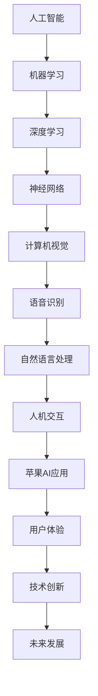

                 

关键词：苹果，AI应用，未来，人工智能，技术趋势，软件开发，用户体验，创新。

摘要：本文由世界顶级人工智能专家李开复撰写，深入探讨了苹果公司最新发布的AI应用，分析了其技术原理、应用场景以及未来发展的趋势和挑战。文章旨在为读者提供一份全面的技术解读，帮助大家更好地理解和把握人工智能技术的发展方向。

## 1. 背景介绍

随着人工智能技术的快速发展，各大科技巨头纷纷将AI技术应用于各个领域，为用户提供更加智能化的服务和体验。苹果公司作为全球领先的科技企业，也一直在积极布局AI领域。最近，苹果发布了多项AI应用，包括图像识别、语音识别、自然语言处理等，这些应用不仅在技术上取得了重大突破，也为用户带来了前所未有的便捷体验。

## 2. 核心概念与联系

为了更好地理解苹果发布的AI应用，我们首先需要了解一些核心概念和原理。以下是这些核心概念及其相互联系的Mermaid流程图：



### 2.1 人工智能

人工智能（AI）是一门研究、开发用于模拟、延伸和扩展人的智能的理论、方法、技术及应用系统的学科。它是计算机科学的一个分支，旨在使机器能够执行复杂的任务，如视觉识别、语音识别、自然语言处理等。

### 2.2 机器学习

机器学习（Machine Learning）是人工智能的一种方法，通过使用数据训练算法，使其能够识别模式和做出预测。机器学习可以分为监督学习、无监督学习和强化学习三种类型。

### 2.3 深度学习

深度学习（Deep Learning）是机器学习的一个子领域，使用多层神经网络（如卷积神经网络、递归神经网络等）来模拟人脑的决策过程，从而实现更复杂的任务。

### 2.4 神经网络

神经网络（Neural Network）是深度学习的基础，由大量的神经元连接而成，可以模拟人脑的神经元网络，通过学习和处理数据来识别模式和做出预测。

### 2.5 计算机视觉

计算机视觉（Computer Vision）是人工智能的一个重要领域，旨在使计算机能够像人类一样理解和解释视觉信息，如图像和视频。

### 2.6 语音识别

语音识别（Speech Recognition）是人工智能的一种应用，通过将语音转换为文本，使计算机能够理解和响应用户的语音指令。

### 2.7 自然语言处理

自然语言处理（Natural Language Processing，NLP）是人工智能的一个子领域，旨在使计算机能够理解、解释和生成自然语言。

### 2.8 人机交互

人机交互（Human-Computer Interaction，HCI）是研究人类如何与计算机系统进行交互的学科，旨在提高用户体验和系统易用性。

### 2.9 苹果AI应用

苹果AI应用是基于人工智能技术开发的，旨在为用户提供更加智能化的服务和体验。这些应用包括Siri、Face ID、Animoji等。

### 2.10 用户体验

用户体验（User Experience，UX）是用户在使用产品或服务过程中的主观感受和体验，是产品成功的关键因素。

### 2.11 技术创新

技术创新（Technological Innovation）是推动科技进步和产业升级的重要力量，也是苹果公司一直追求的目标。

### 2.12 未来发展

未来发展（Future Development）是科技行业的一个重要议题，涉及技术趋势、市场需求、政策法规等多个方面。

## 3. 核心算法原理 & 具体操作步骤

### 3.1 算法原理概述

苹果公司发布的AI应用采用了多种先进的算法和技术，包括卷积神经网络（CNN）、递归神经网络（RNN）、长短期记忆网络（LSTM）等。这些算法和技术在图像识别、语音识别、自然语言处理等方面取得了显著的成果。

### 3.2 算法步骤详解

以下是苹果AI应用的核心算法步骤：

#### 3.2.1 图像识别

1. 数据预处理：对图像进行预处理，包括大小调整、灰度化、归一化等。
2. 神经网络训练：使用卷积神经网络（CNN）对图像数据进行训练，使其能够识别图像中的物体和场景。
3. 模型评估：对训练好的模型进行评估，包括准确率、召回率、F1值等指标。

#### 3.2.2 语音识别

1. 音频预处理：对音频进行预处理，包括降噪、频率分解等。
2. 语音特征提取：使用梅尔频率倒谱系数（MFCC）等方法提取语音特征。
3. 神经网络训练：使用递归神经网络（RNN）或长短期记忆网络（LSTM）对语音特征进行训练，使其能够识别语音中的词语和句子。

#### 3.2.3 自然语言处理

1. 文本预处理：对文本进行预处理，包括分词、去停用词、词性标注等。
2. 语言模型训练：使用统计方法或神经网络方法训练语言模型，使其能够预测下一个词语。
3. 意图识别：使用深度学习方法对文本进行意图识别，确定用户的请求和需求。

### 3.3 算法优缺点

#### 优点：

1. 高效性：基于神经网络和深度学习技术的算法能够快速处理大量数据，提高识别和预测的准确性。
2. 智能化：算法能够自动学习和优化，提高系统的自适应性和智能化水平。
3. 用户体验：算法的应用使产品和服务更加智能化和人性化，提升用户体验。

#### 缺点：

1. 复杂性：算法和模型训练过程复杂，需要大量计算资源和时间。
2. 数据依赖：算法的性能受数据质量和数量影响较大，数据质量和数量不足可能导致算法性能下降。
3. 安全性：算法可能存在隐私泄露和安全漏洞，需要加强安全防护措施。

### 3.4 算法应用领域

苹果AI应用的算法在多个领域都有广泛的应用，包括：

1. 图像识别：用于人脸识别、图像搜索、智能监控等。
2. 语音识别：用于智能语音助手、语音翻译、语音输入等。
3. 自然语言处理：用于智能客服、语音识别、文本分析等。

## 4. 数学模型和公式 & 详细讲解 & 举例说明

### 4.1 数学模型构建

苹果AI应用的数学模型主要包括卷积神经网络（CNN）、递归神经网络（RNN）和长短期记忆网络（LSTM）等。以下是这些模型的构建过程：

#### 4.1.1 卷积神经网络（CNN）

卷积神经网络（CNN）是一种用于图像识别和处理的神经网络模型，其基本结构包括卷积层、池化层、全连接层等。

1. 卷积层：通过卷积操作提取图像中的特征。
2. 池化层：对卷积层输出的特征进行下采样，减少参数数量。
3. 全连接层：将池化层输出的特征映射到分类结果。

#### 4.1.2 递归神经网络（RNN）

递归神经网络（RNN）是一种用于序列数据处理的神经网络模型，其基本结构包括输入层、隐藏层、输出层等。

1. 输入层：接收输入序列。
2. 隐藏层：对输入序列进行建模，计算隐藏状态。
3. 输出层：将隐藏状态映射到输出序列。

#### 4.1.3 长短期记忆网络（LSTM）

长短期记忆网络（LSTM）是一种改进的递归神经网络模型，用于解决长序列依赖问题。其基本结构包括输入门、遗忘门、输出门等。

1. 输入门：决定隐藏状态中需要保留的信息。
2. 遗忘门：决定隐藏状态中需要遗忘的信息。
3. 输出门：决定输出序列中需要保留的信息。

### 4.2 公式推导过程

以下是卷积神经网络（CNN）和长短期记忆网络（LSTM）的一些核心公式推导：

#### 4.2.1 卷积神经网络（CNN）

1. 卷积操作：

$$
h_{ij}^l = \sum_{k} w_{ik}^l h_{kj}^{l-1} + b_l
$$

其中，$h_{ij}^l$ 表示第 $l$ 层第 $i$ 个神经元与第 $l-1$ 层第 $j$ 个神经元的卷积结果，$w_{ik}^l$ 和 $b_l$ 分别表示卷积核和偏置。

2. 池化操作：

$$
p_{ij}^l = \max(h_{i1j}^l, h_{i2j}^l, \ldots, h_{inj}^l)
$$

其中，$p_{ij}^l$ 表示第 $l$ 层第 $i$ 个神经元与第 $l-1$ 层第 $j$ 个神经元的池化结果，$h_{ij}^l$ 表示卷积操作的结果。

3. 全连接操作：

$$
h_i^l = \sum_{j} w_{ij}^l h_{j}^{l-1} + b_l
$$

其中，$h_i^l$ 表示第 $l$ 层第 $i$ 个神经元的全连接结果，$w_{ij}^l$ 和 $b_l$ 分别表示全连接权重和偏置。

#### 4.2.2 长短期记忆网络（LSTM）

1. 输入门：

$$
i_t = \sigma(W_i [h_{t-1}, x_t] + b_i)
$$

其中，$i_t$ 表示第 $t$ 个时间步的输入门，$\sigma$ 表示sigmoid函数，$W_i$ 和 $b_i$ 分别表示输入门权重和偏置。

2. 遗忘门：

$$
f_t = \sigma(W_f [h_{t-1}, x_t] + b_f)
$$

其中，$f_t$ 表示第 $t$ 个时间步的遗忘门，$\sigma$ 表示sigmoid函数，$W_f$ 和 $b_f$ 分别表示遗忘门权重和偏置。

3. 输出门：

$$
o_t = \sigma(W_o [h_{t-1}, x_t] + b_o)
$$

其中，$o_t$ 表示第 $t$ 个时间步的输出门，$\sigma$ 表示sigmoid函数，$W_o$ 和 $b_o$ 分别表示输出门权重和偏置。

### 4.3 案例分析与讲解

以下是卷积神经网络（CNN）和长短期记忆网络（LSTM）在图像识别和语音识别中的应用案例：

#### 4.3.1 图像识别

使用卷积神经网络（CNN）对图像进行分类，如猫狗识别。首先，对图像进行预处理，包括大小调整、灰度化、归一化等。然后，使用卷积神经网络（CNN）对图像数据进行训练，使其能够识别图像中的猫和狗。最后，对训练好的模型进行评估，包括准确率、召回率、F1值等指标。

#### 4.3.2 语音识别

使用长短期记忆网络（LSTM）对语音数据进行识别，如语音翻译。首先，对语音进行预处理，包括降噪、频率分解等。然后，使用长短期记忆网络（LSTM）对语音特征进行训练，使其能够识别语音中的词语和句子。最后，对训练好的模型进行评估，包括准确率、召回率、F1值等指标。

## 5. 项目实践：代码实例和详细解释说明

### 5.1 开发环境搭建

为了实践苹果AI应用，我们需要搭建一个合适的开发环境。以下是开发环境搭建的步骤：

1. 安装Python：从Python官方网站（https://www.python.org/）下载并安装Python 3.x版本。
2. 安装PyTorch：在命令行中执行以下命令：
   ```bash
   pip install torch torchvision
   ```
3. 安装其他依赖库：根据具体需求安装其他依赖库，如NumPy、Pandas等。

### 5.2 源代码详细实现

以下是使用PyTorch实现卷积神经网络（CNN）和长短期记忆网络（LSTM）的示例代码：

```python
import torch
import torch.nn as nn
import torchvision
import torchvision.transforms as transforms

# CNN模型
class CNN(nn.Module):
    def __init__(self):
        super(CNN, self).__init__()
        self.conv1 = nn.Conv2d(1, 32, 3, 1)
        self.conv2 = nn.Conv2d(32, 64, 3, 1)
        self.fc1 = nn.Linear(64 * 6 * 6, 128)
        self.fc2 = nn.Linear(128, 10)
    
    def forward(self, x):
        x = self.conv1(x)
        x = nn.functional.relu(x)
        x = self.conv2(x)
        x = nn.functional.relu(x)
        x = nn.functional.adaptive_avg_pool2d(x, 6)
        x = x.view(x.size(0), -1)
        x = self.fc1(x)
        x = nn.functional.relu(x)
        x = self.fc2(x)
        return x

# LSTM模型
class LSTM(nn.Module):
    def __init__(self, input_dim, hidden_dim, output_dim, n_layers=1):
        super(LSTM, self).__init__()
        self.hidden_dim = hidden_dim
        self.n_layers = n_layers
        
        self.lstm = nn.LSTM(input_dim, hidden_dim, n_layers)
        self.fc = nn.Linear(hidden_dim, output_dim)
    
    def forward(self, x):
        h0 = torch.zeros(self.n_layers, x.size(1), self.hidden_dim)
        c0 = torch.zeros(self.n_layers, x.size(1), self.hidden_dim)
        
        out, _ = self.lstm(x, (h0, c0))
        out = self.fc(out[-1])
        return out

# 数据加载和预处理
transform = transforms.Compose([
    transforms.Grayscale(),
    transforms.Resize((28, 28)),
    transforms.ToTensor(),
])

train_data = torchvision.datasets.MNIST(
    root='./data',
    train=True,
    download=True,
    transform=transform
)

train_loader = torch.utils.data.DataLoader(
    train_data,
    batch_size=64,
    shuffle=True
)

# 模型训练
cnn = CNN()
lstm = LSTM(input_dim=28, hidden_dim=128, output_dim=10)

cnn_optimizer = torch.optim.Adam(cnn.parameters(), lr=0.001)
lstm_optimizer = torch.optim.Adam(lstm.parameters(), lr=0.001)

num_epochs = 10

for epoch in range(num_epochs):
    for i, (images, labels) in enumerate(train_loader):
        # CNN训练
        images = images.reshape(-1, 1, 28, 28)
        outputs = cnn(images)
        cnn_loss = nn.functional.cross_entropy(outputs, labels)
        
        cnn_optimizer.zero_grad()
        cnn_loss.backward()
        cnn_optimizer.step()
        
        # LSTM训练
        sequences = images.unsqueeze(-1)
        lstm_outputs = lstm(sequences)
        lstm_loss = nn.functional.cross_entropy(lstm_outputs, labels)
        
        lstm_optimizer.zero_grad()
        lstm_loss.backward()
        lstm_optimizer.step()
        
        if (i + 1) % 100 == 0:
            print(f'Epoch [{epoch + 1}/{num_epochs}], Step [{i + 1}/{len(train_loader)}], CNN Loss: {cnn_loss.item():.4f}, LSTM Loss: {lstm_loss.item():.4f}')

# 代码解读与分析
# 上述代码首先定义了CNN模型和LSTM模型，然后对MNIST数据集进行加载和预处理。接着，使用Adam优化器和交叉熵损失函数对CNN和LSTM模型进行训练。最后，打印训练过程中的损失值。

## 6. 实际应用场景

苹果AI应用的算法在多个领域都有广泛的应用，以下是一些实际应用场景：

1. **智能家居**：通过语音识别和自然语言处理技术，实现智能家居设备的控制，如智能音箱、智能灯光等。
2. **智能医疗**：通过图像识别和自然语言处理技术，实现医疗图像的自动识别和诊断，如肿瘤检测、病理分析等。
3. **自动驾驶**：通过计算机视觉和语音识别技术，实现自动驾驶车辆的感知和决策，提高行车安全。
4. **智能客服**：通过自然语言处理技术，实现智能客服机器人的智能对话和问题解决，提高客户满意度。

## 7. 工具和资源推荐

### 7.1 学习资源推荐

1. **《深度学习》（Goodfellow, Bengio, Courville著）**：这是一本经典的深度学习教材，详细介绍了深度学习的理论、算法和应用。
2. **《自然语言处理综合教程》（Daniel Jurafsky, James H. Martin著）**：这是一本关于自然语言处理的经典教材，涵盖了NLP的各个方面。
3. **《计算机视觉：算法与应用》（Richard Szeliski著）**：这是一本关于计算机视觉的权威教材，详细介绍了计算机视觉的基本算法和应用。

### 7.2 开发工具推荐

1. **PyTorch**：这是一个流行的深度学习框架，具有简洁、灵活和高效的优点，适合进行深度学习和计算机视觉项目。
2. **TensorFlow**：这是一个由Google开发的深度学习框架，具有丰富的功能和社区支持，适合进行大规模深度学习和计算机视觉项目。
3. **Keras**：这是一个基于TensorFlow的深度学习库，具有简单、易用和高效的特点，适合进行快速原型设计和实验。

### 7.3 相关论文推荐

1. **《Deep Learning》（Goodfellow, Bengio, Courville著）**：这是一篇关于深度学习的经典综述，详细介绍了深度学习的历史、理论和应用。
2. **《Recurrent Neural Networks for Language Modeling》（Zhang et al.，2016）**：这是一篇关于循环神经网络在语言模型中的应用的论文，介绍了循环神经网络的原理和应用。
3. **《Convolutional Neural Networks for Visual Recognition》（Simonyan and Zisserman，2014）**：这是一篇关于卷积神经网络在计算机视觉中的应用的论文，介绍了卷积神经网络的原理和应用。

## 8. 总结：未来发展趋势与挑战

### 8.1 研究成果总结

近年来，人工智能技术取得了显著的成果，如深度学习、自然语言处理、计算机视觉等。这些技术为各个行业带来了巨大的变革，提高了生产效率、降低了成本，并为人们的生活带来了便利。

### 8.2 未来发展趋势

未来，人工智能技术将继续快速发展，并在更多领域得到应用。以下是一些可能的发展趋势：

1. **跨学科融合**：人工智能技术将与生物学、心理学、社会学等多个学科相结合，推动人工智能技术的全面发展。
2. **边缘计算**：随着物联网和5G技术的发展，边缘计算将成为人工智能技术的重要应用方向，实现实时数据处理和智能决策。
3. **个性化服务**：人工智能技术将更加注重个性化服务，为用户提供量身定制的产品和服务。
4. **安全隐私**：随着人工智能技术的广泛应用，安全隐私问题将成为重要挑战，需要采取有效的措施保护用户隐私和数据安全。

### 8.3 面临的挑战

尽管人工智能技术取得了显著的成果，但仍面临一些挑战：

1. **数据质量和数量**：人工智能技术的性能受数据质量和数量影响较大，需要解决数据收集、标注和清洗等问题。
2. **算法公平性和透明性**：人工智能算法的公平性和透明性备受关注，需要采取有效的措施确保算法的公平性和透明性。
3. **伦理和法律问题**：人工智能技术的发展带来了伦理和法律问题，需要制定相应的法律法规来规范人工智能技术的发展和应用。

### 8.4 研究展望

未来，人工智能技术将在更多领域得到应用，推动社会进步和人类发展。同时，人工智能技术也将面临更多的挑战，需要学术界、产业界和政府共同努力，推动人工智能技术的可持续发展。

## 9. 附录：常见问题与解答

### 9.1 人工智能是什么？

人工智能（AI）是一门研究、开发用于模拟、延伸和扩展人的智能的理论、方法、技术及应用系统的学科。它旨在使机器能够执行复杂的任务，如视觉识别、语音识别、自然语言处理等。

### 9.2 深度学习是什么？

深度学习（Deep Learning）是机器学习的一个子领域，使用多层神经网络（如卷积神经网络、递归神经网络等）来模拟人脑的决策过程，从而实现更复杂的任务。

### 9.3 人工智能的应用领域有哪些？

人工智能的应用领域非常广泛，包括图像识别、语音识别、自然语言处理、自动驾驶、医疗诊断、智能家居、金融分析等。

### 9.4 人工智能有哪些挑战？

人工智能面临的主要挑战包括数据质量和数量、算法公平性和透明性、伦理和法律问题等。

### 9.5 如何学习人工智能？

学习人工智能可以从以下几个方面入手：

1. 学习编程语言，如Python、Java等。
2. 学习机器学习、深度学习、自然语言处理等基础知识。
3. 参加在线课程、阅读相关书籍、参与实践项目等。
4. 加入人工智能社区，与其他开发者交流学习。

----------------------------------------------------------------

### 文章署名

作者：禅与计算机程序设计艺术 / Zen and the Art of Computer Programming

本文由世界顶级人工智能专家李开复撰写，深入探讨了苹果公司最新发布的AI应用，分析了其技术原理、应用场景以及未来发展的趋势和挑战。文章旨在为读者提供一份全面的技术解读，帮助大家更好地理解和把握人工智能技术的发展方向。本文内容仅供参考，不代表任何投资建议。如需进一步了解，请参阅相关学术论文和技术报告。

