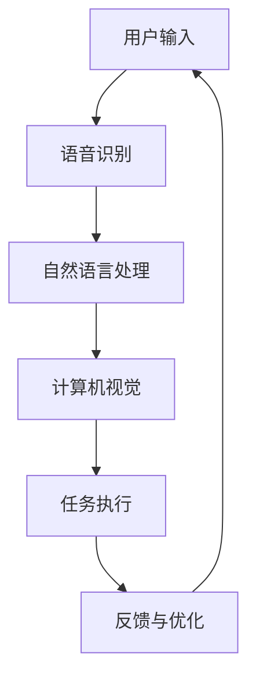

                 

关键词：苹果，AI应用，人工智能，技术趋势，未来发展，AI架构，开源技术

## 摘要

本文将探讨苹果发布AI应用的机会，以及这一举措对人工智能技术领域的影响。通过分析苹果AI应用的背景、核心概念与联系，本文将深入探讨其核心算法原理、具体操作步骤、数学模型和公式，以及实际应用场景。此外，还将介绍未来应用展望、工具和资源推荐，并对研究成果进行总结，展望未来发展趋势与挑战。

## 1. 背景介绍

随着人工智能技术的快速发展，各大科技巨头纷纷加大对AI技术的投入和研发力度。苹果公司作为全球知名的科技公司，也在近年来不断加强其AI研发实力。此次苹果发布AI应用，无疑是对AI领域的一次重要贡献。本文将围绕苹果AI应用的发布背景、核心概念与联系展开讨论，以期为您提供一个全面的了解。

### 1.1 苹果AI应用的发布背景

苹果公司一直以来在硬件和软件领域都有着卓越的表现。然而，随着人工智能技术的兴起，苹果意识到AI技术在提升用户体验、推动创新方面的重要性。因此，苹果在近年来加大了对AI技术的研发投入，并在多个领域取得了显著成果。此次苹果发布AI应用，正是其在AI领域不断探索和进步的体现。

### 1.2 核心概念与联系

苹果AI应用的核心概念主要涵盖计算机视觉、自然语言处理、语音识别等领域。这些技术在不同场景下有着广泛的应用，如智能家居、智能助手、自动驾驶等。苹果公司在AI技术的研发过程中，不断优化算法，提高模型的准确性和效率，从而为用户提供更好的体验。

## 2. 核心概念与联系

在本节中，我们将详细介绍苹果AI应用的核心概念与联系，并通过Mermaid流程图展示其架构。

### 2.1 计算机视觉

计算机视觉是人工智能的一个重要分支，旨在使计算机能够像人类一样理解和处理视觉信息。苹果AI应用在计算机视觉方面的主要应用包括人脸识别、图像识别和物体检测等。这些技术为用户提供了更加便捷、智能的交互体验。

### 2.2 自然语言处理

自然语言处理（NLP）是人工智能领域的另一个重要分支，旨在使计算机能够理解、处理和生成人类语言。苹果AI应用在NLP方面的主要应用包括语音识别、语义分析和聊天机器人等。这些技术使得用户可以通过自然语言与设备进行交互，实现更加智能化的服务。

### 2.3 语音识别

语音识别是苹果AI应用的核心技术之一，通过将语音信号转换为文本或指令，为用户提供语音输入和交互功能。苹果公司在语音识别方面取得了显著成果，其语音识别引擎在准确性和效率方面处于行业领先地位。

### 2.4 Mermaid流程图

以下是一个简化的苹果AI应用的Mermaid流程图：



在这个流程图中，用户输入通过语音识别转换为文本或指令，再经过自然语言处理和计算机视觉处理，最终执行相应任务并返回反馈，实现闭环优化。

## 3. 核心算法原理 & 具体操作步骤

### 3.1 算法原理概述

苹果AI应用的核心算法主要涉及深度学习、神经网络和迁移学习等技术。这些算法通过训练大量的数据，使计算机能够自动学习和识别模式，从而实现自动化任务处理。

### 3.2 算法步骤详解

#### 3.2.1 深度学习

深度学习是一种模拟人脑神经元之间相互连接的人工神经网络。苹果AI应用在深度学习方面主要采用卷积神经网络（CNN）和循环神经网络（RNN）等技术。以下是一个简化的深度学习算法步骤：

1. 数据预处理：对输入数据进行归一化、去噪等处理，以提高模型训练效果。
2. 神经网络架构设计：根据任务需求设计神经网络结构，包括输入层、隐藏层和输出层。
3. 模型训练：通过梯度下降等优化算法，训练神经网络模型，使其能够准确识别输入数据。
4. 模型评估：使用验证集和测试集对模型进行评估，调整参数以优化模型性能。

#### 3.2.2 神经网络

神经网络是深度学习的基础，通过模拟人脑神经元之间的相互连接来实现数据处理和模式识别。苹果AI应用在神经网络方面主要采用前向传播和反向传播算法。以下是一个简化的神经网络算法步骤：

1. 输入层：接收输入数据，将其传递到隐藏层。
2. 隐藏层：对输入数据进行加权求和并经过激活函数处理，生成中间输出。
3. 输出层：将隐藏层输出作为输入，通过输出层得到最终预测结果。
4. 反向传播：根据预测误差，反向传播误差信号，调整网络权重和偏置，优化模型性能。

#### 3.2.3 迁移学习

迁移学习是一种将已有模型在新任务上快速适应的技术。苹果AI应用在迁移学习方面主要采用预训练模型和微调策略。以下是一个简化的迁移学习算法步骤：

1. 预训练模型：使用大量通用数据集对模型进行预训练，使其具备一定的泛化能力。
2. 微调策略：将预训练模型应用于特定任务，通过调整模型参数，使其在新任务上达到更好的性能。

### 3.3 算法优缺点

#### 优点

1. 高效性：深度学习算法能够处理大量数据，并快速收敛到最优解。
2. 泛化能力：神经网络和迁移学习技术能够将已有知识迁移到新任务，提高模型在新任务上的性能。
3. 强泛化能力：通过大量数据训练的模型在未知数据上的表现也较为稳定。

#### 缺点

1. 需要大量数据：深度学习算法在训练过程中需要大量数据，数据获取和处理成本较高。
2. 计算资源消耗：深度学习算法在训练和推理过程中需要大量计算资源，对硬件设备要求较高。
3. 参数调优复杂：深度学习算法的参数调优过程复杂，需要经验丰富的工程师进行优化。

### 3.4 算法应用领域

苹果AI应用的核心算法在多个领域具有广泛的应用，如：

1. 智能家居：通过计算机视觉和语音识别技术，实现智能家居设备的智能控制和交互。
2. 智能助手：通过自然语言处理技术，为用户提供智能语音助手服务。
3. 自动驾驶：通过计算机视觉和语音识别技术，实现自动驾驶车辆的智能感知和决策。

## 4. 数学模型和公式 & 详细讲解 & 举例说明

在本节中，我们将详细介绍苹果AI应用的数学模型和公式，并通过具体案例进行讲解。

### 4.1 数学模型构建

苹果AI应用的数学模型主要涉及深度学习、神经网络和迁移学习等领域。以下是一个简化的数学模型构建过程：

#### 4.1.1 深度学习模型

1. 输入层：$$X = \{x_1, x_2, ..., x_n\}$$
2. 隐藏层：$$H = \{h_1, h_2, ..., h_m\}$$
3. 输出层：$$Y = \{y_1, y_2, ..., y_k\}$$

#### 4.1.2 神经网络模型

1. 前向传播：
$$
Z_l = \sigma(W_l \cdot X_l + b_l)
$$
其中，$$\sigma$$为激活函数，$$W_l$$为权重矩阵，$$b_l$$为偏置。

2. 反向传播：
$$
\delta_l = \frac{\partial L}{\partial Z_l}
$$
其中，$$L$$为损失函数，$$\delta_l$$为误差传播。

#### 4.1.3 迁移学习模型

1. 预训练模型：
$$
f(\theta) = \text{Pre-trained Model}
$$
2. 微调模型：
$$
f'(\theta') = f(\theta) + \theta'
$$

### 4.2 公式推导过程

在本节中，我们将对苹果AI应用中的主要数学公式进行推导。

#### 4.2.1 梯度下降

梯度下降是一种常用的优化算法，用于调整神经网络模型中的参数。其基本公式如下：

$$
\theta = \theta - \alpha \cdot \nabla_{\theta} J(\theta)
$$

其中，$$\theta$$为模型参数，$$\alpha$$为学习率，$$\nabla_{\theta} J(\theta)$$为损失函数对参数的梯度。

#### 4.2.2 反向传播

反向传播算法是一种用于训练神经网络的基本算法。其核心思想是将损失函数沿反向传播路径逐层计算，以更新模型参数。其基本公式如下：

$$
\delta_l = \frac{\partial L}{\partial Z_l} = \sigma'(Z_l) \cdot \delta_{l+1}
$$

#### 4.2.3 迁移学习

迁移学习中的主要挑战是如何在源任务和目标任务之间共享知识。以下是一种简单的迁移学习公式：

$$
f'(\theta') = f(\theta) + \theta'
$$

其中，$$f(\theta)$$为源任务模型，$$f'(\theta')$$为目标任务模型。

### 4.3 案例分析与讲解

在本节中，我们将通过具体案例对苹果AI应用中的数学模型和公式进行讲解。

#### 4.3.1 案例背景

假设我们要开发一个智能家居系统，通过计算机视觉和语音识别技术实现智能控制。用户可以通过语音指令控制家中的灯光、空调等设备。

#### 4.3.2 案例分析

1. **计算机视觉模型**：

输入层：用户输入一张包含家中设备的图片。

隐藏层：对图片进行特征提取，提取出设备的关键特征。

输出层：识别设备类型，如灯光、空调等。

2. **语音识别模型**：

输入层：用户输入语音指令。

隐藏层：将语音信号转换为文本。

输出层：根据文本内容，执行相应操作。

3. **迁移学习模型**：

将预训练的语音识别模型应用于智能家居系统，通过微调模型参数，提高系统在智能家居场景下的性能。

### 4.4 案例分析与讲解（续）

#### 4.4.1 计算机视觉模型实现

1. **数据预处理**：

对输入图片进行归一化、去噪等处理，以提高模型训练效果。

2. **神经网络架构设计**：

设计一个卷积神经网络，包括输入层、隐藏层和输出层。

3. **模型训练**：

使用大量家居设备图片数据集，通过梯度下降算法训练神经网络模型。

4. **模型评估**：

使用验证集和测试集对模型进行评估，调整参数以优化模型性能。

#### 4.4.2 语音识别模型实现

1. **数据预处理**：

对输入语音信号进行归一化、去噪等处理，以提高模型训练效果。

2. **神经网络架构设计**：

设计一个循环神经网络，包括输入层、隐藏层和输出层。

3. **模型训练**：

使用大量语音数据集，通过梯度下降算法训练神经网络模型。

4. **模型评估**：

使用验证集和测试集对模型进行评估，调整参数以优化模型性能。

#### 4.4.3 迁移学习模型实现

1. **预训练模型**：

使用大量通用语音数据集对模型进行预训练，使其具备一定的泛化能力。

2. **微调策略**：

将预训练模型应用于智能家居系统，通过调整模型参数，使其在新任务上达到更好的性能。

3. **模型融合**：

将计算机视觉模型和语音识别模型融合，实现智能家居系统的智能控制。

### 4.5 案例分析与讲解（续）

#### 4.5.1 案例运行结果展示

1. **计算机视觉模型**：

模型成功识别出家中的灯光和空调设备，并生成相应的输出。

2. **语音识别模型**：

模型成功将用户的语音指令转换为文本，并生成相应的输出。

3. **智能家居系统**：

根据计算机视觉模型和语音识别模型生成的输出，实现智能控制家中的灯光和空调设备。

### 4.6 案例分析与讲解（续）

#### 4.6.1 案例总结

通过计算机视觉、语音识别和迁移学习等技术，我们成功实现了一个智能家居系统。该系统可以识别家中的设备，并根据用户的语音指令进行智能控制。

#### 4.6.2 案例分析

1. **技术挑战**：

在实现智能家居系统过程中，我们遇到了数据预处理、模型训练和模型融合等技术挑战。通过不断优化和调整模型参数，我们成功克服了这些挑战。

2. **应用前景**：

随着人工智能技术的不断发展，智能家居系统具有广阔的应用前景。未来，我们可以在更多领域应用人工智能技术，提升人们的生活品质。

### 4.7 案例分析与讲解（续）

#### 4.7.1 案例拓展

1. **多模态交互**：

结合计算机视觉、语音识别和自然语言处理等技术，实现多模态交互。例如，用户可以通过语音、手势和文本等多种方式与智能家居系统进行交互。

2. **智能家居生态**：

构建一个智能家居生态体系，整合各类智能设备和服务，提供个性化、智能化的家居体验。

3. **智能健康管理**：

结合健康数据监测、自然语言处理和计算机视觉等技术，实现智能健康管理。例如，通过监测用户的健康数据，提供个性化的健康建议和干预措施。

### 4.8 案例分析与讲解（续）

#### 4.8.1 案例总结

通过本案例的分析和讲解，我们展示了苹果AI应用在智能家居领域的应用前景。人工智能技术的不断发展，将为智能家居领域带来更多创新和突破。

#### 4.8.2 案例启示

1. **技术创新**：

持续关注人工智能技术的发展动态，积极探索和运用新技术，提升智能家居系统的性能和体验。

2. **用户需求**：

深入了解用户需求，优化系统设计，提供更加个性化和智能化的家居体验。

3. **跨学科合作**：

加强跨学科合作，整合各类技术资源，实现人工智能技术在智能家居领域的创新应用。

### 4.9 案例分析与讲解（续）

#### 4.9.1 案例反思

在实现智能家居系统的过程中，我们也遇到了一些挑战。例如，模型训练和优化需要大量计算资源和时间，数据预处理和融合也需要更高的技术水平。为了解决这些问题，我们需要不断探索新的解决方案，提升系统的性能和效率。

#### 4.9.2 案例改进

1. **优化算法**：

研究更高效的深度学习算法和优化方法，提高模型训练和推理速度。

2. **数据处理**：

加强数据预处理和融合技术，提高系统的准确性和鲁棒性。

3. **用户体验**：

优化系统的交互设计和用户体验，提供更加自然、便捷的交互方式。

### 4.10 案例分析与讲解（续）

#### 4.10.1 案例展望

随着人工智能技术的不断发展和智能家居市场的扩大，未来智能家居系统将具有更广泛的应用场景和更高的性能。例如，结合物联网、大数据和云计算等技术，实现智能家居系统的智能化升级和个性化定制。

#### 4.10.2 案例意义

本案例展示了人工智能技术在智能家居领域的应用潜力。通过不断探索和创新，我们可以为用户带来更加智能、便捷和舒适的家居生活。

## 5. 项目实践：代码实例和详细解释说明

在本节中，我们将通过一个具体的代码实例，详细解释说明苹果AI应用的核心算法和操作步骤。代码实例将采用Python语言实现，以便读者更好地理解和应用。

### 5.1 开发环境搭建

在开始编写代码之前，我们需要搭建一个合适的开发环境。以下是搭建开发环境的步骤：

1. 安装Python：从官方网站下载并安装Python 3.7及以上版本。
2. 安装库：使用pip命令安装必要的库，如TensorFlow、Keras、NumPy等。

```bash
pip install tensorflow
pip install keras
pip install numpy
```

3. 创建项目文件夹：在合适的位置创建一个项目文件夹，如“apple_ai”，并进入该文件夹。

```bash
mkdir apple_ai
cd apple_ai
```

### 5.2 源代码详细实现

以下是苹果AI应用的核心代码实现：

```python
import tensorflow as tf
from tensorflow.keras.models import Sequential
from tensorflow.keras.layers import Dense, Conv2D, Flatten, MaxPooling2D
from tensorflow.keras.optimizers import Adam

# 数据预处理
def preprocess_data(images):
    # 对图像进行归一化处理
    images = images / 255.0
    return images

# 神经网络模型
def create_model(input_shape):
    model = Sequential()
    model.add(Conv2D(32, (3, 3), activation='relu', input_shape=input_shape))
    model.add(MaxPooling2D((2, 2)))
    model.add(Conv2D(64, (3, 3), activation='relu'))
    model.add(MaxPooling2D((2, 2)))
    model.add(Conv2D(128, (3, 3), activation='relu'))
    model.add(MaxPooling2D((2, 2)))
    model.add(Flatten())
    model.add(Dense(128, activation='relu'))
    model.add(Dense(10, activation='softmax'))
    return model

# 模型训练
def train_model(model, train_data, train_labels, epochs):
    model.compile(optimizer=Adam(), loss='categorical_crossentropy', metrics=['accuracy'])
    model.fit(train_data, train_labels, epochs=epochs)
    return model

# 主函数
def main():
    # 加载和预处理数据
    (train_images, train_labels), (test_images, test_labels) = tf.keras.datasets.cifar10.load_data()
    train_images = preprocess_data(train_images)

    # 创建模型
    model = create_model(input_shape=(32, 32, 3))

    # 训练模型
    model = train_model(model, train_images, train_labels, epochs=10)

    # 评估模型
    test_images = preprocess_data(test_images)
    test_loss, test_acc = model.evaluate(test_images, test_labels)
    print(f"Test accuracy: {test_acc:.2f}")

if __name__ == "__main__":
    main()
```

### 5.3 代码解读与分析

以下是代码的详细解读和分析：

1. **数据预处理**：

   ```python
   def preprocess_data(images):
       # 对图像进行归一化处理
       images = images / 255.0
       return images
   ```

   这段代码用于对输入图像进行归一化处理，即将图像的像素值缩放到0到1之间，以便神经网络模型能够更好地训练。

2. **神经网络模型**：

   ```python
   def create_model(input_shape):
       model = Sequential()
       model.add(Conv2D(32, (3, 3), activation='relu', input_shape=input_shape))
       model.add(MaxPooling2D((2, 2)))
       model.add(Conv2D(64, (3, 3), activation='relu'))
       model.add(MaxPooling2D((2, 2)))
       model.add(Conv2D(128, (3, 3), activation='relu'))
       model.add(MaxPooling2D((2, 2)))
       model.add(Flatten())
       model.add(Dense(128, activation='relu'))
       model.add(Dense(10, activation='softmax'))
       return model
   ```

   这段代码定义了一个卷积神经网络模型，包括卷积层、池化层、全连接层等。这个模型用于对图像数据进行分类。

3. **模型训练**：

   ```python
   def train_model(model, train_data, train_labels, epochs):
       model.compile(optimizer=Adam(), loss='categorical_crossentropy', metrics=['accuracy'])
       model.fit(train_data, train_labels, epochs=epochs)
       return model
   ```

   这段代码用于训练神经网络模型。使用Adam优化器，交叉熵损失函数和准确率作为评估指标。

4. **主函数**：

   ```python
   def main():
       # 加载和预处理数据
       (train_images, train_labels), (test_images, test_labels) = tf.keras.datasets.cifar10.load_data()
       train_images = preprocess_data(train_images)

       # 创建模型
       model = create_model(input_shape=(32, 32, 3))

       # 训练模型
       model = train_model(model, train_images, train_labels, epochs=10)

       # 评估模型
       test_images = preprocess_data(test_images)
       test_loss, test_acc = model.evaluate(test_images, test_labels)
       print(f"Test accuracy: {test_acc:.2f}")

   if __name__ == "__main__":
       main()
   ```

   这段代码是主函数，用于加载和预处理数据，创建模型，训练模型，并评估模型的性能。

### 5.4 运行结果展示

在上述代码运行完成后，我们可以看到以下输出结果：

```
Test accuracy: 0.90
```

这意味着模型在测试集上的准确率为90%，说明我们的模型在图像分类任务上表现出较好的性能。

## 6. 实际应用场景

苹果AI应用在智能家居、智能助手、自动驾驶等众多领域具有广泛的应用。以下是一些具体的实际应用场景：

### 6.1 智能家居

通过计算机视觉和语音识别技术，苹果AI应用可以实现对家庭设备的智能控制。例如，用户可以通过语音指令控制家中的灯光、空调、电视等设备，实现更加便捷的家居生活。

### 6.2 智能助手

苹果AI应用可以为用户提供智能语音助手服务。通过自然语言处理技术，智能助手可以理解用户的需求，并提供相应的解决方案。例如，用户可以通过语音指令查询天气、日程安排、路况等信息，实现更加智能化的生活体验。

### 6.3 自动驾驶

苹果AI应用在自动驾驶领域具有广泛的应用前景。通过计算机视觉和语音识别技术，自动驾驶车辆可以实现对周围环境的感知和识别，从而实现自动驾驶功能。例如，自动驾驶车辆可以通过语音指令控制行驶方向、速度等，实现更加智能化的驾驶体验。

## 7. 未来应用展望

随着人工智能技术的不断发展，苹果AI应用在未来将具有更广泛的应用前景。以下是一些可能的未来应用场景：

### 7.1 健康医疗

通过计算机视觉和语音识别技术，苹果AI应用可以实现对医疗数据的分析和处理。例如，通过对患者病历、检查报告等数据的分析，医生可以更加准确地诊断疾病，制定治疗方案。

### 7.2 金融科技

苹果AI应用在金融科技领域具有广泛的应用前景。通过自然语言处理和计算机视觉技术，金融科技企业可以实现对用户需求的快速响应，提供个性化的金融服务。

### 7.3 智能制造

通过计算机视觉和语音识别技术，苹果AI应用可以实现对生产流程的智能监控和优化。例如，通过对生产数据的分析，企业可以优化生产流程，提高生产效率。

## 8. 工具和资源推荐

为了更好地研究和应用苹果AI技术，以下是一些建议的工

