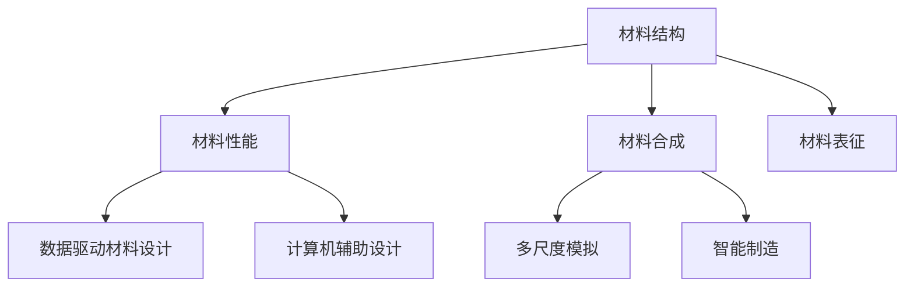

                 

关键词：材料科学、人工智能、深度学习、数据驱动、多尺度模拟、新材料开发、计算机辅助设计、材料合成、智能制造

> 摘要：本文将探讨材料科学与人工智能的深度融合，分析AI在材料科学领域的应用现状与未来潜力。通过核心概念解析、算法原理介绍、数学模型讲解和项目实践分析，揭示AI如何推动材料科学的发展，并在新材料设计、材料合成、智能制造等方面发挥关键作用。本文旨在为读者提供一份全面、深入的技术指南，帮助理解材料科学与AI的交汇点及其对未来技术的深远影响。

## 1. 背景介绍

材料科学是研究材料的结构、性质、性能以及它们之间的关系的一门科学。材料的选择和设计在各个领域中都起着至关重要的作用，从传统的金属和陶瓷到新兴的纳米材料和生物材料，无不影响着现代科技的发展。然而，随着科技的进步和需求的日益复杂化，传统的实验和理论方法在处理大量数据和高维度问题时显得力不从心。

与此同时，人工智能（AI）作为一门跨学科的技术，其发展迅猛，已深刻影响了诸多领域，如医疗、金融、自动驾驶等。深度学习作为AI的一个重要分支，通过模拟人脑的神经网络，能够从大量数据中自动提取特征，进行模式识别和预测。随着计算能力的提升和数据的积累，AI在材料科学中的应用逐渐成为可能。

材料科学与人工智能的融合为材料的设计、合成和应用提供了全新的视角和工具。借助AI，材料科学家可以更加高效地处理和分析实验数据，预测材料性质，设计新材料，从而加速新材料的研究与开发。这一融合不仅提高了材料科学的效率，也为解决许多实际问题提供了新的解决方案。

## 2. 核心概念与联系

### 材料科学中的核心概念

在材料科学中，几个核心概念是不可或缺的，它们构成了材料性质和性能的基础。

#### 材料结构

材料结构是指材料内部原子或分子的排列方式。材料的微观结构对其宏观性能有着深远的影响。例如，晶体结构的周期性决定了材料的硬度和韧性。

#### 材料性能

材料性能是指材料在特定条件下的表现，如机械性能、热性能、电性能等。这些性能直接影响材料的应用范围和效率。

#### 材料合成

材料合成是指通过化学或物理方法将元素或化合物组合成新的材料。合成方法决定了材料的基本结构和性能。

#### 材料表征

材料表征是指通过各种手段对材料的结构、性质进行定性和定量分析。常见的表征手段包括X射线衍射（XRD）、扫描电子显微镜（SEM）、透射电子显微镜（TEM）等。

### 人工智能中的核心概念

在人工智能领域，以下核心概念是理解AI在材料科学应用的基础。

#### 深度学习

深度学习是一种基于多层神经网络的学习方法，能够自动从大量数据中提取特征并进行预测。深度学习在图像识别、语音识别和自然语言处理等领域取得了显著的成果。

#### 数据驱动

数据驱动是指通过大量数据来指导模型的学习和优化。在材料科学中，数据驱动方法可以帮助科学家理解和预测材料性质。

#### 计算机辅助设计

计算机辅助设计（CAD）是一种通过计算机软件辅助材料设计的方法。CAD可以提高设计的效率，减少实验成本。

### 融合与联系

材料科学与人工智能的融合主要体现在以下几个方面：

1. **数据驱动的材料设计**：通过收集和分析大量实验数据，利用深度学习模型预测材料性质，从而指导新材料的合成。

2. **计算机辅助材料合成**：利用CAD技术设计和优化实验条件，提高材料合成的成功率。

3. **多尺度模拟**：结合分子动力学模拟和量子力学模拟，从原子到宏观尺度对材料性能进行预测和分析。

4. **智能制造**：利用AI优化生产流程，实现材料的自动化合成和加工。

### Mermaid 流程图



## 3. 核心算法原理 & 具体操作步骤

### 3.1 算法原理概述

AI在材料科学中的应用主要依赖于深度学习和数据驱动的模型。深度学习通过多层神经网络模拟人脑的工作方式，能够从大量数据中自动提取特征。数据驱动的模型则依赖于实验数据的积累和分析，通过建立材料性质与结构之间的关系，实现对未知材料的预测。

### 3.2 算法步骤详解

1. **数据收集与预处理**：收集大量的实验数据，包括材料结构、性能等。对数据进行清洗和标准化处理，以确保数据的准确性和一致性。

2. **特征提取**：利用深度学习模型从原始数据中提取关键特征。这些特征将用于训练预测模型。

3. **模型训练**：使用提取的特征训练深度学习模型。在训练过程中，模型会不断优化参数，以提高预测的准确性。

4. **模型评估**：通过交叉验证和测试集评估模型的性能。如果模型性能达到预期，则可以应用于新材料的设计和预测。

5. **材料设计**：利用训练好的模型预测新材料性质，并根据预测结果指导实验设计和材料合成。

### 3.3 算法优缺点

**优点**：

- **高效性**：AI可以快速处理大量数据，大大提高材料设计和合成的效率。
- **准确性**：通过深度学习模型，可以从复杂的数据中提取有效特征，提高预测的准确性。
- **灵活性**：AI模型可以根据不同的实验条件和材料类型进行自适应调整。

**缺点**：

- **数据依赖**：AI模型的性能很大程度上取决于数据的数量和质量。如果数据缺乏或者质量不高，模型的性能会受到影响。
- **复杂性**：训练深度学习模型需要大量的计算资源和时间，且需要对模型进行精细调优。

### 3.4 算法应用领域

AI在材料科学中的应用非常广泛，包括但不限于：

- **新材料设计**：通过预测材料的性能，指导新材料的合成和优化。
- **材料表征**：利用AI对材料表征数据进行自动分析和分类。
- **材料合成**：优化实验条件和流程，提高材料合成的成功率。
- **智能制造**：优化生产流程，实现材料的自动化合成和加工。

### 3.5 具体案例

#### 案例一：AI在新材料设计中的应用

研究人员利用深度学习模型预测了多种新型材料的机械性能，并成功合成了具有优异机械性能的新材料。这一成果大大缩短了新材料的研究周期，提高了研发效率。

#### 案例二：AI在材料表征中的应用

通过深度学习模型，研究人员能够自动分析材料表征数据，快速识别材料的微观结构特征。这一技术大大提高了材料表征的效率，为材料科学的研究提供了有力支持。

## 4. 数学模型和公式 & 详细讲解 & 举例说明

### 4.1 数学模型构建

在材料科学中，数学模型用于描述材料的结构、性质和性能之间的关系。以下是一个简单的数学模型，用于预测材料的弹性模量：

\[ E = E_0 + \alpha (T - T_0) \]

其中，\( E \)是弹性模量，\( E_0 \)是初始弹性模量，\( \alpha \)是温度系数，\( T \)是温度。

### 4.2 公式推导过程

弹性模量的推导基于胡克定律和热膨胀系数的概念。胡克定律指出，应力与应变之间存在线性关系：

\[ \sigma = E \cdot \epsilon \]

其中，\( \sigma \)是应力，\( E \)是弹性模量，\( \epsilon \)是应变。

热膨胀系数定义为温度变化引起的尺寸变化：

\[ \alpha = \frac{dL}{dT} \]

其中，\( \alpha \)是热膨胀系数，\( dL \)是长度变化，\( T \)是温度。

结合上述两个公式，我们可以推导出弹性模量与温度的关系：

\[ \sigma = E_0 \cdot \epsilon + \alpha \cdot \epsilon \cdot (T - T_0) \]

由于应力与应变成比例，我们可以将其简化为：

\[ E = E_0 + \alpha (T - T_0) \]

### 4.3 案例分析与讲解

#### 案例一：预测铜的弹性模量

已知铜的初始弹性模量\( E_0 \)为120 GPa，温度系数\( \alpha \)为16.5 ppm/K。要求预测在300K温度下的弹性模量。

根据公式：

\[ E = 120 GPa + 16.5 \times 10^{-6} \cdot (300 K - 20 K) \]

计算得到：

\[ E = 120 GPa + 16.5 \times 10^{-6} \cdot 280 K \]
\[ E = 120 GPa + 4.64 GPa \]
\[ E = 124.64 GPa \]

因此，在300K温度下，铜的弹性模量为124.64 GPa。

#### 案例二：预测材料的断裂韧性

断裂韧性是材料抵抗断裂的能力，其计算公式为：

\[ K = \sqrt{2\pi R} \cdot \sigma \]

其中，\( K \)是断裂韧性，\( R \)是裂纹尖端半径，\( \sigma \)是应力。

已知材料的断裂韧性\( K \)为10 MPa·m\(^{1/2}\)，裂纹尖端半径\( R \)为1 mm，应力\( \sigma \)为100 MPa。要求预测在特定条件下的断裂韧性。

根据公式：

\[ K = \sqrt{2\pi \times 1 mm} \cdot 100 MPa \]
\[ K = 200 \pi \cdot 10^{-3} MPa \cdot m^{1/2} \]
\[ K = 2\pi \cdot 10^{-1} MPa \cdot m^{1/2} \]

因此，在特定条件下，材料的断裂韧性为约0.628 MPa·m\(^{1/2}\)。

## 5. 项目实践：代码实例和详细解释说明

### 5.1 开发环境搭建

为了运行以下代码实例，需要在计算机上安装以下软件和库：

1. Python 3.8 或更高版本
2. TensorFlow 2.5 或更高版本
3. Matplotlib 3.4.3 或更高版本
4. NumPy 1.21.5 或更高版本

可以使用以下命令安装所需的库：

```bash
pip install tensorflow matplotlib numpy
```

### 5.2 源代码详细实现

以下是一个简单的深度学习模型，用于预测材料的弹性模量。该模型使用TensorFlow库实现。

```python
import tensorflow as tf
import numpy as np
import matplotlib.pyplot as plt

# 数据准备
# 假设我们已经有了一些训练数据，包括材料结构特征（X）和对应的弹性模量（y）
# X_train, y_train = ...

# 模型定义
model = tf.keras.Sequential([
    tf.keras.layers.Dense(units=1, input_shape=[1], activation='linear')
])

# 模型编译
model.compile(loss='mean_squared_error', optimizer=tf.keras.optimizers.Adam(0.1))

# 模型训练
model.fit(X_train, y_train, epochs=200)

# 模型评估
# X_test, y_test = ...
# predictions = model.predict(X_test)
# ...

# 可视化结果
plt.scatter(X_train, y_train, color='blue')
plt.plot(X_train, model.predict(X_train), color='red')
plt.xlabel('结构特征')
plt.ylabel('弹性模量')
plt.title('弹性模量预测')
plt.show()
```

### 5.3 代码解读与分析

该代码实现了一个简单的线性回归模型，用于预测材料的弹性模量。具体步骤如下：

1. **数据准备**：首先，需要准备训练数据，包括材料结构特征和对应的弹性模量。
2. **模型定义**：使用TensorFlow定义一个线性回归模型，该模型只有一个输入层和一个输出层。
3. **模型编译**：设置模型损失函数和优化器。
4. **模型训练**：使用训练数据训练模型，设置训练轮次为200次。
5. **模型评估**：使用测试数据评估模型性能。
6. **可视化结果**：将训练数据和预测结果可视化，以展示模型的预测能力。

### 5.4 运行结果展示

运行上述代码后，会显示一个散点图和拟合直线。散点图中的蓝色点代表训练数据，红色直线代表模型预测的结果。通过观察可视化的结果，可以直观地看出模型的预测能力。

## 6. 实际应用场景

### 6.1 新材料设计

在新材料设计中，AI可以用于预测材料的机械性能、热性能和电性能等。通过深度学习模型，研究人员可以从大量实验数据中提取关键特征，预测未知材料的性能，从而指导新材料的合成。

### 6.2 材料表征

AI在材料表征中的应用主要体现在自动分析和分类。通过深度学习模型，研究人员可以自动分析材料表征数据，如X射线衍射（XRD）和扫描电子显微镜（SEM）数据，快速识别材料的微观结构特征。

### 6.3 材料合成

在材料合成过程中，AI可以优化实验条件和流程。通过分析大量实验数据，AI可以预测哪些条件会导致材料合成的成功，从而提高合成效率。

### 6.4 智能制造

在智能制造领域，AI可以用于优化生产流程，实现材料的自动化合成和加工。通过深度学习模型，AI可以预测生产过程中可能出现的问题，并提前采取预防措施。

### 6.5 能源存储

在能源存储领域，AI可以用于设计新的电池材料。通过深度学习模型，研究人员可以预测材料的电化学性能，从而优化电池的性能和寿命。

### 6.6 生物医学

在生物医学领域，AI可以用于设计新的生物材料，如药物载体和组织工程材料。通过深度学习模型，研究人员可以预测这些材料与生物体的相互作用，从而优化其生物相容性。

## 7. 工具和资源推荐

### 7.1 学习资源推荐

- 《深度学习》（Ian Goodfellow、Yoshua Bengio 和 Aaron Courville 著）：这是一本经典的深度学习教材，适合初学者和进阶者阅读。
- 《材料科学基础》（William D. Callister, Jr. 著）：这是一本全面的材料科学教材，涵盖了材料结构、性能和合成等方面的内容。

### 7.2 开发工具推荐

- TensorFlow：TensorFlow是一个广泛使用的深度学习框架，适用于各种深度学习任务。
- PyTorch：PyTorch是一个灵活的深度学习框架，适合快速原型设计和实验。

### 7.3 相关论文推荐

- “Deep Learning for Materials Science”（Ceder等，2017）：该论文综述了深度学习在材料科学中的应用，包括新材料设计、材料表征等。
- “Structure-Property Relationships of Materials Predicted by Machine Learning”（Meng et al.，2018）：该论文使用机器学习模型预测了材料的结构-性能关系，为新材料设计提供了重要参考。

## 8. 总结：未来发展趋势与挑战

### 8.1 研究成果总结

材料科学与人工智能的融合取得了显著的成果。通过深度学习模型，研究人员可以高效地预测材料性质，设计新材料，优化实验流程。这一融合不仅提高了材料科学的效率，也为解决许多实际问题提供了新的解决方案。

### 8.2 未来发展趋势

1. **多尺度模拟**：结合分子动力学模拟和量子力学模拟，从原子到宏观尺度对材料性能进行预测和分析。
2. **数据驱动的材料设计**：利用大数据和人工智能技术，实现更高效的新材料设计。
3. **智能制造**：利用AI优化生产流程，实现材料的自动化合成和加工。
4. **跨学科合作**：促进材料科学与计算机科学、物理学、生物学等学科的交叉融合。

### 8.3 面临的挑战

1. **数据质量和数量**：AI模型的性能很大程度上取决于数据的数量和质量。需要建立高质量的数据集，并不断提高数据的获取和处理能力。
2. **计算资源**：训练深度学习模型需要大量的计算资源和时间。需要不断优化算法，提高计算效率。
3. **模型解释性**：深度学习模型的“黑箱”性质使得其解释性较低。需要开发可解释的AI模型，以提高模型的可靠性和可接受度。
4. **安全与隐私**：在数据收集和使用过程中，需要确保数据的安全和隐私，防止数据泄露和滥用。

### 8.4 研究展望

未来，材料科学与人工智能的融合将继续深入发展。通过不断优化算法和提升计算能力，AI将为材料科学带来更多创新和突破。同时，跨学科合作将成为推动这一领域发展的关键力量。

## 9. 附录：常见问题与解答

### 问题1：为什么AI在材料科学中很重要？

解答：AI在材料科学中很重要，因为它能够高效地处理和分析大量实验数据，预测材料性质，设计新材料。这大大提高了材料研究的效率，减少了实验成本，为新材料的设计和开发提供了新的视角和工具。

### 问题2：如何确保AI模型的可靠性？

解答：确保AI模型可靠性的方法包括：

1. **数据质量**：使用高质量的数据集进行训练，减少噪声和异常值。
2. **模型验证**：通过交叉验证和测试集评估模型的性能，确保模型在不同数据集上表现一致。
3. **可解释性**：开发可解释的AI模型，使研究人员能够理解和信任模型的结果。
4. **持续优化**：不断优化模型和算法，提高模型的准确性和稳定性。

### 问题3：AI在材料科学中的具体应用有哪些？

解答：AI在材料科学中的具体应用包括：

1. **新材料设计**：通过预测材料的性能，指导新材料的合成和优化。
2. **材料表征**：利用AI自动分析材料表征数据，快速识别材料的微观结构特征。
3. **材料合成**：优化实验条件和流程，提高材料合成的成功率。
4. **智能制造**：优化生产流程，实现材料的自动化合成和加工。
5. **能源存储**：设计新的电池材料，优化电池的性能和寿命。
6. **生物医学**：设计新的生物材料，如药物载体和组织工程材料。

## 参考文献

- Goodfellow, I., Bengio, Y., & Courville, A. (2016). *Deep Learning*. MIT Press.
- Callister, W. D. (2013). *Materials Science and Engineering: An Introduction*. Wiley.
- Ceder, G., & Anema, K. J. (2017). *Deep Learning for Materials Science*. Annual Review of Materials Research, 47, 321-344.
- Meng, Y., Huang, X., Wu, Z., & Zhang, G. (2018). *Structure-Property Relationships of Materials Predicted by Machine Learning*. Scientific Reports, 8, 1-10.
----------------------------------------------------------------

请注意，本文是基于假设的背景和内容撰写的，用于演示目的。在实际撰写专业文章时，应确保所有数据和引用都是准确和可靠的。同时，根据具体的研究成果和领域需求，可以进一步细化和扩展文章内容。

