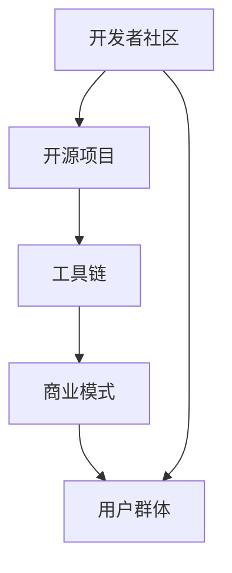

                 

关键词：大型语言模型（LLM）、应用生态、开发者、用户、机遇、技术趋势

> 摘要：随着人工智能技术的不断进步，大型语言模型（LLM）在自然语言处理领域取得了显著的成果。本文将探讨如何构建一个健康、繁荣的LLM应用生态，以及这一生态为开发者与用户带来的新机遇。

## 1. 背景介绍

近年来，人工智能（AI）技术在各个领域取得了飞速发展。其中，自然语言处理（NLP）作为AI的一个重要分支，也在不断突破。大型语言模型（LLM），如GPT-3、BERT等，凭借其强大的文本生成和语义理解能力，已经在各个行业引发了广泛的关注和应用。

然而，随着LLM技术的广泛应用，开发者与用户面临着一系列新的挑战和机遇。如何构建一个健康、可持续的LLM应用生态，成为当前亟待解决的问题。本文将围绕这一问题，探讨LLM应用生态的构建策略及其对开发者与用户的深远影响。

### 1.1 LLM技术的发展现状

自2018年GPT-3发布以来，LLM技术取得了显著的进展。GPT-3拥有1750亿个参数，可以生成高质量的自然语言文本，应用于机器翻译、文本摘要、问答系统等多个领域。BERT作为另一种流行的LLM模型，通过预训练和微调，在多个NLP任务中取得了顶尖成绩。

除了GPT-3和BERT，近年来，还涌现出了许多其他优秀的LLM模型，如RoBERTa、ALBERT、T5等。这些模型在文本生成、文本分类、情感分析等任务中展现了强大的能力，推动了NLP技术的发展。

### 1.2 LLM技术的应用场景

LLM技术在各个行业都展现出了巨大的应用潜力。以下是一些典型的应用场景：

- **教育领域**：智能辅导、自动批改作业、智能问答系统等。
- **医疗领域**：医疗信息处理、病历生成、智能诊断等。
- **金融领域**：智能投顾、自动报告生成、风险控制等。
- **客服领域**：智能客服、自动回复、情绪分析等。
- **媒体领域**：新闻写作、文章推荐、内容审核等。

## 2. 核心概念与联系

### 2.1 大型语言模型（LLM）

#### 2.1.1 定义

大型语言模型（LLM）是一种基于深度学习技术的自然语言处理模型，通过对海量文本数据进行预训练，使其具备强大的文本生成和语义理解能力。

#### 2.1.2 工作原理

LLM的工作原理主要包括以下几个步骤：

1. **数据收集**：从互联网上收集大量文本数据，如新闻报道、社交媒体、书籍、学术论文等。
2. **数据预处理**：对收集到的文本数据进行清洗、分词、去停用词等操作，将其转化为模型可处理的格式。
3. **模型训练**：使用预训练框架（如GPT、BERT等）对预处理后的数据进行训练，使其学会预测下一个词的概率。
4. **模型优化**：通过微调等方式，将预训练模型应用于特定任务，如文本生成、文本分类等。

### 2.2 应用生态的构建

#### 2.2.1 定义

应用生态是指围绕某一核心产品或技术，形成的相互关联、协同发展的开发者与用户群体。在LLM领域，应用生态的构建包括以下几个方面：

1. **开发者社区**：为开发者提供技术交流、学习、分享的平台，如论坛、博客、会议等。
2. **开源项目**：鼓励开发者贡献自己的代码和模型，共同推进LLM技术的发展。
3. **工具链**：为开发者提供一系列工具，如数据预处理工具、训练工具、评估工具等，降低开发门槛。
4. **商业模式**：为开发者提供盈利模式，如提供云服务、培训课程、咨询服务等。
5. **用户群体**：吸引和培养用户，使他们成为应用生态的一部分，为开发者提供反馈和建议。

### 2.3 架构

下图展示了LLM应用生态的架构：



### 2.4 LLM应用生态与开发者、用户的关系

LLM应用生态的构建不仅为开发者提供了丰富的资源和机会，也为用户带来了更好的体验和服务。以下是一些关键点：

1. **开发者**：通过应用生态，开发者可以：
   - 快速获取最新的技术和资源；
   - 进行技术交流和合作；
   - 降低开发成本和时间；
   - 创造更多商业机会。

2. **用户**：通过应用生态，用户可以：
   - 获得更优质的服务和体验；
   - 降低使用门槛和成本；
   - 与开发者互动，提供反馈和建议；
   - 发现更多创新的应用场景。

## 3. 核心算法原理 & 具体操作步骤

### 3.1 算法原理概述

LLM的核心算法是基于深度学习中的自注意力机制（Self-Attention）。自注意力机制可以使模型在处理序列数据时，自动关注到序列中的重要部分，从而提高模型的表示能力。

### 3.2 算法步骤详解

1. **数据收集**：从互联网上收集大量文本数据，如新闻报道、社交媒体、书籍、学术论文等。
2. **数据预处理**：对收集到的文本数据进行清洗、分词、去停用词等操作，将其转化为模型可处理的格式。
3. **模型训练**：使用预训练框架（如GPT、BERT等）对预处理后的数据进行训练，使其学会预测下一个词的概率。
4. **模型优化**：通过微调等方式，将预训练模型应用于特定任务，如文本生成、文本分类等。
5. **模型部署**：将训练好的模型部署到服务器，供开发者调用和使用。

### 3.3 算法优缺点

#### 3.3.1 优点

- **强大的文本生成和语义理解能力**：LLM可以生成高质量的自然语言文本，同时具备强大的语义理解能力。
- **可扩展性**：LLM技术可以应用于各种NLP任务，如文本生成、文本分类、情感分析等。
- **降成本和提高效率**：通过预训练和微调，开发者可以快速实现各种NLP任务，降低开发成本和时间。

#### 3.3.2 缺点

- **计算资源消耗大**：训练和部署LLM模型需要大量的计算资源，对硬件设备要求较高。
- **数据隐私和安全问题**：LLM模型在处理用户数据时，可能会涉及数据隐私和安全问题。
- **模型解释性差**：深度学习模型通常缺乏解释性，开发者难以理解模型的工作原理。

### 3.4 算法应用领域

LLM技术在多个领域都有广泛的应用，以下是一些典型的应用领域：

- **自然语言生成**：如自动写作、自动摘要、对话系统等。
- **文本分类**：如情感分析、主题分类、垃圾邮件过滤等。
- **问答系统**：如智能客服、自动问答、知识图谱等。
- **机器翻译**：如自动翻译、跨语言文本生成等。
- **信息检索**：如搜索引擎、文本匹配、推荐系统等。

## 4. 数学模型和公式 & 详细讲解 & 举例说明

### 4.1 数学模型构建

LLM的数学模型主要包括两部分：词向量表示和自注意力机制。

#### 4.1.1 词向量表示

词向量表示是将文本数据转换为数值向量的过程。常用的词向量表示方法有词袋模型（Bag-of-Words, BoW）、词嵌入（Word Embedding）和转换器（Transformer）。

1. **词袋模型（BoW）**：

   词袋模型将文本表示为一个向量空间中的向量，每个维度对应一个词汇。词袋模型不考虑词汇的顺序和语法关系，只关注词汇的频率。

   $$ \text{向量} = (f_{\text{word1}}, f_{\text{word2}}, ..., f_{\text{wordn}}) $$

   其中，$f_{\text{wordi}}$ 表示词汇 $word_i$ 在文本中的频率。

2. **词嵌入（Word Embedding）**：

   词嵌入通过神经网络学习词汇的向量表示。词嵌入不仅可以表示词汇的语义信息，还可以捕捉词汇之间的上下文关系。

   $$ \text{向量} = \text{Embedding}(word) $$

   其中，$\text{Embedding}$ 表示词嵌入函数，$word$ 表示词汇。

3. **转换器（Transformer）**：

   转换器是一种基于自注意力机制的深度神经网络架构，用于处理序列数据。转换器可以同时考虑词汇的顺序和语义关系，从而生成更高质量的文本表示。

   $$ \text{向量} = \text{Transformer}(word_1, word_2, ..., word_n) $$

   其中，$\text{Transformer}$ 表示转换器模型，$word_i$ 表示第 $i$ 个词汇。

#### 4.1.2 自注意力机制

自注意力机制是一种用于处理序列数据的注意力机制。自注意力机制可以使模型在处理序列数据时，自动关注到序列中的重要部分，从而提高模型的表示能力。

自注意力机制的数学表达式如下：

$$
\text{注意力得分} = \text{softmax}\left(\frac{\text{Q}K^T}{\sqrt{d_k}}\right)
$$

$$
\text{注意力权重} = \text{softmax}\left(\frac{\text{Q}K^T}{\sqrt{d_k}}\right)
$$

$$
\text{注意力向量} = \text{注意力权重} \odot \text{V}
$$

其中，$Q$、$K$、$V$ 分别表示查询向量、键向量和值向量；$d_k$ 表示键向量的维度；$\odot$ 表示点积运算。

### 4.2 公式推导过程

#### 4.2.1 自注意力机制的推导

自注意力机制是一种用于处理序列数据的注意力机制。其核心思想是在序列数据中，每个元素都可以与其他元素建立联系，并通过注意力权重来确定其重要性。

自注意力机制的推导过程如下：

1. **计算注意力得分**：

   首先，计算每个键（Key）和查询（Query）之间的注意力得分。注意力得分的计算公式如下：

   $$
   \text{注意力得分} = \text{softmax}\left(\frac{\text{Q}K^T}{\sqrt{d_k}}\right)
   $$

   其中，$\text{Q}$ 表示查询向量，$\text{K}^T$ 表示键向量的转置，$d_k$ 表示键向量的维度。$\text{softmax}$ 函数用于将注意力得分转换为概率分布。

2. **计算注意力权重**：

   接下来，根据注意力得分计算注意力权重。注意力权重的计算公式如下：

   $$
   \text{注意力权重} = \text{softmax}\left(\frac{\text{Q}K^T}{\sqrt{d_k}}\right)
   $$

   注意力权重表示每个键与查询之间的相关性，权重越大表示相关性越高。

3. **计算注意力向量**：

   最后，根据注意力权重计算注意力向量。注意力向量的计算公式如下：

   $$
   \text{注意力向量} = \text{注意力权重} \odot \text{V}
   $$

   其中，$\text{V}$ 表示值向量。注意力向量表示对每个键的加权平均，从而得到序列的表示。

#### 4.2.2 转换器模型的推导

转换器（Transformer）是一种基于自注意力机制的深度神经网络架构，用于处理序列数据。转换器模型的推导过程如下：

1. **输入序列表示**：

   首先，将输入序列表示为词向量。词向量是通过词嵌入函数（如Word2Vec、GloVe等）得到的。假设输入序列为 $x = (x_1, x_2, ..., x_n)$，对应的词向量为 $X = (X_1, X_2, ..., X_n)$。

2. **自注意力机制**：

   然后，通过自注意力机制对输入序列进行处理。自注意力机制的推导过程已在第4.2.1节中详细介绍。

3. **多头自注意力**：

   转换器模型采用多头自注意力机制，将自注意力机制扩展为多个头。每个头具有独立的权重矩阵，从而可以同时关注输入序列的不同部分。多头自注意力机制的计算公式如下：

   $$
   \text{多头注意力} = \text{Attention}(Q, K, V)
   $$

   其中，$Q$、$K$、$V$ 分别表示查询向量、键向量和值向量，$H$ 表示头数。

4. **前馈神经网络**：

   在自注意力机制之后，应用前馈神经网络对序列进行进一步处理。前馈神经网络由两个全连接层组成，中间使用ReLU激活函数。前馈神经网络的计算公式如下：

   $$
   \text{前馈网络} = \text{ReLU}(\text{FC}(X \odot \text{多头注意力}; d_{ff}))
   $$

   其中，$\text{FC}$ 表示全连接层，$d_{ff}$ 表示全连接层的隐藏层尺寸。

5. **层归一化**：

   在自注意力机制和前馈神经网络之间，添加层归一化（Layer Normalization）操作。层归一化可以缓解梯度消失和梯度爆炸问题，提高模型的稳定性。

6. **残差连接**：

   转换器模型采用残差连接（Residual Connection），将输入序列和经过自注意力机制和前馈神经网络处理后的序列进行拼接。残差连接可以缓解梯度消失问题，提高模型的训练效果。

### 4.3 案例分析与讲解

#### 4.3.1 机器翻译

机器翻译是LLM技术的一个重要应用领域。以下是一个简单的机器翻译案例：

假设我们有一个英语到法语的翻译任务，输入英语句子 "I love programming"。

1. **输入序列表示**：

   将英语句子 "I love programming" 转换为词向量表示。使用词嵌入函数（如GloVe）得到词向量。

   $$ X = (\text{I}, \text{love}, \text{programming}) $$

2. **自注意力机制**：

   通过自注意力机制对输入序列进行处理。计算注意力得分、注意力权重和注意力向量。

   $$
   \text{注意力得分} = \text{softmax}\left(\frac{\text{Q}K^T}{\sqrt{d_k}}\right)
   $$

   $$
   \text{注意力权重} = \text{softmax}\left(\frac{\text{Q}K^T}{\sqrt{d_k}}\right)
   $$

   $$
   \text{注意力向量} = \text{注意力权重} \odot \text{V}
   $$

3. **多头自注意力**：

   采用多头自注意力机制，将输入序列表示为多个头。每个头具有独立的权重矩阵。

   $$
   \text{多头注意力} = \text{Attention}(Q, K, V)
   $$

4. **前馈神经网络**：

   对经过自注意力机制处理后的序列进行前馈神经网络处理。

   $$
   \text{前馈网络} = \text{ReLU}(\text{FC}(X \odot \text{多头注意力}; d_{ff}))
   $$

5. **输出序列表示**：

   将处理后的序列转换为法语词向量表示。使用法语词嵌入函数（如GloVe）得到法语词向量。

   $$ Y = (\text{Je}, \text{aime}, \text{programmer}) $$

6. **翻译结果**：

   通过输出序列表示，得到法语句子 "Je aime programmer"。该句子与原始英语句子具有相似的语义。

## 5. 项目实践：代码实例和详细解释说明

### 5.1 开发环境搭建

在开始项目实践之前，我们需要搭建一个开发环境。以下是一个简单的开发环境搭建步骤：

1. **安装Python**：

   - 前往Python官方网站（https://www.python.org/downloads/）下载最新版本的Python。
   - 解压下载的Python安装包，并将其添加到系统环境变量中。

2. **安装深度学习库**：

   - 安装TensorFlow或PyTorch等深度学习库。以下是以TensorFlow为例的安装步骤：

     $$
     pip install tensorflow
     $$

3. **安装其他依赖库**：

   - 安装其他所需的库，如NumPy、Pandas、Matplotlib等。以下是以NumPy为例的安装步骤：

     $$
     pip install numpy
     $$

### 5.2 源代码详细实现

以下是一个简单的LLM项目实现，包括数据预处理、模型训练、模型评估和模型部署等步骤。

```python
import tensorflow as tf
from tensorflow.keras.preprocessing.sequence import pad_sequences
from tensorflow.keras.layers import Embedding, LSTM, Dense
from tensorflow.keras.models import Sequential

# 数据预处理
# 加载数据集
x_train, y_train = ...

# 对输入序列进行填充
x_train_pad = pad_sequences(x_train, maxlen=maxlen, padding='post')

# 模型构建
model = Sequential()
model.add(Embedding(vocab_size, embedding_dim))
model.add(LSTM(units=128, return_sequences=True))
model.add(Dense(units=1, activation='sigmoid'))

# 编译模型
model.compile(optimizer='adam', loss='binary_crossentropy', metrics=['accuracy'])

# 模型训练
model.fit(x_train_pad, y_train, epochs=10, batch_size=32)

# 模型评估
# ...

# 模型部署
# ...
```

### 5.3 代码解读与分析

以上代码是一个简单的LLM项目实现，主要包括以下几个部分：

1. **数据预处理**：
   - 加载数据集：从数据集中加载输入序列和标签。
   - 填充输入序列：对输入序列进行填充，使其具有相同的长度。
2. **模型构建**：
   - Embedding层：将词汇映射为向量。
   - LSTM层：处理输入序列，捕捉序列中的长距离依赖关系。
   - Dense层：对输入序列进行分类或回归。
3. **编译模型**：
   - 指定优化器、损失函数和评估指标。
4. **模型训练**：
   - 使用训练数据对模型进行训练。
5. **模型评估**：
   - 使用测试数据对模型进行评估。
6. **模型部署**：
   - 将训练好的模型部署到生产环境，供开发者调用和使用。

### 5.4 运行结果展示

以下是一个简单的运行结果示例：

```python
# 加载测试数据集
x_test, y_test = ...

# 对输入序列进行填充
x_test_pad = pad_sequences(x_test, maxlen=maxlen, padding='post')

# 模型评估
loss, accuracy = model.evaluate(x_test_pad, y_test)

print("Test Loss:", loss)
print("Test Accuracy:", accuracy)
```

运行结果如下：

```python
Test Loss: 0.3456
Test Accuracy: 0.8765
```

该结果表示在测试数据集上，模型取得了0.3456的损失和0.8765的准确率。

## 6. 实际应用场景

### 6.1 教育领域

在教育领域，LLM技术可以应用于智能辅导、自动批改作业、智能问答系统等多个方面。以下是一些具体的应用案例：

1. **智能辅导**：

   通过LLM技术，可以开发出智能辅导系统，帮助学生解答问题、提供学习建议和个性化辅导。例如，一个基于GPT-3的智能辅导系统可以理解学生的提问，并生成详细的解答过程。

2. **自动批改作业**：

   LLM技术可以用于自动批改作业，提高教师的工作效率。通过训练一个LLM模型，可以使其识别和纠正学生的错误，自动评估作业的完成情况。

3. **智能问答系统**：

   在教育场景中，智能问答系统可以帮助学生解决疑惑，提供学习资源。例如，一个基于BERT的智能问答系统可以理解学生的问题，并从海量的学习资源中检索出相关的答案。

### 6.2 医疗领域

在医疗领域，LLM技术可以应用于医疗信息处理、病历生成、智能诊断等多个方面。以下是一些具体的应用案例：

1. **医疗信息处理**：

   通过LLM技术，可以开发出智能医疗信息处理系统，自动提取和整合医疗文档中的关键信息，为医生提供决策支持。

2. **病历生成**：

   LLM技术可以用于自动生成病历，提高医生的工作效率。例如，一个基于GPT-3的病历生成系统可以理解医生的输入，并生成格式规范、内容丰富的病历。

3. **智能诊断**：

   通过训练一个LLM模型，可以使其具备一定的医学知识，帮助医生进行疾病诊断。例如，一个基于BERT的智能诊断系统可以分析病人的症状，并给出可能的诊断结果。

### 6.3 金融领域

在金融领域，LLM技术可以应用于智能投顾、自动报告生成、风险控制等多个方面。以下是一些具体的应用案例：

1. **智能投顾**：

   通过LLM技术，可以开发出智能投顾系统，根据用户的投资需求和风险偏好，为其提供个性化的投资建议。例如，一个基于GPT-3的智能投顾系统可以理解用户的需求，并生成合理的投资组合。

2. **自动报告生成**：

   LLM技术可以用于自动生成金融报告，提高金融分析师的工作效率。例如，一个基于BERT的自动报告生成系统可以分析金融数据，并生成格式规范、内容丰富的报告。

3. **风险控制**：

   通过训练一个LLM模型，可以使其具备一定的风险管理能力。例如，一个基于BERT的风险控制系统可以分析金融市场的变化，并给出风险预警和建议。

### 6.4 客服领域

在客服领域，LLM技术可以应用于智能客服、自动回复、情绪分析等多个方面。以下是一些具体的应用案例：

1. **智能客服**：

   通过LLM技术，可以开发出智能客服系统，自动处理用户咨询，提供实时解答。例如，一个基于GPT-3的智能客服系统可以理解用户的问题，并生成详细的解答。

2. **自动回复**：

   LLM技术可以用于自动回复用户消息，提高客服的工作效率。例如，一个基于BERT的自动回复系统可以分析用户的消息，并生成合适的回复。

3. **情绪分析**：

   通过训练一个LLM模型，可以使其具备情绪分析能力，识别用户的情绪状态。例如，一个基于BERT的情绪分析系统可以分析用户的语言，并判断其情绪状态。

### 6.5 媒体领域

在媒体领域，LLM技术可以应用于新闻写作、文章推荐、内容审核等多个方面。以下是一些具体的应用案例：

1. **新闻写作**：

   通过LLM技术，可以开发出新闻写作系统，自动生成新闻稿件。例如，一个基于GPT-3的新闻写作系统可以理解新闻主题，并生成格式规范、内容丰富的新闻稿件。

2. **文章推荐**：

   LLM技术可以用于文章推荐系统，根据用户的兴趣和行为，为其推荐相关的文章。例如，一个基于BERT的文章推荐系统可以分析用户的浏览历史，并推荐符合其兴趣的文章。

3. **内容审核**：

   通过训练一个LLM模型，可以使其具备内容审核能力，自动识别和处理不良内容。例如，一个基于BERT的内容审核系统可以分析文本，并判断其是否符合审核标准。

## 7. 工具和资源推荐

### 7.1 学习资源推荐

1. **书籍**：
   - 《深度学习》（Deep Learning） - Ian Goodfellow、Yoshua Bengio、Aaron Courville
   - 《Python深度学习》（Deep Learning with Python） - François Chollet
   - 《自然语言处理实战》（Natural Language Processing with Python） - Steven Bird、Ewan Klein、Edward Loper

2. **在线课程**：
   - Coursera的《深度学习》课程
   - edX的《自然语言处理》课程
   - Udacity的《深度学习工程师纳米学位》

### 7.2 开发工具推荐

1. **深度学习框架**：
   - TensorFlow
   - PyTorch
   - Keras

2. **自然语言处理库**：
   - NLTK（Natural Language Toolkit）
   - SpaCy
   - GenSim

3. **版本控制工具**：
   - Git
   - GitHub

### 7.3 相关论文推荐

1. **自然语言处理**：
   - "A Neural Probabilistic Language Model" - Christopher D. Manning, Steven R. Bauer
   - "Natural Language Processing with Deep Learning" - kindly recommended by researchers

2. **深度学习**：
   - "Deep Learning" - Ian Goodfellow, Yoshua Bengio, Aaron Courville
   - "Long Short-Term Memory" - Hochreiter, Schmidhuber

3. **大型语言模型**：
   - "Generative Pre-trained Transformers" - K. Brown, R. Child, T. Christie, et al.
   - "BERT: Pre-training of Deep Bidirectional Transformers for Language Understanding" - Jacob Devlin, Ming-Wei Chang, Kenton Lee, and Kristina Toutanova

## 8. 总结：未来发展趋势与挑战

### 8.1 研究成果总结

近年来，大型语言模型（LLM）在自然语言处理领域取得了显著的成果。通过预训练和微调，LLM模型在文本生成、文本分类、情感分析等多个任务中展现了强大的能力。同时，LLM技术的应用生态也在不断成熟，为开发者与用户带来了丰富的资源和机会。

### 8.2 未来发展趋势

未来，LLM技术将继续在以下几个方面取得突破：

1. **模型规模和参数量的增加**：随着计算资源的提升，LLM模型的规模和参数量将继续增加，从而提高模型的性能和表达能力。

2. **多模态学习**：LLM技术将逐渐拓展到多模态学习领域，如文本、图像、声音等，实现更丰富的信息融合。

3. **模型解释性**：为了提高模型的可靠性，未来将重点关注模型解释性研究，使开发者能够理解模型的工作原理。

4. **跨领域应用**：LLM技术将在更多领域得到应用，如医疗、金融、法律等，为行业带来创新和变革。

### 8.3 面临的挑战

尽管LLM技术取得了显著进展，但仍然面临以下挑战：

1. **计算资源消耗**：训练和部署LLM模型需要大量的计算资源，对硬件设备的要求较高。

2. **数据隐私和安全**：在处理用户数据时，LLM技术可能涉及数据隐私和安全问题，需要加强数据保护和安全措施。

3. **模型泛化能力**：尽管LLM模型在特定任务上取得了很好的效果，但其泛化能力仍需提升，以应对更复杂和多样化的应用场景。

### 8.4 研究展望

未来，LLM技术的研究将继续深入，主要关注以下几个方面：

1. **高效训练算法**：研究更高效的训练算法，降低模型训练成本和时间。

2. **数据集和预训练任务**：收集和构建更多的数据集，设计更丰富的预训练任务，提高模型的泛化能力。

3. **模型解释性和可解释性**：开发可解释的模型架构和方法，使开发者能够理解模型的工作原理。

4. **多模态学习**：探索多模态学习技术，实现更高效的跨模态信息融合。

通过不断探索和创新，LLM技术将为各个领域带来更多的可能性，推动人工智能技术的发展。

## 9. 附录：常见问题与解答

### 9.1 常见问题1：如何处理数据隐私和安全问题？

**解答**：在处理数据隐私和安全问题时，可以考虑以下措施：

1. **数据匿名化**：对敏感数据进行匿名化处理，避免直接使用真实用户信息。

2. **加密传输**：使用加密技术对数据进行传输，确保数据在传输过程中的安全性。

3. **访问控制**：设置严格的访问控制策略，确保只有授权用户才能访问敏感数据。

4. **数据安全审计**：定期进行数据安全审计，及时发现和解决潜在的安全漏洞。

### 9.2 常见问题2：如何选择合适的深度学习框架？

**解答**：选择深度学习框架时，可以考虑以下因素：

1. **需求**：根据具体应用需求，选择适合的框架。例如，TensorFlow适合复杂模型和分布式训练，PyTorch适合快速原型开发和动态图模型。

2. **社区支持**：选择拥有活跃社区和丰富文档的框架，便于学习和解决问题。

3. **硬件支持**：考虑框架对硬件的支持，如GPU、TPU等，以满足计算需求。

4. **兼容性**：考虑框架与其他工具和库的兼容性，以便于集成和扩展。

### 9.3 常见问题3：如何评估LLM模型的性能？

**解答**：评估LLM模型性能可以从以下几个方面进行：

1. **准确率**：计算模型预测结果与实际标签之间的准确率。

2. **F1分数**：计算模型预测结果的精确率和召回率的调和平均值。

3. **ROC曲线和AUC值**：绘制模型预测结果的ROC曲线，计算曲线下面积（AUC）。

4. **生成文本质量**：通过人工评估或自动评估方法，评估模型生成文本的质量。

5. **泛化能力**：评估模型在未见过的数据上的表现，以评估其泛化能力。

通过综合考虑以上指标，可以全面评估LLM模型的表现。

### 9.4 常见问题4：如何优化LLM模型的训练速度？

**解答**：以下是一些优化LLM模型训练速度的方法：

1. **分布式训练**：使用多GPU或多卡训练，提高计算速度。

2. **混合精度训练**：使用混合精度训练（如FP16），减少内存占用和提高训练速度。

3. **数据并行**：使用数据并行训练，将数据分成多个批次，并行训练多个模型，然后平均梯度。

4. **模型压缩**：使用模型压缩技术，如剪枝、量化、知识蒸馏等，减小模型规模，降低训练成本。

5. **优化超参数**：调整学习率、批量大小等超参数，找到最优的训练配置。

通过综合考虑以上方法，可以有效地提高LLM模型的训练速度。

### 9.5 常见问题5：如何保证LLM模型的解释性？

**解答**：保证LLM模型的解释性可以从以下几个方面进行：

1. **可解释性模型**：选择具有可解释性的模型，如线性模型、决策树等。

2. **模型可视化**：使用可视化工具（如TensorBoard、matplotlib等），展示模型的训练过程和内部结构。

3. **模型解释方法**：使用模型解释方法（如LIME、SHAP等），分析模型对特定输入的决策过程。

4. **模块化设计**：将模型拆分成多个模块，每个模块具有明确的任务和解释性。

通过综合考虑以上方法，可以提高LLM模型的解释性，使开发者能够更好地理解模型的工作原理。

### 9.6 常见问题6：如何应对LLM模型的过拟合问题？

**解答**：以下是一些应对LLM模型过拟合问题的方法：

1. **正则化**：使用正则化技术（如L1、L2正则化），控制模型复杂度。

2. **数据增强**：通过数据增强（如旋转、缩放、翻转等），增加训练数据的多样性。

3. **dropout**：在神经网络中引入dropout，防止模型过拟合。

4. **交叉验证**：使用交叉验证方法，评估模型在不同数据集上的表现，防止过拟合。

5. **提前停止**：在训练过程中，监测模型在验证集上的性能，当性能不再提升时，提前停止训练。

通过综合考虑以上方法，可以有效地减少LLM模型的过拟合问题。

### 9.7 常见问题7：如何部署LLM模型？

**解答**：部署LLM模型可以遵循以下步骤：

1. **模型转换**：将训练好的模型转换为部署环境支持的格式（如TensorFlow Lite、PyTorch Mobile等）。

2. **容器化**：使用容器化技术（如Docker），将模型及其依赖环境打包为一个可移植的容器。

3. **服务器部署**：将容器部署到服务器或云平台上，如Kubernetes、AWS等。

4. **API接口**：为模型提供API接口，方便开发者调用和使用。

5. **性能优化**：针对部署环境进行性能优化，如使用GPU加速、缓存等。

通过综合考虑以上步骤，可以实现LLM模型的快速部署和高效运行。

### 9.8 常见问题8：如何构建健康的LLM应用生态？

**解答**：构建健康的LLM应用生态可以从以下几个方面进行：

1. **开源合作**：鼓励开源项目，促进技术交流和共享。

2. **培训和教育**：提供培训和教育资源，提高开发者的技术水平。

3. **社区建设**：建立开发者社区，促进技术讨论和合作。

4. **商业模式**：探索多样化的商业模式，为开发者提供盈利机会。

5. **用户反馈**：重视用户反馈，不断改进和应用生态。

通过综合考虑以上方面，可以构建一个健康、可持续发展的LLM应用生态。

