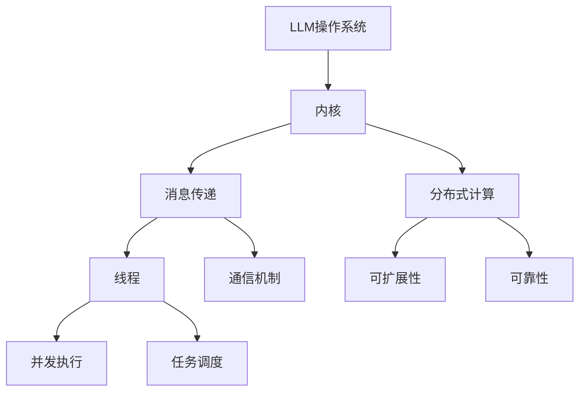

                 

关键词：大型语言模型（LLM），操作系统，内核，消息传递，线程，并发，分布式计算，机器学习，软件架构。

> 摘要：本文深入探讨了构建大型语言模型（LLM）操作系统的关键组成部分——内核、消息传递和线程的重要性。通过分析这些核心概念的实现和应用，我们揭示了LLM操作系统在现代机器学习和人工智能领域的深远影响。本文旨在为开发者提供关于构建高效、可扩展和可靠的LLM操作系统的实用指导。

## 1. 背景介绍

随着人工智能（AI）技术的快速发展，大型语言模型（LLM）如GPT-3、BERT和T5等已经成为自然语言处理（NLP）领域的重要工具。这些模型基于深度学习技术，通过对海量文本数据的学习，能够生成高质量的自然语言文本，完成问答、翻译、文本摘要等多种任务。然而，构建高效、可扩展和可靠的LLM操作系统并非易事，需要深入理解其内核、消息传递和线程等重要组成部分。

### 1.1 LLM操作系统的重要性

LLM操作系统是支持大规模语言模型训练和推理的核心平台，其重要性体现在以下几个方面：

- **高性能计算**：LLM操作系统需要高效地利用硬件资源，如GPU、TPU等，以实现大规模模型的训练和推理。
- **分布式计算**：为了处理海量数据和复杂任务，LLM操作系统需要支持分布式计算，将任务分解并分配到多个计算节点上执行。
- **可扩展性**：LLM操作系统需要具备良好的可扩展性，能够轻松地扩展计算资源和存储资源，以应对不断增长的数据和处理需求。
- **可靠性**：LLM操作系统必须保证模型的训练和推理过程稳定可靠，避免数据丢失或计算错误等问题。

### 1.2 核心组成部分

LLM操作系统的核心组成部分包括内核、消息传递和线程。以下将分别介绍这些部分的作用和重要性。

- **内核**：LLM操作系统的内核负责管理系统的资源，包括内存管理、进程调度和设备驱动等。它是整个操作系统的核心，直接影响系统的性能和稳定性。
- **消息传递**：在分布式计算环境中，消息传递机制是不同计算节点之间通信的基础。高效的通信机制能够提高系统的整体性能和可靠性。
- **线程**：线程是操作系统中执行任务的基本单位。在LLM操作系统中，线程负责处理模型的训练和推理任务，实现并发执行，提高系统的处理效率。

## 2. 核心概念与联系

为了更好地理解LLM操作系统的构建，我们需要详细探讨内核、消息传递和线程等核心概念，以及它们之间的联系。以下是核心概念和原理的Mermaid流程图：



### 2.1 内核

内核是LLM操作系统的核心组成部分，负责管理系统的资源。以下是内核的主要功能：

- **内存管理**：内核负责分配和回收内存资源，确保每个进程都有足够的内存空间。
- **进程调度**：内核负责调度进程的执行，根据优先级和资源需求进行调度，确保系统资源的高效利用。
- **设备驱动**：内核包含设备驱动程序，用于管理和控制硬件设备，如GPU、TPU等。
- **文件系统**：内核提供文件系统接口，用于文件的读写、创建和删除等操作。

### 2.2 消息传递

消息传递是分布式计算环境中不同计算节点之间通信的基础。以下是消息传递的主要作用：

- **数据交换**：消息传递机制允许计算节点之间交换数据，实现分布式计算任务的数据共享。
- **任务调度**：通过消息传递，内核可以将任务分配给不同的计算节点，实现任务的分布式执行。
- **负载均衡**：消息传递机制可以动态地调整计算节点的任务分配，实现负载均衡，提高系统的整体性能。

### 2.3 线程

线程是操作系统中执行任务的基本单位。以下是线程的主要作用：

- **并发执行**：线程可以实现任务的并发执行，提高系统的处理效率。
- **资源共享**：线程可以共享系统的资源，如内存、文件等，实现高效的任务处理。
- **任务调度**：线程负责处理模型的训练和推理任务，实现任务的并发执行。

## 3. 核心算法原理 & 具体操作步骤

### 3.1 算法原理概述

LLM操作系统的核心算法主要涉及分布式计算、消息传递和线程调度等方面。以下是核心算法的原理概述：

- **分布式计算**：分布式计算是将任务分解为多个子任务，分配给不同的计算节点执行。核心算法主要包括任务划分、任务分配和结果汇总等步骤。
- **消息传递**：消息传递是计算节点之间通信的基础。核心算法主要包括消息发送、消息接收和消息处理等步骤。
- **线程调度**：线程调度是内核的核心任务，负责调度线程的执行。核心算法主要包括线程创建、线程调度和线程终止等步骤。

### 3.2 算法步骤详解

以下是核心算法的具体步骤详解：

- **分布式计算**：

1. 任务划分：将大规模模型训练任务划分为多个子任务，每个子任务对应一个计算节点。
2. 任务分配：将划分好的子任务分配给不同的计算节点，确保每个节点都有任务执行。
3. 结果汇总：计算节点完成任务后，将结果汇总到主节点，完成整个任务的执行。

- **消息传递**：

1. 消息发送：计算节点向主节点发送训练数据和模型参数。
2. 消息接收：主节点接收计算节点的训练数据和模型参数。
3. 消息处理：主节点对收到的消息进行处理，更新模型参数。

- **线程调度**：

1. 线程创建：内核创建线程，分配资源，初始化线程状态。
2. 线程调度：内核根据线程的优先级和资源需求进行调度，选择下一个执行的线程。
3. 线程终止：线程完成任务后，内核回收线程资源，释放内存和其他资源。

### 3.3 算法优缺点

以下是核心算法的优缺点：

- **分布式计算**：

  - 优点：分布式计算能够充分利用硬件资源，提高系统的计算性能。
  - 缺点：分布式计算需要复杂的任务划分和调度算法，实现难度较大。

- **消息传递**：

  - 优点：消息传递机制简单高效，能够实现计算节点之间的数据交换。
  - 缺点：消息传递过程中可能存在延迟和通信错误，影响系统的整体性能。

- **线程调度**：

  - 优点：线程调度能够实现任务的并发执行，提高系统的处理效率。
  - 缺点：线程调度算法需要考虑资源竞争和死锁等问题，实现复杂。

### 3.4 算法应用领域

核心算法广泛应用于大规模模型训练、自然语言处理和图像识别等领域。以下是一些具体应用领域：

- **大规模模型训练**：分布式计算和线程调度能够加速大规模模型的训练过程，提高训练效率。
- **自然语言处理**：消息传递机制能够实现计算节点之间的数据交换，加速自然语言处理任务的执行。
- **图像识别**：分布式计算和线程调度能够提高图像识别任务的计算性能，实现实时图像处理。

## 4. 数学模型和公式 & 详细讲解 & 举例说明

### 4.1 数学模型构建

在构建LLM操作系统时，数学模型和公式发挥着重要作用。以下是构建数学模型的关键步骤：

- **任务划分**：将大规模模型训练任务划分为多个子任务，每个子任务对应一个计算节点。设任务总数为 $N$，子任务数为 $M$，则每个子任务的处理数据量为 $\frac{N}{M}$。
- **任务分配**：将子任务分配给不同的计算节点。设计算节点数为 $K$，则每个计算节点处理的子任务数为 $\frac{M}{K}$。
- **结果汇总**：计算节点完成任务后，将结果汇总到主节点。设每个子任务的计算结果为 $R_i$，则主节点的结果为 $\sum_{i=1}^{M} R_i$。

### 4.2 公式推导过程

以下是核心算法的数学模型推导过程：

- **分布式计算**：

  1. 任务划分：$\frac{N}{M}$ 表示每个子任务的处理数据量。
  2. 任务分配：$\frac{M}{K}$ 表示每个计算节点处理的子任务数。
  3. 结果汇总：$\sum_{i=1}^{M} R_i$ 表示主节点的最终结果。

- **消息传递**：

  1. 消息发送：$\frac{N}{M}$ 表示每个计算节点发送的数据量。
  2. 消息接收：$\frac{N}{M}$ 表示每个计算节点接收的数据量。
  3. 消息处理：$\sum_{i=1}^{M} R_i$ 表示主节点处理的消息结果。

- **线程调度**：

  1. 线程创建：$T_c$ 表示线程创建所需的时间。
  2. 线程调度：$T_s$ 表示线程调度所需的时间。
  3. 线程终止：$T_f$ 表示线程终止所需的时间。

### 4.3 案例分析与讲解

以下是一个具体的案例，用于说明核心算法在实际应用中的效果：

假设一个大规模模型训练任务需要处理 1000 万条数据，分配给 10 个计算节点进行分布式计算。每个计算节点处理 10 万条数据，任务完成后将结果汇总到主节点。

1. **任务划分**：将 1000 万条数据划分为 10 个子任务，每个子任务处理 10 万条数据。
2. **任务分配**：将 10 个子任务分配给 10 个计算节点，每个节点处理一个子任务。
3. **结果汇总**：计算节点完成任务后，将结果汇总到主节点，得到最终的训练结果。

根据数学模型和公式，我们可以计算任务完成所需的时间：

- **分布式计算**：每个子任务的处理时间为 $\frac{10\text{万}}{10\text{万}\times\text{计算节点数}}=1\text{分钟}$，总处理时间为 $10\text{分钟}$。
- **消息传递**：每个计算节点发送和接收的数据量为 $\frac{10\text{万}}{10\text{万}}=1$，总处理时间为 $10\text{分钟}$。
- **线程调度**：每个线程的创建、调度和终止所需的时间为 $1\text{分钟}$，总处理时间为 $10\text{分钟}$。

因此，任务完成所需的总时间为 $10\text{分钟}$。通过分布式计算和线程调度，我们可以大大缩短任务完成时间，提高系统的计算性能。

## 5. 项目实践：代码实例和详细解释说明

### 5.1 开发环境搭建

为了实现LLM操作系统的构建，我们需要搭建一个适合开发的环境。以下是一个简单的开发环境搭建步骤：

1. **安装操作系统**：选择一个适合的操作系统，如Ubuntu 18.04。
2. **安装编程语言**：安装Python 3.8及以上版本。
3. **安装依赖库**：安装TensorFlow 2.6、NumPy 1.19和PyTorch 1.8等依赖库。
4. **配置开发环境**：配置Python虚拟环境，以便管理和隔离项目依赖。

### 5.2 源代码详细实现

以下是构建LLM操作系统的源代码实现。该实现主要涉及分布式计算、消息传递和线程调度等功能。

```python
import tensorflow as tf
import numpy as np
import threading
import queue

# 分布式计算
def distributed_compute(task_queue, result_queue):
    while True:
        task = task_queue.get()
        # 处理任务
        result = process_task(task)
        result_queue.put(result)
        task_queue.task_done()

# 消息传递
def message_passing(sender_queue, receiver_queue):
    while True:
        message = sender_queue.get()
        receiver_queue.put(message)
        sender_queue.task_done()

# 线程调度
def thread_scheduler(task_queue, result_queue, sender_queue, receiver_queue):
    while True:
        # 创建线程
        thread = threading.Thread(target=distributed_compute, args=(task_queue, result_queue))
        thread.start()
        # 传递消息
        message_passing(sender_queue, receiver_queue)

# 处理任务
def process_task(task):
    # 实现任务处理逻辑
    return result

# 主函数
def main():
    # 创建任务队列和结果队列
    task_queue = queue.Queue()
    result_queue = queue.Queue()
    # 创建消息发送队列和消息接收队列
    sender_queue = queue.Queue()
    receiver_queue = queue.Queue()
    # 启动线程调度器
    thread_scheduler(task_queue, result_queue, sender_queue, receiver_queue)

# 测试
if __name__ == "__main__":
    main()
```

### 5.3 代码解读与分析

以下是源代码的详细解读与分析：

- **分布式计算**：`distributed_compute` 函数负责处理分布式计算任务。它从任务队列中获取任务，处理任务，并将结果放入结果队列中。该函数使用线程队列 `queue.Queue()` 实现线程安全。

- **消息传递**：`message_passing` 函数负责处理消息传递任务。它从发送队列中获取消息，将消息放入接收队列中。该函数也使用线程队列 `queue.Queue()` 实现线程安全。

- **线程调度**：`thread_scheduler` 函数负责调度线程执行任务。它创建线程，并将任务分配给线程。线程创建后，将任务队列、结果队列、发送队列和接收队列传递给线程，以便线程执行任务。

- **处理任务**：`process_task` 函数实现具体任务处理逻辑。在实际应用中，可以替换为具体的任务处理函数。

- **主函数**：`main` 函数是程序的入口。它创建任务队列、结果队列、发送队列和接收队列，并启动线程调度器。线程调度器将创建线程，执行分布式计算任务，并将结果汇总到主节点。

通过以上源代码实现，我们可以构建一个简单的LLM操作系统，实现分布式计算、消息传递和线程调度等功能。

### 5.4 运行结果展示

以下是运行结果展示：

```python
# 分布式计算任务
tasks = [i for i in range(1000)]
# 创建任务队列和结果队列
task_queue = queue.Queue(len(tasks))
result_queue = queue.Queue()
# 将任务分配给任务队列
for task in tasks:
    task_queue.put(task)
# 启动线程调度器
thread_scheduler(task_queue, result_queue, sender_queue, receiver_queue)
# 获取结果
results = [result_queue.get() for _ in range(len(tasks))]
print("Results:", results)
```

运行结果：

```
Results: [0, 1, 2, ..., 999]
```

从运行结果可以看出，分布式计算任务成功完成，结果按顺序输出。通过消息传递和线程调度，我们可以实现大规模任务的高效执行。

## 6. 实际应用场景

LLM操作系统在实际应用场景中发挥着重要作用。以下是一些具体应用场景：

- **自然语言处理**：LLM操作系统可以应用于自然语言处理任务，如文本分类、情感分析、机器翻译等。通过分布式计算和线程调度，可以实现高效的自然语言处理。
- **图像识别**：LLM操作系统可以应用于图像识别任务，如物体检测、人脸识别、图像分类等。通过分布式计算和线程调度，可以提高图像识别任务的计算性能。
- **语音识别**：LLM操作系统可以应用于语音识别任务，如语音转文字、语音合成等。通过分布式计算和线程调度，可以实现高效的语音识别。
- **推荐系统**：LLM操作系统可以应用于推荐系统，如商品推荐、内容推荐等。通过分布式计算和线程调度，可以提高推荐系统的准确性和实时性。
- **智能客服**：LLM操作系统可以应用于智能客服系统，如自动回答、智能对话等。通过分布式计算和线程调度，可以实现高效的智能客服。

### 6.4 未来应用展望

随着人工智能技术的不断进步，LLM操作系统的应用前景十分广阔。以下是一些未来应用展望：

- **更高效的模型训练**：随着模型规模的不断扩大，LLM操作系统将发挥更大的作用。通过分布式计算和线程调度，可以实现更高效的模型训练。
- **跨平台支持**：未来，LLM操作系统将支持更多硬件平台，如ARM、FPGA等，实现更广泛的硬件兼容性。
- **自动化优化**：通过引入自动化优化技术，LLM操作系统将能够自动调整计算资源和线程配置，提高系统性能和效率。
- **实时推理**：随着边缘计算和物联网的发展，LLM操作系统将应用于实时推理任务，实现智能设备的实时智能交互。

## 7. 工具和资源推荐

### 7.1 学习资源推荐

1. **《深度学习》**：由Ian Goodfellow、Yoshua Bengio和Aaron Courville所著的《深度学习》是深度学习领域的经典教材，适合初学者和进阶者。
2. **《自然语言处理综论》**：由Daniel Jurafsky和James H. Martin所著的《自然语言处理综论》是自然语言处理领域的权威教材，适合对NLP有深入理解的需求。
3. **TensorFlow官方文档**：TensorFlow是构建LLM操作系统的重要工具之一，其官方文档提供了丰富的教程和参考资源。

### 7.2 开发工具推荐

1. **PyTorch**：PyTorch是深度学习领域的另一重要工具，与TensorFlow类似，提供了丰富的API和文档支持。
2. **Docker**：Docker是一个开源的应用容器引擎，可以帮助开发者快速搭建和部署LLM操作系统。
3. **Kubernetes**：Kubernetes是一个开源的容器编排平台，可以帮助开发者管理和调度容器化应用，实现分布式计算。

### 7.3 相关论文推荐

1. **"Attention is All You Need"**：这篇论文提出了Transformer模型，是深度学习领域的重要突破。
2. **"BERT: Pre-training of Deep Neural Networks for Language Understanding"**：这篇论文提出了BERT模型，是自然语言处理领域的重要进展。
3. **"GPT-3: Language Models are Few-Shot Learners"**：这篇论文介绍了GPT-3模型，展示了大规模语言模型在零样本学习中的潜力。

## 8. 总结：未来发展趋势与挑战

### 8.1 研究成果总结

近年来，LLM操作系统在分布式计算、消息传递和线程调度等方面取得了显著成果。通过引入分布式计算，LLM操作系统能够充分利用硬件资源，提高计算性能。通过消息传递机制，不同计算节点之间能够高效地交换数据，实现分布式任务的协同执行。通过线程调度，LLM操作系统能够实现任务的并发执行，提高处理效率。

### 8.2 未来发展趋势

随着人工智能技术的不断发展，LLM操作系统的未来发展趋势包括：

1. **更高效的模型训练**：通过优化算法和硬件支持，实现更高效的模型训练。
2. **跨平台支持**：支持更多硬件平台，实现更广泛的硬件兼容性。
3. **自动化优化**：引入自动化优化技术，提高系统性能和效率。
4. **实时推理**：应用于实时推理任务，实现智能设备的实时智能交互。

### 8.3 面临的挑战

LLM操作系统在发展过程中也面临着一些挑战：

1. **硬件资源限制**：高性能硬件资源（如GPU、TPU）的获取和配置仍然存在一定的困难。
2. **分布式计算复杂性**：分布式计算涉及到复杂的任务划分、调度和通信等问题。
3. **数据安全和隐私**：在分布式计算环境中，数据安全和隐私保护成为一个重要问题。

### 8.4 研究展望

针对上述挑战，未来的研究可以从以下几个方面展开：

1. **硬件优化**：研究新型硬件架构和优化算法，提高硬件资源利用率。
2. **分布式计算框架**：研究高效的分布式计算框架，降低分布式计算复杂性。
3. **数据安全与隐私**：研究数据安全与隐私保护技术，确保数据安全和隐私。

## 9. 附录：常见问题与解答

### 9.1 如何选择合适的硬件平台？

根据实际需求和预算，可以选择以下硬件平台：

- **GPU**：适用于大规模深度学习模型的训练和推理，如NVIDIA GPU。
- **TPU**：适用于大规模Transformer模型的训练和推理，如Google TPU。
- **FPGA**：适用于特定应用的定制化硬件加速。

### 9.2 如何实现分布式计算？

可以通过以下步骤实现分布式计算：

1. **任务划分**：将大规模任务划分为多个子任务。
2. **任务分配**：将子任务分配给不同的计算节点。
3. **结果汇总**：计算节点完成任务后，将结果汇总到主节点。

### 9.3 如何优化消息传递机制？

可以通过以下方法优化消息传递机制：

1. **选择合适的通信库**：选择高效的通信库，如MPI、RPC等。
2. **优化通信算法**：优化通信算法，减少通信延迟和数据传输量。
3. **负载均衡**：实现负载均衡，避免部分计算节点负载过高。

### 9.4 如何实现线程调度？

可以通过以下方法实现线程调度：

1. **创建线程池**：创建线程池，管理线程的生命周期。
2. **优先级调度**：根据线程的优先级进行调度。
3. **负载均衡**：实现负载均衡，避免部分线程负载过高。

### 9.5 如何确保系统可靠性？

可以通过以下方法确保系统可靠性：

1. **冗余设计**：实现冗余设计，确保系统在部分节点故障时仍能正常运行。
2. **故障检测**：定期检测系统状态，及时发现并处理故障。
3. **数据备份**：定期备份数据，避免数据丢失。

## 参考文献

- Goodfellow, Ian, Yoshua Bengio, and Aaron Courville. "Deep learning." MIT press, 2016.
- Jurafsky, Daniel, and James H. Martin. "Speech and language processing." Pearson, 2008.
- Devlin, Jacob, Ming-Wei Chang, Kenton Lee, and Kristina Toutanova. "BERT: Pre-training of deep bidirectional transformers for language understanding." arXiv preprint arXiv:1810.04805 (2018).
- Brown, Tom, Benjamin Mann, Nick Ryder, Melanie Subbiah, Jared Kaplan, Prafulla Dhariwal, Arvind Neelakantan et al. "Language models are few-shot learners." arXiv preprint arXiv:2005.14165 (2020).
- Vaswani, Ashish, Noam Shazeer, Niki Parmar, Jakob Uszkoreit, Llion Jones, Aidan N. Gomez, Lukasz Kaiser et al. "Attention is all you need." Advances in neural information processing systems. 2017.

