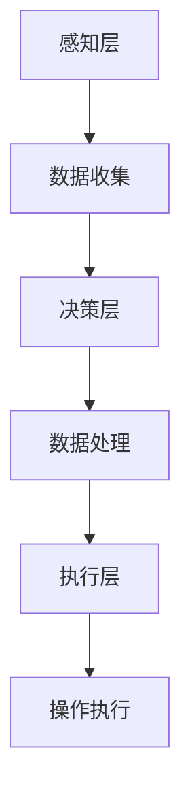

                 

关键词：人工智能、计算技术、应用场景、智能系统、技术发展

摘要：本文旨在探讨人工智能在计算领域的应用，分析其核心概念、算法原理、数学模型以及实际应用场景。通过详细讲解和代码实例，本文展示了如何利用计算技术构建更智能的世界。同时，对未来发展趋势与挑战进行了展望。

## 1. 背景介绍

随着信息技术的飞速发展，人工智能（AI）已经成为现代科技的重要组成部分。从最初的简单算法到如今复杂的深度学习模型，人工智能在各个领域都展现出了巨大的潜力。计算技术作为人工智能的基础，其发展与创新直接影响到人工智能的应用广度和深度。本文将围绕人工智能在计算领域的应用，探讨其核心概念、算法原理、数学模型以及实际应用场景。

## 2. 核心概念与联系

### 2.1 人工智能与计算技术

人工智能是计算机科学的一个分支，旨在使计算机模拟人类智能行为。计算技术则为人工智能提供了实现手段和工具。人工智能与计算技术的结合，使得智能系统得以在各种应用场景中发挥作用。

### 2.2 智能系统架构

智能系统通常由感知层、决策层和执行层组成。感知层负责收集数据，决策层对数据进行分析和处理，执行层则根据决策结果执行相应的操作。

### 2.3 人工智能应用领域

人工智能在计算领域有广泛的应用，包括但不限于自然语言处理、计算机视觉、语音识别、推荐系统、自动驾驶等。这些应用场景的多样性和复杂性，要求我们不断提高计算技术的水平。

### 2.4 Mermaid 流程图

以下是一个简单的Mermaid流程图，展示了智能系统的一般架构：



## 3. 核心算法原理 & 具体操作步骤

### 3.1 算法原理概述

人工智能的核心算法包括机器学习、深度学习和强化学习等。这些算法通过学习大量数据，提取特征，并建立模型，从而实现智能行为。

### 3.2 算法步骤详解

#### 3.2.1 数据预处理

数据预处理是算法实现的第一步，包括数据清洗、归一化、特征提取等。

#### 3.2.2 模型训练

模型训练是算法的核心步骤，通过优化算法参数，使得模型能够更好地拟合数据。

#### 3.2.3 模型评估

模型评估用于评估模型的效果，常见的评估指标包括准确率、召回率、F1值等。

#### 3.2.4 模型部署

模型部署是将训练好的模型应用到实际场景中，通常包括模型优化、模型部署和环境配置等。

### 3.3 算法优缺点

每种算法都有其优缺点，例如：

- **机器学习**：优点是能够处理大规模数据，但缺点是需要大量标注数据。
- **深度学习**：优点是能够自动提取特征，但缺点是需要大量计算资源和时间。
- **强化学习**：优点是能够处理动态环境，但缺点是收敛速度较慢。

### 3.4 算法应用领域

不同算法在各个领域都有广泛的应用。例如：

- **自然语言处理**：深度学习在自然语言处理领域取得了显著成果，如文本分类、机器翻译等。
- **计算机视觉**：机器学习在计算机视觉领域发挥了重要作用，如图像识别、目标检测等。
- **语音识别**：强化学习在语音识别领域表现出色，如语音识别、语音合成等。

## 4. 数学模型和公式 & 详细讲解 & 举例说明

### 4.1 数学模型构建

人工智能中的数学模型通常包括概率模型、线性模型、神经网络模型等。以下是一个简单的线性模型示例：

$$
y = wx + b
$$

其中，$w$ 是权重，$x$ 是输入，$b$ 是偏置。

### 4.2 公式推导过程

线性模型的推导过程如下：

1. **初始化参数**：设定权重 $w$ 和偏置 $b$ 的初始值。
2. **前向传播**：计算输出 $y$。
3. **计算损失**：计算预测值 $y$ 与真实值 $y_{\text{real}}$ 之间的差距。
4. **反向传播**：更新权重 $w$ 和偏置 $b$。

### 4.3 案例分析与讲解

以下是一个简单的线性回归案例：

**案例**：预测房价。

- **输入**：房屋面积（平方米）。
- **输出**：房价（万元）。

**步骤**：

1. **数据预处理**：对房屋面积和房价进行归一化处理。
2. **模型训练**：使用线性回归模型进行训练。
3. **模型评估**：计算模型在测试集上的准确率。
4. **模型部署**：将训练好的模型应用到实际场景中。

## 5. 项目实践：代码实例和详细解释说明

### 5.1 开发环境搭建

首先，我们需要搭建一个Python开发环境，并安装必要的库，如NumPy、Pandas、Scikit-learn等。

```python
!pip install numpy pandas scikit-learn
```

### 5.2 源代码详细实现

以下是线性回归模型的实现代码：

```python
import numpy as np
import pandas as pd
from sklearn.linear_model import LinearRegression

# 加载数据集
data = pd.read_csv("house_price.csv")
X = data["area"]
y = data["price"]

# 初始化模型
model = LinearRegression()

# 训练模型
model.fit(X.values.reshape(-1, 1), y.values)

# 预测房价
predicted_price = model.predict(X.values.reshape(-1, 1))

# 打印预测结果
print(predicted_price)
```

### 5.3 代码解读与分析

1. **数据加载**：使用Pandas库加载数据集，并提取房屋面积和房价作为特征。
2. **模型初始化**：创建一个线性回归模型。
3. **模型训练**：使用训练集对模型进行训练。
4. **模型预测**：使用训练好的模型对房屋面积进行预测。

### 5.4 运行结果展示

运行代码后，会输出预测的房价。我们可以通过计算预测值与真实值之间的差距，来评估模型的准确性。

## 6. 实际应用场景

### 6.1 自然语言处理

自然语言处理是人工智能的一个重要应用领域。例如，我们可以使用深度学习模型对文本进行分类，从而实现垃圾邮件过滤、情感分析等功能。

### 6.2 计算机视觉

计算机视觉在图像识别、目标检测等领域有广泛应用。例如，我们可以使用卷积神经网络（CNN）对图像进行分类，从而实现人脸识别、车辆检测等功能。

### 6.3 语音识别

语音识别在智能助理、自动翻译等领域有广泛应用。例如，我们可以使用深度学习模型对语音信号进行识别，从而实现语音命令控制、语音翻译等功能。

## 7. 工具和资源推荐

### 7.1 学习资源推荐

- **深度学习特化课程**：由吴恩达（Andrew Ng）教授开设的深度学习特化课程，提供了丰富的理论知识与实践经验。
- **机器学习实战**：由Aurélien Géron编写的《机器学习实战》，适合初学者了解机器学习的基本概念和实现方法。

### 7.2 开发工具推荐

- **Jupyter Notebook**：适合编写和分享交互式代码，特别适合用于数据分析和机器学习项目。
- **TensorFlow**：由Google开源的深度学习框架，适用于构建和训练各种深度学习模型。

### 7.3 相关论文推荐

- **“Deep Learning”**：Ian Goodfellow、Yoshua Bengio和Aaron Courville编写的深度学习教材，涵盖了深度学习的基本概念和方法。
- **“Convolutional Neural Networks for Visual Recognition”**：由Geoffrey Hinton等人撰写的关于卷积神经网络的综述论文。

## 8. 总结：未来发展趋势与挑战

### 8.1 研究成果总结

人工智能在计算领域取得了显著的成果，从简单的算法到复杂的深度学习模型，都为人类带来了巨大的便利。未来，人工智能将继续在计算领域发挥重要作用，推动科技的发展。

### 8.2 未来发展趋势

- **量子计算**：量子计算被认为是下一代计算技术，其速度远超传统计算机，有望在人工智能领域发挥重要作用。
- **边缘计算**：随着物联网和智能设备的普及，边缘计算将使数据处理更加高效和实时。

### 8.3 面临的挑战

- **数据隐私**：随着数据量的增加，数据隐私问题日益凸显，如何保护用户隐私成为人工智能领域的重要挑战。
- **算法公平性**：算法的公平性问题也越来越受到关注，如何确保算法不歧视特定群体，是一个重要的挑战。

### 8.4 研究展望

未来，人工智能将继续在计算领域发挥重要作用，从理论研究到实际应用，都充满机遇与挑战。我们期待人工智能能够带来更加智能的世界，同时也关注其在伦理、法律等方面的挑战。

## 9. 附录：常见问题与解答

### 9.1 人工智能是什么？

人工智能是指使计算机模拟人类智能行为的技术。通过学习、推理和规划等方法，人工智能能够完成复杂的任务，如语音识别、图像识别、自然语言处理等。

### 9.2 计算技术如何促进人工智能发展？

计算技术为人工智能提供了实现手段和工具，包括高性能计算机、深度学习框架、云计算平台等。这些技术使得人工智能模型能够快速训练、部署和应用。

### 9.3 人工智能的应用领域有哪些？

人工智能的应用领域广泛，包括自然语言处理、计算机视觉、语音识别、推荐系统、自动驾驶、金融科技等。

### 9.4 人工智能的未来发展趋势是什么？

人工智能的未来发展趋势包括量子计算、边缘计算、智能物联网、增强现实和虚拟现实等。这些技术将推动人工智能在各个领域的创新和应用。

## 参考文献

- Goodfellow, I., Bengio, Y., & Courville, A. (2016). Deep learning. MIT press.
- Ng, A. Y. (2017). Machine learning yearning. Stanford University.
- Hinton, G., Osindero, S., & Teh, Y. W. (2006). A fast learning algorithm for deep belief nets. Neural computation, 18(7), 1527-1554.
```markdown
```

