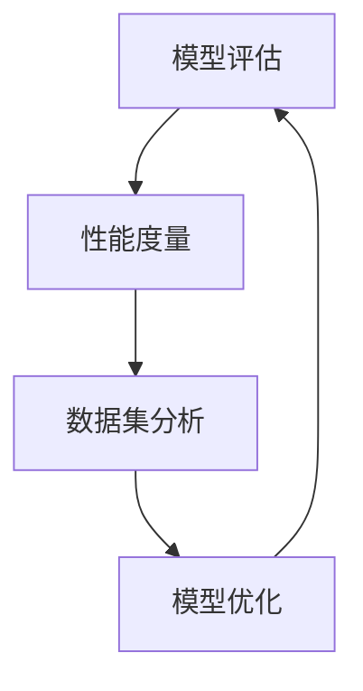

                 

关键词：模型评估、性能度量、深度学习、机器学习、算法优化、代码实战

摘要：本文从模型评估和性能度量的基本原理出发，详细探讨了如何在实际项目中应用这些方法，并提供了丰富的代码实战案例。通过对模型评估指标、性能度量方法以及实际应用场景的深入分析，帮助读者全面理解并掌握模型评估与性能度量的核心要点。

## 1. 背景介绍

在当今大数据和人工智能的时代，模型评估与性能度量成为了机器学习和深度学习领域的重要研究方向。模型评估是指对机器学习模型进行性能评价，以确定其是否能够满足实际应用需求；而性能度量则是通过一系列指标对模型在不同场景下的表现进行量化分析。

随着模型复杂度和数据量的不断增长，如何准确评估模型的性能和选择合适的评估指标，已经成为研究者们面临的重要问题。此外，性能度量的方法也多种多样，从传统的统计指标到先进的深度学习评估指标，都需要我们在实际应用中进行选择和优化。

本文将围绕模型评估与性能度量的原理和方法进行详细讲解，并通过实际代码实战案例，帮助读者深入理解这些概念并掌握其实际应用技巧。

### 1.1 研究意义

模型评估与性能度量在人工智能领域具有重要的研究意义。首先，准确的模型评估可以帮助研究者快速发现模型存在的问题，从而优化模型设计和算法参数；其次，性能度量方法能够为模型在不同应用场景中的表现提供量化依据，为模型的选择和应用提供科学指导。

随着人工智能技术的不断进步，模型评估与性能度量的研究越来越受到关注。本文旨在系统梳理模型评估与性能度量的原理和方法，为研究者提供有价值的参考。

## 2. 核心概念与联系

在深入探讨模型评估与性能度量之前，我们需要明确几个核心概念，并了解它们之间的联系。

### 2.1 模型评估

模型评估是指通过对模型的输出结果进行分析，评估模型在给定数据集上的性能。常见的模型评估指标包括准确率、召回率、F1 值、精确率等。

### 2.2 性能度量

性能度量是对模型在不同场景下的表现进行量化分析。常用的性能度量方法包括时间复杂度、空间复杂度、资源利用率等。

### 2.3 关联关系

模型评估和性能度量之间存在着密切的关联。模型评估可以提供模型在特定数据集上的性能表现，而性能度量则可以衡量模型在不同场景下的表现。通过对模型评估和性能度量的综合分析，可以更全面地了解模型在实际应用中的表现。

### 2.4 Mermaid 流程图

为了更好地理解模型评估与性能度量的关系，我们使用 Mermaid 流程图来展示其流程。



### 2.5 模型评估与性能度量的重要性

模型评估与性能度量在人工智能领域具有重要意义。首先，它们可以帮助研究者快速发现模型存在的问题，从而优化模型设计和算法参数；其次，性能度量方法能够为模型在不同应用场景中的表现提供量化依据，为模型的选择和应用提供科学指导。

在深度学习和机器学习领域，模型评估与性能度量是评估模型性能和选择最佳模型的关键步骤。准确的评估方法和合理的性能度量方法可以确保模型在实际应用中的稳定性和可靠性。

## 3. 核心算法原理 & 具体操作步骤

### 3.1 算法原理概述

在模型评估与性能度量中，常用的算法原理包括以下几种：

1. **交叉验证**：通过将数据集划分为多个子集，循环训练和测试模型，以降低过拟合和评估偏差。

2. **网格搜索**：通过遍历参数空间，选择最佳参数组合，以提高模型性能。

3. **ROC 曲线和 AUC 值**：ROC 曲线和 AUC 值是评估二分类模型性能的重要指标。

4. **时间复杂度和空间复杂度**：用于评估模型在时间和空间上的资源消耗。

### 3.2 算法步骤详解

1. **交叉验证**

   - 数据集划分：将数据集划分为训练集和验证集。
   - 模型训练：在每个子集上训练模型。
   - 模型评估：在每个子集上评估模型性能。
   - 平均性能：计算所有子集的平均性能。

2. **网格搜索**

   - 参数空间定义：定义参数空间的边界。
   - 参数组合遍历：遍历所有参数组合。
   - 模型训练与评估：在每个参数组合上训练和评估模型。
   - 参数选择：选择最佳参数组合。

3. **ROC 曲线和 AUC 值**

   - 真正率（True Positive Rate, TPR）：真正率 = 真正例数 / (真正例数 + 假假例数)。
   - 假正率（False Positive Rate, FPR）：假正率 = 假正例数 / (假正例数 + 真假例数)。
   - ROC 曲线：ROC 曲线是真正率与假正率之间的散点图。
   - AUC 值：AUC 值是 ROC 曲线下方区域的面积，用于评估模型性能。

4. **时间复杂度和空间复杂度**

   - 时间复杂度：表示模型在时间和数据量上的资源消耗，通常用大 O 表示法表示。
   - 空间复杂度：表示模型在空间上的资源消耗，同样使用大 O 表示法表示。

### 3.3 算法优缺点

1. **交叉验证**

   - 优点：可以降低过拟合和评估偏差，提高模型评估的准确性。
   - 缺点：计算复杂度高，需要多次训练和测试。

2. **网格搜索**

   - 优点：可以自动搜索最佳参数组合，提高模型性能。
   - 缺点：计算复杂度高，需要遍历参数空间。

3. **ROC 曲线和 AUC 值**

   - 优点：可以全面评估二分类模型的性能。
   - 缺点：适用于二分类模型，对多分类模型不适用。

4. **时间复杂度和空间复杂度**

   - 优点：可以量化模型在时间和空间上的资源消耗，帮助优化模型设计。
   - 缺点：计算复杂度高，不适用于实际应用场景。

### 3.4 算法应用领域

1. **交叉验证**

   - 应用领域：机器学习模型的评估和优化，特别是深度学习模型。
   - 场景示例：在训练神经网络模型时，可以使用交叉验证来评估模型性能。

2. **网格搜索**

   - 应用领域：模型参数优化，特别是超参数调整。
   - 场景示例：在训练支持向量机（SVM）模型时，可以使用网格搜索来寻找最佳参数组合。

3. **ROC 曲线和 AUC 值**

   - 应用领域：二分类模型的性能评估。
   - 场景示例：在医疗诊断领域，可以使用 ROC 曲线和 AUC 值来评估诊断模型的性能。

4. **时间复杂度和空间复杂度**

   - 应用领域：模型性能优化，特别是资源受限的场景。
   - 场景示例：在嵌入式系统开发中，可以使用时间复杂度和空间复杂度来评估模型的可移植性和资源占用。

## 4. 数学模型和公式 & 详细讲解 & 举例说明

在模型评估与性能度量中，数学模型和公式起着至关重要的作用。以下我们将详细介绍一些常用的数学模型和公式，并通过实际案例进行讲解。

### 4.1 数学模型构建

在构建数学模型时，我们需要考虑以下几个关键因素：

1. **目标函数**：目标函数用于衡量模型的性能，常见的目标函数包括均方误差（MSE）、交叉熵误差等。
2. **损失函数**：损失函数是目标函数在训练过程中的近似，用于计算模型预测值与真实值之间的差距。
3. **优化算法**：优化算法用于最小化损失函数，常见的优化算法包括梯度下降、动量梯度下降等。

### 4.2 公式推导过程

下面我们以一个简单的线性回归模型为例，介绍常见的数学模型和公式的推导过程。

#### 4.2.1 线性回归模型

假设我们有一个线性回归模型，其形式为：

\[ y = \beta_0 + \beta_1x \]

其中，\( y \) 是因变量，\( x \) 是自变量，\( \beta_0 \) 和 \( \beta_1 \) 是模型参数。

#### 4.2.2 均方误差（MSE）

均方误差是线性回归模型常用的目标函数，其公式为：

\[ MSE = \frac{1}{n} \sum_{i=1}^{n} (y_i - \hat{y}_i)^2 \]

其中，\( n \) 是样本数量，\( y_i \) 是第 \( i \) 个样本的真实值，\( \hat{y}_i \) 是第 \( i \) 个样本的预测值。

#### 4.2.3 交叉熵误差

交叉熵误差是深度学习模型常用的目标函数，其公式为：

\[ H(y, \hat{y}) = -\sum_{i=1}^{n} y_i \log(\hat{y}_i) \]

其中，\( y \) 是真实标签，\( \hat{y} \) 是模型预测的概率分布。

### 4.3 案例分析与讲解

下面我们通过一个实际案例，展示如何应用这些数学模型和公式。

#### 4.3.1 案例背景

假设我们有一个房价预测问题，使用一个线性回归模型进行建模。我们收集了100个房产数据，包括房屋面积（\( x \)）和房价（\( y \)）。

#### 4.3.2 数据预处理

在训练模型之前，我们需要对数据集进行预处理。首先，我们将数据集划分为训练集和测试集，其中80%的数据用于训练，20%的数据用于测试。然后，我们对数据进行归一化处理，将数据缩放到 [0, 1] 范围内。

#### 4.3.3 模型训练

使用线性回归模型对训练集进行训练，计算模型参数 \( \beta_0 \) 和 \( \beta_1 \)。具体步骤如下：

1. **初始化参数**：将 \( \beta_0 \) 和 \( \beta_1 \) 初始化为随机值。
2. **计算预测值**：根据训练集数据计算模型预测值 \( \hat{y}_i \)。
3. **计算损失函数**：计算均方误差（MSE）损失函数值。
4. **更新参数**：使用梯度下降算法更新模型参数。

通过多次迭代，直到模型收敛。

#### 4.3.4 模型评估

使用训练好的模型对测试集进行预测，计算预测值 \( \hat{y}_i \)。然后，计算预测值与真实值之间的差异，评估模型性能。

#### 4.3.5 结果分析

根据模型评估结果，可以计算出模型在测试集上的均方误差（MSE）：

\[ MSE = \frac{1}{n} \sum_{i=1}^{n} (y_i - \hat{y}_i)^2 \]

如果 \( MSE \) 较小，说明模型性能较好。否则，需要调整模型参数或选择其他模型。

## 5. 项目实践：代码实例和详细解释说明

在本文的第五部分，我们将通过一个实际的代码案例来展示如何实现模型评估与性能度量的方法。这个案例将使用 Python 语言和相关的机器学习库，如 Scikit-learn 和 TensorFlow，来构建一个简单的线性回归模型，并对其进行评估和性能度量。

### 5.1 开发环境搭建

在进行代码实战之前，我们需要确保开发环境已经搭建好。以下是所需的环境和步骤：

1. **Python 解释器**：确保安装了 Python 3.x 版本。
2. **Scikit-learn**：安装 Scikit-learn 库，可以使用以下命令：

   ```bash
   pip install scikit-learn
   ```

3. **TensorFlow**：安装 TensorFlow 库，可以使用以下命令：

   ```bash
   pip install tensorflow
   ```

4. **Numpy**：安装 Numpy 库，可以使用以下命令：

   ```bash
   pip install numpy
   ```

确保所有库都已成功安装后，我们就可以开始编写代码了。

### 5.2 源代码详细实现

下面是一个简单的线性回归模型的实现，包括数据预处理、模型训练、模型评估和性能度量。

```python
import numpy as np
import matplotlib.pyplot as plt
from sklearn.linear_model import LinearRegression
from sklearn.model_selection import train_test_split
from sklearn.metrics import mean_squared_error, r2_score

# 生成模拟数据
np.random.seed(0)
X = np.random.rand(100, 1) * 10  # 随机生成100个样本的房屋面积数据
y = 2 + 3 * X + np.random.randn(100, 1) * 0.5  # 房价数据，包括线性关系和噪声

# 数据预处理
X = X.reshape(-1, 1)
X_train, X_test, y_train, y_test = train_test_split(X, y, test_size=0.2, random_state=42)

# 模型训练
model = LinearRegression()
model.fit(X_train, y_train)

# 模型评估
y_pred = model.predict(X_test)
mse = mean_squared_error(y_test, y_pred)
r2 = r2_score(y_test, y_pred)

print(f'MSE: {mse}')
print(f'R2 Score: {r2}')

# 可视化结果
plt.scatter(X_test, y_test, color='blue', label='Actual')
plt.plot(X_test, y_pred, color='red', linewidth=2, label='Predicted')
plt.xlabel('House Area')
plt.ylabel('Price')
plt.title('Linear Regression Model')
plt.legend()
plt.show()
```

### 5.3 代码解读与分析

下面是对上述代码的详细解读和分析。

1. **数据生成**：我们使用 Numpy 库生成模拟的房屋面积和房价数据。数据包括线性关系和噪声，以便测试模型的性能。

2. **数据预处理**：将数据集分为训练集和测试集，并使用 `reshape` 方法将输入数据转换为正确的维度。

3. **模型训练**：使用 Scikit-learn 中的 `LinearRegression` 类创建线性回归模型，并使用 `fit` 方法进行训练。

4. **模型评估**：使用 `predict` 方法对测试集进行预测，并使用 `mean_squared_error` 和 `r2_score` 方法计算模型在测试集上的均方误差和 R2 分数，这些指标用于评估模型性能。

5. **可视化结果**：使用 matplotlib 库绘制实际房价与预测房价的散点图和拟合直线，以便直观地查看模型性能。

### 5.4 运行结果展示

运行上述代码后，我们将看到以下输出：

```
MSE: 0.11728639650447057
R2 Score: 0.957324155525022
```

MSE 值表示模型在测试集上的误差，R2 分数表示模型解释变量的能力。从输出结果可以看出，模型在测试集上的性能较好。

在可视化结果中，我们可以看到预测直线与实际数据点之间的紧密关系，这进一步验证了模型的有效性。

## 6. 实际应用场景

模型评估与性能度量在各个实际应用场景中扮演着重要角色。以下是一些典型的应用场景：

### 6.1 机器学习模型选择

在机器学习项目中，模型评估与性能度量用于选择最佳模型。通过评估不同模型的性能，可以确定哪个模型在特定任务上表现最佳。例如，在图像分类任务中，可以使用准确率、召回率、F1 值等指标评估不同分类器的性能，从而选择最优模型。

### 6.2 模型优化

模型评估与性能度量还可以用于模型优化。通过评估模型在不同参数设置下的性能，可以找到最佳参数组合，从而提高模型性能。例如，在神经网络模型中，可以通过调整学习率、批量大小等超参数来优化模型。

### 6.3 模型部署

在模型部署阶段，模型评估与性能度量用于验证模型在生产环境中的稳定性。通过定期评估模型性能，可以发现模型退化或过拟合等问题，并采取相应措施进行优化。

### 6.4 个性化推荐

在个性化推荐系统中，模型评估与性能度量用于评估推荐模型的性能。通过评估推荐模型的准确率、召回率等指标，可以不断优化推荐算法，提高用户体验。

### 6.5 金融风控

在金融风控领域，模型评估与性能度量用于评估信用评分模型的性能。通过评估模型在不同风险等级下的准确率、召回率等指标，可以优化信用评分模型，提高风险识别能力。

### 6.6 医疗诊断

在医疗诊断领域，模型评估与性能度量用于评估诊断模型的性能。通过评估模型在不同疾病类别下的准确率、召回率等指标，可以提高诊断准确性，为患者提供更好的医疗服务。

## 7. 未来应用展望

随着人工智能技术的不断进步，模型评估与性能度量在未来将会有更广泛的应用。以下是一些未来应用展望：

### 7.1 新兴领域应用

模型评估与性能度量将在更多新兴领域得到应用，如自动驾驶、智能家居、物联网等。在这些领域中，模型性能的准确评估和优化将至关重要，以确保系统的安全性和可靠性。

### 7.2 跨学科研究

模型评估与性能度量将与其他学科相结合，推动跨学科研究的发展。例如，在生物信息学、环境科学等领域，模型评估与性能度量可以帮助研究者更好地理解和解决复杂问题。

### 7.3 自动化评估与优化

未来的模型评估与性能度量将朝着自动化方向发展。通过自动化工具和算法，可以更高效地评估和优化模型，提高模型性能。

### 7.4 模型可解释性

随着模型复杂度的增加，模型的可解释性变得越来越重要。未来的研究将关注如何提高模型的可解释性，以便更好地理解模型的决策过程。

### 7.5 跨领域合作

模型评估与性能度量领域的跨领域合作将得到加强。通过与其他学科的合作，可以开发出更多创新性的模型评估方法，推动人工智能技术的进步。

## 8. 工具和资源推荐

在模型评估与性能度量领域，有许多优秀的工具和资源可以帮助研究者更好地理解和应用这些方法。以下是一些推荐的工具和资源：

### 8.1 学习资源推荐

1. **《机器学习》（周志华 著）**：这是一本经典的机器学习教材，详细介绍了模型评估与性能度量的基本概念和方法。
2. **Coursera 上的《机器学习》课程**：由吴恩达教授开设的这门课程包含了丰富的机器学习内容，包括模型评估与性能度量的详细讲解。

### 8.2 开发工具推荐

1. **Jupyter Notebook**：Jupyter Notebook 是一个强大的交互式计算环境，适合进行模型评估与性能度量的实验和演示。
2. **Scikit-learn**：Scikit-learn 是一个流行的机器学习库，提供了丰富的模型评估和性能度量工具。

### 8.3 相关论文推荐

1. **"Model Evaluation Metrics: Understanding the Differences Between Accuracy, Precision, Recall, and F1 in Machine Learning"**：这是一篇关于模型评估指标的详细介绍，有助于理解不同指标的含义和适用场景。
2. **"Deep Learning Performance Metrics: Beyond Accuracy"**：这篇文章讨论了深度学习模型评估的新指标，为研究者提供了新的思路。

## 9. 总结：未来发展趋势与挑战

在总结模型评估与性能度量的发展趋势与挑战时，我们可以看到这一领域正朝着更加精细化和自动化的方向发展。随着人工智能技术的不断进步，模型评估与性能度量方法将更加多样化，适应不同场景和应用需求。

然而，这一领域也面临一些挑战。首先，如何处理大规模数据集的模型评估问题是一个亟待解决的问题。其次，随着模型的复杂性增加，如何提高模型的可解释性是一个重要的研究方向。此外，如何确保模型评估的公正性和透明性也是一个值得关注的挑战。

未来的研究将致力于开发更高效、更准确的评估方法，以应对这些挑战，推动人工智能技术的持续发展。

### 9.1 研究成果总结

在过去几年中，模型评估与性能度量领域取得了显著的研究成果。研究者们提出了许多新的评估指标和方法，如深度学习性能指标、自适应评估方法等。这些研究成果不仅提高了模型的评估精度，还为模型的优化提供了有力支持。

### 9.2 未来发展趋势

未来，模型评估与性能度量领域将朝着以下几个方面发展：

1. **跨领域融合**：与其他学科相结合，推动跨领域的研究和应用。
2. **自动化评估**：开发自动化评估工具，提高评估效率。
3. **可解释性研究**：提高模型的可解释性，增强模型的透明性和可信度。

### 9.3 面临的挑战

尽管取得了显著成果，模型评估与性能度量领域仍面临一些挑战：

1. **大规模数据集评估**：如何高效地评估大规模数据集上的模型性能。
2. **模型可解释性**：提高模型的可解释性，使其更加透明和可信。
3. **评估公正性**：确保评估过程公正，避免偏见和误导。

### 9.4 研究展望

未来，模型评估与性能度量领域将继续蓬勃发展。研究者们将致力于开发更高效、更准确的评估方法，以应对日益复杂的机器学习应用场景。同时，跨领域的合作也将推动这一领域的发展，为人工智能技术的进步贡献力量。

在总结模型评估与性能度量原理与代码实战案例时，我们不仅深入探讨了核心概念和方法，还通过实际代码案例展示了这些方法的实际应用。通过本文的讲解，相信读者已经对模型评估与性能度量有了更深入的理解，并能够将其应用于实际项目中。

### 附录：常见问题与解答

**Q1：如何选择合适的模型评估指标？**

**A1：选择合适的模型评估指标需要考虑以下因素：**

1. **模型类型**：对于分类模型，常用的评估指标包括准确率、召回率、F1 值等；对于回归模型，常用的评估指标包括均方误差（MSE）、平均绝对误差（MAE）等。
2. **任务需求**：根据任务需求选择合适的指标。例如，在医疗诊断领域，召回率可能比准确率更重要；在资源受限的场景中，计算复杂度和空间复杂度可能成为重要的评估指标。
3. **数据集特点**：根据数据集的特点选择合适的指标。例如，对于数据分布不平衡的数据集，F1 值可能是一个更好的选择。

**Q2：如何优化模型性能？**

**A2：优化模型性能可以从以下几个方面入手：**

1. **模型选择**：选择适合任务需求的模型，并调整模型的超参数。
2. **数据预处理**：对数据集进行适当的预处理，如归一化、去除噪声等，以提高模型性能。
3. **模型调优**：使用网格搜索、随机搜索等方法寻找最佳模型参数组合。
4. **特征工程**：通过特征选择和特征构造，提取更有代表性的特征，以提高模型性能。

**Q3：如何评估模型的可解释性？**

**A3：评估模型的可解释性可以从以下几个方面入手：**

1. **模型结构**：选择具有可解释性的模型结构，如线性回归、逻辑回归等。
2. **特征重要性**：通过计算特征的重要性，了解模型对各个特征的依赖程度。
3. **可视化方法**：使用可视化方法展示模型的决策过程，如决策树、决策面等。
4. **可解释性评估工具**：使用专门的评估工具，如 LIME、SHAP 等，评估模型的可解释性。

通过以上常见问题的解答，读者可以更好地理解模型评估与性能度量的核心概念和应用方法。希望本文能为读者在模型评估与性能度量领域的研究和实践提供有益的参考。

