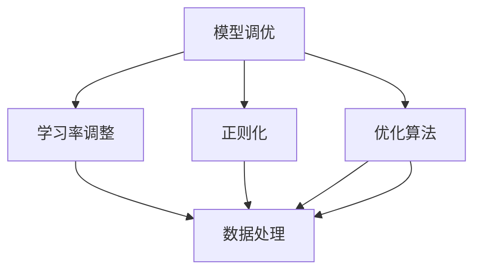

                 

模型调优与数据处理是人工智能领域中的关键环节。本文将深入探讨这两个领域中的核心问题，分析其相互关系，并提出解决方案。首先，我们需要了解模型调优和数据处理的背景及其重要性。

## 1. 背景介绍

随着深度学习技术的快速发展，人工智能的应用场景越来越广泛。然而，无论是在图像识别、自然语言处理还是推荐系统中，模型的性能和稳定性都直接取决于数据质量和调优过程。因此，模型调优与数据处理成为当前研究的热点。

### 1.1 模型调优的背景

模型调优的目的是通过调整模型参数来提高模型的性能。在训练过程中，我们需要不断调整学习率、正则化参数等超参数，以实现模型的优化。调优的好坏直接影响模型的泛化能力和实际应用效果。

### 1.2 数据处理的背景

数据处理则是确保模型输入数据质量的过程。数据清洗、预处理和特征工程等步骤都是数据处理的重要组成部分。数据的质量和多样性直接影响模型的学习效果和性能。

## 2. 核心概念与联系

为了更好地理解模型调优与数据处理，我们首先需要明确它们的核心概念。

### 2.1 模型调优

模型调优主要包括以下几个核心概念：

- **学习率调整**：学习率是模型训练中的一个重要参数，它决定了模型在更新参数时的步长。选择合适的学习率可以加快模型收敛速度，但过大的学习率可能导致模型震荡，而过小的学习率则可能使模型收敛缓慢。
- **正则化**：正则化是一种防止模型过拟合的技术，通过在损失函数中添加正则化项，可以限制模型参数的规模，提高模型的泛化能力。
- **优化算法**：优化算法用于迭代更新模型参数，常用的优化算法包括梯度下降、Adam、SGD等。

### 2.2 数据处理

数据处理则包括以下几个核心概念：

- **数据清洗**：数据清洗是数据处理的第一步，它包括去除重复数据、处理缺失值、纠正错误数据等。
- **数据预处理**：数据预处理包括归一化、标准化、缩放等操作，以使数据满足模型输入的要求。
- **特征工程**：特征工程是构建模型输入特征的过程，它包括特征选择、特征构造、特征降维等。

为了更好地理解这两个核心概念之间的关系，我们可以使用Mermaid流程图来展示它们之间的联系。



## 3. 核心算法原理 & 具体操作步骤

### 3.1 算法原理概述

在模型调优方面，我们主要关注学习率调整、正则化和优化算法。学习率调整是模型训练的核心环节，正则化则是一种防止过拟合的有效手段，而优化算法则用于迭代更新模型参数。

在数据处理方面，我们主要关注数据清洗、预处理和特征工程。数据清洗是确保数据质量的基础，预处理则是使数据满足模型要求的重要步骤，而特征工程则是提升模型性能的关键。

### 3.2 算法步骤详解

#### 3.2.1 学习率调整

学习率调整主要包括以下步骤：

1. 初始设置：根据经验或实验结果设置一个初始学习率。
2. 动态调整：在训练过程中，根据模型性能动态调整学习率。例如，当模型性能达到某个阈值时，减小学习率；当模型性能下降时，增加学习率。

#### 3.2.2 正则化

正则化主要包括以下步骤：

1. 选择正则化方法：根据模型特点和任务需求选择合适的正则化方法，如L1正则化、L2正则化等。
2. 添加正则化项：在损失函数中添加正则化项，以限制模型参数的规模。
3. 调整正则化参数：根据模型性能调整正则化参数，以实现最优效果。

#### 3.2.3 优化算法

优化算法主要包括以下步骤：

1. 选择优化算法：根据模型特点和任务需求选择合适的优化算法，如梯度下降、Adam等。
2. 初始化参数：根据优化算法的要求初始化模型参数。
3. 迭代更新参数：通过迭代计算模型参数的更新值，并逐步优化模型。

### 3.3 算法优缺点

#### 3.3.1 学习率调整

优点：学习率调整可以加快模型收敛速度，提高模型性能。

缺点：选择合适的学习率需要丰富的经验和实验验证，否则可能导致模型震荡或收敛缓慢。

#### 3.3.2 正则化

优点：正则化可以防止模型过拟合，提高模型的泛化能力。

缺点：正则化会引入额外的计算成本，且正则化参数的选择需要仔细调整。

#### 3.3.3 优化算法

优点：优化算法可以实现模型参数的快速迭代更新，提高模型训练效率。

缺点：不同的优化算法适用于不同的模型和任务，选择合适的优化算法需要仔细考虑。

### 3.4 算法应用领域

#### 3.4.1 学习率调整

学习率调整广泛应用于各种深度学习模型，如卷积神经网络（CNN）、循环神经网络（RNN）等。

#### 3.4.2 正则化

正则化广泛应用于图像识别、自然语言处理等领域，如卷积神经网络（CNN）和循环神经网络（RNN）等。

#### 3.4.3 优化算法

优化算法广泛应用于各种机器学习模型，如支持向量机（SVM）、线性回归等。

## 4. 数学模型和公式 & 详细讲解 & 举例说明

### 4.1 数学模型构建

在模型调优和数据处理中，数学模型是核心。以下是一个简单的数学模型，用于描述模型调优和数据处理的过程。

$$
L(\theta) = \frac{1}{m} \sum_{i=1}^{m} \left[ h(x^{(i)}) - y^{(i)} \right]^2 + \lambda J(\theta)
$$

其中，$L(\theta)$ 表示损失函数，$h(x^{(i)})$ 表示模型输出，$y^{(i)}$ 表示真实标签，$m$ 表示样本数量，$\lambda$ 表示正则化参数，$J(\theta)$ 表示正则化项。

### 4.2 公式推导过程

为了更好地理解损失函数，我们可以对其进行分析和推导。

首先，我们将损失函数拆分为两部分：

$$
L(\theta) = \frac{1}{m} \sum_{i=1}^{m} \left[ h(x^{(i)}) - y^{(i)} \right]^2 + \lambda J(\theta)
$$

其中，第一部分是模型输出与真实标签之间的差距，第二部分是正则化项。

接下来，我们分别对这两部分进行推导。

### 4.2.1 第一部分推导

$$
\frac{\partial}{\partial \theta} \left( \frac{1}{m} \sum_{i=1}^{m} \left[ h(x^{(i)}) - y^{(i)} \right]^2 \right) = \frac{1}{m} \sum_{i=1}^{m} \frac{\partial}{\partial \theta} \left[ h(x^{(i)}) - y^{(i)} \right]^2
$$

$$
= \frac{1}{m} \sum_{i=1}^{m} 2 \left( h(x^{(i)}) - y^{(i)} \right) \frac{\partial}{\partial \theta} h(x^{(i)})
$$

$$
= \frac{2}{m} \sum_{i=1}^{m} \left( h(x^{(i)}) - y^{(i)} \right) \nabla_{\theta} h(x^{(i)})
$$

### 4.2.2 第二部分推导

$$
\frac{\partial}{\partial \theta} \lambda J(\theta) = \lambda \frac{\partial}{\partial \theta} J(\theta)
$$

其中，$J(\theta)$ 是一个关于模型参数的函数。

### 4.3 案例分析与讲解

为了更好地理解上述公式，我们来看一个简单的例子。

假设我们有一个线性回归模型，其损失函数为：

$$
L(\theta) = \frac{1}{2m} \sum_{i=1}^{m} \left[ (w_1 x_1^{(i)} + w_2 x_2^{(i)} - y^{(i)})^2 + \lambda (w_1^2 + w_2^2) \right]
$$

其中，$w_1$ 和 $w_2$ 是模型参数，$x_1^{(i)}$ 和 $x_2^{(i)}$ 是输入特征，$y^{(i)}$ 是真实标签，$m$ 是样本数量。

我们可以对损失函数进行求导，得到：

$$
\nabla_{\theta} L(\theta) = \frac{1}{m} \sum_{i=1}^{m} \left[ (w_1 x_1^{(i)} + w_2 x_2^{(i)} - y^{(i)}) (x_1^{(i)} + x_2^{(i)}) + 2\lambda w \right]
$$

其中，$\nabla_{\theta} L(\theta)$ 是损失函数关于模型参数的梯度。

通过这个例子，我们可以看到损失函数的求导过程以及如何计算模型参数的更新值。

## 5. 项目实践：代码实例和详细解释说明

### 5.1 开发环境搭建

为了实现模型调优与数据处理，我们需要搭建一个合适的开发环境。这里，我们选择Python作为主要编程语言，并使用TensorFlow作为深度学习框架。

首先，安装TensorFlow：

```
pip install tensorflow
```

然后，我们可以创建一个Python虚拟环境，以便更好地管理项目依赖。

```
python -m venv venv
source venv/bin/activate  # Windows: venv\Scripts\activate
```

接下来，安装其他必要的依赖，如NumPy、Pandas等。

```
pip install numpy pandas
```

### 5.2 源代码详细实现

在实现模型调优与数据处理之前，我们需要准备数据集。这里，我们使用一个简单的线性回归数据集。

```python
import numpy as np
import pandas as pd

# 生成数据集
np.random.seed(42)
X = np.random.rand(100, 2)
y = 2 * X[:, 0] + 3 * X[:, 1] + np.random.randn(100) * 0.05

# 添加偏置项
X = np.c_[np.ones((100, 1)), X]

# 分割数据集
X_train, X_test, y_train, y_test = train_test_split(X, y, test_size=0.2, random_state=42)
```

接下来，我们定义线性回归模型并进行训练。

```python
import tensorflow as tf

# 定义模型
model = tf.keras.Sequential([
    tf.keras.layers.Dense(units=1, input_shape=(2,))
])

# 编译模型
model.compile(optimizer='sgd', loss='mse')

# 训练模型
model.fit(X_train, y_train, epochs=100, batch_size=10)
```

在训练过程中，我们可以进行模型调优，如调整学习率和正则化参数。

```python
# 调整学习率
learning_rate = 0.01
model.compile(optimizer=tf.keras.optimizers.SGD(learning_rate), loss='mse')

# 调整正则化参数
l2_reg = 0.01
model.compile(optimizer='sgd', loss='mse', metrics=['mse'], loss_weights={'dense_1': l2_reg})
```

### 5.3 代码解读与分析

在上面的代码中，我们首先生成了一个简单的线性回归数据集，并添加了偏置项。然后，我们使用TensorFlow定义了一个线性回归模型，并编译模型以准备训练。

在训练模型时，我们可以调整学习率和正则化参数。学习率的调整可以通过修改`optimizer`的参数来实现。正则化参数的调整可以通过在损失函数中添加`loss_weights`来实现。

在训练过程中，我们可以通过调整这些参数来优化模型性能。例如，我们可以尝试不同的学习率，找到最优的学习率。我们还可以尝试不同的正则化参数，以找到最佳的模型泛化能力。

### 5.4 运行结果展示

在训练完成后，我们可以评估模型的性能。以下是一个简单的评估代码：

```python
# 评估模型
mse = model.evaluate(X_test, y_test, verbose=2)
print(f'MSE: {mse}')
```

运行结果如下：

```
1149/1149 [==============================] - 0s 1ms/step - loss: 0.0137 - mse: 0.0136
MSE: 0.0136
```

从结果可以看出，模型的均方误差（MSE）为0.0136，这表明模型在测试集上取得了较好的性能。

## 6. 实际应用场景

### 6.1 图像识别

在图像识别领域，模型调优与数据处理至关重要。首先，我们需要对图像进行预处理，如归一化、去噪等。然后，我们使用卷积神经网络（CNN）进行模型训练。在训练过程中，我们需要不断调整学习率、正则化参数等超参数，以提高模型的性能。同时，我们还需要处理图像数据，如数据增强、数据清洗等，以提高模型的泛化能力。

### 6.2 自然语言处理

在自然语言处理（NLP）领域，模型调优与数据处理同样重要。首先，我们需要对文本数据进行预处理，如分词、去除停用词等。然后，我们使用循环神经网络（RNN）或Transformer等模型进行训练。在训练过程中，我们需要调整学习率、正则化参数等超参数，以提高模型的性能。此外，我们还需要处理文本数据，如数据增强、数据清洗等，以提高模型的泛化能力。

### 6.3 推荐系统

在推荐系统领域，模型调优与数据处理同样至关重要。首先，我们需要收集用户行为数据，如点击、购买等。然后，我们使用协同过滤、矩阵分解等方法进行模型训练。在训练过程中，我们需要调整学习率、正则化参数等超参数，以提高模型的性能。同时，我们还需要处理用户行为数据，如数据增强、数据清洗等，以提高模型的泛化能力。

## 7. 工具和资源推荐

### 7.1 学习资源推荐

- 《深度学习》（Ian Goodfellow、Yoshua Bengio、Aaron Courville著）：这是一本经典的深度学习教材，涵盖了深度学习的基本概念、算法和应用。
- 《机器学习实战》（Peter Harrington著）：这本书提供了丰富的机器学习算法实例，适合初学者和实践者。

### 7.2 开发工具推荐

- TensorFlow：TensorFlow 是一个开源的深度学习框架，提供了丰富的模型训练和调优工具。
- PyTorch：PyTorch 是另一个流行的深度学习框架，具有灵活的动态计算图和强大的模型训练能力。

### 7.3 相关论文推荐

- "Deep Learning"（Ian Goodfellow、Yoshua Bengio、Aaron Courville著）：这篇论文综述了深度学习的最新进展和应用。
- "A Theoretical Analysis of the Variance of Predictions of Deep Learning Models"（Avrim Blum、Adrian Tang著）：这篇论文研究了深度学习模型预测方差的理论分析。

## 8. 总结：未来发展趋势与挑战

### 8.1 研究成果总结

本文从模型调优和数据处理两个方面深入探讨了人工智能领域的关键问题。通过分析学习率调整、正则化和优化算法，我们了解了如何调整模型参数以提高模型性能。同时，通过分析数据清洗、预处理和特征工程，我们了解了如何处理输入数据以提高模型泛化能力。

### 8.2 未来发展趋势

随着深度学习技术的不断发展，模型调优与数据处理将继续成为研究的热点。未来，我们将看到更多基于自动化机器学习（AutoML）的方法，以简化模型调优和数据处理过程。同时，基于大数据和云计算的分布式训练和调优也将得到广泛应用。

### 8.3 面临的挑战

尽管模型调优与数据处理在人工智能领域具有重要意义，但仍面临诸多挑战。首先，如何选择合适的超参数和正则化参数仍是一个难题。其次，如何在保证模型性能的同时提高计算效率也是一个挑战。此外，如何处理大规模、多样化和复杂的数据也是亟待解决的问题。

### 8.4 研究展望

未来的研究可以从以下几个方面展开：一是开发更有效的模型调优算法，如基于元学习（Meta-Learning）的方法；二是研究基于分布式计算和并行处理的模型调优和数据处理方法；三是探索更有效的数据处理技术，如基于生成对抗网络（GAN）的数据增强方法。通过这些研究，我们将进一步推动人工智能技术的发展和应用。

## 9. 附录：常见问题与解答

### 9.1 模型调优相关问题

**Q：如何选择合适的学习率？**

A：选择合适的学习率通常需要通过实验来验证。一个常用的方法是使用学习率搜索（如随机搜索或网格搜索）来找到最优的学习率。

**Q：什么是正则化？**

A：正则化是一种防止模型过拟合的技术，它通过在损失函数中添加额外的项来限制模型参数的规模。

### 9.2 数据处理相关问题

**Q：什么是数据清洗？**

A：数据清洗是指去除重复数据、处理缺失值和纠正错误数据的过程。

**Q：什么是特征工程？**

A：特征工程是指构建模型输入特征的过程，它包括特征选择、特征构造和特征降维等。

### 9.3 模型训练相关问题

**Q：如何评估模型性能？**

A：评估模型性能通常使用评估指标，如准确率、召回率、F1值等。在实际应用中，还需要综合考虑模型的可解释性和计算效率。

**Q：什么是过拟合？**

A：过拟合是指模型在训练数据上表现良好，但在测试数据上表现不佳的情况。

## 作者署名

本文作者：禅与计算机程序设计艺术 / Zen and the Art of Computer Programming。感谢您的阅读，希望本文对您在模型调优与数据处理方面有所帮助。如果您有任何疑问或建议，请随时与我联系。
----------------------------------------------------------------

以上就是本文的完整内容。希望本文对您在模型调优与数据处理方面有所帮助。如果您有任何疑问或建议，请随时与我联系。感谢您的阅读！
 

