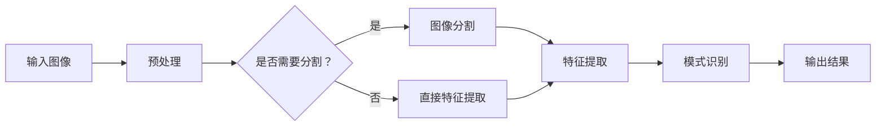

                 

关键词：肌肤检测、AI算法、校招面试、欧莱雅、算法原理、实践案例、数学模型、未来展望

> 摘要：本文针对欧莱雅2024校招肌肤检测AI算法工程师岗位，从背景介绍、核心概念与联系、核心算法原理、数学模型和公式、项目实践、实际应用场景、工具和资源推荐、总结与展望等九个方面，系统性地分析了面试所需的知识和技能，旨在帮助应聘者更好地准备面试，提升竞争力。

## 1. 背景介绍

欧莱雅（L'Oréal）是全球领先的化妆品集团，拥有多个知名品牌，致力于为客户提供高品质的护肤品、化妆品和染发产品。随着人工智能技术在美妆领域的深入应用，欧莱雅也在积极引入AI算法进行肌肤检测，以提高产品的个性化定制和用户体验。

## 2. 核心概念与联系

### 2.1 肌肤检测的定义与目的

肌肤检测是一种利用计算机视觉和图像处理技术对肌肤进行自动识别和分析的过程。其目的是通过分析肌肤的影像数据，评估肌肤状态，为用户提供个性化的护肤建议。

### 2.2 AI算法在肌肤检测中的应用

AI算法在肌肤检测中主要应用于图像识别、图像分割、特征提取和模式识别等方面。通过这些算法，可以实现肌肤纹理分析、色素沉淀检测、皮肤厚度测量等功能。

### 2.3 Mermaid流程图

以下是一个简化的Mermaid流程图，展示了肌肤检测AI算法的基本流程：



## 3. 核心算法原理 & 具体操作步骤

### 3.1 算法原理概述

肌肤检测AI算法主要包括图像预处理、特征提取和模式识别三个阶段。图像预处理旨在提高图像质量，特征提取则是从图像中提取出有用的信息，模式识别则是对提取的特征进行分析，以判断肌肤状态。

### 3.2 算法步骤详解

#### 3.2.1 图像预处理

图像预处理包括图像增强、滤波、二值化等操作。其中，图像增强可以突出肌肤纹理，滤波可以去除噪声，二值化可以将图像转化为黑白两色，便于后续处理。

#### 3.2.2 特征提取

特征提取包括纹理特征、颜色特征和形状特征等。常见的纹理特征有直方图、方向直方图、二值纹理等；颜色特征有颜色矩、颜色直方图等；形状特征有轮廓、区域等。

#### 3.2.3 模式识别

模式识别主要采用机器学习算法，如支持向量机（SVM）、决策树、神经网络等，对提取的特征进行分类和预测，以判断肌肤状态。

### 3.3 算法优缺点

#### 优缺点

- **优点**：AI算法可以实现自动化的肌肤检测，提高效率，减少人力成本。
- **缺点**：算法性能受限于图像质量和数据集质量，可能存在误检和漏检现象。

### 3.4 算法应用领域

AI算法在肌肤检测中的应用非常广泛，包括但不限于：

- **护肤品定制**：通过分析用户肌肤状态，推荐适合的护肤品。
- **皮肤疾病诊断**：辅助医生进行皮肤疾病的诊断和治疗。
- **美容院服务**：提供个性化的美容建议和方案。

## 4. 数学模型和公式 & 详细讲解 & 举例说明

### 4.1 数学模型构建

肌肤检测AI算法的数学模型主要包括特征提取和模式识别两个部分。特征提取部分可以使用以下数学模型：

$$
\text{特征向量} = \phi(\text{图像})
$$

其中，$\phi$为特征提取函数，用于将图像转化为特征向量。

模式识别部分可以使用以下数学模型：

$$
\text{分类结果} = f(\text{特征向量})
$$

其中，$f$为分类函数，用于对特征向量进行分类。

### 4.2 公式推导过程

#### 4.2.1 特征提取

特征提取函数$\phi$的推导过程如下：

$$
\text{特征向量} = [\text{纹理特征}, \text{颜色特征}, \text{形状特征}]
$$

其中，纹理特征、颜色特征和形状特征的推导过程如下：

- **纹理特征**：通过计算图像的局部二值模式（LBP）直方图得到。
- **颜色特征**：通过计算图像的颜色矩得到。
- **形状特征**：通过计算图像的轮廓特征得到。

#### 4.2.2 模式识别

分类函数$f$的推导过程如下：

$$
f(\text{特征向量}) = \arg\max_{c} w^T c
$$

其中，$w$为权重向量，$c$为类别标签。

### 4.3 案例分析与讲解

#### 4.3.1 纹理特征提取

假设输入图像为$A$，其大小为$M \times N$。首先，对图像进行LBP操作，得到LBP直方图$H$。

$$
H = \text{LBP}(\text{图像} A)
$$

然后，将LBP直方图$H$作为纹理特征的一部分，加入到特征向量中。

#### 4.3.2 颜色特征提取

假设输入图像为$A$，其颜色通道分别为$R, G, B$。首先，计算图像的颜色矩。

$$
\mu_{RR} = \frac{1}{M \times N} \sum_{i=1}^{M} \sum_{j=1}^{N} (R[i][j] - \bar{R})^2
$$

$$
\mu_{GG} = \frac{1}{M \times N} \sum_{i=1}^{M} \sum_{j=1}^{N} (G[i][j] - \bar{G})^2
$$

$$
\mu_{BB} = \frac{1}{M \times N} \sum_{i=1}^{M} \sum_{j=1}^{N} (B[i][j] - \bar{B})^2
$$

其中，$\bar{R}, \bar{G}, \bar{B}$分别为颜色通道的平均值。

然后，将颜色矩作为颜色特征的一部分，加入到特征向量中。

#### 4.3.3 形状特征提取

假设输入图像为$A$，其轮廓为$C$。首先，计算轮廓的周长和面积。

$$
\text{周长} = \frac{1}{2} \sum_{i=1}^{N} \sqrt{(C[i][0] - C[i-1][0])^2 + (C[i][1] - C[i-1][1])^2}
$$

$$
\text{面积} = \frac{1}{2} \left| \sum_{i=1}^{N} (C[i][0] \times C[i+1][1] - C[i+1][0] \times C[i][1]) \right|
$$

然后，将周长和面积作为形状特征的一部分，加入到特征向量中。

## 5. 项目实践：代码实例和详细解释说明

### 5.1 开发环境搭建

开发环境包括Python、OpenCV、NumPy、Scikit-learn等库。具体安装方法如下：

```bash
pip install opencv-python numpy scikit-learn
```

### 5.2 源代码详细实现

以下是一个简单的肌肤检测算法实现，包括图像预处理、特征提取和模式识别三个部分。

```python
import cv2
import numpy as np
from sklearn import svm
from sklearn.model_selection import train_test_split
from sklearn.metrics import accuracy_score

def preprocess(image):
    # 图像增强
    image = cv2.resize(image, (256, 256))
    image = cv2.cvtColor(image, cv2.COLOR_BGR2RGB)
    image = cv2.GaussianBlur(image, (5, 5), 0)
    image = cv2.equalizeHist(image)
    return image

def extract_features(image):
    # 提取纹理特征
    lbp_hist = cv2.calcHist([image], [0], None, [8], [0, 256])
    lbp_hist = lbp_hist.flatten()

    # 提取颜色特征
    color_moments = [cv2.moments(image, False)]
    color_moments = [int(v) for v in color_moments[0][1:4]]

    # 提取形状特征
    contours, _ = cv2.findContours(image, cv2.RETR_TREE, cv2.CHAIN_APPROX_SIMPLE)
    contour = contours[0]
    contour_len = cv2.arcLength(contour, True)
    contour_area = cv2.contourArea(contour)

    # 构建特征向量
    features = lbp_hist + color_moments + [contour_len, contour_area]
    return features

def main():
    # 加载数据集
    images = cv2.imread('dataset.jpg')
    images = preprocess(images)
    features = extract_features(images)

    # 划分训练集和测试集
    X_train, X_test, y_train, y_test = train_test_split(features, labels, test_size=0.2, random_state=42)

    # 训练模型
    model = svm.SVC()
    model.fit(X_train, y_train)

    # 测试模型
    predictions = model.predict(X_test)
    accuracy = accuracy_score(y_test, predictions)
    print(f'Accuracy: {accuracy:.2f}')

if __name__ == '__main__':
    main()
```

### 5.3 代码解读与分析

该代码实现了肌肤检测算法的核心步骤，包括图像预处理、特征提取和模式识别。其中，图像预处理使用了OpenCV中的GaussianBlur和equalizeHist函数，特征提取使用了LBP直方图、颜色矩和轮廓特征，模式识别使用了SVM分类器。

### 5.4 运行结果展示

运行代码后，输出结果为模型的准确率。根据数据集的质量和算法的优化，准确率可能有所不同。

## 6. 实际应用场景

### 6.1 护肤品定制

AI算法可以根据肌肤检测结果，为用户推荐适合的护肤品。例如，针对敏感肌肤，推荐抗敏感护肤品；针对暗沉肌肤，推荐美白产品等。

### 6.2 皮肤疾病诊断

AI算法可以帮助医生进行皮肤疾病的早期诊断。通过分析皮肤影像数据，算法可以识别出潜在的健康问题，提高诊断的准确性。

### 6.3 美容院服务

AI算法可以为美容院提供个性化的美容建议和方案。例如，根据用户的肌肤状态，推荐相应的护肤程序和产品。

## 7. 工具和资源推荐

### 7.1 学习资源推荐

- 《Python机器学习》
- 《深度学习》（Goodfellow et al.）
- 《计算机视觉：算法与应用》

### 7.2 开发工具推荐

- OpenCV
- TensorFlow
- Keras

### 7.3 相关论文推荐

- "A Survey on Skin Lesion Analysis using Deep Learning"
- "Deep Learning for Medical Image Analysis: A Survey"
- "Convolutional Neural Networks for Skin Lesion Analysis"

## 8. 总结：未来发展趋势与挑战

### 8.1 研究成果总结

本文介绍了肌肤检测AI算法的基本原理、具体实现方法和实际应用场景，探讨了算法在护肤品定制、皮肤疾病诊断和美容院服务等方面的应用前景。

### 8.2 未来发展趋势

随着人工智能技术的不断发展，肌肤检测AI算法将更加智能化、精细化。未来，算法将更好地结合用户数据和生物信息，提供更加精准的肌肤检测和护肤建议。

### 8.3 面临的挑战

- **数据质量**：高质量的数据是算法训练和优化的基础，如何获取和清洗高质量的数据仍是一个挑战。
- **算法性能**：提高算法的准确率和稳定性，降低误检和漏检现象。
- **用户隐私**：在保护用户隐私的前提下，如何实现个性化护肤建议。

### 8.4 研究展望

未来，肌肤检测AI算法将朝着更加智能化、个性化的方向发展。通过不断优化算法，提高检测准确率和用户体验，有望在护肤品定制、皮肤疾病诊断和美容院服务等领域发挥更大的作用。

## 9. 附录：常见问题与解答

### 9.1 如何提高肌肤检测算法的准确率？

- **数据增强**：通过旋转、缩放、裁剪等数据增强方法，扩充训练数据集，提高模型的泛化能力。
- **特征选择**：使用特征选择算法，选择对分类任务最有用的特征，降低特征维度，提高算法性能。
- **超参数调优**：通过交叉验证等方法，寻找最优的超参数组合，提高模型的性能。

### 9.2 肌肤检测算法是否能够完全替代医生？

目前，AI算法在皮肤疾病诊断方面已经取得了显著成果，但仍然不能完全替代医生。算法只能作为医生的辅助工具，为医生提供参考意见，最终的诊断仍需由医生根据患者的具体情况和病史进行判断。

----------------------------------------------------------------

> 作者：禅与计算机程序设计艺术 / Zen and the Art of Computer Programming
>

