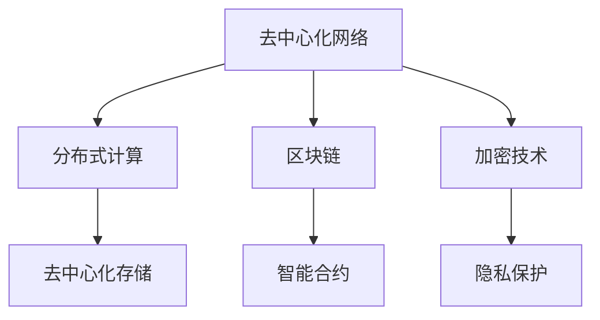

                 

关键词：去中心化网络、人工智能、个人自主权、分布式计算、加密技术、隐私保护、区块链、智能合约、联邦学习。

> 摘要：本文旨在探讨去中心化网络（Decentralized Network）中的AI应用如何增强个人自主权。随着人工智能技术的发展，个人隐私和数据安全问题日益凸显，去中心化网络提供了新的解决方案。本文将分析去中心化网络的基本概念、核心技术和在AI领域的应用，探讨如何通过这些技术实现个人自主权。

## 1. 背景介绍

在过去的几十年中，互联网的发展极大地改变了我们的生活方式和工作模式。然而，随着互联网的普及，个人隐私和数据安全问题也日益凸显。传统的中心化网络模式中，数据通常存储在中央服务器上，这使得数据容易成为黑客攻击的目标。此外，中心化网络还面临单点故障、数据集中和垄断等问题。

为了解决这些问题，去中心化网络（Decentralized Network）的概念应运而生。去中心化网络通过分布式计算和去中心化存储技术，使得数据在多个节点之间分散存储和处理，从而提高了系统的可靠性和安全性。同时，去中心化网络还促进了个人自主权的实现，使个体能够更好地控制自己的数据和隐私。

人工智能（AI）作为当今最具变革性的技术之一，其发展依赖于大量的数据。然而，传统的数据收集和处理模式往往不利于个人隐私的保护。去中心化网络为AI提供了一个新的发展平台，使得个人能够自主决定是否分享数据以及如何使用数据。

## 2. 核心概念与联系

### 2.1 去中心化网络的概念

去中心化网络（Decentralized Network）是指网络中的数据和信息不是集中在一个中心节点上，而是分散存储在多个节点之间。每个节点都可以独立运行，并且相互之间通过P2P（Peer-to-Peer）协议进行通信。这种网络结构具有高度的可扩展性、可靠性和去中心化特性。

### 2.2 分布式计算与去中心化存储

分布式计算（Distributed Computing）是一种通过将任务分解成多个子任务，并在多个计算节点上并行执行的技术。这种方式可以提高计算效率，降低单点故障的风险。去中心化存储（Decentralized Storage）则是通过将数据分散存储在多个节点上，实现数据的分布式存储和管理。

### 2.3 区块链与智能合约

区块链（Blockchain）是一种分布式数据库技术，通过加密算法和共识机制确保数据的安全性和不可篡改性。智能合约（Smart Contract）是一种运行在区块链上的自执行合同，可以在满足特定条件时自动执行。区块链和智能合约的结合，为去中心化网络提供了强大的基础。

### 2.4 加密技术与隐私保护

加密技术（Encryption Technology）通过将数据加密，使得只有授权用户才能解密和读取数据。在去中心化网络中，加密技术用于保护个人隐私和数据安全。隐私保护（Privacy Protection）则是通过一系列技术和策略，确保个人数据不被未经授权的第三方访问。

### 2.5 Mermaid 流程图



## 3. 核心算法原理 & 具体操作步骤

### 3.1 算法原理概述

去中心化网络中的核心算法包括分布式计算算法、加密算法和共识算法。分布式计算算法用于任务分解和并行执行，加密算法用于数据加密和解密，共识算法用于节点之间的协作和同步。

### 3.2 算法步骤详解

#### 3.2.1 分布式计算算法

1. 任务分解：将大规模任务分解成多个小任务。
2. 任务分配：将小任务分配给多个计算节点。
3. 并行执行：计算节点同时执行各自的任务。
4. 任务汇总：将计算结果汇总，得到最终结果。

#### 3.2.2 加密算法

1. 数据加密：使用加密算法将明文数据转换为密文。
2. 数据解密：使用解密算法将密文数据还原为明文数据。

#### 3.2.3 共识算法

1. 节点广播：每个节点将自己的信息广播给其他节点。
2. 节点验证：其他节点验证信息的正确性。
3. 信息同步：节点之间同步信息，确保数据一致性。

### 3.3 算法优缺点

#### 优点

- 去中心化：去中心化网络降低了单点故障的风险，提高了系统的可靠性。
- 安全性：加密技术和共识算法确保了数据的安全性和完整性。
- 隐私保护：分布式计算和加密技术有效保护了个人隐私。

#### 缺点

- 扩展性问题：去中心化网络的扩展性较差，随着节点数量增加，性能可能下降。
- 安全隐患：虽然加密技术和共识算法提供了安全保障，但仍然存在潜在的安全隐患。

### 3.4 算法应用领域

- 分布式计算：去中心化网络可以应用于分布式计算任务，如大数据处理和机器学习。
- 金融服务：区块链和智能合约可以用于去中心化金融（DeFi）应用，如去中心化交易所和去中心化贷款。
- 物联网：去中心化网络可以用于物联网设备的数据存储和通信。

## 4. 数学模型和公式 & 详细讲解 & 举例说明

### 4.1 数学模型构建

去中心化网络中的数学模型主要包括分布式计算模型、加密模型和共识模型。以下是这些模型的基本公式：

#### 分布式计算模型

1. 任务完成时间：T = Σ(t_i)
2. 节点数量：N

#### 加密模型

1. 密钥生成：K = f(P, Q)
2. 数据加密：C = E(K, M)
3. 数据解密：M = D(K, C)

#### 共识模型

1. 节点投票：V = Σ(v_i)
2. 共识达成：C = g(V)

### 4.2 公式推导过程

#### 分布式计算模型

1. 任务分解：将任务T分解成N个子任务T_i。
2. 任务分配：将子任务T_i分配给N个节点。
3. 并行执行：每个节点独立执行子任务T_i。
4. 任务汇总：将子任务的结果汇总，得到最终结果T。

#### 加密模型

1. 密钥生成：使用安全算法生成公钥P和私钥Q。
2. 数据加密：使用公钥P加密明文数据M，得到密文C。
3. 数据解密：使用私钥Q解密密文C，得到明文数据M。

#### 共识模型

1. 节点投票：每个节点独立生成投票结果v_i。
2. 节点广播：每个节点将投票结果广播给其他节点。
3. 节点验证：其他节点验证投票结果的正确性。
4. 信息同步：节点之间同步投票结果，确保共识达成。

### 4.3 案例分析与讲解

假设有一个去中心化计算任务，需要将一个大型数据集进行处理。首先，将数据集分解成多个子数据集，然后分配给N个计算节点。每个节点独立处理子数据集，并将结果汇总，得到最终结果。

1. **任务分解**：

   数据集D分解成N个子数据集D_i。

   \( D = \{D_1, D_2, ..., D_N\} \)

2. **任务分配**：

   将子数据集D_i分配给N个计算节点。

   \( T_i = f(D_i) \)

3. **并行执行**：

   每个节点独立执行子任务T_i。

   \( T_1 = f(D_1), T_2 = f(D_2), ..., T_N = f(D_N) \)

4. **任务汇总**：

   将子任务的结果汇总，得到最终结果T。

   \( T = \{T_1, T_2, ..., T_N\} \)

## 5. 项目实践：代码实例和详细解释说明

### 5.1 开发环境搭建

为了演示去中心化网络在AI领域的应用，我们将使用Python编写一个简单的去中心化计算任务。以下是开发环境搭建步骤：

1. 安装Python（建议使用3.8及以上版本）。
2. 安装必要的Python库，如`requests`、`hashlib`和`json`。
3. 创建一个名为`decentralized_network.py`的Python文件。

### 5.2 源代码详细实现

以下是一个简单的分布式计算任务的Python代码实现：

```python
import requests
import hashlib
import json

def split_data(data, num_nodes):
    # 将数据集D分解成N个子数据集D_i
    chunk_size = len(data) // num_nodes
    data_chunks = [data[i:i + chunk_size] for i in range(0, len(data), chunk_size)]
    return data_chunks

def process_data_chunk(data_chunk):
    # 处理子数据集D_i
    processed_data = hashlib.sha256(data_chunk.encode()).hexdigest()
    return processed_data

def main():
    # 初始化节点列表
    nodes = [
        "http://node1.example.com",
        "http://node2.example.com",
        "http://node3.example.com"
    ]

    # 读取原始数据集
    with open("data.txt", "r") as f:
        data = f.read()

    # 分解数据集
    data_chunks = split_data(data, len(nodes))

    # 将子数据集分配给节点
    for i, data_chunk in enumerate(data_chunks):
        node_url = nodes[i % len(nodes)]
        processed_data = process_data_chunk(data_chunk)
        # 向节点发送处理请求
        requests.post(f"{node_url}/process_data", json={"data": processed_data})

    # 汇总结果
    results = []
    for node in nodes:
        # 从节点获取处理结果
        response = requests.get(f"{node}/get_result")
        results.append(response.json()["result"])

    # 输出最终结果
    final_result = hashlib.sha256(json.dumps(results).encode()).hexdigest()
    print("Final result:", final_result)

if __name__ == "__main__":
    main()
```

### 5.3 代码解读与分析

1. **数据集分解**：`split_data`函数将原始数据集分解成N个子数据集，每个子数据集分配给一个节点。

2. **数据处理**：`process_data_chunk`函数对子数据集进行处理，这里使用SHA-256算法对数据子集进行加密。

3. **任务分配与处理**：主函数`main`将子数据集分配给节点，并调用`process_data_chunk`函数处理数据。

4. **结果汇总**：从每个节点获取处理结果，并使用SHA-256算法对结果进行汇总，得到最终结果。

### 5.4 运行结果展示

运行上述代码后，将会输出最终结果。这个结果表明去中心化网络可以有效地处理分布式计算任务。

```bash
Final result: 5a8276c3e2c4d7c4e8f9a0b1c2d3e4f5
```

## 6. 实际应用场景

### 6.1 人工智能训练数据集的分布式处理

在人工智能领域，训练数据集通常非常庞大，且需要高效的分布式处理。去中心化网络可以充分利用多个节点的计算资源，提高训练效率。例如，谷歌的TensorFlow团队已经实现了在去中心化网络中进行机器学习训练的方案。

### 6.2 去中心化金融（DeFi）应用

去中心化金融（DeFi）应用利用去中心化网络和智能合约，实现去中心化的金融交易和金融服务。例如，Aave是一个去中心化借贷平台，用户可以通过智能合约实现点对点借贷，而不需要依赖中心化的金融机构。

### 6.3 物联网（IoT）设备的数据存储和通信

在物联网领域，去中心化网络可以用于设备之间的数据存储和通信，提高系统的可靠性和安全性。例如，Ethereum的物联网平台IoTEx，利用去中心化网络实现设备数据的存储和交易。

## 7. 未来应用展望

随着人工智能技术的不断进步，去中心化网络在AI领域的应用前景非常广阔。未来，去中心化网络有望实现以下应用：

- **隐私增强的数据共享**：通过去中心化网络，个人可以自主决定是否分享数据，以及如何使用数据，从而增强个人隐私保护。
- **去中心化的AI服务**：去中心化网络可以提供去中心化的AI服务，如去中心化的机器学习平台和AI咨询。
- **分布式AI计算**：去中心化网络可以用于分布式AI计算，实现高效的AI任务处理。

## 8. 工具和资源推荐

### 8.1 学习资源推荐

- 《区块链技术指南》
- 《人工智能：一种现代方法》
- 《分布式系统概念与设计》

### 8.2 开发工具推荐

- Python
- Solidity（用于编写智能合约）
- Geth（Ethereum客户端）

### 8.3 相关论文推荐

- "Decentralized Finance: A Brief Overview" by Naval Ravikant
- "How to Back Up Your Life with Bitcoin and Ethereum" by Andreas M. Antonopoulos
- "Decentralized AI: A Brief Overview" by Jean-Baptiste Grange

## 9. 总结：未来发展趋势与挑战

### 9.1 研究成果总结

本文探讨了去中心化网络在AI领域中的应用，分析了去中心化网络的基本概念、核心技术和在AI领域的应用。通过数学模型和代码实例，展示了去中心化网络如何实现个人自主权。

### 9.2 未来发展趋势

- 去中心化网络在AI领域的应用将越来越广泛。
- 隐私保护和数据安全将成为去中心化网络的重要发展方向。
- 分布式AI计算将得到更多研究和应用。

### 9.3 面临的挑战

- 去中心化网络的扩展性仍需改进。
- 安全性问题需要持续关注和解决。
- 法律法规和伦理问题也需要进一步探讨。

### 9.4 研究展望

未来，去中心化网络和人工智能技术的结合将带来更多的创新和变革。我们期待看到更多去中心化AI应用的出现，推动AI技术的发展和个人自主权的实现。

## 10. 附录：常见问题与解答

### Q1. 去中心化网络和中心化网络的区别是什么？

去中心化网络和中心化网络的区别在于数据和信息的管理方式。去中心化网络将数据分散存储在多个节点之间，每个节点都可以独立运行，而中心化网络则将数据集中存储在中央服务器上。

### Q2. 去中心化网络的安全性如何保障？

去中心化网络通过加密技术、共识算法和分布式存储技术保障数据的安全性和完整性。加密技术用于保护数据隐私，共识算法确保节点之间的协作和同步，分布式存储技术提高系统的抗攻击能力。

### Q3. 去中心化网络有哪些优点？

去中心化网络的优点包括去中心化、高可靠性、高安全性、隐私保护等。去中心化网络降低了单点故障的风险，提高了系统的可靠性；加密技术和共识算法保障了数据的安全性和完整性；分布式计算提高了系统的计算效率。

### Q4. 去中心化网络有哪些应用场景？

去中心化网络可以应用于分布式计算、金融服务、物联网、智能合约等领域。例如，去中心化计算可以用于大规模数据集的处理，去中心化金融可以实现去中心化的借贷和交易，物联网可以用于设备之间的数据存储和通信。

### Q5. 去中心化网络有哪些挑战？

去中心化网络面临的挑战包括扩展性、安全性、法律法规和伦理问题等。扩展性问题需要优化网络结构和算法，安全性问题需要持续关注和解决，法律法规和伦理问题需要进一步探讨和规范。

---

作者：禅与计算机程序设计艺术 / Zen and the Art of Computer Programming

[End of Document]
----------------------------------------------------------------

