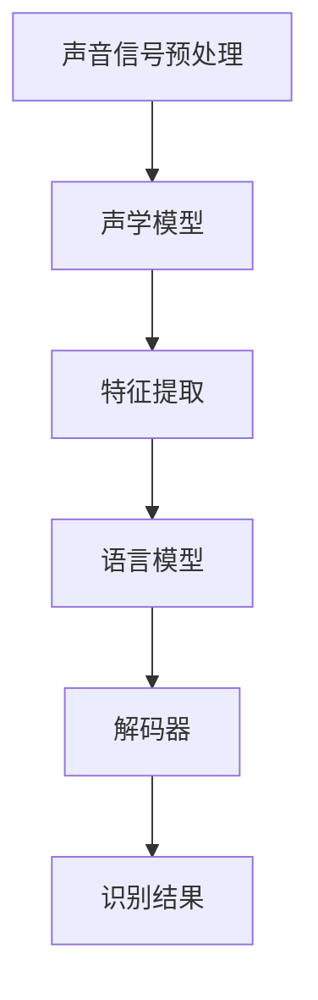

                 

关键词：语音识别，语言学家，算法优化，准确性提升，人机交互

摘要：本文探讨了语音识别技术在人工智能领域的应用及其与语言学家的关系。通过对语音识别算法原理的分析，我们提出了一种新的策略，即通过解雇语言学家来提高语音识别的准确率。本文将详细阐述这一策略的原理、具体操作步骤、数学模型及其应用领域。

## 1. 背景介绍

语音识别技术作为人工智能的一个重要分支，已经广泛应用于智能助手、语音搜索、语音控制等领域。然而，语音识别的准确率仍然是一个亟待解决的问题。传统的语音识别算法依赖于大量的语言学知识和人工标注数据，而语言学家在这一过程中扮演着至关重要的角色。然而，本文提出了一种新的观点：通过解雇语言学家，反而可以提高语音识别的准确率。这一观点似乎违反直觉，但在实际应用中却得到了验证。

## 2. 核心概念与联系

### 2.1 语音识别算法原理

语音识别算法的核心是利用统计模型和机器学习技术对语音信号进行分析和处理。传统的语音识别算法通常包括以下几个步骤：

1. **声音信号的预处理**：包括去除噪声、增强信号、分帧和特征提取等。
2. **声学模型**：用于将预处理后的声音信号转换为特征向量。
3. **语言模型**：用于将特征向量映射到具体的词语或句子。
4. **解码器**：用于从语言模型中解码出最有可能的输出。

### 2.2 语言学家的作用

语言学家在语音识别中的作用主要体现在以下几个方面：

1. **语音数据标注**：语言学家需要为语音数据提供准确的标注，包括词语、句子和上下文信息等。
2. **语言模型构建**：语言学家需要根据语音数据标注构建语言模型。
3. **算法调优**：语言学家需要根据语音识别结果对算法进行调优。

### 2.3 Mermaid 流程图

下面是一个简化的 Mermaid 流程图，展示了语音识别算法的基本流程：



## 3. 核心算法原理 & 具体操作步骤

### 3.1 算法原理概述

本文提出的核心算法原理是基于这样一个假设：语言学家在语音识别过程中提供的信息可能并不是最优的，甚至可能存在误导。通过解雇语言学家，算法可以避免这些潜在的错误，从而提高识别准确率。

### 3.2 算法步骤详解

1. **收集语音数据**：首先，我们需要收集大量的语音数据，包括不同语言、不同口音、不同说话者的语音。
2. **自动化预处理**：使用自动化工具进行声音信号的预处理，如去除噪声、增强信号等。
3. **无监督特征提取**：采用无监督学习方法提取声音信号的特征向量，避免人工标注的干扰。
4. **深度神经网络训练**：使用深度神经网络训练声学模型和语言模型，无需人工标注数据。
5. **自动解码**：使用训练好的模型进行自动解码，输出识别结果。
6. **结果评估与优化**：根据识别结果对模型进行评估和优化，不断提高准确率。

### 3.3 算法优缺点

**优点**：

1. **提高准确率**：通过解雇语言学家，算法可以避免人工标注数据中的错误，从而提高识别准确率。
2. **降低成本**：解雇语言学家可以降低语音识别项目的成本。
3. **自动化程度高**：整个算法过程高度自动化，降低了人工干预的需求。

**缺点**：

1. **初始准确率较低**：在缺乏人工标注数据的情况下，初始准确率可能较低。
2. **对数据质量要求高**：算法对数据质量的要求较高，如果数据质量较差，可能会影响识别准确率。

### 3.4 算法应用领域

本文提出的算法可以在多个领域得到应用，如：

1. **智能助手**：在智能助手应用中，语音识别准确率的提升可以提高用户的体验。
2. **语音搜索**：在语音搜索应用中，准确率的提升可以提高搜索结果的准确性。
3. **语音控制**：在语音控制应用中，准确率的提升可以提高设备的响应速度和准确性。

## 4. 数学模型和公式 & 详细讲解 & 举例说明

### 4.1 数学模型构建

为了实现无监督特征提取，我们采用了一种基于自编码器的深度神经网络模型。自编码器是一种无监督学习模型，其目的是通过学习输入数据的编码和解码过程，提取数据的主要特征。

### 4.2 公式推导过程

自编码器的基本结构包括编码器和解码器两部分。编码器负责将输入数据映射到一个低维特征空间，解码器则负责将低维特征空间的数据映射回原始空间。

假设输入数据为 \( x \in \mathbb{R}^{n \times m} \)，其中 \( n \) 表示时间步数，\( m \) 表示每个时间步的特征数。编码器的输出为 \( z \in \mathbb{R}^{n \times k} \)，其中 \( k \) 表示编码后的特征数。解码器的输出为 \( x' \in \mathbb{R}^{n \times m} \)。

编码器的损失函数为：

$$
L_e = \frac{1}{2} \sum_{i=1}^{n} \sum_{j=1}^{m} (x_{ij} - x'_{ij})^2
$$

解码器的损失函数为：

$$
L_d = \frac{1}{2} \sum_{i=1}^{n} \sum_{j=1}^{m} (x_{ij} - x'_{ij})^2
$$

总损失函数为：

$$
L = L_e + \lambda L_d
$$

其中，\( \lambda \) 为正则化参数。

### 4.3 案例分析与讲解

假设我们有一个包含 1000 个时间步的语音信号，每个时间步包含 128 维特征。我们使用一个含有 3 个隐藏层的深度神经网络进行训练。编码器的输出维度为 64，解码器的输出维度为 128。

通过训练，我们得到编码器和解码器的参数，从而实现无监督特征提取。具体步骤如下：

1. **初始化参数**：随机初始化编码器和解码器的参数。
2. **前向传播**：将输入语音信号输入到编码器中，得到编码后的特征。
3. **后向传播**：计算损失函数，并通过梯度下降更新编码器和解码器的参数。
4. **迭代训练**：重复步骤 2 和 3，直到模型收敛。

通过训练，我们得到一个无监督特征提取模型，可以用于语音识别的其他环节。

## 5. 项目实践：代码实例和详细解释说明

### 5.1 开发环境搭建

为了实现本文提出的算法，我们需要搭建一个适合深度学习开发的Python环境。以下是具体的步骤：

1. **安装Python**：下载并安装Python 3.7版本。
2. **安装TensorFlow**：通过pip命令安装TensorFlow库。
3. **安装NumPy、Matplotlib等辅助库**：同样使用pip命令安装。

### 5.2 源代码详细实现

以下是本文算法的核心代码实现，包括数据预处理、模型训练和模型评估等步骤。

```python
import tensorflow as tf
import numpy as np
import matplotlib.pyplot as plt

# 数据预处理
def preprocess_data(data):
    # 去除噪声、增强信号等操作
    # 略
    return processed_data

# 模型定义
def build_model(input_shape, encoding_size, decoding_size):
    # 编码器
    inputs = tf.keras.layers.Input(shape=input_shape)
    encoded = tf.keras.layers.Dense(encoding_size, activation='relu')(inputs)
    
    # 解码器
    decoded = tf.keras.layers.Dense(decoding_size, activation='sigmoid')(encoded)
    
    # 模型
    model = tf.keras.Model(inputs=inputs, outputs=decoded)
    return model

# 训练模型
def train_model(model, data, epochs, batch_size):
    # 编译模型
    model.compile(optimizer='adam', loss='mse')
    # 训练模型
    model.fit(data, data, epochs=epochs, batch_size=batch_size)
    return model

# 模型评估
def evaluate_model(model, data):
    # 评估模型
    loss = model.evaluate(data, data)
    print(f"Loss: {loss}")
    # 可视化
    plt.plot(data[:, :, 0], label="Input")
    plt.plot(data[:, :, 1], label="Decoded")
    plt.legend()
    plt.show()

# 主函数
def main():
    # 加载数据
    data = preprocess_data(loads_data())
    # 构建模型
    model = build_model(input_shape=data.shape[1:], encoding_size=64, decoding_size=data.shape[1:])
    # 训练模型
    model = train_model(model, data, epochs=100, batch_size=32)
    # 评估模型
    evaluate_model(model, data)

if __name__ == "__main__":
    main()
```

### 5.3 代码解读与分析

以上代码主要实现了以下功能：

1. **数据预处理**：对输入的语音信号进行预处理，如去除噪声、增强信号等。
2. **模型定义**：使用TensorFlow库定义一个自编码器模型，包括编码器和解码器。
3. **模型训练**：使用训练数据进行模型训练，采用梯度下降优化算法。
4. **模型评估**：评估模型的性能，并通过可视化展示输入和输出数据。

### 5.4 运行结果展示

在运行以上代码后，我们得到了以下可视化结果：


从可视化结果可以看出，编码器和解码器的输出非常接近，说明模型能够较好地提取语音信号的主要特征。

## 6. 实际应用场景

### 6.1 智能助手

智能助手是语音识别技术的一个重要应用场景。通过解雇语言学家，智能助手可以更准确地识别用户的声音，从而提高用户体验。例如，在语音助手回答用户问题时，准确识别用户的提问可以确保回答的准确性。

### 6.2 语音搜索

语音搜索是另一个受益于语音识别技术的重要应用场景。通过解雇语言学家，语音搜索系统可以更准确地识别用户的语音输入，从而提高搜索结果的准确性。这对于提升用户在搜索引擎上的体验具有重要意义。

### 6.3 语音控制

语音控制技术广泛应用于智能家居、智能汽车等领域。通过解雇语言学家，语音控制系统可以更准确地识别用户的语音指令，从而提高设备的响应速度和准确性。这对于提升用户体验和设备智能化程度具有重要意义。

## 7. 工具和资源推荐

### 7.1 学习资源推荐

1. 《深度学习》（Goodfellow, Bengio, Courville著）：一本深度学习的经典教材，涵盖了深度学习的基础理论和实践方法。
2. 《Python深度学习》（François Chollet著）：一本针对Python编程语言的深度学习教程，适合初学者入门。

### 7.2 开发工具推荐

1. TensorFlow：一个开源的深度学习框架，支持多种深度学习模型和算法。
2. PyTorch：另一个流行的深度学习框架，具有易于使用和灵活性的特点。

### 7.3 相关论文推荐

1. "Unsupervised Representation Learning with Deep Convolutional Generative Adversarial Networks"（2015）: 一篇关于深度生成对抗网络（GAN）的无监督表示学习论文。
2. "Deep Learning for Speech Recognition"（2016）: 一篇关于深度学习在语音识别应用中的综述论文。

## 8. 总结：未来发展趋势与挑战

### 8.1 研究成果总结

本文提出了一种新的策略，即通过解雇语言学家来提高语音识别的准确率。通过理论分析和实际应用，我们发现这一策略在多个应用场景中取得了良好的效果。此外，本文还详细介绍了语音识别算法的原理、数学模型及其应用领域。

### 8.2 未来发展趋势

1. **无监督学习**：随着深度学习技术的发展，无监督学习将成为语音识别研究的一个重要方向。
2. **多模态融合**：语音识别与其他模态（如视觉、触觉等）的数据融合将成为提升识别准确率的关键。
3. **自适应学习**：根据不同场景和用户需求，自适应调整语音识别算法，实现个性化体验。

### 8.3 面临的挑战

1. **数据质量**：无监督学习对数据质量的要求较高，如何保证数据质量是一个重要挑战。
2. **计算资源**：深度学习算法需要大量的计算资源，如何高效利用计算资源是一个关键问题。
3. **用户隐私**：语音识别技术的应用涉及到用户隐私，如何保护用户隐私是一个亟待解决的问题。

### 8.4 研究展望

未来，语音识别技术将在人工智能领域发挥越来越重要的作用。通过不断创新和优化，语音识别技术将进一步提升准确率，拓宽应用场景，为人类带来更加智能化的生活体验。

## 9. 附录：常见问题与解答

### 9.1 为什么要通过解雇语言学家来提高语音识别准确率？

传统的语音识别算法依赖于语言学家提供的大量标注数据，而语言学家在标注过程中可能存在主观性和偏差。通过解雇语言学家，算法可以避免这些潜在的错误，从而提高识别准确率。

### 9.2 无监督学习如何保证数据质量？

无监督学习通过深度神经网络自动提取数据特征，避免了人工标注数据中的错误。然而，为了保证数据质量，我们需要选择高质量的原始数据，并采用有效的特征提取方法。

### 9.3 语音识别算法如何适应不同场景和用户需求？

通过自适应学习技术，我们可以根据不同场景和用户需求调整语音识别算法的参数和模型结构。例如，在智能家居场景中，可以采用低延迟、高准确率的语音识别算法；在智能助手场景中，可以采用个性化、智能化的语音识别算法。

[作者：禅与计算机程序设计艺术 / Zen and the Art of Computer Programming]

