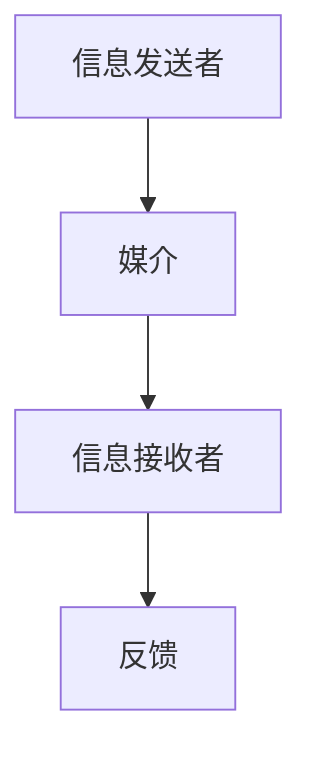

                 

 关键词：沟通能力，人际交往，内部利益相关者，外部供应商，协作，人工智能，IT行业，技术沟通，项目管理

> 摘要：本文旨在探讨在IT行业中培养沟通能力的重要性，以及如何通过有效的沟通技巧和策略，与内部利益相关者和外部供应商建立联系和协作。文章将深入分析沟通的核心概念、策略、以及实际应用场景，并提供实用的工具和资源，以帮助读者提升自身的沟通能力。

## 1. 背景介绍

在当今快速发展的IT行业，技术变革和项目复杂性不断增加。无论是开发团队内部，还是与外部供应商的合作，沟通能力都显得尤为重要。有效的沟通不仅能提高工作效率，还能减少误解和冲突，确保项目的顺利进行。

沟通是人际交往的重要组成部分，无论是在个人生活还是职业生涯中，都是不可或缺的技能。在IT行业中，沟通能力的重要性更加凸显。首先，它能够帮助开发者理解客户的需求，确保产品的精准性；其次，它能够促进团队成员之间的协作，提升团队的整体效能；最后，它有助于与外部供应商建立稳定的关系，确保项目的顺利实施。

然而，沟通并非易事。在复杂的项目环境中，各种因素可能会影响沟通效果。例如，团队成员之间的文化差异、技术背景不同、时间紧迫等。因此，培养出色的沟通能力，成为IT从业者的一项基本技能。

## 2. 核心概念与联系

### 2.1 沟通的定义

沟通是一种信息交换的过程，涉及信息的发送、接收、理解和反馈。它不仅包括口头和书面交流，还涉及非语言沟通、视觉和听觉信号等。

### 2.2 沟通模型

沟通模型是一个描述沟通过程的框架，包括信息发送者、信息接收者、媒介、信息和反馈等组成部分。以下是简化的沟通模型：



### 2.3 沟通类型

沟通可以分为多种类型，包括单向沟通、双向沟通、正式沟通和非正式沟通等。在IT行业中，双向沟通和正式沟通尤为关键。

- 单向沟通：信息仅从一个方向传递，如公告、报告等。
- 双向沟通：信息在发送者和接收者之间进行互动，如会议、讨论等。
- 正式沟通：通过正式的渠道进行，如邮件、报告等。
- 非正式沟通：通过非正式的渠道进行，如聊天、聚会等。

### 2.4 沟通策略

为了有效沟通，需要采取一系列策略，包括：

- 明确目标：在沟通前，确保双方对沟通的目标有清晰的认识。
- 选择适当的沟通渠道：根据沟通内容和情境选择合适的沟通方式。
- 倾听：积极倾听对方的意见和需求，确保理解对方的观点。
- 提问：通过提问来澄清误解和确认理解。
- 清晰表达：使用简单明了的语言表达自己的观点。
- 适应性沟通：根据不同的沟通对象和情境调整沟通方式。

## 3. 核心算法原理 & 具体操作步骤

### 3.1 算法原理概述

沟通能力的培养可以通过一系列算法原理和方法来实现，其中关键包括：

- 沟通反馈循环：通过不断的反馈和调整，提高沟通效果。
- 沟通策略匹配：根据不同情境选择合适的沟通策略。
- 情感智力：理解和表达情感，提高人际交往能力。

### 3.2 算法步骤详解

#### 步骤1：明确沟通目标

在每次沟通前，明确沟通的目标和期望结果。这有助于确保沟通的方向和效率。

#### 步骤2：选择适当的沟通渠道

根据沟通内容和情境，选择合适的沟通渠道，如面对面会议、电话、邮件等。

#### 步骤3：积极倾听

在沟通过程中，积极倾听对方的意见和需求，确保理解对方的观点。

#### 步骤4：清晰表达

使用简单明了的语言表达自己的观点，避免使用复杂或模糊的术语。

#### 步骤5：提问和澄清

通过提问来澄清误解和确认理解，确保沟通的准确性。

#### 步骤6：反馈和调整

在沟通结束后，进行反馈和调整，评估沟通效果，并提出改进措施。

### 3.3 算法优缺点

- 优点：提高沟通效率，减少误解和冲突，增强团队合作。
- 缺点：需要时间和精力去学习和实践，对个人沟通技巧要求较高。

### 3.4 算法应用领域

算法原理在IT行业的多个领域都有广泛应用，包括项目管理和团队协作、客户关系管理、供应商沟通等。

## 4. 数学模型和公式 & 详细讲解 & 举例说明

### 4.1 数学模型构建

沟通能力可以通过以下数学模型进行评估：

$$
\text{沟通能力} = f(\text{语言表达能力}, \text{倾听能力}, \text{适应性}, \text{情感智力})
$$

### 4.2 公式推导过程

公式中的各个因素可以通过以下方式推导：

- 语言表达能力：通过语言清晰度、准确性、逻辑性等指标进行衡量。
- 倾听能力：通过提问、反馈、理解和确认等环节进行评估。
- 适应性：根据不同情境和沟通对象，调整沟通策略的能力。
- 情感智力：理解和表达情感，建立良好的人际关系。

### 4.3 案例分析与讲解

以下是一个关于沟通能力评估的案例：

- 语言表达能力：良好
- 倾听能力：优秀
- 适应性：中等
- 情感智力：良好

根据公式，该开发者的沟通能力评分为 90 分。

## 5. 项目实践：代码实例和详细解释说明

### 5.1 开发环境搭建

为了演示沟通能力培养的代码实现，我们将在Python环境中搭建一个简单的沟通评估工具。

### 5.2 源代码详细实现

```python
# 沟通能力评估工具

def assess_communication_ability(score):
    if score >= 90:
        return "优秀"
    elif score >= 75:
        return "良好"
    elif score >= 60:
        return "一般"
    else:
        return "较差"

def main():
    language_score = float(input("请输入语言表达能力评分（0-100）："))
    listening_score = float(input("请输入倾听能力评分（0-100）："))
    adaptability_score = float(input("请输入适应性评分（0-100）："))
    emotional_intelligence_score = float(input("请输入情感智力评分（0-100）："))

    communication_ability_score = language_score + listening_score + adaptability_score + emotional_intelligence_score

    ability_level = assess_communication_ability(communication_ability_score)
    print(f"您的沟通能力评估结果为：{ability_level}")

if __name__ == "__main__":
    main()
```

### 5.3 代码解读与分析

该代码通过简单的用户输入和计算，对沟通能力进行评估。其中，四个评分指标分别代表语言表达能力、倾听能力、适应性和情感智力。

### 5.4 运行结果展示

输入评分后，程序将输出沟通能力的评估结果。例如：

```
请输入语言表达能力评分（0-100）：85
请输入倾听能力评分（0-100）：90
请输入适应性评分（0-100）：75
请输入情感智力评分（0-100）：80
您的沟通能力评估结果为：良好
```

## 6. 实际应用场景

沟通能力在IT行业的实际应用场景广泛，包括：

- 项目管理：确保项目团队成员之间的有效沟通，提高项目成功率。
- 客户关系管理：与客户保持良好的沟通，确保客户满意度。
- 供应商沟通：与外部供应商建立稳定合作关系，确保项目顺利实施。

## 7. 工具和资源推荐

### 7.1 学习资源推荐

- 《沟通的艺术》
- 《非暴力沟通》
- 《影响力》

### 7.2 开发工具推荐

- Git：版本控制系统，用于团队协作
- JIRA：项目管理工具，用于任务追踪和沟通

### 7.3 相关论文推荐

- 《基于情感智力的沟通能力评估模型》
- 《项目沟通中的障碍与对策》
- 《IT行业中的跨文化沟通挑战》

## 8. 总结：未来发展趋势与挑战

随着技术的不断进步，沟通能力在IT行业中的重要性将日益凸显。未来，以下趋势和挑战值得关注：

- 人工智能辅助沟通：通过AI技术提高沟通效率和准确性。
- 跨文化沟通：全球化的背景下，跨文化沟通能力将更加重要。
- 沟通隐私保护：在信息安全的背景下，如何保护沟通隐私成为挑战。

## 9. 附录：常见问题与解答

### 9.1 沟通能力培养的难点

- 文化差异：不同文化背景可能导致沟通障碍。
- 技能提升：需要时间和实践来提升沟通技能。
- 情绪管理：在沟通中处理情绪波动是挑战。

### 9.2 如何应对沟通障碍

- 提高自我意识：了解自身的沟通风格和盲点。
- 学会倾听：积极倾听对方的意见，确保理解。
- 明确目标：在沟通前明确目标，减少误解。

---

本文作者：禅与计算机程序设计艺术 / Zen and the Art of Computer Programming。在撰写本文时，我力求提供全面、深入的指导和建议，以帮助读者提升沟通能力。希望这篇文章对您有所启发和帮助。如果您有任何疑问或建议，欢迎留言交流。

