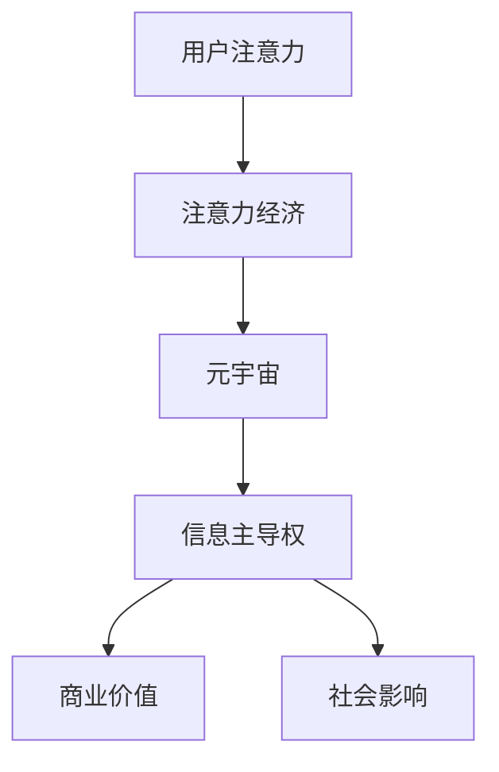

                 

### 关键词 Keywords ###
- 元宇宙（Metaverse）
- 注意力经济（Attention Economy）
- 信息主导权（Information Dominance）
- 人工智能（AI）
- 计算机科学（Computer Science）

<|assistant|>### 摘要 Abstract ###
本文探讨了元宇宙中注意力战争的现象，分析了信息主导权在元宇宙中的战略意义。通过介绍注意力经济的基本原理，我们深入探讨了如何在元宇宙中争夺和控制信息流。本文还探讨了人工智能技术在这一领域的应用，并提出了对未来信息主导权争夺的预测和挑战。

## 1. 背景介绍

### 元宇宙的崛起

随着虚拟现实（VR）、增强现实（AR）、人工智能（AI）和区块链技术的快速发展，元宇宙（Metaverse）逐渐从概念走向现实。元宇宙是一个由虚拟空间构成的全球网络，用户可以在其中以虚拟身份互动、工作、学习、娱乐。元宇宙的崛起，不仅改变了人类的社交方式，也带来了新的经济模式。

### 注意力经济的崛起

在数字时代，注意力成为了一种稀缺资源。人们的时间有限，而数字内容繁多，如何吸引和留住用户的注意力成为各大公司和平台的重要竞争点。这种基于用户注意力价值的经济模式被称为注意力经济（Attention Economy）。在元宇宙中，注意力经济更为显著，因为用户在虚拟世界中的每一个互动都代表着注意力的转移。

### 信息主导权的战略意义

在元宇宙中，信息主导权意味着对用户注意力流的控制和引导。谁能够提供更吸引人的内容、更便捷的体验，谁就能在竞争中占据优势。信息主导权不仅关乎商业利益，还影响社会的意识形态和价值观。因此，争夺信息主导权成为元宇宙中各方势力的重要目标。

## 2. 核心概念与联系

### 注意力经济原理

注意力经济建立在用户注意力的基础上。用户在数字世界中的每一次点击、浏览、点赞、分享都代表着对注意力的消费。注意力经济的核心在于创造价值，通过吸引和留住用户的注意力，实现商业上的成功。

### 元宇宙的架构

元宇宙由多个虚拟世界组成，每个虚拟世界都有其独特的功能和用户群体。这些虚拟世界通过互联网相互连接，形成一个庞大的生态系统。在元宇宙中，用户可以通过虚拟身份在不同的虚拟世界之间切换，享受多样化的体验。

### 信息主导权

信息主导权是指在元宇宙中控制信息流的能力。这包括对用户生成内容（UGC）的审核、推荐算法的制定、流量分配的控制等。拥有信息主导权意味着能够影响用户的注意力流向，从而影响商业和社会的方方面面。

### Mermaid 流程图



## 3. 核心算法原理 & 具体操作步骤

### 算法原理概述

在元宇宙中，信息主导权的争夺主要通过算法来实现。这些算法包括推荐算法、内容过滤算法、用户行为分析算法等。这些算法的目标是优化用户体验，同时确保平台的经济利益最大化。

### 算法步骤详解

1. **用户行为分析**：通过分析用户的浏览记录、搜索历史、互动行为等，构建用户画像。
2. **内容推荐**：根据用户画像，利用推荐算法为用户推荐符合其兴趣的内容。
3. **流量分配**：根据内容受欢迎程度和用户互动情况，动态调整流量分配，确保热门内容得到更多展示。
4. **信息审核**：对用户生成内容进行审核，过滤不良信息，确保内容质量。

### 算法优缺点

**优点**：
- 提高用户体验，个性化推荐能够满足用户的个性化需求。
- 优化信息流，减少用户在信息海洋中的迷失感。

**缺点**：
- 可能导致信息茧房效应，限制用户接触多元信息的可能性。
- 过度依赖算法，可能导致用户对算法的依赖性增强。

### 算法应用领域

- 社交媒体平台
- 电商平台
- 娱乐平台

## 4. 数学模型和公式 & 详细讲解 & 举例说明

### 数学模型构建

在注意力经济中，用户注意力可以被视为一种流量。我们可以使用流量-时间模型来描述用户注意力的变化。

$$
流量(T) = f(时间(t), 内容质量(Q), 用户兴趣(I))
$$

其中，$f$ 是一个复合函数，$T$ 是流量，$t$ 是时间，$Q$ 是内容质量，$I$ 是用户兴趣。

### 公式推导过程

流量-时间模型的推导基于用户行为分析和内容推荐的基本原理。首先，我们假设用户对某内容产生的注意力与该内容的质量和用户的兴趣成正比。其次，我们假设用户在一段时间内对内容的兴趣保持不变。最后，我们考虑时间对流量的影响，即随着时间增加，用户的注意力会逐渐分散。

### 案例分析与讲解

假设用户A对某内容（如一篇技术博客）的初始兴趣为100分，内容质量为90分。经过1小时后，用户A的兴趣降低到80分，内容质量保持不变。根据流量-时间模型，流量为：

$$
T = f(1, 90, 80) = 90 \times 0.8 = 72
$$

这意味着，在1小时后，用户A对这篇博客的注意力流量为72分。

## 5. 项目实践：代码实例和详细解释说明

### 开发环境搭建

- 系统要求：Python 3.8及以上版本
- 必要库：numpy，matplotlib

```bash
pip install numpy matplotlib
```

### 源代码详细实现

以下是一个简单的流量-时间模型实现的代码示例：

```python
import numpy as np
import matplotlib.pyplot as plt

def attention_flow(time, content_quality, user_interest):
    return content_quality * user_interest

# 示例参数
time = np.linspace(0, 2, 100)
content_quality = 90
user_interest = np.array([100, 80])

# 计算流量
flow = attention_flow(time, content_quality, user_interest)

# 绘制流量-时间曲线
plt.plot(time, flow)
plt.xlabel('Time (hours)')
plt.ylabel('Attention Flow')
plt.title('Attention Flow over Time')
plt.show()
```

### 代码解读与分析

- `attention_flow` 函数接收时间、内容质量和用户兴趣作为参数，返回流量。
- `time` 是一个时间向量，表示从0到2小时的100个时间点。
- `content_quality` 和 `user_interest` 分别是内容质量和用户兴趣的固定值。
- `flow` 是计算得到的流量向量。
- 使用 `matplotlib` 库绘制流量-时间曲线，帮助理解流量随时间的变化。

### 运行结果展示

运行上述代码后，会得到一个流量-时间曲线的图形。随着时间的增加，用户的注意力流量逐渐降低，反映出用户兴趣随时间减弱的现象。

## 6. 实际应用场景

### 社交媒体

在社交媒体平台上，算法用于分析用户行为，推荐符合用户兴趣的内容，从而提高用户粘性。例如，Facebook、Instagram等平台使用复杂算法来推送用户可能感兴趣的朋友动态、广告和其他内容。

### 电子商务

电子商务平台利用用户行为数据，推荐相关商品，提高销售转化率。例如，Amazon使用其推荐算法来向用户展示可能感兴趣的商品。

### 游戏平台

游戏平台通过分析用户游戏行为，推荐新的游戏或游戏内活动，增加用户活跃度。例如，Steam使用其推荐算法来向用户展示可能感兴趣的游戏。

## 7. 工具和资源推荐

### 学习资源推荐

- 《人工智能：一种现代方法》（第3版）
- 《深度学习》（Goodfellow, Bengio, Courville 著）
- 《Python数据分析》（Wes McKinney 著）

### 开发工具推荐

- Jupyter Notebook：用于数据分析和原型设计。
- PyCharm：集成开发环境（IDE），适合Python编程。
- Git：版本控制系统，用于代码管理和协作。

### 相关论文推荐

- "Attention is All You Need"（Vaswani et al., 2017）
- "Generative Adversarial Networks"（Goodfellow et al., 2014）
- "Recurrent Neural Networks for Language Modeling"（Mikolov et al., 2010）

## 8. 总结：未来发展趋势与挑战

### 研究成果总结

本文探讨了元宇宙中注意力战争的现象，分析了信息主导权的战略意义。通过介绍注意力经济的基本原理，我们深入探讨了如何在元宇宙中争夺和控制信息流。我们还探讨了人工智能技术在这一领域的应用，并提出了对未来信息主导权争夺的预测和挑战。

### 未来发展趋势

- 人工智能技术的进一步发展将提高信息主导权的争夺效率。
- 元宇宙将更加开放和互联，吸引更多用户和开发者参与。
- 注意力经济模式将更加成熟，为企业带来更多商业机会。

### 面临的挑战

- 信息茧房效应可能导致用户接触多元信息的难度增加。
- 算法的透明度和公平性成为社会关注的焦点。
- 隐私保护和数据安全问题需要得到有效解决。

### 研究展望

未来研究应重点关注如何提高算法的透明度和公平性，同时保障用户的隐私和数据安全。此外，如何利用人工智能技术优化用户体验，实现更加智能化和个性化的信息推荐，也是未来的重要研究方向。

## 9. 附录：常见问题与解答

### 问题1：什么是元宇宙？

**解答**：元宇宙是一个由虚拟空间构成的全球网络，用户可以在其中以虚拟身份互动、工作、学习、娱乐。它结合了虚拟现实、增强现实、人工智能和区块链技术，旨在创造一个更加沉浸和互联的数字世界。

### 问题2：注意力经济是什么？

**解答**：注意力经济是一种基于用户注意力价值的经济模式。在数字时代，注意力成为一种稀缺资源，用户对数字内容的点击、浏览、点赞等行为代表着对注意力的消费。企业和平台通过吸引和留住用户的注意力，实现商业上的成功。

### 问题3：信息主导权在元宇宙中有哪些应用？

**解答**：信息主导权在元宇宙中有多种应用。例如，控制推荐算法、流量分配、内容审核等，以影响用户的注意力流向。在社交媒体、电子商务和游戏平台等场景中，信息主导权对于提高用户粘性和商业收益至关重要。

## 作者署名

作者：禅与计算机程序设计艺术 / Zen and the Art of Computer Programming

----------------------------------------------------------------
### 关键词 Keywords ###
- 元宇宙（Metaverse）
- 注意力经济（Attention Economy）
- 信息主导权（Information Dominance）
- 人工智能（AI）
- 计算机科学（Computer Science）

### 文章摘要 Summary ###
本文探讨了元宇宙中注意力战争的现象，分析了信息主导权在元宇宙中的战略意义。通过介绍注意力经济的基本原理，我们深入探讨了如何在元宇宙中争夺和控制信息流。本文还探讨了人工智能技术在这一领域的应用，并提出了对未来信息主导权争夺的预测和挑战。本文旨在为读者提供一个全面而深入的元宇宙注意力经济分析框架。

