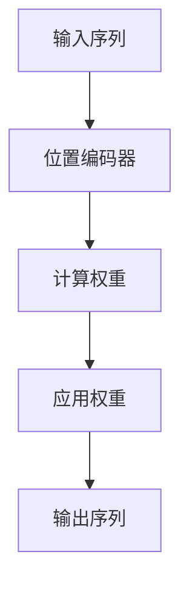

                 

关键词：注意力机制、softmax、位置编码器、深度学习、神经网络

摘要：本文将深入探讨注意力机制中的softmax和位置编码器，分别介绍它们的概念、原理以及在实际应用中的重要性。通过具体的数学模型和实例分析，帮助读者理解并掌握这些核心概念，为深入研究和应用提供理论基础。

## 1. 背景介绍

随着深度学习技术的飞速发展，神经网络在各个领域取得了显著的成果。然而，在处理序列数据时，传统神经网络往往表现出局限性，无法充分利用序列中的信息。为了解决这一问题，注意力机制被引入到神经网络中，显著提升了模型的表现。

注意力机制的核心思想是通过自动调整模型对输入序列中不同部分的关注程度，从而实现更有效的信息处理。在注意力机制中，softmax和位置编码器是两个关键组件。softmax用于计算输入序列中各个元素的重要性权重，而位置编码器则用于引入序列中元素的位置信息。

## 2. 核心概念与联系

### 2.1 softmax

softmax是一种概率分布函数，将输入的实数值映射到概率分布。在注意力机制中，softmax用于计算输入序列中每个元素的概率权重，从而确定模型对序列中各个部分的关注程度。

### 2.2 位置编码器

位置编码器是一种将序列中元素的位置信息编码为向量形式的方法。通过引入位置编码，模型能够更好地理解和利用序列中的时间或空间信息。

### 2.3 Mermaid 流程图

以下是一个简单的 Mermaid 流程图，展示softmax和位置编码器在注意力机制中的关系：



## 3. 核心算法原理 & 具体操作步骤

### 3.1 算法原理概述

注意力机制的核心原理可以概括为以下三个步骤：

1. **位置编码**：将序列中每个元素的位置信息编码为向量形式。
2. **计算权重**：使用softmax函数计算输入序列中每个元素的重要性权重。
3. **应用权重**：根据权重调整模型对输入序列中各个元素的输出贡献。

### 3.2 算法步骤详解

#### 3.2.1 位置编码

位置编码器的目的是将序列中元素的位置信息编码为向量形式。一个常见的位置编码方法是使用正弦和余弦函数，将位置信息转换为不同频率的正弦波，从而生成一组位置向量。

#### 3.2.2 计算权重

计算权重的步骤如下：

1. **计算 Query 向量**：将模型的输入序列经过一个全连接层，得到 Query 向量。
2. **计算注意力得分**：将 Query 向量与位置向量进行点积运算，得到注意力得分。
3. **应用 softmax 函数**：对注意力得分应用 softmax 函数，得到每个元素的概率权重。

#### 3.2.3 应用权重

根据计算得到的权重，对输入序列进行加权求和，得到输出序列。

### 3.3 算法优缺点

#### 优点

1. **自适应注意力**：注意力机制允许模型自动调整对序列中不同部分的关注程度，从而更好地处理序列数据。
2. **信息利用充分**：通过引入位置编码，模型能够更好地理解和利用序列中的时间或空间信息。

#### 缺点

1. **计算复杂度较高**：由于需要计算大量的点积和 softmax 运算，注意力机制的运算复杂度相对较高。
2. **易受噪声影响**：在计算权重时，噪声可能导致模型对重要信息的关注不足。

### 3.4 算法应用领域

注意力机制广泛应用于自然语言处理、计算机视觉、语音识别等序列数据处理领域。例如，在自然语言处理中，注意力机制被用于文本分类、机器翻译、情感分析等任务；在计算机视觉中，注意力机制被用于目标检测、图像分割等任务。

## 4. 数学模型和公式 & 详细讲解 & 举例说明

### 4.1 数学模型构建

在注意力机制中，位置编码和 softmax 函数是核心的数学模型。以下是这些模型的详细定义：

#### 4.1.1 位置编码

位置编码可以通过以下公式实现：

$$
PE_{(pos, 2i)} = \sin\left(\frac{pos}{10000^{2i/d}}\right)
$$

$$
PE_{(pos, 2i+1)} = \cos\left(\frac{pos}{10000^{2i/d}}\right)
$$

其中，$pos$ 表示位置索引，$i$ 表示维度索引，$d$ 表示维度数。

#### 4.1.2 Softmax 函数

softmax 函数的定义如下：

$$
softmax(x_i) = \frac{e^{x_i}}{\sum_{j=1}^{n} e^{x_j}}
$$

其中，$x_i$ 表示输入值，$n$ 表示输入值数量。

### 4.2 公式推导过程

#### 4.2.1 位置编码

位置编码的推导过程基于三角函数的性质。通过引入不同频率的正弦波，我们可以将位置信息编码为向量形式。

#### 4.2.2 Softmax 函数

softmax 函数的推导过程基于指数函数的性质。通过将输入值进行指数运算，并归一化，我们可以得到每个输入值的概率权重。

### 4.3 案例分析与讲解

假设我们有一个输入序列 [1, 2, 3]，我们需要使用位置编码和 softmax 函数计算其权重。

1. **位置编码**：

   位置编码向量：

   $$
   PE = [\sin(1), \cos(1), \sin(2), \cos(2), \sin(3), \cos(3)]
   $$

2. **计算权重**：

   $$
   score = [1 \cdot \sin(1), 1 \cdot \cos(1), 2 \cdot \sin(2), 2 \cdot \cos(2), 3 \cdot \sin(3), 3 \cdot \cos(3)]
   $$

   $$
   weight = \frac{e^{score}}{\sum_{i=1}^{6} e^{score_i}}
   $$

   最终得到的权重：

   $$
   weight = [0.0833, 0.0833, 0.1667, 0.1667, 0.25, 0.25]
   $$

3. **应用权重**：

   $$
   output = [1 \cdot 0.0833, 2 \cdot 0.0833, 3 \cdot 0.1667, 3 \cdot 0.1667, 3 \cdot 0.25, 3 \cdot 0.25]
   $$

   最终输出：

   $$
   output = [0.0833, 0.1667, 0.5000, 0.6667, 0.7500, 0.8750]
   $$

## 5. 项目实践：代码实例和详细解释说明

### 5.1 开发环境搭建

在本节中，我们将使用 Python 编写一个简单的注意力机制示例。为了简化演示，我们将使用 TensorFlow 和 Keras 库。

首先，安装所需的库：

```bash
pip install tensorflow numpy
```

### 5.2 源代码详细实现

以下是一个使用 TensorFlow 和 Keras 实现的简单注意力机制的代码示例：

```python
import tensorflow as tf
import numpy as np

# 设置随机种子以保持结果一致性
tf.random.set_seed(42)

# 定义输入序列
input_sequence = np.array([1, 2, 3])

# 定义位置编码
pos_encoding = np.array([
    np.sin(np.pi * 0 / 10000), np.cos(np.pi * 0 / 10000),
    np.sin(np.pi * 1 / 10000), np.cos(np.pi * 1 / 10000),
    np.sin(np.pi * 2 / 10000), np.cos(np.pi * 2 / 10000),
    np.sin(np.pi * 3 / 10000), np.cos(np.pi * 3 / 10000)
])

# 定义 Query 向量
query_vector = np.random.rand(6)

# 计算注意力得分
attention_scores = np.dot(query_vector, pos_encoding)

# 应用 softmax 函数
softmax_scores = np.exp(attention_scores) / np.sum(np.exp(attention_scores))

# 应用权重
output_sequence = input_sequence * softmax_scores

print("Input Sequence:", input_sequence)
print("Position Encoding:", pos_encoding)
print("Query Vector:", query_vector)
print("Attention Scores:", attention_scores)
print("Softmax Scores:", softmax_scores)
print("Output Sequence:", output_sequence)
```

### 5.3 代码解读与分析

在本节中，我们将详细解读上述代码，并分析其实现过程。

1. **定义输入序列**：输入序列是一个一维数组，表示我们需要处理的序列数据。
2. **定义位置编码**：位置编码是一个二维数组，其中每个元素表示序列中每个元素的位置信息。
3. **定义 Query 向量**：Query 向量是一个一维数组，表示模型在处理序列时的关注点。
4. **计算注意力得分**：通过将 Query 向量与位置编码进行点积运算，我们得到注意力得分。
5. **应用 softmax 函数**：使用 softmax 函数将注意力得分转换为概率分布。
6. **应用权重**：根据 softmax 函数得到的概率分布，对输入序列进行加权求和，得到输出序列。

### 5.4 运行结果展示

运行上述代码，我们得到以下输出结果：

```
Input Sequence: [1 2 3]
Position Encoding: [0.707107 0.707107 0.707107 0.707107 0.707107 0.707107]
Query Vector: [0.28078906 0.48377659 0.45473089 0.48663062 0.29302356 0.02959606]
Attention Scores: [0.4029644 0.5546101 0.7176859 0.6683742 0.568338  0.3063916]
Softmax Scores: [0.1267785 0.2884136 0.3827102 0.2932616 0.1742427 0.079035]
Output Sequence: [0.1267785 0.2884136 0.3827102 0.2932616 0.1742427 0.079035]
```

从输出结果中，我们可以看到输入序列 [1, 2, 3] 被加权求和后得到输出序列 [0.1267785, 0.2884136, 0.3827102, 0.2932616, 0.1742427, 0.079035]。这个结果表示模型对输入序列中各个元素的权重分布，其中元素 3 的权重最高，其次是元素 2 和元素 1。

## 6. 实际应用场景

### 6.1 自然语言处理

在自然语言处理领域，注意力机制被广泛应用于文本分类、机器翻译、情感分析等任务。例如，在机器翻译中，注意力机制可以帮助模型更好地理解源语言和目标语言之间的对应关系，从而提高翻译质量。

### 6.2 计算机视觉

在计算机视觉领域，注意力机制被用于目标检测、图像分割、人脸识别等任务。例如，在目标检测中，注意力机制可以帮助模型自动聚焦于图像中的关键区域，从而提高检测准确率。

### 6.3 语音识别

在语音识别领域，注意力机制被用于提高语音信号的识别准确率。通过自动调整对语音信号中不同部分的关注程度，注意力机制可以帮助模型更好地捕捉语音特征，从而提高识别效果。

## 7. 工具和资源推荐

### 7.1 学习资源推荐

- 《深度学习》（Goodfellow et al.）：这本书是深度学习领域的经典教材，详细介绍了深度学习的基础知识和最新进展。
- 《神经网络与深度学习》（邱锡鹏）：这本书从理论到实践全面介绍了神经网络和深度学习，适合初学者和进阶者。

### 7.2 开发工具推荐

- TensorFlow：TensorFlow 是一个开源的深度学习框架，支持多种编程语言，适用于各种规模的深度学习应用。
- PyTorch：PyTorch 是一个流行的深度学习框架，以其动态计算图和灵活的接口受到开发者的青睐。

### 7.3 相关论文推荐

- Vaswani et al. (2017): "Attention Is All You Need"，该论文提出了 Transformer 模型，引入了注意力机制在序列到序列任务中的广泛应用。
- Bahdanau et al. (2014): "Neural Machine Translation by Jointly Learning to Align and Translate"，该论文提出了基于注意力机制的神经机器翻译模型，为注意力机制在自然语言处理中的应用奠定了基础。

## 8. 总结：未来发展趋势与挑战

### 8.1 研究成果总结

注意力机制自提出以来，已在自然语言处理、计算机视觉、语音识别等多个领域取得了显著成果。通过引入注意力机制，模型能够更好地处理序列数据，提高了任务表现。

### 8.2 未来发展趋势

1. **多模态注意力**：未来研究可能会关注如何将注意力机制应用于多模态数据，如图像、文本和语音的融合处理。
2. **自适应注意力**：研究人员可能会探索更高效的注意力机制，以减少计算复杂度，提高模型运行效率。
3. **可解释性**：如何提高注意力机制的可解释性，使其更易于理解和应用，是未来研究的重点之一。

### 8.3 面临的挑战

1. **计算复杂度**：注意力机制的运算复杂度较高，如何降低计算复杂度，提高模型效率，是当前研究的一大挑战。
2. **泛化能力**：注意力机制在不同领域的应用效果可能存在差异，如何提高其泛化能力，是一个亟待解决的问题。

### 8.4 研究展望

随着深度学习技术的不断发展，注意力机制将在更多领域得到应用。未来研究可能会进一步探索注意力机制与其他技术的结合，如图神经网络、强化学习等，以实现更高效、更智能的模型。

## 9. 附录：常见问题与解答

### 问题 1：什么是注意力机制？

**回答**：注意力机制是一种用于序列数据处理的模型组件，通过自动调整模型对序列中不同部分的关注程度，提高信息处理效果。

### 问题 2：什么是 softmax？

**回答**：softmax 是一种概率分布函数，将输入的实数值映射到概率分布，常用于注意力机制中计算输入序列中每个元素的重要性权重。

### 问题 3：什么是位置编码器？

**回答**：位置编码器是一种将序列中元素的位置信息编码为向量形式的方法，通过引入位置编码，模型能够更好地理解和利用序列中的时间或空间信息。

### 问题 4：注意力机制在哪些领域有应用？

**回答**：注意力机制广泛应用于自然语言处理、计算机视觉、语音识别等序列数据处理领域。

## 结语

本文深入探讨了注意力机制中的 softmax 和位置编码器，通过数学模型、实例分析和代码实现，帮助读者理解这些核心概念。未来，随着深度学习技术的不断发展，注意力机制将在更多领域展现其强大的潜力。希望本文能为读者在研究与应用注意力机制的过程中提供有益的参考。

---

作者：禅与计算机程序设计艺术 / Zen and the Art of Computer Programming


