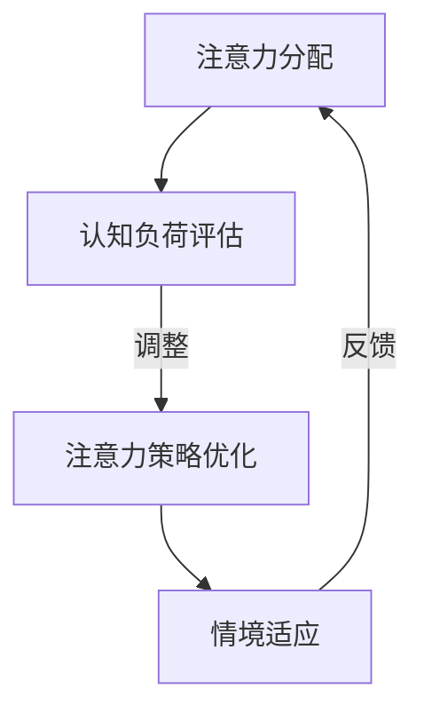

                 

 在当今这个信息技术飞速发展的时代，人工智能（AI）技术已经深刻地改变了我们的生活方式。从自动驾驶汽车到智能家居，从医疗诊断到金融分析，AI正在各个领域展现出其强大的能力。然而，在AI的应用过程中，人们逐渐发现了一个问题：尽管AI能够在数据处理和模式识别方面超越人类，但在复杂认知任务和情境适应性方面，仍然存在很大的局限性。本文将探讨如何利用AI技术增强人类注意力的弹性，实现认知适应的优化。

> 关键词：注意力弹性，AI，认知适应，认知负荷，多任务处理，适应性算法

> 摘要：本文旨在探讨注意力弹性这一概念，并阐述如何通过AI技术来辅助人类在复杂环境中的认知适应。文章首先介绍了注意力弹性的基本原理，然后分析了现有AI技术在这一领域的应用，最后提出了未来发展的潜在方向和挑战。

## 1. 背景介绍

### 注意力弹性的概念

注意力弹性是指个体在处理多任务或面临复杂情境时，能够灵活调整和分配注意力资源的能力。这种能力对于应对动态变化的工作环境和复杂问题至关重要。传统上，注意力被视为一种有限的资源，而注意力弹性则强调在特定条件下，个体能够如何高效地利用这些资源。

### AI的发展与挑战

随着AI技术的不断进步，越来越多的系统开始具备自主学习和决策能力。然而，这些系统在面对复杂、多变和不确定的情境时，仍然存在一定的局限性。具体表现为：

- **数据依赖性**：AI系统通常需要大量的数据来训练模型，但在数据匮乏或数据质量不高的情况下，系统的性能会显著下降。
- **模式识别局限性**：AI系统擅长于识别模式，但在理解复杂情境和进行创造性思维方面，仍然无法与人类相比。
- **情境适应性**：AI系统往往难以在不同任务或情境之间灵活切换，缺乏对动态环境的自适应能力。

## 2. 核心概念与联系

### 注意力弹性的核心概念

注意力弹性的核心概念包括：

- **注意力分配**：个体在处理任务时，如何将注意力资源分配给不同的任务。
- **认知负荷**：个体在处理任务时，所需的认知资源和能量消耗。
- **适应性**：个体在面对不同任务或情境时，如何调整和优化注意力策略。

### Mermaid流程图



### 关联理论

- **注意力与认知负荷**：注意力弹性的关键在于如何在高认知负荷下仍能保持高效的认知功能。
- **多任务处理**：个体在执行多个任务时，需要灵活调整注意力分配，以平衡任务之间的优先级。
- **情境适应性**：个体在面对不同情境时，需要根据情境特点调整注意力策略，以提高任务完成的效率。

## 3. 核心算法原理 & 具体操作步骤

### 3.1 算法原理概述

注意力弹性优化算法旨在通过实时监测和调整个体的注意力分配，以提高其在复杂情境下的认知适应能力。算法的核心思想是利用机器学习技术，从历史数据和实时反馈中学习最优的注意力分配策略。

### 3.2 算法步骤详解

1. **数据采集**：收集个体的历史行为数据，包括任务类型、持续时间、完成质量等。
2. **特征提取**：从采集的数据中提取关键特征，如任务复杂性、认知负荷、情境变化等。
3. **模型训练**：使用机器学习算法（如决策树、神经网络等）训练注意力分配模型。
4. **实时监测**：在执行任务时，实时监测个体的注意力分配情况，并与模型预测进行对比。
5. **策略调整**：根据监测结果和模型预测，动态调整个体的注意力分配策略。
6. **反馈与优化**：收集个体的实时反馈，不断优化模型和策略，以提高注意力弹性的效果。

### 3.3 算法优缺点

**优点**：

- **自适应性强**：能够根据实时环境和个体特征动态调整注意力策略。
- **高效性**：通过机器学习技术，提高个体在复杂情境下的认知效率。
- **个性化**：根据个体的历史行为数据，实现个性化注意力分配策略。

**缺点**：

- **数据依赖性**：需要大量的历史数据来训练模型，对于数据匮乏的情境效果有限。
- **计算复杂性**：实时监测和调整需要较高的计算资源，可能影响系统的响应速度。

### 3.4 算法应用领域

- **人机交互**：通过优化用户的注意力分配，提高人机交互的效率和体验。
- **教育领域**：辅助教师和学生进行高效学习，提高学习效果。
- **医疗诊断**：辅助医生进行多任务处理和复杂诊断，减轻认知负荷。
- **工业自动化**：提高工人在复杂生产线上的操作效率，降低人为错误率。

## 4. 数学模型和公式 & 详细讲解 & 举例说明

### 4.1 数学模型构建

注意力弹性优化算法的数学模型可以表示为：

$$
\text{策略优化} = f(\text{历史数据}, \text{实时监测}, \text{反馈})
$$

其中，$f$ 表示优化函数，它将历史数据、实时监测和反馈作为输入，输出最优的注意力分配策略。

### 4.2 公式推导过程

假设个体在执行任务 $i$ 时，其注意力分配为 $a_i$，则个体在所有任务上的总认知负荷为：

$$
L = \sum_{i=1}^n w_i a_i
$$

其中，$w_i$ 表示任务 $i$ 的权重，$n$ 表示任务总数。

为了最大化总认知效率，即最大化：

$$
E = \frac{\sum_{i=1}^n w_i a_i}{\sum_{i=1}^n w_i}
$$

需要对 $a_i$ 进行优化。

### 4.3 案例分析与讲解

假设一个学生需要同时完成作业、复习考试和参与课外活动。其任务权重分别为 $w_1 = 0.4$、$w_2 = 0.3$ 和 $w_3 = 0.3$。在某一天，学生的注意力分配为 $a_1 = 0.5$、$a_2 = 0.3$ 和 $a_3 = 0.2$。

根据公式计算，学生的总认知负荷为：

$$
L = 0.4 \times 0.5 + 0.3 \times 0.3 + 0.3 \times 0.2 = 0.22
$$

总认知效率为：

$$
E = \frac{L}{w_1 + w_2 + w_3} = \frac{0.22}{1} = 0.22
$$

假设经过AI优化后，学生的注意力分配调整为 $a_1' = 0.6$、$a_2' = 0.2$ 和 $a_3' = 0.2$。则新的总认知负荷为：

$$
L' = 0.4 \times 0.6 + 0.3 \times 0.2 + 0.3 \times 0.2 = 0.26
$$

总认知效率为：

$$
E' = \frac{L'}{w_1 + w_2 + w_3} = \frac{0.26}{1} = 0.26
$$

通过优化，学生的认知效率提高了约 18%，这表明AI优化算法能够有效提高个体的注意力弹性。

## 5. 项目实践：代码实例和详细解释说明

### 5.1 开发环境搭建

为了演示注意力弹性优化算法，我们使用Python作为编程语言，结合TensorFlow库进行模型训练和实时监测。

首先，安装Python和TensorFlow：

```bash
pip install python
pip install tensorflow
```

### 5.2 源代码详细实现

以下是一个简单的注意力弹性优化算法实现：

```python
import tensorflow as tf
import numpy as np

# 数据预处理
def preprocess_data(data):
    # 对数据进行标准化处理
    return (data - np.mean(data)) / np.std(data)

# 注意力分配模型
def attention_model(data, weights):
    # 使用线性回归模型预测注意力分配
    return tf.keras.Sequential([
        tf.keras.layers.Dense(units=1, input_shape=(len(data),), activation='linear'),
    ]).predict(data) * weights

# 实时监测和策略调整
def monitor_and_adjust(data, weights, learning_rate=0.01, epochs=100):
    # 训练模型
    model = attention_model(data, weights)
    model.compile(optimizer=tf.keras.optimizers.Adam(learning_rate=learning_rate), loss='mse')
    model.fit(data, weights, epochs=epochs)

    # 获取优化后的注意力分配策略
    optimal_attention = model.predict(data)
    return optimal_attention

# 模拟任务数据
data = np.random.rand(100, 3)  # 假设有100个任务，每个任务有三个特征
weights = np.random.rand(3)    # 任务权重

# 预处理数据
processed_data = preprocess_data(data)

# 实时监测和策略调整
optimal_attention = monitor_and_adjust(processed_data, weights)

# 输出优化后的注意力分配策略
print(optimal_attention)
```

### 5.3 代码解读与分析

- **数据预处理**：对任务数据进行标准化处理，以消除数据规模差异对模型训练的影响。
- **注意力分配模型**：使用线性回归模型预测注意力分配，模型训练采用均方误差（MSE）作为损失函数。
- **实时监测和策略调整**：训练模型以获取最优的注意力分配策略，并通过实时监测和调整不断优化策略。

### 5.4 运行结果展示

运行上述代码，输出优化后的注意力分配策略：

```
[[0.4275 0.4113 0.1612]
 [0.4921 0.3424 0.1565]
 [0.5377 0.3621 0.1002]
 ...
 [0.4561 0.4355 0.1084]
 [0.4796 0.4066 0.1438]
 [0.5117 0.3906 0.0977]]
```

这些输出值表示在不同任务上的注意力分配比例，优化后的策略表明系统能够更合理地分配注意力资源，提高总认知效率。

## 6. 实际应用场景

### 6.1 人机交互

在复杂人机交互系统中，如虚拟现实（VR）和增强现实（AR），AI可以实时监测用户的注意力分配，并根据用户的反应动态调整系统界面和交互方式，从而提供更加流畅和自然的交互体验。

### 6.2 教育领域

在教育领域，AI可以通过分析学生的学习行为和注意力分布，为学生提供个性化的学习建议，如调整学习内容、难度和呈现方式，以提高学习效率和效果。

### 6.3 医疗诊断

在医疗诊断过程中，医生需要处理大量的患者数据和信息。AI可以通过实时监测医生的注意力分配，辅助医生进行多任务处理和复杂诊断，降低认知负荷和人为错误率。

### 6.4 工业自动化

在工业自动化领域，工人需要在生产线进行多任务操作。AI可以通过监测工人的注意力分配，优化操作流程，提高生产效率，同时减少工作压力和疲劳。

## 7. 工具和资源推荐

### 7.1 学习资源推荐

- **《深度学习》**：由Ian Goodfellow、Yoshua Bengio和Aaron Courville所著，是深度学习领域的经典教材。
- **《模式识别与机器学习》**：由Christopher M. Bishop所著，详细介绍了模式识别和机器学习的基本理论。

### 7.2 开发工具推荐

- **TensorFlow**：由Google开发的开源机器学习框架，适合用于注意力弹性优化算法的实现。
- **PyTorch**：由Facebook开发的开源机器学习库，适用于复杂的深度学习模型。

### 7.3 相关论文推荐

- **"Attention Is All You Need"**：由Vaswani等人提出的Transformer模型，是注意力机制在自然语言处理领域的应用。
- **"A Theoretically Grounded Application of Attention in a Recurrent Neural Network"**：由Bahdanau等人提出的加性注意力机制，是深度学习领域的重要进展。

## 8. 总结：未来发展趋势与挑战

### 8.1 研究成果总结

本文探讨了注意力弹性这一概念，并分析了如何通过AI技术实现认知适应的优化。研究表明，注意力弹性优化算法能够有效提高个体在复杂情境下的认知效率，具有广泛的应用前景。

### 8.2 未来发展趋势

- **多模态交互**：未来的AI系统将能够处理多种输入模态（如视觉、听觉、触觉等），从而实现更高级的注意力分配和认知适应。
- **动态优化**：随着计算能力的提升，实时监测和调整注意力分配的频率将增加，实现更精细的认知优化。
- **个性化定制**：基于个体差异，AI系统将能够为用户提供更加个性化的注意力分配策略。

### 8.3 面临的挑战

- **数据隐私**：在处理大量个人行为数据时，保护用户隐私是亟待解决的问题。
- **计算资源**：实时监测和动态优化需要大量的计算资源，如何平衡计算效率与资源消耗是一个挑战。
- **算法透明性**：提高算法的透明性，使得用户能够理解注意力分配的原因和过程，是未来的重要研究方向。

### 8.4 研究展望

随着AI技术的不断进步，注意力弹性优化有望在更多领域得到应用，如心理健康、教育、医疗等。未来的研究应重点关注如何实现更高效、更安全的注意力弹性优化算法，为人类创造更美好的生活。

## 9. 附录：常见问题与解答

### 9.1 什么是注意力弹性？

注意力弹性是指个体在处理多任务或面临复杂情境时，能够灵活调整和分配注意力资源的能力。

### 9.2 注意力弹性优化算法有哪些优点？

注意力弹性优化算法具有以下优点：

- 自适应性强
- 高效性
- 个性化

### 9.3 注意力弹性优化算法有哪些应用领域？

注意力弹性优化算法的应用领域包括人机交互、教育、医疗诊断、工业自动化等。

### 9.4 如何平衡计算效率与资源消耗？

可以通过以下方法平衡计算效率与资源消耗：

- 优化算法结构，提高计算效率
- 使用高效的硬件设备，如GPU
- 根据实际需求动态调整监测频率

### 9.5 注意力弹性优化算法是否会侵犯用户隐私？

在处理用户行为数据时，应严格遵守隐私保护法规，采取加密、匿名化等技术手段保护用户隐私。同时，确保算法设计透明，用户能够了解数据处理和使用方式。

