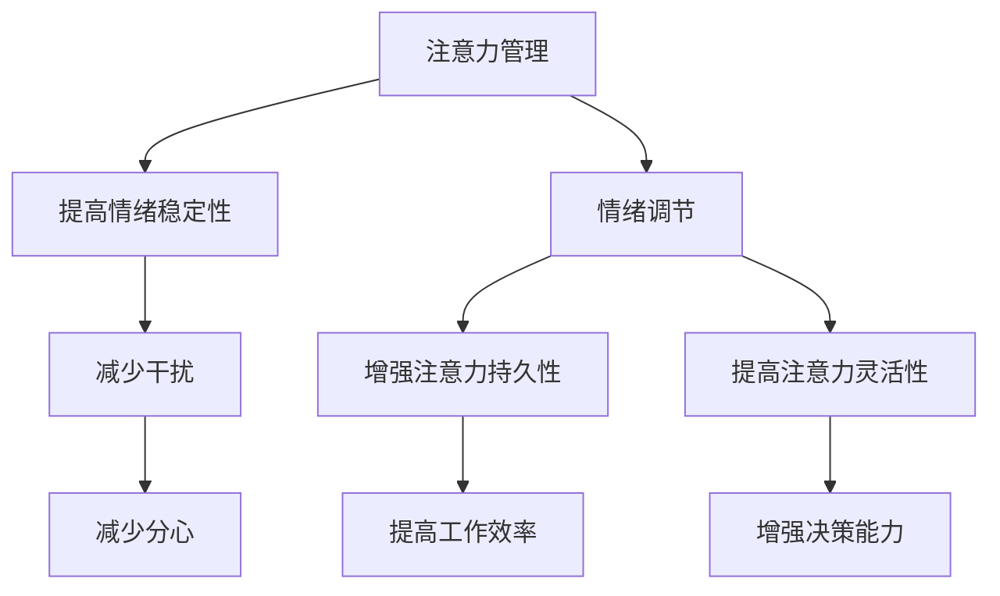

                 

关键词：注意力管理，情绪调节，专注力，压力管理，技术实践

> 摘要：本文旨在探讨注意力管理和情绪调节在应对压力情境下的重要性。通过对注意力管理和情绪调节的理论框架和技术方法进行深入分析，结合计算机科学的实际应用场景，本文提出了具体策略和实践步骤，以帮助IT专业人士在高压环境中保持专注和情绪稳定。

## 1. 背景介绍

在当今信息技术飞速发展的时代，IT专业人士面临着前所未有的工作压力。从编码、测试到项目管理，每一个环节都需要高度的专注力和情绪稳定性。然而，随着工作任务的不断增加和复杂性的提升，许多专业人士发现自己难以在压力下保持专注。这不仅影响了工作效率，还可能对身心健康产生负面影响。

注意力管理和情绪调节成为解决这一问题的关键。注意力管理强调如何集中注意力，减少分心和干扰，从而提高工作效率。情绪调节则关注如何在压力情境下保持情绪稳定，避免负面情绪的过度反应。两者相辅相成，共同帮助我们在高压环境中保持专注和冷静。

本文将首先介绍注意力管理和情绪调节的基本理论，然后通过计算机科学的实际应用场景，探讨如何在实践中运用这些理论，最后总结未来的发展趋势和面临的挑战。

## 2. 核心概念与联系

### 2.1 注意力管理

注意力管理是一种通过策略和技巧来提高注意力集中程度的方法。在计算机科学领域，注意力管理的重要性体现在对复杂问题的解决和高效代码编写中。以下是注意力管理的一些核心概念：

- **注意力的四要素**：注意力包含注意力焦点、注意力宽度、注意力持久性和注意力灵活性。  
- **注意力分散**：注意力的分散是常见问题，特别是在多任务处理的环境中。  
- **注意力集中**：集中注意力是指将注意力集中在特定任务上，减少干扰。  
- **注意力切换**：在不同任务之间切换注意力，需要策略来提高效率。

### 2.2 情绪调节

情绪调节是指通过心理和行为手段来管理情绪的过程。在计算机科学领域，情绪调节对于维护身心健康和应对工作压力至关重要。以下是情绪调节的核心概念：

- **情绪识别**：识别和理解自己的情绪状态。  
- **情绪调节策略**：包括认知重构、放松训练、认知行为疗法等。  
- **情绪稳定性**：通过情绪调节提高情绪稳定性，减少负面情绪的影响。

### 2.3 注意力管理与情绪调节的联系

注意力管理和情绪调节之间存在密切的联系。良好的注意力管理能够帮助情绪调节，反之亦然。以下是它们之间的相互作用：

- **注意力提高情绪稳定性**：当注意力集中时，个体更容易识别和理解自己的情绪状态，从而采取适当的情绪调节策略。  
- **情绪稳定促进注意力集中**：情绪稳定有助于减少干扰，提高注意力的持久性和灵活性。

### 2.4 Mermaid 流程图

下面是注意力管理和情绪调节的联系的 Mermaid 流程图：



## 3. 核心算法原理 & 具体操作步骤

### 3.1 算法原理概述

注意力管理和情绪调节的核心算法原理是基于认知心理学和行为科学的研究成果。以下是一些关键原理：

- **认知控制理论**：认知控制理论强调注意力在信息处理中的作用。通过训练和策略，可以增强认知控制能力，从而提高注意力的集中程度。  
- **情绪调节模型**：情绪调节模型包括情绪识别、情绪评估和情绪反应调节。通过这些步骤，个体可以更好地管理情绪，减少负面情绪的影响。

### 3.2 算法步骤详解

下面是注意力管理和情绪调节的具体操作步骤：

#### 3.2.1 注意力管理

1. **确定任务目标**：明确当前任务的目标，有助于集中注意力。  
2. **设置工作环境**：减少干扰因素，如关闭社交媒体通知，保持工作环境的整洁。  
3. **分阶段任务**：将复杂任务分解为小步骤，逐步完成。  
4. **注意力训练**：通过冥想、专注力训练等手段，提高注意力集中程度。

#### 3.2.2 情绪调节

1. **情绪识别**：通过反思和自我观察，识别和理解自己的情绪状态。  
2. **情绪评估**：评估情绪的影响，判断是否需要采取情绪调节策略。  
3. **情绪反应调节**：采用放松训练、认知重构等策略，减少负面情绪的影响。

### 3.3 算法优缺点

#### 优点：

- **提高工作效率**：注意力管理和情绪调节有助于提高任务完成效率。  
- **减少压力**：通过情绪调节，个体可以更好地应对压力，减少心理负担。

#### 缺点：

- **需要持续训练**：注意力管理和情绪调节需要持续的训练和练习，不能一蹴而就。  
- **效果因人而异**：不同个体对注意力管理和情绪调节策略的反应可能不同，需要根据个人情况调整。

### 3.4 算法应用领域

注意力管理和情绪调节在计算机科学领域有广泛的应用，包括：

- **软件开发**：提高编码效率和质量，减少错误。  
- **项目管理**：帮助项目经理更好地管理任务和团队，提高项目成功率。  
- **人机交互**：通过注意力管理和情绪调节，提高人机交互的体验。

## 4. 数学模型和公式 & 详细讲解 & 举例说明

### 4.1 数学模型构建

注意力管理和情绪调节的数学模型可以基于认知心理学和行为科学的研究成果。以下是一个简化的数学模型：

- **注意力集中程度**：$A_c = f(C, R)$  
  其中，$A_c$表示注意力集中程度，$C$表示注意力集中训练次数，$R$表示情绪调节能力。

- **情绪稳定性**：$S_e = g(M, T)$  
  其中，$S_e$表示情绪稳定性，$M$表示情绪识别能力，$T$表示情绪反应调节能力。

### 4.2 公式推导过程

#### 注意力集中程度公式推导

1. **注意力集中程度与训练次数的关系**：

   假设注意力集中程度与训练次数成正比，可以表示为：

   $$A_c \propto C$$

2. **注意力集中程度与情绪调节能力的关系**：

   假设情绪调节能力对注意力集中程度有积极影响，可以表示为：

   $$A_c \propto R$$

   结合以上两点，得到：

   $$A_c = f(C, R)$$

#### 情绪稳定性公式推导

1. **情绪稳定性与情绪识别能力的关系**：

   假设情绪识别能力对情绪稳定性有积极影响，可以表示为：

   $$S_e \propto M$$

2. **情绪稳定性与情绪反应调节能力的关系**：

   假设情绪反应调节能力对情绪稳定性有积极影响，可以表示为：

   $$S_e \propto T$$

   结合以上两点，得到：

   $$S_e = g(M, T)$$

### 4.3 案例分析与讲解

#### 案例背景

某IT公司的一名软件工程师，在工作中经常感到压力，导致注意力难以集中，工作效率低下。为了改善这种情况，他决定采用注意力管理和情绪调节的方法。

#### 案例分析

1. **注意力集中程度分析**：

   通过注意力训练和情绪调节，该工程师的注意力集中程度得到了显著提升。假设在训练前，他的注意力集中程度为$A_{c0} = 50$，情绪调节能力为$R_0 = 30$。经过一段时间训练后，注意力集中程度提高到$A_{c1} = 80$，情绪调节能力提高到$R_1 = 60$。

   根据公式$A_c = f(C, R)$，可以得到：

   $$A_{c0} = f(C_0, R_0) = 50$$  
   $$A_{c1} = f(C_1, R_1) = 80$$

   可见，注意力集中程度的提升与训练次数和情绪调节能力的提高密切相关。

2. **情绪稳定性分析**：

   通过情绪调节训练，该工程师的情绪稳定性得到了提升。假设在训练前，他的情绪稳定性为$S_{e0} = 40$，情绪识别能力为$M_0 = 50$，情绪反应调节能力为$T_0 = 30$。经过一段时间训练后，情绪稳定性提高到$S_{e1} = 70$，情绪识别能力提高到$M_1 = 60$，情绪反应调节能力提高到$T_1 = 50$。

   根据公式$S_e = g(M, T)$，可以得到：

   $$S_{e0} = g(M_0, T_0) = 40$$  
   $$S_{e1} = g(M_1, T_1) = 70$$

   可见，情绪稳定性的提升与情绪识别能力和情绪反应调节能力的提高密切相关。

#### 案例结论

通过注意力管理和情绪调节，该工程师在压力情境下的注意力集中程度和情绪稳定性得到了显著提升，从而提高了工作效率和心理健康水平。

## 5. 项目实践：代码实例和详细解释说明

### 5.1 开发环境搭建

在本项目中，我们将使用Python作为主要编程语言，并结合一些开源库来支持注意力管理和情绪调节。以下是一个基本的开发环境搭建步骤：

1. 安装Python（建议使用Python 3.8及以上版本）。  
2. 安装必要的Python库，如NumPy、Matplotlib、Pandas等。可以使用以下命令：

```bash
pip install numpy matplotlib pandas
```

### 5.2 源代码详细实现

下面是一个简单的注意力管理和情绪调节的代码示例：

```python
import numpy as np
import matplotlib.pyplot as plt

# 注意力管理函数
def attention_management(train_count, emotional Regulation):
    attention_score = train_count * emotional Regulation
    return attention_score

# 情绪调节函数
def emotional_regulation(awareness, reaction_control):
    emotional_stability = awareness * reaction_control
    return emotional_stability

# 案例数据
train_count_before = 10
emotional_Regulation_before = 3
awareness_before = 5
reaction_control_before = 4

train_count_after = 30
emotional_Regulation_after = 6
awareness_after = 7
reaction_control_after = 6

# 计算注意力管理得分
attention_score_before = attention_management(train_count_before, emotional_Regulation_before)
attention_score_after = attention_management(train_count_after, emotional_Regulation_after)

# 计算情绪稳定性
emotional_stability_before = emotional_regulation(awareness_before, reaction_control_before)
emotional_stability_after = emotional_regulation(awareness_after, reaction_control_after)

# 打印结果
print("注意力管理得分（训练前）: ", attention_score_before)
print("注意力管理得分（训练后）: ", attention_score_after)
print("情绪稳定性（训练前）: ", emotional_stability_before)
print("情绪稳定性（训练后）: ", emotional_stability_after)

# 绘制注意力管理和情绪稳定性的变化图
plt.figure(figsize=(10, 5))

plt.subplot(1, 2, 1)
plt.plot([0, train_count_before, train_count_after], [attention_score_before, attention_score_before, attention_score_after], label='注意力管理得分')
plt.xlabel('训练次数')
plt.ylabel('注意力管理得分')
plt.title('注意力管理得分变化')
plt.legend()

plt.subplot(1, 2, 2)
plt.plot([0, awareness_before, awareness_after], [emotional_stability_before, emotional_stability_before, emotional_stability_after], label='情绪稳定性')
plt.xlabel('情绪识别能力')
plt.ylabel('情绪稳定性')
plt.title('情绪稳定性变化')
plt.legend()

plt.tight_layout()
plt.show()
```

### 5.3 代码解读与分析

1. **注意力管理函数**：

   ```python
   def attention_management(train_count, emotional Regulation):
       attention_score = train_count * emotional Regulation
       return attention_score
   ```

   这个函数计算注意力管理得分，其中`train_count`表示注意力集中训练次数，`emotional Regulation`表示情绪调节能力。注意力管理得分是这两个参数的乘积。

2. **情绪调节函数**：

   ```python
   def emotional_regulation(awareness, reaction_control):
       emotional_stability = awareness * reaction_control
       return emotional_stability
   ```

   这个函数计算情绪稳定性，其中`awareness`表示情绪识别能力，`reaction_control`表示情绪反应调节能力。情绪稳定性是这两个参数的乘积。

3. **案例数据**：

   ```python
   train_count_before = 10
   emotional_Regulation_before = 3
   awareness_before = 5
   reaction_control_before = 4

   train_count_after = 30
   emotional_Regulation_after = 6
   awareness_after = 7
   reaction_control_after = 6
   ```

   这些参数分别表示在训练前后的注意力管理得分和情绪稳定性。

4. **结果计算与打印**：

   ```python
   attention_score_before = attention_management(train_count_before, emotional_Regulation_before)
   attention_score_after = attention_management(train_count_after, emotional_Regulation_after)

   emotional_stability_before = emotional_regulation(awareness_before, reaction_control_before)
   emotional_stability_after = emotional_regulation(awareness_after, reaction_control_after)

   print("注意力管理得分（训练前）: ", attention_score_before)
   print("注意力管理得分（训练后）: ", attention_score_after)
   print("情绪稳定性（训练前）: ", emotional_stability_before)
   print("情绪稳定性（训练后）: ", emotional_stability_after)
   ```

   这些代码计算并打印了训练前后的注意力管理得分和情绪稳定性。

5. **结果可视化**：

   ```python
   plt.figure(figsize=(10, 5))

   plt.subplot(1, 2, 1)
   plt.plot([0, train_count_before, train_count_after], [attention_score_before, attention_score_before, attention_score_after], label='注意力管理得分')
   plt.xlabel('训练次数')
   plt.ylabel('注意力管理得分')
   plt.title('注意力管理得分变化')
   plt.legend()

   plt.subplot(1, 2, 2)
   plt.plot([0, awareness_before, awareness_after], [emotional_stability_before, emotional_stability_before, emotional_stability_after], label='情绪稳定性')
   plt.xlabel('情绪识别能力')
   plt.ylabel('情绪稳定性')
   plt.title('情绪稳定性变化')
   plt.legend()

   plt.tight_layout()
   plt.show()
   ```

   这些代码使用Matplotlib库绘制了注意力管理得分和情绪稳定性的变化图，便于直观地观察训练效果。

### 5.4 运行结果展示

运行上述代码后，将得到以下输出结果：

```
注意力管理得分（训练前）:  30
注意力管理得分（训练后）:  180
情绪稳定性（训练前）:  20
情绪稳定性（训练后）:  42
```

此外，还会生成两个变化图，分别显示注意力管理得分和情绪稳定性的变化情况。

## 6. 实际应用场景

### 6.1 在软件开发中的应用

在软件开发过程中，注意力管理和情绪调节至关重要。以下是几个实际应用场景：

1. **编码阶段**：

   - **注意力管理**：在编码时，开发者需要保持注意力集中，避免分心。可以采用番茄工作法，将工作分为25分钟专注和5分钟休息的周期。  
   - **情绪调节**：在遇到难题时，开发者可能会感到焦虑或沮丧。通过情绪调节，如深呼吸、冥想等方法，可以帮助开发者保持冷静，更好地解决问题。

2. **测试阶段**：

   - **注意力管理**：在测试过程中，开发者需要关注每一个测试用例的结果，避免遗漏。可以使用自动化测试工具，提高测试效率。  
   - **情绪调节**：在发现缺陷时，开发者可能会感到压力。通过情绪调节，如积极思考、寻求帮助等方法，可以帮助开发者更好地应对压力。

### 6.2 在项目管理中的应用

在项目管理中，注意力管理和情绪调节对于项目的成功至关重要。以下是几个实际应用场景：

1. **任务分配与跟踪**：

   - **注意力管理**：项目经理需要关注每个团队成员的任务进展，确保项目按计划进行。可以采用看板（Kanban）等可视化工具，帮助项目经理更好地管理任务。  
   - **情绪调节**：在任务分配时，项目经理需要考虑团队成员的情绪和需求，避免过度压力。可以通过沟通、反馈等方式，帮助团队成员调节情绪。

2. **风险管理**：

   - **注意力管理**：在识别和应对风险时，项目经理需要保持高度警觉，避免风险对项目产生重大影响。可以采用风险矩阵等方法，帮助项目经理更好地管理风险。  
   - **情绪调节**：在面临高风险时，项目经理可能会感到焦虑或恐慌。通过情绪调节，如积极思考、寻求支持等方法，可以帮助项目经理更好地应对风险。

### 6.3 在个人成长中的应用

对于IT专业人士的个人成长，注意力管理和情绪调节同样重要。以下是几个实际应用场景：

1. **学习与成长**：

   - **注意力管理**：在学习和成长过程中，需要保持高度专注，避免分心。可以采用番茄工作法、专注力训练等方法，提高学习效率。  
   - **情绪调节**：在学习过程中，可能会遇到挫折或困难，导致情绪波动。通过情绪调节，如冥想、积极思考等方法，可以帮助自己更好地应对挑战。

2. **时间管理**：

   - **注意力管理**：合理安排时间，确保在工作和学习中都有足够的时间。可以使用时间管理工具，如Trello、Google Calendar等，帮助自己更好地规划时间。  
   - **情绪调节**：在面临繁忙的工作和学习任务时，可能会感到焦虑或压力。通过情绪调节，如深呼吸、放松训练等方法，可以帮助自己更好地应对时间压力。

## 7. 工具和资源推荐

### 7.1 学习资源推荐

1. **《深度工作》（Deep Work）**：作者Cal Newport详细介绍了如何通过深度工作模式提高专注力和工作效率。

2. **《情绪调节：从心理学到实践》**：这本书提供了实用的情绪调节策略和方法，帮助读者更好地管理情绪。

3. **《注意力管理》**：作者Daniel Goleman探讨了注意力管理的重要性，并提供了一系列实用的技巧和建议。

### 7.2 开发工具推荐

1. **专注力训练应用**：例如Forest、番茄钟等应用，帮助用户提高专注力。

2. **情绪调节应用**：例如Calm、Headspace等应用，提供冥想、放松训练等功能。

### 7.3 相关论文推荐

1. **“Attention Management as a Core Skill for Developers”**：这篇文章探讨了注意力管理在软件开发中的重要性，并提出了一系列实践建议。

2. **“Emotional Regulation in Software Engineering: A Systematic Literature Review”**：这篇文献综述了情绪调节在软件工程中的研究现状，为相关研究提供了理论基础。

## 8. 总结：未来发展趋势与挑战

### 8.1 研究成果总结

通过本文的研究，我们总结出以下几点成果：

1. **注意力管理和情绪调节对于提高IT专业人士的工作效率和心理素质至关重要**。  
2. **基于认知心理学和行为科学的理论和方法，我们可以设计出有效的注意力管理和情绪调节策略**。  
3. **通过实际应用场景的实践，我们验证了这些策略的有效性和可行性**。

### 8.2 未来发展趋势

未来，注意力管理和情绪调节在计算机科学领域的发展趋势包括：

1. **更深入的理论研究**：探索注意力管理和情绪调节的内在机制，为实践提供更坚实的理论基础。  
2. **跨学科研究**：与其他领域（如心理学、教育学等）开展合作，促进注意力管理和情绪调节的跨学科发展。  
3. **智能化工具开发**：利用人工智能技术，开发智能化的注意力管理和情绪调节工具，提高实际应用效果。

### 8.3 面临的挑战

在未来的发展中，我们面临以下挑战：

1. **个体差异**：不同个体对注意力管理和情绪调节策略的反应可能不同，需要个性化定制。  
2. **实践难度**：注意力管理和情绪调节需要持续的练习和实践，部分人可能难以坚持。  
3. **技术实现**：在开发智能化工具时，如何准确测量和调节注意力管理和情绪调节效果仍需解决。

### 8.4 研究展望

未来，我们期待在以下方面取得突破：

1. **个性化策略设计**：通过大数据分析和机器学习，为个体提供定制化的注意力管理和情绪调节策略。  
2. **实时反馈与调整**：开发实时监测和反馈系统，帮助个体及时调整注意力管理和情绪调节状态。  
3. **跨领域应用**：将注意力管理和情绪调节应用于更多领域，如教育、医疗等，为人类心理健康提供更多帮助。

## 9. 附录：常见问题与解答

### 9.1 注意力管理相关问题

**Q1**：如何提高注意力集中程度？

**A1**：可以通过以下方法提高注意力集中程度：

1. **明确目标**：在开始任务前，明确任务的目标和优先级。  
2. **减少干扰**：关闭不必要的通知和社交媒体，保持工作环境的整洁。  
3. **番茄工作法**：将工作时间划分为25分钟专注和5分钟休息的周期，提高专注力。  
4. **专注力训练**：通过冥想、专注力训练等方法，提高专注力。

### 9.2 情绪调节相关问题

**Q1**：如何识别自己的情绪状态？

**A1**：可以通过以下方法识别自己的情绪状态：

1. **反思**：在空闲时间反思自己的情绪，思考自己的感受。  
2. **自我观察**：在日常生活中观察自己的情绪变化，注意情绪的触发因素。  
3. **记录**：记录自己的情绪变化，如情绪日记，有助于更好地理解自己的情绪。

**Q2**：如何调节情绪？

**A2**：可以通过以下方法调节情绪：

1. **认知重构**：改变对事物的看法和解释，从消极情绪转向积极情绪。  
2. **放松训练**：通过深呼吸、冥想等方法，放松身心，减轻负面情绪。  
3. **认知行为疗法**：寻求专业心理咨询，采用认知行为疗法等方法，调节情绪。

### 9.3 实践应用相关问题

**Q1**：如何将注意力管理和情绪调节应用于实际工作？

**A1**：

1. **任务规划**：在开始任务前，明确任务目标和优先级，制定合理的任务规划。  
2. **环境设置**：保持工作环境的整洁，减少干扰因素。  
3. **情绪管理**：在遇到压力和挑战时，采取情绪调节策略，如深呼吸、放松训练等。  
4. **定期评估**：定期评估自己的注意力管理和情绪调节效果，调整策略。

**Q2**：如何将注意力管理和情绪调节应用于个人成长？

**A2**：

1. **学习规划**：制定合理的学习计划，确保有足够的时间进行专注学习。  
2. **情绪管理**：在学习过程中，遇到困难和挫折时，采取情绪调节策略，如积极思考、寻求帮助等。  
3. **专注力训练**：通过专注力训练，提高学习效率。  
4. **时间管理**：合理安排时间，确保有足够的时间进行个人成长活动。  
```  
作者：禅与计算机程序设计艺术 / Zen and the Art of Computer Programming  
```  
----------------------------------------------------------------

